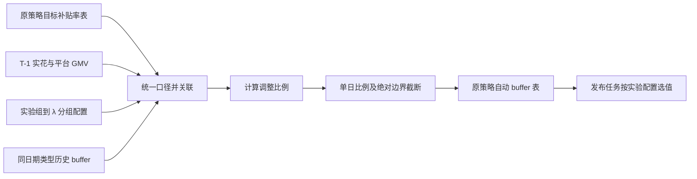

# 3.6 Buffer 自动调整——策略侧 TODO 路线

> [!summary] 项目目标
> 每天使用 T-1 的原策略目标供需补贴率、同实验组实际供需补贴率和同日期类型历史 buffer，按城市、实验组、λ 分组自动校准并发布新的 `union_buffer`，降低目标供需补贴率与实际供需补贴率之间的偏差。

## 1. 背景与范围

### 1.1 背景

当前 buffer 主要依赖人工配置。为了减少目标供需补贴率与实际供需补贴率之间的偏差，需要在现有 buffer 发布链路中增加日级自动校准能力。

新策略算法负责输出城市目标供需补贴率；buffer 发布任务独立完成以下工作：

1. 读取目标供需补贴率；
2. 读取 T-1 日实花和平台 GMV；
3. 读取对应日期类型的历史 buffer；
4. 计算新的 `union_buffer`；
5. 将结果写入自动 buffer 表并供发布任务使用。

### 1.2 本期范围

- 原策略目标补贴率接入；
- 原策略自动 buffer 计算；
- 城市、实验组、λ 分组维度的日级调整；
- 周一至周四、周五至周日两套 buffer 分别维护；
- buffer 上下限和单日调整比例限制；
- 异常兜底、状态记录、监控告警；
- 影子运行、灰度、回滚能力。

### 1.3 本期明确不做

- 不重新执行全国预算腾挪；
- 不回写或修改策略结果表中的目标供需补贴率；
- 暂不实现全国少花后按城市统一乘二次系数；
- 暂不把运营临时补贴率直接写入策略结果表；
- 不改变人工 buffer 实验组原有发布逻辑。

> [!note] 后续候选能力
> 如果历史运行中大量城市持续触达 `2.99`、全国仍明显少花，再单独评估“全国层二次校正”。运营临时补贴率建议作为独立的高优先级覆盖配置，而不是修改策略产出的目标率。

## 2. 表与数据链路

### 2.1 表规划

| 类型 | 原始表 | 新增表 |
|---|---|---|
| 补贴率表 | `kflower_strategy.platform_price_anchor_union_strategy_budget_dict` | `kflower_strategy.platform_price_anchor_union_strategy_budget_guardrail_dict` |
| 人工/现有 buffer 表 | `kflower_strategy.platform_union_strategy_budget_buffer_by_city_object_stg` | — |
| 原策略自动 buffer 表 | — | `kflower_strategy.platform_union_strategy_budget_buffer_auto_baseline_by_city_object_stg` |
| 新策略自动 buffer 表 | — | `kflower_strategy.platform_union_strategy_budget_buffer_auto_guardrail_by_city_object_stg` |

可用于验证实验分流和 λ 分组命中的联合决策日志表：

```text
kflower_marketplace.ods_log_kflower_platform_call_return_public_log_h
```

运营侧城市级口径涉及的主要数据表：

| 数据内容 | 数据表 |
|---|---|
| 当日城市实际完单 GMV | `kflower_dw.dwm_kf_dri_unity_order_index_di` |
| 当日盒子实际完单 GMV | `kflower_dw.dwm_kf_dri_unity_order_index_di`，以预算控制看板口径为准 |
| 供需 C 实花 | `kflower_finance.dm_kf_fin_yy_subsidy_c_di` |
| 供需 C 规划率和规划 GMV | `kflower_marketplace.dups_meta_city_platform_budget_plan_result` |
| 平台流量 C 实花 | `kflower_app.dm_kf_fin_subsidy_strategy_metrics_di` |
| 城市级运营汇总看板 | `platform_subsidy_city_daily_metrics_di`，当前 SQL 未写库名，需补全 |

本期首先完成：

```text
原策略目标补贴率表
    → 原策略自动 buffer 计算任务
    → platform_union_strategy_budget_buffer_auto_baseline_by_city_object_stg
```

后续将同一套计算引擎参数化，接入 guardrail 目标补贴率表，写入 guardrail 自动 buffer 表。

### 2.2 结果表业务字段

与原表保持一致：

| 字段 | 含义 | 备注 |
|---|---|---|
| `city_id` | 城市 ID | 计算粒度之一 |
| `object_group` | 优化目标 | 需要确认是否参与实验组关联 |
| `stg_group` | λ 分组/线上策略版本 | 当前描述存在语义冲突，必须确认 |
| `union_buffer` | 联合决策 buffer | 最终发布值 |

建议保留分区：

```text
dt
date_type    -- weekday / weekend
```

如果表结构不能增加 `date_type`，则必须通过历史 `dt` 推导日期类型，并要求发布任务按目标日期类型读取最近一次同类型分区。

### 2.3 数据流



## 3. P0：开发前必须确认的口径

> [!danger] 这些口径未确认前，不应接入正式发布。

- [ ] 确认目标表中哪个字段是“全国预算调整后、buffer 调整前”的目标供需补贴率。
- [/] 最新运营看板已将 `PJZ202502170009` 单独沉淀为联合决策呼返实花，强烈支持将其作为实际率分子；仍需业务最终确认，以及确认退款、冲正和追溯数据的处理方式。
- [/] 城市级实际 GMV 和规划 GMV 来源已提供；仍需确认实验组/λ 分组归因后的 GMV 与目标率使用完全一致的城市平台 GMV 口径。
- [ ] 确认目标率和实际率的数值单位，例如统一使用 `0.03` 表示 3%。
- [/] 实验组字段已初步定位为 public 日志中的 `ExpGroupName`；仍需确认目标表、实花表和运筹配置中的对应字段，以及 `Group` 与 `ExpGroupName` 的区别。
- [ ] 确认 `object_group` 是否是实验组、优化目标，或只是结果表中的另一维度。
- [/] λ 分组已初步定位为 public 日志中的 `LambdaGroup`；仍需确认它能否直接写入结果表的 `stg_group`。
- [ ] 确认自动实验组、人工实验组的配置来源和生效时间规则。
- [ ] 确认没有历史自动 buffer 时是否使用人工 buffer 作为冷启动值。
- [ ] 确认 `${BIZ_DATE_LINE}` 代表任务运行日、数据日还是产出分区日。
- [ ] 确认自动 buffer 表的完整 DDL、分区字段和发布任务读分区方式。
- [ ] 确认目标率为 0、实际率为 0 时的业务兜底规则。

### 3.1 当前最重要的结构冲突

需求要求 buffer 按以下粒度分别维护：

```text
城市 × stg_group × 日期类型
```

但当前展示的结果字段中没有 `date_type`。推荐优先级如下：

1. **推荐**：自动 buffer 表增加 `date_type` 分区，四个业务字段保持不变；
2. 表结构绝对不能修改时：用历史 `dt` 推导日期类型，并在读取历史值和发布时都选择最近一次同类型分区；
3. 不建议只读取前一天 buffer，因为周四和周五属于不同日期类型，会串用两套状态。

### 3.2 联合决策 public 日志补充结论

联合决策 V3 日志文档表明，下面这张 public 日志中同时存在实验组和 λ 分组信息：

```text
kflower_marketplace.ods_log_kflower_platform_call_return_public_log_h
```

关键字段及初步业务含义：

| 日志字段 | 文档含义 | 本项目中的初步用途 |
|---|---|---|
| `ExpGroupName` | 实验组名 | 作为 `experiment_group` 的首选候选字段 |
| `Group` | 实验组名 | 与 `ExpGroupName` 含义重复，需工程确认二者差异 |
| `LambdaGroup` | lambda 分组 | 作为 `lambda_group`，并验证是否映射到结果表 `stg_group` |
| `Allow` | `true` 表示命中实验 | 过滤真实命中的实验流量 |
| `platform_joint_price` | `1` 表示联合决策 V3 | 过滤联合决策 V3 流量 |
| `subsidy_type` | `1` 为区县补贴率，`0` 为城市补贴率 | 本需求若只使用城市补贴率，候选过滤条件为 `0` |
| `spanid` | 接口 ID，具体含义待补充 | 可能用于与实花/调用链关联，但当前不能直接依赖 |

因此可初步定义：

```text
experiment_group = ExpGroupName
lambda_group = LambdaGroup
```

日志初步过滤条件：

```sql
WHERE dt = '${T_MINUS_1}'
  AND platform_joint_price = 1
  AND Allow = true
```

如果确认本需求只处理城市补贴率，再增加：

```sql
AND subsidy_type = 0
```

> [!important] 日志不能直接替代运筹配置
> public 日志只能反映当日实际产生流量、实际命中的实验组与 λ 分组。零流量但配置上应该存在的 λ 分组不会出现在日志里。因此，运筹配置应作为“实验组 → λ 分组”的全量主数据，public 日志用于验证配置是否真实生效，以及给 T-1 实际 GMV和实花做实验归因。

推荐数据源职责：

| 数据源 | 职责 |
|---|---|
| 运筹配置 | 提供完整的实验组 → λ 分组关系、自动/人工标记和生效时间 |
| public 日志 | 验证实际命中关系，给 T-1 GMV/实花补充实验组和 λ 分组归因 |
| 目标补贴率表 | 提供同实验组的目标供需补贴率 |
| 实花与 GMV 表 | 提供同实验组、同城市、同口径的实际供需补贴率 |
| 历史 buffer 表 | 提供同日期类型的 `old_buffer` |

当前仍需确认：

1. `Group` 和 `ExpGroupName` 同时被描述为实验组名，实际应该使用哪一个；
2. `LambdaGroup` 是否能直接落为输出表的 `stg_group`；
3. public 日志如何与实花、GMV或订单事实表稳定关联；
4. `spanid` 是否可用作关联键，或者应使用调用 ID、订单 ID、trace ID 等其他字段；
5. 一个 `ExpGroupName` 是否对应多个 `LambdaGroup`；
6. 同一个 `LambdaGroup` 是否会跨多个实验组复用；
7. 映射关系是否随城市、小时或日期变化；
8. 输出表不含 `ExpGroupName` 时，不同实验组是否可能生成相同的 `city_id + object_group + stg_group`，造成结果冲突。

上线前需要先完成下面的基数检查：

```sql
SELECT
    ExpGroupName,
    LambdaGroup,
    COUNT(*) AS log_cnt
FROM kflower_marketplace.ods_log_kflower_platform_call_return_public_log_h
WHERE dt = '${T_MINUS_1}'
  AND platform_joint_price = 1
  AND Allow = true
GROUP BY ExpGroupName, LambdaGroup;
```

进一步建议按日期、城市统计：

```sql
SELECT
    dt,
    city_id,
    ExpGroupName,
    LambdaGroup,
    COUNT(*) AS log_cnt
FROM kflower_marketplace.ods_log_kflower_platform_call_return_public_log_h
WHERE dt BETWEEN '${START_DATE}' AND '${END_DATE}'
  AND platform_joint_price = 1
  AND Allow = true
GROUP BY dt, city_id, ExpGroupName, LambdaGroup;
```

需要检查：

- 一个实验组对应的 `LambdaGroup` 数量；
- 一个 `LambdaGroup` 是否属于多个实验组；
- 实验组—λ 分组关系是否随城市、日期发生变化；
- `ExpGroupName`、`LambdaGroup` 的空值和异常值；
- public 日志实际命中关系与运筹配置的差异；
- 所有自动实验组在运筹配置中的 λ 分组是否完整产出。

### 3.3 运营侧口径补充结论

运营侧口径能够明确城市级 GMV、供需 C 规划和供需 C 实花的基础来源，可用于本项目的输入建设与城市级对账。但是当前 SQL 主要聚合到 `dt + city_id`，没有实验组和 `LambdaGroup`，因此不能原样作为自动 buffer 公式的最终输入。

#### 3.3.1 当日城市实际 GMV

来源：

```text
kflower_dw.dwm_kf_dri_unity_order_index_di
```

运营侧口径：

```sql
SELECT
    dt,
    city_id,
    SUM(gmv_amt) AS actual_city_gmv
FROM kflower_dw.dwm_kf_dri_unity_order_index_di
WHERE dt BETWEEN '${begin_date}' AND '${end_date}'
  AND channel_id = 300
  AND is_dd_platform = 0
GROUP BY dt, city_id;
```

可确认：

- 城市实际 GMV 字段为 `SUM(gmv_amt)`；
- 花小猪口径使用 `channel_id = 300`；
- 排除滴滴平台口径使用 `is_dd_platform = 0`；
- 城市级实际供需补贴率的候选分母为 `actual_city_gmv`。

仍需解决：该 SQL 只有城市级 GMV。为了满足“同实验组、同 λ 分组”的要求，需要在订单/调用粒度关联 `ExpGroupName` 和 `LambdaGroup` 后再聚合，不能将城市总 GMV 直接复制给每个实验组。

#### 3.3.2 当日盒子实际 GMV

来源：

```text
kflower_dw.dwm_kf_dri_unity_order_index_di
```

正式采用预算控制看板口径：

```sql
SELECT
    dt,
    city_id,
    SUM(
        CASE
            WHEN box_type_id = 105 THEN COALESCE(gmv_amt, 0)
            ELSE 0
        END
    ) AS actual_box_gmv
FROM kflower_dw.dwm_kf_dri_unity_order_index_di
WHERE dt = '${BIZ_DATE_LINE}'
  AND channel_id = 300
  AND is_dd_platform = 0
  AND city_id IS NOT NULL
GROUP BY dt, city_id;
```

聚合值：

```text
actual_box_gmv
    = SUM(CASE WHEN box_type_id = 105 THEN COALESCE(gmv_amt, 0) ELSE 0 END)
actual_box_gmv_share = actual_box_gmv / actual_city_gmv
```

盒子 GMV 占比的基期规则与 buffer 日期类型一致：

```text
本周周中使用上周周中数据
本周周末使用上周周末数据
```

盒子 GMV 不是自动 buffer 公式的直接分母，但可以用于解释平台呼返、特价盒子呼返两部分规划率的变化，并用于规划口径复核。

另一份参考材料中基于 `kflower_dw.dwm_kf_fin_order_report_di`、`level_type IN (105, 201, 202)` 的算法不作为本项目正式口径。

#### 3.3.3 供需 C 实花

来源：

```text
kflower_finance.dm_kf_fin_yy_subsidy_c_di
```

金额字段：

```text
supply_c_actual_amt = SUM(activity_current_amt)
```

运营侧项目号分类：

| `project_no` | C 补类型 |
|---|---|
| `PJZ202502170009` | 联合决策呼返 |
| `PJZ202502170004` | 升舱 |
| `PJZ202512220072` | ACTI 专项券 |
| `PJZ202512220070` | 天降红包（券） |
| `PJZ202512220073` | 无车赔 |
| `PJZ202508290014` | 接驾盲盒 |
| `PJZ202512220071` | 贵必赔 |

盒子内外分类：

```text
level_type = 105 → 特价盒子
其他 → 盒子外
```

当 `level_type = 105` 时，排除：

```text
product_id NOT IN (368, 497, 408, 5264, 407)
```

> [!warning] 自动 buffer 分子不能直接默认使用全部供需 C 实花
> 目标率由平台呼返规划率与特价盒子呼返规划率组成，业务名称是“联合决策呼返—规划”。为了保持目标率和实际率同口径，自动 buffer 的候选实花分子应优先只取 `project_no = 'PJZ202502170009'` 的“联合决策呼返”实花。升舱、专项券、红包、无车赔、接驾盲盒、贵必赔是否属于目标率覆盖范围，需要业务明确；未经确认不能全部并入分子。

候选实际率：

```text
union_call_return_actual_rate
    = union_call_return_actual_amt / actual_city_gmv
```

其中：

```text
union_call_return_actual_amt
    = SUM(activity_current_amt)
      WHERE project_no = 'PJZ202502170009'
```

该财务 SQL 同样只有日期、城市、项目号、盒子内外信息，没有实验组和 `LambdaGroup`。必须找到财务记录、订单或调用记录与 public 日志之间的稳定关联链路，才能得到公式要求的同实验组实际率。

#### 3.3.4 供需 C 规划

来源：

```text
kflower_marketplace.dups_meta_city_platform_budget_plan_result
```

规划字段：

```text
plan_city_gmv
    = CAST(get_json_object(base_data, '$.baseData.baseAvgPlatformGmv') AS DOUBLE)

platform_call_return_plan_rate
    = COALESCE(platform_call_return_budget, 0)

special_box_call_return_plan_rate
    = COALESCE(special_box_call_return_budget, 0)

supply_c_plan_rate
    = platform_call_return_plan_rate
      + special_box_call_return_plan_rate

supply_c_plan_amt
    = supply_c_plan_rate × plan_city_gmv
```

全国规划率应使用 GMV 加权，而不是城市补贴率简单平均：

```text
national_supply_c_plan_rate
    = SUM(supply_c_plan_rate × plan_city_gmv)
      / SUM(plan_city_gmv)
```

> [!note] 规划表用于对账，不应未经确认替代策略目标表
> 本项目定义的正式目标率输入仍是 `kflower_strategy.platform_price_anchor_union_strategy_budget_dict` 中“预算调整后、buffer 调整前”的目标补贴率。运营规划表可以用于城市级和全国级对账；只有确认两张表的字段、阶段和版本完全一致后，才可以互相替代。

#### 3.3.5 平台流量 C 实花

来源：

```text
kflower_app.dm_kf_fin_subsidy_strategy_metrics_di
```

运营侧过滤条件：

```text
flow_platform = '花小猪端'
second_product_category = '网约车'
budget_department = '平台流量'
```

字段定义：

```text
platform_flow_subsidy_c_amt = SUM(subsidy_c)
platform_flow_laxin_c_amt = SUM(laxin_subsidy_c)
platform_flow_c_actual_amt
    = platform_flow_subsidy_c_amt - platform_flow_laxin_c_amt
```

运营汇总口径中：

```text
total_c_actual_amt
    = supply_c_actual_amt + platform_flow_c_actual_amt

total_c_actual_rate
    = total_c_actual_amt / actual_city_gmv
```

本期自动 buffer 若只校准联合决策供需目标率，则平台流量 C 不应并入公式分子；它适合作为整体补贴消耗和全国少花/超花监控指标。

#### 3.3.6 建议的指标分层

| 指标 | 推荐用途 | 是否直接进入 buffer 公式 |
|---|---|---|
| 策略表目标补贴率 | 正式目标率 | 是 |
| `supply_c_plan_rate` | 运营规划对账 | 待确认与策略目标率一致后才可替代 |
| `actual_city_gmv` | 实际率分母 | 是，但必须完成实验组归因 |
| 联合决策呼返实际金额 | 实际率分子 | 是，但必须完成实验组归因 |
| 全部供需 C 实花 | 运营供需消耗监控 | 默认否 |
| 平台流量非拉新 C 实花 | 整体补贴监控 | 否 |
| `total_c_actual_rate` | 全盘补贴消耗监控 | 否 |
| 盒子 GMV 占比 | 规划解释与口径复核 | 否 |

#### 3.3.7 当前可落地的数据合同

城市级对账层可以先落为：

```text
dt
city_id
city_name
plan_city_gmv
plan_box_gmv
plan_box_gmv_share
platform_call_return_plan_rate
special_box_call_return_plan_rate
supply_c_plan_rate
supply_c_plan_amt
actual_city_gmv
actual_box_gmv
actual_box_gmv_share
supply_c_actual_amt
union_call_return_actual_amt
platform_flow_subsidy_c_amt
platform_flow_laxin_c_amt
platform_flow_c_actual_amt
total_c_actual_amt
supply_c_actual_rate
union_call_return_actual_rate
platform_flow_c_actual_rate
total_c_actual_rate
```

注意：运营原字段列表中的 `plan_box_amv` 疑似拼写错误，建议统一为 `plan_box_gmv`。

自动 buffer 计算层最终至少需要升级到：

```text
dt
city_id
ExpGroupName
LambdaGroup
object_group
target_rate
actual_city_gmv
union_call_return_actual_amt
actual_rate
old_buffer
```

即：运营侧城市级汇总表适合作为对账层，但不能直接取代实验组级自动 buffer 输入层。

### 3.4 预算控制看板落表 SQL 补充结论

最新参考 SQL 建设了城市级日汇总表：

```text
platform_subsidy_city_daily_metrics_di
```

表按 `dt` 分区，TTL 为 180 天，粒度为：

```text
dt + city_id
```

它适合支持 28～60 天历史回放和城市级对账，但没有 `ExpGroupName`、`LambdaGroup`，因此不能直接作为最终自动 buffer 实际率输入。

> [!warning] 建表语句未指定数据库
> SQL 中使用 `create table if not exists platform_subsidy_city_daily_metrics_di`，没有库名前缀。正式依赖前必须确认实际落库，并在任务代码、文档和权限配置中使用完整表名，避免不同运行环境写入不同数据库。

#### 3.4.1 已进一步确认的字段

| 字段 | SQL 定义 | 对本项目的价值 |
|---|---|---|
| `plan_city_gmv` | `baseData.baseAvgPlatformGmv` | 城市规划 GMV 对账 |
| `plan_box_gmv` | `baseData.baseAvgSpecialBoxGmv` | 确认早期文档中的 `plan_box_amv` 是拼写问题 |
| `platform_call_return_plan_rate` | `platform_call_return_budget` | 平台呼返规划率 |
| `special_box_call_return_plan_rate` | `special_box_call_return_budget` | 特价盒子呼返规划率 |
| `supply_c_plan_rate` | 上述两项之和 | 城市级联合决策规划率对账 |
| `actual_city_gmv` | `SUM(gmv_amt)` | 城市实际率候选分母 |
| `supply_c_actual_amt` | 运营项目号范围内 `SUM(activity_current_amt)` | 全部供需 C 实花监控 |
| `joint_decision_call_return_actual_amt` | 仅 `PJZ202502170009` 的 `SUM(activity_current_amt)` | 自动 buffer 实际率候选分子 |
| `platform_flow_c_actual_amt` | `subsidy_c - laxin_subsidy_c` | 整体补贴监控，不进入本期公式 |

自动 buffer 城市级候选实际率因此可明确为：

```text
joint_decision_call_return_actual_rate
    = joint_decision_call_return_actual_amt / actual_city_gmv
```

最终进入公式前，分子和分母仍必须进一步归因到同一个 `ExpGroupName + LambdaGroup`。

#### 3.4.2 看板 SQL 的完整聚合结构

看板通过以下 CTE 分别聚合后，以 `dt + city_id` 左连接：

```text
plan_info
actual_city_gmv
actual_box_gmv
supply_c_actual
platform_flow_c_actual
city_info
```

再使用所有来源城市键的并集 `city_keys` 作为主表，可以避免只存在于某一个来源中的城市被 inner join 丢失。这种“键全集 + left join”的做法可以复用到城市级对账任务。

自动 buffer 任务也建议先构造预期键全集：

```text
有效自动实验配置
× 应覆盖城市
× 全部 LambdaGroup
× 当前 date_type
```

再左连接目标率、实际率和历史 buffer，以便显式发现缺数，而不是由有数据的事实表反向决定输出范围。

#### 3.4.3 盒子 GMV 正式口径

本项目明确以预算控制看板 SQL 为准：

```text
kflower_dw.dwm_kf_dri_unity_order_index_di
channel_id = 300
is_dd_platform = 0
box_type_id = 105
```

具体定义：

```text
actual_box_gmv
    = SUM(CASE WHEN box_type_id = 105 THEN COALESCE(gmv_amt, 0) ELSE 0 END)

actual_box_gmv_share
    = actual_box_gmv / actual_city_gmv
```

基于 `kflower_dw.dwm_kf_fin_order_report_di`、`level_type IN (105, 201, 202)` 并带额外排除条件的另一份参考 SQL 不作为本项目正式实现依据，也不再作为上线阻塞项。

#### 3.4.4 零值与缺失值混淆风险

看板最终写表时将以下缺失金额统一 `COALESCE` 为 0：

```text
actual_box_gmv
supply_c_actual_amt
platform_flow_subsidy_c_amt
platform_flow_laxin_c_amt
platform_flow_c_actual_amt
joint_decision_call_return_actual_amt
```

这会导致下游无法区分：

```text
真实没有实花
上游分区未完成
城市关联失败
当日确实没有对应项目记录
```

对运营展示可以补零，但自动 buffer 计算不能直接把补零后的 `joint_decision_call_return_actual_amt = 0` 当成真实零实花，否则会触发错误的极端上调或除零兜底。

推荐方案之一：

1. 自动 buffer 直接读取原始来源，并保留来源存在标记；
2. 或给汇总表增加 `has_*_source`、`*_row_cnt` 等质量字段；
3. 或在自动任务读取汇总表前，额外检查各上游 T-1 分区完成状态和来源城市覆盖率。

建议质量字段：

```text
has_plan_source
has_actual_city_gmv_source
has_supply_c_source
has_joint_decision_call_return_source
actual_city_gmv_row_cnt
supply_c_row_cnt
joint_decision_call_return_row_cnt
```

#### 3.4.5 `MAX` 聚合风险

`plan_info` 对同一 `dt + city_id` 使用 `MAX` 聚合规划 GMV和规划率。如果源表同城同日存在多条不同版本记录，分别取 `MAX` 可能把不同记录中的字段拼在一起。

正式使用前需要验证：

```sql
SELECT
    dt,
    city_id,
    COUNT(*) AS row_cnt,
    COUNT(DISTINCT platform_call_return_budget) AS platform_rate_cnt,
    COUNT(DISTINCT special_box_call_return_budget) AS box_rate_cnt,
    COUNT(DISTINCT GET_JSON_OBJECT(base_data, '$.baseData.baseAvgPlatformGmv')) AS gmv_cnt
FROM kflower_marketplace.dups_meta_city_platform_budget_plan_result
WHERE dt BETWEEN '${START_DATE}' AND '${END_DATE}'
  AND city_id IS NOT NULL
GROUP BY dt, city_id
HAVING row_cnt > 1
    OR platform_rate_cnt > 1
    OR box_rate_cnt > 1
    OR gmv_cnt > 1;
```

若确有多版本，应基于明确的版本号、更新时间或生效标记选取一整条记录，不能对每个字段独立取 `MAX`。

#### 3.4.6 日期语义

看板所有输入均读取：

```text
dt = '${BIZ_DATE_LINE}'
```

这说明 `${BIZ_DATE_LINE}` 在该看板任务中作为“被统计的业务日期/输出分区日期”使用。但它是否等于自动 buffer 任务定义中的 T-1，仍取决于数梦任务何时调度、上游何时就绪，不能仅凭这段 SQL断定。

#### 3.4.7 推荐使用方式

```text
城市级运营看板表
    → 用于城市级目标/实际对账、历史回放校验、全国指标监控

原始 GMV + 财务实花 + public 日志/实验归因链路
    → 用于正式生成 ExpGroupName × LambdaGroup 粒度的实际率
```

除非后续给城市级看板表补充实验组、`LambdaGroup` 和来源质量标记，否则不建议自动 buffer 任务直接以该表作为唯一输入。

## 4. 计算口径

### 4.1 定义

对于城市 $i$、λ 分组 $s$、日期类型 $d$：

- $buffer^{old}_{i,s,d}$：当前使用的历史 buffer；
- $r_{target}(i,s,T-1)$：T-1 日预算调整后、buffer 调整前的目标供需补贴率；
- $r^{actual}_{i,s,T-1}$：T-1 日相同实验组、相同城市、相同 GMV 口径下的实际供需补贴率。

基础公式：

$$
buffer_{new}(i,s,d)
=
\min\left(2.99, buffer_{old}(i,s,d) \times \frac{r_{target}(i,s,T-1)}{r^{actual}_{i,s,T-1}}\right)
$$

实际补贴率候选正式定义：

$$
r^{actual}
=
\frac{joint\_decision\_call\_return\_actual\_amt}{actual\_city\_gmv}
$$

其中候选分子为 `project_no = 'PJZ202502170009'` 的 `activity_current_amt`，候选分母为 `channel_id = 300 AND is_dd_platform = 0` 的 `gmv_amt`。正式计算时二者都必须归因到相同的实验组和 `LambdaGroup`；最终范围仍以业务口径确认结果为准。

目标率和实际率必须满足：

```text
同一实验组
同一城市
同一 GMV 定义
同一金额和比例单位
```

### 4.2 加入单日调整比例限制

先计算原始调整比例：

$$
raw\_factor = \frac{target\_rate}{actual\_rate}
$$

再进行单日比例截断：

$$
adjust\_factor
=
\min\left(
daily\_factor\_upper,
\max(daily\_factor\_lower, raw\_factor)
\right)
$$

最后进行 buffer 绝对边界截断：

$$
new\_buffer
=
\min\left(
2.99,
\max(buffer\_lower, old\_buffer \times adjust\_factor)
\right)
$$

建议配置化参数：

| 参数 | 说明 |
|---|---|
| `buffer_lower` | buffer 绝对下限 |
| `buffer_upper` | buffer 绝对上限，固定或默认 `2.99` |
| `daily_factor_lower` | 单日最大下调限制 |
| `daily_factor_upper` | 单日最大上调限制 |
| `round_scale` | buffer 保留的小数位数 |

`buffer_lower`、`daily_factor_lower`、`daily_factor_upper` 通过历史回放确定，不应直接硬编码在任务中。

### 4.3 调整方向

| 条件 | 结果 |
|---|---|
| `actual_rate < target_rate` | buffer 上调 |
| `actual_rate > target_rate` | buffer 下调 |
| `actual_rate = target_rate` | buffer 不变 |

## 5. 日期类型维护

日期类型定义：

```text
weekday：周一至周四
weekend：周五至周日
```

更新规则：

- T-1 为周一至周四，只更新 `weekday` buffer；
- T-1 为周五至周日，只更新 `weekend` buffer；
- 本次未更新的另一日期类型必须继续保留；
- 历史 buffer 必须读取最近一次同日期类型的值，不能简单读取上一自然日。

示例：

| T-1 | 更新类型 | 历史值来源 |
|---|---|---|
| 周四 | weekday | 最近一次 weekday buffer |
| 周五 | weekend | 最近一次 weekend buffer |
| 周一 | weekday | 最近一次 weekday buffer，而不是周日 buffer |

## 6. 数据准备与关联

### 6.1 任务日期

建议在任务中显式区分：

```python
run_date = BIZ_DATE_LINE
stat_date = run_date - 1 day
date_type = "weekday" if stat_date.weekday() in [0, 1, 2, 3] else "weekend"
```

实际是否减一天必须结合数梦调度参数语义确认。

### 6.2 实验组—λ 分组配置

运筹配置至少需要提供：

```text
experiment_group
stg_group
is_auto_buffer
effective_start_date
effective_end_date
```

要求：

- 自动实验组的每一个 λ 分组都要生成 buffer；
- 人工实验组不进入自动计算结果；
- 配置必须支持按日期回溯；
- 重复映射、缺失映射应报警，不能静默去重或丢行。

### 6.3 目标补贴率

从原策略补贴率表读取 T-1 数据并整理为：

```text
stat_date
city_id
experiment_group
object_group
stg_group（如果源表已有）
target_rate
```

如果目标表中只有实验组，没有 `stg_group`，则通过运筹配置展开到该实验组的全部 λ 分组。

### 6.4 实际补贴率

在 Spark 中按与目标率一致的维度聚合：

```text
stat_date
city_id
experiment_group
[stg_group]
actual_union_subsidy
platform_gmv
actual_rate
```

是否需要 `stg_group` 取决于各 λ 分组是否有独立流量和实花。禁止先计算全量城市实际率，再复制给所有实验组。

联合决策 public 日志中的 `ExpGroupName` 和 `LambdaGroup` 可以用于实际流量归因，但前提是找到 public 日志与实花/GMV事实表之间稳定且无明显放大的关联键。关联完成后，必须检查关联前后调用量、订单量、GMV和补贴金额是否守恒。

### 6.5 历史 buffer

建议按以下键读取：

```text
city_id
object_group
stg_group
date_type
```

取值优先级：

```text
同日期类型最近一次自动 buffer
→ 原人工 buffer
→ 配置默认值
→ 标记失败并报警
```

人工初始化来源：

```text
kflower_strategy.platform_union_strategy_budget_buffer_by_city_object_stg
```

## 7. 异常处理和调整状态

### 7.1 异常处理规则

| 场景 | 建议处理 |
|---|---|
| `actual_rate` 为空 | 保持旧 buffer，记录状态并报警 |
| `actual_rate = 0` | 不执行除法；保持旧值或应用专门配置的最大上调比例，待业务确认 |
| `platform_gmv <= 0` | 保持旧值并报警 |
| `target_rate` 为空 | 保持旧值，不自动调整 |
| `target_rate = 0` | 待业务确认是降到下限还是保持旧值 |
| 历史自动 buffer 为空 | 回退人工 buffer |
| 历史 buffer 非法 | 回退人工值并报警 |
| 实验映射缺失 | 不生成自动值，报警并走人工兜底 |
| 实验映射重复 | 阻断写表，避免重复发布 |
| 输出主键重复 | 阻断写表 |

### 7.2 审计明细

正式结果表可以保持原四个业务字段，但任务需要保留审计明细或日志：

```text
stat_date
city_id
experiment_group
object_group
stg_group
date_type
old_buffer
target_rate
actual_rate
raw_factor
adjust_factor
new_buffer
adjust_status
```

建议状态枚举：

```text
UP
DOWN
UNCHANGED
DAILY_UPPER_CLIPPED
DAILY_LOWER_CLIPPED
BUFFER_UPPER_CLIPPED
BUFFER_LOWER_CLIPPED
ACTUAL_RATE_ZERO
ACTUAL_RATE_MISSING
TARGET_RATE_MISSING
OLD_BUFFER_FALLBACK_MANUAL
MAPPING_MISSING
```

## 8. 发布任务改造

### 8.1 人工组和自动组分流

推荐发布优先级：

```text
运营临时兜底配置
→ 自动实验组读取自动 buffer 表
→ 人工实验组读取人工 buffer 表
→ 默认安全 buffer
```

约束：

- 自动任务只计算和发布 `union_buffer`；
- 人工组继续使用原有人工配置；
- 自动组使用自动校准结果；
- 不修改策略目标补贴率；
- 不重新进行全国预算腾挪；
- 必须保留一键切回人工 buffer 的开关。

### 8.2 运营临时兜底

严重少花时，运营可能需要临时配置补贴率。建议将其设计为独立覆盖层：

- 有明确生效时间和失效时间；
- 有操作人和变更记录；
- 优先级高于自动 buffer；
- 到期自动失效；
- 不直接覆盖策略结果表中的目标补贴率。

## 9. PySpark 实现建议

参考任务可以借鉴以下骨架：

```text
业务日期参数
→ Spark SQL 取数
→ DataFrame 计算
→ 临时视图
→ insert overwrite 分区
```

本任务不建议使用 `toPandas()` 和 Python 行循环。实花明细较大，应全程使用 Spark SQL/DataFrame。

建议模块：

```python
def load_experiment_stg_config(stat_date):
    pass

def load_target_rate(stat_date, strategy_type):
    pass

def load_actual_rate(stat_date):
    pass

def load_old_buffer(stat_date, date_type, strategy_type):
    pass

def calculate_buffer(joined_df, thresholds):
    pass

def validate_result(result_df, expected_df):
    pass

def publish_buffer(result_df, output_table, dt, date_type):
    pass
```

核心计算示意：

```python
from pyspark.sql import functions as F

result_df = (
    joined_df
    .withColumn(
        "raw_factor",
        F.when(F.col("actual_rate") > 0,
               F.col("target_rate") / F.col("actual_rate"))
    )
    .withColumn(
        "adjust_factor",
        F.least(
            F.lit(daily_factor_upper),
            F.greatest(F.lit(daily_factor_lower), F.col("raw_factor"))
        )
    )
    .withColumn(
        "union_buffer",
        F.when(
            F.col("raw_factor").isNotNull(),
            F.least(
                F.lit(2.99),
                F.greatest(
                    F.lit(buffer_lower),
                    F.col("old_buffer") * F.col("adjust_factor")
                )
            )
        ).otherwise(F.col("old_buffer"))
    )
)
```

最终写表字段：

```sql
SELECT
    city_id,
    object_group,
    stg_group,
    union_buffer
FROM result_df
```

## 10. 开发 TODO

### Phase 0：方案与口径

- [ ] 确认目标率字段及目标率产出时间。
- [/] 城市级实际补贴金额和平台 GMV 数据源已提供；仍需补齐实验组、λ 分组归因链路。
- [/] 最新运营看板已单列 `PJZ202502170009` 联合决策呼返实花，建议作为自动 buffer 分子；等待业务最终确认。
- [ ] 确认 `dwm_kf_dri_unity_order_index_di` 的 GMV 能否按实验组和 `LambdaGroup` 稳定归因。
- [ ] 确认 `platform_subsidy_city_daily_metrics_di` 的正式库名、上游完成时间和数据责任人。
- [x] 盒子实际 GMV 统一采用预算控制看板口径：订单宽表中 `box_type_id = 105`。
- [ ] 确认自动任务如何区分真实零实花与汇总表补零造成的零值。
- [ ] 验证规划源表同城同日是否存在多版本，禁止独立 `MAX` 拼接不同版本字段。
- [ ] 对账策略目标率与运营 `supply_c_plan_rate` 是否处于相同预算调整阶段。
- [ ] 完成目标率、实花、GMV 三方口径对账。
- [ ] 确认实验组字段和运筹配置来源。
- [ ] 确认 public 日志中 `Group` 与 `ExpGroupName` 的差异，最终选定实验组字段。
- [ ] 验证 `ExpGroupName → LambdaGroup` 在日期、城市维度上的基数和稳定性。
- [ ] 确认 `LambdaGroup` 到结果表 `stg_group` 的映射规则。
- [ ] 确认 public 日志与实花/GMV事实表的稳定关联键并完成金额守恒校验。
- [ ] 确认 `object_group`、`stg_group` 的最终语义。
- [ ] 确认日期类型持久化方案。
- [ ] 确认自动组、人工组和临时兜底的优先级。
- [ ] 确认异常值处理规则。

### Phase 1：表和依赖

- [ ] 创建原策略自动 buffer 表。
- [ ] 确认表分区、保留周期、补数规则和权限。
- [ ] 配置目标补贴率任务依赖。
- [ ] 配置 T-1 实花和 GMV 任务依赖。
- [ ] 配置运筹实验映射依赖。
- [ ] 确认人工 buffer 冷启动数据可用。

### Phase 2：计算任务

- [ ] 实现日期变量和 `date_type` 判定。
- [ ] 实现实验组—λ 分组配置读取。
- [ ] 实现原策略目标补贴率读取。
- [ ] 实现 `channel_id = 300 AND is_dd_platform = 0` 的城市实际 GMV 聚合。
- [ ] 实现 `project_no = 'PJZ202502170009'` 的联合决策呼返实花聚合，或按最终确认范围调整。
- [ ] 实现 public 日志到 GMV、实花的实验组和 `LambdaGroup` 归因。
- [ ] 实现实际补贴率聚合，并校验关联前后 GMV、实花金额守恒。
- [ ] 实现城市级运营口径对账指标。
- [ ] 为实际率输入保留来源存在标记和来源记录数，禁止将缺数静默解释为零实花。
- [ ] 构造“自动实验配置 × 城市 × LambdaGroup × date_type”预期键全集，再左连接各输入。
- [ ] 实现同日期类型历史 buffer 读取。
- [ ] 实现人工 buffer 冷启动回退。
- [ ] 实现基础调整公式。
- [ ] 实现单日比例截断。
- [ ] 实现 buffer 绝对上下限截断。
- [ ] 实现异常状态和审计明细。
- [ ] 实现结果数据质量校验。
- [ ] 实现分区写表和补数幂等性。

### Phase 3：发布任务

- [ ] 接入自动/人工实验组配置。
- [ ] 自动实验组读取自动表。
- [ ] 人工实验组继续读取人工表。
- [ ] 增加临时运营兜底的预留接口。
- [ ] 增加自动转人工回滚开关。
- [ ] 验证日期类型选取逻辑。

### Phase 4：回放与参数

- [ ] 准备至少 28～60 天历史数据。
- [ ] 按日期顺序递推回放 buffer。
- [ ] 对比目标率与实际率偏差。
- [ ] 统计单日上下调截断比例。
- [ ] 统计触达 `2.99` 上限的城市和持续天数。
- [ ] 统计实际率缺失、为零和 GMV 异常比例。
- [ ] 评估 weekday/weekend 分开维护的收益。
- [ ] 确定 `buffer_lower`。
- [ ] 确定 `daily_factor_lower`。
- [ ] 确定 `daily_factor_upper`。

### Phase 5：测试与验收

- [ ] 完成核心公式单元测试。
- [ ] 完成日期类型切换测试。
- [ ] 完成人工/自动组分流测试。
- [ ] 完成缺失值和除零测试。
- [ ] 完成 λ 分组完整性测试。
- [ ] 完成重复映射阻断测试。
- [ ] 完成分区重跑和补数测试。
- [ ] 完成发布回滚测试。

### Phase 6：上线

- [ ] 影子运行，只写表、不发布。
- [ ] 连续观察至少一个完整 weekday/weekend 周期。
- [ ] 对比人工 buffer、自动 buffer 和实际补贴率。
- [ ] 选择少量自动实验组灰度。
- [ ] 确认监控和回滚机制有效。
- [ ] 扩大实验组范围。
- [ ] 稳定后参数化复用到 guardrail 策略。

## 11. 测试用例

### 11.1 单元测试

- [ ] 实际率低于目标率，buffer 上调。
- [ ] 实际率高于目标率，buffer 下调。
- [ ] 实际率等于目标率，buffer 不变。
- [ ] 原始结果超过 `2.99`，截断到 `2.99`。
- [ ] 原始结果低于 buffer 下限，截断到下限。
- [ ] 命中单日最大上调比例。
- [ ] 命中单日最大下调比例。
- [ ] 实际率为零时不发生除零。
- [ ] 能区分真实零实花与上游缺数/关联失败，二者执行不同兜底策略。
- [ ] GMV 为零时保持旧值并报警。
- [ ] 目标率缺失时保持旧值。
- [ ] 历史自动 buffer 缺失时回退人工值。
- [ ] 周四只更新 weekday。
- [ ] 周五只更新 weekend。
- [ ] 人工实验组不进入自动结果。
- [ ] 每个自动实验组的所有 λ 分组均有结果。

### 11.2 数据质量硬校验

```text
结果主键无重复
union_buffer ∈ [buffer_lower, 2.99]
自动实验组 × 城市 × λ 分组覆盖率 = 100%
目标率与实际率实验组匹配率 = 100%
目标率和实际率 GMV 口径一致
正常记录的 union_buffer 不为空
```

建议结果主键：

```text
dt + date_type + city_id + object_group + stg_group
```

如果没有 `date_type` 分区，则需要用最终确认的历史状态模型重新定义主键。

## 12. 监控指标

每日建议输出：

| 指标 | 用途 |
|---|---|
| 输入目标记录数 | 判断上游是否缺数 |
| 自动实验组预期/实际输出数 | 判断 λ 分组覆盖率 |
| 目标率与实际率匹配率 | 判断实验口径关联质量 |
| 平均及分位数 `raw_factor` | 观察调整幅度 |
| 上调/下调/不变记录数 | 观察整体方向 |
| 单日上下限截断率 | 判断阈值是否过紧 |
| buffer 绝对上下限截断率 | 判断长期偏差 |
| `actual_rate = 0` 数量 | 判断实花或流量异常 |
| 人工 buffer 回退比例 | 判断历史状态完整性 |
| 全国目标补贴额与实际补贴额差异 | 观察整体少花/超花，但本期不做二次调整 |
| 连续触达 2.99 的城市数 | 判断是否需要未来全国层能力 |

建议告警条件：

- 自动实验组覆盖率低于 100%；
- 结果存在重复主键；
- 正常记录出现空 buffer；
- 大量城市触发人工回退；
- 目标率或实际率匹配率显著下降；
- 大量城市连续触达 `2.99`；
- 当日产出分区未在发布任务前完成。

## 13. 上线与回滚

上线顺序：

1. 建表和取数对账；
2. 完成历史回放并确定阈值；
3. 影子运行，不接发布；
4. 对比人工 buffer、理论自动 buffer、实际补贴率；
5. 少量自动实验组灰度；
6. 观察至少一个完整周周期；
7. 扩大自动实验组范围；
8. 稳定后复用到 guardrail 策略。

回滚要求：

- 发布任务支持关闭自动 buffer；
- 关闭后自动组可立即切回人工 buffer；
- 保留最近一次正确自动结果；
- 补数不能影响已经发布的历史策略；
- 所有阈值配置和实验映射支持版本追踪。

## 14. 验收标准

项目达到以下条件后可以认为本期完成：

- [ ] 原策略自动 buffer 表稳定日更。
- [ ] 自动实验组的全部城市、全部 λ 分组均有唯一结果。
- [ ] 目标率与实际率来自同一实验组和相同 GMV 口径。
- [ ] weekday/weekend 两套 buffer 独立维护，无跨类型串值。
- [ ] buffer 上下限、单日调整上下限全部配置化。
- [ ] 异常输入不会导致除零、空值发布或任务静默丢数据。
- [ ] 人工实验组完全保持原逻辑。
- [ ] 自动发布支持快速切回人工 buffer。
- [ ] 影子运行和灰度结果表明目标—实际偏差得到改善，且波动可接受。
- [ ] 监控、审计和告警能够定位每一次调整及截断原因。

## 15. 待确认问题清单

1. `object_group` 和实验组究竟是什么关系？
2. `stg_group` 是否确定用于承载 λ 分组？
3. 目标补贴率是否已经细分到 λ 分组？
4. 实际补贴率能否按实验组、城市、λ 分组准确拆分？
5. 城市实际 GMV 已初步确定为 `kflower_dw.dwm_kf_dri_unity_order_index_di.gmv_amt` 聚合值；如何按实验组和 `LambdaGroup` 归因？
6. 自动 buffer 的首次初值是否直接取人工 buffer？
7. `date_type` 能否作为分区字段加入新表？
8. `${BIZ_DATE_LINE}` 在当前数梦任务中的准确日期语义是什么？
9. `actual_rate = 0` 时是保持旧值，还是按最大比例上调？
10. `target_rate = 0` 时是降至下限，还是保持旧值？
11. buffer 下限和单日比例上下限是否已有业务建议初值？
12. 运营临时补贴率由哪套平台配置，发布优先级如何定义？
13. public 日志中的 `Group` 与 `ExpGroupName` 有何区别，哪个字段代表本需求的正式实验组？
14. `LambdaGroup` 是否可以无转换地写入 `stg_group`？
15. public 日志与实花/GMV事实表使用什么字段关联，是否存在一对多放大？
16. `ExpGroupName → LambdaGroup` 的关系是否随城市、小时或日期变化？
17. 不同实验组是否可能产生相同的 `city_id + object_group + stg_group` 输出键？
18. 自动 buffer 的实际率分子是否只包含 `PJZ202502170009` 联合决策呼返，还是包含运营定义的全部供需 C 项目？
19. `platform_price_anchor_union_strategy_budget_dict` 中的正式目标率与运营 `supply_c_plan_rate` 是否完全一致，是否处于相同预算调整阶段？
20. `activity_current_amt` 是否已经包含退款、冲正和追溯修正，T-1 数据何时达到稳定状态？
21. `subsidy_type` 是否应固定为 `0` 城市补贴率？
22. 实验归因后，各实验组 GMV 是互斥拆分还是各自按实验流量计算，是否需要流量膨胀校验？
23. `platform_subsidy_city_daily_metrics_di` 的正式数据库是什么，自动任务能否稳定依赖其 T-1 分区？
24. 城市级看板将缺失实花补为 0 后，自动任务通过什么字段区分真实零实花和数据缺失？
25. `dups_meta_city_platform_budget_plan_result` 同城同日是否有多版本；若有，应按哪个版本/更新时间取数？

---

## 附录 A：任务参数化建议

为了让 baseline 和 guardrail 共用一套代码，建议配置：

```python
JOB_CONFIG = {
    "baseline": {
        "target_table": "kflower_strategy.platform_price_anchor_union_strategy_budget_dict",
        "output_table": "kflower_strategy.platform_union_strategy_budget_buffer_auto_baseline_by_city_object_stg",
    },
    "guardrail": {
        "target_table": "kflower_strategy.platform_price_anchor_union_strategy_budget_guardrail_dict",
        "output_table": "kflower_strategy.platform_union_strategy_budget_buffer_auto_guardrail_by_city_object_stg",
    },
}
```

任务参数：

```text
strategy_type=baseline|guardrail
biz_date=${BIZ_DATE_LINE}
```

## 附录 B：参考任务可复用与不可复用部分

参考 PySpark 任务可以复用：

- 数梦 `${BIZ_DATE_LINE}` 参数使用方式；
- Spark SQL 取数；
- DataFrame 注册临时视图；
- `insert overwrite` 写入日期分区；
- 任务日志中打印日期、配置和结果统计。

不建议复用：

- `toPandas()` 拉取大规模实花数据；
- Python 循环逐城市、逐分组计算；
- 在代码中硬编码大量城市或阈值；
- 仅依赖打印日志、不建设结构化审计和数据质量校验。
