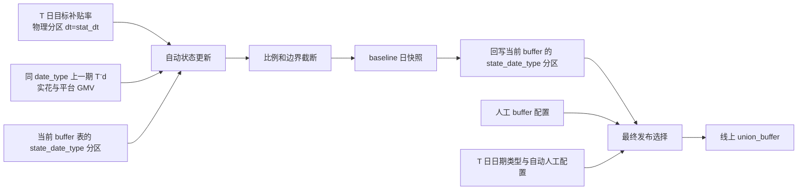

# 3.6 Buffer 自动调整——策略侧 TODO 路线

> [!summary] 项目目标
> 每天使用生效日 T 的原策略目标供需补贴率、同一日期类型序列中上一期的实际供需补贴率和上一期 buffer，按城市和 λ 分组自动校准 `union_buffer`。本文后续将该上一期记为 $T^-_d$，它不是固定的自然日 T-1。

## 0. 当前单文件实现（最终口径）

当前策略侧只保留一个 PySpark 入口：

```text
auto_buffer_job.py
```

它合并“首次初始化”和“每日自动状态更新”，但不合并最终发布任务。完整运行顺序如下：

```text
1. 创建/检查当前 buffer 表结构
2. 检查 weekday/weekend 两个状态分区
   ├─ 两个分区均为空：初始化两套键，union_buffer 全部为 1.0
   ├─ 两个分区均非空：跳过初始化
   └─ 只有一个分区非空：阻断任务，避免残缺状态被静默修补
3. 将 BIZ_DATE_LINE 作为 baseline 物理分区，并令生效日 T=stat_dt+1
4. 按 T 的日期类型选择 weekday/weekend，并求同类型上一期 T⁻d
5. 读取当前类型的 union_buffer，作为同类型上一期 old_buffer
6. 关联 T 日城市级目标率和 T⁻d 日城市+LambdaGroup 实际率
7. 计算 new_buffer，并仅按固定上限 2.99 截断
8. 先写 baseline 的 dt=stat_dt 日快照
9. 再覆盖当前 buffer 表的 state_date_type 分区；另一类型不动
10. 最终发布任务另行按 T=publish_dt=stat_dt+1 读取同一 date_type
```

首次初始化配置已从约 4000 行组合明细压缩为：

```text
CITY_UNIVERSE_BY_DATE_TYPE     # weekday/weekend 城市全集
CITY_SCOPE_RULES               # ds/acc_cr_thre/after_fix/compete/flat 五类范围
STG_GROUP_TO_CITY_SCOPE        # 9 条 LambdaGroup → 城市范围映射
```

展开后仍精确得到 weekday 2070、weekend 1997 个业务键，初始 buffer 全部为 `1.0`。初始化完成后不再使用范围字典重置状态，后续每天基于当前表中的 `old_buffer` 递推。

每日调整公式：

```text
raw_factor = target_rate / actual_rate
new_buffer = MIN(2.99, old_buffer × raw_factor)
```

本期不设置 buffer 下限，不设置单日调整比例上下限，也不建设规则配置表。

当前代码对 `target_rate<0`、`actual_rate<=0` 或数据缺失的记录保守保持 `old_buffer`；`target_rate=0` 且实际率有效时严格按公式得到 `new_buffer=0`。同日重跑若发现 baseline 的 `dt=stat_dt` 已存在，则复用该快照同步当前状态，不重复执行公式；若存在晚于 `stat_dt` 的快照，则禁止旧日期回写当前状态。

当前涉及的三张核心表：

| 表 | 作用 |
|---|---|
| `kflower_strategy.platform_union_strategy_budget_buffer_source_config` | 当前 buffer 状态真值；按 `date_type` 保存 weekday/weekend 两套状态 |
| `kflower_strategy.platform_union_strategy_budget_buffer_auto_baseline_by_city_object_stg` | `dt=stat_dt` 日快照和同日重跑幂等日志 |
| `kflower_strategy.platform_price_anchor_union_strategy_budget_dict` | 城市级原策略目标补贴率 |

> [!important] 初始化、状态更新、发布的边界
> 初始化与状态更新已合并到一个代码文件；状态更新与最终发布仍是两个阶段。状态更新回答“根据同类型上一期 $T^-_d$ 的观测如何校准 T 日状态”，最终发布回答“T 日线上读取该状态”。

## 1. 背景与范围

### 1.1 背景

当前 buffer 主要依赖人工配置。为了减少目标供需补贴率与实际供需补贴率之间的偏差，需要在现有 buffer 发布链路中增加日级自动校准能力。

新策略算法负责输出城市目标供需补贴率；buffer 发布任务独立完成以下工作：

1. 读取目标供需补贴率；
2. 读取同一日期类型上一期 $T^-_d$ 的实花和平台 GMV；
3. 从当前 buffer 配置表读取对应日期类型的 `old_buffer`；
4. 计算新的 `union_buffer`；
5. 先将结果写入自动 buffer 日快照，再回写当前 buffer 配置表的对应日期类型分区。

### 1.2 本期范围

- 原策略目标补贴率接入；
- 原策略自动 buffer 计算；
- 城市、实验组、λ 分组维度的日级调整；
- 周一至周四、周五至周日两套 buffer 分别维护；
- 固定 `2.99` 上限截断；
- 异常兜底、状态记录、监控告警；
- 影子运行、灰度、回滚能力。

### 1.3 本期明确不做

- 不重新执行全国预算腾挪；
- 不回写或修改策略结果表中的目标供需补贴率；
- 暂不实现全国少花后按城市统一乘二次系数；
- 暂不把运营临时补贴率直接写入策略结果表；
- 不改变人工 buffer 实验组原有发布逻辑。
- 本期不建设新策略 guardrail 目标率表和 guardrail 自动 buffer 表。

> [!note] 后续候选能力
> 如果历史运行中大量城市持续触达 `2.99`、全国仍明显少花，再单独评估“全国层二次校正”。运营临时补贴率建议作为独立的高优先级覆盖配置，而不是修改策略产出的目标率。

## 2. 表与数据链路

### 2.1 表规划

| 类型 | 本期使用的表 | 职责 |
|---|---|---|
| 原策略目标补贴率 | `kflower_strategy.platform_price_anchor_union_strategy_budget_dict` | 提供城市级 `total_subsidy_rate` |
| 当前 buffer 配置 | `kflower_strategy.platform_union_strategy_budget_buffer_source_config` | 按 `date_type` 保存 weekday/weekend 两套当前值；既是每日 `old_buffer` 来源，也是自动计算后的回写目标 |
| 人工/现有 buffer | `kflower_strategy.platform_union_strategy_budget_buffer_by_city_object_stg` | 现有人工实验组发布结果 |
| 原策略自动 buffer | `kflower_strategy.platform_union_strategy_budget_buffer_auto_baseline_by_city_object_stg` | 自动计算日快照和重跑幂等日志 |

职责划分：

```text
auto_baseline
    = 原策略自动校准日快照，dt=stat_dt；用于审计和防止同日重跑重复调整

platform_union_strategy_budget_buffer_source_config
    = 当前 buffer 状态表；weekday/weekend 两个 date_type 分区分别连续演进

platform_union_strategy_budget_buffer_by_city_object_stg
    = 现有人工配置来源；最终发布阶段继续供人工实验组使用

最终发布任务
    = 按 T 日日期类型，在人工配置与当前 buffer 对应分区之间选值并下发线上
```

自动日快照不是最终发布快照；最终发布读取的是当前 buffer 表中 `publish_date_type` 对应的完整状态。

可用于验证实验分流和 λ 分组命中的联合决策日志表：

```text
kflower_marketplace.ods_log_kflower_platform_call_return_public_log_h
```

运营侧城市级口径涉及的主要数据表：

| 数据内容 | 数据表 |
|---|---|
| 当日城市实际完单 GMV | `kflower_dw.dwm_kf_dri_unity_order_index_di` |
| 当日盒子实际完单 GMV | `kflower_dw.dwm_kf_dri_unity_order_index_di`，以预算控制看板口径为准 |
| 供需 C 实花 | `kflower_finance.dm_kf_fin_yy_subsidy_c_di` |
| 供需 C 规划率和规划 GMV | `kflower_marketplace.dups_meta_city_platform_budget_plan_result` |
| 平台流量 C 实花 | `kflower_app.dm_kf_fin_subsidy_strategy_metrics_di` |
| 城市级运营汇总看板 | `kflower_strategy.platform_subsidy_city_daily_metrics_di` |

本期首先完成：

```text
原策略目标补贴率表
    → 原策略自动 buffer 计算任务
    → platform_union_strategy_budget_buffer_auto_baseline_by_city_object_stg
```

新策略 guardrail 表和任务不属于本期范围，本文的开发、测试、上线和验收均只针对 baseline。

### 2.2 结果表业务字段

与原表保持一致：

| 字段 | 含义 | 备注 |
|---|---|---|
| `city_id` | 城市 ID | 计算粒度之一 |
| `object_group` | 优化目标 | 需要确认是否参与实验组关联 |
| `stg_group` | λ 分组/线上策略版本 | 当前描述存在语义冲突，必须确认 |
| `union_buffer` | 联合决策 buffer | 自动状态值，供最终发布任务选择 |
| `extra_data` | 扩展信息 | 现有人工发布任务实际写入该字段；新增表若要求与原表同结构，需要保留 |

结果表只保留 `dt` 分区：

```text
dt
```

最终物理粒度：

```text
dt × city_id × object_group × stg_group
```

自动日快照中的 `date_type` 不落结果字段，可由 `T=dt+1` 派生。当前 buffer 表以 `date_type` 分区同时保存 weekday/weekend 两套数据；每日计算层由 T 选择唯一 `state_date_type`，只读写该分区。最终发布任务也根据同一个 T 的日期类型读取当前 buffer 表对应分区。

### 2.3 数据流



## 3. P0：开发前必须确认的口径

> [!danger] 这些口径未确认前，不应接入正式发布。

- [x] 原策略正式目标字段确认为 `kflower_strategy.platform_price_anchor_union_strategy_budget_dict.total_subsidy_rate`。
- [/] 最新运营看板已将 `PJZ202502170009` 单独沉淀为联合决策呼返实花，强烈支持将其作为实际率分子；仍需业务最终确认，以及确认退款、冲正和追溯数据的处理方式。
- [/] 城市级实际 GMV 和规划 GMV 来源已提供；仍需确认实验组/λ 分组归因后的 GMV 与目标率使用完全一致的城市平台 GMV 口径。
- [x] 原策略目标率单位确认为百分数值：源预算率乘 `100` 后落表，例如 `3.0` 表示 3%；实际率进入公式前必须转换为相同单位。
- [x] 正式实验组字段确认只使用 `ExpGroupName`；`Group` 不进入映射、归因或计算链路。
- [/] 人工配置例子中 `object_group` 固定为 `max_order_v1`，可确认它是优化目标而不是实验组；仍需确认新自动实验是否全部使用该值。
- [x] 实验组—LambdaGroup 的 1:1 映射由运筹平台配置。`union_stg_v3_max_order_v1_only_box → pltf_union_stg_v3_only_ds_acc_cr_thre` 只是配置示例，不是代码限制条件；自动 buffer 任务只处理 `LambdaGroup=stg_group` 粒度。
- [x] public 日志中的 `StgGroup` 字段已标记“不再使用”，不能作为结果表 `stg_group` 的来源。
- [x] 本需求是城市补贴率口径，public 日志过滤 `subsidy_type=0`。
- [ ] 确认自动实验组、人工实验组的配置来源和生效时间规则。
- [x] 当前 buffer 配置表保存全部有效键和值；任务直接读取其 `union_buffer`，不查询历史自动值，也不设置冷启动回退。
- [x] 已明确分成两步：自动状态更新与最终发布职责分离，但两步都按生效日 `T=stat_dt+1` 的日期类型选择同一套状态。
- [x] 公式中的“上一期”按同一 `date_type` 序列定义，不是固定自然日减一天；周一的上一期是上周四，周五的上一期是上周日。
- [/] 现有人工任务实际写入 `extra_data`；新增自动表是否严格保留五个业务字段，需要以正式 DDL 和下游读取契约确认。
- [ ] 确认目标率为 0、实际率为 0 时的业务兜底规则。

### 3.1 日期类型结构方案（已确定）

需求要求 buffer 按以下粒度分别维护：

```text
城市 × stg_group × 日期类型
```

当前展示的结果字段中没有 `date_type`。本项目不新增该字段，并明确区分状态层与发布层：

1. 定义 `partition_dt = stat_dt = ${BIZ_DATE_LINE}`；
2. 定义 `publish_dt = DATE_ADD(partition_dt, 1)`；
3. 定义业务生效日 `T = publish_dt`，由 T 派生 `state_date_type`；
4. T 为周一至周四只更新 weekday 状态，T 为周五至周日只更新 weekend 状态；
5. 当前 buffer 配置只读取与 `state_date_type` 相同的数据，执行一次通用计算链路；
6. 自动状态按 `dt × city_id × object_group × stg_group` 落表；
7. 最终发布由 `publish_dt` 派生 `publish_date_type`；
8. 自动实验组读取当前 buffer 表的 `publish_date_type` 分区，人工实验组继续读取人工配置；
9. 本次更新类型与本次发布类型都由 T 决定，必须相同。

逻辑粒度仍然是：

```text
城市 × stg_group × 日期类型
```

自动日快照通过 `T=dt+1` 的星期属性隐式承载本次更新类型，因此无需新增 `date_type` 字段。当前 buffer 表显式以 `date_type` 分区保存两套完整状态，状态更新与发布层均按 T 选择对应分区。

> [!important] 状态表不等于发布快照
> 自动日快照记录“T 日对应的哪一类状态被更新”，当前 buffer 表记录“两类状态目前各自是什么”，最终发布结果记录“T 日线上使用的同一类状态”。状态更新和最终发布仍是两步，区别在职责，不在日期类型。

#### 3.1.1 当前代码实现（最终口径）

> [!note] 字段名统一为 `date_type`
> 本文和代码统一使用 `date_type`；`data_type` 仅是口语或笔误，不作为表字段。

| 名称 | 来源 | 用途 | 是否落 baseline 结果表 |
|---|---|---|---|
| `date_type` | 当前 buffer 配置表 | 标识 weekday/weekend 两套状态 | 否 |
| `state_date_type` | `T=stat_dt+1` 的日期类型派生 | 决定本期唯一需要更新的状态类型 | 否，由结果 `dt+1` 反推 |
| `publish_date_type` | `publish_dt=stat_dt+1` 派生 | 最终发布任务选择应使用的状态 | 否 |

当前 PySpark 采用“配置层两套、计算层单链路”：

```python
target_business_dt = stat_dt + 1 day
state_date_type = resolve_date_type(target_business_dt)
actual_rate_dt = previous_date_in_same_type(target_business_dt)

current_buffer_df = current_buffer_df.filter(
    F.col("date_type") == state_date_type
)

# 只执行一次通用 buffer 计算，不同时计算两套非空结果
result_df = calculate_buffer(old_buffer=current_buffer_df.union_buffer, ...)

# 先写 dt=stat_dt 日快照，再覆盖当前 buffer 的 state_date_type 分区
```

当前代码依赖的数据契约：

```text
源配置.date_type            = state_date_type
上游保证 city_id + object_group + stg_group 不重复
```

按当前实现，不在 PySpark 内额外执行表结构、业务键唯一性和输入输出行数一致性校验。

因此，`UNION ALL` 只可用于首次初始化时同时保存 weekday/weekend 两套键；每日状态计算不把两套非空结果合并到同一 `dt`。否则在结果表不含 `date_type` 的前提下，会产生重复业务主键。

### 3.2 联合决策 public 日志补充结论

联合决策 V3 日志文档表明，下面这张 public 日志中同时存在实验组和 λ 分组信息：

```text
kflower_marketplace.ods_log_kflower_platform_call_return_public_log_h
```

关键字段及初步业务含义：

| 日志字段 | 文档含义 | 本项目中的初步用途 |
|---|---|---|
| `ExpGroupName` | 实验组名 | 作为 `experiment_group` 的首选字段 |
| `Group` | 本项目不使用 | 忽略，不进入映射、归因或计算链路 |
| `LambdaGroup` | lambda 分组 | 业务定义已确认与现有 buffer 表 `stg_group` 等价 |
| `Allow` | `true` 表示命中实验 | 过滤真实命中的实验流量 |
| `platform_joint_price` | `1` 表示联合决策 V3 | 过滤联合决策 V3 流量 |
| `subsidy_type` | `1` 为区县补贴率，`0` 为城市补贴率 | 本需求已确认只使用城市补贴率，固定过滤 `0` |
| `spanid` | 接口 ID，具体含义待补充 | 可能用于与实花/调用链关联，但当前不能直接依赖 |

因此可初步定义：

```text
experiment_group = ExpGroupName
lambda_group = LambdaGroup
```

日志初步过滤条件：

```sql
WHERE dt = '${T_MINUS_1}'
  AND platform_joint_price = 1
  AND Allow = true
```

本需求只处理城市补贴率，因此固定增加：

```sql
AND subsidy_type = 0
```

> [!important] 日志不能直接替代运筹配置
> public 日志只能反映当日实际产生流量、实际命中的实验组与 λ 分组。零流量但配置上应该存在的 λ 分组不会出现在日志里。因此，运筹配置应作为“实验组 → λ 分组”的全量主数据，public 日志用于验证配置是否真实生效，以及给同日期类型上一期 $T^-_d$ 的实际 GMV 和实花做实验归因。

推荐数据源职责：

| 数据源 | 职责 |
|---|---|
| 运筹配置 | 提供完整的实验组 → λ 分组关系、自动/人工标记和生效时间 |
| public 日志 | 验证实际命中关系，给 $T^-_d$ 日 GMV/实花补充实验组和 λ 分组归因 |
| 目标补贴率表 | 提供同实验组的目标供需补贴率 |
| 实花与 GMV 表 | 提供同实验组、同城市、同口径的实际供需补贴率 |
| 当前 buffer 配置表 | 提供并保存同日期类型的 `old_buffer/new_buffer` 当前状态 |

当前样例已给出一条明确对应：

```text
ExpGroupName = union_stg_v3_max_order_v1_only_box
LambdaGroup  = pltf_union_stg_v3_only_ds
stg_group    = pltf_union_stg_v3_only_ds  # 人工 buffer 配置中的同值
```

已确认实验组只取 `ExpGroupName`，无需再研究 `Group` 与它是否相等。当前仍需确认：

1. public 日志如何与实花、GMV或订单事实表稳定关联；
2. `spanid` 是否可用作关联键，或者应使用调用 ID、订单 ID、trace ID 等其他字段；
3. 同一个 `LambdaGroup` 未来是否会跨多个实验组复用；
4. 映射关系未来是否可能按城市、小时或生效版本变化；
5. 输出表不含 `ExpGroupName` 时，不同实验组是否可能生成相同的 `city_id + object_group + stg_group`，造成结果冲突。

上线前需要先完成下面的基数检查：

```sql
SELECT
    ExpGroupName,
    LambdaGroup,
    COUNT(*) AS log_cnt
FROM kflower_marketplace.ods_log_kflower_platform_call_return_public_log_h
WHERE dt = '${T_MINUS_1}'
  AND platform_joint_price = 1
  AND Allow = true
GROUP BY ExpGroupName, LambdaGroup;
```

进一步建议按日期、城市统计：

```sql
SELECT
    dt,
    city_id,
    ExpGroupName,
    LambdaGroup,
    COUNT(*) AS log_cnt
FROM kflower_marketplace.ods_log_kflower_platform_call_return_public_log_h
WHERE dt BETWEEN '${START_DATE}' AND '${END_DATE}'
  AND platform_joint_price = 1
  AND Allow = true
GROUP BY dt, city_id, ExpGroupName, LambdaGroup;
```

需要检查：

- 一个实验组对应的 `LambdaGroup` 数量；
- 一个 `LambdaGroup` 是否属于多个实验组；
- 实验组—λ 分组关系是否随城市、日期发生变化；
- `ExpGroupName`、`LambdaGroup` 的空值和异常值；
- public 日志实际命中关系与运筹配置的差异；
- 所有自动实验组在运筹配置中的 λ 分组是否完整产出。

### 3.3 运营侧口径补充结论

运营侧口径能够明确城市级 GMV、供需 C 规划和供需 C 实花的基础来源，可用于本项目的输入建设与城市级对账。但是当前 SQL 主要聚合到 `dt + city_id`，没有实验组和 `LambdaGroup`，因此不能原样作为自动 buffer 公式的最终输入。

#### 3.3.1 当日城市实际 GMV

来源：

```text
kflower_dw.dwm_kf_dri_unity_order_index_di
```

运营侧口径：

```sql
SELECT
    dt,
    city_id,
    SUM(gmv_amt) AS actual_city_gmv
FROM kflower_dw.dwm_kf_dri_unity_order_index_di
WHERE dt BETWEEN '${begin_date}' AND '${end_date}'
  AND channel_id = 300
  AND is_dd_platform = 0
GROUP BY dt, city_id;
```

可确认：

- 城市实际 GMV 字段为 `SUM(gmv_amt)`；
- 花小猪口径使用 `channel_id = 300`；
- 排除滴滴平台口径使用 `is_dd_platform = 0`；
- 城市级实际供需补贴率的候选分母为 `actual_city_gmv`。

仍需解决：该 SQL 只有城市级 GMV。为了满足“同实验组、同 λ 分组”的要求，需要在订单/调用粒度关联 `ExpGroupName` 和 `LambdaGroup` 后再聚合，不能将城市总 GMV 直接复制给每个实验组。

#### 3.3.2 当日盒子实际 GMV

来源：

```text
kflower_dw.dwm_kf_dri_unity_order_index_di
```

正式采用预算控制看板口径：

```sql
SELECT
    dt,
    city_id,
    SUM(
        CASE
            WHEN box_type_id = 105 THEN COALESCE(gmv_amt, 0)
            ELSE 0
        END
    ) AS actual_box_gmv
FROM kflower_dw.dwm_kf_dri_unity_order_index_di
WHERE dt = '${BIZ_DATE_LINE}'
  AND channel_id = 300
  AND is_dd_platform = 0
  AND city_id IS NOT NULL
GROUP BY dt, city_id;
```

聚合值：

```text
actual_box_gmv
    = SUM(CASE WHEN box_type_id = 105 THEN COALESCE(gmv_amt, 0) ELSE 0 END)
actual_box_gmv_share = actual_box_gmv / actual_city_gmv
```

盒子 GMV 占比的基期规则与 buffer 日期类型一致：

```text
本周周中使用上周周中数据
本周周末使用上周周末数据
```

盒子 GMV 不是自动 buffer 公式的直接分母，但可以用于解释平台呼返、特价盒子呼返两部分规划率的变化，并用于规划口径复核。

另一份参考材料中基于 `kflower_dw.dwm_kf_fin_order_report_di`、`level_type IN (105, 201, 202)` 的算法不作为本项目正式口径。

#### 3.3.3 供需 C 实花

来源：

```text
kflower_finance.dm_kf_fin_yy_subsidy_c_di
```

金额字段：

```text
supply_c_actual_amt = SUM(activity_current_amt)
```

运营侧项目号分类：

| `project_no` | C 补类型 |
|---|---|
| `PJZ202502170009` | 联合决策呼返 |
| `PJZ202502170004` | 升舱 |
| `PJZ202512220072` | ACTI 专项券 |
| `PJZ202512220070` | 天降红包（券） |
| `PJZ202512220073` | 无车赔 |
| `PJZ202508290014` | 接驾盲盒 |
| `PJZ202512220071` | 贵必赔 |

盒子内外分类：

```text
level_type = 105 → 特价盒子
其他 → 盒子外
```

当 `level_type = 105` 时，排除：

```text
product_id NOT IN (368, 497, 408, 5264, 407)
```

> [!warning] 自动 buffer 分子不能直接默认使用全部供需 C 实花
> 目标率由平台呼返规划率与特价盒子呼返规划率组成，业务名称是“联合决策呼返—规划”。为了保持目标率和实际率同口径，自动 buffer 的候选实花分子应优先只取 `project_no = 'PJZ202502170009'` 的“联合决策呼返”实花。升舱、专项券、红包、无车赔、接驾盲盒、贵必赔是否属于目标率覆盖范围，需要业务明确；未经确认不能全部并入分子。

候选实际率：

```text
union_call_return_actual_rate
    = union_call_return_actual_amt / actual_city_gmv × 100
```

这里的 `× 100` 是为了与目标表中 `3.0 = 3%` 的百分数值单位保持一致；运营看板若展示 `[0,1]` 小数比例，可以单独保留未乘 `100` 的展示字段。

其中：

```text
union_call_return_actual_amt
    = SUM(activity_current_amt)
      WHERE project_no = 'PJZ202502170009'
```

该财务 SQL 同样只有日期、城市、项目号、盒子内外信息，没有实验组和 `LambdaGroup`。必须找到财务记录、订单或调用记录与 public 日志之间的稳定关联链路，才能得到公式要求的同实验组实际率。

#### 3.3.4 供需 C 规划

来源：

```text
kflower_marketplace.dups_meta_city_platform_budget_plan_result
```

规划字段：

```text
plan_city_gmv
    = CAST(get_json_object(base_data, '$.baseData.baseAvgPlatformGmv') AS DOUBLE)

platform_call_return_plan_rate
    = COALESCE(platform_call_return_budget, 0)

special_box_call_return_plan_rate
    = COALESCE(special_box_call_return_budget, 0)

supply_c_plan_rate
    = platform_call_return_plan_rate
      + special_box_call_return_plan_rate

supply_c_plan_amt
    = supply_c_plan_rate × plan_city_gmv
```

全国规划率应使用 GMV 加权，而不是城市补贴率简单平均：

```text
national_supply_c_plan_rate
    = SUM(supply_c_plan_rate × plan_city_gmv)
      / SUM(plan_city_gmv)
```

> [!note] 规划表用于对账，不应未经确认替代策略目标表
> 本项目定义的正式目标率输入仍是 `kflower_strategy.platform_price_anchor_union_strategy_budget_dict` 中“预算调整后、buffer 调整前”的目标补贴率。运营规划表可以用于城市级和全国级对账；只有确认两张表的字段、阶段和版本完全一致后，才可以互相替代。

#### 3.3.5 平台流量 C 实花

来源：

```text
kflower_app.dm_kf_fin_subsidy_strategy_metrics_di
```

运营侧过滤条件：

```text
flow_platform = '花小猪端'
second_product_category = '网约车'
budget_department = '平台流量'
```

字段定义：

```text
platform_flow_subsidy_c_amt = SUM(subsidy_c)
platform_flow_laxin_c_amt = SUM(laxin_subsidy_c)
platform_flow_c_actual_amt
    = platform_flow_subsidy_c_amt - platform_flow_laxin_c_amt
```

运营汇总口径中：

```text
total_c_actual_amt
    = supply_c_actual_amt + platform_flow_c_actual_amt

total_c_actual_rate
    = total_c_actual_amt / actual_city_gmv
```

本期自动 buffer 若只校准联合决策供需目标率，则平台流量 C 不应并入公式分子；它适合作为整体补贴消耗和全国少花/超花监控指标。

#### 3.3.6 建议的指标分层

| 指标 | 推荐用途 | 是否直接进入 buffer 公式 |
|---|---|---|
| 策略表目标补贴率 | 正式目标率 | 是 |
| `supply_c_plan_rate` | 运营规划对账 | 待确认与策略目标率一致后才可替代 |
| `actual_city_gmv` | 实际率分母 | 是，但必须完成实验组归因 |
| 联合决策呼返实际金额 | 实际率分子 | 是，但必须完成实验组归因 |
| 全部供需 C 实花 | 运营供需消耗监控 | 默认否 |
| 平台流量非拉新 C 实花 | 整体补贴监控 | 否 |
| `total_c_actual_rate` | 全盘补贴消耗监控 | 否 |
| 盒子 GMV 占比 | 规划解释与口径复核 | 否 |

#### 3.3.7 当前可落地的数据合同

城市级对账层可以先落为：

```text
dt
city_id
city_name
plan_city_gmv
plan_box_gmv
plan_box_gmv_share
platform_call_return_plan_rate
special_box_call_return_plan_rate
supply_c_plan_rate
supply_c_plan_amt
actual_city_gmv
actual_box_gmv
actual_box_gmv_share
supply_c_actual_amt
union_call_return_actual_amt
platform_flow_subsidy_c_amt
platform_flow_laxin_c_amt
platform_flow_c_actual_amt
total_c_actual_amt
supply_c_actual_rate
union_call_return_actual_rate
platform_flow_c_actual_rate
total_c_actual_rate
```

注意：运营原字段列表中的 `plan_box_amv` 疑似拼写错误，建议统一为 `plan_box_gmv`。

自动 buffer 计算层最终至少需要升级到：

```text
dt
city_id
ExpGroupName
LambdaGroup
object_group
target_rate
actual_city_gmv
union_call_return_actual_amt
actual_rate
old_buffer
```

即：运营侧城市级汇总表适合作为对账层，但不能直接取代实验组级自动 buffer 输入层。

### 3.4 预算控制看板落表 SQL 补充结论

最新参考 SQL 建设了城市级日汇总表：

```text
kflower_strategy.platform_subsidy_city_daily_metrics_di
```

表按 `dt` 分区，TTL 为 180 天，粒度为：

```text
dt + city_id
```

它适合支持 28～60 天历史回放和城市级对账，但没有 `ExpGroupName`、`LambdaGroup`，因此不能直接作为最终自动 buffer 实际率输入。

> [!note] 正式库名已确认
> 城市级运营汇总看板的完整表名为 `kflower_strategy.platform_subsidy_city_daily_metrics_di`。任务代码、依赖配置、权限申请和文档统一使用完整表名；参考 SQL 中未带库名的写法不作为正式实现写法。

#### 3.4.1 已进一步确认的字段

| 字段 | SQL 定义 | 对本项目的价值 |
|---|---|---|
| `plan_city_gmv` | `baseData.baseAvgPlatformGmv` | 城市规划 GMV 对账 |
| `plan_box_gmv` | `baseData.baseAvgSpecialBoxGmv` | 确认早期文档中的 `plan_box_amv` 是拼写问题 |
| `platform_call_return_plan_rate` | `platform_call_return_budget` | 平台呼返规划率 |
| `special_box_call_return_plan_rate` | `special_box_call_return_budget` | 特价盒子呼返规划率 |
| `supply_c_plan_rate` | 上述两项之和 | 城市级联合决策规划率对账 |
| `actual_city_gmv` | `SUM(gmv_amt)` | 城市实际率候选分母 |
| `supply_c_actual_amt` | 运营项目号范围内 `SUM(activity_current_amt)` | 全部供需 C 实花监控 |
| `joint_decision_call_return_actual_amt` | 仅 `PJZ202502170009` 的 `SUM(activity_current_amt)` | 自动 buffer 实际率候选分子 |
| `platform_flow_c_actual_amt` | `subsidy_c - laxin_subsidy_c` | 整体补贴监控，不进入本期公式 |

自动 buffer 城市级候选实际率因此可明确为：

```text
joint_decision_call_return_actual_rate
    = joint_decision_call_return_actual_amt / actual_city_gmv × 100
```

最终进入公式前，分子和分母仍必须进一步归因到同一个 `ExpGroupName + LambdaGroup`。

#### 3.4.2 看板 SQL 的完整聚合结构

看板通过以下 CTE 分别聚合后，以 `dt + city_id` 左连接：

```text
plan_info
actual_city_gmv
actual_box_gmv
supply_c_actual
platform_flow_c_actual
city_info
```

再使用所有来源城市键的并集 `city_keys` 作为主表，可以避免只存在于某一个来源中的城市被 inner join 丢失。这种“键全集 + left join”的做法可以复用到城市级对账任务。

自动 buffer 任务也建议先构造预期键全集：

```text
有效自动实验配置
× 应覆盖城市
× 全部 LambdaGroup
× publish_dt=stat_dt+1 派生的 date_type（计算字段，不落结果表）
```

再左连接目标率和实际率；预期键本身携带当前 `old_buffer`，从而显式发现缺数，而不是由有数据的事实表反向决定输出范围。

#### 3.4.3 盒子 GMV 正式口径

本项目明确以预算控制看板 SQL 为准：

```text
kflower_dw.dwm_kf_dri_unity_order_index_di
channel_id = 300
is_dd_platform = 0
box_type_id = 105
```

具体定义：

```text
actual_box_gmv
    = SUM(CASE WHEN box_type_id = 105 THEN COALESCE(gmv_amt, 0) ELSE 0 END)

actual_box_gmv_share
    = actual_box_gmv / actual_city_gmv
```

基于 `kflower_dw.dwm_kf_fin_order_report_di`、`level_type IN (105, 201, 202)` 并带额外排除条件的另一份参考 SQL 不作为本项目正式实现依据，也不再作为上线阻塞项。

#### 3.4.4 零值与缺失值混淆风险

看板最终写表时将以下缺失金额统一 `COALESCE` 为 0：

```text
actual_box_gmv
supply_c_actual_amt
platform_flow_subsidy_c_amt
platform_flow_laxin_c_amt
platform_flow_c_actual_amt
joint_decision_call_return_actual_amt
```

这会导致下游无法区分：

```text
真实没有实花
上游分区未完成
城市关联失败
当日确实没有对应项目记录
```

对运营展示可以补零，但自动 buffer 计算不能直接把补零后的 `joint_decision_call_return_actual_amt = 0` 当成真实零实花，否则会触发错误的极端上调或除零兜底。

推荐方案之一：

1. 自动 buffer 直接读取原始来源，并保留来源存在标记；
2. 或给汇总表增加 `has_*_source`、`*_row_cnt` 等质量字段；
3. 或在自动任务读取汇总表前，额外检查各上游 `actual_rate_dt=T^-_d` 分区完成状态和来源城市覆盖率。

建议质量字段：

```text
has_plan_source
has_actual_city_gmv_source
has_supply_c_source
has_joint_decision_call_return_source
actual_city_gmv_row_cnt
supply_c_row_cnt
joint_decision_call_return_row_cnt
```

#### 3.4.5 `MAX` 聚合风险

`plan_info` 对同一 `dt + city_id` 使用 `MAX` 聚合规划 GMV和规划率。如果源表同城同日存在多条不同版本记录，分别取 `MAX` 可能把不同记录中的字段拼在一起。

正式使用前需要验证：

```sql
SELECT
    dt,
    city_id,
    COUNT(*) AS row_cnt,
    COUNT(DISTINCT platform_call_return_budget) AS platform_rate_cnt,
    COUNT(DISTINCT special_box_call_return_budget) AS box_rate_cnt,
    COUNT(DISTINCT GET_JSON_OBJECT(base_data, '$.baseData.baseAvgPlatformGmv')) AS gmv_cnt
FROM kflower_marketplace.dups_meta_city_platform_budget_plan_result
WHERE dt BETWEEN '${START_DATE}' AND '${END_DATE}'
  AND city_id IS NOT NULL
GROUP BY dt, city_id
HAVING row_cnt > 1
    OR platform_rate_cnt > 1
    OR box_rate_cnt > 1
    OR gmv_cnt > 1;
```

若确有多版本，应基于明确的版本号、更新时间或生效标记选取一整条记录，不能对每个字段独立取 `MAX`。

#### 3.4.6 日期语义

看板所有输入均读取：

```text
dt = '${BIZ_DATE_LINE}'
```

这说明 `${BIZ_DATE_LINE}` 在该看板任务中作为“被统计的业务日期/输出分区日期”使用。自动 buffer 实际率不再固定读取该自然日，而是读取 `previous_date_in_same_type(T)` 对应分区；仍需确认该分区在调度时已经稳定就绪。

#### 3.4.7 推荐使用方式

```text
城市级运营看板表
    → 用于城市级目标/实际对账、历史回放校验、全国指标监控

原始 GMV + 财务实花 + public 日志/实验归因链路
    → 用于正式生成 ExpGroupName × LambdaGroup 粒度的实际率
```

除非后续给城市级看板表补充实验组、`LambdaGroup` 和来源质量标记，否则不建议自动 buffer 任务直接以该表作为唯一输入。

### 3.5 原策略目标补贴率 SQL 补充结论

原策略目标表：

```text
kflower_strategy.platform_price_anchor_union_strategy_budget_dict
```

表结构确认如下：

| 字段 | 含义 | 单位/口径 |
|---|---|---|
| `city_id` | 城市 ID | 城市粒度 |
| `platform_subsidy_rate` | 平台呼返补贴率 | 平台 GMV 口径，百分数值 |
| `uabox_subsidy_rate_vs_platform_gmv` | 盒子呼返补贴率 | 平台 GMV 口径，百分数值 |
| `uabox_subsidy_rate_vs_box_gmv` | 盒子呼返补贴率 | 盒子 GMV 口径，百分数值 |
| `uabox_trans_coefficient` | 盒子率转平台 GMV 口径系数 | `box_gmv / whole_gmv` |
| `total_subsidy_rate` | 汇总总包补贴率 | 本项目正式目标率候选字段 |
| `dt` | 结果分区 | 与源规划日期存在一天偏移，见下文 |

#### 3.5.1 正式目标字段

SQL 中：

```text
platform_subsidy_rate
    = platform_call_return_budget × 100

uabox_subsidy_rate_vs_platform_gmv
    = special_box_call_return_budget × 100

total_subsidy_rate
    = ROUND(
        (platform_subsidy_rate + uabox_subsidy_rate_vs_platform_gmv)
        × total_buffer,
        1
      )
```

当前 `total_buffer` 对所有城市固定为 `1`，因此：

```text
total_subsidy_rate
    = ROUND(
        platform_call_return_budget × 100
        + special_box_call_return_budget × 100,
        1
      )
```

由此确认原策略自动 buffer 的正式目标字段为：

```text
r_target = total_subsidy_rate
```

该字段由平台呼返补贴率与盒子呼返补贴率组成，两部分都已经统一为城市平台 GMV 口径，因此不应使用 `uabox_subsidy_rate_vs_box_gmv` 直接参与总目标率计算。

#### 3.5.2 目标率单位

源表中的规划预算率先乘 `100` 再落表。因此目标表使用“百分数值”而不是 `[0,1]` 小数比例：

```text
源规划率 0.03
→ 目标表 total_subsidy_rate = 3.0
→ 表示补贴率 3%
```

实际补贴率必须转换到相同单位：

```text
actual_rate
    = joint_decision_call_return_actual_amt
      / actual_city_gmv
      × 100
```

如果目标率使用 `3.0`、实际率使用 `0.03`，调整倍数会错误放大 100 倍。

目标字段最终 `ROUND(..., 1)`，即保留一位小数。SQL 注释中“round 保留 3 为小数”的描述与实际代码不一致，应以 `ROUND(..., 1)` 的代码为准。实际率计算建议保留更高精度，仅在最终 `union_buffer` 输出时按确认规则舍入。

#### 3.5.3 当前确实处于 buffer 调整前

虽然 SQL 中变量名为 `total_buffer`，注释为人工配置 buffer，但当前逻辑对所有城市均固定为 `1`。因此当前 `total_subsidy_rate` 没有被额外 buffer 放大或缩小，可以作为自动校准前目标率。

为了防止未来源任务将 `total_buffer` 改为非 1 后发生重复调整，建议增加一致性监控：

```text
total_subsidy_rate
是否等于
ROUND(platform_subsidy_rate + uabox_subsidy_rate_vs_platform_gmv, 1)
```

不相等时应报警并暂停自动发布，确认目标率是否已经包含 buffer。

#### 3.5.4 目标率只有城市粒度

目标表业务键只有：

```text
dt + city_id
```

没有以下字段：

```text
ExpGroupName
LambdaGroup
object_group
stg_group
```

因此可以确认目标补贴率并未细分到实验组或 λ 分组。正式计算前需要业务确认下面的展开规则：

```text
同一城市的 total_subsidy_rate
是否复制给该城市所有自动实验组下的全部 LambdaGroup
```

如果不同实验组或 λ 分组应该使用不同目标率，则当前目标表无法提供，需要补充新的目标率来源或映射规则。

#### 3.5.5 目标分区日期偏移

源 SQL 的日期关系是：

```sql
FROM kflower_marketplace.dups_meta_city_platform_budget_plan_result
WHERE dt = DATE_ADD('${BIZ_DATE_LINE}', 1)

INSERT OVERWRITE TABLE
    kflower_strategy.platform_price_anchor_union_strategy_budget_dict
PARTITION (dt = '${BIZ_DATE_LINE}')
```

即：

```text
目标表分区 dt = BIZ_DATE_LINE
对应规划源表 dt = BIZ_DATE_LINE + 1 day
```

已确认目标补贴率取生效日 **T**。该任务的物理分区与业务生效日相差一天：

```text
stat_dt = BIZ_DATE_LINE = 目标表/baseline 的物理分区
T = stat_dt + 1 natural day
目标表读取分区 dt = stat_dt
该分区的数据来自规划源表 dt = stat_dt+1 = T
```

因此自动 buffer 任务读取 `platform_price_anchor_union_strategy_budget_dict.dt=STAT_DT`，得到的正是 T 日目标补贴率；无需额外传入 `TARGET_DT`，也不能再将目标表分区加一天读取。

#### 3.5.6 与运营看板规划率的关系

运营看板中的：

```text
supply_c_plan_rate
    = platform_call_return_budget
      + special_box_call_return_budget
```

目标表中的：

```text
total_subsidy_rate
    = ROUND(supply_c_plan_rate × 100, 1)
```

两者使用相同的底层预算字段和城市平台 GMV 口径，主要差别是：

- 目标表乘了 `100`；
- 目标表保留一位小数；
- 两张表读取分区时需要做正确的日期对齐。

因此后续对账应比较：

```text
total_subsidy_rate
vs
ROUND(supply_c_plan_rate × 100, 1)
```

而不能直接比较 `total_subsidy_rate` 与未乘 `100` 的 `supply_c_plan_rate`。

### 3.6 现有人工 buffer PySpark 任务补充结论

参考任务描述为“by 城市、by 目标、by 策略版本配置补贴率 buffer”，它是当前人工 buffer 表的真实发布实现，可以确认以下内容。

#### 3.6.1 真实写表契约

现有任务写入：

```text
kflower_strategy.platform_union_strategy_budget_buffer_by_city_object_stg
```

业务字段顺序为：

```text
city_id
object_group
stg_group
union_buffer
extra_data
```

分区字段为：

```text
dt = ${BIZ_DATE_LINE}
```

因此截图中展示的四个字段不是完整写表契约，现有任务还写入 `extra_data`。新增自动表如果要求“字段和列名保持和原表相同”，应优先按五个业务字段建表；如果计划删除 `extra_data`，必须先确认所有下游读取方。

当前示例中的 `extra_data` 为空字符串。为避免改变既有下游语义，自动任务初期可以继续写空字符串；调整状态、触达 2.99 上限和来源版本建议写独立审计表，不建议未经评估直接复用 `extra_data`。

#### 3.6.2 分区日与生效日

现有代码使用 Python `datetime.weekday()`，在 `${BIZ_DATE_LINE}` 为周四、周五、周六时选择周末 buffer：

```text
Python weekday：周一=0，...，周日=6
weekend 条件：weekday in (3, 4, 5)
```

结合代码注释“周五、周六、周日使用周末 buffer”，可以确认判断对象实际上是次日：

```text
partition_dt = ${BIZ_DATE_LINE}
stat_dt      = ${BIZ_DATE_LINE}
publish_dt   = DATE_ADD(${BIZ_DATE_LINE}, 1)
```

映射关系：

| 分区 `dt` | 生效日 `publish_dt` | buffer 类型 |
|---|---|---|
| 周四 | 周五 | weekend |
| 周五 | 周六 | weekend |
| 周六 | 周日 | weekend |
| 周日 | 周一 | weekday |
| 周一 | 周二 | weekday |
| 周二 | 周三 | weekday |
| 周三 | 周四 | weekday |

这段代码确认了分区 `dt` 中准备的是 `dt+1` 生效的 buffer。本项目现已统一：自动状态更新与最终发布都按该生效日 T 的日期类型选择状态。

原策略目标率任务写入 `dt=${BIZ_DATE_LINE}`，但从规划源表读取 `dt=${BIZ_DATE_LINE}+1`。现已确认目标补贴率取生效日 T，因此直接读取目标表 `dt=STAT_DT`：其物理分区内容就是 T 日目标。这里的一天偏移只描述目标表存储方式，不代表实际率也读取自然日昨天。

两步职责应明确为：

```text
自动状态更新：
    target(T) / actual(T⁻d)
    → 更新 T 对应日期类型的状态

最终发布：
    根据同一个 T=publish_dt 的日期类型
    → 选择当前自动 buffer 对应分区或人工配置
    → 生成线上 union_buffer
```

其中 $T^-_d$ 表示 T 所属日期类型序列的上一期，不是自然日减一天。边界日示例：

```text
T=周五：更新 weekend 状态并发布 weekend；实际率读取上周日

T=周一：更新 weekday 状态并发布 weekday；实际率读取上周四
```

因此状态更新与发布仍是两个阶段，但不会在周四→周五、周日→周一时选择不同类型。跨类型边界时，实际率和 `old_buffer` 都回看同一类型的上一期。

#### 3.6.3 `object_group` 与 `stg_group`

参考配置中：

```text
object_group = max_order_v1
```

`stg_group` 是现有 buffer 表的线上策略键，例如：

```text
pltf_union_stg_v3_only_ds
pltf_union_stg_v3_only_ds_compete_v2
pltf_union_stg_v3_only_ds_compete_v3
pltf_union_stg_v3_only_ds_compete_v4
pltf_union_stg_v3_only_ds_acc_cr_thre
pltf_union_stg_v3_only_ds_after_fix
pltf_union_stg_v3_only_ds_discount_peak_flat
pltf_union_stg_v3_only_ds_mogou_acc_cr_thre_flat_less
pltf_union_stg_v3_only_ds_mogou_acc_cr_thre_flat_same
```

因此可以确认：

```text
object_group = 优化目标，不是实验组
stg_group = 现有 buffer 表的线上策略键
```

当前初始化范围配置包含 9 个 `stg_group`，它们都是可由配置驱动的 `LambdaGroup`。下面只是运筹平台中的一条 1:1 映射示例：

```text
ExpGroupName = union_stg_v3_max_order_v1_only_box
LambdaGroup  = pltf_union_stg_v3_only_ds_acc_cr_thre
stg_group    = pltf_union_stg_v3_only_ds_acc_cr_thre
```

代码不按这条示例过滤，也不关心 `ExpGroupName`。源配置中的全部生效 `stg_group/LambdaGroup` 都进入计算。

> [!warning] 旧任务注释不作为代码过滤条件
> 实验组—LambdaGroup 映射的主数据属于运筹平台。buffer 代码只读取 `LambdaGroup/stg_group`，旧注释和 public 日志都不用于生成代码内映射。

#### 3.6.3.1 运筹映射与 buffer 任务的分层边界

运筹平台负责：

```text
ExpGroupName（实验组）
    → LambdaGroup（λ 分组）的 1:1 映射
```

自动 buffer 任务负责：

```text
LambdaGroup = stg_group
    → union_buffer（按城市+日期类型分别维护）
```

`lambda` 数值与 `LambdaGroup` 不是同一个概念。buffer 对应的是 **LambdaGroup 这个分组**，不是某个数值 `lambda`。

原始人工 buffer 配置的可确认业务键为：

```text
city_id + object_group + stg_group + date_type
```

自动 buffer 计算键直接为：

```text
city_id + object_group + LambdaGroup/stg_group + date_type
```

最终自动结果表使用 `stg_group` 承载 `LambdaGroup`；`date_type` 由状态分区 `dt` 的自然星期推导。

对每一个配置键，自动调整计算是：

```text
old_buffer
= 当前 buffer 配置表中同 date_type、city_id、object_group、stg_group 的 union_buffer

new_buffer
= old_buffer
  × target_rate(city_id, T)
  ÷ actual_rate(city_id, LambdaGroup, T⁻d)
```

原策略目标表只有城市粒度，因此将城市 `target_rate` 展开到该城市全部生效 `LambdaGroup`。`actual_rate` 上游必须根据运筹平台映射完成实验归因，向本任务输出 `city_id + LambdaGroup` 粒度且使用相同城市平台 GMV 口径。

#### 3.6.4 配置覆盖与边界

对历史人工任务的 weekday/weekend 全量配置进行静态检查：

| 指标 | weekday 配置 | weekend 配置 |
|---|---:|---:|
| 记录数 | 2070 | 1997 |
| 城市数 | 336 | 330 |
| `object_group` 数 | 1 | 1 |
| `stg_group` 数 | 9 | 9 |
| 重复 `city_id + object_group + stg_group` | 0 | 0 |
| 最大 `union_buffer` | 2.99 | 2.99 |

个别 LambdaGroup（例如当前示例组）可能配置为周中周末同值，但通用代码不能假设全部 LambdaGroup 都同值。自动状态更新的预期键全集应来自当前 `state_date_type` 下生效的配置，最终发布按 `publish_date_type` 选择对应状态。不能仅以当日日志中有流量的键作为全集。

配置注释明确说明 buffer 合法值小于 `3`，实际最大值为 `2.99`，与本需求的固定上限一致。本期不设置自动 buffer 下限。

#### 3.6.5 特殊工作日

现有人工发布任务对调休日进行了硬编码覆盖，例如将某个自然周日按工作日 buffer 处理。这说明**发布层**的实际日期类型可能不是纯自然星期。

自动状态更新层与发布层现已统一按 T 的日期类型分类。若使用调休业务日历，两层以及 `T^-_d` 回看逻辑都必须复用同一日历。

自动任务需要明确：

```text
日期覆盖配置
→ publish_dt 自然星期规则
```

不建议继续在代码中写 `if date == 'yyyy-MM-dd'`。应使用可审计的业务日历配置，支持生效日期、覆盖类型、原因、操作人与更新时间。

### 3.7 城市配置外置化方案

#### 3.7.1 为什么不能继续硬编码

当前脚本把约两千条 weekday 配置和约两千条 weekend 配置直接写在 Python 字符串中，主要问题包括：

- 修改一个城市也需要修改代码并重新发布任务；
- 无法清晰记录生效时间、失效时间、操作人和审批人；
- weekday/weekend 两份配置容易发生漏改和覆盖不一致；
- 城市、策略版本新增后容易漏配置；
- 回放历史时难以还原当时生效的配置版本；
- Pandas 解析后所有字段容易先变成字符串，依赖 Hive 隐式类型转换；
- 调休日期和紧急配置只能继续添加硬编码分支；
- 代码评审会被大段配置淹没，真正的计算逻辑难以检查。

配置应该成为“有版本的数据”，代码只负责解释配置和执行算法。

#### 3.7.2 推荐分层

建议将城市范围和业务日历拆开维护，而不是继续维护一个巨大文本块。

**A0. 运筹平台外部配置（非本任务建表）**

`ExpGroupName → LambdaGroup` 的 1:1 关系由运筹平台维护。自动 buffer 任务不再创建或读取策略侧映射表，只要求实际率上游根据平台配置归因好 `LambdaGroup`。

**A. 本期不建设策略规则配置表**

本期公式只需要固定上限 `2.99`，不存在 `buffer_lower`、`daily_factor_lower`、`daily_factor_upper` 等可配置阈值，因此 `auto_buffer_job.py` 不创建也不读取规则配置表。

**B. 城市范围与城市例外配置**

建议表名（待正式评审）：

```text
kflower_strategy.platform_union_strategy_buffer_city_config
```

建议字段：

```text
config_id
city_id
date_type
is_enabled
manual_buffer_override
effective_start_dt
effective_end_dt
config_version
updated_by
updated_at
```

职责：只记录城市是否进入某条策略，以及真正存在的城市级例外。自动模式下不需要每天人工写城市 buffer；`manual_buffer_override` 只服务人工实验或紧急兜底。

**C. 业务日历覆盖配置**

建议表名（待正式评审）：

```text
kflower_strategy.platform_union_strategy_buffer_calendar_config
```

建议字段：

```text
publish_dt
publish_date_type       -- weekday/weekend
override_reason
enabled
updated_by
updated_at
```

职责：处理最终发布层的调休、节假日和运营特殊日期，不再在 Python 代码中硬编码日期。若未来业务确认状态更新也采用业务日而非自然星期，可以复用同一配置。

#### 3.7.3 稀疏城市例外

公式本身没有分组阈值配置。若未来需要城市进入范围或运营临时兜底，只维护少量城市例外，不把每日自动 buffer 结果反写成大段人工配置。

#### 3.7.4 预期键全集

自动状态更新的预期键集合应由配置生成：

```text
stat_dt + state_date_type 生效的源 buffer 配置
```

形成：

```text
city_id
object_group
LambdaGroup / stg_group
state_date_type
```

然后再左连接目标率和实际率。当前配置中的 `union_buffer` 就是 `old_buffer`。禁止：

- 用当日日志反推全集，因为零流量配置会消失；
- 用全部城市 × 全部策略做无条件笛卡尔积，因为两种日期类型的有效键不同；
- 缺失配置时静默回退到 `1.0`，因为这会掩盖上线配置错误。

最终发布层另行根据 `publish_dt` 和 `publish_date_type` 构造当日发布键集合，并分别关联人工配置或当前 buffer 的对应分区。状态更新键集合与最终发布键集合不能混用。

#### 3.7.5 当前 buffer 表的状态语义

当前 buffer 配置表不是不可变初值快照，而是自动调整需要持续更新的状态表。它按 `date_type` 分区，保存 weekday/weekend 当前各自正在使用的完整 buffer 集合：

```text
date_type + city_id + object_group + stg_group
```

每日运行顺序固定为：

1. 读取 `state_date_type` 分区的 `union_buffer` 作为 `old_buffer`；
2. 计算 `new_buffer`；
3. 写入 baseline 自动表的 `dt=stat_dt` 日快照；
4. 覆盖当前 buffer 表的 `state_date_type` 分区，另一类型不动。

baseline 日快照既用于审计，也用于任务重跑幂等：若 `dt=stat_dt` 已经存在，直接复用该分区重新同步当前 buffer，不再执行公式，避免同一天把调整系数乘两次。城市例外、临时运营兜底、业务日历等动态配置仍放在独立管理表中维护生效区间和审计字段。

若 baseline 已存在晚于 `stat_dt` 的分区，禁止旧日期任务再回写当前 buffer，以免补数把线上状态倒退。历史回放必须写独立影子表，并按日期顺序递推。

#### 3.7.6 数据契约

以下内容由建表 SQL、上游任务和发布流程保证，不在当前自动 buffer PySpark 中重复校验：

```text
业务键唯一
生效时间区间不重叠
city_id 在有效城市维表中存在
stg_group 与上游 lambda_group 取值一致
object_group 非空
调整成功后的 current buffer <= 2.99
weekday/weekend 覆盖符合预期
预期键数与实际输出键数一致
相比更新前新增/删除键数量未超过告警阈值
```

当前脚本只保留状态初始化、历史日期回写保护和公式所需的除零保护。

#### 3.7.7 迁移步骤

推荐按以下顺序从硬编码迁移：

1. 将原 weekday/weekend 组合明细压缩为日期城市全集、5 类城市范围规则和 `stg_group → city_scope` 映射；原 buffer 仅为模拟值，不使用；
2. 校验记录数、主键唯一性和两类日期覆盖，并将全部初始 `union_buffer` 统一设为 `1.0`；
3. 分别写入正式当前 buffer 表的 `date_type=weekday/weekend` 分区；
4. 新任务读取配置表生成结果，影子验证键覆盖和公式结果；
5. 对比每个 `dt + city_id + object_group + stg_group` 是否完整、唯一；
6. 连续覆盖正常工作日、周四→周五、周日→周一和调休日；
7. 结果完全一致后，将发布链路切换到配置表；
8. 保留旧任务作为短期回滚手段，稳定后删除大段硬编码配置。

迁移过程中不要直接修改原人工表的历史分区，新增配置表和影子结果均应可回滚。

#### 3.7.8 初始化与每日更新合并

原 PySpark 中两段大文本只提供首次全量业务键。当前脚本已将约 4000 行组合明细压缩成 weekday/weekend 城市全集、5 类城市范围规则和 9 条 `stg_group → city_scope` 映射。不要使用原模拟 buffer，也不要先按当天星期只选一类；应同时初始化两类日期，并把所有 `union_buffer` 设为 `1.0`：

合并后的脚本见同目录 `auto_buffer_job.py`。只有在当前 buffer 表完全为空且 baseline 不存在任何历史分区时，才通过城市范围规则展开出与原清单逐键一致的 4067 个组合（weekday 2070、weekend 1997），初值统一为 `1.0`。后续调度发现两个日期分区均存在时自动跳过初始化，按 T 的日期类型执行状态更新；若只存在一个日期分区则阻断；若当前表为空但 baseline 已有历史，也阻断而不是把线上状态重置为 `1.0`。

最终 baseline 表继续保持现有物理契约：业务字段为 `city_id, object_group, stg_group, union_buffer, extra_data`，仅以 `dt=stat_dt` 分区。`date_type` 只存在于内部当前状态表，不新增到 baseline 字段或分区中。

```text
CITY_UNIVERSE_BY_DATE_TYPE
+ CITY_SCOPE_RULES
+ STG_GROUP_TO_CITY_SCOPE
→ 展开 weekday/weekend 有效键
→ union_buffer = 1.0
```

建议的最小可行源配置表：

```text
kflower_strategy.platform_union_strategy_budget_buffer_source_config

city_id
object_group
stg_group
union_buffer
extra_data
PARTITIONED BY (date_type)
```

字段说明：

```text
date_type + city_id + object_group + stg_group = 当前状态业务主键
union_buffer                                    = 当前使用的 buffer，也是下一次 old_buffer
extra_data                                      = 仅用于兼容现有下游
```

职责划分如下。初始化与每日状态更新在同一个 PySpark 文件中实现，但最终发布仍是独立业务阶段：

| 任务 | 调度 | 输入 | 输出 | 职责 |
|---|---|---|---|---|
| 合并自动任务：首次分支 | 当前表为空时一次 | 日期城市全集、城市范围规则、stg到范围映射 | 当前 buffer 表 | 展开两类日期的全量有效键，buffer 统一为 1.0，然后继续执行本次状态更新 |
| 合并自动任务：每日分支 | 每日 | 同类型上一期 buffer、T 日原策略目标率、$T^-_d$ 实际率 | baseline 日快照 + 当前 buffer | 已初始化时跳过首次分支，按 T 的日期类型计算并回写本类型状态 |
| 最终发布任务 | 每日 | 当前 buffer、自动/人工分组规则 | 现有发布表 | 按 `publish_dt=stat_dt+1` 选择对应类型并发布 |

源配置的最小主键为：

```text
date_type + city_id + object_group + stg_group
```

初次迁移校验基线：

| 校验项 | weekday | weekend |
|---|---:|---:|
| 记录数 | 2070 | 1997 |
| `stg_group` 数 | 9 | 9 |
| 初始 buffer | 全部为 1.0 | 全部为 1.0 |
| 业务键重复数 | 0 | 0 |

城市范围不能简化为“全部城市 × 9 个 LambdaGroup”：weekday 全量笛卡尔积会产生 3024 行而实际只有 2070 行，weekend 会产生 2970 行而实际只有 1997 行。静态盘点后可压缩为以下 5 类范围：

| `city_scope` | `stg_group` 映射 | weekday 城市数 | weekend 城市数 |
|---|---|---:|---:|
| `ds` | `pltf_union_stg_v3_only_ds` | 328 | 321 |
| `acc_cr_thre` | `pltf_union_stg_v3_only_ds_acc_cr_thre` | 335 | 328 |
| `after_fix` | `pltf_union_stg_v3_only_ds_after_fix` | 333 | 325 |
| `compete` | `compete_v2/v3/v4` | 34 | 33 |
| `flat` | `discount_peak_flat/flat_less/flat_same` | 324 | 308 |

范围字典只负责压缩首次初始化键；自动调整开始后，各城市和 LambdaGroup 的 buffer 会分别演进，因此当前 buffer 表仍必须物化完整的 `date_type + city_id + object_group + stg_group + union_buffer` 状态。

自动状态任务读取当前 buffer 表后，先按 `state_date_type` 过滤，直接取 `union_buffer`：

```text
old_buffer = 当前 buffer 表.union_buffer
```

计算成功后先落日快照再回写当前 buffer；当前表是状态真值，baseline 表是日级历史与幂等日志。

### 3.8 联合决策 public 日志完整字段补充结论

完整日志文档和示例进一步确认了实验分流、λ 分组和 buffer 生效信息。底表仍为：

```text
kflower_marketplace.ods_log_kflower_platform_call_return_public_log_h
```

#### 3.8.1 实验组与 λ 分组映射证据

旧日志示例曾出现：

```text
Group        = union_stg_v3_max_order_v1_only_box
ExpGroupName = union_stg_v3_max_order_v1_only_box
LambdaGroup  = pltf_union_stg_v3_only_ds
StgGroup     = 空，且文档标记为“不再使用”
```

这只是运筹平台映射的一条样例，不是本次代码主数据：

```text
ExpGroupName：union_stg_v3_max_order_v1_only_box
LambdaGroup： pltf_union_stg_v3_only_ds_acc_cr_thre
stg_group：   pltf_union_stg_v3_only_ds_acc_cr_thre
```

上游归因语义仍是：

```text
experiment_group = ExpGroupName
lambda_group      = LambdaGroup
output.stg_group  = LambdaGroup
```

不能使用日志中的废弃字段 `StgGroup` 生成输出 `stg_group`。

若上游需使用 public 日志验证运筹平台配置，实验组字段只使用 `ExpGroupName`，忽略 `Group`：

```sql
SELECT
    ExpGroupName,
    LambdaGroup,
    COUNT(*) AS log_cnt
FROM kflower_marketplace.ods_log_kflower_platform_call_return_public_log_h
WHERE dt BETWEEN '${START_DATE}' AND '${END_DATE}'
  AND platform_joint_price = 1
  AND Allow = true
  AND subsidy_type = 0
GROUP BY ExpGroupName, LambdaGroup;
```

重点检查：

- 每个 `ExpGroupName` 是否只命中运筹平台配置的一个 `LambdaGroup`；
- 每个 `LambdaGroup` 是否只属于一个 `ExpGroupName`；
- 日志 `LambdaGroup` 是否属于当前源配置的 `stg_group` 值域；
- 映射是否随城市、日期或配置版本变化。

#### 3.8.2 `LambdaGroup` 与数值 `lambda` 不是同一字段

日志同时存在：

```text
flow_control.LambdaGroup：λ 分组/策略配置键
lambda：本次决策实际使用的数值 λ
```

自动 buffer 的输出键使用 `LambdaGroup → stg_group`；数值字段 `lambda` 用于策略分析和校验，不能用它替代分组键，否则同一组内不同数值可能产生大量非预期结果键。

#### 3.8.3 buffer 相关字段

日志文档提供：

| 字段 | 含义 | 本项目用途 |
|---|---|---|
| `buffer_type` | `0` 无 buffer、`1` by day、`2` 实时预算控制 | 区分日级 buffer 与 RBC |
| `buffer_ratio`/示例中的 `buffer` | 实验组对应的补贴率 buffer | 验证最终发布值是否实际命中 |
| `subsidy_rate` | buffer 前的总补贴率 | 验证基础补贴率 |
| `actual_subsidy_rate` | 最终执行补贴率 | 验证 buffer 叠加结果 |
| `total_subsidy_rate` | 城市规划总补贴率 | 仅 `subsidy_flag=city_plan` 时有明确含义 |

非定折场景下：

```text
actual_subsidy_rate = subsidy_rate × buffer
```

定折场景下：

```text
actual_subsidy_rate = subsidy_rate
```

因此 public 日志可用于逐实验组验证：

```text
自动表 union_buffer
≈ 日志实际命中的 buffer_ratio/buffer

日志 actual_subsidy_rate
≈ 日志 subsidy_rate × buffer
```

需要先确认真实底表落地字段究竟叫 `buffer_ratio` 还是 `buffer`，文档字段名和示例存在差异。

#### 3.8.4 日志执行率不能直接替代财务实际率

日志中的 `actual_subsidy_rate` 是一次决策的执行补贴率，不等于按实际完单、实际补贴金额计算的供需实际补贴率。不能直接对日志执行率做简单平均并代入 buffer 公式。

公式正式实际率仍应为：

```text
actual_rate
    = actual_union_subsidy_amt
      / actual_platform_gmv
      × 100
```

public 日志主要承担：

- 实验组与 `LambdaGroup` 归因；
- 验证发布的 buffer 是否命中；
- 解释临时补贴、定折、RBC等策略对执行率的影响；
- 为订单和实花归因提供调用链标识。

仍需工程确认 public 日志通过 `traceid`、`bubble_id`、`estimate_bubble_id`、`spanid` 中哪个字段与订单/实花稳定关联。

#### 3.8.5 补贴来源和覆盖策略

`subsidy_flag` 区分：

```text
city_plan   城市规划补贴率
temporary   临时补贴率
subsidy_fix 补贴率定折
county_fix  区县定折
exp_fix     实验定折
```

`subsidy_type` 明确：

```text
0 城市补贴率
1 区县补贴率
```

本项目处理城市日级 buffer，实验归因基础过滤建议为：

```sql
platform_joint_price = 1
AND Allow = true
AND subsidy_type = 0
```

用于验证日级 buffer 实际命中时，可以进一步关注：

```text
buffer_type = 1
```

但计算实际财务补贴率时，是否排除 `temporary`、各种定折和 `buffer_type=2` 的 RBC 影响，需要业务确认。两种选择含义不同：

```text
包含覆盖策略
→ 衡量用户真实发生的总实际补贴率

排除覆盖策略
→ 更纯粹衡量日级 buffer 可控制部分的效果
```

建议正式实际率仍反映真实实花，同时增加以下诊断指标，避免临时策略导致自动 buffer 误判：

```text
temporary 流量/GMV占比
定折流量/GMV占比
RBC 生效流量/GMV占比
日级 buffer 正常命中率
```

若覆盖策略占比较高，应在实际率归因或自动开关层明确处理，而不是在本期公式中额外引入单日调整阈值。

#### 3.8.6 public 日志仍不应作为全量配置主数据

日志只能记录实际产生流量的组合。没有流量的实验组、城市或 `LambdaGroup` 不会出现，因此：

```text
运筹配置 = ExpGroupName → LambdaGroup 的全量主数据
public 日志 = 运行时命中关系和 buffer 生效验证
```

自动状态任务的预期键全集必须来自生效配置，日志只用于匹配、验证和报警。

### 3.9 自动 buffer 字段血缘与计算对照表

#### 3.9.1 主计算字段

| 环节/字段 | 正式来源表 | 源字段/条件 | 目标粒度 | 处理与计算逻辑 | 状态 |
|---|---|---|---|---|---|
| `city_id` 配置键 | `kflower_strategy.platform_union_strategy_budget_buffer_source_config` | `city_id` | 城市 | 首次由日期城市全集、5 类范围规则和 stg 映射展开；原模拟 buffer 被忽略且统一置 1.0；之后由当前状态表定义有效键全集 | 来源和结构已确认，表待创建 |
| `ExpGroupName` | 运筹平台；上游可用 `kflower_marketplace.ods_log_kflower_platform_call_return_public_log_h` 验证 | 平台/日志 `ExpGroupName` | 实验组 | 只在实际率上游归因使用，不进入自动 buffer 任务的 join key 或输出 | 运筹平台责任边界已确认 |
| `LambdaGroup` | 源 buffer 配置表；口径对齐后的实际率明细表 | 源表 `stg_group`；实际率表 `lambda_group` | λ 分组 | `LambdaGroup = stg_group`，代码对全部生效值通用计算 | 已确认 |
| 输出 `stg_group` | 源 buffer 配置表 | `stg_group` | λ 分组/线上策略键 | 原样承载 `LambdaGroup`；不使用日志中已废弃的 `StgGroup` | 已确认 |
| `object_group` | 源配置表 | `object_group` | 优化目标 | 当前配置全部为 `max_order_v1` | 当前值已确认 |
| `date_type` | 生效日 T；最终发布可叠加业务日历配置 | `target_business_dt=publish_dt=stat_dt+1` | weekday/weekend | 状态更新和发布均按 T 选同一类型；实际率回看该类型上一期 | 同类型序列逻辑已确认，调休日历待建 |
| 当前 buffer | 当前 buffer 配置表 | `union_buffer` | `date_type + city_id + object_group + stg_group` | 保存 weekday/weekend 当前各自的状态；每日计算后只覆盖本次 `state_date_type` 分区 | 已确认 |
| `old_buffer` | 当前 buffer 配置表 | `union_buffer` | 同配置键 | 直接读取 `state_date_type` 分区，不查询 baseline 历史，不做冷启动回退 | 已确认 |
| baseline `target_rate` | `kflower_strategy.platform_price_anchor_union_strategy_budget_dict` | `total_subsidy_rate`；读取物理分区 `dt=STAT_DT`，该分区内容对应规划生效日 T | `city_id` | 单位为百分数值，如 `3.0=3%`；展开到该城市全部生效 `LambdaGroup` | 字段与日期映射已确认 |
| 实际补贴金额分子 | `kflower_finance.dm_kf_fin_yy_subsidy_c_di` | `SUM(activity_current_amt)`，候选固定 `project_no='PJZ202502170009'` | 目标为 `dt + city_id + ExpGroupName + LambdaGroup` | 先通过订单/调用链归因到 `ExpGroupName + LambdaGroup`，再汇总金额 | 城市口径已有；详细归因键待确认 |
| 实际平台 GMV 分母 | `kflower_dw.dwm_kf_dri_unity_order_index_di` | `SUM(gmv_amt)`；`channel_id=300 AND is_dd_platform=0` | 目标为 `dt + city_id + ExpGroupName + LambdaGroup` | 必须使用与实花同一实验归因范围的实际完单 GMV | 城市口径已确认；详细归因键待确认 |
| `actual_rate` | 上述实花分子 + GMV 分母 | 上游派生字段，读取 `dt=actual_rate_dt=T^-_d` | 上游归因到 `dt + city_id + ExpGroupName + LambdaGroup`，向本任务输出 `dt + city_id + LambdaGroup` | `SUM(activity_current_amt) / SUM(gmv_amt) * 100`；分子分母必须使用同一实验流量和城市平台 GMV 口径 | 计算与同类型上一期选日已确认；归因链路待确认 |
| 固定上限 | PySpark 常量 | `2.99` | 全局 | 仅对公式原始结果执行 `MIN(2.99, ...)` | 已确认，不建设规则配置表 |
| `new_buffer` | 上述全部输入 | 派生字段 | `stat_dt + city_id + object_group + stg_group` | `MIN(2.99, old_buffer * target_rate / actual_rate)` | 公式已确认，零值/缺失值策略待最终确认 |
| 自动状态输出 | `kflower_strategy.platform_union_strategy_budget_buffer_auto_baseline_by_city_object_stg` | `city_id`, `object_group`, `stg_group`, `union_buffer`, `extra_data`, `dt` | `dt + city_id + object_group + stg_group` | `union_buffer = new_buffer`；`dt=stat_dt`；作为日快照和幂等日志，成功后回写当前 buffer；调整状态另落审计表 | 表待创建 |

#### 3.9.2 实际率归因链路

```text
public 日志
    ExpGroupName + LambdaGroup + 调用/订单关联键
                         │
                         ├─→ 财务实花 activity_current_amt
                         └─→ 完单 GMV gmv_amt

在同一归因粒度汇总：
city_id + ExpGroupName + LambdaGroup

actual_rate
= SUM(联合决策呼返实花) / SUM(城市平台完单 GMV) × 100
```

`kflower_strategy.platform_subsidy_city_daily_metrics_di` 只有 `dt + city_id` 粒度，用于城市级金额守恒和口径对账，不能直接代替实验组—`LambdaGroup` 粒度的正式实际率输入。

#### 3.9.3 完整计算顺序

```text
1. 当前 buffer 表筛选 state_date_type
2. 得到 city_id + object_group + LambdaGroup 预期键全集
3. 城市级 target_rate 展开到每个 LambdaGroup
4. 读取上游已归因的 city_id + LambdaGroup 粒度 actual_rate
5. 当前配置 union_buffer 直接作为 old_buffer
6. raw_factor = target_rate / actual_rate
7. new_buffer = MIN(2.99, old_buffer × raw_factor)
8. 写入 stat_dt 自动日快照；若该分区已存在则复用它，避免重跑重复调整
9. 覆盖当前 buffer 表的 state_date_type 分区，另一分区不变
10. 发布任务按 publish_dt 日期类型读取当前 buffer 对应分区
```

## 4. 计算口径

### 4.1 定义

对于城市 $i$、λ 分组 $s$、日期类型 $d$，定义 $T^-_d$ 为日期类型 d 中早于 T 的最近一期：

- $buffer^{old}_{i,s,d}$：当前 buffer 状态表中日期类型 d 上一次成功更新后的 buffer；
- $r_{target}(i,s,T)$：生效日 T 的原策略目标补贴率，取目标表物理分区 `dt=STAT_DT` 中的 `total_subsidy_rate`，单位为百分数值；
- $r^{actual}_{i,s,T^-_d}$：同一日期类型上一期、相同实验组、相同城市、相同 GMV 口径下的实际供需补贴率。

基础公式：

$$
buffer_{new}(i,s,d)
=
\min\left(2.99, buffer_{old}(i,s,d) \times \frac{r_{target}(i,s,T)}{r^{actual}_{i,s,T^-_d}}\right)
$$

日期类型上一期的自然日期映射：

| T | 日期类型 d | $T^-_d$ |
|---|---|---|
| 周一 | weekday | 上周四 |
| 周二～周四 | weekday | 自然日前一天 |
| 周五 | weekend | 上周日 |
| 周六～周日 | weekend | 自然日前一天 |

实际补贴率候选正式定义：

$$
r^{actual}
=
\frac{joint\_decision\_call\_return\_actual\_amt}{actual\_city\_gmv}
\times 100
$$

其中候选分子为 `project_no = 'PJZ202502170009'` 的 `activity_current_amt`，候选分母为 `channel_id = 300 AND is_dd_platform = 0` 的 `gmv_amt`。正式计算时二者都必须归因到相同的实验组和 `LambdaGroup`；最终范围仍以业务口径确认结果为准。

目标率和实际率必须满足：

```text
同一实验组
同一城市
同一 GMV 定义
同一金额和比例单位
```

### 4.2 固定上限

先计算原始调整比例：

$$
raw\_factor = \frac{target\_rate}{actual\_rate}
$$

直接计算并仅截断固定上限：

$$
new\_buffer
=
\min\left(
2.99,
old\_buffer \times raw\_factor
\right)
$$

本期没有 buffer 下限，没有单日最大上调/下调比例，也不需要相应配置参数或规则表。

### 4.3 调整方向

| 条件 | 结果 |
|---|---|
| `actual_rate < target_rate` | buffer 上调 |
| `actual_rate > target_rate` | buffer 下调 |
| `actual_rate = target_rate` | buffer 不变 |

## 5. 日期类型维护

日期类型定义：

```text
weekday：周一至周四
weekend：周五至周日
```

### 5.1 明确物理分区、业务 T 与同类型上一期

每日任务涉及：

```text
partition_dt = ${BIZ_DATE_LINE}
stat_dt      = partition_dt
T            = publish_dt = DATE_ADD(partition_dt, 1)
T_prev_type  = T 所属 date_type 中早于 T 的最近一期
```

但两个日期承担不同职责：

| 阶段 | 使用日期 | 日期类型作用 |
|---|---|---|
| 自动状态更新 | `T=stat_dt+1` | 决定更新 weekday 还是 weekend 状态 |
| 实际率读取 | `T_prev_type` | 读取与 T 同类型的上一期实际率 |
| 最终发布 | `publish_dt=T` | 读取刚更新的同一类型状态 |

状态类型由 T 派生：

```sql
CASE
    WHEN DAYOFWEEK(DATE_ADD(TO_DATE(dt), 1)) BETWEEN 2 AND 5 THEN 'weekday'
    ELSE 'weekend'
END AS state_date_type
```

发布类型也由同一个 `publish_dt=T=dt+1` 派生：

```sql
CASE
    WHEN DAYOFWEEK(DATE_ADD(TO_DATE(dt), 1)) BETWEEN 2 AND 5 THEN 'weekday'
    ELSE 'weekend'
END AS publish_date_type
```

其中 Spark `DAYOFWEEK` 返回 `1=周日、2=周一、...、7=周六`。

### 5.2 第一步：自动状态更新

先由 T 得到唯一 `state_date_type`，再找到同类型上一期 `actual_rate_dt`，执行一次通用计算链路：

```sql
WITH run_context AS (
    SELECT
        '${STAT_DT}' AS stat_dt,
        DATE_ADD(TO_DATE('${STAT_DT}'), 1) AS target_business_dt,
        CASE
            WHEN DAYOFWEEK(DATE_ADD(TO_DATE('${STAT_DT}'), 1)) BETWEEN 2 AND 5
                THEN 'weekday'
            ELSE 'weekend'
        END AS state_date_type
),
effective_source_config AS (
    SELECT c.*
    FROM source_config c
    CROSS JOIN run_context r
    WHERE c.date_type = r.state_date_type
),
state_result AS (
    -- 只使用 effective_source_config 执行一次通用 buffer 公式
    SELECT ...
)
```

配置层可以用 `UNION ALL` 同时保存 weekday/weekend 两套配置，但每日计算层不把两个非空结果分支再次合并。

状态更新规则：

- T 为周一至周四，只更新 weekday 状态；
- T 为周五至周日，只更新 weekend 状态；
- 实际率读取同类型上一期：周一回看上周四，周五回看上周日，其余日期回看自然日前一天；
- 另一日期类型保留在当前 buffer 表的另一个分区中，不做改写；
- 自动结果表按 `dt=stat_dt` 写入日快照；
- 日快照写入成功后覆盖当前 buffer 表的 `state_date_type` 分区；
- 状态表粒度为 `dt × city_id × object_group × stg_group`，不新增 `date_type` 字段。

`old_buffer` 选择：

```sql
SELECT city_id, object_group, stg_group, union_buffer AS old_buffer
FROM current_buffer_table
WHERE date_type = '${STATE_DATE_TYPE}'
```

配置表必须完整存在，因此不设计“历史自动值 → 人工初值 → 默认值”的冷启动链路。若配置键缺失，任务阻断并报警。

同日重跑时先检查 baseline 的 `dt=stat_dt` 分区：已存在则直接复用该快照同步当前 buffer，不重新执行公式；不存在才计算、落快照、回写当前状态。

### 5.3 第二步：最终发布

最终发布任务不直接读取自动状态表的最新分区，而是根据同一个 T 确定 `publish_date_type`：

```text
publish_dt 为周一至周四 → 需要 weekday
publish_dt 为周五至周日 → 需要 weekend
```

然后按实验组模式选值：

```text
人工实验组
→ 读取 publish_date_type 对应的人工配置

自动实验组
→ 读取当前 buffer 表中 date_type=publish_date_type 的状态
```

自动状态选择示意：

```sql
SELECT city_id, object_group, stg_group, union_buffer, extra_data
FROM current_buffer_table
WHERE date_type = '${PUBLISH_DATE_TYPE}'
```

最终发布层再将自动实验组结果与人工实验组配置合并，生成线上 `union_buffer`。

### 5.4 边界日示例

| 生效日 T | 同类型上一期实际率 | 状态更新 | 最终发布选择 |
|---|---|---|---|
| 周一 | 上周四 | 更新 weekday | 更新后的 weekday |
| 周二 | 周一 | 更新 weekday | 更新后的 weekday |
| 周五 | 上周日 | 更新 weekend | 更新后的 weekend |
| 周六 | 周五 | 更新 weekend | 更新后的 weekend |

边界日不会跨类型读取上一自然日：

```text
更新回答“T 所属类型应如何根据同类型上一期表现校准”
发布回答“T 线上使用刚校准的同一类型状态”
```

### 5.5 特殊工作日覆盖

现有人工任务包含调休日硬编码，说明发布层的日期类型可能不是纯自然星期。发布类型建议解析为：

```text
publish_dt
→ 查询业务日历覆盖配置
→ 有覆盖则使用配置类型
→ 无覆盖则按自然星期推导
```

禁止继续新增按日期写死的 Python `if` 分支。业务日历配置必须保留修改人、修改原因和更新时间。

自动状态更新与发布必须使用同一套 T 日业务类型。如果调休会改变 T 的 `date_type`，寻找 `T_prev_type` 时也必须使用同一业务日历，不能一处按自然星期、一处按调休日历。

## 6. 数据准备与关联

### 6.1 任务日期

建议在任务中显式区分：

```python
partition_dt = BIZ_DATE_LINE
stat_dt = partition_dt
target_business_dt = partition_dt + 1 day
publish_dt = target_business_dt

state_date_type = resolve_date_type(target_business_dt)
actual_rate_dt = previous_date_in_same_type(target_business_dt)

natural_publish_date_type = (
    "weekday" if publish_dt.weekday() in [0, 1, 2, 3]
    else "weekend"
)

publish_date_type = calendar_override or natural_publish_date_type
```

现有人工发布任务已经验证发布层的一天偏移。新任务固定使用 `partition_dt/stat_dt` 表示 baseline 与目标表物理分区，使用 `target_business_dt/publish_dt` 表示最终生效日 T；状态更新和最终发布使用同一个 T 日类型，实际率则读取该类型的上一期 `actual_rate_dt`。

### 6.2 LambdaGroup 配置边界

运筹平台维护实验组—LambdaGroup 的 1:1 关系，但自动 buffer 任务不读该映射。本任务的源配置至少提供：

```text
city_id
object_group
stg_group              -- 业务语义等于 LambdaGroup
date_type
effective_start_date
effective_end_date
```

要求：

- 源配置中每一个生效 LambdaGroup 都要生成 buffer；
- 自动/人工实验的分流和最终发布选择由运筹平台及发布层负责；
- 配置必须支持按日期回溯；
- 重复映射、缺失映射应报警，不能静默去重或丢行。

### 6.3 目标补贴率

从原策略补贴率表读取正确日期分区，先整理为城市级目标：

```text
target_partition_dt
target_effective_dt
city_id
total_subsidy_rate AS target_rate
```

目标表没有 `object_group` 或 `stg_group`。与当日生效源配置关联后，形成：

```text
target_effective_dt
city_id
object_group
LambdaGroup / stg_group
target_rate
```

其中 `target_rate` 保持目标表的百分数值单位，例如 `3.0` 表示 3%。

### 6.4 实际补贴率

实际率上游根据运筹平台映射完成实验归因，向自动 buffer 任务输出：

```text
stat_date
city_id
lambda_group
actual_union_subsidy
platform_gmv
actual_rate = actual_union_subsidy / platform_gmv × 100
```

本任务使用 `lambda_group = stg_group` 关联。禁止先计算全量城市实际率，再复制给所有 LambdaGroup。

联合决策 public 日志中的 `ExpGroupName` 和 `LambdaGroup` 可以用于实际流量归因，但前提是找到 public 日志与实花/GMV事实表之间稳定且无明显放大的关联键。关联完成后，必须检查关联前后调用量、订单量、GMV和补贴金额是否守恒。

### 6.5 当前 buffer

当前 buffer 表业务键：

```text
date_type
city_id
object_group
stg_group
```

读取时由 `stat_dt` 派生 `state_date_type`，直接过滤对应分区：

```text
old_buffer = current_buffer.union_buffer
```

当前表同时保留 weekday/weekend 两套状态。计算成功后只覆盖 `state_date_type` 分区；baseline 的 `dt=stat_dt` 只承担日快照、审计和同日重跑幂等，不作为下一日查找 `old_buffer` 的输入。

首次初始化来源：

```text
auto_buffer_job.py 内的城市全集 + 5 类 city_scope + 9 条 stg_group 映射
→ 展开 weekday 2070、weekend 1997 个键
→ union_buffer = 1.0
```

## 7. 异常处理和调整状态

### 7.1 异常处理规则

| 场景 | 建议处理 |
|---|---|
| `actual_rate` 为空 | 保持旧 buffer，记录状态并报警 |
| `actual_rate = 0` | 不执行除法，保持旧值并报警 |
| `platform_gmv <= 0` | 保持旧值并报警 |
| `target_rate` 为空 | 保持旧值，不自动调整 |
| `target_rate = 0` | 实际率有效时按公式得到 0 |
| `target_rate < 0` | 视为异常，保持旧值并报警 |
| 当前 buffer 配置分区/键缺失 | 阻断任务并报警；不使用隐式冷启动默认值 |
| 当前 buffer 非法 | 阻断任务并报警 |
| 实验映射缺失 | 不生成自动值，报警并走人工兜底 |
| 实验映射重复 | 阻断写表，避免重复发布 |
| 输出主键重复 | 阻断写表 |

### 7.2 审计明细

正式结果表按原表契约保留 `city_id/object_group/stg_group/union_buffer/[extra_data]`，同时任务需要建设独立审计明细或日志：

```text
stat_date
city_id
object_group
stg_group
date_type
old_buffer
target_rate
actual_rate
raw_factor
new_buffer
adjust_status
```

建议状态枚举：

```text
UP
DOWN
UNCHANGED
BUFFER_UPPER_CLIPPED
ACTUAL_RATE_ZERO
ACTUAL_RATE_MISSING
TARGET_RATE_MISSING
CURRENT_BUFFER_MISSING
MAPPING_MISSING
```

## 8. 发布任务改造

### 8.1 人工组和自动组分流

推荐发布优先级：

```text
运营临时兜底配置
→ 自动实验组读取当前 buffer 表对应日期类型分区
→ 人工实验组读取人工 buffer 表
→ 默认安全 buffer
```

约束：

- 自动任务只计算和发布 `union_buffer`；
- 人工组继续使用原有人工配置；
- 自动组使用自动校准结果；
- 不修改策略目标补贴率；
- 不重新进行全国预算腾挪；
- 必须保留一键切回人工 buffer 的开关。

### 8.2 运营临时兜底

严重少花时，运营可能需要临时配置补贴率。建议将其设计为独立覆盖层：

- 有明确生效时间和失效时间；
- 有操作人和变更记录；
- 优先级高于自动 buffer；
- 到期自动失效；
- 不直接覆盖策略结果表中的目标补贴率。

## 9. PySpark 实现建议

参考任务可以借鉴以下骨架：

```text
业务日期参数
→ Spark SQL 取数
→ DataFrame 计算
→ 临时视图
→ insert overwrite 分区
```

本任务不建议使用 `toPandas()` 和 Python 行循环。实花明细较大，应全程使用 Spark SQL/DataFrame。

建议模块：

```python
def load_experiment_stg_config(stat_date):
    pass

def load_baseline_target_rate(target_partition_date):
    pass

def load_actual_rate(actual_rate_dt):
    pass

def load_current_buffer(state_date_type):
    pass

def calculate_buffer(joined_df):
    pass

def resolve_state_date_type(target_business_dt):
    pass

def select_effective_date_type(df, state_date_type):
    pass

def select_current_state_for_publish(current_buffer_df, publish_dt):
    pass

def write_daily_snapshot_and_current_state(result_df, stat_dt, state_date_type):
    pass
```

其中 `target_partition_date=stat_date`，该目标表物理分区的业务内容对应生效日 T；实际率日期由 `previous_date_in_same_type(T)` 得到，最终发布仍由独立任务按 `publish_dt=T` 完成。

核心计算示意：

```python
from pyspark.sql import functions as F

result_df = (
    joined_df
    .withColumn(
        "actual_rate",
        F.when(
            F.col("actual_city_gmv") > 0,
            F.col("joint_decision_call_return_actual_amt")
            / F.col("actual_city_gmv")
            * F.lit(100.0)
        )
    )
    .withColumn(
        "raw_factor",
        F.when(F.col("actual_rate") > 0,
               F.col("target_rate") / F.col("actual_rate"))
    )
    .withColumn(
        "union_buffer",
        F.when(
            F.col("raw_factor").isNotNull(),
            F.least(
                F.lit(2.99),
                F.col("old_buffer") * F.col("raw_factor")
            )
        ).otherwise(F.col("old_buffer"))
    )
)
```

最终写表字段：

```sql
SELECT
    city_id,
    object_group,
    stg_group,
    union_buffer,
    COALESCE(extra_data, '') AS extra_data
FROM result_df
```

如果新增自动表的正式 DDL 最终确认不包含 `extra_data`，再从写表字段中删除；在此之前优先与现有人工表契约保持一致。

## 10. 开发 TODO

### Phase 0：方案与口径

- [x] 原策略目标率字段确认为 `total_subsidy_rate`，单位为百分数值并保留一位小数。
- [ ] 确认目标表 `dt` 与规划生效日、`stat_dt`、`publish_dt` 的日期映射。
- [x] 城市级 `total_subsidy_rate` 展开到该城市源配置中全部生效 `LambdaGroup/stg_group`。
- [/] 城市级实际补贴金额和平台 GMV 数据源已提供；仍需补齐实验组、λ 分组归因链路。
- [/] 最新运营看板已单列 `PJZ202502170009` 联合决策呼返实花，建议作为自动 buffer 分子；等待业务最终确认。
- [ ] 确认 `dwm_kf_dri_unity_order_index_di` 的 GMV 能否按实验组和 `LambdaGroup` 稳定归因。
- [x] 城市级运营汇总看板正式库名确认为 `kflower_strategy.platform_subsidy_city_daily_metrics_di`。
- [ ] 确认该看板表的上游完成时间、`actual_rate_dt=T^-_d` 分区就绪时间和数据责任人。
- [x] 盒子实际 GMV 统一采用预算控制看板口径：订单宽表中 `box_type_id = 105`。
- [ ] 确认自动任务如何区分真实零实花与汇总表补零造成的零值。
- [ ] 验证规划源表同城同日是否存在多版本，禁止独立 `MAX` 拼接不同版本字段。
- [ ] 按正确日期对齐，验证 `total_subsidy_rate = ROUND(supply_c_plan_rate × 100, 1)`。
- [ ] 完成目标率、实花、GMV 三方口径对账。
- [x] 首次全量键已压缩为两类日期城市全集、5 类城市范围和 9 条 stg 映射；展开结果与原 weekday/weekend 清单逐键一致，初值全部为 `1.0`，之后由自动任务持续更新。
- [x] 实验组—LambdaGroup 的 1:1 映射由运筹平台负责；本任务不使用 `ExpGroupName` 作为 join key。
- [/] 上游实际率任务仍需根据运筹平台映射和 public 日志完成实验归因，再向本任务输出 `city_id + LambdaGroup`。
- [x] 合并自动任务的首次分支保存全部 `stg_group/LambdaGroup` 键，不硬编码某个实验组或 LambdaGroup，buffer 统一为 `1.0`；后续每日自动跳过初始化。
- [ ] 确认 public 日志与实花/GMV事实表的稳定关联键并完成金额守恒校验。
- [ ] 确认 public 日志真实落地字段为 `buffer_ratio` 还是 `buffer`，并建立自动表与线上命中 buffer 的对账指标。
- [ ] 确认 `temporary`/`subsidy_fix`/`county_fix`/`exp_fix`/RBC 等覆盖场景对财务实际率的影响及是否应关闭自动调整。
- [ ] 确认 `object_group`、`stg_group` 的最终语义。
- [x] 已明确自动状态表不持久化 `date_type`，由 `stat_dt=dt` 推导唯一 `state_date_type`；每日只执行一次通用状态更新链路。
- [x] 已明确最终发布由 `publish_dt=stat_dt+1` 推导发布类型，并读取当前 buffer 表对应 `date_type` 分区。
- [ ] 确认新增自动表是否保留原表的 `extra_data` 字段。
- [ ] 建设城市范围和业务日历外置配置，替换可变业务配置的 Python 硬编码；本期不建设阈值规则表。
- [ ] 确认自动组、人工组和临时兜底的优先级。
- [ ] 确认异常值处理规则。

### Phase 1：表和依赖

- [ ] 创建原策略自动 buffer 表。
- [/] 当前 buffer 状态表已在同一 PySpark 中实现建表及仅首次初始化；本期不需要策略规则配置表，业务日历配置仍待接入。
- [/] 初始化范围配置展开后为 weekday 2070 条、weekend 1997 条，各包含 9 个 `stg_group/LambdaGroup`；与原 4067 个键逐键一致，初值全部为 `1.0`，待数梦建表并运行。
- [ ] 确认表分区、保留周期、补数规则和权限。
- [ ] 配置目标补贴率任务依赖。
- [ ] 配置同日期类型上一期 $T^-_d$ 实花和 GMV 任务依赖。
- [x] 不在策略代码中创建实验映射表；映射由运筹平台配置。
- [x] 合并任务仅在当前表和 baseline 历史都为空时自动初始化完整 weekday/weekend 状态；后续跳过初始化，不设计历史/人工冷启动回退，避免误把已有状态重置为 1.0。

### Phase 2：计算任务

- [x] 实现 `target_business_dt=publish_dt=stat_dt+1` 的日期类型判定，以及同类型上一期 `actual_rate_dt` 推导。
- [x] 实现 `target_business_dt → state_date_type` 唯一选择，当前 buffer 配置按该类型过滤后进入单计算链路。
- [x] 自动 buffer 任务不读取实验组—λ 映射，直接使用 `stg_group=LambdaGroup`。
- [ ] 实现原策略目标补贴率读取。
- [ ] 将城市级 `total_subsidy_rate` 展开到源配置中全部生效 `LambdaGroup`。
- [ ] 实现 `channel_id = 300 AND is_dd_platform = 0` 的城市实际 GMV 聚合。
- [ ] 实现 `project_no = 'PJZ202502170009'` 的联合决策呼返实花聚合，或按最终确认范围调整。
- [ ] 实现 public 日志到 GMV、实花的实验组和 `LambdaGroup` 归因。
- [ ] 实现实际补贴率聚合，并校验关联前后 GMV、实花金额守恒。
- [ ] 实现城市级运营口径对账指标。
- [ ] 为实际率输入保留来源存在标记和来源记录数，禁止将缺数静默解释为零实花。
- [ ] 以源配置的 `city_id + object_group + LambdaGroup + state_date_type` 作为状态更新预期键全集，再左连接各输入。
- [x] `old_buffer` 直接读取当前 buffer 表的 `state_date_type` 分区。
- [x] 计算后先写 baseline 日快照，再回写当前 buffer 的本日期类型分区。
- [x] baseline `dt=stat_dt` 分区作为幂等日志，重跑时复用已有快照，避免重复调整。
- [ ] 最终发布按 `publish_date_type` 读取当前 buffer 对应分区，并与人工配置合并。
- [ ] 覆盖 T=周五回看上周日、T=周一回看上周四，并验证更新类型与发布类型始终一致。
- [ ] 接入业务日历覆盖配置，删除日期硬编码分支。
- [x] 实现基础调整公式 `MIN(2.99, old_buffer × target_rate / actual_rate)`。
- [x] 实现固定 `2.99` 上限截断；不设置 buffer 下限或单日比例上下限。
- [ ] 实现异常状态和审计明细。
- [ ] 实现结果数据质量校验。
- [ ] 实现分区写表和补数幂等性。

### Phase 3：发布任务

- [ ] 接入自动/人工实验组配置。
- [ ] 自动实验组按 `publish_date_type` 读取当前 buffer 表对应分区。
- [ ] 人工实验组按 `publish_date_type` 继续读取人工配置。
- [ ] 将当前自动 buffer 与人工配置合并为最终线上 `union_buffer`，不直接发布 baseline 最新分区。
- [ ] 增加临时运营兜底的预留接口。
- [ ] 增加自动转人工回滚开关。
- [ ] 验证日期类型选取逻辑。

### Phase 4：回放与参数

- [ ] 准备至少 28～60 天历史数据。
- [ ] 按日期顺序递推回放 buffer。
- [ ] 对比目标率与实际率偏差。
- [ ] 统计触达 `2.99` 上限的城市和持续天数。
- [ ] 统计实际率缺失、为零和 GMV 异常比例。
- [ ] 评估 weekday/weekend 分开维护的收益。

### Phase 5：测试与验收

- [ ] 完成核心公式单元测试。
- [ ] 完成日期类型切换测试。
- [ ] 完成人工/自动组分流测试。
- [ ] 完成缺失值和除零测试。
- [ ] 完成 λ 分组完整性测试。
- [ ] 完成重复映射阻断测试。
- [ ] 完成业务日历覆盖测试。
- [ ] 完成分区重跑和补数测试。
- [ ] 完成发布回滚测试。

### Phase 6：上线

- [ ] 影子运行，只写表、不发布。
- [ ] 当前状态表驱动结果与旧硬编码任务逐键对比一致。
- [ ] 连续观察至少一个完整 weekday/weekend 周期。
- [ ] 对比人工 buffer、自动 buffer 和实际补贴率。
- [ ] 选择少量自动实验组灰度。
- [ ] 确认监控和回滚机制有效。
- [ ] 扩大实验组范围。

## 11. 测试用例

### 11.1 单元测试

- [ ] 实际率低于目标率，buffer 上调。
- [ ] 实际率高于目标率，buffer 下调。
- [ ] 实际率等于目标率，buffer 不变。
- [ ] 原始结果超过 `2.99`，截断到 `2.99`。
- [ ] 目标率为 `0` 且实际率有效时，结果为 `0`。
- [ ] 实际率为零时不发生除零。
- [ ] 能区分真实零实花与上游缺数/关联失败，二者执行不同兜底策略。
- [ ] GMV 为零时保持旧值并报警。
- [ ] 目标率缺失时保持旧值。
- [ ] 当前 buffer 配置键缺失时阻断任务并报警。
- [ ] `T=周五` 时更新并发布 weekend，实际率读取上周日。
- [ ] `T=周一` 时更新并发布 weekday，实际率读取上周四。
- [ ] 调休日存在覆盖配置时，发布层以业务日历类型为准，状态层按最终确认规则执行。
- [ ] 人工实验组不进入自动结果。
- [ ] 每个自动实验组的所有 λ 分组均有结果。

### 11.2 数据质量硬校验

```text
结果主键无重复
正常完成公式计算的 union_buffer <= 2.99
自动实验组 × 城市 × λ 分组覆盖率 = 100%
目标率与实际率实验组匹配率 = 100%
目标率和实际率 GMV 口径一致
正常记录的 union_buffer 不为空
```

建议结果主键：

```text
dt + city_id + object_group + stg_group
```

baseline 的 `date_type` 由 `dt` 唯一推导，不参与物理主键。额外校验当前 buffer 只读取当前 `state_date_type`，且最终不得产生重复业务键。

## 12. 监控指标

每日建议输出：

| 指标 | 用途 |
|---|---|
| 输入目标记录数 | 判断上游是否缺数 |
| 自动实验组预期/实际输出数 | 判断 λ 分组覆盖率 |
| 目标率与实际率匹配率 | 判断实验口径关联质量 |
| 平均及分位数 `raw_factor` | 观察调整幅度 |
| 上调/下调/不变记录数 | 观察整体方向 |
| 触达 `2.99` 上限的比例 | 判断是否长期少花或需要未来全国层能力 |
| `actual_rate = 0` 数量 | 判断实花或流量异常 |
| 当前 buffer 配置缺失/非法数 | 判断当前状态完整性 |
| 全国目标补贴额与实际补贴额差异 | 观察整体少花/超花，但本期不做二次调整 |
| 连续触达 2.99 的城市数 | 判断是否需要未来全国层能力 |

建议告警条件：

- 自动实验组覆盖率低于 100%；
- 结果存在重复主键；
- 正常记录出现空 buffer；
- 大量城市触发人工回退；
- 目标率或实际率匹配率显著下降；
- 大量城市连续触达 `2.99`；
- 当日产出分区未在发布任务前完成。

## 13. 上线与回滚

上线顺序：

1. 建表和取数对账；
2. 完成历史回放并验证公式稳定性；
3. 影子运行，不接发布；
4. 对比人工 buffer、理论自动 buffer、实际补贴率；
5. 少量自动实验组灰度；
6. 观察至少一个完整周周期；
7. 扩大自动实验组范围；

回滚要求：

- 发布任务支持关闭自动 buffer；
- 关闭后自动组可立即切回人工 buffer；
- 保留最近一次正确自动结果；
- 补数不能影响已经发布的历史策略；
- 实验映射和城市范围配置支持版本追踪。

## 14. 验收标准

项目达到以下条件后可以认为本期完成：

- [ ] 原策略自动 buffer 表稳定日更。
- [ ] 自动实验组的全部城市、全部 λ 分组均有唯一结果。
- [ ] 目标率与实际率来自同一实验组和相同 GMV 口径。
- [ ] weekday/weekend 两套 buffer 独立维护，无跨类型串值。
- [ ] 严格使用固定 `2.99` 上限，不引入未确认的下限或单日比例限制。
- [ ] 异常输入不会导致除零、空值发布或任务静默丢数据。
- [ ] 人工实验组完全保持原逻辑。
- [ ] 自动发布支持快速切回人工 buffer。
- [ ] 影子运行和灰度结果表明目标—实际偏差得到改善，且波动可接受。
- [ ] 监控、审计和告警能够定位每一次调整及截断原因。

## 15. 待确认问题清单

已确认的两步日期语义：`partition_dt=stat_dt=${BIZ_DATE_LINE}` 是 baseline 和目标表物理分区，`T=publish_dt=dt+1` 是业务生效日。自动状态更新和最终发布都按 T 选择同一日期类型；实际率与 `old_buffer` 使用该日期类型的上一期，边界日不跨类型读取自然日昨天。

已确认的分层语义：`ExpGroupName → LambdaGroup` 的 1:1 映射由运筹平台管理；`union_stg_v3_max_order_v1_only_box → pltf_union_stg_v3_only_ds_acc_cr_thre` 只是一条示例。自动 buffer 代码不读实验组映射，只使用 `stg_group=LambdaGroup`，并将城市级目标率展开到源配置中全部生效 LambdaGroup。

已确认的状态语义：`platform_union_strategy_budget_buffer_source_config` 是按 `date_type` 保存两套当前值的可更新状态表，不是不可变人工初值。每日直接读取其 `union_buffer` 为 `old_buffer`，先落 baseline 日快照，再回写本类型分区；不查询历史自动值，也不设置冷启动回退。

已确认的目标日期语义：目标补贴率取生效日 T，实际补贴率取同一日期类型上一期 $T^-_d$。目标率任务将规划源 T 写入目标表物理分区 `dt=STAT_DT`，自动任务直接读取该分区，不再设置 `TARGET_DT`。

4. 实际补贴率能否按实验组、城市、λ 分组准确拆分？
5. 城市实际 GMV 已初步确定为 `kflower_dw.dwm_kf_dri_unity_order_index_di.gmv_amt` 聚合值；如何按实验组和 `LambdaGroup` 归因？
8. `actual_rate = 0` 时是保持旧值，还是按最大比例上调？
9. 已确认 `target_rate = 0` 且实际率有效时严格按公式计算为 `0`。
11. 运营临时补贴率由哪套平台配置，发布优先级如何定义？
14. public 日志与实花/GMV事实表使用什么字段关联，是否存在一对多放大？
15. `ExpGroupName → LambdaGroup` 的关系是否随城市、小时或日期变化？
16. 不同实验组是否可能产生相同的 `city_id + object_group + stg_group` 输出键？
17. 自动 buffer 的实际率分子是否只包含 `PJZ202502170009` 联合决策呼返，还是包含运营定义的全部供需 C 项目？
18. 日期正确对齐后，是否可以正式认定 `total_subsidy_rate = ROUND(supply_c_plan_rate × 100, 1)`，以及该结果是否满足需求所称“预算调整后、buffer 调整前”？
19. `activity_current_amt` 是否已经包含退款、冲正和追溯修正，`actual_rate_dt=T^-_d` 数据何时达到稳定状态？
20. 已确认 public 日志固定过滤 `subsidy_type=0` 城市补贴率；财务实花分子是否也需要显式排除区县补贴项目？
21. 实验归因后，各实验组 GMV 是互斥拆分还是各自按实验流量计算，是否需要流量膨胀校验？
22. `kflower_strategy.platform_subsidy_city_daily_metrics_di` 的 `actual_rate_dt=T^-_d` 分区何时稳定就绪，自动任务能否稳定依赖，数据责任人是谁？
23. 城市级看板将缺失实花补为 0 后，自动任务通过什么字段区分真实零实花和数据缺失？
24. `dups_meta_city_platform_budget_plan_result` 同城同日是否有多版本；若有，应按哪个版本/更新时间取数？
25. 新增自动 buffer 表是否保留现有人工表中的 `extra_data`，以及下游是否依赖该字段？
26. 调休和特殊日期由哪套业务日历配置维护，配置责任人和生效流程是什么？
27. 已确认初始城市范围和 weekday/weekend 有效键集合来自当前 PySpark 文本键清单，且两类键集合确实不同；文本中的 buffer 数值不使用。后续键集合变更由谁维护、如何审批？
28. public 日志真实落地字段究竟是 `buffer_ratio` 还是样例中的 `buffer`，是否存在版本兼容？
29. `temporary`/各类 `*_fix` 以及 `buffer_type=2` RBC 覆盖比例较高时，自动 buffer 是否应保持不变或降低当日调整幅度？

---

## 附录 A：原策略任务参数

本期任务只处理 baseline，目标表和输出表固定为：

```python
TARGET_TABLE = "kflower_strategy.platform_price_anchor_union_strategy_budget_dict"
OUTPUT_TABLE = (
    "kflower_strategy.platform_union_strategy_budget_buffer_auto_baseline_by_city_object_stg"
)
```

任务参数：

```text
biz_date=${BIZ_DATE_LINE}
actual_rate_table=${ACTUAL_RATE_TABLE}
```

## 附录 B：参考任务可复用与不可复用部分

参考 PySpark 任务可以复用：

- 数梦 `${BIZ_DATE_LINE}` 参数使用方式；
- Spark SQL 取数；
- DataFrame 注册临时视图；
- `insert overwrite` 写入日期分区；
- 任务日志中打印日期、配置和结果统计。

不建议复用：

- `toPandas()` 拉取大规模实花数据；
- Python 循环逐城市、逐分组计算；
- 在代码中长期硬编码大量可变城市配置；
- 仅依赖打印日志、不建设结构化审计和数据质量校验。
