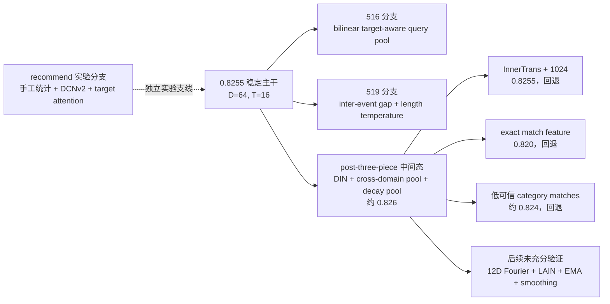

# 目录

- [# 1.1 能找到的最高已记录结果](#11-能找到的最高已记录结果)
- [# 1.2 但“0.826 最佳版”不是当前任一目录的原样最新版](#12-但0826-最佳版不是当前任一目录的原样最新版)
- [# 1.3 最有价值的改动排序](#13-最有价值的改动排序)
- [# 2.1 两个目录存在陈旧 run 配置](#21-两个目录存在陈旧-run-配置)
- [# 4.1 改了什么](#41-改了什么)
- [# 4.2 为什么这是“语义对齐”而不只是特征相加](#42-为什么这是语义对齐而不只是特征相加)
- [# 4.3 为什么加法融合优于已尝试方案](#43-为什么加法融合优于已尝试方案)
- [# 4.4 价值判断](#44-价值判断)
- [# 5.1 稳定主线已经包含两类时间](#51-稳定主线已经包含两类时间)
  - [# 请求发生在什么周期位置](#请求发生在什么周期位置)
  - [# 每次行为距离当前请求多久](#每次行为距离当前请求多久)
- [# 5.2 为什么比单纯位置编码更有价值](#52-为什么比单纯位置编码更有价值)
- [# 5.3 12 维多频 Fourier 是否值得保留](#53-12-维多频-fourier-是否值得保留)
- [# 6.1 最新结论：516 前置 target-aware pooling 是当前最优](#61-最新结论516-前置-target-aware-pooling-是当前最优)
- [# 6.2 为什么 516 优于后置 DIN residual](#62-为什么-516-优于后置-din-residual)
- [# 6.3 价值判断](#63-价值判断)
- [# 8.1 值得保留的候选统计](#81-值得保留的候选统计)
- [# 8.2 `recent_ratio` 实际上接近长度的重复编码](#82-recentratio-实际上接近长度的重复编码)
- [# 8.3 diversity 实现有轻微少计问题](#83-diversity-实现有轻微少计问题)
- [# 8.4 价值判断](#84-价值判断)
- [# 11.1 把类别 ID 当数值相乘](#111-把类别-id-当数值相乘)
- [# 11.2 Exact item-history match feature](#112-exact-item-history-match-feature)
- [# 11.3 低可信 category match pair](#113-低可信-category-match-pair)
- [# 11.4 盲目把序列扩到 1024](#114-盲目把序列扩到-1024)
- [# 11.5 乘法时间衰减](#115-乘法时间衰减)
- [# 11.6 LAIN、EMA、label smoothing](#116-lainemalabel-smoothing)
- [# 13.1 有证据的核心](#131-有证据的核心)
- [# 13.2 不确定项](#132-不确定项)

# 目录

- [[#1. 最终结论]]
- [[#2. 各目录定位]]
- [[#3. 版本演化主线]]
- [[#4. S 级改动一：同 fid 的离散语义与统计语义对齐]]
- [[#5. S 级改动二：请求时间与行为时间的双尺度对齐]]
- [[#6. S/A 级改动三：Candidate Item 与历史行为的软语义对齐]]
- [[#7. A 级改动：跨域聚合上下文]]
- [[#8. 聚合统计特征：方向正确，但 `recommend` 实现不能原样照搬]]
- [[#9. 519 的 inter-event gap：高潜力但没有实证]]
- [[#10. time-decay pool：概念合理，当前初始化不合理]]
- [[#11. 明确不值得保留或需要谨慎的改动]]
- [[#12. 推荐的复验矩阵]]
- [[#13. 推荐的“最可能最佳”重建配方]]
- [[#14. 最重要的工程建议]]

# 1. 最终结论

# 1.1 能找到的最高已记录结果

当前工作区中，最高的可信已记录结果不是 0.8255，而是约 **0.826**。

证据来自：

- `baseline - 副本-0.8255 - 副本/run.sh`：明确记录 InnerTrans + 1024 长序列使结果从 `0.826 → 0.8255`；
- 同一文件明确记录 exact item-history match feature 使结果从 `0.826 → 0.820`；
- `dataset.py` 记录加入若干低可信 category match pair 后从 `~0.826 → ~0.824`。

因此 0.826 至少被三个独立回退注释共同当作对照基线，不像偶然笔误。

# 1.2 但“0.826 最佳版”不是当前任一目录的原样最新版

`baseline - 副本-0.8255 - 副本` 后来又加入了：

- 12 维 request-time Fourier；
- LAIN length prompt；
- EMA；
- label smoothing；
- R-Drop 参数调整；
- match feature 代码；
- InnerTrans 代码。

其中部分明确失败后被 flag 关闭，部分没有留下分数。因此：

> **最可能的最佳已测版本，是该目录的“post-three-piece”中间态，而不是 May 23 的最终源文件状态。**

“three-piece”由代码注释高置信指向：

1. DIN candidate-item → history target attention；
2. cross-domain pooled context；
3. time-decay sequence pooling。

R-Drop 是否已经参与 0.826 不能完全确认，应作为待复验项，而不是既定贡献。

# 1.3 最有价值的改动排序

| 优先级 | 改动 | 类型 | 当前判断 |
|---|---|---|---|
| S | 离散 ID 与同 fid 稠密统计按元素位置融合 | 特征语义对齐 | 最扎实、最应保留 |
| S | request→event 时间桶 + 请求时刻周期特征 | 时间对齐 | 已进入稳定主线，低风险 |
| S/A | candidate item 对多域历史的 DIN 软对齐 | 候选-历史语义对齐 | 最可能解释 0.8255→0.826 的核心之一 |
| A | 多域 mean pool 形成共享 cross-domain context | 跨域语义融合 | 与任务结构一致，可能贡献 0.826，但容量增长明显 |
| A/B | 序列长度、平均新近度、时间分散度、行为多样性 | 聚合统计特征 | 很有价值的候选，但 `recommend` 实现需要修正后重测 |
| B | inter-event gap（相邻行为时间差） | 行为节奏 | 方向正确，但 519 分支没有结果证据 |
| B | 多频 request-time Fourier | 周期时间特征 | 比 4 维表达更丰富，但当前没有结果证据 |
| C | time-decay pool | 新近性加权 | 可能有效，但当前初始化过于激进，需要修正 |
| C | R-Drop / EMA / label smoothing | 训练正则 | 不是特征价值，且未证明是 0.826 来源 |

# 2. 各目录定位

| 目录 | 时间/定位 | 主要内容 | 可运行性 | 分数证据 | 审计结论 |
|---|---|---|---|---|---|
| `recommend` | May 1 实验分支 | signed-log、序列统计、ID 数值交叉、DCNv2、target attention、cross-domain fusion | 原始 run 参数基本自洽 | 无 | 特征想法最多，但混入多个有问题实现，不能认定最佳 |
| `baseline - 副本-0.8255` | May 8 代码 + April 旧 run | coupled tokenizer、UE、request time、HyFormer | 旧 run 与新默认不自洽 | 目录名指向 0.8255 | 不是干净快照 |
| `baseline` | May 9 | 与上版主干接近，另含可选 LR schedule | 当前 run 与当前默认不自洽 | 无新增 | 版本拼接目录，不适合直接复跑 |
| `baseline - 516改` | May 18 | 64 维稳定主干 + bilinear target-aware Query pooling | 自洽，`T=16` | 待测/未留结果 | 语义对齐明确，但没有分数证明 |
| `baseline - 519` | May 19 | 删除 bilinear target pool，加入 inter-event gap 和 length temperature | 自洽，`T=16` | 未留结果 | 时间建模支线，价值待验证 |
| `baseline - 副本-0.8255 - 副本` | May 23 | DIN、cross-domain pool、decay pool、Fourier、LAIN、R-Drop、EMA 等 | 当前 run 可启动，但叠加未验证项 | 明确存在 0.826 中间态 | 最接近最佳来源，但当前 HEAD 不是已证明最佳配置 |

# 2.1 两个目录存在陈旧 run 配置

`baseline` 与 `baseline - 副本-0.8255` 的 `run.sh` 使用：

```text
user_ns=5, item_ns=2, num_queries=2

```

但其新代码默认又加入 2 个 UE Token 和 1 个 request-time Token：

```text
N_ns = 5 + 2 + 2 + 1 = 10
T = 4×2 + 10 = 18

```

full RankMixer 要求 `d_model % T == 0`，而 64 或 128 都不能整除 18。这进一步证明这些目录是“旧脚本 + 新代码”的拼接状态，不能通过目录名判断实际得分版本。

# 3. 版本演化主线



# 4. S 级改动一：同 fid 的离散语义与统计语义对齐

# 4.1 改了什么

对 fids `62,63,64,65,66,89,90,91`，离散数组与稠密数组按元素位置一一对应。改动不是先分别池化，而是在每个位置先融合：

$$

h_{f,j}=E_f(id_{f,j})+W_f stat_{f,j}

$$

再仅对有效位置做 masked mean：

$$

h_f=\frac{\sum_j\mathbb I(id_{f,j}\ne0)h_{f,j}}
{\max(1,\sum_j\mathbb I(id_{f,j}\ne0))}

$$

# 4.2 为什么这是“语义对齐”而不只是特征相加

假设一个数组记录多个类别 ID，另一个数组记录每个类别对应的次数、权重或统计量。若先各自池化：

```text
mean(category embeddings) + MLP(mean(stats))

```

模型只知道“有哪些类别”和“整体统计水平”，但不知道哪个统计属于哪个类别。

当前做法保留：

```text
category_j ↔ stat_j

```

这种配对关系，是传统宽表模型最容易丢失、也是 Transformer 最难从聚合后表示中恢复的信息。

# 4.3 为什么加法融合优于已尝试方案

变更记录明确说明：

- FloatBucketProj：AUC 下降；
- 乘法融合：AUC 下降；
- 当前保留加法融合。

原因很合理：

- 加法是稳定的残差式融合，ID Embedding 即使统计投影没学好也能保留；
- 乘法会让一侧的小值或异常尺度直接抑制另一侧；
- 统计值强行分桶会引入边界不连续和额外稀疏性。

# 4.4 价值判断

这是所有版本中最值得保留的特征改动。即使无法证明它单独带来多少 AUC，它具有清晰的数据语义、低泄露风险和低额外计算成本。

# 5. S 级改动二：请求时间与行为时间的双尺度对齐

# 5.1 稳定主线已经包含两类时间

# 请求发生在什么周期位置

基础版本使用北京时间 `UTC+8`，编码：

$$

[\sin(2\pi hour/24),\cos(2\pi hour/24),
\sin(2\pi weekday/7),\cos(2\pi weekday/7)]

$$

它回答：

```text
当前请求发生在一天/一周的什么位置？

```

# 每次行为距离当前请求多久

$$

\Delta t_j=\max(t_{request}-t_{event,j},0)

$$

离散为 64 个有效 bucket 后，与对应行为 Token 相加。它回答：

```text
这条行为相对当前预测时刻有多旧？

```

二者互补：一个描述当前场景的周期性，一个描述历史证据的新鲜度。

# 5.2 为什么比单纯位置编码更有价值

序列 index 只能表示“第几个行为”，不能区分：

- 10 次行为集中在 1 小时内；
- 10 次行为分散在 30 天内。

CVR 通常对 recency 和活跃节奏高度敏感，因此真实时间差比纯 position 更贴近任务语义。

# 5.3 12 维多频 Fourier 是否值得保留

后续版本把 request-time 扩展为：

- 小时周期：24h、12h、6h、3h；
- 星期周期：7d、3.5d；
- 每个周期 sin/cos，共 12 维。

理论收益：表达午晚高峰、半日节律、工作日/周末差异。

风险：

- 当前没有留下相对 4 维编码的独立 A/B 分数；
- 3h、3.5d 频率可能拟合数据采样噪声；
- 若线上时区或 timestamp 语义与离线不一致，会整体错位。

结论：**4 维时间编码是已进入稳定主线的必保项；12 维 Fourier 是低成本、值得重测的增强项，但不能写成已证明提升。**

# 6. S/A 级改动三：Candidate Item 与历史行为的软语义对齐

# 6.1 最新结论：516 前置 target-aware pooling 是当前最优

最新复盘需要修正旧判断：516 并不是应被淘汰的早期 pooling，而是当前更优的候选感知路径。它把候选 item 语义放进 Query Generator，让每一路序列先形成 candidate-aware interest，再进入 HyFormer 主干。

代码口径对应 `features/baseline - 516改`：

```python
target_emb = item_ns.mean(dim=1)
seq_pooled = BilinearTargetAttentionPooling(target_emb, seq_tokens, mask)
global_info = concat(ns_flat, seq_pooled)
q_tokens = FFN(global_info)
```

也就是：

$$
a_{s,j}=\operatorname{softmax}\left(rac{(W_s h_{s,j})^T e_{target}}{\sqrt D}
ight)
$$

$$
h^{target}_s=\sum_j a_{s,j}h_{s,j}
$$

$$
Q_s=\operatorname{FFN}_s([N_{flat};h^{target}_s])
$$

# 6.2 为什么 516 优于后置 DIN residual

旧版判断更偏向 0.826 后置 DIN residual，理由是零初始化残差更安全。但从当前结果看，安全性不是唯一目标，候选语义进入位置更关键。

516 的收益来自：

- **候选感知前置**：Query 生成时就知道当前 item，不再先生成泛化兴趣再后补候选关系；
- **早期降噪**：无关历史在进入 HyFormer 前就被降权，减少噪声在序列编码和 RankMixer 中扩散；
- **双线性跨空间匹配**：$W_s$ 可以学习 item NS 与 sequence token 的非线性对应，而不局限于普通点积；
- **主干路径参与更深**：候选感知 Query 会参与两层 HyFormer，而不是只在输出端补一层残差。

# 6.3 对后置 DIN residual 的重新定位

后置 DIN residual 仍然是一个合理、安全的候选方案，但不再应写成当前最优。它更像是在强主干后面增加的保守补丁：

$$
h_{out}=h_{base}+W_{DIN}\operatorname{mean}(h_{DIN})
$$

其优势是初始化安全，缺点是候选信息进入太晚。若主干已经混入大量与候选无关的历史噪声，末端 DIN 只能补救，不能阻止噪声进入主干。

# 6.4 当前价值判断

当前应把 516 前置 target-aware pooling 排在最高优先级，作为最优结构口径；后置 DIN residual 作为对照实验或稳定性备选，而不是主线最佳版本。

# 7. A 级改动：跨域聚合上下文

0.826 分支先对四个域各自 mean pool，再拼接：

$$

c=W_c[\bar h_a;\bar h_b;\bar h_c;\bar h_d]

$$

每个域的 Query Generator 同时读取：

$$

[NS;\bar h_s;h^{decay}_s;c]

$$

它解决的问题是：单域 Query 初始化只看本域，跨域信息要经过 HyFormer/RankMixer 才能传递；共享 context 把“用户整体活跃模式”提前注入 Query。

优点：

- 与多域行为任务结构一致；
- 只增加一个 4D→D 投影和 Query MLP 输入宽度；
- 对缺失/稀疏域可能提供补充信息。

风险：

- 注释明确指出它显著扩大 Query FFN 参数量，使过拟合提前约 2 epochs；
- 所有域无条件拼接，可能把噪声域带入强信号域；
- 它与 RankMixer 已有的跨域交互存在部分功能重叠。

结论：高价值，但建议用 gate 或低秩投影控制容量，并做单独开关实验。

# 8. 聚合统计特征：方向正确，但 `recommend` 实现不能原样照搬

# 8.1 值得保留的候选统计

每域可计算：

- `log1p(seq_len)` 或归一化长度；
- 平均 request→event 时间桶；
- 时间桶标准差，表示行为节奏集中/分散；
- unique item ratio，表示探索性/重复性；
- 相对其他域的活跃度。

这些特征把 Transformer 需要从数百个位置归纳的全局统计直接提供给模型，属于典型的“低成本、强先验”特征。

# 8.2 `recent_ratio` 实际上接近长度的重复编码

`recommend` 定义前 20% 位置中非零元素比例。由于变长序列被连续写在前面、padding 在末尾：

$$

recent\_ratio\approx\frac{\min(length,0.2L_{max})}{0.2L_{max}}

$$

它没有真正使用 timestamp，基本是长度的饱和变换，不是独立的新近度指标。

更合理的定义应基于时间窗口：

$$

recent\_ratio(\tau)=
\frac{\#\{j:t_{request}-t_j\le\tau\}}{\max(1,length)}

$$

例如分别计算 1h、1d、7d 窗口比例。

# 8.3 diversity 实现有轻微少计问题

当前通过排序后 transition 数估算 unique count。当序列有 padding 0 时，首个非零值不会被 `has_first` 计入，通常少算 1。应直接计算每行非零 unique，或修复首个正值计数。

# 8.4 价值判断

统计特征方向值得进入下一轮实验，但应只保留语义明确且无重复的版本：

```text
log1p(length)
recent_count_1h / 1d / 7d
mean/std(log1p(delta_t))
unique_item_ratio
repeat_item_ratio
cross-domain length ratios

```

# 9. 519 的 inter-event gap：高潜力但没有实证

519 除 request→event 时间差外，又计算相邻行为间隔：

$$

\Delta t_j^{inter}=\max(t_j-t_{j+1},0)

$$

并加入独立 Embedding：

$$

h_j=h_j^{content}+E_{abs}(\Delta t_j^{request})+E_{inter}(\Delta t_j^{inter})

$$

它刻画的是行为节奏：连续密集浏览、周期性行为和偶发行为即使绝对 recency 相同，inter-event pattern 也不同。

需要注意：

- 代码依赖“index 0 最新”的顺序假设；必须先用数据断言验证 timestamp 单调性；
- 519 同时删除 target attention、提高 Dropout 到 0.05、加入 sparse WD，因此即使有总结果也无法把变化单独归因给 inter-event；
- 当前没有保存 AUC。

结论：值得作为独立 ablation 重测，不应直接替换 DIN 分支。

# 10. time-decay pool：概念合理，当前初始化不合理

代码用：

$$

w_j\propto\exp(-\operatorname{softplus}(\alpha)b_j),\quad \alpha_{raw}=0.1

$$

但：

$$

\operatorname{softplus}(0.1)=0.7444

$$

bucket 相差 10 时权重比约为：

$$

e^{-0.7444\times10}\approx0.000585

$$

这不是温和衰减，而是接近“只看最小时间桶”的 hard recent pooling。它可能碰巧有效，但学习空间很差。

建议改为以下任一方式：

1. 初始化 raw alpha 为约 `-4.6`，使 `softplus(alpha)≈0.01`；
2. 对 bucket 先除以 64；
3. 使用 `log1p(delta_seconds)` 后再学习温度；
4. 同时保留 mean pool 与 decay pool，并加可学习 gate。

因此它可以保留为候选，但不应把当前写法视为最优实现。

# 11. 明确不值得保留或需要谨慎的改动

# 11.1 把类别 ID 当数值相乘

`recommend` 中：

$$

cross=\operatorname{sign}(u\cdot i)
\frac{\log(1+|u\cdot i|\bmod10^6)}{14}

$$

如果 `u` 和 `i` 是 categorical ID，ID 大小和乘积没有顺序/距离语义。这个交叉只会学习哈希式偶然规律，对未来 OOV 和重新编号极不稳定。

应替换为：

- Embedding dot/product；
- DCNv2/低秩 CrossNet；
- 具有相同实体语义时的 equality/match；
- 语义明确的 category pair hashing。

# 11.2 Exact item-history match feature

尽管 `item_id ↔ seq_c.fid47` 有直观语义，实测从 `0.826 → 0.820`。原因可能包括：

- 只有约 10.87% match recall，特征极稀疏；
- “无 match” sentinel 占约 90%，形成强烈分布偏置；
- 序列可能包含与标签时间边界不一致的信息；
- 训练/验证中的重复曝光关系发生漂移。

软 Attention 比硬统计更稳健。

# 11.3 低可信 category match pair

仅依据小 vocab 的 Jaccard 重合推断“同实体”，实测 `~0.826 → ~0.824`，说明 ID 空间重合不等于语义一致。

# 11.4 盲目把序列扩到 1024

InnerTrans + 1024 从 `0.826 → 0.8255`。说明 256/512 之外的历史要么信号弱、要么噪声更多，增加历史长度不等于增加有效信息。

# 11.5 乘法时间衰减

变更记录明确显示没有优于仅加 time-bucket embedding。乘法会直接压缩整个行为向量，容易破坏内容信号；更合适的是作为 attention bias 或额外 pooled view。

# 11.6 LAIN、EMA、label smoothing

这些出现在 0.826 之后的最新版中，但没有留下相对 0.826 的结果。它们不是“已证明最佳版”的组成。

# 12. 推荐的复验矩阵

不要再次一次堆 6 个模块。用同一时间切分、同一 seed 集合做最小消融：

| Exp | 基础 | 唯一变化 | 目的 |
|---|---|---|---|
| E0 | 稳定 D64/T16 baseline | 无 | 重建基准 |
| E1 | E0 | + coupled int-dense | 验证按位置语义融合 |
| E2 | E1 | + 4D request time + abs time buckets | 验证时间主线 |
| E3 | E2 | + zero-init DIN residual | 验证候选-历史软对齐 |
| E4 | E3 | + cross-domain pooled token | 验证跨域 context |
| E5 | E4 | + 修正后的 decay pool | 验证新近性聚合 |
| E6 | E3 | + inter-event gap | 与 cross-domain 分支正交比较 |
| E7 | E3 | + 修正后的序列统计 | 验证低成本全局特征 |
| E8 | 最优结构 | 4D→12D request Fourier | 单独验证多频周期特征 |

每组至少报告：

- 3 个 seeds 的 mean/std AUC；
- 相同 global step 的 validation AUC；
- strict time split AUC；
- cold-user / cold-item AUC；
- seen-ID / unseen-ID 分桶 AUC；
- LogLoss 或 calibration error；
- 参数量、训练时长、最佳 epoch。

# 13. 推荐的“最可能最佳”重建配方

# 13.1 有证据的核心

```text
d_model=64
num_hyformer_blocks=2
num_heads=4
num_queries=2
user_ns_tokens=3
UE tokens=2
item_ns_tokens=2
request_time_token=1
T=16
coupled int-dense fusion=on
absolute request→event time bucket=on
request time 4D Fourier=on
516 target-aware pooling=on
DIN residual=off（不再作为最优主线）
cross-domain pool=on
time-decay pool=on（但建议修正 alpha 初始化）
match features=off
InnerTrans=off
seq lengths=256/256/512/512
LAIN=off，直至单独验证
EMA=off，直至单独验证
label smoothing=off，直至单独验证

```

# 13.2 不确定项

- 0.826 是否使用了 R-Drop；
- 当时 Dropout 是 0.01 还是已经提高到 0.05；
- 0.826 是否仍使用 4 维 request time；从源码时间线推断大概率是 4 维；
- three-piece 各自的独立增益。

因此最严谨的说法是：

> 当前复盘口径：516 前置 target-aware pooling 是更优版本。它最可能的收益来源是候选语义在 Query Generator 阶段前置注入，而不是输出端后置 DIN residual。仍需保存完整 `train_config.json`、代码 hash 和提交分数，避免再次无法定位最佳版。

# 14. 最重要的工程建议

下一轮不要优先继续堆模型，而是先把“语义与时间契约”做成数据断言：

1. 验证每个 coupled fid 的 int/dense 数组长度完全一致；
2. 验证序列 timestamp 是 newest-first，并统计不满足比例；
3. 验证 request timestamp 与 event timestamp 使用同一时区和单位；
4. 验证 train/valid/test 的 OOV 率和 match-feature 覆盖漂移；
5. 对序列统计使用真实时间窗，不用位置 occupancy 代替 recency；
6. 对每个 item-seq 对齐关系要求 schema/业务实体证据，不能只看 ID Jaccard；
7. 保存每次 `train_config.json`、代码 hash、schema hash 和提交分数，避免再次无法定位最佳版。

如果只能选三个动作，顺序应是：

```text
先重建 516 前置 target-aware pooling 主线
→ 用后置 DIN residual 做对照消融
→ 单独加入修正后的时间/序列统计特征

```
