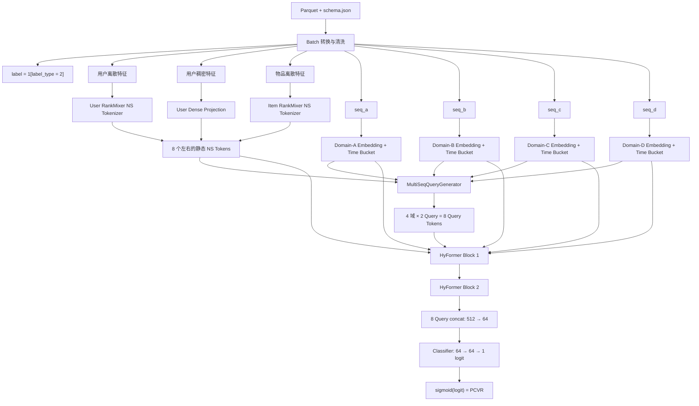

# PCVRHyFormer 模型反汇编报告

## 目录

- [结论](#结论)
- [计算过程](#计算过程)
- [原始 Token 配置](#原始-token-配置)
- [高基数特征硬过滤](#高基数特征硬过滤)
- [结论](#结论-1)
- [输入](#输入)
- [无参数 Token Mixing](#无参数-token-mixing)
- [共享 FFN 与残差](#共享-ffn-与残差)
- [为什么 `D % T == 0` 是硬约束](#为什么-d-t-0-是硬约束)
- [实际主损失：Binary Cross Entropy with Logits](#实际主损失binary-cross-entropy-with-logits)
- [是否多任务](#是否多任务)
- [Focal Loss](#focal-loss)
- [双优化器设计](#双优化器设计)
- [Adagrad 更新](#adagrad-更新)
- [AdamW 更新](#adamw-更新)

# 目录

- [# 0.1 一句话结论](#01-一句话结论)
- [# 0.2 核心贡献判断](#02-核心贡献判断)
- [# 0.3 必须先说明的版本审计结论](#03-必须先说明的版本审计结论)
- [# 1.1 端到端数据流](#11-端到端数据流)
- [# 1.2 Pipeline 的模块划分逻辑](#12-pipeline-的模块划分逻辑)
- [# 1.3 默认张量尺寸（0.8255 主干）](#13-默认张量尺寸08255-主干)
- [# 2.1 监督目标](#21-监督目标)
- [# 2.2 数据切分](#22-数据切分)
- [# 2.3 缺失值、Padding 与越界处理](#23-缺失值padding-与越界处理)
- [# 2.4 时间间隔特征](#24-时间间隔特征)
- [# 3.1 静态特征：RankMixer NS Tokenizer](#31-静态特征rankmixer-ns-tokenizer)
  - [# 结论](#结论)
  - [# 计算过程](#计算过程)
  - [# 原始 Token 配置](#原始-token-配置)
  - [# 高基数特征硬过滤](#高基数特征硬过滤)
- [# 3.2 稠密特征投影](#32-稠密特征投影)
- [# 3.3 多域序列 Embedding](#33-多域序列-embedding)
- [# 3.4 Query Generator：从长序列构造固定兴趣槽位](#34-query-generator从长序列构造固定兴趣槽位)
  - [# 结论](#结论-1)
- [# 3.5 域内 Transformer Encoder](#35-域内-transformer-encoder)
- [# 3.6 Query-to-Sequence Cross-Attention](#36-query-to-sequence-cross-attention)
- [# 3.7 RankMixer：跨域与静态特征融合的核心](#37-rankmixer跨域与静态特征融合的核心)
  - [# 输入](#输入)
  - [# 无参数 Token Mixing](#无参数-token-mixing)
  - [# 共享 FFN 与残差](#共享-ffn-与残差)
  - [# 为什么 `D % T == 0` 是硬约束](#为什么-d-t-0-是硬约束)
- [# 3.8 两层 HyFormer 的信息迭代](#38-两层-hyformer-的信息迭代)
- [# 3.9 输出层](#39-输出层)
- [# 5.1 损失函数（Loss）](#51-损失函数loss)
  - [# 实际主损失：Binary Cross Entropy with Logits](#实际主损失binary-cross-entropy-with-logits)
  - [# 是否多任务](#是否多任务)
  - [# Focal Loss](#focal-loss)
- [# 5.2 优化器（Optimizer）](#52-优化器optimizer)
  - [# 双优化器设计](#双优化器设计)
  - [# Adagrad 更新](#adagrad-更新)
  - [# AdamW 更新](#adamw-更新)
- [# 5.3 学习率调度](#53-学习率调度)
- [# 5.4 梯度控制](#54-梯度控制)
- [# 5.5 Epoch、Early Stopping 与模型选择](#55-epochearly-stopping-与模型选择)
- [# 6.1 激活函数](#61-激活函数)
- [# 6.2 Dropout](#62-dropout)
- [# 6.3 显式/隐式正则化汇总](#63-显式隐式正则化汇总)
- [# 6.4 参数初始化](#64-参数初始化)
- [# 6.5 训练加速](#65-训练加速)
- [# UE、request-time、coupled tokenizer 的特殊说明](#uerequest-timecoupled-tokenizer-的特殊说明)
- [# 9.1 与任务结构匹配的归纳偏置](#91-与任务结构匹配的归纳偏置)
- [# 9.2 容量控制较合理](#92-容量控制较合理)
- [# 9.3 优化器与参数类型匹配](#93-优化器与参数类型匹配)
- [# 10.1 本地验证偏乐观](#101-本地验证偏乐观)
- [# 10.2 Query 语义未约束](#102-query-语义未约束)
- [# 10.3 mean-pool Query 初始化较粗](#103-mean-pool-query-初始化较粗)
- [# 10.4 full RankMixer 约束强](#104-full-rankmixer-约束强)
- [# 10.5 Dense AdamW 未做 no-decay 分组](#105-dense-adamw-未做-no-decay-分组)
- [# 10.6 序列截断方向需要数据语义确认](#106-序列截断方向需要数据语义确认)
- [# 当前仍缺失的复现证据](#当前仍缺失的复现证据)

# 目录

- [[#0. 执行摘要]]
- [[#1. 整体架构（Pipeline）]]
- [[#2. 输入层与数据基建]]
- [[#3. 核心组件逐层剖析]]
- [[#4. 特征交叉与融合方式总表]]
- [[#5. 训练策略基建]]
- [[#6. 其他微操与正则化]]
- [[#7. 0.8255 有效超参数画像]]
- [[#8. 哪些模块不属于原始 0.8255]]
- [[#9. 为什么这套模型能到 0.8255]]
- [[#10. 模型局限与风险]]
- [[#11. 最终模型卡（适合直接复述）]]
- [[#12. 证据索引]]

# 0. 执行摘要

# 0.1 一句话结论

0.8255 模型不是传统的“Embedding 拼接后过 MLP”，而是一套面向多行为域的混合 Transformer：它先把用户、物品和稠密静态特征压缩成少量 **NS Tokens**，再从 4 路行为序列中生成每域 2 个 Query，通过两层“域内序列建模 → Query 对序列交叉注意力 → RankMixer 跨域/静态特征融合”，最后用 8 个 Query Token 做单任务 PCVR 预测。

# 0.2 核心贡献判断

模型得到 0.8255 的主要结构性来源，高置信可归纳为四点：

1. **多域序列分治**：`seq_a/seq_b/seq_c/seq_d` 各自使用独立 Transformer 参数，避免不同域的行为语义被粗暴混合。
2. **Query Bottleneck**：每个行为域最终只通过 2 个 Query 与其他域交互，把长序列压缩成固定容量的兴趣表示。
3. **RankMixer 跨 Token 交叉**：用无参数的 reshape-transpose 重排通道，再用共享 FFN 完成 8 个 Query 与静态 NS Token 的融合。
4. **稀疏/稠密参数分治优化**：Embedding 用 Adagrad，Transformer/MLP 等稠密参数用 AdamW，符合推荐模型两类参数截然不同的梯度统计。

# 0.3 必须先说明的版本审计结论

“0.8255”目录不是出分时的只读快照，而是在出分后继续加入了新模块。证据如下：

- 原始 `run.sh` 时间较早，显式使用 `user_ns_tokens=5`、`item_ns_tokens=2`。
- 后来的 `train.py/model.py` 增加了 UE Token、request-time Token、int-dense coupling 等默认逻辑。
- 把旧 `run.sh` 与新默认项直接组合，会令总 Token 数变为 `T=18`，不满足 `64 % T == 0`，无法运行 full RankMixer。
- 后续 `CHANGES.md` 又把 `user_ns_tokens` 改成 3，以 `3 个 user NS + 2 个 UE + 2 个 item NS + 1 个 request-time = 8 个 NS` 恢复 `T=16`。

因此，本报告将证据分成三档：

| 标记 | 含义 |
|---|---|
| **已确认** | 由原始启动脚本、核心主干代码或明确回退记录直接证明 |
| **高置信重建** | 多份代码与变更记录相互吻合，但缺少当次运行保存的 `train_config.json` |
| **不能归因** | 出分后新增、尝试或回退的模块，不计入 0.8255 的贡献 |

# 1. 整体架构（Pipeline）

# 1.1 端到端数据流



# 1.2 Pipeline 的模块划分逻辑

| 阶段 | 输入 | 输出 | 设计意图 |
|---|---|---|---|
| 数据层 | Parquet、schema、时间戳、label_type | 规整 Tensor | 把变长、多类型特征统一成模型可消费的布局 |
| 静态特征 Token 化 | user/item int、user dense | NS Tokens `(B, N_ns, 64)` | 将大量离散/稠密字段压缩成少数 token，控制 Transformer 计算量 |
| 序列 Token 化 | 4 个行为域 | 4 组 `(B, L_i, 64)` | 保留域内逐行为结构，并注入行为距当前请求的时间信息 |
| Query 初始化 | NS Tokens + 各域 mean pool | 每域 2 个 Query | 用固定数量的兴趣槽位承接长序列信息 |
| HyFormer 主干 | Query、NS、4 路序列 | 更新后的 Query/NS/序列 | 域内建模、Query 解码、跨域融合交替进行 |
| 输出头 | 最终 8 个 Query | 单个 logit | 只让压缩后的兴趣 Query 进入预测，形成信息瓶颈 |

# 1.3 默认张量尺寸（0.8255 主干）

设批大小为 `B`，隐藏维度 `D=64`，行为域数 `S=4`，每域 Query 数 `Nq=2`：

| 张量 | 形状 |
|---|---:|
| 单个离散字段 Embedding | `(B, 64)` 或 `(B, L, 64)` |
| User NS Tokens | 原始脚本为 `(B, 5, 64)` |
| Item NS Tokens | `(B, 2, 64)` |
| User Dense Token | 高置信重建为 `(B, 1, 64)` |
| NS Tokens 合计 | 高置信重建为 `(B, 8, 64)` |
| 单域序列 | `(B, L_i, 64)` |
| 单域 Query | `(B, 2, 64)` |
| 4 域 Query 合计 | `(B, 8, 64)` |
| RankMixer 输入 | `(B, 16, 64)` |
| RankMixer 子空间宽度 | `d_sub = 64 / 16 = 4` |
| 最终 Query 展平 | `(B, 8×64) = (B, 512)` |
| 输出 Embedding | `(B, 64)` |
| 输出 Logit | `(B, 1)` |

> **版本说明**：后续代码用 `3 user NS + 2 UE + 2 item NS + 1 request-time` 替换上述静态 Token 构成，仍保持 `N_ns=8` 与 `T=16`。这是“保持主干宽度不变的特征 Token 重构”，不能直接算作原始 0.8255 的组成。

# 2. 输入层与数据基建

# 2.1 监督目标

训练标签由 `label_type` 映射为二值标签：

$$

y_i=\mathbb{I}(\text{label\_type}_i=2), \qquad y_i\in\{0,1\}

$$

模型输出单个 logit $z_i$，推理概率为：

$$

\hat p_i=\sigma(z_i)=\frac{1}{1+e^{-z_i}}

$$

这是**单任务 PCVR**，不是 CTR+CVR 联合训练，也没有 ESMM 式多任务塔。

# 2.2 数据切分

- 数据源：按文件名排序后的 Parquet Row Groups。
- 训练集：前 90% Row Groups。
- 验证集：最后 10% Row Groups。
- 训练 Row Groups 内通过 `buffer_batches=20` 做行级 shuffle。
- 验证集不 shuffle。
- 默认 `batch_size=256`。

这个切分比完全随机切分更接近顺序切分，但仍不等价于官方测试集的未来时间分布。工作区记录显示本地 AUC 约 0.868，而官方 AUC 为 0.8255；约 0.043 的差距与高基数 ID 在未来测试集上的 OOV/泛化退化相一致。

# 2.3 缺失值、Padding 与越界处理

- 离散值 `<=0` 统一映射为 0。
- `padding_idx=0`，对应 Embedding 固定为零向量。
- 多值离散字段使用 non-zero mask mean pooling。
- schema vocab 越界值默认裁剪到 0，而不是让 Embedding lookup 崩溃。
- 超过序列最大长度的行为截断；默认：
- `seq_a=256`
- `seq_b=256`
- `seq_c=512`
- `seq_d=512`

# 2.4 时间间隔特征

对每个序列行为，计算：

$$

\Delta t_{i,j}=\max(t_i^{request}-t_{i,j}^{behavior},0)

$$

再通过预定义边界离散为时间 bucket：

$$

b_{i,j}=1+\operatorname{bucketize}(\Delta t_{i,j})

$$

其中 0 保留给 padding，有效行为落入 1–64 桶。时间 Embedding 与行为 Token **加法融合**：

$$

h_{i,j}^{seq}=\operatorname{GELU}\left(W_{seq}[e_{i,j}^{(1)};\ldots;e_{i,j}^{(F)}]+b_{seq}\right)+e_{time}(b_{i,j})

$$

该设计保留了“发生了什么”和“多久以前发生”两个维度，但没有施加显式指数衰减；后续实验加入可学习乘法衰减后未提升，因此回退。

# 3. 核心组件逐层剖析

# 3.1 静态特征：RankMixer NS Tokenizer

## 结论

原始得分脚本使用 RankMixer tokenizer，把大量 user/item 离散字段先分别 Embedding，再拼成超长向量，均匀切成固定数量的 chunk，最后将每个 chunk 投影为 64 维 Token。它的目标不是保持“一字段一 Token”，而是以固定 Token 预算承载全部静态特征。

## 计算过程

对第 $f$ 个字段：

$$

v_f=\begin{cases}
E_f(x_f), & \text{单值字段}\\
\frac{\sum_j \mathbb{I}(x_{f,j}\neq0)E_f(x_{f,j})}
{\max(1,\sum_j\mathbb{I}(x_{f,j}\neq0))}, & \text{多值字段}
\end{cases}

$$

拼接所有字段：

$$

v=[v_1;v_2;\ldots;v_F]

$$

将 $v$ 补零后等分成 $K$ 段，每段独立投影：

$$

n_k=\operatorname{SiLU}\left(\operatorname{LN}(W_k v^{(k)}+b_k)\right),\quad k=1,\ldots,K

$$

实际代码的算子顺序是 `Linear → LayerNorm → SiLU`。

## 原始 Token 配置

- User NS Tokens：5
- Item NS Tokens：2
- User Dense：高置信为 1 个独立 Token
- 合计 NS：8
- `emb_dim=64`
- `d_model=64`

## 高基数特征硬过滤

启动脚本设置 `emb_skip_threshold=1,000,000`。若某字段 vocab 大于 100 万，不创建 Embedding，前向时直接用零向量代替：

$$

v_f=0,\quad |\mathcal V_f|>10^6

$$

这不是 Dropout，而是确定性的特征删除。其作用是降低显存与 ID 记忆风险，代价是彻底丢弃该字段信息。

# 3.2 稠密特征投影

原始结构高置信为将全部用户稠密特征投影为一个 Token：

$$

n_{dense}=\operatorname{SiLU}(\operatorname{LN}(W_d x_{dense}+b_d))

$$

后续版本改为对 fid 61、87 分别生成 UE Token，并引入 int-dense element-wise coupling；这些是得分后的特征表示升级，不应倒推为 0.8255 的原始贡献。

# 3.3 多域序列 Embedding

4 个序列域分别维护自己的：

- 每字段 Embedding Table；
- 多字段拼接投影层；
- Transformer Encoder；
- Cross-Attention 解码器。

对域 $s$ 的行为位置 $j$，先将该位置各个 side-info 字段的 Embedding 拼接：

$$

u_{s,j}=[E_{s,1}(x_{s,j,1});\ldots;E_{s,F_s}(x_{s,j,F_s})]

$$

再投影到统一维度并叠加时间桶：

$$

h_{s,j}=\operatorname{GELU}(W_su_{s,j}+b_s)+E_{time}(b_{s,j})

$$

当某序列字段 vocab 大于 `seq_id_threshold=10,000` 时，其 Embedding 在训练阶段额外施加 `2×dropout_rate=0.02` 的 Dropout，以抑制高基数 ID 过拟合。

# 3.4 Query Generator：从长序列构造固定兴趣槽位

## 结论

0.8255 主干使用的是 **mean-pool 条件 Query Generator**，不是后续的 DIN target-aware attention。

对域 $s$，先对有效序列位置做 masked mean pooling：

$$

\bar h_s=\frac{\sum_j m_{s,j}h_{s,j}}{\max(1,\sum_jm_{s,j})}

$$

把全部 NS Tokens 展平，并与该域的池化向量拼接：

$$

g_s=\operatorname{LN}([n_1;\ldots;n_{N_{ns}};\bar h_s])

$$

每个域有 2 套相互独立的 Query MLP：

$$

q_{s,k}=\operatorname{LN}\left(W_{s,k}^{(2)}
\operatorname{SiLU}(W_{s,k}^{(1)}g_s+b_{s,k}^{(1)})+b_{s,k}^{(2)}\right),\quad k\in\{1,2\}

$$

在 `N_ns=8, D=64, hidden_mult=4` 下：

- `global_info_dim=(8+1)×64=576`
- 单个 Query MLP：`576 → 256 → 64`
- 总计：4 个域 × 2 套独立 MLP = 8 套 Query MLP

这种设计允许同一行为域用两个潜在兴趣槽位编码不同的转化模式，但没有显式约束两个 Query 彼此正交或对应可解释语义。

# 3.5 域内 Transformer Encoder

每个 HyFormer Block 内，每个行为域拥有一套独立的标准 Pre-LN Transformer Encoder：

$$

h'_s=h_s+\operatorname{MHA}(\operatorname{LN}(h_s))

$$

$$

h''_s=h'_s+\operatorname{FFN}(\operatorname{LN}(h'_s))

$$

FFN 为：

$$

\operatorname{FFN}(x)=W_2\operatorname{Dropout}
(\operatorname{GELU}(W_1x+b_1))+b_2

$$

核心参数：

| 参数 | 数值 |
|---|---:|
| `d_model` | 64 |
| `num_heads` | 4 |
| `head_dim` | 16 |
| `hidden_mult` | 4 |
| FFN hidden | 256 |
| Transformer/HyFormer blocks | 2 |
| RoPE | 默认关闭 |
| Causal mask | 默认关闭 |

注意：“2 个 HyFormer Block”意味着每个域会经历两次域内 Transformer 演化；每一层、每一域参数独立，不是 4 个域共享一个 Encoder。

# 3.6 Query-to-Sequence Cross-Attention

域内序列更新后，当前域的两个 Query 对该域全序列做 Cross-Attention：

$$

Q_s'=Q_s+\operatorname{MHA}
(\operatorname{LN}(Q_s),\operatorname{LN}(H_s),\operatorname{LN}(H_s))

$$

其中：

$$

\operatorname{Attn}(Q,K,V)=
\operatorname{softmax}\left(\frac{QK^\top}{\sqrt{d_h}}+M\right)V

$$

$M$ 是 padding mask。该步骤把 Query Generator 的粗粒度 mean-pool 初始化，升级为对完整行为序列的内容寻址表示。

# 3.7 RankMixer：跨域与静态特征融合的核心

## 输入

将 4 个域的 8 个解码后 Query 与约 8 个 NS Tokens 拼接：

$$

X=[Q'_a;Q'_b;Q'_c;Q'_d;N]\in\mathbb R^{B\times16\times64}

$$

## 无参数 Token Mixing

由于 `T=16` 且 `D=64`，每个 Token 的通道被拆成 16 个 4 维子空间：

$$

X:\ (B,T,D)\rightarrow(B,T,T,d_{sub}),\quad d_{sub}=D/T=4

$$

交换 token 轴与子空间轴：

$$

(B,\text{token},\text{subspace},d_{sub})
\rightarrow(B,\text{subspace},\text{token},d_{sub})

$$

再 reshape 回 `(B,16,64)`。这一步不增加参数，却使每个输出 Token 的不同通道片段来自不同输入 Token，实现结构化的信息重排。

## 共享 FFN 与残差

$$

\hat X=\operatorname{TokenMix}(X)

$$

$$

E=W_2\operatorname{Dropout}
(\operatorname{GELU}(W_1\operatorname{LN}(\hat X)+b_1))+b_2

$$

$$

X_{out}=\operatorname{LN}(X+E)

$$

其中 `64 → 256 → 64` 的 FFN 对所有 16 个 Token 共享参数。

## 为什么 `D % T == 0` 是硬约束

full RankMixer 不是普通 Attention，而是依赖精确 reshape 的通道重排，因此必须满足：

$$

D\bmod T=0

$$

0.8255 配置满足 `64 % 16 = 0`。后续扩大 `d_model` 到 96/128 没有稳定提升，说明该任务的收益并非简单来自模型宽度。

# 3.8 两层 HyFormer 的信息迭代

单层 Block 的完整顺序是：

1. 4 个域分别做 Transformer Sequence Evolution；
2. 每域 Query 对本域序列做 Cross-Attention；
3. 拼接 8 Query + NS Tokens；
4. RankMixer 做跨域/静态特征融合；
5. 再拆回每域 Query 和 NS，送入下一层。

因此第二层 Query 已经携带第一层跨域融合后的信息，再反向读取各自行为域。这个“读序列 → 跨域交流 → 再读序列”的两轮迭代，是 HyFormer 比单次 pooling 更强的关键。

# 3.9 输出层

最终只保留 8 个 Query，不直接把 NS 或全长序列送入分类器：

$$

o=\operatorname{LN}(W_o[Q_a;Q_b;Q_c;Q_d]+b_o),\quad 512\rightarrow64

$$

分类器：

$$

z=W_2\operatorname{Dropout}
(\operatorname{SiLU}(\operatorname{LN}(W_1o+b_1)))+b_2

$$

维度为：

```text
8 Query × 64 = 512
512 → 64 + LayerNorm
64 → 64 + LayerNorm + SiLU + Dropout(0.01)
64 → 1 logit

```

输出不在模型内部做 sigmoid；训练用 logits 直接计算 BCE，验证/推理时再 sigmoid，数值更稳定。

# 4. 特征交叉与融合方式总表

| 位置 | 融合方法 | 数学/算子形态 | 交叉范围 |
|---|---|---|---|
| 多值离散字段内部 | Masked mean pooling | `sum(mask*emb)/sum(mask)` | 同一字段多个取值 |
| 静态离散字段 | Embedding concat → equal chunks → per-chunk projection | RankMixer NS Tokenizer | user 内、item 内字段组合 |
| 稠密静态特征 | Linear + LN + SiLU | 单独 NS Token | user dense 内部 |
| 序列同一位置多字段 | Embedding concat → Linear → GELU | 位置级 side-info 融合 | 同一行为位置的多个属性 |
| 行为与时间 | 加法 | sequence token + time-bucket embedding | 行为内容 × 时间间隔 |
| Query 初始化 | NS flatten + domain mean pool concat | 独立 MLP | 全部静态特征 × 单域粗粒度兴趣 |
| 域内行为 | Self-Attention | 4-head Transformer | 同一域不同行为位置 |
| Query 与行为 | Cross-Attention | Query attends to domain sequence | 兴趣槽位 × 本域行为 |
| 跨域/静态特征 | Token/channel reshape + shared FFN | RankMixer | 4 域 Query × NS Tokens |
| 最终融合 | 8 Query concat → Linear | 512 → 64 | 所有域的最终兴趣表示 |

# 5. 训练策略基建

# 5.1 损失函数（Loss）

## 实际主损失：Binary Cross Entropy with Logits

0.8255 基线的活动配置是 `loss_type=bce`。对 batch 中 $N$ 个样本：

$$

\mathcal L_{BCE}=-\frac1N\sum_{i=1}^{N}
\left[y_i\log\sigma(z_i)+(1-y_i)\log(1-\sigma(z_i))\right]

$$

PyTorch 实际使用稳定形式 `binary_cross_entropy_with_logits`，避免先 sigmoid 后取对数造成溢出。

## 是否多任务

否。`action_num=1`，只有一个 PCVR logit；不存在任务权重、uncertainty weighting、GradNorm 或 CTR/CVR 多塔损失。

## Focal Loss

代码提供可选 Focal Loss，但原始启动脚本没有开启，因此不能归因于 0.8255：

$$

p_t=yp+(1-y)(1-p)

$$

$$

\alpha_t=y\alpha+(1-y)(1-\alpha)

$$

$$

\mathcal L_{focal}=-\alpha_t(1-p_t)^\gamma\log(p_t)

$$

可选参数为 `alpha=0.25, gamma=2.0`。

# 5.2 优化器（Optimizer）

## 双优化器设计

| 参数组 | 优化器 | 学习率 | Betas | Weight Decay | 备注 |
|---|---|---:|---|---:|---|
| Embedding 稀疏参数 | Adagrad | 0.05 | N/A | 0.0 | 每个坐标按历史平方梯度自适应缩放 |
| Transformer/MLP/LN 等稠密参数 | AdamW | 1e-4 | (0.9, 0.98) | 0.01* | 解耦权重衰减 |

`*` AdamW 的 `weight_decay` 没有在构造函数中显式传入，因此采用 PyTorch 默认值 0.01。需要注意，它会作用于传入的全部 dense params；代码没有为 bias 和 LayerNorm 单独建立 no-decay 参数组。

## Adagrad 更新

$$

G_{t,j}=G_{t-1,j}+g_{t,j}^2

$$

$$

\theta_{t+1,j}=\theta_{t,j}-
\frac{\eta_s}{\sqrt{G_{t,j}}+\epsilon}g_{t,j}

$$

稀疏 ID 在不同 batch 中出现频率差别很大，Adagrad 能为高频维度自动降低有效步长。

## AdamW 更新

$$

m_t=\beta_1m_{t-1}+(1-\beta_1)g_t

$$

$$

v_t=\beta_2v_{t-1}+(1-\beta_2)g_t^2

$$

$$

\theta_{t+1}=(1-\eta\lambda)\theta_t-
\eta\frac{\hat m_t}{\sqrt{\hat v_t}+\epsilon}

$$

其中 `lr=1e-4, beta1=0.9, beta2=0.98, lambda=0.01`。

# 5.3 学习率调度

**无 LR Scheduler，采用常数学习率。**

- Dense LR：持续为 `1e-4`
- Sparse LR：持续为 `0.05`
- 后续尝试 `CosineAnnealingLR(T_max=8)`，但在约第 6 epoch 已降到约 `6e-5`，限制后期收敛，因此回退。
- 没有 warmup、OneCycle、ReduceLROnPlateau。

# 5.4 梯度控制

每步反向后，对全部模型参数做 global norm clipping：

$$

g\leftarrow g\cdot\min\left(1,\frac{1.0}{\|g\|_2}\right)

$$

即 `clip_grad_norm_(max_norm=1.0)`。它主要防止长序列 Attention 与高维 Query MLP 造成偶发梯度尖峰。

# 5.5 Epoch、Early Stopping 与模型选择

| 项 | 值/状态 |
|---|---|
| 历史有效训练长度 | 记录显示约 5 epochs |
| `patience` | 5 |
| 监控指标 | 验证集 AUC，越高越好 |
| 验证频率 | 默认每个 epoch 末 |
| 最佳 checkpoint | 验证 AUC 创新高时保存 |
| 精确 executed `num_epochs` | 缺失，不能从当前被修改过的默认值 999 反推 |

后续记录指出旧训练器存在“训练结束后 live model 未恢复最佳权重”的问题，后来才补上 restore-best。它不一定影响已落盘的 best checkpoint，但若当时直接拿最后 epoch 的内存模型推理，可能造成偏差。

# 6. 其他微操与正则化

# 6.1 激活函数

| 模块 | 激活 |
|---|---|
| NS Tokenizer 输出 | SiLU |
| 序列多字段投影 | GELU |
| Query Generator | SiLU |
| Transformer FFN | GELU |
| RankMixer FFN | GELU |
| 最终分类器 | SiLU |

代码还实现了 SwiGLU Encoder 备选项：

$$

\operatorname{SwiGLU}(x)=W_o\left(x_1\odot\operatorname{SiLU}(x_2)\right)

$$

但活动配置 `seq_encoder_type=transformer`，所以不能把 SwiGLU 当成 0.8255 主干。

# 6.2 Dropout

基础 `dropout_rate=0.01`，应用位置包括：

- Query Tokens 输入主干前；
- NS Tokens 输入主干前；
- Sequence Tokens 输入主干前；
- Transformer Attention 权重；
- Transformer FFN；
- RankMixer FFN；
- 最终分类器；
- 高基数序列 ID Embedding 使用额外 `0.02` Dropout。

这是较轻的正则强度，说明 64 维、2 层主干在当时数据规模下并不需要大 Dropout。后续 `d_model=128` 时曾把 Dropout 提至 0.1，但仍发生明显过拟合，最终回退到 64 维。

# 6.3 显式/隐式正则化汇总

| 手段 | 0.8255 状态 | 作用 |
|---|---|---|
| AdamW weight decay | 开启，默认 0.01 | 约束稠密参数幅度 |
| Sparse weight decay | 0.0 | 不衰减 Embedding |
| Dropout | 0.01 | 抑制协同适配 |
| 高基数序列 ID Dropout | 0.02 | 降低 ID 记忆 |
| `emb_skip_threshold` | 1,000,000 | 直接删除超高基数 Embedding |
| Gradient clipping | max norm 1.0 | 防止梯度爆炸 |
| Early stopping | patience 5 | 以验证 AUC 控制过拟合 |
| Embedding reinit | 关闭（threshold=0） | 后续验证短训练下会破坏收敛 |
| Label smoothing | 未使用 | 后加模块 |
| R-Drop | 未使用 | 后加模块 |
| EMA | 未使用 | 后加模块 |

# 6.4 参数初始化

- 所有 Embedding 使用 Xavier Normal 初始化。
- padding 行（index 0）初始化后强制清零。
- Linear/LayerNorm 沿用 PyTorch 默认初始化。
- 后来加入的 Attention 输出门 `W_g` 使用零权重、bias=1 初始化，但该门控属于出分后的代码演化，不能安全归因于 0.8255。

# 6.5 训练加速

- `torch.compile()` 在当前训练入口默认开启。
- DataLoader 使用多进程；原始脚本覆盖为 `num_workers=8`。
- `pin_memory` 在 CUDA 可用时开启。
- 多 batch buffer 合并后做行级 shuffle。
- 使用 PyTorch SDPA 实现多头注意力。

由于当次执行配置未保存，`torch.compile` 是否已经存在于最早 0.8255 运行版本只能视为中等置信；它影响速度，不改变理论模型函数。

# 7. 0.8255 有效超参数画像

| 类别 | 参数 | 0.8255 值 | 证据置信度 |
|---|---|---:|---|
| 任务 | `action_num` | 1 | 已确认 |
| 模型 | `d_model` | 64 | 已确认 |
| 模型 | `emb_dim` | 64 | 已确认 |
| 模型 | `num_hyformer_blocks` | 2 | 已确认 |
| 模型 | `num_heads` | 4 | 已确认 |
| 模型 | `hidden_mult` | 4 | 已确认 |
| 模型 | `num_queries` | 2/域 | 已确认 |
| 模型 | 行为域数量 | 4 | 已确认 |
| 模型 | `seq_encoder_type` | transformer | 已确认 |
| 模型 | `rank_mixer_mode` | full | 已确认 |
| 模型 | `use_rope` | False | 已确认 |
| Token | `user_ns_tokens` | 5 | 原始 run.sh 直接证据 |
| Token | `item_ns_tokens` | 2 | 原始 run.sh 直接证据 |
| Token | NS 总数 | 8 | 高置信重建 |
| Token | 总融合 Token 数 `T` | 16 | 高置信重建/后续记录确认 |
| 序列 | max lens | 256/256/512/512 | 当前默认与回退记录确认 |
| 序列 | time buckets | 开启，64 个有效桶 + padding | 已确认 |
| 正则 | `dropout_rate` | 0.01 | 已确认 |
| 正则 | ID Embedding Dropout | 0.02 | 已确认 |
| 正则 | grad clip | 1.0 | 已确认 |
| 特征 | `emb_skip_threshold` | 1,000,000 | 原始 run.sh 直接证据 |
| 训练 | batch size | 256 | 高置信默认 |
| 训练 | seed | 42 | 高置信默认 |
| 训练 | dense optimizer | AdamW | 已确认 |
| 训练 | dense lr | 1e-4 | 已确认 |
| 训练 | AdamW betas | (0.9, 0.98) | 已确认 |
| 训练 | AdamW WD | 0.01（PyTorch 默认） | 已确认 |
| 训练 | sparse optimizer | Adagrad | 已确认 |
| 训练 | sparse lr | 0.05 | 已确认 |
| 训练 | sparse WD | 0.0 | 已确认 |
| 训练 | scheduler | 无，常数 LR | 回退记录确认 |
| 训练 | loss | BCEWithLogits | 已确认 |
| 训练 | epochs | 约 5 | 变更记录；精确执行配置缺失 |
| 训练 | patience | 5 | 高置信默认 |

# 8. 哪些模块不属于原始 0.8255

这是避免错误归因的关键清单。

| 模块 | 状态 | 结论 |
|---|---|---|
| Bilinear target-aware pooling | 后续 `baseline + target_attn` | 不属于原始 0.8255 |
| DIN item-to-all-sequence attention | 明确标注 post-0.8255 | 不属于原始 0.8255 |
| Cross-domain mean-pool token | 明确标注 post-0.8255 | 不属于原始 0.8255 |
| Time-decay weighted pool | 明确标注 post-0.8255 | 不属于原始 0.8255 |
| R-Drop | 明确标注 post-0.8255 | 不属于原始 0.8255 |
| EMA dense weights | 明确标注 post-0.8255 | 不属于原始 0.8255 |
| Label smoothing 0.02 | 明确标注 post-0.8255 | 不属于原始 0.8255 |
| LAIN length prompts | 明确标注 post-0.8255 | 不属于原始 0.8255 |
| Explicit item↔sequence match stats | 后续尝试且 AUC 回退 | 不属于；也未证明有效 |
| LONGER InnerTrans + seq=1024 | 后续尝试，无增益后回退 | 不属于 |
| CosineAnnealingLR | 后续尝试后回退 | 原始采用常数 LR |
| 可学习乘法时间衰减 | 后续尝试后回退 | 原始仅加 time-bucket embedding |
| FiLM with label_type | 被识别为标签泄露并删除 | 绝不能计入有效模型 |
| 2 层 UE MLP | 后续尝试后回退 | 原始/稳定版本为单层投影 |
| d_model 96/128 | 后续尝试，过拟合或振荡 | 0.8255 使用 64 |

# UE、request-time、coupled tokenizer 的特殊说明

当前 `baseline - 副本-0.8255` 的 May 版本代码包含这些模块，但原始 April `run.sh` 使用 5 个 user NS Tokens，说明它们至少没有以“当前默认组合”参与最早运行。更合理的版本链是：

```text
原始 0.8255：5 user NS + 1 user-dense + 2 item NS = 8 NS
↓ 特征 Token 重构
后续版本：3 user NS + 2 UE + 2 item NS + 1 request-time = 8 NS

```

两者保持 `T=16` 和 `d_model=64`，但静态特征表达不同。在没有当次 checkpoint sidecar 或执行日志前，不应把后者写进原始模型的确定性架构。

# 9. 为什么这套模型能到 0.8255

# 9.1 与任务结构匹配的归纳偏置

- CVR 依赖多域历史行为，模型保留 4 个域的独立语义，而不是先把所有历史拼成一条序列。
- Query Bottleneck 将每域长序列压缩成 2 个可学习兴趣槽位，既降低计算，又比 mean pooling 更有选择性。
- 第二层 HyFormer 可以使用第一层已经跨域交换过的信息重新读取本域序列，实现迭代式证据聚合。
- RankMixer 将静态条件与动态兴趣在 Token 层融合，比最终一把 concat 更早、更深地发生交互。

# 9.2 容量控制较合理

- `D=64, blocks=2` 对该数据规模更稳；96/128 没有产生稳定收益。
- Dropout 很轻，说明模型没有被过度正则。
- 超高基数 ID 直接跳过，高基数序列 ID 加倍 Dropout，针对排行榜未来分布偏移做了一定防护。

# 9.3 优化器与参数类型匹配

- Adagrad 对稀疏 Embedding 的不同曝光频率自适应。
- AdamW 对稠密 Attention/MLP 提供动量与解耦衰减。
- 常数 `1e-4` 避免短训练中 LR 过早衰减。
- 梯度裁剪提高长序列训练稳定性。

# 10. 模型局限与风险

# 10.1 本地验证偏乐观

本地约 0.868、官方 0.8255 的差距说明验证 Row Groups 与官方未来测试分布仍存在明显 gap。高基数 ID 记忆在本地有效，在未来时间窗会因新用户/新物品而失效。

# 10.2 Query 语义未约束

每域两个 Query 只是独立 MLP 输出，没有 diversity/orthogonality loss；两个 Query 可能学到冗余表示。

# 10.3 mean-pool Query 初始化较粗

原始 Query Generator 用 domain mean pool，无法在初始化时感知候选 item。真正的 target-aware interaction 只在后续实验才引入。

# 10.4 full RankMixer 约束强

`D % T == 0` 将 Token 数、隐藏维度和 Query 数紧耦合，任何 Token 增删都可能迫使改宽度或关闭 full mixing。这也是旧 `run.sh` 与新默认项组合失效的根源。

# 10.5 Dense AdamW 未做 no-decay 分组

LayerNorm 和 bias 也受到默认 0.01 weight decay。通常推荐模型会把 norm/bias 从 decay 中排除；当前实现更简单，但可能轻微影响收敛与校准。

# 10.6 序列截断方向需要数据语义确认

代码取每列前 `max_len` 个元素。只有当原始序列本来按“最新在前”排列时，才等价于保留最近行为；保存的 schema/日志中没有在本报告证据范围内证明排序方向。

# 11. 最终模型卡（适合直接复述）

```text
Model: PCVRHyFormer
Task: single-task post-click conversion prediction
Metric: leaderboard AUC 0.8255; local validation AUC ~0.868
Inputs:
- user categorical + dense features
- item categorical features
- 4 behavior sequence domains
- behavior-to-request time buckets
Static tokenizer:
- RankMixer NS tokenizer
- original script: 5 user NS + 2 item NS
- high-confidence original total: +1 user dense = 8 NS tokens
Sequence encoder:
- per-domain embeddings and projection
- independent 4-head Pre-LN Transformer per domain
- 2 HyFormer blocks
- d_model=64, FFN=256
Query mechanism:
- 2 queries per domain, 8 total
- initialized from flattened NS tokens + domain masked mean pool
- refined by query-to-sequence cross-attention
Cross-domain fusion:
- concatenate 8 queries + 8 NS = 16 tokens
- parameter-free RankMixer channel rewiring
- shared 64→256→64 GELU FFN + residual + LayerNorm
Head:
- concat 8 queries: 512→64
- 64→64→1 classifier with SiLU
Loss:
- BCEWithLogits, single task, no task weighting
Optimization:
- sparse embeddings: Adagrad, lr=0.05, wd=0
- dense params: AdamW, lr=1e-4, betas=(0.9,0.98), wd=0.01 default
- constant LR, no scheduler
- global grad clip=1.0
Regularization:
- dropout=0.01
- high-cardinality seq-ID embedding dropout=0.02
- skip vocab > 1,000,000
- early stopping on validation AUC, patience=5
- no R-Drop, no EMA, no label smoothing in original 0.8255

```

# 12. 证据索引

| 证据 | 路径 | 支持的结论 |
|---|---|---|
| 原始启动参数 | `baseline - 副本-0.8255/run.sh` | RankMixer、user NS=5、item NS=2、queries=2、skip threshold=1e6、workers=8 |
| 模型主干 | `baseline - 副本-0.8255/model.py` | Tokenizer、Query Generator、Transformer、Cross-Attention、RankMixer、输出头 |
| 训练入口 | `baseline - 副本-0.8255/train.py` | 默认超参数、数据切分、模型构造、loss 选择 |
| Trainer | `baseline - 副本-0.8255/trainer.py` | Adagrad + AdamW、BCE、grad clip、early stopping |
| 数据管道 | `baseline - 副本-0.8255/dataset.py` | label 映射、Row Group split、时间桶、padding/OOV |
| 变更与回退 | `baseline - 516改/CHANGES.md` | 0.8255/0.868 对照、D=64/T=16、常数 LR、失败实验、版本链 |
| 后加模块声明 | `baseline - 副本-0.8255 - 副本/run.sh` | DIN、R-Drop、EMA、label smoothing、LAIN 等均为 post-0.8255 |

# 当前仍缺失的复现证据

若要把“高置信重建”升级为“逐字节可复现”，还需要找到当次最佳 checkpoint 同目录中的：

1. `train_config.json` 或完整 `Args:` 日志；
2. 当次 `schema.json`；
3. checkpoint 的 `state_dict` key 列表和参数 shape；
4. 官方提交文件与 checkpoint 的对应记录；
5. 精确 epoch、global step、最佳本地 AUC 和 logloss。

在这些证据缺失时，本报告已经给出主干、损失、优化器和正则策略的完整代码级反汇编，但不会虚构当次未保存的执行参数。
