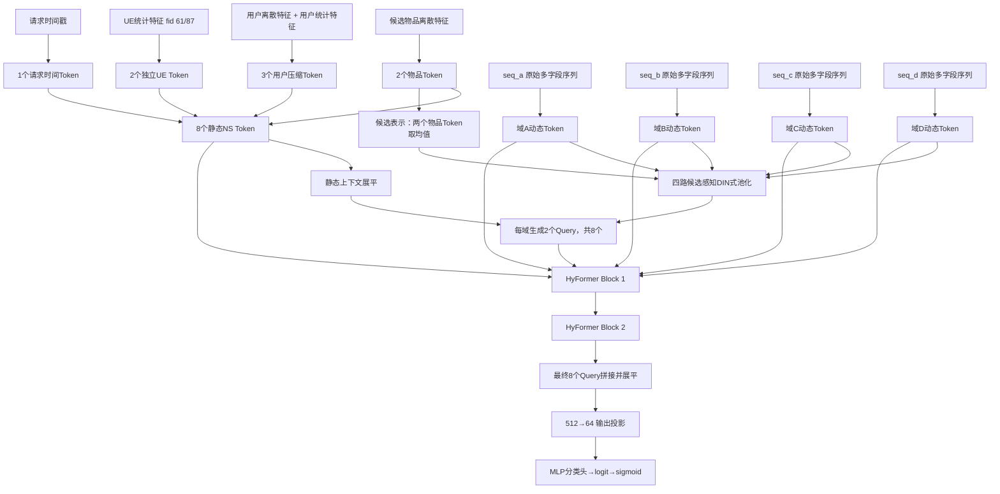

# PCVRHyFormer 完整模型架构逐字稿（516 最终版）


## 一、先用一句话讲清楚这个模型

我的模型是一个面向多行为域 PCVR 预估的 HyFormer：它先把用户、候选物品、请求上下文压缩成 8 个静态 Token，把四路历史行为分别编码成动态序列；随后用候选物品对每路历史做一次软匹配，生成每路 2 个多兴趣 Query；再经过两层“域内序列演化—Query 读取历史—RankMixer 跨域融合”，最终用 8 个 Query 完成二分类预测。


## 二、为什么要做这个模型

### 2.1 任务是什么

这是一个二分类 PCVR 预估任务。代码中标签由：

```python
label = (label_type == 2)
```

得到。模型输出的是 logit，训练时使用 `BCEWithLogitsLoss`，推理或计算概率时再做 sigmoid：

$$
p(y=1\mid x)=\sigma(z)=\frac{1}{1+e^{-z}}.
$$


### 2.2 原问题有三个结构性难点

第一个难点是**多域行为异构**。四路行为代表不同类型的历史，字段集合、序列长度和行为语义都不一样。如果直接拼接，模型不仅要学习行为本身，还要额外辨认每个位置属于哪个域。

第二个难点是**离散 ID 和统计值的语义容易错位**。例如同一个 fid 可能同时有类别 ID 和对应统计值。若把所有 ID 做一套表示、所有统计值再做另一套表示，最后才整体拼接，模型需要重新猜测“哪个统计值描述哪个 ID”。

第三个难点是**历史兴趣缺少候选感知**。同一个用户的历史兴趣很多，但当前候选只与其中一部分相关。如果先把历史压成一个完全与候选无关的向量，后面再加入候选信息，第一次压缩造成的信息损失已经无法恢复。


## 三、516 最终配置总表

当前 `run.sh` 的主动配置与 `train.py` 默认参数合并后，核心配置如下：

| 模块 | 当前配置 |
|---|---:|
| 隐藏维度 `d_model` | 64 |
| Embedding 维度 `emb_dim` | 64 |
| 序列域数量 | 4 |
| 每个域的 Query 数量 | 2 |
| Query 总数 | 8 |
| 用户压缩 Token | 3 |
| 用户 UE Token | 2，对应 fid 61、87 |
| 物品压缩 Token | 2 |
| 请求时间 Token | 1 |
| 静态 NS Token 总数 | 8 |
| HyFormer Block | 2 层 |
| Attention Head | 4 |
| 单头维度 | 16 |
| FFN 扩张倍数 | 4，即 64→256→64 |
| Dropout | 0.01 |
| 序列上限 | A/B 为 256，C/D 为 512 |
| 序列编码器 | Transformer Encoder |
| 候选感知池化 | 开启 |
| 时间桶 | 开启 |
| RankMixer | full mode |
| RoPE | **当前启动脚本未开启** |
| 损失 | BCEWithLogits |
| Embedding 优化器 | Adagrad，lr=0.05 |
| 其余参数优化器 | AdamW，lr=1e-4，betas=(0.9,0.98) |
| 梯度裁剪 | 全局范数 1.0 |

### 3.1 最关键的形状恒等式

四个域、每域两个 Query，因此动态 Query 数量为：

$$
N_{Q}=4\times 2=8.
$$

静态 Token 数量为：

$$
N_{\text{NS}}=3+2+2+1=8.
$$

进入 RankMixer 的总 Token 数：

$$
T=N_{Q}+N_{\text{NS}}=8+8=16.
$$

full RankMixer 要求 `d_model % T == 0`。当前：

$$
64 \bmod 16 = 0,
$$

所以每个 Token 在 Token mixing 时对应的子空间宽度为：

$$
d_{\text{sub}}=64/16=4.
$$

## 四、从头到尾的数据流总图



一句话理解这张图：**静态 Token 告诉模型“谁在什么场景下看什么候选”，动态序列告诉模型“过去发生了什么”，Query 是两者之间的检索接口，RankMixer 负责让不同兴趣域与全局上下文交换信息。**

## 五、模型输入层：每个张量是什么

一个 batch 被整理成 `ModelInput`：

```text
user_int_feats       [B, U_int]
item_int_feats       [B, I_int]
user_dense_feats     [B, U_dense]
item_dense_feats     [B, I_dense]
seq_data[domain]     [B, S_m, L_m]
seq_lens[domain]     [B]
seq_time_buckets[m]  [B, L_m]
request_time_feats   [B, 4]
```

其中：

- `B` 是 batch size；
- `S_m` 是第 m 个行为域在每个行为位置上的字段数；
- `L_m` 是该域截断、补齐后的最大长度；
- 当前 A、B 两域最多 256，C、D 两域最多 512；
- `seq_lens` 保存真实长度，用于构造 padding mask；
- 序列张量的 0 是 padding ID。

### 5.1 截断到底保留哪一端

数据加载代码读取每个 list 的前 `max_len` 个元素：

```python
out[i, c, :ul] = vals[s:s + ul]
```

所以“前 `max_len` 个元素究竟是最近还是最早行为”取决于上游写入 Parquet 时的排序约定。面试时不要脱离数据口径直接说“代码一定保留最近行为”。更严谨的说法是：

> 模型侧按上游序列顺序保留前 `max_len` 个位置，因此上线前必须确认上游是否按倒序组织；若业务目标是保留最近历史，上游就应把最近行为放在前面，或者模型侧显式做尾截断。

这也是一个很容易被追问的工程细节。

## 六、静态 NS Token 是怎样构造的

这里的 NS 可以理解为 non-sequential，即不按历史时间展开的用户、物品和请求上下文。

最终一共得到 8 个静态 Token：

```text
3 个用户压缩 Token
+ 2 个独立 UE Token
+ 2 个物品压缩 Token
+ 1 个请求时间 Token
= 8 个 NS Token
```

### 6.1 离散特征的基础表示

对于标量离散特征，先查 Embedding：

$$
e_f = E_f[x_f] \in \mathbb{R}^{64}.
$$

对于 multi-hot 特征，先逐 ID 查表，再对非 padding 位置做 masked mean：

$$
e_f=\frac{\sum_j \mathbf{1}(x_{fj}\ne0)E_f[x_{fj}]}
{\max(1,\sum_j\mathbf{1}(x_{fj}\ne0))}.
$$

这样无论一个 fid 是标量还是多个 ID，最后都得到一个 64 维 fid 表示。

### 6.2 同 fid 的 ID 与统计值如何耦合

516 版本对指定用户 fid 使用 `CoupledNSTokenizer`。核心不是把 ID 和统计特征放进两个大向量后再拼，而是在 fid 层就对齐：

$$
h_f = E_f(x_f)+W_f s_f+b_f.
$$

其中：

- `E_f(x_f)` 表示“这个类别是谁”；
- `s_f` 表示“这个类别对应的统计状态怎样”；
- `W_f s_f` 把统计值投影到同一个 64 维语义空间；
- 相加后，一个向量同时携带类别语义和与之对应的统计强弱。

如果一个 fid 有多个 ID/统计位置，代码会对有效位置做 masked mean。

#### 实际例子

假设一个特征表示用户最近偏好的类目 ID，同时还有该类目的点击次数：

```text
类目 ID = 37
近7天点击次数 = 12
```

原做法若把所有类别 Embedding 放在一边、所有统计值放在另一边，后续网络要自己学会“12 描述的是类目 37”。耦合后直接形成：

```text
类目37的Embedding + 点击次数12的线性投影
```

模型一开始拿到的就是“对类目 37 的兴趣强度较高”，语义关系不需要在深层网络中重新猜。

### 6.3 为什么多个 fid 最后只压成 3 个用户 Token

每个 fid 先得到一个 64 维向量，然后按确定顺序拼成一个长向量：

$$
H_u=[h_1;h_2;\cdots;h_F].
$$

代码把长向量补齐到可被 3 整除，再平均切成 3 段。每段独立做：

$$
t_k=\operatorname{SiLU}(\operatorname{LN}(W_kH_u^{(k)}+b_k)),
\quad k=1,2,3.
$$

得到：

```text
user_ns: [B, 3, 64]
```

这里的 3 个 Token 不是天然对应“画像、活跃度、价格”三个固定业务组。因为当前 `ns_groups_json=""`，代码默认每个特征先作为独立 group，再按拼接顺序切块。面试时应说它们是**固定顺序下的压缩子空间**，不能把未经配置保证的业务语义硬贴上去。

### 6.4 两个 UE Token

用户 dense 特征中的 fid 61 和 87 不混在大向量中，而是各自经过：

$$
t_{\text{UE}}=\operatorname{SiLU}(\operatorname{LN}(Ws+b)),
$$

各生成一个 `[B,1,64]` Token。

这样做的意义是：重要的整组连续统计特征拥有独立信息通道，不会因为和大量离散字段一起压缩而被稀释。

### 6.5 两个物品 Token

候选物品离散特征也采用“全部 fid 表示拼接—补齐—切成两段—各自投影”的方式：

```text
item_ns: [B, 2, 64]
```

它们有两个用途：

1. 作为静态 NS Token 参与后续 RankMixer；
2. 两个 Token 取均值，得到候选向量，参与候选感知 Query 初始化。

### 6.6 请求时间 Token

原始请求时间戳先转换为东八区时间，再构造四维周期特征：

$$
r=[\sin(2\pi h/24),\cos(2\pi h/24),
\sin(2\pi w/7),\cos(2\pi w/7)].
$$

然后经过 `Linear(4,64)+LayerNorm+SiLU` 得到一个 Token。

使用正余弦而不直接使用小时整数，是因为 23 点和 0 点在周期上很近，而整数距离却是 23；周期编码能保留这种首尾相邻关系。

### 6.7 静态 Token 汇总

最后按代码顺序拼接：

```text
[3个用户Token,
 2个UE Token,
 2个物品Token,
 1个请求时间Token]
→ ns_tokens: [B, 8, 64]
```

## 七、四路动态行为序列如何变成 Token

### 7.1 原始形状

第 m 路序列原始输入为：

```text
seq_m: [B, S_m, L_m]
```

例如某一路每个行为位置有 5 个字段，长度上限为 256，那么输入是 `[B,5,256]`。

### 7.2 同一个行为位置的多个字段先分别查表

第 l 个行为位置上的每个字段分别查自己的 Embedding：

$$
e_{l,s}=E_s[x_{l,s}] \in \mathbb{R}^{64}.
$$

如果某字段词表规模大于 `seq_id_threshold=10000`，训练时会额外施加 0.02 的 Embedding dropout。其直觉是：高基数 ID 更容易被模型记忆，增加一点随机失活可以缓解对具体 ID 的过拟合。

如果某字段词表超过 `emb_skip_threshold=1,000,000`，当前配置会不创建该 Embedding，并在对应位置补零向量。这是显存与参数规模保护策略，不是说该字段在业务上一定无用。

### 7.3 同一行为位置做字段级融合

同一时刻的所有字段 Embedding 沿最后一维拼接：

$$
c_l=[e_{l,1};e_{l,2};\cdots;e_{l,S_m}] \in \mathbb{R}^{S_m\times 64}.
$$

再通过该行为域独立的投影层：

$$
x_l=\operatorname{GELU}(\operatorname{LN}(W_m c_l+b_m)) \in \mathbb{R}^{64}.
$$

因此，不论每个域有多少 side-info 字段，最终每个行为位置都被压成一个 64 维动态 Token。

#### 例子

假设一次历史行为包含：

```text
item_id、category_id、action_type、scene_id、device_type
```

模型不是把它们当成五个时间位置，而是先在同一个历史位置分别查表并拼接，再压成一个 Token。这个 Token 表达的是“用户在这个时间点、这个场景下，对这个物品做了这种动作”。

### 7.4 行为时间间隔如何编码

对每个历史行为，计算：

$$
\Delta t=\max(t_{request}-t_{behavior},0).
$$

然后用一组非均匀边界离散成时间桶。短时间间隔的桶更密，例如 5 秒、10 秒、15 秒；长期逐渐变稀，覆盖天、周、月直至一年以上。

获得桶 ID 后查时间 Embedding：

$$
\tilde{x}_l=x_l+E_{time}[bucket(\Delta t_l)].
$$

padding 位置的桶 ID 为 0，对应全零向量。

这种做法的直觉是：推荐场景中“5 分钟和 1 小时”的差异往往比“180 天和 181 天”的差异更重要，因此没必要对所有时间尺度使用等宽桶。

### 7.5 Padding mask

根据真实长度构造：

$$
mask_{b,l}=[l\ge length_b].
$$

`True` 表示 padding。后续 Self-Attention、Cross-Attention 和候选感知池化都使用同一 mask，避免补零位置分走注意力。

### 7.6 关于 RoPE 的准确口径

代码实现了 RoPE，并且能够在 Self-Attention 和 Cross-Attention 的序列 Key 上使用；但 `run.sh` 没有传 `--use_rope`，而参数默认值是 `False`。所以 516 当前实际运行口径是：

> 模型启用了请求时间 Token 和行为时间桶，但默认没有启用 RoPE。代码保留了 RoPE 可选路径，若显式传参才会生效。

不要在面试中直接说“最终模型通过 RoPE 建模顺序”。当前模型的时间新旧信息主要来自时间桶；序列的数组顺序仍决定 Attention 所看到的 Token 排列，但没有 RoPE 时，纯 Self-Attention 本身不会凭空获得绝对位置编码。

这也是后续可以严谨做消融的点：比较时间桶、RoPE、二者同时使用以及都不使用。

## 八、候选感知的多兴趣 Query 怎样生成

这是 516 版本最值得重点讲的改动。

### 8.1 为什么需要 Query

历史序列很长，但最终预测并不需要保留每一个行为 Token。HyFormer 的思路是用少量可学习、可更新的 Query 去历史中读取有效信息。

如果每路只有一个 Query，它容易把多个兴趣平均掉。因此当前每个域使用 2 个 Query：

```text
4 个域 × 每域 2 个 Query = 8 个 Query
```

### 8.2 候选向量怎样得到

两个物品 Token 取均值：

$$
v=\frac{1}{2}(t_{\text{item},1}+t_{\text{item},2}) \in \mathbb{R}^{64}.
$$

这里不直接拿原始 item_id Embedding，是因为两个物品 Token 已经融合了候选物品的多字段上下文，得到的是更完整的候选表示。

### 8.3 每路序列先做候选感知软匹配

对第 m 路序列，先将行为 Token 做线性变换：

$$
k_{m,l}=W_m\tilde{x}_{m,l}.
$$

再与候选向量做缩放点积：

$$
s_{m,l}=\frac{k_{m,l}^{\top}v}{\sqrt{64}}.
$$

padding 位置分数被置为负无穷，之后 softmax：

$$
\alpha_{m,l}=\frac{\exp(s_{m,l})}
{\sum_j\exp(s_{m,j})}.
$$

最后用权重对**原始序列 Token**加权求和：

$$
p_m=\sum_l\alpha_{m,l}\tilde{x}_{m,l}.
$$

这一步与 DIN 的候选感知思想相似，所以可以口语化称作“DIN 式 pooling”；但从代码结构上它是双线性/投影点积注意力，不应说成完整复刻 DIN 的 Local Activation Unit。

### 8.4 用一个具体例子理解软匹配

假设候选是“无线降噪耳机”，某路历史有四个行为：

```text
1. 浏览手机壳
2. 点击蓝牙耳机
3. 购买运动鞋
4. 收藏降噪耳机
```

候选感知池化可能学习到：

```text
手机壳       0.08
蓝牙耳机     0.32
运动鞋       0.05
降噪耳机     0.55
```

得到的兴趣向量以第 2、4 个行为为主。

硬匹配只会问“历史 item_id 是否与候选完全相等”，这样“蓝牙耳机”和“降噪耳机”可能被判为不匹配；软匹配则能利用表示空间学习它们的相关性。这就是为什么“更多硬规则”不一定比让模型学习相关性更好。

### 8.5 静态上下文如何参与 Query 生成

8 个静态 Token 展平：

$$
n=\operatorname{Flatten}(NS) \in \mathbb{R}^{8\times 64}=\mathbb{R}^{512}.
$$

对每个域，把候选感知兴趣 `p_m` 与全部静态上下文拼接：

$$
g_m=\operatorname{LN}([p_m;n]) \in \mathbb{R}^{64+512}=\mathbb{R}^{576}.
$$

因此，Query 不是只由历史决定，也不是只由候选决定，而是联合依赖：

- 当前用户和画像状态；
- 当前候选物品；
- 当前请求时间；
- 当前行为域中与候选相关的历史兴趣。

### 8.6 为什么每个域能生成两个不同 Query

每个域有两个相互独立的 Query MLP：

$$
q_{m,r}=\operatorname{LN}(W^{(2)}_{m,r}\,
\operatorname{SiLU}(W^{(1)}_{m,r}g_m+b^{(1)}_{m,r})+b^{(2)}_{m,r}),
\quad r\in\{1,2\}.
$$

维度变化是：

```text
576 → 256 → 64
```

两个 MLP 参数独立，因此它们有机会学习不同的兴趣读取方向。例如一个 Query 更关注近期强兴趣，另一个更关注长期稳定偏好。

但这只是合理解释，不是代码施加的硬约束。模型没有显式规定 Query 1 必须是短期、Query 2 必须是长期；若要证明分工，需要做注意力可视化或 Query 多样性分析。

### 8.7 Query 生成阶段的完整形状

```text
item_ns.mean(1)                  [B, 64]
每路候选感知兴趣                 [B, 64]
8个NS Token展平                 [B, 512]
拼接并LayerNorm                 [B, 576]
每路两个独立MLP                 2 × [B, 64]
每路Query                       [B, 2, 64]
四路合计                        [B, 8, 64]
```

### 8.8 为什么要把 DIN pooling 放在 Query 生成前

因为 Query 决定后续从历史里“问什么问题”。如果 Query 初始化完全不知道候选，它第一次读取历史时仍然是泛化兴趣检索；把候选感知池化前置，相当于先提供一个粗定位，再让多 Query 在后续 Cross-Attention 中做更细的读取。

可以把它类比成搜索：

> 普通 Query 初始化像“请概括这个人的全部历史”；候选感知初始化像“现在要判断他会不会转化这副耳机，请重点阅读与耳机相关的历史”。

需要强调：池化只用于**初始化 Query**，没有把完整历史替换掉。后面的 Cross-Attention 仍能访问全部序列，因此第一次软匹配不是不可逆的最终压缩。

## 九、Attention 基础单元到底做了什么

模型内部 Self-Attention 和 Cross-Attention 都基于多头注意力。

给定输入，先投影：

$$
Q=XW_Q,\quad K=XW_K,\quad V=XW_V.
$$

当前 `d_model=64`、`num_heads=4`，所以每个头 16 维：

$$
\operatorname{head_dim}=64/4=16.
$$

单头注意力为：

$$
\operatorname{Attention}(Q,K,V)=\operatorname{Softmax}\left(\frac{QK^\top}{\sqrt{16}}+Mask\right)V.
$$

多个头拼接后再做输出投影。

### 9.1 为什么多头而不是单头

不同头可以学习不同关系，例如：

- 相同类目关系；
- 相近时间关系；
- 相同动作类型关系；
- 不同价格或上下文下的行为关联。

同样，这些是可解释方向而非预先指定的头语义。

### 9.2 输出门控

注意力输出还乘了一个由 Query 生成的门：

$$
G=\sigma(W_gQ+b_g),
\qquad O=W_o(\operatorname{Attention}\odot G).
$$

`W_g` 初始为 0，`b_g` 初始为 1，所以初始门值约为：

$$
\sigma(1)\approx0.731.
$$

这意味着模型不会在训练开始时把注意力分支完全关闭，同时仍能逐渐学会哪些 Query 维度需要抑制或放大。

### 9.3 全 padding 的稳定性处理

如果某条序列全是 padding，softmax 可能出现 NaN。代码对注意力结果使用 `nan_to_num`，把这类结果归零，避免 NaN 继续污染后续网络。

## 十、一个 HyFormer Block 内部的真实顺序

516 代码中每个 Block 的顺序是：

```text
1. 四路序列分别做 Sequence Evolution
2. 每路 Query Cross-Attention 读取对应序列
3. 8个Query与8个NS Token进入RankMixer
4. 再拆回四路Query和更新后的NS Token
```

不要把顺序说成 RankMixer 在最前，也不要说四路序列先直接拼接做大 Self-Attention。

### 10.1 第一步：Sequence Evolution

每路序列拥有独立的 Transformer Encoder，不共享参数。对于第 m 路序列：

```text
输入 x_m: [B, L_m, 64]
```

采用 Pre-LN 结构：

$$
x'_m=x_m+\operatorname{MHA}(\operatorname{LN}(x_m)),
$$

$$
x''_m=x'_m+\operatorname{FFN}(\operatorname{LN}(x'_m)).
$$

FFN 为：

```text
64 → 256 → GELU → Dropout → 64 → Dropout
```

输出形状仍然是 `[B,L_m,64]`。

为什么各域独立？因为不同域的行为转移规律不同。如果一开始完全共享一套序列编码器，模型可能把不同动作语义混在一起。独立演化让每个域先学习自己的局部依赖，跨域信息稍后再通过 Query 和 RankMixer 交换。

### 10.2 第二步：Query Decoding

每路的两个 Query 只读取对应域的序列：

$$
Q'_m=Q_m+\operatorname{CrossAttn}(\operatorname{LN}(Q_m),\operatorname{LN}(X''_m)).
$$

这里：

- Query 长度只有 2；
- Key、Value 长度是该域历史长度；
- padding mask 屏蔽无效位置；
- Cross-Attention 输出通过残差加回 Query。

这一步相当于用两个带候选感知的“问题”去完整历史里检索答案。

### 10.3 第三步：拼成 16 个 Token

四路 Query 拼接：

```text
4 × [B,2,64] → [B,8,64]
```

再与 8 个静态 Token 拼接：

```text
[8个Query；8个NS] → Z: [B,16,64]
```

这里第一次在一个统一模块中同时放入：

- 四个行为域的兴趣；
- 用户静态信息；
- 候选物品信息；
- 请求时间信息。

### 10.4 第四步：RankMixer full token mixing

这是最容易只背名词却没讲清楚的部分。

输入：

$$
Z\in\mathbb{R}^{B\times16\times64}.
$$

因为 `64=16×4`，先把每个 Token 的 64 维拆成 16 个、每个 4 维的子空间：

$$
Z\rightarrow\mathbb{R}^{B\times16_{\text{token}}\times16_{\text{subspace}}\times4}.
$$

然后交换 Token 轴和 subspace 轴：

$$
\mathbb{R}^{B\times16_{\text{subspace}}\times16_{\text{token}}\times4}.
$$

最后把后两维重新展平为 64：

$$
Z_{\text{mix}}\in\mathbb{R}^{B\times16\times64}.
$$

直观上，原来一个输出位置的 64 维都来自同一个 Token；转置重排后，一个输出位置会收集所有 16 个输入 Token 各自的一小段 4 维子空间。于是，在进入共享 MLP 前，每个位置已经看到了来自全部 Token 的切片。

之后做：

$$
E=\operatorname{MLP}(\operatorname{LN}(Z_{\text{mix}})),
$$

其中 MLP 为 `64→256→GELU→Dropout→64`。

再与**重排前的原输入 Z**做残差并 LayerNorm：

$$
Z'=\operatorname{LN}(Z+E).
$$

### 10.5 RankMixer 与直接堆 MLP 的区别

普通逐 Token MLP 只在每个 Token 自己的特征维内变换：

```text
token 1只处理token 1
token 2只处理token 2
……
```

如果没有额外 mixing，不同 Token 之间不会交换信息。

RankMixer 先重排 Token 轴和子空间轴，让一个新位置显式收集所有 Token 的局部子空间，再由共享 MLP 做非线性组合。因此它兼具：

- 跨 Token 信息交换；
- 特征维非线性变换；
- 固定形状、较低实现复杂度；
- 不需要再对 16 个 Token 做一层完整的两两注意力打分。

但也要承认它的限制：这种 mixing 的连接模式由 reshape/transpose 结构预先规定，不像 Attention 那样根据样本动态生成任意 Token 对之间的权重。

### 10.6 第五步：重新拆分

RankMixer 输出 `[B,16,64]`：

- 前 8 个位置拆成四组 `[B,2,64]`，作为更新后的 Query；
- 后 8 个位置作为更新后的 NS Token。

因此 RankMixer 不只是融合后输出一个最终向量，而是把融合后的信息重新写回 Query 与静态 Token，供下一层继续使用。

## 十一、为什么有两个 HyFormer Block

### 11.1 第一层做什么

第一层输入的是候选感知初始化 Query：

1. 四路序列各自进行一次 Self-Attention 演化；
2. 每路 Query 从自己的完整序列读取信息；
3. RankMixer 让四路兴趣与静态上下文交换信息。

此时每路 Query 已经不再只含本域信息。例如域 A 的 Query 经 RankMixer 后可以间接吸收域 B、C、D 的兴趣切片以及候选、用户、时间上下文。

### 11.2 第二层做什么

第二层并不是机械重复：

1. 它继续在第一层输出的序列表示上做一次域内演化；
2. 使用第一层已经跨域融合过的 Query，再次读取各自序列；
3. 再做一次全局 RankMixer。

因此第二层可以理解成一次**条件更充分的重新检索**：

> 第一层先让我知道其他域和全局上下文大概是什么；第二层我带着这些新信息，再回到本域历史里读一次，可能会关注到第一次没有重视的行为。

### 11.3 为什么不是无限堆深

更深不一定更好，特别是在比赛小数据或有效样本有限时：

- 参数量和优化难度上升；
- Query 和序列可能过度平滑；
- 更容易拟合噪声；
- 训练轮数有限时深层参数未必收敛充分。

当前两层是在表达能力与稳定性之间的工程选择，不能仅凭结构宣称它是全局最优深度，仍需消融验证。

## 十二、输出层从 8 个 Query 到概率

两层 Block 后，只使用最终 8 个 Query 做预测：

```text
4 × [B,2,64]
→ 拼接 [B,8,64]
→ 展平 [B,512]
```

先经过输出投影：

$$
h=\operatorname{LN}(W_o\operatorname{Flatten}(Q)+b_o) \in \mathbb{R}^{64}.
$$

再进入分类头：

```text
64 → Linear(64,64)
   → LayerNorm
   → SiLU
   → Dropout(0.01)
   → Linear(64,1)
   → logit
```

训练时：

$$
\mathcal{L}_{\text{BCE}}=-\frac{1}{B}\sum_i\left[y_i\log\sigma(z_i)+(1-y_i)\log(1-\sigma(z_i))\right].
$$

代码使用 `binary_cross_entropy_with_logits`，把 sigmoid 与 BCE 合并计算，数值稳定性比“先手动 sigmoid 再算 log”更好。

## 十三、一个样本从进入模型到输出的完整例子

假设现在要预测用户 U 是否会对候选耳机 I 转化。

### 13.1 静态侧

用户离散和统计特征经过 fid 对齐、拼接与切块，得到：

```text
U1, U2, U3             3 × 64
UE61, UE87             2 × 64
I1, I2                 2 × 64
RequestTime            1 × 64
```

合计 `[1,8,64]`。

候选向量为：

```text
target = mean(I1, I2) → [1,64]
```

### 13.2 动态侧

为了便于理解，暂时假设四路真实长度分别为：

```text
seq_a: 3
seq_b: 2
seq_c: 4
seq_d: 1
```

每个行为位置的多个字段分别查 Embedding、拼接、投影为 64 维，再加时间桶 Embedding。补齐位置由 mask 屏蔽。

### 13.3 生成初始 Query

候选耳机分别与四路历史做软匹配。例如 seq_a 的三个行为权重为：

```text
手机壳 0.10、蓝牙耳机 0.65、运动鞋 0.25
```

得到 seq_a 的候选相关兴趣向量 `p_a:[1,64]`。

将 `p_a` 与全部 8 个静态 Token 展平结果 `[1,512]` 拼接，得到 `[1,576]`，通过两个独立 MLP 得到：

```text
Q_a1, Q_a2 → [1,2,64]
```

其余三个域同理，总共 `[1,8,64]`。

### 13.4 第一层 Block

四路序列先分别做一次 Self-Attention。例如 seq_a 中“蓝牙耳机”可以结合附近的动作类型、时间和其他行为更新表示。

然后 `Q_a1/Q_a2` 对 seq_a 做 Cross-Attention；B、C、D 的 Query 分别读取自己的域。

8 个读取后的 Query 与 8 个静态 Token 拼成 `[1,16,64]`，通过 full RankMixer。此后 `Q_a1` 已经间接获得其他域和全局上下文的信息。

### 13.5 第二层 Block

序列再演化一次；更新后的 `Q_a1` 带着跨域知识重新读取 seq_a。假设第一层让它发现用户在另一个域对“数码配件”近期兴趣很强，那么第二次读取时它可能进一步提高对 seq_a 中“蓝牙耳机”的关注。

再次 RankMixer 后得到最终 8 个 Query。

### 13.6 输出

最终 8 个 Query 展平为 512 维，投影成 64 维样本表示，再经分类头输出 logit。若 logit 为 1.2：

$$
P=\sigma(1.2)\approx0.7685.
$$

这个概率表示模型对该样本正类事件的估计，实际排序使用概率或 logit 都具有相同单调顺序。

## 十四、训练策略为什么这样设计

### 14.1 稀疏与稠密参数分组优化

所有 `nn.Embedding` 参数使用 Adagrad：

```text
lr = 0.05
weight_decay = 0
```

其余线性层、LayerNorm、Attention、MLP 等参数使用 AdamW：

```text
lr = 1e-4
betas = (0.9, 0.98)
```

原因是推荐系统 Embedding 更新高度稀疏，不同 ID 的出现频次差异大；Adagrad 对每个参数累积平方梯度，能给低频参数保留更大的有效步长。稠密网络每步大面积更新，AdamW 更适合稳定优化并解耦权重衰减。

### 14.2 梯度裁剪

反向传播后对全部模型参数做：

```python
clip_grad_norm_(parameters, max_norm=1.0)
```

这不是把每个梯度元素裁到 [-1,1]，而是当全局梯度范数超过 1 时按比例整体缩小，以缓解长序列和注意力训练中的偶发梯度爆炸。

### 14.3 Dropout

主干 dropout 为 0.01；高基数序列 ID Embedding 训练时额外使用 0.02 dropout。模型在训练 `forward` 中对初始 Query、NS Token 和序列 Token 施加 Embedding dropout；`predict` 路径显式关闭这部分 dropout。

### 14.4 初始化与 padding

Embedding 使用 Xavier normal 初始化，padding 行 0 被重新置零；时间 Embedding 的 padding 行也保持为零，防止补齐位置引入虚假信号。

### 14.5 验证指标和早停

训练本质是 pointwise 二分类，不是 pairwise ranking。验证阶段计算二分类 AUC 与 logloss，并通过 early stopping 保存更优权重。

代码还支持 Focal Loss，但当前默认运行的是 BCE，所以面试时不能把 Focal Loss 说成最终主损失。

## 十五、和 baseline 相比，我具体改了什么

可以按四条主线回答。

### 15.1 静态特征从粗粒度拼接改成 Token 化压缩

用户、物品和请求上下文不再只形成一个大向量，而是压成多个 64 维静态 Token。这样它们能与 Query 一起进入 RankMixer，参与多层交互。

### 15.2 ID 与统计值在 fid 层对齐

对有对应统计值的用户 fid，使用：

$$
Embedding(ID)+Linear(stat)
$$

避免类别语义与统计语义在全局拼接中错位。

### 15.3 引入请求时间和行为时间的双尺度时间信息

- 请求时间用小时、星期的 sin/cos 形成独立 Token，描述“当前处于什么时间场景”；
- 行为时间用 `request_time-history_time` 的非均匀桶 Embedding，描述“每个历史行为距当前多久”。

前者是全局请求上下文，后者是逐行为的新鲜度，两者作用不同。

### 15.4 把候选感知提前到 Query 初始化阶段

每路序列先基于候选物品做软注意力池化，再与全部静态 Token 联合生成多个 Query。这样 Query 从第一次读取历史起就知道当前候选是什么。

## 十六、为什么纯 DIN 不如 HyFormer

DIN 强项是候选感知：针对一个候选，从历史中挑相关行为。但纯 DIN 通常会将历史经候选注意力压成一个或少数向量，之后直接与静态特征进入 MLP。

本模型在此基础上多了三个层次：

1. **域内序列演化**：历史行为不是彼此独立，Self-Attention 先建模行为间关系；
2. **多兴趣读取**：每个域两个 Query，减少单向量平均化；
3. **跨域迭代融合**：不同域兴趣和静态上下文经 RankMixer 融合后，还能在下一层重新读取历史。

因此 DIN 式 pooling 在这里是 Query 初始化器，而 HyFormer 是完整的序列读取与跨域融合框架。

更严谨的回答是：

> 我不会说 HyFormer 在任何数据集都一定优于 DIN。我的判断是，这个任务存在多域、长序列和多兴趣，HyFormer 的结构归纳偏置更匹配；最终仍应通过同特征、同训练预算的对照实验验证。

## 十七、小数据场景下，为什么 DIN 也未必更好

“DIN 参数更少，所以小数据一定更好”并不成立，关键还要看结构偏置是否贴合任务。

可能原因包括：

- 四路行为域差异大，简单合并后 DIN 的单次池化容易互相干扰；
- 单兴趣向量形成信息瓶颈，多种偏好被平均；
- DIN 的历史行为通常缺少充分的行为间上下文建模；
- HyFormer 虽更复杂，但每域独立、每域只用两个 Query，实际上给模型加入了明确的结构约束，不是无边界增加自由度；
- 候选感知初始化让有限数据的监督更集中地作用于相关历史。

不过，如果数据真的极少、序列短且单一，DIN 完全可能更稳。不能把比赛结果外推成普遍规律。

## 十八、为什么“更多信息不一定更好”

历史实验留档中，最高可参照结果约为 0.826；扩长序列的版本回落到约 0.8255，硬 item-history match 的版本约为 0.820。不同实验环境和改动可能并非完全单变量，因此这些数字适合做方向性复盘，不应包装成严格因果结论。

### 18.1 扩长历史为什么会回退

扩长序列增加的不只是有效兴趣，也会增加：

- 过期兴趣；
- 偶发点击和误触；
- 已经变化的消费意图；
- 更多 padding 和更大的优化难度；
- 更长注意力路径上的噪声竞争。

例如用户一年前买过婴儿用品，并不代表当前仍有同样需求。若把序列从 128 扩到 512，但没有同步增强时间衰减、检索筛选和训练数据，新增信息可能主要是噪声。

### 18.2 硬 item-history match 为什么会回退

硬匹配只保留精确相等或人工定义的相等关系，主要有三个问题：

- 过稀疏：大量样本根本没有精确历史匹配；
- 过刚性：相似商品、替代品和互补品被当成无关；
- 容易形成捷径：模型过度依赖 match=1，泛化到未匹配候选时变差。

候选感知软匹配则学习连续相关性：

$$
\operatorname{relevance}(\text{history},\text{candidate})
$$

不是非 0 即 1，而是可从数据中学习强弱。

### 18.3 真正重要的是信息在什么阶段进入

同样一份候选信息：

- 最后才拼到分类头，只能影响最终判别；
- 在 Query 生成前进入，可以影响模型从历史里读什么；
- 在每层交互中进入，可以持续条件化表示更新。

所以这个项目的核心经验不是“减少信息”，而是：

> 信息要有质量、与语义对齐，并在它能够改变计算路径的阶段进入模型。

## 十九、复杂度怎么分析

设第 m 路序列长度为 `L_m`，隐藏维度为 D，每域 Query 数为 Q，域数为 M，RankMixer Token 数为 T。

### 19.1 序列 Self-Attention

标准 Self-Attention 每路主要复杂度：

$$
O(L_m^2D).
$$

四路总和：

$$
O\left(\sum_{m=1}^{M}L_m^2D\right).
$$

如果把四路先拼成一个长序列，复杂度会变为：

$$
O\left((\sum_mL_m)^2D\right),
$$

其中包含大量跨域两两注意力项。当前设计用独立编码器避免了这部分直接的全序列跨域平方开销。

### 19.2 Query Cross-Attention

每路复杂度约为：

$$
O(QL_mD).
$$

当前 Q=2，远小于 L，所以 Query 读取历史相对便宜。

### 19.3 候选感知池化

每路约为：

$$
O(L_mD),
$$

是线性随序列长度增长。

### 19.4 RankMixer

reshape 和 transpose 主要是重排；共享 FFN 的主要开销约为：

$$
O(TD^2).
$$

当前 T=16、D=64，这一部分比长序列 Self-Attention 小得多。

### 19.5 最大计算瓶颈

当前模型最大计算压力仍然来自长度 256/512 的四路 Self-Attention，而不是只有 16 个 Token 的 RankMixer。因此若继续做工程优化，应优先评估：

- 序列截断与相关性检索；
- 高效 Attention；
- 分层/分块序列编码；
- 是否每个 Block 都必须对长序列再次完整演化。

## 二十、20 分钟完整口述逐字稿

下面这段可以直接按顺序练习。面试时可以根据打断情况缩短，但逻辑顺序尽量保持。

> 我先从任务和动机讲起。这个项目是一个多行为域的 PCVR 二分类任务，代码里正样本由 label_type 等于 2 构造，模型最终输出一个 logit，用 BCEWithLogits 训练。它的主要难点不是普通的静态特征交叉，而是用户同时存在四路异构行为序列，不同域的字段和长度不同；同一个 fid 的离散 ID 与统计值还可能发生语义错位；另外，用户历史兴趣很多，但当前候选只和其中一部分相关。
>
> 所以我没有把全部特征简单拼成一个向量，也没有把四路序列直接合成一条大序列。我把输入分成静态 NS Token 和动态序列 Token 两部分。静态侧描述谁在什么请求场景下看什么候选；动态侧描述用户过去在不同域发生过什么。二者通过候选感知 Query 和 RankMixer 连接。
>
> 先讲静态 Token。当前最终配置的隐藏维度和 Embedding 维度都是 64。用户离散特征先按 fid 查各自的 Embedding，多值特征对非 padding 位置做 masked mean。对于有对应统计值的用户 fid，我没有把 ID 和统计量分别做两个大向量，而是在 fid 层做 Embedding ID 加 Linear stat。这样类别语义和统计强弱在进入深层网络前已经对齐。所有用户 fid 表示按固定顺序拼接，补齐后均分为三段，每段经过 Linear、LayerNorm 和 SiLU，得到三个用户 Token。
>
> 除此之外，用户 dense 中两个重要的 UE fid，也就是 61 和 87，各自投影成一个独立 Token，避免重要连续特征在整体压缩时被稀释。候选物品离散特征采用类似的拼接、切块和投影，生成两个物品 Token。请求时间先转为东八区，然后用小时和星期的 sin、cos 四维周期编码，再投影成一个时间 Token。因此一共有三加二加二加一，也就是八个静态 Token，每个都是 64 维。
>
> 然后讲四路动态序列。每一路原始形状是 B 乘字段数 S 再乘序列长度 L。对同一行为位置的各个 side-info 字段分别查 64 维 Embedding，在最后一维拼接，再经过该域独立的 Linear、LayerNorm 和 GELU，压成一个 64 维行为 Token。这样一个 Token 表示某个时间点的一次完整行为，而不是把 item、类目、动作等字段误当成多个时间位置。
>
> 时间方面，我计算当前请求时间减去历史行为时间，然后用非均匀时间桶离散化。秒、分钟尺度的桶更密，长期尺度逐渐变稀。时间桶 Embedding 直接加到对应行为 Token 上。真实序列长度用于生成 padding mask，所有注意力模块都会屏蔽补齐位置。当前四路最大长度是 256、256、512、512。
>
> 这里我会特别澄清一个实现口径：代码确实支持 RoPE，但当前 516 的 run.sh 没有开启 use_rope，所以最终默认配置实际使用的是请求时间 Token 和逐行为时间桶，而不是 RoPE。这个点我会把实际启用配置和可选代码能力分开说。
>
> 接下来是我认为最关键的候选感知 Query 生成。HyFormer 不直接把长历史压成一个最终向量，而是用少量 Query 去读取历史。当前四个域每个域两个 Query，总共八个。为了让 Query 从第一次读取历史时就知道当前候选是什么，我先把两个物品 Token 取均值，得到 64 维候选表示。
>
> 对每路历史，先把行为 Token 线性投影，再与候选向量做缩放点积，屏蔽 padding 后做 softmax，最后对原序列 Token 加权求和，得到一个候选相关兴趣向量。这个思想类似 DIN 的候选感知 pooling，但实现上是双线性或投影点积注意力，不是完整照搬 DIN 的 Local Activation Unit。
>
> 接着把八个静态 Token 展平成 512 维，与每路 64 维候选兴趣拼成 576 维。每个域都有两个参数独立的 MLP，结构是 576 到 256 再到 64，各生成一个 Query。因此同一域的两个 Query 可以学习不同读取方向，但我不会未经可视化就硬说一个一定代表长期、另一个一定代表短期。
>
> 生成 Query 后进入两层 HyFormer Block。每个 Block 的真实顺序是 Sequence Evolution、Query Decoding、RankMixer。第一步，四路序列分别经过独立 Transformer Encoder，使用 Pre-LN Self-Attention 和 FFN 残差结构。FFN 是 64 到 256 再回到 64。各域独立的原因是行为语义和转移规律不同，先做域内建模能减少过早混合造成的干扰。
>
> 第二步，每路两个 Query 对该域完整序列做 Cross-Attention。Query 长度只有 2，Key 和 Value 是该域所有有效历史位置。候选感知 pooling 只负责初始化，并没有丢掉完整历史；Cross-Attention 仍能重新访问所有行为，所以模型还能修正第一次粗匹配。
>
> 第三步，将四路共八个 Query 与八个静态 Token 拼成十六个 Token，进入 full RankMixer。当前 d_model 是 64，Token 数是 16，所以每个 Token 的 64 维可以拆成 16 份、每份 4 维。代码先 reshape 成 16 个 Token、16 个子空间、每个子空间 4 维，再交换 Token 轴和子空间轴，然后展平回 64 维。经过这个重排，一个新位置会收集所有输入 Token 的一小段特征，再通过共享的 64 到 256 到 64 的 MLP 做非线性组合，最后与重排前原输入残差相加并 LayerNorm。
>
> 这和普通逐 Token MLP 的区别是，普通 MLP 只在单个 Token 内变换，不天然交换 Token 间信息；RankMixer 通过固定的子空间重排先建立跨 Token 通路，再做 MLP。它比 Attention 更结构化，因为连接模式不是按样本动态学习的，但在只有十六个 Token 的全局融合场景下实现简单、成本可控。
>
> RankMixer 输出仍是十六个 Token，前八个拆回四路 Query，后八个作为更新后的静态 Token。第二个 Block 会在第一层输出基础上让四路序列再演化一次，同时让已经吸收跨域信息的 Query 重新读取各自历史，再做一次 RankMixer。我把它理解成条件更充分的二次检索：第一层知道了其他域和候选上下文以后，第二层回到本域历史，可能发现第一次没有重视的行为。
>
> 两层结束后，我只取最终八个 Query，拼成 B 乘 8 乘 64，再展平为 512 维，经过 Linear 和 LayerNorm 压回 64 维，最后用 64 到 64 到 1 的分类头输出 logit。训练时使用 BCEWithLogits；推理时再 sigmoid 得到概率。
>
> 优化方面，我把所有 Embedding 表交给 Adagrad，学习率 0.05；其余稠密参数交给 AdamW，学习率 1e-4，beta 是 0.9 和 0.98。原因是推荐 Embedding 更新稀疏、ID 频次差异大，而稠密网络每步普遍更新。反向传播后还会做全局梯度范数 1.0 的裁剪。
>
> 最后讲项目复盘。让我印象最深的是更多信息不一定更好。历史留档中最高参照大约是 0.826，扩长序列版本约 0.8255，硬 item-history match 约 0.820。由于实验可能不完全是单变量，我把它们当方向性证据，不把差值包装成严格因果结论。我的理解是，扩长历史同时增加过期兴趣和噪声；硬匹配又过于稀疏和刚性。更稳的方向不是无限加特征，而是让模型学习候选与历史之间的软相关性，并把候选、时间和 fid 语义在真正能改变计算路径的阶段注入。这个也是我认为这次优化最核心的价值。

## 二十一、5 分钟压缩版逐字稿

> 这是一个多行为域 PCVR 二分类模型。输入分成静态 NS Token 和四路动态行为序列。当前 d_model 为 64，静态侧包括三个用户压缩 Token、两个独立 UE Token、两个候选物品 Token和一个请求时间 Token，总共八个。用户侧一个关键改动是把同 fid 的 ID Embedding 与统计值线性投影在 fid 层相加，先保证语义对齐，再做拼接和分块压缩。
>
> 动态侧对四路序列分别处理。同一行为位置的多个字段各自查表、拼接，再投影成 64 维行为 Token；请求与行为的时间差经过非均匀时间桶后加到行为 Token。四路长度上限分别为 256、256、512、512。代码支持 RoPE，但当前最终启动配置没有开启，所以我会把它当可选能力而不是当前生效模块。
>
> Query 生成是核心。两个物品 Token 取均值得到候选向量；每路历史先与候选做一次软注意力池化，得到候选相关兴趣，再与八个静态 Token 的展平结果拼接。每域通过两个独立 MLP 生成两个 64 维 Query，四路共八个。这样 Query 第一次读取历史时就已经候选感知，同时完整序列仍保留给后续 Cross-Attention。
>
> 接下来经过两个 HyFormer Block。每层先让四路序列分别用独立 Transformer 做域内演化，再让每路两个 Query Cross-Attention 读取对应序列。随后八个 Query 和八个静态 Token 拼成十六个 Token 进入 RankMixer。因为 64 可以被 16 整除，RankMixer 将每个 Token 拆成十六个四维子空间，交换 Token 轴和子空间轴，再通过共享 MLP 和残差完成跨域、跨上下文融合。输出再拆回 Query 和静态 Token，供下一层继续使用。
>
> 两层后把最终八个 Query 展平为 512 维，投影到 64 维，经过 MLP 输出 logit，用 BCEWithLogits 训练。Embedding 用 Adagrad 0.05，稠密参数用 AdamW 1e-4，并做全局范数 1.0 的梯度裁剪。
>
> 实验给我的主要认识是更多信息不一定更好：扩长历史和硬匹配都曾回退。更有效的方向是学习候选与历史的软相关性，并让候选、时间和字段语义在正确阶段参与计算。

## 二十二、90 秒版本

> 我的项目是多行为域 PCVR 预估。模型把用户、候选和请求上下文压成八个静态 Token，把四路历史分别编码成动态序列。每个历史位置融合多个 side-info 字段，并加入相对请求时刻的时间桶。
>
> 我最核心的改动是前置候选感知 Query 生成。候选物品先对每路历史做一次软匹配，得到候选相关兴趣，再与全部静态 Token 联合生成每域两个 Query。这样 Query 从第一次读取历史起就知道当前候选，同时完整历史仍保留给后续 Cross-Attention。
>
> 主干有两层 HyFormer。每层先做四域独立的 Transformer 序列演化，再由 Query 读取对应序列，最后把八个 Query 和八个静态 Token 放入 RankMixer 做跨域融合。两层后将八个 Query 展平，通过 MLP 输出 PCVR logit。
>
> 项目最大的经验是更多信息不一定更好。扩长历史和硬匹配都出现过回退，说明关键不是盲目堆特征，而是学习软相关性，并把候选、时间和 fid 语义在真正能改变历史读取路径的阶段注入。

## 二十三、面试官沿架构追问时怎么答

### Q1：为什么不直接把四路序列拼起来做 Transformer？

四路行为语义、字段和长度不同，直接拼接会产生大量跨域两两注意力，复杂度从各域平方和变成总长度平方，同时迫使模型先辨认域再学习关系。我选择先域内独立演化，再通过少量 Query 和 RankMixer 跨域融合，既保留域语义，也控制计算量。

### Q2：为什么候选只在 Query 初始化时参与，后面不反复做 target attention？

它其实并未只影响一次：候选已经进入初始 Query和静态物品 Token；Query 在每层读取历史，物品 Token又在每层 RankMixer 中参与更新，因此候选信息可以沿 Query/NS 状态持续传播。是否在每层额外重算 target pooling，是可以进一步消融的增强点，但会增加计算与路径复杂度。

### Q3：为什么 item Token 取均值作为 target？

两个 item Token 是候选特征压缩后的两个子空间，均值提供一个参数少、稳定、维度固定的全局候选表示。它的缺点是可能抹平两个子空间差异；可以尝试可学习加权池化或额外 target MLP，但必须用消融证明收益。

### Q4：Query 多了真的就是多兴趣吗？

多个独立 MLP 给了 Query 分工的能力，但不保证自动形成清晰互异兴趣。如果要验证，我会看不同 Query 的注意力分布相似度、Query cosine similarity、覆盖的类目和时间跨度，并可加入正交或多样性正则。

### Q5：RankMixer 为什么要求 64 能被 16 整除？

full mode 要把每个 64 维 Token 均匀拆成与 Token 数相同的 16 个子空间，才能交换 Token 轴与子空间轴，所以子空间宽度必须是整数。当前 64/16=4。

### Q6：RankMixer 比 Self-Attention 好在哪里？

不能笼统说更好。Self-Attention 是样本自适应的两两加权，表达更灵活；RankMixer 用固定重排加共享 MLP 建立跨 Token 通路，结构简单且避免额外构造 T×T 注意力矩阵。当前 T=16 时计算并不是主要矛盾，选择它更多是模型结构设计与实验结果，而不是单纯为了省算力。

### Q7：为什么最终只用 Query，不用 NS Token？

NS 信息已经参与 Query 初始化并在两层 RankMixer 中持续写入 Query；最终 Query 应当成为“经候选和上下文条件化后的兴趣摘要”。只用 Query 可以形成固定紧凑输出。若担心静态信息损失，可以做 concat Query+NS 或单独池化 NS 的消融。

### Q8：时间桶为什么用加法，不用拼接？

加法让行为语义与时间状态在同一 64 维空间中融合，维度不膨胀，后续 Attention 能直接基于更新后的 Token 计算相关性。拼接更显式但需要额外投影，参数和计算更大。两者优劣需要实验判断。

### Q9：没有 RoPE，Transformer 怎么知道顺序？

当前版本明确提供逐行为时间差桶，它能表达距当前多久，但不等同于完整位置编码。数组顺序决定 Token 排列，但无位置编码的 Self-Attention 对排列本身具有等变性。因此如果严格需要相邻顺序和绝对位置，应该显式开启 RoPE或加入位置 Embedding，并做与时间桶的组合消融。这是当前实现需要诚实说明的边界。

### Q10：为什么 FFN 是 64→256→64？

Attention 负责不同 Token 之间的信息聚合，FFN 对每个位置做非线性特征变换。先扩张到四倍维度能提供更大的中间表达空间，再压回残差维度，兼顾表达能力和可堆叠性。

### Q11：为什么用 Pre-LN？

Pre-LN 把归一化放在 Attention/FFN 前，残差主干上保留更直接的梯度通路，通常比 Post-LN 更容易训练深层结构。当前只有两层，但 Pre-LN 仍有助于训练稳定。

### Q12：如果继续优化，你最先做什么？

我会先补严谨消融，而不是立刻加模块：固定数据划分和训练预算，分别验证 ID-stat 耦合、请求时间 Token、行为时间桶、target pooling、Query 数量、Block 数、RoPE，以及不同长度。然后对不同 Query 的注意力做可视化，确认多兴趣是否真实分化。计算侧则优先处理 512 长序列的 Self-Attention，而不是优化只有 16 个 Token 的 RankMixer。

## 二十四、最容易说错的地方

1. 不要说当前最终配置启用了 RoPE；代码支持，但 `run.sh` 默认没开。
2. 不要说 Query 生成用的是完整 DIN；准确说法是 DIN 思想的候选感知双线性池化。
3. 不要说两个 Query 被硬编码成长期和短期兴趣；它们只是参数独立，有分工能力。
4. 不要说 3 个用户 Token 天然对应三个业务组；当前是固定顺序拼接后切块压缩。
5. 不要说截断一定保留最近行为；模型保留上游 list 的前 `max_len` 个，最近与否取决于上游排序。
6. 不要说训练用了 pairwise Rank Loss；当前 trainer 是 pointwise BCE/Focal，默认 BCE。
7. 不要把 `label_type` 当输入特征；它只用于生成标签。
8. 不要把历史实验差值说成严格单变量因果结论；留档只够支持方向性复盘。
9. 不要说 RankMixer 一定比 Attention 省很多；当前 T 只有 16，选择它的意义主要是结构化跨域融合。
10. 不要说增加长历史必然有收益；有效信号、时间衰减、噪声和训练预算共同决定结果。

## 二十五、最终背诵骨架

如果临场紧张，只记住下面十句话：

1. 这是四路异构行为序列上的 PCVR 二分类模型。
2. 输入被拆成 8 个静态 Token 与四路动态序列 Token。
3. 同 fid 的 ID Embedding 与统计值投影先做语义对齐。
4. 同一历史位置的多个字段先融合成一个 64 维行为 Token。
5. 请求时间是全局 Token，行为时间差是逐位置时间桶。
6. 候选先对每路历史做软匹配，再联合静态上下文生成每域两个 Query。
7. 每层先四域独立演化，再由 Query 读取历史。
8. 8 个 Query 与 8 个静态 Token 通过 RankMixer 跨域融合。
9. 两层后展平最终 8 个 Query，用 MLP 输出 logit。
10. 项目经验是信息不是越多越好，关键是软相关性、语义对齐和正确的注入阶段。

## 二十六、与知识库其他文档的衔接

- [[当前模型架构（516 前置候选感知）]]：适合快速查看模块摘要。
- [[动态序列编码：从一条行为到 Query]]：补充序列 Token 的微观构造。
- [[改动一：ID与统计值的语义对齐]]：深入理解 Coupled Tokenizer。
- [[改动二：请求与行为时间的双尺度对齐]]：深入理解两类时间信号。
- [[改动三：前置候选感知Query初始化]]：深入理解 target-aware pooling。
- [[实验复盘与证据边界]]：查看实验数字与哪些结论可以说、哪些不能说。
- [[面试问答（完整版）]]：按高频问题复习。

---

最后用一句话收束：

> 516 版本的核心不是单独增加了某一个 Attention，而是重新安排了信息流：先对齐字段语义，再形成静态与动态 Token；用候选软匹配初始化多兴趣 Query；让四域历史独立演化、Query 定向读取，并通过 RankMixer 反复交换跨域和全局上下文，最后用紧凑的 Query 集合完成 PCVR 预测。
