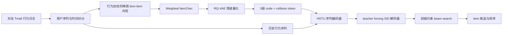

# Tmall 生成式推荐系统面试知识库

> 项目主线：加权行为共现 → Item2Vec 物品表征 → RQ-VAE 风格 Semantic ID → HSTU 序列建模 → SID 自回归解码 → Prefix-Constrained Beam Search。

## 从这里开始

这个文件夹是独立的 Obsidian 知识库，不覆盖此前的任何 notebook。建议按下面顺序阅读：

1. [[00-项目总览]]：先把项目讲完整。
2. [[01-数据与样本构造]]：解释数据从日志到训练样本的过程。
3. [[02-加权共现与Item2Vec]]：解释协同信号和物品向量如何得到。
4. [[03-RQ-VAE与Semantic-ID]]：解释为什么能把 item ID 变成多级可生成 token。
5. [[04-HSTU序列建模]]：解释序列编码器的结构和与普通 Transformer 的区别。
6. [[05-SID自回归解码]]：解释生成式推荐的训练、推理和约束搜索。
7. [[06-训练工程与大规模优化]]、[[07-评估与实验设计]]：准备工程与实验追问。
8. [[09-面试题库]]、[[10-模拟面试脚本]]：直接用于面试前复习。

## 一句话项目定义

这是一个面向电商行为序列的双阶段生成式推荐原型：召回阶段使用行为加权的物品协同关系产生候选，排序/生成阶段不直接预测超大 item 分类，而是先把 item 压缩成由多个离散 code 组成的 Semantic ID，再用 HSTU 对用户历史序列建模并逐级生成目标 SID，最后通过前缀约束 beam search 将 SID 映射回真实商品。

## 总体架构

## 文件导航

- [[00-项目总览]]：项目故事、1/3/5 分钟讲法、代码对应关系。
- [[01-数据与样本构造]]：字段、序列、标签、mask、切分与泄漏。
- [[02-加权共现与Item2Vec]]：共现图、权重、负采样、Item2Vec 损失。
- [[03-RQ-VAE与Semantic-ID]]：残差量化、损失、碰撞处理和监控。
- [[04-HSTU序列建模]]：输入、相对偏置、Pointwise SiLU、复杂度。
- [[05-SID自回归解码]]：teacher forcing、曝光偏差、约束 beam。
- [[06-训练工程与大规模优化]]：分阶段训练、内存、采样、版本管理。
- [[07-评估与实验设计]]：指标、baseline、ablation、时间切分。
- [[08-项目局限与升级路线]]：面试官追问时的边界和改进计划。
- [[09-面试题库]]：按主题整理的高频问题与参考回答。
- [[10-模拟面试脚本]]：可直接口述的项目介绍与追问路线。
- [[11-简历表述]]：压缩后的简历版本和关键词边界。
- [[12-公式与代码速查]]：公式、伪代码、配置和张量形状。
- [[13-术语表]]：中英文术语快速查阅。
