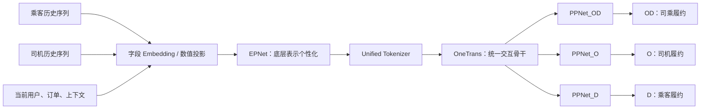

# PEPNet × OneTrans：当前模型架构与单样本全链路

> 这是一份可独立阅读的模型主线：讲清 **PEPNet 是什么、OneTrans 是什么、两者如何接入，以及一条司乘订单如何得到 D/O/OD 三个预测**。PLE、PosSA、AUC 对照与消融实验放在 [[背景与实验]]。

## 1. 一句话说明模型

这是一个司乘双边履约多任务模型。它把**乘客历史订单、司机历史订单、当前订单与上下文**统一表示为 token，利用 **OneTrans** 在 token 级建模时序、司乘跨序列和序列—静态特征交互；再利用 **PEPNet** 的两层个性化门控，让不同场景、不同主体以及不同任务走不同强度的特征通道，最后输出：

- `D`：乘客履约；
- `O`：司机履约；
- `OD`：司乘履约率。

它并非“先做序列向量、再把静态特征拼接到 MLP”的传统串行结构；核心变化是让当前订单条件能够直接参与历史 token 的选择与交互。

## 2. 从输入到输出的全局位置



容易混淆的一点是：**PEPNet 不是一个整体都放在 OneTrans 后面。**

```text
Base embedding
  → EPNet（embedding / 底层表示的个性化）
  → token 组装
  → OneTrans（统一交互）
  → PPNet（hidden / task representation 的个性化）
  → D/O/OD heads
```

也就是说：EPNet 更靠下，PPNet 更靠上；OneTrans 是把两侧序列和静态特征揉在一起的共享骨干。

### 2.1 本文采用的接入顺序

本文以如下顺序解释当前模型：

```text
Embedding → EPNet → Tokenizer → OneTrans → PPNet → D/O/OD heads
```

这个顺序在**模块职责**上是明确的：EPNet 做底层 embedding 个性化；PPNet 才是 OneTrans 后的 hidden / 任务表示个性化。因此，不应把完整 PEPNet 简化成“位于 OneTrans 后的一个模块”。

EPNet 与 token projection 在代码中可能封装在同一层，故函数级调用先后仍需配置确认；但在本文的架构叙事中，EPNet 位于 token 组装之前，PPNet 位于 OneTrans 之后。

## 3. 输入单位、样本边界与特征形态

每条样本对应一个明确预测时点 `prediction_time`。可抽象为：

```text
sample = {
  passenger_seq: [L_p, F_p],   # 乘客历史 L_p 笔事件，每笔 F_p 个字段
  driver_seq:    [L_d, F_d],   # 司机历史 L_d 笔事件，每笔 F_d 个字段
  x_static:      当前乘客 / 司机 / 订单 / 上下文特征,
  mask, role_id, relative_time,
  y_D, y_O, y_OD               # 仅训练时使用的标签
}
```

历史事件只能满足：

$$
event\_time < prediction\_time
\quad\text{且}\quad
available\_time \le prediction\_time
$$

其中 `available_time` 很重要：一笔订单即使行为发生得早，若其状态在预测时点后才回刷完成，也不能作为当时可用输入。序列应以稳定键排序，例如 `(event_time, stable_event_id)`；`mask` 用于屏蔽 padding，`role_id` 区分乘客与司机主体。

一版 PosSA 对照实验已知输入为 343 维：143 维数值/类别特征，加上乘客和司机各 `10 笔订单 × 10 字段` 的历史序列。它说明数据形态，但**不等于 OneTrans run 的确切 token 数或维度**。

### 3.1 一条历史事件里有什么

一笔乘客或司机历史订单可包括以下类型的字段：

| 类型 | 示例 | 为什么保留 |
|---|---|---|
| 身份/类别 | 乘客或司机 ID、产品、区域、场景 | 表达主体与业务语义 |
| 数值 | 报价、订单距离、接驾距离、服务距离 | 表达当前行为成本与偏好 |
| 行为结果 | 接单、取消、完单等历史状态 | 提供历史行为模式 |
| 时空 | 下单时间、距当前时间差、起终点区域、供需 | 表达时效与场景变化 |
| 统计/画像 | 活跃度、历史频率、司机等级等 | 补充长期状态 |

离散类别经 embedding table 查询；连续值先归一化后经 MLP 投影；同一历史事件的全部字段拼接后经 MLP 融合为 128 维事件向量。重点是：**保留每笔事件的顺序和上下文，不能先压成“过去十单取消率”这类单个统计量。**

### 3.2 Token projection：怎样变成 OneTrans 能读的 token

Token projection 不是另一种特征，而是将维度和类型不一致的字段整理到同一个 128 维空间的过程：

$$
t=\operatorname{MLP}(\operatorname{Concat}(e_1,e_2,\ldots,e_k))\in\mathbb R^{128}
$$

对历史订单，$t$ 是一枚乘客或司机 S-token；对静态字段组，$t$ 是 PassengerProfile、DriverProfile、Context、Statistics 或 Order 中的一枚 NS-token。EPNet 在 projection 前调节基础 embedding 的强度，token projection 则负责把已调节的字段组织成 OneTrans 能读取的统一 token。

## 4. PEPNet 是什么：用门控做个性化多任务建模

PEPNet 可以理解成“**个性化门控网络**”。它不为每个用户复制一套模型参数，而是基于用户/场景/任务先验，生成一组逐维 gate，对共享表示进行动态放大或抑制。

它包含两个核心组件：

| 组件 | 插入位置 | 做什么 | 解决什么 |
|---|---|---|---|
| EPNet | embedding / 底层表示侧 | 调节原始字段或融合表示 | 同一特征在不同场景下重要性不同 |
| PPNet | DNN hidden / 任务表示侧 | 对每个任务逐层调节 hidden | D、O、OD 的关注重点不同 |

### 4.1 EPNet：为什么要在底层调节

同一个“接驾距离 2.8 km”并不总是同样重要：早高峰、运力紧张、不同产品或不同城市下，它的影响强度会不同。EPNet 的思路是让场景先验控制底层特征通道。

设基础表示为 $x_{dnn}$，场景先验为 $x_{ep}$（可由产品、时段、区域、主体等字段组成），则可写为：

$$
g_{ep}=2\cdot\sigma\left(
  \operatorname{MLP}([\operatorname{sg}(x_{dnn}),x_{ep}])
\right)
$$

$$
\tilde{x}_{dnn}=x_{dnn}\odot g_{ep}
$$

- $g_{ep}$ 的每一维在 `(0,2)` 内：小于 1 表示抑制，大于 1 表示增强；
- $\odot$ 是逐元素乘法，不是为每个样本生成完整新权重；
- $\operatorname{sg}(\cdot)$ 表示 stop-gradient。材料中该设计的解释是：防止 gate 分支通过缩放系数过度扰动共享 embedding 底座。

因此 EPNet 的问题不是“这个特征有没有”，而是“**在当前场景里，这个特征通道该有多大权重**”。

#### 4.1.1 Gate 是怎样生成的

对一条样本，先将基础字段 embedding 拼接为 $E\in\mathbb R^{d}$，并将当前场景先验编码为 $P\in\mathbb R^{d_p}$：

```text
E = [乘客/司机 embedding，价格、接驾距离、画像、历史统计等基础表示]
P = [产品、时段、区域、供需等场景先验]
```

Gate Neural Unit 是一个小型 MLP：

$$
u=\operatorname{ReLU}\left([\operatorname{sg}(E),P]W_1+b_1\right)
$$

$$
g_{ep}=2\cdot\sigma(uW_2+b_2)
$$

它输出与 $E$ 等长的向量，再进行逐维缩放：

$$
E'=E\odot g_{ep}
$$

例如同为 `2.8km` 接驾距离，早高峰、供需紧张与平峰、供需宽松会产生不同的 $P$，因而生成不同的 $g_{ep}$。变化的是接驾距离、价格、画像等特征的**隐向量维度权重**，不是把原始的 `2.8km` 人工改写成另一个数值。

训练时，D/O/OD 的多任务损失会更新 Gate MLP 参数，使其学到“什么场景应生成什么 gate”。$\operatorname{sg}(E)$ 仅切断 *gate 输入支路* 对 $E$ 的反向梯度；$E'=E\odot g_{ep}$ 这条主路径仍会正常训练基础 embedding。

#### 4.1.2 在当前 OneTrans 架构中的施加方式

本文采用的合理接入是：

```text
原始字段 → 基础 Embedding → EPNet gate → 个性化 Embedding → Tokenizer → OneTrans
```

因此 EPNet 做的是**当前订单场景的公共适配**，并不直接区分 D/O/OD；D/O/OD 的任务差异留给后面的 PPNet。

为统一当前模型的讲解，本文确定采用**样本级共享 gate**。各基础字段先完成 embedding 查询或必要的数值维度对齐，但尚未按“历史事件/静态字段组”拼接成 token，形成底层表示 $X\in\mathbb R^{B\times N\times d}$；EPNet 根据当前订单场景产生 $g_{ep}\in\mathbb R^{B\times 1\times d}$，并沿字段/事件维广播：

$$
X'_{b,n,:}=X_{b,n,:}\odot g_{ep,b,1,:}
$$

随后 Tokenizer 才按每笔历史事件或静态字段组拼接 $X'$ 中的相关字段、经 MLP 得到乘客历史 token、司机历史 token、订单 token 和上下文 token，并输入 OneTrans。也就是说，同一条订单的所有底层字段/事件 embedding 都在“早高峰 / 产品 / 区域 / 供需”这一共同场景下，被同一组 embedding 维度权重调节。这样最贴近 EPNet 的全局底层 embedding 个性化，也避免额外假设一套按 token 类型拆开的 gate 网络。

### 4.2 PPNet：为什么共享骨干之后还要分任务

OneTrans 产生的是司乘与当前订单联合后的共享表示 $z$，但三任务并不完全同一件事：

- D 更可能关注乘客近期行为与当前价格、接驾距离；
- O 更可能关注司机近期接单/服务状态与时空条件；
- OD 需要判断双方与当前订单共同满足履约的可能性。

PPNet 与 EPNet 使用同一类两层 Gate MLP，但调节对象从输入 embedding 变成任务网络的 hidden。任务先验不是新数据或标签，而是当前样本静态 token 对应的字段按任务重新组合：

```text
p_D  = [PassengerProfile, Order, Context]
p_O  = [DriverProfile,    Order, Context]
p_OD = [PassengerProfile, DriverProfile, Order, Context]
```

其中 D 是乘客履约、O 是司机履约、OD 是司乘联合履约。OneTrans 输出的联合表示 $z$ 与对应任务先验一起进入该任务、该层自己的 Gate MLP：

$$
g_{t,l}=2\cdot\sigma\left(
\operatorname{MLP}_{t,l}([\operatorname{sg}(z),p_t])
\right)
$$

当前模型固定三条任务塔，hidden 宽度为 `512 → 512 → 256 → 128`；每层 hidden 都先被对应 gate 调节。以任务 $t\in\{D,O,OD\}$ 的第 $l$ 层为例：

$$
\tilde h_l^{(t)}=h_l^{(t)}\odot g_{t,l}
$$

$$
h_{l+1}^{(t)}=f_l^{(t)}(\tilde h_l^{(t)})
$$

这就是 PPNet 中“Parameter Personalized”的含义：它不为每条样本生成完整新矩阵 $W$，而是通过 $h\odot g$ 改变当前样本实际激活的 hidden 通道。对线性层而言：

$$
W(h\odot g)=W\operatorname{diag}(g)h
$$

共享的 $W$ 不变，但每条样本得到不同的有效计算路径。直观上，PPNet 让同一个联合表示 $z$ 在 D/O/OD 三条路径中被不同地解释，而不是要求三个任务共用完全相同的 hidden 通道。真实 D/O/OD 标签绝不作为 $p_t$ 的输入，否则会产生标签泄漏。

## 5. OneTrans 是什么：将序列和静态特征放进同一交互框架

### 5.1 它替代什么传统范式

传统结构多是：

```text
乘客序列 → 序列编码器 → 乘客向量 ┐
司机序列 → 序列编码器 → 司机向量 ├→ 拼接当前静态特征 → MLP / 多任务层
静态特征 ────────────────────────┘
```

这样会出现三个限制：

1. 序列已经压成一个向量后，当前价格或接驾距离才加入，模型很难精确定位“**历史哪一笔**与当前订单相似”；
2. 乘客与司机两侧通常独立编码，只在最后做粗粒度拼接；
3. 序列建模与高阶静态特征交互是两个分离模块，信息流受限。

OneTrans 的核心改变是：把两种输入都转为 token，在同一个 Transformer backbone 内建模。

### 5.2 S-token 与 NS-token

| token 类型 | 来源 | 示例 | 承担的信息 |
|---|---|---|---|
| S-token（sequence token） | 乘客/司机的每笔历史事件 | “乘客 2 天前早高峰、3.5km 接驾、取消” | 顺序、时间间隔、历史细节 |
| NS-token（non-sequence token） | 当前静态字段分组 | PassengerProfile、DriverProfile、Context、Statistics、Order | 当前请求条件与高阶字段交互 |

每个 token 的输入为：

$$
x_i=e_{content,i}+e_{role,i}+e_{time,i}+e_{position,i}
$$

其中 `role/type` 固定区分司机历史、乘客历史和五类静态 token；历史 token 使用相对时间与序列位置编码。模型不额外使用 `[CLS]` 或独立聚合 token，而是使用末尾 Order token 聚合联合信息。

### 5.3 OneTrans 在这里做哪些交互

进入 OneTrans 的并不是两条互不相干的数组，而是一份统一 token 序列。它在一个共享骨干中同时学习：

1. **序列内交互**：乘客自身或司机自身的近期与早期行为依赖；
2. **跨序列交互**：司机历史与乘客历史在当前订单条件下的关联；
3. **序列—静态交互**：当前价格、接驾距离、时段、供需影响模型从何处读取历史；
4. **高阶静态交互**：多源用户/订单/上下文字段间的组合关系。

标准注意力的形式为：

$$
\operatorname{Attn}(Q,K,V)=
\operatorname{softmax}\left(\frac{QK^T}{\sqrt d}+M\right)V
$$

其中 $M$ 是可见性 mask。模型学到的不是一条人为规则，而是数据驱动的权重：例如“当前长接驾、早高峰”这个静态条件，可能使模型更关注乘客历史中相似时段的取消事件、也更关注司机历史中长接驾的服务表现。

#### 5.3.1 联合表示 $z$ 是怎样从最后一个 Order token 得到的

这里的 $z$ 不是对所有 token 做平均池化，也不是额外构造一个 `[CLS]`。它就是最后一个 `Order` token 经过 4 层 OneTrans 后的 hidden：

$$
z=h_{\text{Order}}^{(4)}
$$

初始时，$h_{\text{Order}}^{(0)}$ 只编码当前订单自身的信息，如产品、价格、接驾距离、起终点区域、时段和供需。每一层中，Order token 用自己的表示生成 query；在因果 mask 下，由于它固定放在统一序列末尾，它可以读取此前所有司机历史、乘客历史和静态 token 的 key/value：

$$
\alpha_{\text{Order},j}^{(l)}=
\operatorname{softmax}_j\left(
\frac{q_{\text{Order}}^{(l)}(k_j^{(l)})^T}{\sqrt d}+M_{\text{Order},j}
\right),\qquad
a_{\text{Order}}^{(l)}=\sum_j\alpha_{\text{Order},j}^{(l)}v_j^{(l)}
$$

再经过残差连接和 FFN，Order hidden 会被更新。第一层主要完成“当前订单条件下选哪些历史”；后续层读取的已是被其他 token 交互过的上下文表示，因此能逐步组合司乘双方状态。最终的 $z$ 可以理解为：**以当前订单为查询条件、从双边历史和静态条件中读出的联合履约表征。**

固定顺序还带来一个清晰的因果关系：早位置的司机 token 看不到后面的乘客 token，后位置的乘客 token 能读取前面的司机 token；但末尾 Order token 对两侧均可见，因此适合承担最终 readout。这个不对称性是所选 causal-token 顺序的结果，不代表司机特征在业务上天然比乘客特征更重要。

### 5.4 混合参数化：为什么不让所有 token 完全共享参数

OneTrans 的公开设计要点是 mixed parameterization：

- 历史行为 S-token 共享 Q/K/V 与 FFN 参数，以学习跨行为、跨主体可复用的序列规律；
- 五个 NS-token（PassengerProfile、DriverProfile、Context、Statistics、Order）各自使用专属 Q/K/V 与 FFN 参数，以保留异构静态字段的不同语义。

这在两种极端之间折中：完全分开会阻断交互；全部 token 使用同一参数又可能把异构静态字段当成无差别的“词”。

### 5.5 长序列设计：Pyramid、causal mask 与 KV cache

OneTrans 的原理材料还提到：

- **causal mask**：限制 token 可见方向，服务于时序边界与防未来信息泄漏；
- **Pyramid 动态压缩**：逐层减少参与 query 的序列 token，以降低长序列成本，同时保留完整 K/V 的信息来源；
- **KV cache**：在因果推理场景复用历史 K/V，降低重复计算。

它们说明 OneTrans 面向工业长序列的动机。**当前 PEP × OneTrans 离线模型使用 causal mask，但不启用 Pyramid 动态压缩和 KV cache。**原因是双边序列长度主要在 10/20/30/40 的实验范围内，且当前是离线 batch 训练/验证；Pyramid 与 KV cache 仅作为未来长序列和增量线上推理的扩展能力。

## 6. PEPNet × OneTrans 如何协同

两者不做重复工作：

```text
EPNet：输入表示在当前场景下应如何加权？
OneTrans：乘客历史、司机历史与当前订单之间应如何交互？
PPNet：交互后的共享表示应如何服务于 D、O、OD 三个任务？
```

因此整条链路的逻辑是：

```text
先用 EPNet 调节“看什么特征”
→ 用 OneTrans 学习“这些特征彼此如何关联”
→ 用 PPNet 调节“同一关联对哪个任务更重要”
→ 用任务头输出对应的履约分数
```

这是“统一交互 + 分层个性化”的组合，而不是简单把两个模型串在一起。

## 7. 用一条实际风格的样本走完整链路

以下为**虚构的讲解样本**，数值和字段仅用于解释，不能当作真实训练样本或真实标签定义。

### 7.1 当前订单与预测时点

预测时点设为 `2025-06-25 08:30:00`。当前订单 R：

| 字段 | 示例值 |
|---|---|
| 乘客 / 司机 | P_1001 / D_9008 |
| 产品 / 场景 | 快车 / 工作日早高峰 |
| 起终点区域 | A → B |
| 预估行程距离 | 8.2 km |
| 接驾距离 | 2.8 km |
| 当前报价 | 32 元 |
| 区域供需 | 紧张 |

当前要估计 $\hat y_D, \hat y_O, \hat y_{OD}$。真实 D/O/OD 结果只在训练阶段形成 label；它们不进入输入 token。

### 7.2 在预测时点前截取双边历史

乘客 P_1001 的可用历史（按时间由早到晚）：

| 时间 | 行程距离 | 接驾距离 | 价格 | 历史结果 | 场景 |
|---|---:|---:|---:|---|---|
| 6/18 09:00 | 7.8 km | 2.6 km | 31 元 | 完成 | 早高峰 |
| 6/20 14:30 | 2.2 km | 0.8 km | 12 元 | 完成 | 平峰 |
| 6/23 08:20 | 9.5 km | 3.5 km | 38 元 | 取消 | 早高峰 |
| 6/24 19:10 | 3.1 km | 1.0 km | 15 元 | 完成 | 晚高峰 |

司机 D_9008 的可用历史：

| 时间 | 接驾距离 | 服务距离 | 历史结果 | 时段 |
|---|---:|---:|---|---|
| 6/20 13:50 | 0.9 km | 3.2 km | 完成 | 平峰 |
| 6/23 08:10 | 2.5 km | 8.7 km | 完成 | 早高峰 |
| 6/24 18:40 | 3.0 km | 6.5 km | 取消 | 晚高峰 |
| 6/25 08:05 | 1.2 km | 4.0 km | 完成 | 早高峰 |

这一步只做“事实构造”：过滤未来、按稳定键排序、截断到最大长度、为不足长度的位置补 padding 与 mask。模型尚未把“乘客曾在长接驾早高峰取消”写成规则。

### 7.3 Embedding：每笔订单先变成事件向量

以乘客 6/23 的历史订单为例：`9.5km 行程、3.5km 接驾、38元、早高峰、取消、距当前约 2 天`。

```text
类别字段（场景、区域、状态） → 查 embedding
连续字段（距离、价格、时间差） → 归一化后 MLP 投影
所有字段 → Concat + MLP → 128 维 passenger_event_token
```

司机每笔历史同理形成 `driver_event_token`。当前订单的价格、接驾距离、区域、时段、供需、乘客/司机画像等静态字段也各自或分组投影为向量。此时模型拿到的是“可训练向量”，还未做跨事件判断。

### 7.4 EPNet：在早高峰紧张供需下调整底层表示

将当前订单的产品、小时/工作日、起终点区域、区域供需以及乘客/司机基础画像组成场景先验 $x_{ep}$。EPNet 根据它生成 gate：

```text
基础的价格 / 接驾距离 / 时段 / 主体 embedding
             ×
“快车 + 早高峰 + 供需紧张”条件下的逐维 gate
             ↓
个性化后的特征表示
```

因此，模型有机会让“接驾距离”“早高峰”“区域供需”等维度在这个样本上更强或更弱；具体哪一维提升由训练学习，不能人工指定。

### 7.5 Tokenizer：组装成 OneTrans 的一份 token 序列

该样本固定组装为：

```text
[D_6/20, D_6/23, D_6/24, D_6/25,         # 司机 S-token（早→晚）
 SEP_DRIVER_PASSENGER,
 P_6/18, P_6/20, P_6/23, P_6/24,         # 乘客 S-token（早→晚）
 SEP_SEQUENCE_STATIC,
 PassengerProfile,
 DriverProfile,
 Context,
 Statistics,
 Order]                                   # 最后的联合 readout token
```

其中 `PassengerProfile / DriverProfile / Context / Statistics / Order` 都由对应字段组执行 `Concat → MLP → 128` 维投影得到。Order 位于末尾，使其在 causal attention 下能够读取全部双边历史与静态条件。

### 7.6 OneTrans：让当前订单反查两侧历史

在 attention 层中，当前 `pickup_distance=2.8km`、`早高峰`、`供需紧张` 等 NS-token 会与历史 S-token 共同计算注意力。可能出现的学习结果是：

```text
当前长接驾 + 早高峰
  ├─ 更关注 P_6/23：早高峰、3.5km 接驾、取消
  ├─ 对照 P_6/18：早高峰、2.6km 接驾、完成
  ├─ 参考 D_6/23 / D_6/25：相近时段的司机服务状态
  └─ 结合供需 token：判断这次不是单纯的历史重复，而是当前供需变化下的风险
```

这是 OneTrans 在本项目里的关键价值：价格/距离/供需不是在序列压缩后才出现，而是作为条件参与“选哪些历史、怎么组合历史”。4 层 OneTrans 交互后，末尾 Order token 的 hidden 即为联合表示 $z$，它浓缩了“当前司乘组合在当前订单条件下的履约状态”。

### 7.7 PPNet 与三任务输出：同一 $z$ 的不同解释

同一个 $z$ 会送到三条 PPNet 路径：

```text
z → PPNet_D  → head_D  → 乘客履约概率  ŷ_D
z → PPNet_O  → head_O  → 司机履约概率  ŷ_O
z → PPNet_OD → head_OD → 司乘履约概率  ŷ_OD
```

PPNet_D 可能通过其 gate 强调乘客近期取消、价格与接驾距离的关系；PPNet_O 可能强调司机近期服务状态与时空条件；PPNet_OD 则保留双方交互后的联合信息。注意这些是**模块职责上的解释**，不是已验证的每个 attention 权重结论。

训练时，三个 head 各自和真实标签计算损失，可抽象为：

$$
\mathcal L=
\lambda_{OD}\mathcal L_{OD}+
\lambda_O\mathcal L_O+
\lambda_D\mathcal L_D
$$

现有材料没有给出标签窗口、具体损失函数或 $\lambda$ 权重，不能补写成确定事实。后续设想“D 辅助 O”时，可传递 D 的 hidden、预测值或 stop-gradient logit，**不能把真实 D 标签输入 O**，否则会造成标签泄漏与训练/服务不一致。

## 8. 已确认事实、合理推断与待确认项

以下内容有明确材料支撑：双边序列 + 当前静态特征；EPNet/PPNet 的分层门控职责；OneTrans 的统一 token、混合参数化与交互动机；D/O/OD 多任务输出。

### 8.1 为便于讲解采用的合理推断

以下不是已获得的代码配置，而是结合“序列长度主要为双边 10/20/30/40”“另有单独命名的 `warmup-ontrans-8layer-ple` 深层 PLE 实验”“当前为离线 batch 实验”得到的一套最自洽实现假设：

| 项目 | 本文采用的合理推断 | 推断依据 |
|---|---|---|
| 常规 PEP × OneTrans 深度 | 4 层 OneTrans | 8 层被单独作为 PLE 深层实验命名；常规短序列 PEP run 更可能采用较浅 backbone |
| 表示维度 | `d_model=128`、4 attention heads、FFN=512 | 与短双边序列、异构静态 token 和 PEP 任务塔容量相匹配；置信度低于其他项 |
| token 顺序 | `司机历史 → 分隔符 → 乘客历史 → 分隔符 → PassengerProfile → DriverProfile → Context → Statistics → Order` | 在 causal attention 下，末尾 Order token 读取两侧历史和当前静态条件，并作为联合 readout |
| Pyramid | 不启用 | 当前离线模型序列长度不构成压缩瓶颈 |
| KV cache | 不启用 | 当前为离线 batch 训练/验证，不存在增量请求的 K/V 复用场景 |
| PosSA six-tower 路由 | 不保留 | six-tower 属于 PosSA baseline 的场景选路；当前模型使用 OD/O/D 三条 PPNet 路径 |

若使用这套假设讲解，应说“**最合理的实现推断是**”，不要说“代码就是这样”。

### 8.2 仍需代码或配置确认的细节

- D/O/OD 的精确定义、标签窗口、损失函数与权重；
- 线上推理时延、吞吐、一致性与 A/B 结果。

## 9. 阅读顺序

读完本文后：

1. 在 [[背景与实验]] 看 PLE 来源、PosSA baseline、OneTrans 的严格增益口径与实验结论；
2. 在 [[面试材料]] 看 30 秒/3 分钟项目表达与高频追问；
3. 需要核对所有原始数值时，查看 [[99-附录/实验原记录-完整版本]]。
