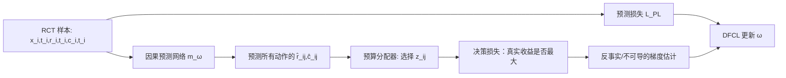

# DFCL：怎样让因果预测直接服务营销资源分配

论文：[Decision Focused Causal Learning for Direct Counterfactual Marketing Optimization](https://arxiv.org/abs/2407.13664)  
会议：KDD 2024  
原图：论文的算法流程与实验 Figure 1

## 1. 一句话先说清楚

**DFCL 不再只训练“谁对什么券/折扣的增量效果预测得准”，而是把“在预算约束下把哪档干预给谁，最终能带来多少真实收益”做成训练目标的一部分。**

它的关键是把多干预预算分配问题做拉格朗日对偶化，用 \(\hat r_{ij}-\lambda\hat c_{ij}\) 表示“收益减成本后的边际价值”；再针对反事实不可观测与离散决策不可导，提出可微的 policy / entropy surrogate，或用 EOM + 改进有限差分直接估计决策梯度。

## 2. 先看原问题：不是单纯的 uplift 排序

设用户/商家为 \(i\)，可选干预为 \(j\in\{0,1,\ldots,M\}\)。例如 \(j=0\) 表示不发券，\(j=1,2,3\) 对应 3 元、5 元、8 元券。

| 符号 | 意义 |
|---|---|
| \(x_i\) | 用户、商家、场景等特征 |
| \(r_{ij}\) | 若给 \(i\) 分配干预 \(j\)，可获得的潜在收益（如增量订单/GMV） |
| \(c_{ij}\) | 同一动作的潜在成本（如券成本） |
| \(z_{ij}\in\{0,1\}\) | 是否真的把动作 \(j\) 分给 \(i\) |
| \(B\) | 总预算 |

目标是：

```text
max Σ_i Σ_j r_ij z_ij
s.t. Σ_i Σ_j c_ij z_ij ≤ B；每个 i 至多/恰好选一个 j
```

这就是论文说的 MTBAP（多干预预算分配），本质是带预算约束的多选背包类组合优化。真正上线关心的是这个式子实现后的总收益，不是 \(\hat r\) 的 MSE 本身。

## 3. 为什么“预测模型 + OR 求解器”仍然可能不好？

两阶段方法先用 S-Learner/CFR 等预测所有 \(\hat r_{ij},\hat c_{ij}\)，再把预测喂给求解器。问题在于：

- MSE 把所有预测误差同等对待；但决策只对预算线附近、会改变动作选择的误差特别敏感。
- 例如用户 A 的 5 元券和 8 元券真实收益很接近，预测误差稍大也不改变选择；用户 B 的两档券正好在 ROI 临界点，极小误差就会让求解器换动作，影响预算去向。
- 因果数据只看见实际施加的 \(t_i\) 下的 \(r_{it_i},c_{it_i}\)，其余 \(r_{ij},c_{ij}\) 是反事实，不能直接算“如果换一个分配，真实总收益是多少”。

所以 DFCL 同时面对三件事：**决策是 0–1 离散的、预算会波动、决策质量所需的反事实结果不可见。**

## 4. 按算法流程走完 DFCL



### 4.1 预测网络输出什么？

输入 \(x_i\)，模型 \(m_\omega(x_i)\) 同时输出每个 treatment 下的 \(\hat r_{ij}\) 与 \(\hat c_{ij}\)。论文的预测损失 \(\mathcal L_{PL}\) 只在样本事实动作 \(t_i\) 上监督：

\[
\mathcal L_{PL}=\frac1M\sum_i\frac1{N_{t_i}}[(r_{it_i}-\hat r_{it_i})^2+(c_{it_i}-\hat c_{it_i})^2].
\]

\(N/N_{t_i}\) 一类加权的作用是校正各 treatment 样本数不均衡。它不能凭空看到反事实，只是借助 RCT 的随机分配，使事实观察成为反事实总体的无偏抽样。

### 4.2 真实的决策损失是什么？

若能知道完整潜在结果，先按预测 \(\hat r,\hat c\) 解出决策 \(z^*(B,\hat r,\hat c)\)，再用真实 \(r\) 评估这套决策：

\[
\mathcal L_{DL}(B)=-\sum_{i,j}r_{ij}z^*_{ij}(B,\hat r,\hat c).
\]

负号只是为了把“最大化收益”写成“最小化损失”。论文还对多个预算 \(B\) 求和/积分，因为线上预算会浮动：模型不应只在某个固定预算点表现好。

但这个理想式在数据上算不了：绝大多数 \(r_{ij}\) 从未观测；而 \(\arg\max\) 与 \(z\in\{0,1\}\) 也不能反传梯度。

### 4.3 对偶化：把全局预算问题变成每个样本的“净价值”比较

引入拉格朗日乘子 \(\lambda\ge0\)，将预算惩罚折进目标：

\[
\hat r_{ij}-\lambda\hat c_{ij}.
\]

它可理解为“收益减去按影子价格折算的成本”。\(\lambda\) 大说明预算紧，成本被惩罚得更重；\(\lambda\) 小说明预算较松，更愿意使用高成本动作。给定 \(\lambda\)，每个个体独立选净价值最大的动作：

\[
z^d_{ij}=\mathbb I[j=\arg\max_j(\hat r_{ij}-\lambda\hat c_{ij})].
\]

论文证明，在不同 \(\lambda\) 上优化对偶问题，对应在不同预算 \(B\) 下改善原问题的决策。它同时去掉了训练中反复求大规模原始整数规划的主要成本。

## 5. 反事实与不可导：DFCL 的三条梯度路径

### 5.1 DFCL-PL：Policy Learning Loss

把硬选一个动作放松成 softmax 策略：

\[
p_{ij}(\lambda)=\frac{\exp(\hat r_{ij}-\lambda\hat c_{ij})}{\sum_k\exp(\hat r_{ik}-\lambda\hat c_{ik})}.
\]

它不再说“用户 \(i\) 只能选 j”，而说“当前模型给 j 的分配概率是多少”。从 RCT 中实际受到 \(t_i\) 的样本，按 \(N/N_{t_i}\) inverse-frequency 加权，就能构造：

\[
\mathcal L_{PLL}=-\sum_{\lambda,i}\frac{N}{N_{t_i}}(r_{it_i}-\lambda c_{it_i})p_{i,t_i}(\lambda).
\]

直觉是：某条事实样本若在该 \(\lambda\) 下的净收益高，就应提升模型给该动作的概率；随机试验概率带来的 reweighting 使它成为原 policy objective 的 surrogate。论文给出与对偶决策损失等价的结论。

### 5.2 DFCL-MER：Maximum Entropy Regularized Loss

PL 的 softmax 可以进一步看作：把二元 \(z\) 放松为 \([0,1]\)，并在目标中加入 \(-\tau\sum z\log z\) 熵正则。\(\tau\) 是温度：大时动作概率更平滑，小时更接近硬决策。最优解仍是带温度的 softmax。

这一视角的价值不是“多了一个技巧”，而是说明连续的策略概率来自一个明确的带熵优化问题；论文将其写成 \(\mathcal L_{MERL}\)，并指出 PL 是其中一个特例。

### 5.3 DFCL-IFD：EOM + Improved Finite Difference

如果不想改变原始离散优化景观，可以把整套“预测 → 预算求解 → RCT 离线评估”看作黑箱。

EOM（Expected Outcome Metric）在 RCT 测试集上只取“系统分给的动作 = 该样本真实随机动作”的人，并按该动作的随机分配概率做逆倾向加权，从而无偏估计策略的每人收益/成本。之后对 \(\hat r_{ij}\) 或 \(\hat c_{ij}\) 加一个很小扰动，比较扰动前后 EOM 的差，近似该维度对决策质量的梯度。

普通有限差分逐元素扰动会非常慢。DFCL 的改进策略在论文中称 IFD：它围绕决策因子/softmax 表示进行更有结构的扰动，减少需要求解的黑箱次数。论文把三者看成取舍：PL/MER 更快、更平滑；IFD 更贴近原始离散决策但训练开销也更高。

## 6. 最终训练目标与实际例子

总目标是：

\[
\mathcal L_{DFCL}=\alpha\mathcal L_{PL}+\mathcal L_{DL}^{surrogate}.
\]

预测损失防止模型只为少数预算边界样本投机；决策损失让梯度集中在真正会改变资源分配的地方。

例如预算只够给 1 万用户发券。模型把某用户“5 元券的增量订单”从 0.20 预测成 0.21，MSE 改善很小；若这使其 ROI 超过另一个临界用户，OR 会替换掉后者，可能带来较大总订单变化。DFCL 会感知后一个误差对决策的影响更大，而普通 MSE 不会。

## 7. 实验该如何解读

- 数据：Criteo-Uplift v2（1390 万 RCT 样本）和美团折扣 RCT 数据（280 万样本、107 个特征、5 档折扣）。
- 指标：二元场景使用 AUCC；多干预营销场景使用基于 RCT 的 EOM，后者才直接评价“在给定预算下该策略的预期收益”。
- 对比：TSM-SL/TSM-CF 是预测后求解的两阶段；DPM 是直接预测决策因子；DFCL-PL/MER/IFD 是本文三条路径。
- 结果：论文中 DFCL-IFD 在 Criteo 的 AUCC 为 0.7859，相对 TSM-SL 提升 3.94%；在营销 EOM 表中也表现最好。它支持的是“预测误差更小不是唯一目标，决策聚焦训练能带来更好的政策价值”。

## 8. DFCL 的位置：它解决了什么，没解决什么？

DFCL 首先解决的是 **prediction–decision mismatch**：不要只训练 uplift 拟合，再祈祷 OR 会得到好策略。它的实验主要建立在 RCT 上，利用随机性让反事实 policy value 可以无偏估。

但这也留下一个现实问题：真实平台通常有海量 OBS 日志、RCT 很少。若只用稀缺 RCT 做强决策监督，方差高；若直接把决策损失放到偏置 OBS 上，选择偏差又会被放大。这正是后续 [[02_Bi-DFCL：怎样用RCT与OBS共同优化营销决策|Bi-DFCL]] 要处理的部分。

## 9. 最终 takeaway

**DFCL 的核心不是“又加了一个 loss”，而是把因果预测输出嵌进真实资源约束的决策问题里，并为反事实、离散动作和大规模求解分别找到了可训练的梯度替代。**
