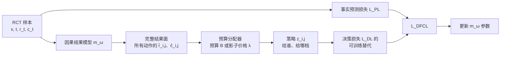

# DFCL：怎样让因果预测直接服务营销资源分配

论文：[Decision Focused Causal Learning for Direct Counterfactual Marketing Optimization](https://arxiv.org/abs/2407.13664)  
会议：KDD 2024  
论文原图：Figure 1（离线决策效果曲线）；核心流程：Algorithm 1

## 1. 一句话总结

**DFCL 不替换因果结果模型，而是让“结果面预测器 → 预算分配器”成为一个共同训练的闭环。**普通模型只想把每个收益/成本预测得更准；DFCL 还要求：将这些预测拿去分配预算后，最终的营销决策要更好。


```text
一个人对不同券档会有不同收益与成本
→ 模型预测整张“人 × 券档”结果面
→ 分配器在预算内选择券档
→ 分配结果的质量反过来训练预测器。
```

## 2. 先定义业务：模型到底在替谁做什么决定？

有 $N$ 个个体、$M$ 个可选动作。个体可以是用户、商家或一次营销机会；动作可以是“不干预、3 元券、5 元券、8 元券”。

| 符号 | 论文含义 | 发券场景的直觉 |
|---|---|---|
| $x_i$ | 个体 $i$ 的决策时特征 | 活跃度、价格敏感度、城市、供需、历史行为 |
| $t_i$ | 日志/RCT 实际分配的动作 | 此人实际拿到 5 元券 |
| $r_{ij}$ | 个体 $i$ 在动作 $j$ 下的潜在收益 | 若给 5 元券会得到的业务收益 |
| $c_{ij}$ | 同一动作下的潜在成本 | 券核销后的实际成本 |
| $z_{ij}$ | 是否给 $i$ 分配动作 $j$ | $z_{i,5\text{元}}=1$ 表示给 5 元券 |
| $B$ | 总预算 | 当日可花的补贴金额 |

论文的原始预算问题是多选背包（MTBAP）：

$$
\begin{aligned}
\max_z\quad &\sum_i\sum_j z_{ij}r_{ij}\\
\text{s.t.}\quad &\sum_i\sum_j z_{ij}c_{ij}\le B,\\
&\sum_jz_{ij}=1,\qquad z_{ij}\in\{0,1\}.
\end{aligned}
$$

即：每个人必须选择一个动作，同时所有动作的成本不得超过 $B$。

### 2.1 $r$ 不是天然的 uplift：何时才讨论增量？

论文公式里的 $r_{ij}$ 是动作 $j$ 下的**潜在收益**，并不自动等于相对不干预的 uplift。若业务目标是“发券带来的增量完单”，应额外定义：

$$
\Delta r_{ij}=r_{ij}-r_{i0},\qquad
\Delta c_{ij}=c_{ij}-c_{i0},
$$

其中 $0$ 是不发券。此时可把 $(\Delta r,\Delta c)$ 作为分配器的收益/成本输入。若业务直接优化总 GMV 或总收入，也可以使用原始 $r,c$。**两种口径必须在建模、预算约束与评估中保持一致，不能将“高完单率”直接当成“高增量”。**

## 3. 一个样本实际能看到什么？为什么必须做因果学习？

数据中的一条样本只有：

$$
(x_i,t_i,r_{i,t_i},c_{i,t_i}).
$$

例如用户 A 实际拿到 5 元券并核销完单，我们能看见 $r_{i,5},c_{i,5}$，却永远看不见同一个 A 同时拿 0、3、8 元券时的结果。这个反事实缺失使下面的“完整结果面”不能被逐格直接监督。

论文以 RCT 为训练数据：动作 $t_i$ 随机分配，且各 treatment 的分配概率已知。因此，虽然单个样本的反事实仍缺失，但某个动作下被随机分到该动作的样本可以无偏地代表该动作的总体结果。论文用按 treatment 样本数的重加权构造可计算的预测损失。

## 4. 传统“预测 → 求解”到底哪里不够？

两阶段方法是：

```text
先最小化预测误差
→ 得到 r̂、ĉ
→ 再让 OR 求解器根据 r̂、ĉ 分配预算。
```

问题在于 MSE 对每个数值误差一视同仁，而分配器只对会改变 $z$ 的误差敏感。

- 用户 A 的两档券都明显不值得发，预测误差从 0.02 降到 0.01，最终动作不变；
- 用户 B 正好位于预算边界，收益误差只差 0.01，却可能使 B 被选中并挤掉另一个用户。

因此，预测指标提升不保证政策价值提升。DFCL 的核心不是“加一个普通辅助 loss”，而是让下游分配质量影响预测器的梯度方向。

## 5. DFCL 的全景：输入、模块与输出



### 5.1 结果模型：它输出什么？

DFCL 没有规定 backbone 必须是 Transformer、CFR 或某个特殊网络。论文实验使用共享 MLP 和多个 head；从框架角度，只要求模型接口为：

$$
(\hat r,\hat c)=m_\omega(x).
$$

若动作是 $\{0,2,4,6\}$ 元券，输出就是：

$$
m_\omega(x_i)=
\{(\hat r_{i,0},\hat c_{i,0}),
(\hat r_{i,2},\hat c_{i,2}),
(\hat r_{i,4},\hat c_{i,4}),
(\hat r_{i,6},\hat c_{i,6})\}.
$$

它不是输出一个“高价值用户分数”，而是输出一张**人 × 动作**结果面。共享 encoder + 动作专属收益/成本 head 是一种实现；只要可以预测多 treatment 的收益和成本，也可作为 DFCL 的 backbone。

### 5.2 事实预测损失：怎样用只观察到一个动作的 RCT 样本训练？

对实际分到 $t_i$ 的样本，只回归该事实动作对应的两个输出：

$$
\mathcal L_{\mathrm{PL}}
=\frac1M\sum_i\frac1{N_{t_i}}
\left[(r_{i,t_i}-\hat r_{i,t_i})^2
+(c_{i,t_i}-\hat c_{i,t_i})^2\right].
$$

$N_{t_i}$ 是分到动作 $t_i$ 的样本数。RCT 随机化使这一加权损失等价于完整结果面上的 MSE 的无偏估计。$\mathcal L_{\mathrm{PL}}$ 让结果面数值稳定、可泛化；但只优化它仍是两阶段方法。

### 5.3 分配器：这一步才输出最终动作

先不要把这一步理解成“模型对每人做一个四分类”。DFCL 面对的是一个**多选背包问题（MCKP）**：在一批同时到来的候选人中，每个人只能选一个动作，同时所有动作的总成本不能超过预算。

若暂时假设真实的收益、成本结果面都已知，原始问题是：

$$
\begin{aligned}
\max_z\quad &F(z,B,r,c)=\sum_i\sum_j z_{ij}r_{ij}\\
\text{s.t.}\quad
&\sum_i\sum_j z_{ij}c_{ij}\le B,\\
&\sum_jz_{ij}=1,\quad\forall i,\\
&z_{ij}\in\{0,1\}.
\end{aligned}
$$

每个符号的意思是：

| 符号 | 含义 |
|---|---|
| $i$ | 当前这一批要决策的用户/商家/曝光机会中的第 $i$ 个个体 |
| $j$ | 动作或 treatment，例如 ${0,2,4,6}$ 元券 |
| $r_{ij}$ | 给 $i$ 采取 $j$ 后的真实业务收益；在因果营销中可理解为真实增量价值 |
| $c_{ij}$ | 给 $i$ 采取 $j$ 后的真实成本 |
| $z_{ij}$ | 是否给 $i$ 选择 $j$；为 1 表示选中，否则为 0 |
| $\sum_jz_{ij}=1$ | 每个人只能选一个动作。通常将“不干预/0 元券”也作为一个成本为 0 的动作，所以不是“一个都不选”，而是选择了 no-treatment。 |

真实线上当然看不到完整的 $r,c$，因此求解时要将其替换为模型预测的结果面：

$$
z^*(B,\hat r,\hat c)=
\arg\max_zF(z,B,\hat r,\hat c).
$$

分配器拿到的是整批人的 $\hat r_{ij},\hat c_{ij}$，而不是孤立地看某一个人。它要在“给 A 多发 4 元券”与“把这 4 元留给 B、C”之间作全局权衡，最终才输出 $z^*$。

#### 一个小例子：为什么不能只对每个人选预测收益最大的券？

假设当前有 A、B 两位乘客，券档为 $\{0,2,4\}$，模型预测如下；数值只用于说明计算。

| 乘客 | 0 元券 $(\hat r,\hat c)$ | 2 元券 $(\hat r,\hat c)$ | 4 元券 $(\hat r,\hat c)$ |
|---|---|---|---|
| A | $(0,0)$ | $(3.0,2)$ | $(4.0,4)$ |
| B | $(0,0)$ | $(2.3,2)$ | $(3.0,4)$ |

如果逐人只取最大预测收益，两人都会选 4 元券，总成本为 $8$。但若当前预算 $B=4$，这套动作根本不可执行。正确的分配器必须在两人、三种动作的组合里寻找“总成本不超过 4、总预测收益最大”的组合；这里会选 A 的 2 元券和 B 的 2 元券，总成本 $4$、总预测收益 $5.3$。

此处的 $z^*_{ij}=1$ 才表示“给 $i$ 选择了 $j$”。因此不能说 causal backbone 自己“分类出 4 元券”；它只提供结果表，预算分配器根据全局资源约束做动作选择。

### 5.4 理想决策损失：真正想优化什么？

注意这里有两张不同的表：

- **预测表** $(\hat r,\hat c)$：供求解器作决策；
- **真实表** $(r,c)$：用于事后判断“这套由预测驱动的策略究竟好不好”。

若反事实全可见，完整计算流程会是：

```text
1. 模型输出预测表 r̂、ĉ；
2. 求解器在预算 B 下依据预测表得到 z*(B,r̂,ĉ)；
3. 不改变 z*，把它放到真实结果表 r 上结算；
4. 得到这套策略真实带来的总收益。
```

第 3 步的策略价值为：

$$
\sum_i\sum_jr_{ij}z^*_{ij}(B,\hat r,\hat c).
$$

所以决策损失定义为其负数：

$$
\mathcal L_{\mathrm{DL}}(B)
=-\sum_i\sum_jr_{ij}z^*_{ij}(B,\hat r,\hat c).
$$

负号只因训练要做最小化：策略真实收益越大，$\mathcal L_{\rm DL}$ 越小。

在原始 DFCL 的设定里，预算会随业务环境波动，因此理想目标还希望在**多个预算**上都表现好：

$$
\mathcal L_{\mathrm{DL}}
=\sum_{B\in\mathcal B}\mathcal L_{\mathrm{DL}}(B),
$$

或写成连续预算上的积分。这里有两个根本障碍：

1. **反事实缺失：**对任一用户，只观察到了日志/RCT 实际执行档位 $t_i$ 下的 $r_{i,t_i},c_{i,t_i}$，看不到其他 $r_{ij},c_{ij}$；因此第 3 步不能直接在完整真实表上结算。
2. **离散求解不可导：**$z^*$ 内部含 0-1 选择和 $\arg\max$。小幅改变 $\hat r$ 往往不改变动作，梯度为 0；跨过某个边界时动作又会突然跳变。

DFCL 后面的对偶、代理损失和有限差分，就是分别让“预算不确定的大规模求解”和“反事实/不可导的训练信号”变得可处理。

## 6. 为什么引入拉格朗日对偶？

### 6.1 从全局预算约束到“收益减成本价格”

原始问题难在预算把所有用户耦合在一起：A 多花 2 元，就可能挤掉 B 的动作。对预算约束乘以非负拉格朗日乘子 $\lambda$，得到：

$$
\begin{aligned}
H(z,\lambda,B,r,c)
&=\sum_{i,j}z_{ij}r_{ij}
+\lambda\left(B-\sum_{i,j}z_{ij}c_{ij}\right)\\
&=\lambda B+\sum_{i,j}(r_{ij}-\lambda c_{ij})z_{ij}.
\end{aligned}
$$

$\lambda$ 可以理解为“每多消耗 1 单位成本的影子价格”。于是某个动作原本的收益 $r_{ij}$，变成扣除了资源机会成本后的净价值：

$$
v_{ij}(\lambda)=r_{ij}-\lambda c_{ij}.
$$

对偶问题是在 $\lambda$ 上寻找最合适的成本价格：

$$
\min_{\lambda\ge0}\max_zH(z,\lambda,B,r,c).
$$

### 6.2 固定 $\lambda$ 后，为什么大背包能拆成逐人比较？

$\lambda B$ 对动作 $z$ 是常数；而每人仍只需满足“恰好选一个动作”。因此固定 $\lambda$ 后：

$$
\max_zH(z,\lambda,B,\hat r,\hat c)
=\sum_i\max_j\bigl(\hat r_{ij}-\lambda\hat c_{ij}\bigr).
$$

也就是每个用户各自比较预测净价值：

$$
z^d_{ij}(\lambda)=\mathbb I\left[
j=\arg\max_k(\hat r_{ik}-\lambda\hat c_{ik})
\right].
$$

这并不表示“预算约束消失了”。预算约束被浓缩进了合适的 $\lambda$：预算紧时提高 $\lambda$，所有高成本券的分数都会更快下降；预算宽松时降低 $\lambda$，更多高成本但高收益动作会进入选择。

继续使用上面的 A、B 例子。若 $\lambda=0.4$：

| 乘客 | 0 元券净价值 | 2 元券净价值 | 4 元券净价值 | 选择 |
|---|---:|---:|---:|---|
| A | $0$ | $3-0.4\times2=2.2$ | $4-0.4\times4=2.4$ | 4 元 |
| B | $0$ | $2.3-0.4\times2=1.5$ | $3-0.4\times4=1.4$ | 2 元 |

此时预测总成本为 $6$，对预算 $B=4$ 来说偏高，因此要提高 $\lambda$。当 $\lambda=0.6$：

| 乘客 | 0 元券净价值 | 2 元券净价值 | 4 元券净价值 | 选择 |
|---|---:|---:|---:|---|
| A | $0$ | $3-0.6\times2=1.8$ | $4-0.6\times4=1.6$ | 2 元 |
| B | $0$ | $2.3-0.6\times2=1.1$ | $3-0.6\times4=0.6$ | 2 元 |

成本恰好降为 $4$。在线给定预算 $B$ 时，可依据当前预测表用二分搜索或梯度法寻找使预测总成本接近 $B$ 的 $\lambda^*$：

```text
若 Σ_i,j z^d_ij(λ) · ĉ_ij > B：预算花超了 → 增大 λ；
若 Σ_i,j z^d_ij(λ) · ĉ_ij < B：预算仍有余量 → 减小 λ；
```

由于动作离散，总成本会呈阶梯状，未必总能严格等于 $B$；论文将由 $\lambda^*$ 得到的 $z^d$ 视为原多选背包的近似解。论文给出的界表明，在大规模营销场景中，单个个体的最大收益相对总体收益很小，这个近似通常足够紧。

### 6.3 DFCL 为什么在多个 $\lambda$ 上学习？

原始 DFCL 的目标不是只服务某个固定预算，而是希望预算高低变化时都能给出合理策略。论文利用“预算 $B$ 与最优影子价格 $\lambda^*$ 单调对应”的关系，将“在多个预算上评估策略”改写为“在多个 $\lambda$ 上评估逐人选择”。对应的理想对偶决策损失为：

$$
\mathcal L_{\mathrm{DDL}}
=-\sum_{\lambda\in\Lambda}\sum_i\sum_j
(r_{ij}-\lambda c_{ij})z^d_{ij}(\lambda,\hat r,\hat c).
$$

这里应特别区分两件事：

- **选动作时**，模型依据 $\hat r-\lambda\hat c$ 排序；
- **评价这套排序是否正确时**，理想上要看真实的 $r-\lambda c$。

又因为真实表不可见、指示函数不可导，DFCL 才在下一节用 PLL / MER 的 softmax 代理，或 IFD 的 EOM + 有限差分，来近似这个对偶决策损失的训练梯度。对偶本身不是因果识别方法；它解决的是预算耦合、预算波动和大规模求解问题。

## 7. 决策损失不可导、反事实不可见时，DFCL 怎样训练？

总目标是：

$$
\mathcal L_{\mathrm{DFCL}}
=\alpha\mathcal L_{\mathrm{PL}}
+\mathcal L_{\mathrm{decision\ surrogate}}.
$$

三种论文实现都在给第二项提供梯度：

| 方法 | 怎样获得训练信号 | 取舍 |
|---|---|---|
| DFCL-PL | 用 softmax 把净价值最大的离散动作放松为 action probability，再用 RCT 事实样本重加权估计期望净收益。 | 最平滑、接近常规训练；优化的是 soft policy。 |
| DFCL-MER | 在连续放松的分配变量上加入熵正则，推导出带温度的 softmax。 | 给可导性明确的优化解释；温度过高会偏离硬分配。 |
| DFCL-IFD | 采用 RCT 上无偏的 EOM 评估“预测 → 求解器 → 策略”的真实质量，并通过结构化有限差分近似梯度。 | 最接近原始离散问题；需要更多黑箱评估/求解。 |

其中 PL 的动作概率可写作：

$$
p_{ij}(\lambda)=
\frac{\exp(\hat r_{ij}-\lambda\hat c_{ij})}
{\sum_k\exp(\hat r_{ik}-\lambda\hat c_{ik})}.
$$

它的直觉是：如果 RCT 观察到某个事实动作确实带来高净收益，就提高模型把该动作排到前面的概率。IFD 则不希望用平滑近似替代原始离散求解，因此借助 EOM 与扰动前后的策略价值差构造梯度。

## 8. Algorithm 1：一次训练与一次上线分别发生什么？

### 8.1 训练时

1. 从 RCT 取 batch：$(x_i,t_i,r_{i,t_i},c_{i,t_i})$；
2. $m_\omega(x)$ 输出所有动作的 $\hat r,\hat c$；
3. 用事实动作计算 $\mathcal L_{\mathrm{PL}}$；
4. 对一个或多个预算/影子价格，基于预测结果面计算分配策略；
5. 用 PL、MER 或 IFD 构造可训练的决策损失；
6. 合并两类损失，更新 $\omega$。

### 8.2 上线时

```text
当前个体特征 x
→ 训练好的 m_ω 输出所有动作的 r̂、ĉ
→ 当前预算 B / 动态 λ 的分配器
→ 最终动作 z。
```

线上不再运行事实预测损失、RCT 重加权、EOM 或有限差分；这些属于训练和离线评估。DFCL 的线上主体仍是“结果面模型 + 预算分配器”。

## 9. Figure 1 与实验：论文证据到底支持什么？

![[Pasted image 20260730214001.png]]

Figure 1(a) 的横轴是累计增量成本，纵轴是累计增量收益。曲线越早把真正高价值、成本合理的人排在前面，AUCC 越大；它评估的是政策排序后的累计价值，不是单个预测值的 MSE。

![[Pasted image 20260730214002.png]]

Figure 1(b) 比较多档预算下的增量收益。DFCL-IFD 曲线更高支持的严谨结论是：**在论文的 RCT 数据、预算分配与反事实评估协议中，决策聚焦训练优于所比较的两阶段方法。**

- Criteo-Uplift v2 有约 1390 万 RCT 样本；营销数据约 280 万样本、107 个特征、5 个折扣档位。
- 二元干预用 AUCC，多 treatment 分配使用基于 RCT 的 EOM。
- 论文报告 DFCL-IFD 在 Criteo 上 AUCC 为 0.7859，较 TSM-SL 提升 3.94%。

## 10. 论文价值、边界与下一篇

DFCL 的价值是把“因果结果面估计”与“预算受限的实际动作”连为同一个训练目标。它并不解决所有问题：它主要依赖 RCT 来获得无偏训练/评估信号，样本稀缺时会有高方差；若直接把带偏 OBS 强行用于决策监督，又可能放大旧策略偏差。

这正是 [[02_Bi-DFCL：怎样用RCT与OBS共同优化营销决策|Bi-DFCL]] 的起点：它保留 DFCL 的“结果面要服务决策”，再增加一套机制，让 RCT 的无偏信息决定 OBS 的反事实训练信号该怎样进入 Target。

> **最终 takeaway：DFCL 的关键不在于换了一个 causal backbone，而在于让“结果面模型输出什么”由最终的预算策略价值共同决定。**
