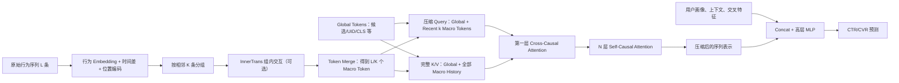

---
tags:
  - 推荐系统
  - 序列建模
  - LONGER
  - Transformer
  - 长序列
  - 论文拆解
created: 2026-07-27
---

# LONGER：工业推荐超长序列建模详解

论文：[LONGER: Scaling Up Long Sequence Modeling in Industrial Recommenders](https://arxiv.org/abs/2505.04421)  
HTML：[arXiv HTML](https://arxiv.org/html/2505.04421)  
会议：RecSys 2025  
机构：ByteDance

> **一句话总结：** LONGER 不是用局部窗口或步幅注意力“跳着看历史”，而是先用 Token Merge 把相邻行为组成更宽的 Macro Token，再让少量 Global/Recent Query 在第一层读取完整长历史，之后只在压缩后的短序列上堆叠 Self-Attention，并配合 KV Cache、混合精度和激活重计算完成工业部署。

---

## 0. 先纠正旧笔记中的三个关键误区

### 误区一：Hybrid Attention = Local Window + Stride Attention

不是。LONGER 论文中的 Hybrid Attention 指：

1. 第一层使用 **Cross-Causal Attention**，少量 Query 读取完整长序列；
2. 后续层使用 **Self-Causal Attention**，只处理第一层已经压缩后的短序列。

论文没有把 Local Window、Stride Attention 或 Dilated Receptive Field 作为 LONGER 的核心结构。

### 误区二：Token Merge 后 Attention 计算量直接变成 $1/K^2$

不准确。长度确实从 $L$ 变成 $L/K$，但论文的 Concat Merge 会把隐藏维从 $d$ 扩成 $Kd$。因此 Attention 部分约减少为原来的 $1/K$，而 FFN/线性投影部分反而随 $K$ 增长。

所以 $K$ 不是越大越好，需要在长度、宽度、参数量和效果之间权衡。

### 误区三：Global Token 只是“全局平均池化”

不是。Global Token 是参加 Attention 的特殊 Token，可以来自候选商品、UID、可学习 CLS 或高阶交互特征。它一方面承担全局信息锚点，另一方面让候选信息能够主动查询整段历史。

---

## 1. LONGER 到底要解决什么问题？

### 1.1 推荐系统为什么需要长序列？

假设一个用户最近 50 次行为全是日用品，但半年前曾经连续购买相机、镜头和三脚架。现在候选商品是一款新镜头：

- 只看 Recent 50，模型可能认为用户完全不喜欢摄影；
- 看完整历史，模型才能发现“低频但稳定的长期摄影兴趣”；
- 长历史还可能包含周期性消费，例如每月买咖啡豆、每年换手机配件。

论文把 $10^2～10^3$ 视为常见短序列范围，希望把端到端历史扩展到 10,000 级别。

### 1.2 传统方案为什么还不够？

#### 两阶段检索：SIM、TWIN 等

先从几千条历史中检索和候选最相关的 Top-$k$，再用 DIN/Transformer 精细建模。

优点是便宜；问题是：

- 上游检索一旦漏掉行为，下游永远看不到；
- 检索目标与最终 CVR/CTR 目标可能不完全一致；
- 不同候选可能需要重复进行候选相关检索；
- 不能在统一模型中端到端优化“选择什么历史”。

#### 预训练 User Embedding

先将长历史压成一个用户向量，再交给下游模型。

问题是下游候选无法直接访问原始历史，一个固定向量也难同时表达用户的多个兴趣。

#### Vanilla Transformer/HSTU

能够直接建模历史，但 Dense Attention 的核心代价随长度平方增长：

$$
O(L^2d)
$$

当 $L$ 从 1,000 增加到 10,000，Attention Pair 数量会放大 100 倍。

### 1.3 LONGER 的核心解法

LONGER 不是只做一个技巧，而是连续压缩两次：

1. **沿时间轴压缩：** 每 $K$ 条相邻行为合成一个 Macro Token，$L\rightarrow L/K$；
2. **沿 Query 数压缩：** 只有 Global Token 和最近 $k$ 个 Macro Token 作为 Query，但完整 Macro History 仍作为 Key/Value 被第一层读取；
3. **沿网络深度节省：** 只有第一层接触完整历史，后续 $N$ 层只处理 $m+k$ 个压缩 Token。

这三个动作才是理解 LONGER 的主线。

---

## 2. 模型整体数据流



用形状表示：

```text
原始序列：                    (L, d)
Token Merge 后：              (L/K, Kd)
完整 Key/Value：              (m + L/K, Kd)
压缩 Query：                  (m + k, Kd)
首层 Cross Attention 输出：   (m + k, Kd)
后续 Self Attention：          始终只处理 (m + k, Kd)
```

其中：

- $L$：原始历史长度；
- $d$：单条行为的 Embedding 维度；
- $K$：Token Merge 的组大小；
- $m$：Global Token 数量；
- $k$：从合并序列中选出的 Query 数量，论文实验中 Recent 100 是重要配置。

---

## 3. 用一个真实推荐例子完整走一遍

### 3.1 任务设定

现在要预测：

> 用户小明看到“无线充电器”广告后，是否会转化？

为了便于手算，假设小明有 12 条行为，按论文图中的方式从**最近到最早**排列：

| 位置 | 时间 | 行为 |
|---|---|---|
| $h_1$ | 今天 | 浏览手机壳 |
| $h_2$ | 今天 | 点击无线充电器 |
| $h_3$ | 3 天前 | 购买手机 |
| $h_4$ | 1 周前 | 浏览跑步袜 |
| $h_5$ | 1 周前 | 点击跑鞋 |
| $h_6$ | 2 周前 | 浏览跑步机 |
| $h_7$ | 1 月前 | 购买咖啡豆 |
| $h_8$ | 2 月前 | 浏览磨豆机 |
| $h_9$ | 3 月前 | 购买咖啡机 |
| $h_{10}$ | 5 月前 | 浏览相机包 |
| $h_{11}$ | 6 月前 | 点击镜头 |
| $h_{12}$ | 6 月前 | 购买相机 |

每个行为 Token 不只是 Item ID，通常还可以包含：

- Item/类目/行为类型 Embedding；
- 行为与当前请求之间的绝对时间差；
- 可学习的绝对位置 Embedding；
- 其他业务侧行为属性。

论文明确加入了两种时序信息：绝对时间差 Side Information，以及可学习绝对位置编码。

### 3.2 第一步：Token Merge

令 $K=3$，每 3 条相邻行为组成一组：

```text
M1 = [手机壳, 无线充电器, 手机]
M2 = [跑步袜, 跑鞋, 跑步机]
M3 = [咖啡豆, 磨豆机, 咖啡机]
M4 = [相机包, 镜头, 相机]
```

序列长度从 12 变成 4：

$$
(12,d)\rightarrow(4,3d)
$$

注意，Concat Merge 不是把三条行为求平均，而是将三条 $d$ 维表示拼成一个 $3d$ 维 Macro Token。因此：

- 三条行为仍各自保留一块维度；
- 顺序可以通过固定拼接位置和位置特征保留；
- 代价是 Macro Token 变宽，模型参数量会增加。

### 3.3 InnerTrans 在这里做什么？

如果直接拼接，三条行为虽然没有被平均掉，但在进入 Outer Transformer 之前还没有充分互动。

例如 $M_1$ 中：

```text
先买手机 -> 再点击无线充电器 -> 又浏览手机壳
```

它们组合起来表达的是“用户最近刚进入手机配件购买周期”，比三个独立 Item 更有意义。

InnerTrans 在每个小组内部做一次轻量 Transformer：

$$
M_i=\operatorname{InnerTransformer}([e_i^1,e_i^2,e_i^3])
$$

它只处理 $K=3$ 个 Token，局部 Attention 矩阵只有 $3\times3$，所以计算量很小，却能提前提炼局部模式。

> **严谨说明：** 论文给出了组内 Transformer 的定义，但没有把 InnerTrans 后究竟如何 Pool/Flatten 的全部实现细节展开。结合 Concat 实验与 $Kd$ 维参数公式，最稳妥的理解是：先做组内交互，再形成供外层使用的 $Kd$ 级组表示；不要擅自说成“固定取最后一个 Token”。

### 3.4 第二步：构造 Global Token

论文中的 Global Token 可以来自：

- 候选商品表示；
- UID Embedding；
- 可学习 CLS Token；
- 高阶用户—商品交互特征。

为了把例子讲简单，只保留一个候选 Global Token：

```text
G = “无线充电器候选广告”的表示
```

完整输入现在是：

```text
R = [G, M1, M2, M3, M4]
```

它将作为首层 Attention 的 Key 和 Value，意味着四组历史都没有因 Query 采样而消失。

### 3.5 第三步：只选少量 Query

假设只取最近 $k=2$ 个 Macro Token：

```text
O = [G, M1, M2]
```

因此：

```text
Query：     [G, M1, M2]          长度 3
Key/Value： [G, M1, M2, M3, M4]  长度 5
```

这是 LONGER 最容易误解的地方：

> 只选择 Recent $k$ 作为 Query，不等于只保留 Recent $k$ 条历史。旧的 $M_3,M_4$ 仍在 Key/Value 中，仍然能被 Query 读取。

为什么 Recent Query 效果最好？一种合理解释是：最近行为最能代表当前意图，适合作为“提问者”；完整历史则适合作为被查询的记忆库。

论文消融也显示 Recent 100 优于 Learnable 100、Uniform 100 和 Recent50 + Uniform50。

### 3.6 第四步：首层 Cross-Causal Attention

首层计算：

$$
Q=OW_Q,\qquad K=RW_K,\qquad V=RW_V
$$

$$
Z=\operatorname{Softmax}\left(\frac{QK^T}{\sqrt d}+M\right)V
$$

在玩具例子中，Attention Score Matrix 是：

$$
3\times5
$$

而不是让所有 5 个 Token 彼此做 $5\times5$ Self-Attention。

直观上：

- 候选 $G$ 会重点关注 $M_1$ 的“手机—充电器—手机壳”；
- 它可能给跑步组 $M_2$ 很低权重；
- 它也能看到更老的咖啡和摄影组，判断这些是否代表稳定兴趣；
- $M_1,M_2$ 作为 Recent Query，也会从更早历史中补充上下文。

第一层结束后，完整历史被压缩到：

```text
Z = [G', M1', M2']
```

长度从 5 变成 3。

### 3.7 Causal Mask 为什么看起来是反的？

普通语言模型通常按“最早到最新”排列，只允许看左边。论文架构图将行为按“最新到最早”排列，因此其 Mask 写成允许 $j\ge i$，也就是允许看自己和右侧更老的行为。

在简化例子 `[G,M1,M2,M3,M4]` 中，可理解为：

| Query | 可以读取的 Key/Value |
|---|---|
| 候选 $G$ | $G,M_1,M_2,M_3,M_4$ |
| $M_1$ | $M_1,M_2,M_3,M_4$ |
| $M_2$ | $M_2,M_3,M_4$ |

候选信息不能反向污染历史 Token 的表示，这一点对后面的 KV Cache 很关键：同一个用户的历史表示可以跨多个候选复用。

> 论文对多种 Global Token 的具体 Mask 细节没有完全展开。面试中重点说明“候选可读取历史、历史侧保持候选无关以便缓存”，不要自行补充更复杂的双向 Mask。

### 3.8 第五步：后续 Self-Causal Attention

第一层输出只有 `[G',M_1',M_2']`，后续 $N$ 层只对这 3 个 Token 做 Self-Attention：

$$
\operatorname{CrossAttn}(O,R)
\longrightarrow
\operatorname{SelfAttn}(Z)\times N
$$

后续每层 Attention Matrix 都只有 $3\times3$。

这相当于：

- 第一层负责“从完整档案中查资料”；
- 后续层负责“对查到的摘要做深度推理”。

### 3.9 第六步：输出 CVR

压缩后的序列表示与以下特征拼接：

- 用户画像；
- 请求上下文；
- 候选商品特征；
- 业务交叉特征。

再送入高层 MLP，预测：

$$
P(y=1\mid S_u,u_d,v)
$$

训练目标是二分类交叉熵：

$$
\mathcal L=-\frac1{|\mathcal D|}\sum
\left[y\log\hat y+(1-y)\log(1-\hat y)\right]
$$

---

## 4. Token Merge 的复杂度为什么不是 $1/K^2$？

### 4.1 Vanilla Transformer

论文采用的单层 FLOPs 估算为：

$$
\operatorname{FLOPs}_{vanilla}=24Ld^2+4L^2d
$$

- $24Ld^2$：Q/K/V/O 投影和 FFN 等线性层；
- $4L^2d$：Attention Score 和加权聚合。

### 4.2 Merge 后长度缩短，但宽度增加

Concat $K$ 个 Token 后：

$$
L' = \frac{L}{K},\qquad d'=Kd
$$

代入公式：

$$
24L'd'^2+4L'^2d'
=24Ld^2K+\frac{4L^2d}{K}
$$

于是比例为：

$$
\frac{\operatorname{FLOPs}_{merge}}
{\operatorname{FLOPs}_{vanilla}}
=\frac{6dK+L/K}{6d+L}
$$

这揭示了两个相反作用：

1. Attention 项从 $4L^2d$ 降到 $4L^2d/K$；
2. 线性层/FFN 项从 $24Ld^2$ 增长到 $24Ld^2K$。

所以：

- $K$ 较小时，长度压缩收益占主导；
- $K$ 过大时，宽度与 FFN 成本会反噬；
- TokenMerge8 不一定比 TokenMerge4 更省 FLOPs。

### 4.3 论文中的真实数字

论文给出的典型配置：$L=2048,d=32,K=4$。

| 结构 | FLOPs |
|---|---:|
| Vanilla Transformer | 约 587M |
| Token Merge，$K=4$ | 约 336M |

即减少约 42.8%，不是减少到 $1/16$。

消融实验同样显示：

| 配置 | 序列长度 | FLOPs ($10^9$) | AUC |
|---|---:|---:|---:|
| 不 Merge | 2000 | 3.73 | 0.85111 |
| TokenMerge4 Concat | 500 | 2.13 | 0.85232 |
| TokenMerge8 Concat | 250 | 3.03 | 0.85291 |
| TokenMerge8 + InnerTrans | 250 | 3.52 | 0.85332 |

为什么 $K=8$ 的 FLOPs 比 $K=4$ 高？因为虽然长度更短，但隐藏维和 FFN 成本更大。它换来了更高模型容量和更好 AUC。

---

## 5. Query 压缩到底省在哪里？

Token Merge 后假设还有 $L'=L/K$ 个 Macro Token。

如果每一层都做完整 Self-Attention，单层 Attention Pair 数约为：

$$
(m+L')^2
$$

LONGER 只在第一层让 $m+k$ 个 Query 读取 $m+L'$ 个 Key/Value：

$$
(m+k)(m+L')
$$

后续层只处理压缩输出：

$$
(m+k)^2
$$

当 $k\ll L'$ 且层数较多时，节省非常明显。

论文实验中，Recent 100 与 250 个 Query 的效果接近：

| Query 数 | FLOPs ($10^9$) | AUC | LogLoss |
|---:|---:|---:|---:|
| 50 | 1.27 | 0.85235 | 0.47162 |
| 100 | 1.91 | 0.85290 | 0.47103 |
| 250 | 3.52 | 0.85332 | 0.47052 |

Recent 100 只使用 250 Query 配置约 54% 的 FLOPs，性能已经非常接近，因此是论文强调的工程折中点。

---

## 6. Global Token 的三个作用

### 6.1 候选感知的查询入口

候选商品本身作为 Global Token，可以直接向完整历史提问：

> 历史里哪些行为能解释用户是否会点击/购买这个候选？

这和 DIN 的候选感知思想相似，但 LONGER 把它放进了长序列 Transformer 的压缩架构中。

### 6.2 全局信息锚点

UID、CLS、高阶交互等 Global Token 可以聚合多种上下文，为长历史提供稳定的全局表示。

### 6.3 缓解 Attention Sink

论文借鉴 StreamLLM 的观察：长序列深层 Attention 容易将较多注意力集中在开头 Token。显式 Global Token 可以承担稳定锚点，而不是让普通历史行为被迫充当“注意力水槽”。

但这应理解为论文的设计动机和实验性判断，不要回答成 Global Token 从理论上彻底解决了 Attention Sink。

---

## 7. 工程优化：为什么架构能训练还不够？

### 7.1 全同步 GPU 训练框架

LONGER 同时包含：

- 巨大的稀疏 Embedding 参数；
- Transformer 等稠密参数。

论文使用全同步训练和服务框架，在 GPU 机器上统一更新 Dense/Sparse 参数，避免传统 Parameter Server 带来的通信与参数陈旧问题。

稀疏参数按访问频率分层存储：

| 层级 | 存储内容 | 特点 |
|---|---|---|
| GPU HBM | 高频特征 | 延迟最低、容量最小 |
| CPU Memory | 中频特征 | 容量更大 |
| Local SSD | 低频长尾特征 | 容量最大、访问最慢 |

### 7.2 Mixed Precision

非关键计算使用 BF16/FP16，敏感部分保留更高精度。论文报告平均：

- 吞吐提升约 18%；
- 训练时间减少约 16%；
- 内存使用减少约 18%；
- Dense Layer 内存最高减少约 28%。

这些是论文系统上的实测值，不应外推成所有 LONGER 复现都能获得同样收益。

### 7.3 Activation Recompute

训练反向传播需要保存前向激活，长序列下激活往往比参数更占显存。

Recompute 的思路是：

- 前向时不保存部分中间激活；
- 反向时重新计算；
- 用额外 FLOPs 换显存。

论文基于 TensorFlow `custom_gradient` 实现可声明式重计算。

### 7.4 KV Cache Serving

推荐排序一次请求通常要给同一用户打分很多候选：

```text
同一份用户历史 + 候选 A
同一份用户历史 + 候选 B
同一份用户历史 + 候选 C
```

如果每个候选都重新计算历史的 K/V，会产生大量重复计算。

LONGER 将用户历史 K/V 预计算并缓存：

```text
离线/请求级共享：History -> K_cache, V_cache
逐候选计算：Candidate Query -> Attention(K_cache, V_cache)
```

这不是语言模型“逐 Token 生成”的 KV Cache，而是**多候选打分场景下复用同一用户历史**。

论文报告，使用该策略后，在线吞吐下降从最高约 40% 缩小到约 6.8%。

能够缓存的前提是：历史侧表示不能被候选信息污染，这也是 Causal Mask 设计的重要工程动机。

---

## 8. 实验结果应该怎么看？

### 8.1 数据与任务

论文离线实验来自抖音广告 CVR 任务：

- 5.2 billion 样本；
- 连续 130 天日志；
- 前 123 天训练、后 7 天评估；
- 48 张 A100 GPU；
- 行为包含曝光/浏览、点击、转化等多种类型。

### 8.2 主结果

| 模型 | AUC | LogLoss |
|---|---:|---:|
| Base | 0.83968 | 0.48758 |
| TWIN | 0.84472 | 0.48168 |
| DIN Recent50 | 0.84698 | 0.47830 |
| DIN Long | 0.84982 | 0.47452 |
| HSTU | 0.84994 | 0.47490 |
| Transformer | 0.85111 | 0.47293 |
| LONGER | **0.85290** | **0.47103** |

注意口径：

- LONGER 相对 Base 的 AUC 提升，论文记为 1.57%；
- 相比 Transformer，绝对 AUC 增加 $0.85290-0.85111=0.00179$；
- 不要把“1.57%”说成绝对增加 1.57 个百分点。

### 8.3 Query 选择消融

在相同 Query 数 100 下：

| Query 策略 | AUC |
|---|---:|
| Learnable 100 | 0.84946 |
| Uniform 100 | 0.85183 |
| Recent50 + Uniform50 | 0.85255 |
| Recent 100 | **0.85290** |

结论是 Recent Query 最适合作为当前意图锚点；但旧历史仍通过 K/V 被读取，所以它不是简单截断。

### 8.4 Scaling 观察

论文观察到 AUC/LogLoss 随以下因素增加呈幂律趋势：

- 序列长度；
- 参数量；
- FLOPs。

参数 Scaling 拟合 $R^2=0.987$，FLOPs Scaling 拟合 $R^2=0.967$。更深模型能从长序列获得更多收益，但也呈边际收益递减。

这里应说“论文在其实验范围内观察到 Scaling Trend”，而不是把它上升为所有推荐任务都成立的普遍定律。

### 8.5 在线结果

论文报告在抖音广告的直播、短视频、商城场景中，ADSS/ADVV 均获得约 1%～2% 的提升；在抖音电商直播与短视频场景中，Order/U 和 GMV/U 也有正向提升。

这些指标依赖内部业务定义，面试时重点说明“离线 AUC/LogLoss 与线上业务指标方向一致”，不需要死背全部数字。

---

## 9. LONGER 与其他模型怎么对比？

| 模型 | 如何处理长历史 | 候选感知 | 主要问题/特点 |
|---|---|---|---|
| DIN | 候选对历史逐条 Target Attention | 强 | 交互较浅；超长序列计算和噪声问题仍存在 |
| SIM/TWIN | 先检索 Top-$k$，再精排 | 强 | 两阶段可能目标不一致，检索漏掉后不可恢复 |
| User Embedding | 长历史提前压成固定向量 | 通常较弱 | 下游无法直接访问原始行为，多兴趣易被压平 |
| Transformer | 所有 Token 多层全连接 Attention | 可支持 | 多层 $O(L^2)$，长序列成本高 |
| HSTU | 推荐定制 Attention/门控 Block | 可支持 | 更适合序列推荐，但 Dense Attention 仍有二次项 |
| LONGER | Merge 全历史；少量 Query 首层读全量 K/V；后续只算短序列 | 强 | 以局部打包和 Query 压缩换效率，系统实现复杂 |

### 最核心的区别

LONGER 没有像 TWIN 那样先检索并删除大部分历史，而是让完整的合并历史都进入首层 K/V；也没有像 Vanilla Transformer 那样让完整历史穿过每一层。它把“读完整历史”和“做深层交互”拆开：

```text
第一层：广泛读取
后续层：在摘要上深入推理
```

---

## 10. 局限与需要谨慎看的地方

1. **Token Merge 不是无损压缩。** Concat 保留原始分块，但外层交互以组为单位，组边界可能影响行为之间的细粒度关系。
2. **维度和参数会膨胀。** $K$ 增大时宽度变成 $Kd$，FFN 成本和参数量会上升。
3. **Recent Query 有归纳偏置。** 对短期意图强的广告/CVR 很合理，但对长期稳定兴趣任务未必总是最佳。
4. **工业数据不可公开复现。** 核心实验依赖 5.2B 私有样本、48×A100 和内部系统框架。
5. **Global Token/Mask 的部分工程细节未完全公开。** 不能从论文自行推断所有 Token 的可见性规则。
6. **KV Cache 有一致性成本。** 用户发生新行为后需要更新或失效缓存，还要处理版本、TTL 和候选批次复用范围。
7. **Scaling Law 是经验拟合。** 只说明当前范围内增加长度/参数/FLOPs 仍有效，不代表无限 Scaling 都有收益。

---

## 11. 如果要在自己的项目里借鉴

不建议一开始就复现论文的完整 GPU 系统，可以分三步：

### 第一步：验证建模假设

固定序列长度 1,000～2,000，比较：

```text
Vanilla Transformer
TokenMerge4 + Concat
TokenMerge4 + InnerTrans
```

重点记录 AUC、LogLoss、FLOPs、显存和训练吞吐。

### 第二步：验证 Query 压缩

让完整 Merge History 作为 K/V，比较：

```text
Recent 50 / 100
Uniform 100
Recent50 + Uniform50
Learnable Query
```

需要确认 Recent Query 的优势是否适用于自己的业务。

### 第三步：再做服务优化

只有当线上一次请求需要评分多个候选、且历史表示可复用时，再实现：

- History K/V Cache；
- 候选 Micro-Batch；
- Cache TTL/版本控制；
- Mixed Precision；
- Activation Recompute。

---

## 12. 高频面试问题

### Q1：请用一分钟讲 LONGER

**推荐回答：**

LONGER 是字节提出的工业超长行为序列模型，目标是在 CTR/CVR 排序中端到端利用最长约 10,000 条历史。它先将每 $K$ 个相邻行为通过 Concat 或 InnerTrans 合成 Macro Token，把时间长度从 $L$ 压到 $L/K$；然后用 Global Token 和最近 $k$ 个 Macro Token 作为 Query，在第一层 Cross-Causal Attention 中读取完整合并历史的 K/V；第一层输出只有 $m+k$ 个 Token，后续多层只在这个短序列上做 Self-Causal Attention。这样完整历史仍能参与，但完整长度只进入第一层。工程上再通过混合精度、激活重计算、分层 Embedding 存储和历史 KV Cache 控制训练显存与线上延迟。

### Q2：LONGER 的 Hybrid Attention 是什么？

**推荐回答：**

它不是 Local + Stride Attention，而是首层 Cross-Causal Attention 与后续 Self-Causal Attention 的混合。首层用少量 Query 读取完整 K/V，完成长序列压缩；后续层只在压缩结果上建模高阶交互。

### Q3：只取 Recent 100 Query，不还是丢掉旧历史了吗？

**推荐回答：**

没有。Recent 100 只决定哪些 Token 作为 Query，所有合并后的旧历史仍在首层 Key/Value 中。Recent Query 可以通过 Cross Attention 从旧历史读取信息，和“只保留 Recent 100、删除其他历史”本质不同。

### Q4：Token Merge 为什么不是简单平均池化？

**推荐回答：**

论文的主要配置是 Concat，把 $K$ 个 $d$ 维行为拼成 $Kd$ 维 Macro Token，能保留每个行为的独立子空间；还可以在组内先做轻量 InnerTrans，建模局部顺序和交互。代价是隐藏维和参数量增加。

### Q5：为什么 TokenMerge8 比 TokenMerge4 序列更短，FLOPs 反而更高？

**推荐回答：**

因为 Concat 后隐藏维从 $d$ 扩成 $Kd$。增大 $K$ 会降低 Attention 的长度项，但会提高投影和 FFN 的宽度成本。论文公式中 Merge 后 FLOPs 为 $24Ld^2K+4L^2d/K$，所以存在最优折中，并非 $K$ 越大越省。

### Q6：为什么 Recent Query 优于 Learnable Query？

**推荐回答：**

最近行为本身携带明确的当前兴趣语义，作为 Query 能更有针对性地从长历史取回补充信息；随机初始化的 Learnable Query 需要从训练数据中自行学会“该问什么”，在论文的工业 CVR 场景中效果较弱。这个结论来自消融，但不保证所有任务都相同。

### Q7：为什么需要 Causal Mask？

**推荐回答：**

除了维护时间依赖，更重要的是隔离候选信息和用户历史表示。候选可以读取历史，但历史侧 K/V 不应被候选污染，这样同一用户历史才能在多个候选之间缓存复用。

### Q8：LONGER 的 KV Cache 和 LLM 的 KV Cache 有什么区别？

**推荐回答：**

LLM KV Cache 主要复用自回归生成过程中已有前缀；LONGER 主要复用同一请求下、不同候选共享的用户历史 K/V。候选变化，历史不变，因此历史计算一次即可。

### Q9：LONGER 相比 TWIN 的核心优势是什么？

**推荐回答：**

TWIN 先做候选相关检索，只把 Top-$k$ 历史交给下游，检索遗漏不可恢复，也存在两阶段目标不一致。LONGER 的完整合并历史都进入首层 K/V，在统一 CVR/CTR Loss 下端到端学习如何聚合。

### Q10：LONGER 是否真正把复杂度变成线性？

**推荐回答：**

不能简单说成完全线性。Token Merge 和 Query 压缩显著减少实际 FLOPs，但首层仍有 $(m+k)(m+L/K)$ 的 Cross Attention，后续仍有 $(m+k)^2$ 的 Self Attention；只是 $k$ 和 $K$ 被控制在较小范围，使工业计算可承受。

---

## 13. 最终速记

```text
LONGER = 三次减负

1. Token Merge：L -> L/K
2. Query Compression：完整历史只作为 K/V，Query 只取 Global + Recent k
3. Depth Compression：完整历史只进第一层，后续层只算 m+k 个 Token
```

> **最终口令：** 相邻行为先打包，最近行为来提问，完整历史做记忆，第一层广泛读取，后续层在摘要上深挖；训练靠混合精度和重计算，服务靠历史 KV Cache。
