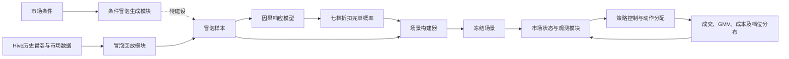

# 生成式出价仿真系统设计与进度

## 0. 文档范围与项目依赖

本文承接生成式出价项目的前置问题定义，重点梳理仿真系统的模块划分、数据流、当前建设状态和后续工作，不重复展开因果响应模型的训练与评估细节。

相关资料：

- 因果响应模型实现与评估：[[因果响应模型与验证]]
- 因果响应模型迭代过程：[[BCE模型因果响应迭代总过程]]
- Git：[hxz_market_simulator](https://code.xiaojukeji.com/bwh_stg/hxz_market_simulator/-/tree/master)
- 机器工作目录：`/ofs/pltf-sub-and-pap/yipenglili/hxz_market_simulator`

## 1. 系统目标与总体流程

仿真系统的目标是在给定城市、日期和市场环境下，构造可重复使用的冒泡场景，模拟控制器为每条冒泡分配折扣后的成交、GMV与补贴成本，为策略训练和离线评估提供统一环境。

当前系统以**历史冒泡回放**为主要输入路径；条件冒泡生成模块建成后，可在给定市场条件下生成新的冒泡分布。

## 2. 模块建设状态

| 模块 | 主要职责 | 当前状态 |
|---|---|---|
| Hive数据导出 | 按城市、日期准备冒泡与市场数据 | 已实现 |
| 冒泡回放 | 读取历史冒泡及其市场背景 | 已实现 |
| 条件冒泡生成 | 在给定市场条件下生成新冒泡 | 待建设 |
| 因果响应接入 | 输出每条冒泡在七档折扣下的完单概率 | 已实现 |
| 场景构建 | 冻结冒泡、响应概率、模拟成交、GMV和成本 | 已实现 |
| 市场状态与观测 | 组合历史市场背景与仿真累计状态 | 已实现 |
| 策略控制与动作分配 | 根据控制信号逐冒泡分配折扣并聚合指标 | 已实现 |
| 系统可用性评估 | 验证回放一致性、策略泛化和抗模型误差利用能力 | 待完善 |

## 3. 冒泡生成器

### 3.1 冒泡回放模块

冒泡回放模块从Hive中按城市和日期导出历史冒泡及对应市场数据，作为当前仿真系统的基础输入。

#### 3.1.1 冒泡特征

数梦任务：[冒泡特征取数任务](https://studio.data.didichuxing.com/?projectId=1143&taskId=67503196)

原始回放数据包含353个模型特征，按业务含义可归纳为8类。因果响应模型实际使用的特征范围和过滤规则，以[[因果响应模型与验证]]为准。

| 类别 | 主要内容 | 字段举例 |
|---|---|---|
| 当前行程与时空信息 | 城市、小时、星期、工作日、行程距离、预估时长和基础价格 | `hour_of_day`、`start_dest_dis`、`estimate_dur`、`raw_min_basic_total_fee_amt` |
| 周边即时供需 | 网格及周边最近1/5分钟的冒泡、订单、接单、空闲司机、取消和等待情况 | `grid_last_5min_start_bubble_unq_cnt_kf`、`grid_last_1min_driver_empty_cnt_kf` |
| 乘客历史交易表现 | 过去28天呼叫、成交、取消、GMV、补贴及不同产品表现 | `passenger_finish_cnt_28d`、`passenger_subsidy_c_rate_28d`、`pas_uabox_ecr_28d` |
| 乘客画像与活跃度 | 年龄、学生认证、使用频率、近期冒泡和完单活跃情况 | `dm_user_base_oneid_info_age`、`is_kf_student_verify`、`hxz_finish_cnt_7d` |
| 页面交互行为 | 不同历史窗口的页面、套餐和详情曝光、点击及点击率 | `package_sw_7d`、`package_ck_7d`、`detail_ck_rate_28d` |
| 呼叫选择与价格偏好 | 近1/2个月的价格比例、呼叫品类数量、加选/反选和最低价选择 | `avg_fee_scale_1month`、`avg_call_cp_cnt_1month`、`call_min_fee_ratio_1month` |
| 城市历史经营背景 | 城市过去28天的冒泡、成交、取消、经营效率、GMV、补贴及城市×小时×星期统计 | `city_finish_cnt_28d`、`city_subsidy_c_rate_28d`、`city_hour_week_cr_28d` |
| 城市分产品历史表现 | UABOX、UFBOX、盒外和幸运盒等产品的历史量、转化、占比及补贴 | `city_uabox_ecr_28d`、`city_outbox_call_ratio_28d`、`city_luckybox_finish_cnt_28d` |

#### 3.1.2 市场特征

数梦任务：[市场特征取数任务](https://studio.data.didichuxing.com/?projectId=1143&taskId=67579584)

市场数据主要来自WGC 30分钟监控表。当前控制器可读取17个市场特征，分为5类：

| 类别 | 字段 | 含义 |
|---|---|---|
| 日历 | `day_of_week` | 星期几 |
| 日历 | `is_weekend` | 是否周末 |
| 历史需求 | `bubble_cnt_hist_30m` | 过去30分钟冒泡量 |
| 历史需求 | `bubble_cnt_hist_60m` | 过去60分钟冒泡量 |
| 历史需求 | `bubble_cnt_change_30m` | 30分钟冒泡量变化 |
| 需求空间分布 | `county_bubble_share_hist_30m` | 过去30分钟各区县冒泡占比 |
| 需求空间分布 | `top3_county_bubble_share_hist_30m` | 过去30分钟前三大区县冒泡占比 |
| 天气 | `weather_type` | 天气类型 |
| 天气 | `temperature_c` | 温度 |
| 天气 | `rain_intensity_raw` | 降雨强度原始值 |
| 天气 | `rainy_area_share` | 降雨区域占比 |
| 司机供给 | `online_driver_cnt_asof` | 截至观测时点的在线司机数 |
| 司机供给 | `idle_driver_cnt_asof` | 截至观测时点的空闲司机数 |
| 司机供给 | `idle_driver_ratio_asof` | 截至观测时点的空闲司机比例 |
| 司机供给 | `online_driver_cnt_avg_hist_30m` | 过去30分钟平均在线司机数 |
| 司机供给 | `idle_driver_cnt_avg_hist_30m` | 过去30分钟平均空闲司机数 |
| 司机供给 | `online_driver_cnt_change_30m` | 30分钟在线司机数变化 |

### 3.2 条件冒泡生成模块

计划尝试VAE、Diffusion等条件生成模型，在给定市场条件的情况下生成对应冒泡。该模块当前尚未建设，因此现阶段仿真主要回答“历史冒泡在不同策略下会发生什么”，暂不回答“新市场条件下会产生哪些新冒泡”。

## 4. 因果响应接入

因果响应模块将每条冒泡的特征转换为82、85、88、91、94、97和100折七档特价盒子折扣下的完单概率，目前已完成系统接入。

该模块的数据、模型结构、训练目标、全量OOF验证结果及使用边界，详见[[因果响应模型与验证]]。本文只使用其七档绝对响应概率，不重复描述模型训练过程。

## 5. 场景构建器

场景构建器将冒泡生成器与因果响应模块的输出组合起来，冻结历史冒泡、七档完单概率、模拟成交结果以及GMV和补贴成本，生成可重复使用的离线仿真场景，目前已实现。

| 场景内容 | 含义 |
|---|---|
| 历史冒泡 | 指定城市、日期和时间片内的冒泡及其特征 |
| 七档BCR概率 | 每条冒泡在七种折扣下的预测完单概率 |
| 七档BCR模拟响应 | 各折扣下预先采样并冻结的成交结果，以及对应GMV和补贴成本 |

为减少不同策略重复评估时的随机波动，每个冒泡固定抽取一个随机数，并分别与七档BCR概率比较，得到各档位的模拟成交结果。同一场景在相同随机种子和版本配置下应可重复生成。

## 6. 市场状态与观测模块

该模块把当前时间片的历史市场背景，与本次回放在此前时间片累计产生的执行状态组合起来，形成控制器可读取的observation，目前已实现。

观测信息需要严格遵循时序边界：控制器在当前时间片只能读取截至该时点已经可获得的历史信息和累计状态，不能读取未来成交结果或未来市场特征。

## 7. 策略控制与动作分配模块

该模块输入当前时间片的控制信号 $\lambda$，逐冒泡选择折扣，并输出本时间片的聚合指标，目前已实现。

| 字段 | 含义 |
|---|---|
| `input_bubbles` | 原始输入冒泡数 |
| `rejected_bubble` | 场景构建时被过滤的冒泡数 |
| `accepted_bubbles` | 实际参与本时间片回放的冒泡数 |
| `finish_count` | 模拟成交数 |
| `finish_rate` | 模拟成交数/参与回放的冒泡数 |
| `gmv_cents` | 模拟GMV，单位为分 |
| `cost_cents` | 模拟补贴成本，单位为分 |
| `subsidy_rate` | 补贴成本/GMV |
| `treatment_counts` | 七档折扣分别分配的冒泡数 |

## 8. 仿真系统可用性评估

### 8.1 当前可用能力

当前已经打通“历史冒泡回放—因果响应—场景冻结—状态观测—动作分配—指标汇总”的完整链路，可以在固定历史样本和固定随机种子下，对不同折扣策略进行可重复的离线比较。

因果响应模型本身的仿真可用性评估见[[因果响应模型与验证]]。系统级评估还需要进一步覆盖回放一致性、时序正确性、策略泛化和抗模型误差利用能力。

### 8.2 主要风险与待办

#### 8.2.1 仿真BCR与决策BCR同源

当前仿真环境用于生成成交结果的BCR，与控制器进行决策时使用的BCR来自同一套模型。随着算法持续优化，控制器可能逐渐学会利用BCR模型自身的系统性误差，而不是真实业务规律。

后续应优先验证以下隔离方案：

1. 将环境侧“真实响应模型”和策略侧“可见预测模型”分离；
2. 使用不同数据切分、模型结构或随机种子的响应模型构造多环境评估；
3. 对响应概率加入基于校准误差和不确定性的扰动，检查策略鲁棒性；
4. 最终使用时间外RCT或线上实验结果校验仿真排序是否能够迁移。

#### 8.2.2 条件生成能力尚未建设

当前系统依赖历史冒泡回放，能够比较同一批历史冒泡在不同策略下的结果，但不能生成供需、天气或用户结构发生变化后的新冒泡分布。条件冒泡生成模块建成前，结论应限定在历史样本支持域内。

#### 8.2.3 因果响应模型存在档位使用边界

不同折扣档位的冒泡异质性证据强度不同，系统不能把所有档位的单冒泡CATE都视为同等可靠。具体档位结论和使用限制以[[因果响应模型与验证]]中的最新审计结果为准。

#### 8.2.4 计算性能

如果后续大规模策略求解出现耗时瓶颈，可评估使用CUDA算子加速批量概率计算、场景采样和策略搜索。在引入加速前，应先通过性能剖析确认主要瓶颈。

## 9. 仿真系统数据准备

### 9.1 输入数据

- 指定城市、日期和时间片的历史冒泡；
- 冒泡级模型特征及标识字段；
- 当前及历史市场特征；
- 七档因果响应概率；
- GMV、基础价格和补贴成本计算所需字段。

### 9.2 建议冻结的场景产物

- 场景ID、城市、日期和时间片；
- 冒泡ID及对应特征版本；
- 七档折扣下的BCR概率；
- 七档折扣下固定采样的成交结果；
- 各档GMV及补贴成本；
- 数据SQL版本、特征Schema版本、因果响应模型Checkpoint和校准版本；
- 随机种子、代码Commit及场景生成时间。

这些信息共同保证同一场景可以复现，也便于定位数据、模型或代码升级导致的仿真结果变化。
