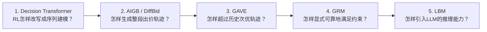

---
tags:
  - 自动出价
  - Generative-RL
  - 论文精读
  - Decision-Transformer
created: 2026-07-28
---

# 自动出价论文精读：五篇递进阅读路线

> 这五篇不是在做五件互不相干的事，而是在依次回答一个越来越难的问题：**如何从历史出价日志中，学习一个既有效、又能上线的自动出价策略？**

## 先建立一张总地图

| 顺序 | 论文 | 读它时只抓住一个问题 | 核心回答 |
|---:|---|---|---|
| 1 | Decision Transformer, ICML 2021 | RL怎样变成序列建模？ | 把 $R_t,s_t,a_t$ 排成 token 序列，用 causal Transformer 预测 $a_t$。 |
| 2 | AIGB / DiffBid, KDD 2024 | 怎样一次生成完整轨迹？ | 用条件扩散模型学习“目标/约束条件下的整段出价轨迹分布”。 |
| 3 | GAVE, SIGIR 2025 | 如何不止模仿旧日志？ | 在 DT 上加入 score-based RTG、受评估的局部探索和 value 引导。 |
| 4 | GRM, KDD 2026 | 怎样保证预算/CPA？ | 不直接学动作，先预测 bid multiplier 对成本、价值、流量的响应，再解析求满足约束的 multiplier。 |
| 5 | LBM, WWW 2026 | LLM怎样参与数值决策？ | Think 负责语言化推理，Act 负责精确连续动作；双模态融合并用离线 Q 值微调。 |

## 开始前必须会的自动出价问题

每次曝光 $i$ 都有预估价值 $v_i$，常见工业形式不是让策略直接给每一次曝光随意出价，而是使用 pacing multiplier：

$$
b_i=\alpha_t v_i
$$

- $v_i$：排序/预估模型输出的 pCVR、GMV 或价值；
- $\alpha_t$：第 $t$ 个时间片的出价系数；
- 自动出价的核心控制变量常常是 $\alpha_t$，而不是从零生成 $b_i$。

典型目标是最大化整个投放周期的价值，同时满足预算和效率约束：

$$
\max \sum_i u_i(b_i)
\quad \text{s.t.}\quad
\sum_i c_i(b_i)\le B,
\qquad \frac{\sum_i c_i(b_i)}{\sum_i u_i(b_i)}\le \tau.
$$

困难在于：未来流量、竞争价格和转化都不确定；转化可能延迟；约束是**全周期约束**，动作却是逐时间片甚至逐曝光做出的。

## 建议的阅读方法

每篇先回答四句话，再看公式：

1. 旧方法输出的是什么，它为什么不够？
2. 本文把学习对象改成了什么？
3. 训练时从日志中学什么，推理时真正执行什么？
4. 它解决了上一层问题的什么部分，又留下了什么问题？

> 笔记中的“论文事实”仅陈述论文明确给出的结构、实验和结论；“理解/推导”是为了帮助面试表达，不应倒过来当作原文实现细节。

## 阅读后的一分钟总述

> DT把离线 RL 改写为“条件化的动作序列预测”；AIGB进一步用扩散模型直接生成整段满足目标的出价轨迹；GAVE发现纯生成仍会受次优历史日志限制，于是用 value 引导的局部探索实现策略提升；GRM换了一个更可控的思路，不直接生成动作而是生成环境响应曲线，再用解析控制器确保预算和 CPA；LBM再将高层语言推理与低层连续动作生成分离，让 LLM 提供对任务状态的解释和方向，而不承担每一步精确数值控制。

