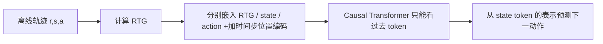

---
tags:
  - 自动出价
  - Offline-RL
  - Decision-Transformer
  - 论文精读
created: 2026-07-28
---

# Decision Transformer：RL怎样改写成序列建模？

论文：[Decision Transformer: Reinforcement Learning via Sequence Modeling](https://arxiv.org/abs/2106.01345)  
会议：ICML 2021

> **一句话总结：** DT 不显式学习 value function 或 policy gradient；它把离线轨迹写成“期望回报—状态—动作”的 token 序列，用带因果 mask 的 Transformer 在给定目标回报和历史时预测下一步动作。
![[Pasted image 20260730172627.png]]

## 对照主图：逐个 token 看 DT 如何产生动作

图底部每组三个圆是同一时刻的 $(R_t,s_t,a_t)$：$R_t$ 是 RTG，$s_t$ 是环境快照，$a_t$ 是日志或已经执行的动作。三者先分别嵌入，颜色不同表示 token type 不同；再加同一时间步的位置/时间编码，告诉模型“这是第 $t$ 个窗口的目标、状态还是动作”。随后它们交错为 $[R_{t-1},s_{t-1},a_{t-1},R_t,s_t,a_t]$，不是简单把字段拼成一个向量。

中间的 causal Transformer 只能向左注意：图中 $s_t$ 的表示能读取 $R_{\le t},s_{\le t},a_{<t}$，不能读取未来的 reward、state 或 action。上方橙色线性 decoder 从 $s_t$ 的隐藏表示预测 $\hat a_t$；图中同时画出 $\hat a_{t-1}$，只是展示同一 decoder 在每个 state 位置重复执行。训练时真实 $a_t$ 是监督标签；推理时将上一步生成动作回填为历史，再滚动预测下一个动作。

因此 DT 的条件句是：**“若从当前状态起还希望达到 $R_t$，并且过去经历过这些状态和动作，现在该做什么？”** RTG 让它能区分同一状态下的冲量与保守策略，但并不创造日志之外的可靠动作证据。
## 1. 带着什么问题读？

**问题：RL 怎样改写成序列建模？**

传统 offline RL 往往在两条路线间选择：

- value-based：先估计 $Q(s,a)$，再选价值大的动作；
- policy-based：直接优化 $\pi(a\mid s)$，但离线数据外的动作可能被错误高估。

DT 的改写是：既然日志天然就是轨迹，为什么不把高质量决策看成一句“动作语言”，直接学习条件分布？

$$
P(a_t\mid R_t,s_{\le t},a_{<t})
$$

这里的 $R_t$ 不是即时 reward，而是 **Return-to-Go（RTG）**：从当前到终点还希望获得多少累计回报。

## 2. 它究竟做了什么？

一条离线轨迹本来是：

$$
(s_1,a_1,r_1),\ldots,(s_T,a_T,r_T).
$$

先计算：

$$
R_t=\sum_{t'=t}^{T}r_{t'}.
$$

再把每个时刻改写成三个 token，并按时间交错排放：

```text
(R1, s1, a1, R2, s2, a2, ..., Rt, st) -> 预测 at
```

模型训练就是普通的动作监督：连续动作用 MSE，离散动作用交叉熵。它不是通过 online rollout 再反传 reward，而是在固定日志上做 teacher forcing。

## 3. 数据怎样流动？



三个 token 类型使用不同嵌入层，但同一时间步共用 time-step embedding。这样模型既知道“这是第几个时间片”，也知道“这是目标、状态还是动作”。因果 mask 保证预测 $a_t$ 时看不到未来 $a_{>t}$ 和未来状态。

## 4. 为什么偏要把 $R,s,a$ 排成 token？为什么预测 $a$？

这里的 $R,s,a$ 不是加密算法 RSA，而是每个决策时刻的三件事：

| 符号 | 全称 | 在自动出价中的直觉 |
|---|---|---|
| $R_t$ | Return-to-Go，未来剩余目标 | 从现在起还希望获得多少累计业务 score / 转化价值。 |
| $s_t$ | State，当前环境状态 | 剩余预算与时间、当前 CPA、近期流量、点击、转化等。 |
| $a_t$ | Action，当前动作 | 当前时间片采用的 bid multiplier，或其调整量。 |

只看当前 $s_t$ 往往不够。例如“预算还剩 70%、时间还剩 30%”看似应该提高出价；但过去几个时间片可能刚主动降价，或历史规律显示晚高峰即将到来。模型需要同时知道：**过去发生了什么、过去采取了什么动作、距离目标还差多少**。交错 token 序列正好提供了这三类因果链条：

```text
还差多少目标(R1) -> 当时处于什么状态(s1) -> 当时怎么做(a1)
                 -> 还差多少目标(R2) -> 新状态(s2) -> 新动作(a2) -> ...
```

Transformer 的 attention 因此可以学习诸如“连续两次提价仍未花出预算”“CPA 已连续恶化”“晚高峰将到且预算尚多”这类跨时间片模式，而不是把历史手工压成几个统计特征。

模型最终预测 $a_t$，因为线上系统需要执行动作。其学习目标可写成：

$$
\hat a_t=f(R_t,s_{\leq t},a_{<t}).
$$

也就是：**在这个剩余目标、当前状态和历史行为条件下，现在应采取什么动作？** 训练日志恰好含有实际执行过的 $a_t$，所以连续动作可直接用 MSE、离散动作可直接用交叉熵监督。

### 为什么必须是 causal Transformer？

预测 $a_t$ 时，真实线上只能观察到过去和当前：

$$
R_{\leq t},\ s_{\leq t},\ a_{<t}.
$$

绝不能看到未来的 $s_{t+1}$、$R_{t+1}$ 或 $a_{t+1}$。causal mask 将注意力限制在 token 左侧，避免训练时“偷看答案”：

```text
R1  s1  a1  R2  s2  a2  R3  s3
                         └── 预测 a3 时，只能读取左侧
```

如果允许双向 attention，离线训练损失会虚假地很好，因为模型能利用未来 reward 或未来动作；上线后这些信息不可获得，表现会崩塌。

### $R_t$ 为什么不是可有可无的？

没有 RTG，模型学的是“历史策略通常在这个状态怎么做”；加入 RTG 后，模型学的是“**若要达到指定目标**，历史中类似状态通常怎样做”。同一状态下，保守 CPA 目标和冲量目标可以对应不同动作。与此同时，RTG 不会凭空创造数据中从未出现过的优质动作；这正是 DT 仍受日志覆盖限制、后续 GAVE 要研究策略提升的原因。

## 5. 推理时怎么用？一个出价例子

假设一天分成 48 个时间片。状态 $s_t$ 包含剩余预算比例、剩余时间比例、当前 CPA、近期曝光/点击/转化等；动作 $a_t$ 是 multiplier 的调整量。

开始时，业务给一个目标总收益或 score，模型输入：

```text
(期望全天目标, 当前状态) -> a1
```

执行 $a_1$ 后，系统获得真实下一状态和即时收益。目标剩余量随已获得收益递减：

$$
R_{t+1}^{\text{target}}=R_t^{\text{target}}-r_t^{\text{observed}}.
$$

再将新状态、上一动作和剩余目标接回上下文，预测 $a_{t+1}$。这就是“像 GPT 逐 token 生成”，但 token 是控制轨迹。

### DT 的闭环仿真评估系统：每一步具体发生什么？

这里的“仿真系统”不是论文额外提出的一套通用 simulator，而是 Atari、D4RL/OpenAI Gym、Key-to-Door 等任务各自提供的环境。DT 在固定离线轨迹上完成训练；测试时才把模型生成的动作交给环境，读取环境返回的下一状态和 reward，形成闭环 rollout。

完整链路是：

~~~text
1. 初始化环境 env，得到 s_1；给定希望达到的 target return R_1
2. 输入最近 K 个时间步的 (R, s, a) token
3. causal Transformer 从当前 state token 预测动作 a_t
4. 执行动作：env.step(a_t)
5. 环境返回 (s_{t+1}, r_t, done)
6. 更新目标剩余回报：R_{t+1}=R_t-r_t
7. 将 (R_{t+1}, s_{t+1}, a_t) 追加到上下文
8. 只保留最近 K 个时间步，继续生成，直到 done
~~~

可以把它看成一个模型与环境之间的循环：

~~~text
DT：根据目标回报、历史状态、历史动作生成 a_t
环境：根据 a_t 计算状态转移并返回 r_t、s_{t+1}
DT：用实际获得的 r_t 修正 RTG，再生成下一步动作
~~~

这里最容易混淆的是“训练”和“仿真评估”：

| 阶段 | 数据/环境 | 是否更新模型 |
| --- | --- | --- |
| 训练 | 固定的离线轨迹数据集 | 更新 DT 参数 |
| 测试 rollout | Atari/Gym/Key-to-Door 环境 | 不更新 DT，只执行动作并统计 episode return |
| 真正 online RL | 环境交互数据持续回流训练 | 原论文没有做 |

因此论文的实验属于“离线训练 + 环境闭环评估”，不是线上 A/B，也不是边运行边训练的 online RL。论文第 5.8 节只是提出 DT 可以作为 online RL 的行为生成器，并未把这一设想作为本文实验完成。

### 与自动出价仿真的对应关系

若将同样的闭环改写到 AuctionNet，映射关系是：

| DT 控制任务 | AuctionNet 自动出价 |
| --- | --- |
| 环境状态 $s_t$ | 当前流量、预算、剩余时间、竞争者和预测价值等 |
| 动作 $a_t$ | bid、bid multiplier 或出价调整量 |
| 环境返回 $r_t$ | 消耗、赢标、转化价值、成本等 |
| 下一状态 $s_{t+1}$ | 更新后的预算、累计收益、竞争和流量状态 |
| episode return | 整个投放周期的目标收益或业务 score |

差别在于：DT 原论文的环境主要是游戏、连续控制和小型稀疏奖励任务；AuctionNet 是广告竞价环境，包含多 agent 竞争、拍卖机制和预算约束。因此二者共享“离线训练—环境 rollout”的接口，但不是同一个仿真器。

### 官方代码链接与范围

- [Decision Transformer 官方代码仓库](https://github.com/kzl/decision-transformer)
- [Atari 实验代码](https://github.com/kzl/decision-transformer/tree/master/atari)
- [OpenAI Gym 实验代码](https://github.com/kzl/decision-transformer/tree/master/gym)

官方仓库 README 明确提供 atari 和 gym 两个实验子目录，主要用于复现论文对应实验；它不是一个像 AuctionNet 那样独立封装广告环境、竞价 agent 和拍卖机制的通用仿真系统。论文中的 Key-to-Door 是用于长程 credit assignment 的自定义任务，阅读时应以论文实验描述为准，不能把官方仓库简单理解成包含完整 Key-to-Door/AuctionNet 仿真器。

## 6. 为什么这个改写有吸引力？

1. **避免显式 Bellman backup。** 不必单独学习 $Q$ 并在数据外最大化它。
2. **天然使用长历史。** Transformer 可以读取过去的状态和动作，而非只依赖马尔可夫的一步状态摘要。
3. **一个模型支持多目标。** 改变推理时给定的 RTG，就能表达不同收益目标。
4. **训练稳定且像监督学习。** 对于已有大量日志的工业系统很自然。

论文在 Atari、Gym 和 Key-to-Door 上报告了可与当时强 offline RL 方法相当或更好的结果。[原论文摘要](https://arxiv.org/abs/2106.01345)

## 7. DT 的关键局限：为什么下一篇需要 AIGB？

DT 预测的是**一步动作**，虽然输入带长历史，但仍是自回归地一步步生成：

$$
a_1\rightarrow a_2\rightarrow\cdots\rightarrow a_T.
$$

这会带来三个问题：

- 早期动作轻微偏差会进入后续上下文，形成误差累积；
- 离线日志中的高 RTG 轨迹未必覆盖真正最优策略，模型仍主要学习行为分布；
- 对预算、CPA 这类全局约束，只有一个 RTG 不一定足以表达“钱该怎样分时花”。

## 8. 原论文 Discussion：作者如何解释 DT 为什么有效？

原论文第 5 节不是泛泛而谈的讨论，而是连续提出 8 个可检验问题：DT 到底是不是“只模仿高分子集”？RTG 条件是否真的被模型理解？长上下文、hindsight return 与 Transformer attention 分别贡献了什么？以及 DT 为什么不像传统 offline RL 那样依赖 value pessimism。下面的结论均对应论文的实验或作者明确的表述。

### 8.1 八个问题的总览

| 原论文问题 | 论文如何验证 | 能得出的结论 |
|---|---|---|
| 5.1 DT 是不是只在高回报子集上做 BC？ | 新建 Percentile BC（%BC）对照：只克隆回报最高的 $X\%$ 数据 | DT 可以在全量数据上训练后，条件化地接近合适的高质量行为子集；不是简单预先挑出固定 top 数据再克隆。 |
| 5.2 DT 是否真的理解 RTG？ | 连续改变推理时指定的 target return | 目标 RTG 与实际获得 return 在所测任务上高度相关；部分任务可超过数据集中最大 return。 |
| 5.3 为什么要长上下文？ | 将 context length 从 $K=30/50$ 消融为 $K=1$ | $K=1$ 明显变差，历史状态、动作和 RTG 对策略识别/训练很有用。 |
| 5.4 能否做长程 credit assignment？ | Key-to-Door：早期拿钥匙、经过无关房间、最终开门才有 reward | 在随机轨迹上，带 hindsight return 的 DT 可学到近最优路径；CQL 在长程 TD 传播上失败。 |
| 5.5 Transformer 能当 critic 吗？ | 让模型额外预测 return token，而非只预测 action | 模型会在关键事件后更新成功回报概率，并将 attention 集中到“拿钥匙/开门”等关键状态。 |
| 5.6 稀疏/延迟 reward 下是否有效？ | D4RL 中把累计 reward 延迟到轨迹末尾才给 | DT 与 %BC 受影响较小，CQL 在该实验中显著退化。 |
| 5.7 为什么不需要 pessimism/behavior regularization？ | 方法机制分析，不是定理证明 | DT 不通过最大化一个近似 $Q$ 函数来改进策略，因而少了一条“利用 value 估计误差”的路径。 |
| 5.8 对 online RL 有何意义？ | 作者提出的未来方向，不是本文已完成的 online 实验 | DT 可作为 behavior generation / memorization engine，与探索算法组合；这是一项潜在用途。 |

### 8.2 5.1：DT 不等于“先选最高分数据，再做行为克隆”

作者构造 **Percentile Behavior Cloning（%BC）**：按照 episode return 排序，只用最高的 $X\%$ 时间步训练 BC。它在两个极端之间插值：

- $X=100\%$：普通 BC，使用全部日志；
- $X\to0$：只克隆最好的少量轨迹。

这个对照不是可直接部署的方法，因为现实中无法在不 rollout 环境的情况下预先知道“哪个 $X$ 最好”；它的作用是理解 DT 的行为。

**先看 Table 3（D4RL，数据相对充足）。** 每行是一种数据集与环境，`10%BC / 25%BC / 40%BC / 100%BC` 表示只拿回报最高的不同百分比时间步训练 BC；加粗是该行最好结果。平均分上，最好的 %BC 为 $56.7$，DT 为 $56.1$，两者接近，但这个“最好的百分比”随环境变化，事先并不知道应该选 $10\%$、$25\%$ 还是其他值。

![[DT Discussion Table 3.png|700]]

**再看 Table 4（Atari，作者使用的是仅 $1\%$ replay 数据）。** 此时 DT 在四个游戏中都优于各个固定比例的 %BC。它表明当数据较少时，硬丢弃其余轨迹会更伤泛化；DT 则能保留全量轨迹，同时通过 RTG 在推理时偏向高回报行为。

![[DT Discussion Table 4.png|700]]

**本节结论。** 在数据足够时，精选后的 BC 可以很强；但固定筛选比例需要环境知识，且小数据下会浪费样本。DT 的价值不是“总比 BC 强”，而是用一个条件模型在全量数据中学习不同质量的行为模式，免去预先物理筛选一个 top 子集。

也因此，RTG 并不表示 DT 能在日志完全没有高质量动作时凭空创造最优策略。

### 8.3 5.2：RTG 是可控条件，不只是一个装饰 token

作者在推理时从低到高扫描 target return，并测量最终真实 episode return。大多数任务中，指定目标与实际回报高度相关；在 Pong、HalfCheetah、Walker 等任务上，两者接近理想对角线。Seaquest 等少数任务中，给出高于日志最大回报的 target，仍能得到更高实际回报，表现出一定外推。

Figure 4 的横轴是推理时喂给 DT 的 target return，纵轴是 rollout 得到的实际 performance。蓝线是 DT，绿色虚线是理想的 Oracle（指定多少目标，实际就达到多少），橙色竖线是日志中最好轨迹的 return。蓝线整体随横轴上升，说明 RTG 确实改变了策略行为；但它并不总贴着绿色线，且在高目标处会饱和或回落，说明模型仍受数据覆盖限制。

![[DT Discussion Figure 4.png|700]]

**本节结论。** RTG 是一个可调的策略条件，而非无效装饰；Seaquest 等个别任务还出现了超过橙线的结果，说明存在一定外推。但这张图不是“目标越大越好”的证明，正确读法是：目标与实际回报在实验范围内通常正相关，超出数据支持范围后并无保证。

### 8.4 5.3：长 context 的价值不是“多看几步”这么简单

Table 5 把原 DT 与“无上下文”的 $K=1$ 对比；原 DT 在 Atari 中使用 $K=30$，Pong 使用 $K=50$。四项任务均下降，Pong 从 $106.1\pm8.1$ 降至 $2.5\pm0.2$，是最醒目的例子。

![[DT Discussion Table 5.png|650]]

**本节结论。** 历史不是可有可无的冗余。论文的解释是：离线数据常混合多种行为策略，context 让 Transformer 判断“当前动作前已经发生了什么、这条轨迹处于何种行为模式”，从而选择更符合指定 RTG 的动作。它并没有证明 context 越长必然越好；这里只验证了从 $K=1$ 到论文使用的长度，长上下文显著有帮助。

### 8.5 5.4：Key-to-Door 怎样检验长程 credit assignment？

**Key-to-Door** 分为三段：先到有钥匙的房间、再经过一个无关房间、最后到门所在房间。只有早期拿到钥匙且最终到门，才获得二值 reward；中间存在长距离无奖励步骤。

Table 6 的指标是成功率。训练数据是随机轨迹，DT 从 1K 条日志达到 $71.8\%$，10K 条达到 $94.6\%$；CQL 分别仅为 $13.1\%$、$13.3\%$。同时 %BC 也达到 $69.9\%$ 与 $95.1\%$，是解读这张表时不能忽略的对照。

![[DT Discussion Table 6.png|650]]

**本节结论。** 这不是“只有 Transformer 神奇地完成 credit assignment”。DT 和只学习成功轨迹的 %BC 都利用了 hindsight 信息：已完成轨迹的 RTG 告诉模型“这段序列最后成功了”。实验支持的是：当日志含成功轨迹时，目标条件化的序列学习能较直接关联早期拿钥匙和很晚才到的开门结果；CQL 的长程 TD 传播在这个设置中失败。

### 8.6 5.5：critic probe 看到了什么？

5.5 将 DT 改造成额外输出 return token 的模型：不再给定第一个 return token，而让模型先预测其初始分布 $p(\hat R_1)$，再观察它如何随轨迹事件更新。这是一个理解表征的 **probe**，不是基础 DT 必需增加的 critic head。

Figure 5 左图显示三类轨迹结果的预测回报概率如何随时间变化：模型在 `key room`、`distractor room`、`door room` 中持续更新判断；右图叠加所有时间步对一条成功轨迹的注意力，红色虚线标出“拿钥匙”和“到门”这两个关键时刻，注意力在其附近集中。

![[DT Discussion Figure 5.png|700]]

**本节结论。** 该 probe 表明 Transformer 的隐表示可以形成状态—回报关联，并在关键事件后调整成功概率；但它只是论文对内部机制的证据，不能等同于“原始 DT 训练时显式学习了一个可供 argmax 的 $Q$ critic”。

### 8.7 5.6：稀疏/延迟 reward 下为什么仍能工作？

作者将 D4RL 任务改成：中间每一步 reward 都为 0，直到最后一步才给整条轨迹的累计 reward。此时 TD 类方法的 Bellman backup 很难把末端信号逐步向前传播；实验中 CQL 明显退化，而 DT 和 %BC 相对稳定。

Table 7 左半部分 `Delayed (Sparse)` 是延迟奖励版本，中间 `Agnostic` 是不使用奖励的 BC/%BC，右半部分 `Original (Dense)` 是原始稠密奖励任务。以 Medium-Replay 为例，DT 从原始的 $82.7$ 变为延迟奖励的 $78.5$，变化较小；CQL 从 $48.6$ 降到 $2.0$。三行数据都体现同一趋势。

![[DT Discussion Table 7.png|700]]

**本节结论。** 原因不是 DT 不需要 reward，而是它训练时直接读取整条已完成轨迹的 RTG，监督目标仍是日志 action，不依赖逐步 Bellman bootstrap 才获得学习信号。BC 本身也对 reward 不敏感，所以这一实验更准确地说明 DT 在该 delayed-return 设定下比 CQL 稳健，而不是证明 DT 普遍胜过所有稀疏奖励方法。

### 8.8 5.7：为什么论文说不需要 value pessimism？

传统 offline RL 的一个风险是：先拟合近似 $Q(s,a)$，再在 action 空间中最大化这个估计。若数据外动作的 $Q$ 有误差，优化过程会专门挑出并放大这些高估错误，因此通常需要 conservative / pessimistic value learning 或行为约束。

DT 不显式学习一个供策略 argmax 的 $Q$ 目标；它以条件 action likelihood 的方式生成动作。论文的说法是一个**合理机制解释（conjecture）**：少了“最大化近似 value 函数”这一步，就少了直接利用 value error 的渠道，因此不依赖同类 pessimism。它不是“DT 没有 distribution shift 风险”的证明：如果 target RTG 或状态处于日志支持范围之外，仍会有 OOD 和覆盖不足问题。

### 8.9 5.8：online RL 是论文展望，不是已验证结果

论文主体研究的是 offline RL。作者只是在 Discussion 中提出：似然式的行为建模可以作为 offline-to-online 的良好初始化，DT 可充当一个记忆/行为生成器，再与 Go-Explore 等探索算法结合，生成并保存多样行为。这一段没有给出线上或在线 RL 实验结果。

因此在汇报中应说：**DT 原论文证明了“离线训练、环境 rollout 评估”；把它用于持续回流、探索和在线更新是作者提出的潜在方向，不是本文的实证贡献。**

### 8.10 把 Discussion 压缩成四个结论

1. **条件化而非硬筛选。** RTG 让一个模型从全量轨迹中选择与目标一致的行为模式，不等于固定 top-$X\%$ BC。
2. **历史与 hindsight 很关键。** 长上下文、完整轨迹 RTG 让模型能关联早期事件和后期结果，尤其适合多阶段和延迟反馈任务。
3. **绕开 Bellman backup 的误差传播。** 直接做条件序列监督，避免用 argmax 反复放大近似 $Q$ 的错误；但并不消除数据覆盖问题。
4. **online 是后续方向。** 原论文没有做生产线上线或 online RL 微调实验，不能把它表述为已经证明的结论。

## 9. 总结

> Decision Transformer 的核心不是“把 Transformer 用在 RL”，而是把 offline RL 改写成条件序列建模。它把轨迹表示为 RTG、状态和动作交错的 token 序列，用 causal Transformer 学习在目标回报条件下的下一步动作。训练时就是离线行为监督，推理时持续把已实现 reward 从目标 RTG 中扣除。它擅长利用长历史和统一多目标，但本质仍受离线行为数据覆盖限制，也没有天然保证预算和 CPA 等硬约束。

## 10. 看完自测

- RTG 是“过去累计收益”还是“未来剩余目标”？为什么？
- 预测 $a_t$ 时为什么不能看到未来 action？
- DT 为什么不是一个显式 $Q$ 学习方法？
- 若日志里没有高质量动作，单纯增大 RTG 能否凭空得到最优策略？为什么不能？
