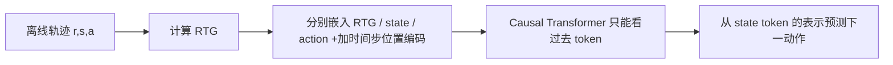

---
tags:
  - 自动出价
  - Offline-RL
  - Decision-Transformer
  - 论文精读
created: 2026-07-28
---

# Decision Transformer：RL怎样改写成序列建模？

论文：[Decision Transformer: Reinforcement Learning via Sequence Modeling](https://arxiv.org/abs/2106.01345)  
会议：ICML 2021

> **一句话总结：** DT 不显式学习 value function 或 policy gradient；它把离线轨迹写成“期望回报—状态—动作”的 token 序列，用带因果 mask 的 Transformer 在给定目标回报和历史时预测下一步动作。

## 1. 带着什么问题读？

**问题：RL 怎样改写成序列建模？**

传统 offline RL 往往在两条路线间选择：

- value-based：先估计 $Q(s,a)$，再选价值大的动作；
- policy-based：直接优化 $\pi(a\mid s)$，但离线数据外的动作可能被错误高估。

DT 的改写是：既然日志天然就是轨迹，为什么不把高质量决策看成一句“动作语言”，直接学习条件分布？

$$
P(a_t\mid R_t,s_{\le t},a_{<t})
$$

这里的 $R_t$ 不是即时 reward，而是 **Return-to-Go（RTG）**：从当前到终点还希望获得多少累计回报。

## 2. 它究竟做了什么？

一条离线轨迹本来是：

$$
(s_1,a_1,r_1),\ldots,(s_T,a_T,r_T).
$$

先计算：

$$
R_t=\sum_{t'=t}^{T}r_{t'}.
$$

再把每个时刻改写成三个 token，并按时间交错排放：

```text
(R1, s1, a1, R2, s2, a2, ..., Rt, st) -> 预测 at
```

模型训练就是普通的动作监督：连续动作用 MSE，离散动作用交叉熵。它不是通过 online rollout 再反传 reward，而是在固定日志上做 teacher forcing。

## 3. 数据怎样流动？



三个 token 类型使用不同嵌入层，但同一时间步共用 time-step embedding。这样模型既知道“这是第几个时间片”，也知道“这是目标、状态还是动作”。因果 mask 保证预测 $a_t$ 时看不到未来 $a_{>t}$ 和未来状态。

## 4. 为什么偏要把 $R,s,a$ 排成 token？为什么预测 $a$？

这里的 $R,s,a$ 不是加密算法 RSA，而是每个决策时刻的三件事：

| 符号 | 全称 | 在自动出价中的直觉 |
|---|---|---|
| $R_t$ | Return-to-Go，未来剩余目标 | 从现在起还希望获得多少累计业务 score / 转化价值。 |
| $s_t$ | State，当前环境状态 | 剩余预算与时间、当前 CPA、近期流量、点击、转化等。 |
| $a_t$ | Action，当前动作 | 当前时间片采用的 bid multiplier，或其调整量。 |

只看当前 $s_t$ 往往不够。例如“预算还剩 70%、时间还剩 30%”看似应该提高出价；但过去几个时间片可能刚主动降价，或历史规律显示晚高峰即将到来。模型需要同时知道：**过去发生了什么、过去采取了什么动作、距离目标还差多少**。交错 token 序列正好提供了这三类因果链条：

```text
还差多少目标(R1) -> 当时处于什么状态(s1) -> 当时怎么做(a1)
                 -> 还差多少目标(R2) -> 新状态(s2) -> 新动作(a2) -> ...
```

Transformer 的 attention 因此可以学习诸如“连续两次提价仍未花出预算”“CPA 已连续恶化”“晚高峰将到且预算尚多”这类跨时间片模式，而不是把历史手工压成几个统计特征。

模型最终预测 $a_t$，因为线上系统需要执行动作。其学习目标可写成：

$$
\hat a_t=f(R_t,s_{\leq t},a_{<t}).
$$

也就是：**在这个剩余目标、当前状态和历史行为条件下，现在应采取什么动作？** 训练日志恰好含有实际执行过的 $a_t$，所以连续动作可直接用 MSE、离散动作可直接用交叉熵监督。

### 为什么必须是 causal Transformer？

预测 $a_t$ 时，真实线上只能观察到过去和当前：

$$
R_{\leq t},\ s_{\leq t},\ a_{<t}.
$$

绝不能看到未来的 $s_{t+1}$、$R_{t+1}$ 或 $a_{t+1}$。causal mask 将注意力限制在 token 左侧，避免训练时“偷看答案”：

```text
R1  s1  a1  R2  s2  a2  R3  s3
                         └── 预测 a3 时，只能读取左侧
```

如果允许双向 attention，离线训练损失会虚假地很好，因为模型能利用未来 reward 或未来动作；上线后这些信息不可获得，表现会崩塌。

### $R_t$ 为什么不是可有可无的？

没有 RTG，模型学的是“历史策略通常在这个状态怎么做”；加入 RTG 后，模型学的是“**若要达到指定目标**，历史中类似状态通常怎样做”。同一状态下，保守 CPA 目标和冲量目标可以对应不同动作。与此同时，RTG 不会凭空创造数据中从未出现过的优质动作；这正是 DT 仍受日志覆盖限制、后续 GAVE 要研究策略提升的原因。

## 5. 推理时怎么用？一个出价例子

假设一天分成 48 个时间片。状态 $s_t$ 包含剩余预算比例、剩余时间比例、当前 CPA、近期曝光/点击/转化等；动作 $a_t$ 是 multiplier 的调整量。

开始时，业务给一个目标总收益或 score，模型输入：

```text
(期望全天目标, 当前状态) -> a1
```

执行 $a_1$ 后，系统获得真实下一状态和即时收益。目标剩余量随已获得收益递减：

$$
R_{t+1}^{\text{target}}=R_t^{\text{target}}-r_t^{\text{observed}}.
$$

再将新状态、上一动作和剩余目标接回上下文，预测 $a_{t+1}$。这就是“像 GPT 逐 token 生成”，但 token 是控制轨迹。

## 6. 为什么这个改写有吸引力？

1. **避免显式 Bellman backup。** 不必单独学习 $Q$ 并在数据外最大化它。
2. **天然使用长历史。** Transformer 可以读取过去的状态和动作，而非只依赖马尔可夫的一步状态摘要。
3. **一个模型支持多目标。** 改变推理时给定的 RTG，就能表达不同收益目标。
4. **训练稳定且像监督学习。** 对于已有大量日志的工业系统很自然。

论文在 Atari、Gym 和 Key-to-Door 上报告了可与当时强 offline RL 方法相当或更好的结果。[原论文摘要](https://arxiv.org/abs/2106.01345)

## 7. DT 的关键局限：为什么下一篇需要 AIGB？

DT 预测的是**一步动作**，虽然输入带长历史，但仍是自回归地一步步生成：

$$
a_1\rightarrow a_2\rightarrow\cdots\rightarrow a_T.
$$

这会带来三个问题：

- 早期动作轻微偏差会进入后续上下文，形成误差累积；
- 离线日志中的高 RTG 轨迹未必覆盖真正最优策略，模型仍主要学习行为分布；
- 对预算、CPA 这类全局约束，只有一个 RTG 不一定足以表达“钱该怎样分时花”。

## 8. 面试话术

> Decision Transformer 的核心不是“把 Transformer 用在 RL”，而是把 offline RL 改写成条件序列建模。它把轨迹表示为 RTG、状态和动作交错的 token 序列，用 causal Transformer 学习在目标回报条件下的下一步动作。训练时就是离线行为监督，推理时持续把已实现 reward 从目标 RTG 中扣除。它擅长利用长历史和统一多目标，但本质仍受离线行为数据覆盖限制，也没有天然保证预算和 CPA 等硬约束。

## 9. 看完自测

- RTG 是“过去累计收益”还是“未来剩余目标”？为什么？
- 预测 $a_t$ 时为什么不能看到未来 action？
- DT 为什么不是一个显式 $Q$ 学习方法？
- 若日志里没有高质量动作，单纯增大 RTG 能否凭空得到最优策略？为什么不能？
