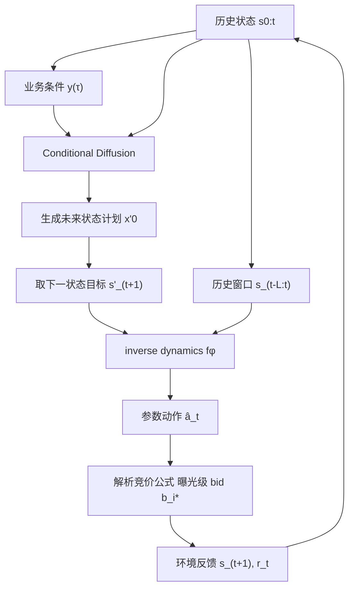

---
tags:
  - 自动出价
  - Diffusion
  - AIGB
  - 论文精读
created: 2026-07-28
---

# AIGB / DiffBid：怎样生成完整出价轨迹？

论文：[AIGB: Generative Auto-bidding via Diffusion Modeling](https://arxiv.org/abs/2405.16141)  
会议：KDD 2024  
原图：Figure 2（Generative Auto-bidding 总体框架）

> **一句话总结：** AIGB / DiffBid 不直接生成每次曝光的 bid，也不是逐时段贪心输出 action；它先在 return、约束和反馈条件下生成一整段未来状态轨迹，再用 inverse dynamics 把计划中的下一状态转成当前 bidding parameters，最后通过解析竞价公式落到每条曝光。

![[Pasted image 20260730172404.png]]

## 1. 全景地图

Figure 2 可以拆成三层：左上是训练时的 **forward diffusion**，把真实状态轨迹逐步加噪；左下是生成时的 **reverse diffusion**，在业务条件 $y(\tau)$ 下从噪声还原出一段未来状态计划；右侧是 **inverse dynamics + bid generation**，把状态计划转成当前时段动作，再按曝光级公式生成 bid。

整条链路可以压缩成：

$$
\underbrace{s_{0:t},y(\tau)}_{\text{历史状态与业务目标}}
\xrightarrow{\text{conditional diffusion}}
\underbrace{x'_0(\tau),s'_{t+1}}_{\text{未来状态计划}}
\xrightarrow{f_\phi}
\underbrace{\hat a_t}_{\text{参数动作}}
\xrightarrow{\text{解析竞价公式}}
\underbrace{b_i^*}_{\text{曝光级 bid}}.
$$

一句话读图：**扩散模型负责规划“接下来状态应该怎样走”，inverse dynamics 负责回答“为了走到下一状态，现在该调什么参数”。**

### 1.1 先明确：AIGB 里的“完整轨迹”是什么？

这里的完整轨迹不是每条曝光的 bid 序列，而是一个 episode 内按时间片展开的状态轨迹：

$$
x_0(\tau)=(s_1,s_2,\ldots,s_T)\in\mathbb R^{T\times d_s}.
$$

如果一天被切成 $T=96$ 个 15 分钟窗口，$x_0$ 就是一张 $96\times d_s$ 的状态表。每一行是一个时间片，每一列是某个状态字段，比如剩余预算、消耗速度、实时 CPC、累计 CPC 等。

因此 AIGB 的“生成完整出价轨迹”更准确地说是：

> 先生成完整未来状态计划，再从状态计划推出每一步的出价参数；它不是一次性为全天所有曝光逐条生成具体 bid。

### 1.2 为什么不直接生成 action？

直接生成动作序列看起来更简单：

$$
(a_t,a_{t+1},\ldots,a_T).
$$

但自动出价里的动作是否好，取决于它导致的预算消耗、CPC/CPA、价值、平滑性等后果。动作本身很难直接表达“投放过程应该长什么样”。AIGB 的选择是先规划状态：

```text
未来预算消耗应逐渐加快；
累计 CPC 应保持在目标内；
晚高峰应预留更多预算；
成本曲线不要剧烈震荡。
```

这些都是状态层面的目标。生成状态轨迹后，再由 inverse dynamics 把状态目标转成当前动作。

### 1.3 一条曝光的 bid 与一个时段的 action 不是一回事

广告主在一个 episode 中面对连续到来的曝光机会 $i=1,\ldots,N$。对第 $i$ 条曝光：

- $v_i$：赢得曝光带来的业务价值；
- $o_i\in\{0,1\}$：是否赢得曝光；
- $c_i$：赢得曝光实际支付的成本；
- $b_i^*$：该条曝光的具体竞价。

最基础的预算约束问题可写为：

$$
\max_{\{o_i\}}\sum_i o_i v_i,
\qquad
\text{s.t.}\quad
\sum_i o_i c_i\le B.
$$

论文还使用统一 ratio 约束形式：

$$
\frac{\sum_i c_{ij}o_i}{\sum_i p_{ij}o_i}\le C_j,
\qquad j=1,\ldots,J.
$$

其中 $p_{ij}$ 是约束分母侧的 performance indicator，$c_{ij}$ 是对应成本项，$C_j$ 是阈值。例如 Target-CPC 可以理解为“累计成本 / 累计点击或有效行为量”不能超过目标。

已有工作给出多约束竞价的解析形式：

$$
b_i^*=\lambda_0v_i+c_i\sum_{j=1}^{J}\lambda_jp_{ij}.
$$

这里有三层粒度：

| 层级 | 对象 | 含义 |
|---|---|---|
| 曝光级 | $b_i^*$ | 每次拍卖实际提交的 bid。 |
| 时段级 | $a_t$ 或 $\lambda_t$ | 当前窗口使用的一组 bidding parameters。 |
| 轨迹级 | $x_0(\tau)$ | 整个 episode 的状态演化表。 |

AIGB 学的是时段级参数动作和轨迹级状态规划，不是直接学习曝光级 bid。曝光级 bid 仍由解析公式结合每条曝光自己的 $v_i,c_i,p_{ij}$ 得到。

### 1.4 Figure 2 的符号表

| 图中对象 | 含义 | 输入 | 输出 | 作用 |
|---|---|---|---|---|
| $s_t$ | 时段 $t$ 的状态向量。 | 环境实时统计。 | 一维向量。 | 描述当前投放局面。 |
| $a_t$ | 时段 $t$ 的参数动作。 | 策略或日志。 | bidding parameters。 | 控制解析公式中的 $\lambda$。 |
| $r_t$ | 时段 reward。 | 环境反馈。 | 业务价值。 | 构造 episode return。 |
| $\tau$ | 一条完整投放 episode。 | $(s_t,a_t,r_t)$ 序列。 | episode 样本。 | 扩散训练的基本单位。 |
| $x_0(\tau)$ | 干净状态轨迹。 | 日志状态序列。 | $T\times d_s$ 矩阵。 | 扩散模型要生成的对象。 |
| $x_k(\tau)$ | 第 $k$ 步带噪状态轨迹。 | $x_0$ 和噪声。 | 同形状矩阵。 | 去噪网络的训练题目。 |
| $x'_K,x'_0$ | 生成阶段噪声起点和生成结果。 | 随机噪声、历史、条件。 | 未来状态计划。 | 撇号表示不是日志事实。 |
| $y(\tau)$ | 条件。 | return、constraints、feedbacks。 | 条件向量/序列。 | 告诉模型想生成怎样的轨迹。 |
| $\epsilon_\theta$ | 噪声预测网络。 | $x_k,y,k$。 | $\hat\epsilon_k$。 | U-Net 去噪模块。 |
| $f_\phi$ | inverse dynamics。 | 历史状态与计划下一状态。 | $\hat a_t$。 | 把状态计划落实成当前动作。 |
| 解析竞价公式 | 解析竞价层。 | $\hat a_t$ 与曝光特征。 | $b_i^*$。 | 生成每次曝光最终 bid。 |

### 1.5 $s_t$ 到底是什么？

论文在问题定义中列出 state 的典型组成：

1. 剩余时间；
2. 剩余预算；
3. 预算消耗速度；
4. 实时 cost-efficiency，例如实时 CPC；
5. 平均 cost-efficiency，例如累计平均 CPC。

Figure 2 的示意表还写有 Left Budget、Cost Speed、Bidding Parameters。应将它理解为状态表的示例列：当前参数水平可以记录为系统状态，而 $a_t$ 是这一时刻对参数做出的调整或参数动作。

因此状态不是一个数字，而是向量：

$$
s_t=
[\text{剩余时间},\text{剩余预算},\text{消耗速度},
\text{实时 CPC},\text{平均 CPC},\ldots].
$$

如果 $T=96$，状态维度为 $d_s$，扩散对象就是：

$$
x_0(\tau)=(s_1,\ldots,s_T)\in\mathbb R^{96\times d_s}.
$$

图里的多根折线可以理解为这张状态表中不同字段随时间变化的轨迹。

### 1.6 用一个例子贯穿全文

假设现在是上午 11 点，一个广告 campaign 的状态是：

```text
剩余预算：60%
当前消耗：偏慢
实时 CPC：偏高
累计平均 CPC：仍在目标内
业务判断：晚高峰流量价值更高
```

广告主希望：

```text
最终 return 高；
CPC 合规；
花费不要剧烈波动；
尽量把更多预算留到晚高峰。
```

AIGB 的处理方式是：

1. 当前状态进入历史 $s_{0:t}$；
2. 高 return、CPC 合规、平滑、晚花偏好进入条件 $y(\tau)$；
3. 扩散模型生成未来状态表，例如中午保持谨慎、下午逐步提高消耗速度、晚高峰加速花费；
4. 取计划中的下一状态 $s'_{t+1}$；
5. inverse dynamics 根据真实历史和 $s'_{t+1}$ 输出当前动作 $\hat a_t$；
6. 解析竞价公式把参数动作转成每条曝光的 bid。

## 2. Conditions $y(\tau)$ 如何形成

Figure 2 左下角的 Return、Constraints、Feedbacks 共同构成条件 $y(\tau)$。它不是模型要预测的标签，而是生成时给模型的“目标说明书”。

### 2.1 Return condition：希望轨迹有多高收益

一条轨迹的总收益为：

$$
R(\tau)=\sum_{t=1}^{T}r_t.
$$

论文将它归一化：

$$
\bar R(\tau)=
\frac{R(\tau)-R_{\min}}{R_{\max}-R_{\min}}
\in[0,1].
$$

训练时，模型学习“什么状态轨迹通常对应什么 return 条件”；生成时，可以设置较高 return condition，让模型倾向于生成高收益轨迹。

更准确地说，扩散模型学习的是条件分布：

$$
p_\theta(x_0(\tau)\mid y(\tau)).
$$

它不是在真实环境里穷举全局最优轨迹，而是在离线日志支持的轨迹分布中，根据条件生成更符合目标的状态计划。

### 2.2 Constraint condition：希望轨迹满足什么约束

以 Target-CPC 为例，最终 ratio 可写为：

$$
x=\frac{\sum_i c_io_i}{\sum_i p_io_i}.
$$

是否满足阈值 $C$：

$$
E=\mathbb I[x\le C].
$$

条件里可以放入归一化 ratio 或是否满足约束的指示变量。这样模型在训练时看到：哪些状态轨迹最后满足约束，哪些不满足；生成时则可以条件化到“约束满足”的区域。

但要注意：这是**软条件控制**。它让模型更倾向于生成历史中与合规条件共现的轨迹，不等同于 GRM 那样通过求根显式保证约束。

### 2.3 Feedback condition：希望轨迹具备什么形状

论文还使用反馈条件控制状态轨迹形状，例如：

- **Smoothness**：相邻时段成本变化不要太剧烈；
- **Early/Late Spend**：控制前半天花费占比，表达早花或晚花偏好。

一个平滑性指标可以理解为：

$$
\mathrm{Smoothness}=\frac{1}{T}\sum_{t=2}^{T}\left|\mathrm{cost}_t-\mathrm{cost}_{t-1}\right|.
$$

Early/Late Spend 可以理解为：

$$
\mathrm{EarlySpendRatio}=\frac{\sum_{t\le T/2}\mathrm{cost}_t}{\sum_{t=1}^{T}\mathrm{cost}_t}.
$$

这些条件的意义是：AIGB 不只追求最终 return，也希望控制投放过程的形状。比如预算不要上午突然花光，也不要到最后才猛冲。

### 2.4 条件控制的边界

Conditions $y(\tau)$ 的作用是引导生成，不是硬约束求解。生成式模型可能出现：

- 设置高 return，但生成轨迹实际不可执行；
- 设置合规条件，但采样结果仍有 CPC 风险；
- 设置晚花偏好，但历史数据中缺少类似高质量晚花轨迹；
- guidance 太强，生成轨迹偏离日志分布。

因此 AIGB 落地时仍需要预算、频控、出价上下界和异常保护。它提供的是计划生成能力，不是完整安全控制器。

## 3. Forward Process 只在训练时使用

Forward Process 从日志中的干净状态轨迹 $x_0(\tau)$ 出发，逐步加入高斯噪声：

$$
q(x_k(\tau)\mid x_{k-1}(\tau))
=
\mathcal N\left(
\sqrt{1-\beta_k}\,x_{k-1}(\tau),
\beta_k I
\right).
$$

其中 $\beta_k$ 是第 $k$ 步加噪强度。随着 $k$ 增大：

$$
x_0\rightarrow x_1\rightarrow\cdots\rightarrow x_K\approx\mathcal N(0,I).
$$

直观上：

```text
x0：真实状态轨迹，能看出预算、CPC、消耗速度等趋势
x1/x2：轻微带噪，但整体形状还在
xk：越来越模糊
xK：接近纯噪声
```

Forward Process 不生成动作、不执行 bid。它只是构造训练样本，让去噪网络学习：给定一个被污染的状态轨迹和业务条件，怎样把它还原成干净轨迹。

### 3.1 为什么扩散对象选状态轨迹，而不是动作轨迹？

状态轨迹更接近业务目标。预算、CPC、平滑性、早花/晚花都是状态和反馈层面的属性。动作轨迹只是导致这些结果的手段。

如果直接生成动作，模型可能生成一组看似合理的 $\lambda$，但不一定导致预算和 CPC 走向理想形状。先生成状态轨迹，相当于先规划“希望环境演化成什么样”，再用 inverse dynamics 找动作。

### 3.2 为什么整段生成能缓解一步误差传播？

逐步模型通常是：

$$
s_t\rightarrow a_t\rightarrow s_{t+1}\rightarrow a_{t+1}.
$$

如果某一步预测偏了，后面的状态和动作都可能被带偏。AIGB 先生成完整状态形状：

$$
p_\theta(s_{t+1:T}\mid s_{0:t},y),
$$

让模型直接看到长周期结构，例如“现在慢一点，晚高峰再加速”。这有助于处理长期预算和稀疏 reward 问题。

## 4. Reverse Process 怎样生成未来状态计划

Reverse Process 学习反向条件分布：

$$
p_\theta(x_{k-1}(\tau)\mid x_k(\tau),y(\tau)).
$$

### 4.1 去噪网络 $\epsilon_\theta$ 做什么？

图中的 Conv 方块表示噪声预测网络 $\epsilon_\theta$。论文实现使用 U-Net。输入是：

$$
(x_k(\tau),y(\tau),k).
$$

输出是当前噪声预测：

$$
\hat\epsilon_k=\epsilon_\theta(x_k(\tau),y(\tau),k).
$$

U-Net 沿时间维度处理整张状态表，因此它能学习跨时间的轨迹形状，比如：

- 预算消耗速度怎样逐步变化；
- CPC 是否先升后降；
- 晚高峰前是否应保留预算；
- 平滑条件下相邻时段成本不能跳变太大。

论文未在图中明确说明条件 $y$ 是通过拼接、FiLM 还是 cross-attention 注入 U-Net，因此不能从图里擅自补成某一种实现。

### 4.2 Classifier-free guidance 怎样起作用？

训练时随机丢弃条件，让同一个网络同时学会：

$$
\epsilon_\theta(x_k,k),
\qquad
\epsilon_\theta(x_k,y,k).
$$

生成时使用 classifier-free guidance：

$$
\hat\epsilon_k
=
\epsilon_\theta(x_k,k)
+
\omega\left[
\epsilon_\theta(x_k,y,k)-\epsilon_\theta(x_k,k)
\right].
$$

可以把它拆成三部分：

- $\epsilon_\theta(x_k,k)$：无条件去噪，表示日志中自然常见的轨迹形状；
- $\epsilon_\theta(x_k,y,k)$：有条件去噪，表示满足 return/constraint/feedback 条件时的轨迹形状；
- 差值项：为了靠近条件目标，需要相对自然轨迹往哪里偏。

$\omega$ 是条件强度。$\omega$ 越大，生成越听条件，但也越可能偏离日志分布。论文实现口径中，condition dropout 为 0.2，guidance scale 为 0.2。

### 4.3 线上怎样从噪声得到 $x'_0$？

服务在时段 $t$ 启动时，从随机噪声开始：

$$
x'_K(\tau)\sim\mathcal N(0,I).
$$

然后把已观测历史 $s_{0:t}$ 固定进轨迹，剩余部分作为待生成未来。每一步反向采样：

$$
x'_{k-1}(\tau)
=
\mu_\theta(x'_k(\tau),y(\tau),k)+\sqrt{\beta_k}z,
\qquad
z\sim\mathcal N(0,I).
$$

重复 $K$ 次后得到：

$$
x'_0(\tau)=
[s_0,\ldots,s_t,s'_{t+1},\ldots,s'_T].
$$

前半段是已经发生的真实历史，后半段是模型生成的未来计划。下一时段真实反馈回来后，系统可以重新把最新历史写入，再滚动生成新的未来计划。

### 4.4 为什么说它是滚动规划，而不是一次生成锁死全天？

AIGB 生成的是从当前时刻到结束的未来状态计划，但线上只取最近的下一状态 $s'_{t+1}$ 去生成当前动作。到 $t+1$ 后，真实环境已经反馈出新的 $s_{t+1}$，模型可以重新规划。

因此它的执行方式更像 receding-horizon planning：

```text
当前历史 → 生成未来计划 → 执行当前一步 → 观察反馈 → 重新生成
```

这比一次性生成全天动作更稳，因为它能吸收最新投放反馈。

## 5. state plan 怎样变成 action，再变成 bid

### 5.1 Inverse dynamics $f_\phi$ 的角色

状态计划 $x'_0$ 只说明“下一状态希望是什么”，例如下一时段希望消耗速度上升、累计 CPC 仍合规。它没有直接告诉系统现在该把 $\lambda$ 调到多少。

所以论文引入非马尔可夫 inverse dynamics：

$$
\hat a_t=f_\phi(s_{t-L:t},s'_{t+1}).
$$

其中：

- $s_{t-L:t}$：最近 $L$ 个真实历史状态；
- $s'_{t+1}$：生成计划中的下一状态目标；
- $\hat a_t$：当前时段的 predicted bidding parameters。

称为非马尔可夫，是因为它不只看当前 $s_t$，还看一段历史。预算消耗趋势、CPC 变化惯性、竞争环境变化等信息未必能由单个当前状态完全表达。

### 5.2 为什么不能直接把 $s'_{t+1}$ 当动作？

$s'_{t+1}$ 是目标状态，不是控制量。它可能包含“下一时段剩余预算应是多少、消耗速度应是多少、平均 CPC 应是多少”。这些量是动作执行后的结果。

动作 $a_t$ 是为了推动系统从当前历史走向 $s'_{t+1}$ 的参数调整。两者关系是：

$$
(s_{t-L:t},a_t)\rightarrow s_{t+1}.
$$

inverse dynamics 学的是反方向：

$$
(s_{t-L:t},s_{t+1})\rightarrow a_t.
$$

### 5.3 参数动作怎样落到单次曝光 bid？

得到 $\hat a_t$ 后，可将其中的 $\hat\lambda_0,\ldots,\hat\lambda_J$ 代入解析竞价公式：

$$
b_i^*=\hat\lambda_0v_i+c_i\sum_{j=1}^{J}\hat\lambda_jp_{ij}.
$$

同一时段内，$\hat\lambda$ 是全局参数；但每条曝光的 $v_i,c_i,p_{ij}$ 不同，因此最终 bid 仍然是曝光级差异化的。

这就是 Figure 2 右侧的完整含义：

```text
生成状态计划
→ 取下一状态目标
→ inverse dynamics 输出时段级参数
→ 解析竞价公式按曝光特征计算具体 bid
```

### 5.4 用前面的例子走一遍右侧链路

假设生成轨迹给出的下一状态目标是：

```text
下一时段消耗速度略升；
累计 CPC 不超过目标；
预算曲线仍保持晚高峰前不过快消耗。
```

inverse dynamics 看到过去 $L$ 个状态中消耗偏慢、CPC 偏高但累计仍合规，于是输出当前参数：

```text
λ0 略上调，用于提高价值项权重；
约束相关 λj 保持或略收紧，避免 CPC 失控。
```

随后对于高价值曝光，$v_i$ 较大，bid 会相对更高；对于低价值或约束风险较高的曝光，解析竞价公式会给出更低 bid。这保留了曝光级细粒度，同时让时段级控制遵循状态计划。

## 6. 训练时两个模块怎样更新

AIGB 的训练可以拆成两个监督任务：状态轨迹去噪和 inverse dynamics 动作回归。

总损失写为：

$$
\mathcal L(\theta,\phi)
=
\underbrace{
\mathbb E_{k,\tau\sim\mathcal D}
\left\|\epsilon-
\epsilon_\theta(x_k(\tau),y(\tau),k)
\right\|^2
}_{\mathcal L_{\text{diffusion}}}
+
\underbrace{
\mathbb E_{(s_{t-L:t},a_t,s'_{t+1})\sim\mathcal D}
\left\|a_t-f_\phi(s_{t-L:t},s'_{t+1})\right\|^2
}_{\mathcal L_{\text{ID}}}.
$$

### 6.1 去噪 loss 更新 $\theta$

训练步骤是：

1. 从日志采样一条 episode $\tau$；
2. 取干净状态轨迹 $x_0(\tau)$；
3. 根据 return、constraint、feedback 构造 $y(\tau)$；
4. 随机采样扩散步 $k$；
5. 给 $x_0$ 加噪得到 $x_k$；
6. 让 $\epsilon_\theta$ 预测真实噪声 $\epsilon$；
7. 用均方误差更新 $\theta$。

这项 loss 学到的是条件状态轨迹分布，不直接监督某条曝光 bid，也不通过真实拍卖环境反传。

### 6.2 动作 loss 更新 $\phi$

inverse dynamics 的训练样本来自日志中的状态转移和动作：

$$
(s_{t-L:t},s_{t+1})\rightarrow a_t.
$$

训练时用真实下一状态作为目标：

$$
\hat a_t=f_\phi(s_{t-L:t},s_{t+1}),
\qquad
\mathcal L_{\text{ID}}=\|a_t-\hat a_t\|^2.
$$

服务时则把真实 $s_{t+1}$ 换成生成的 $s'_{t+1}$。这就是“计划状态 → 当前动作”的桥。

### 6.3 两个 loss 的关系

两项 loss 可以联合优化，但它们承担的角色不同：

| Loss | 更新对象 | 学到什么 |
|---|---|---|
| $\mathcal L_{\text{diffusion}}$ | $\epsilon_\theta$ | 在条件下生成合理状态轨迹。 |
| $\mathcal L_{\text{ID}}$ | $f_\phi$ | 为了达到下一状态，当前应采取什么参数动作。 |

扩散模型本身不输出 $a_t$；inverse dynamics 本身不规划长期轨迹。二者合起来才形成“先规划、再执行”的层级结构。

## 7. 一次训练和一次服务完整走完

### 7.1 一次训练

```text
离线 episode τ
→ 提取状态轨迹 x0(τ)
→ 计算 return / constraint / feedback 条件 y(τ)
→ 随机采样扩散步 k
→ 加噪得到 xk(τ)
→ εθ 预测噪声，更新 diffusion
→ 取历史状态、真实下一状态和动作
→ fφ 回归动作，更新 inverse dynamics
```

训练过程中模型没有在线探索，也没有把生成轨迹送入真实环境试错。它完全依赖离线日志和监督目标。

### 7.2 一次线上服务

```text
读取当前历史 s0:t
→ 设置 y(τ)：高 return、约束合规、平滑/早晚花偏好
→ 从随机噪声 x'K 开始
→ 反向去噪 K 步，生成 x'0
→ 取计划下一状态 s't+1
→ fφ 输出当前参数动作 ât
→ 解析竞价公式对每条曝光生成 b_i^*
→ 环境反馈新状态
→ 下一时段重新规划
```

用 Mermaid 画成：



### 7.3 为什么服务时只取 $s'_{t+1}$？

虽然扩散模型生成了整段未来 $s'_{t+1:T}$，但当前只能执行一个时段的动作。如果把整段未来动作全部锁死，就无法吸收下一时段真实反馈。

只取 $s'_{t+1}$ 的好处是：

- 保留长周期规划信息；
- 当前动作只追随最近一步目标；
- 下一时段可以重新规划，降低预测误差累积。

## 8. 与其他方法的关系

### 8.1 与逐步 MDP policy 的区别

传统逐步 policy 是：

$$
s_t\rightarrow a_t.
$$

AIGB 是：

$$
p_\theta(s_{t+1:T}\mid s_{0:t},y)
\quad + \quad
f_\phi(s_{t-L:t},s'_{t+1})
\rightarrow a_t.
$$

也就是说，它不是只看当前状态做一步反应，而是先生成未来过程的整体形状。

### 8.2 与 Decision Transformer 的区别

Decision Transformer 通常把 RTG、state、action 交错建模，然后预测下一动作：

$$
(R_1,s_1,a_1,\ldots,R_t,s_t)\rightarrow a_t.
$$

AIGB 没有直接输出下一动作，而是将高 return、约束和反馈写入条件，生成状态轨迹。它更像“trajectory planner”，不是单纯的 sequence policy。

### 8.3 与 GAVE 的关系

GAVE 继承 DT backbone，并在日志动作附近做 value-guided exploration，试图超过历史次优动作。AIGB 的探索则体现在生成整段状态计划：它不围绕单步动作做局部扰动，而是让模型从条件分布中采样符合目标的未来状态形状。

二者都属于生成式自动出价，但侧重点不同：

| 方法 | 生成对象 | 核心问题 |
|---|---|---|
| AIGB / DiffBid | 未来状态轨迹。 | 怎样生成完整出价过程的状态计划。 |
| GAVE | 当前动作及探索动作。 | 怎样在日志附近探索并超过次优轨迹。 |

### 8.4 与 GRM 的关系

GRM 显式预测 multiplier 到未来 cost/value 的响应曲线，再用求根满足预算和 CPA。AIGB 用条件扩散生成状态轨迹，条件中包含约束满足与反馈偏好。

差别是：

- AIGB 的约束更多是生成条件，是软控制；
- GRM 的约束进入解析 controller，是显式方程；
- AIGB 强在整段状态形状生成；
- GRM 强在约束可解释和求根稳定。

因此 AIGB 不能替代 GRM 的硬约束控制，GRM 也不直接提供 AIGB 这种整段轨迹生成能力。

## 9. 实验、效率与边界

### 9.1 论文实验说明了什么？

文档已有记录中，论文将一天划分为 96 个 15 分钟时段。在不同预算和数据规模的离线实验中，DiffBid 表现最好；线上 A/B 相比 IQL 报告：

- GMV $+2.81\%$；
- ROI $+3.36\%$；
- 成本 $-0.53\%$。

这些结果支持：在论文设定下，条件扩散生成状态轨迹 + inverse dynamics 的结构能带来收益。

### 9.2 消融实验应怎样理解？

已有记录中，USCBEx-5K 的结果包括：

```text
完整 DiffBid：2280.12
去条件：1812.64
去非马尔可夫 inverse dynamics：2254.78
```

可解释为：

- 去条件大幅下降，说明 return/constraint/feedback 条件对生成高质量轨迹很关键；
- 去非马尔可夫 inverse dynamics 也下降，说明只看当前状态或弱化历史窗口会损失动作可执行性；
- 完整模型收益来自“条件轨迹生成”和“历史依赖执行器”的组合。

### 9.3 推理效率怎么看？

扩散模型的推理复杂度随扩散步数 $K$ 线性增长：

$$
\text{Cost}_{\text{sampling}}=O(K\cdot \text{U-Net forward}).
$$

文档已有记录中，论文搜索 $K\in\{5,10,20,30,50\}$，并报告 GPU 下 DiffBid 约 0.2 秒/请求，IQL 约 0.07 秒/请求。

因此 AIGB 的代价是推理比单步 policy 更重。它适合时段级决策，不适合每条曝光都跑一次扩散采样。曝光级仍由解析竞价公式 快速执行。

### 9.4 最大局限

AIGB 的限制主要有五类：

1. **条件是软控制**：不能替代预算、CPC、频控等硬规则；
2. **日志覆盖依赖强**：高 return 且合规的轨迹如果很少，生成质量会受限；
3. **条件外推风险**：设置训练中少见的条件组合，可能生成不可靠轨迹；
4. **inverse dynamics 可能失效**：竞价机制或流量环境变化后，状态到动作的反推关系要重新评估；
5. **推理成本较高**：扩散采样需要多步去噪，必须控制 $K$ 和服务延迟。

### 9.5 迁移到其他业务时要重新定义什么？

如果迁移到打车券额、补贴策略、价格策略，不能照搬变量。至少要重新定义：

- 状态 $s_t$：例如供需、等待时长、补贴消耗、转化率；
- 动作 $a_t$：例如券额、折扣、补贴系数；
- 约束：例如预算、ROI、用户体验、司机供给；
- 执行公式：广告里是解析竞价公式，其他业务未必有同样解析竞价层；
- feedback condition：例如平滑消耗、早晚高峰倾斜、区域公平性。

AIGB 可借鉴的是“先生成过程状态，再反推动作”的范式，而不是具体出价公式。

## 10. 最终 takeaway

理解 AIGB 的关键是区分四个对象：

$$
\text{状态 }s_t
\neq
\text{参数动作 }a_t
\neq
\text{单曝光出价 }b_i^*
\neq
\text{整段状态轨迹 }x_0(\tau).
$$

DiffBid 的核心不是“扩散模型直接给每条曝光出价”，而是：

> 先在 return、约束和反馈条件下生成未来状态的整体形状，再由历史依赖的 inverse dynamics 将计划中的下一状态转为当前参数动作，最后通过解析竞价公式执行到每一次曝光。

它的价值在于把自动出价从单步反应提升到长周期轨迹规划；它的边界在于条件仍是软控制、生成质量依赖日志覆盖，最终线上仍需要硬约束和安全控制兜底。
