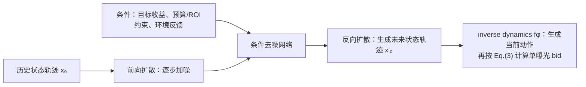

---
tags:
  - 自动出价
  - Diffusion
  - AIGB
  - 论文精读
created: 2026-07-28
---

# AIGB / DiffBid：怎样生成完整出价轨迹？

论文：[AIGB: Generative Auto-bidding via Conditional Diffusion Modeling](https://arxiv.org/abs/2405.16141)  
会议：KDD 2024

> **一句话总结：** AIGB 将自动出价从逐步 MDP 决策改写为条件轨迹生成；其 DiffBid 在收益目标、约束和反馈条件下，用扩散模型生成整段**状态轨迹**，再通过非马尔可夫 inverse dynamics 产生当前 bidding-parameter action，并按解析 bid 公式处理单次曝光。

![[Pasted image 20260730172404.png]]

## 按 Figure 2 的符号走完 AIGB 全流程，逐一解释图中的模块、箭头与变量

先不要把图理解为“扩散模型直接生成一串 bid”。这张图表达的是一个**两层生成—执行链路**：先生成一整段未来的**状态轨迹**，再根据“历史状态 + 预测的下一状态”反推出此刻该如何调 bidding parameter，最后按 Eq.(3) 为每一次曝光计算 bid。

$$
\text{目标/约束/反馈 + 已知历史状态}
\xrightarrow{\text{conditional diffusion}}
\text{未来状态轨迹}
\xrightarrow{f_\phi}
\hat a_t\;(\text{bidding parameters})
\xrightarrow{\text{Eq.(3)}} b_i^*.
$$

读图时尤其要分清两条“时间轴”：每个小折线图内部从 $T=1$ 到 $T=T$ 的横轴是**真实投放时间片**；而 $x_0,x_1,\ldots,x_K$ 的下标 $k$ 是**扩散的噪声步**，不是一天里的第 $k$ 个业务时刻。图上方从右向左的箭头是训练用的加噪过程；下方从左向右的箭头是线上生成时的去噪过程。

### 1. 先认清每一类对象：图里到底在生成什么？

| 图中符号 | 论文中的准确含义 | 在这张图里的位置与作用 |
|---|---|---|
| $\tau$ | 一次完整广告投放 episode 的索引。 | 例如某广告主一天 48 个时间片的一次投放过程；不是单次曝光。 |
| $s_t$ | 时刻 $t$ 的广告环境状态向量。 | 论文举例包括剩余时间、剩余预算、预算消耗速度、实时 CPC、平均 CPC；小图里多条线只是示意状态不同维度随时间如何变化。 |
| $x_0(\tau)$ | 原始、干净的**状态轨迹**，$x_0(\tau)=(s_1,\ldots,s_T)$。 | 图最右上。它来自历史投放日志，是训练时的真实样本。这里不是 action/bid trajectory。 |
| $x_k(\tau)$ | 对整段状态轨迹加到第 $k$ 步噪声后的版本。 | 图上方中间的一系列小图；每个小图仍有 $T$ 个业务时间片，只是状态数值越来越被噪声破坏。 |
| $x_K(\tau)$ | 加噪足够多次后的状态轨迹，近似标准高斯噪声。 | 图左上；训练时由 $x_0$ 得到，生成时则从这样的随机噪声开始。 |
| $x'_K(\tau),x'_0(\tau)$ | 生成阶段使用撇号标记的轨迹。 | $x'_K$ 是采样的噪声起点；$x'_0$ 是去噪得到的未来状态计划。撇号强调它不是日志中已经发生的事实轨迹。 |
| $y(\tau)$ | 条件向量/条件序列。 | 图左下，经 Conv 和 Linear 后持续送入反向去噪网络，规定“希望生成什么样的状态轨迹”。 |
| $q$ | 固定的前向扩散分布。 | 图上方，$q(x_k(\tau)\mid x_{k-1}(\tau))$；它只负责逐步加高斯噪声，不是需要学习的策略。 |
| $\epsilon_\theta$ | 参数为 $\theta$ 的噪声预测器。 | 图中蓝色 Conv 网络；输入带噪轨迹、条件和扩散步，输出“该去掉什么噪声”。 |
| $p_\theta$ | 学得的条件反向分布。 | 图下方，$p_\theta(x_{k-1}(\tau)\mid x_k(\tau),y(\tau))$；用 $\epsilon_\theta$ 指导从 $x_k$ 抽样出更干净的 $x_{k-1}$。 |
| $f_\phi$ | 非马尔可夫 inverse dynamics。 | 图右侧中间；根据历史状态窗口和预期下一状态，输出当前要调的 bidding parameters。 |
| $\hat a_t$ | 时刻 $t$ 预测出的动作，即各个 bidding parameter 的调整量/取值。 | 它不是单曝光价格；其维度对应 Eq.(3) 中的 $\lambda$ 参数。 |
| $b_i^*$ | 第 $i$ 次曝光真正送进拍卖的 bid。 | 图最右上；由 $\hat a_t$ 代入 Eq.(3)，结合该曝光的 value、约束相关预测量计算。 |

**图中小折线图怎么看？** 它们画的是一个高维状态矩阵的少数维度示意：横向仍是 $T=1,\ldots,T$ 的投放窗口，纵向折线可理解为剩余预算、成本速度、bidding parameters 等状态维度。真实输入是 $T\times d_s$ 的二维数组，而不是图上几根线；第一个维度是时间片，第二个维度是状态特征。

### 2. 图左侧 Conditions：$y(\tau)$ 不是标签，而是“要生成怎样未来”的说明书

左下的 `Return / Constraints / Feedbacks` 与状态序列共同构成条件。图中的 Conv 负责从有顺序的状态序列中抽取时序上下文，Linear 将这些条件投到可与去噪网络融合的表示空间，形成 $y(\tau)$。

- **Return**：一条日志轨迹的总收益 $R(\tau)=\sum_t r_t$；论文将它做 min-max 归一化后作为条件。生成最大收益轨迹时设 $R=1$。
- **Constraints**：例如目标 CPC 是否满足。它不只让模型“多赚”，还告诉模型生成的轨迹要符合成本约束。
- **Feedbacks**：论文示例包括花费曲线平滑性、预算希望早花还是晚花；它们将业务偏好变成条件，而不是事后再靠规则硬修。

实际运行到时刻 $t$ 时，未来 $s_{t+1:T}$ 本来未知。论文会从 $x'_K(\tau)\sim\mathcal N(0,I)$ 开始，并把已经观察到的历史状态 $s_{0:t}$ 放入轨迹中；模型在给定 $y(\tau)$ 后补全未来状态。因此它不是拿到未来信息再预测，而是用已知历史、目标和约束去生成未来状态的合理走向。

可以把它想成：上午 11 点剩余预算 60%，当前花费偏慢，广告主希望全天 CPC 不超 10 元且晚间大促多花一些。这里“剩余预算、花费速度、当前 CPC”进入状态历史；“CPC≤10、晚花偏好、目标收益”进入 $y(\tau)$。模型此时生成的不是“下一次曝光 bid=8.3”，而是后续各时间片预算、消耗速度、参数水平应怎样演进的一条状态计划。

### 3. 图上方 Forward Process：$x_0(\tau)\rightarrow x_K(\tau)$，只在训练时用来制造去噪题目

从图最右的干净日志状态轨迹 $x_0(\tau)$ 出发，按噪声日程向左逐步加高斯噪声：

$$
q(x_k(\tau)\mid x_{k-1}(\tau))=
\mathcal N\bigl(\sqrt{1-\beta_k}\,x_{k-1}(\tau),\beta_k I\bigr).
$$

$\beta_k$ 是第 $k$ 步加入的噪声强度，论文使用 cosine schedule，使噪声平滑增加。于是 $x_1$ 还大体看得出预算和消耗趋势，$x_{K-1}$ 已经很模糊，$x_K$ 接近纯高斯噪声。图上方灰色箭头朝左，正是这个“真实状态轨迹逐渐被破坏”的方向。

这一段**不是线上决策**：它没有策略网络，也不产出 bid。它的唯一用途是让训练集提供不同噪声难度的样本，让模型学会“即使只看到模糊的状态轨迹，也能在条件约束下把它恢复回来”。

### 4. 图下方 Reverse Process：$x'_K(\tau)\rightarrow x'_0(\tau)$，条件去噪如何生成未来状态

图下方是前向过程的反方向。蓝色的 Conv 堆叠就是 $\epsilon_\theta$：它沿投放时间维度处理整段带噪状态，输入为当前 $x'_k(\tau)$、扩散步 $k$ 和条件 $y(\tau)$，输出对其中噪声的预测。由此参数化反向分布：

$$
p_\theta\bigl(x_{k-1}(\tau)\mid x_k(\tau),y(\tau)\bigr).
$$

这里每一轮不是直接“猜一个新状态”，而是先估计当前轨迹中哪些部分像噪声，再按 DDPM 的反向采样公式得到更干净的 $x'_{k-1}$。重复 $K$ 次后，左端随机的 $x'_K$ 会变成右端有目标、有约束的 $x'_0$。因为网络每次看的是**整段**状态序列，它能同时看到“上午花得慢”和“晚高峰需要预算”的关系，而不只是单步从 $s_t$ 预测 $s_{t+1}$。

论文还使用 classifier-free guidance：训练时随机丢弃条件，因而同一噪声网络既学无条件预测，也学有条件预测；生成时将两者线性组合，以更偏向符合 $y(\tau)$ 的高似然轨迹。图中并没有画两套独立的 Conv，它们是同一个参数化网络在有/无条件输入下的两种使用方式。

### 5. 图右侧 Bid Generation：为什么还需要 $f_\phi$ 和 Eq.(3)？

走到图右下 $x'_0(\tau)$ 后，DiffBid 得到了状态计划。真正在线上要执行的却是“调哪几个 bidding parameter”，因此论文将**生成状态**与**产生动作**拆开：

$$
\hat a_t=f_\phi(s_{t-L:t},s'_{t+1}).
$$

其中 $s_{t-L:t}$ 是刚刚已经观察到的历史状态窗口，$s'_{t+1}$ 是生成轨迹给出的下一状态目标；$f_\phi$ 回答的是：“如果我想从现在这段历史走到这个预期下一状态，此刻该把出价参数调成什么？” 这就是图中从 $x'_0(\tau)$ 向上经过 $f_\phi$ 得到 $\hat a_t$ 的箭头。

最后，$\hat a_t$ 中的 $λ$ 参数被放进 Eq.(3)，与当前第 $i$ 次曝光的 value $v_i$、约束相关的预测量 $p_{ij}$ 等共同计算 $b_i^*$。所以同一个时间片的 $\hat a_t$ 是一个**策略参数向量**，而 $b_i^*$ 才是随每次曝光特征变化的具体竞价。

继续上面的例子：模型可能生成“下一时间片要更快消耗预算、但 CPC 仍要稳住”的 $s'_{t+1}$；$f_\phi$ 因此给出较积极但受 CPC 参数约束的 $\hat a_t$。随后面对一条高价值曝光和一条低价值曝光，Eq.(3) 会基于各自 $v_i,p_{ij}$ 输出不同的 $b_i^*$；这比把一个固定价格直接广播给全部曝光更合理。

### 6. 把整张 Figure 2 串成一次训练与一次线上执行

**训练时**，从日志取真实状态轨迹 $x_0(\tau)$ 和相应条件 $y(\tau)$；随机选扩散步 $k$，由 $q$ 加噪得到 $x_k(\tau)$；$\epsilon_\theta$ 预测噪声并用 MSE 学习恢复方向。同时用日志中的历史状态、真实动作和下一状态监督 $f_\phi$，让它学会实现状态转移所需的参数动作。

**线上时刻 $t$**，将已发生状态 $s_{0:t}$、目标收益、CPC/预算约束和广告主反馈整理为条件；从 $x'_K\sim\mathcal N(0,I)$ 开始，将历史状态固定/放入其中；按 $p_\theta$ 连续去噪得到未来状态轨迹 $x'_0$；取其中的 $s'_{t+1}$，用 $f_\phi(s_{t-L:t},s'_{t+1})$ 得到 $\hat a_t$，再通过 Eq.(3) 对到来的每个曝光计算 $b_i^*$。执行后环境反馈更新状态，下一时间片再滚动一次这个过程。

因此，AIGB 的“整段生成”指的是它在一个联合对象上生成未来**状态轨迹**、避免纯自回归单步状态预测的误差累计；并不意味着线上只生成一次就把全天动作锁死，也不意味着扩散模型直接输出每条曝光的 bid。

## 深入补充（一）：状态规划、去噪网络与 inverse dynamics

### 7. 为什么 DiffBid 生成的是 state trajectory？

论文真正的层级分解是：

$$
\underbrace{p_\theta(s_{t+1:T}\mid s_{0:t},y)}_{\text{DiffBid：状态规划}}
\quad+\quad
\underbrace{f_\phi(s_{t-L:t},s'_{t+1})}_{\text{inverse dynamics：当前动作}}
\quad\Longrightarrow\quad
\hat a_t.
$$

论文观察到，某时间片成本可近似写成 $c_t=n_t\bar c$：$n_t$ 是赢得的曝光数，$\bar c$ 是相对稳定的平均曝光成本。于是“每个时间片要赢多少曝光、预算如何消耗、CPC 如何变化”可以先作为一条状态演化来规划；而动作只是实现这个状态转移的控制量。

例如一天分 96 个 15 分钟时间片，状态可包含剩余时间、剩余预算、消耗速度、实时 CPC、平均 CPC。$x_0(\tau)$ 就是一张 $96\times d_s$ 状态表。若条件是“高收益、CPC 合规、下午多花”，DiffBid 先生成后续预算和消耗速度应怎样变化；看到下一状态要求“消耗速度提高但 CPC 稳住”，$f_\phi$ 才输出当前应采取的 $\hat a_t$。它不是直接生成 96 个 multiplier。

### 8. U-Net/Conv 在 Figure 2 中做什么？

论文拟合的是条件状态分布：

$$
\max_\theta\ \mathbb E_{\tau\sim\mathcal D}
\left[\log p_\theta\bigl(x_0(\tau)\mid y(\tau)\bigr)\right].
$$

实现采用 U-Net，隐藏维度为 128、256；Figure 2 中的 Conv 方块表示它沿时间维度处理整段带噪状态。前向过程 $q$ 只按 cosine noise schedule 加噪；反向网络读取 $(x_k,y,k)$，预测噪声 $\epsilon_\theta$，逐步恢复状态表。

论文没有公开条件 $y$ 在 U-Net 内部是通过拼接、FiLM 还是 cross-attention 注入，因此不能把图上的连线说成某一种确定的融合算子。可确认的是，它作为 $p_\theta(x_{k-1}\mid x_k,y)$ 的条件输入，在反向去噪中反复发挥作用。

### 9. classifier-free guidance：为什么既训练有条件预测又训练无条件预测？

训练时以一定概率丢弃条件 $y$，让同一网络同时学习：

$$
\epsilon_\theta(x_k,k)
\quad\text{与}\quad
\epsilon_\theta(x_k,y,k).
$$

生成时使用两者的组合：

$$
\hat\epsilon_k
=\epsilon_\theta(x_k,k)
+\omega\left[
\epsilon_\theta(x_k,y,k)-\epsilon_\theta(x_k,k)
\right].
$$

无条件项表达“日志中常见的状态轨迹”，差值表达“为了符合 return/CPC/反馈，状态应该往哪里修正”。$\omega$ 越大，条件约束越强，但越可能偏离自然的数据分布。论文实现中报告 guidance scale $\omega=0.2$，condition dropout ratio 为 0.2。

例如下午流量价值高是日志的常见规律，无条件项会保留这个形状；若条件要求早花，条件修正项会让预算消耗速度更早抬升。它不是凭空创造策略，而是在“像日志”的前提下偏向满足条件的轨迹。

### 10. 反向采样与两个训练损失

每一步先根据 $\hat\epsilon_k$ 构造反向高斯分布，再从 $x'_k$ 采样得到更干净的 $x'_{k-1}$：

$$
x'_{k-1}\sim
\mathcal N\left(
\mu_\theta(x'_k,y,k),\,
\Sigma_\theta(x'_k,k)
\right).
$$

常见均值参数化是：

$$
\mu_\theta=
\frac{1}{\sqrt{\alpha_k}}
\left(
x'_k-\frac{\beta_k}{\sqrt{1-\bar\alpha_k}}\hat\epsilon_k
\right),\qquad
\alpha_k=1-\beta_k,\quad
\bar\alpha_k=\prod_{i=1}^{k}\alpha_i.
$$

训练目标也分成两项：

$$
\mathcal L(\theta,\phi)
=
\underbrace{\mathbb E\|
\epsilon-\epsilon_\theta(x_k,y,k)
\|^2}_{\text{状态去噪}}
+
\underbrace{\mathbb E\|
a_t-f_\phi(s_{t-L:t},s'_{t+1})
\|^2}_{\text{inverse dynamics 动作回归}}.
$$

第一项只训练 U-Net 识别并清除加到状态表上的噪声；第二项训练 $f_\phi$ 学会“若想从当前历史走向给定下一状态，参数动作应是什么”。这正是 AIGB 不同于直接 diffusion policy 的地方。

## 深入补充（二）：条件如何构造、理论说了什么、实验说明了什么

### 11. $y(\tau)$ 如何把业务目标变成模型条件？

论文将不同业务要求编码后拼成条件向量。它们不是每一步的 reward，也不是解析约束求解器，而是描述“一条轨迹属于哪一类目标/偏好”的标签。

| 条件 | 论文构造 | 例子 |
|---|---|---|
| Return | $R(\tau)=\sum_t r_t$ 后做 min-max 归一化到 $[0,1]$。推理时生成最大收益目标可设 $R=1$。 | 希望获得尽量高的总转化价值。 |
| CPC/其他 ratio constraint | 用最终 ratio $x=\frac{\sum_i c_i o_i}{\sum_i p_i o_i}$ 是否不超过阈值 $C$ 构造合规指标，也可同时输入归一化 ratio。 | 生成符合目标 CPC 的投放轨迹。 |
| 平滑性 feedback | 由相邻时间片花费变化的统计量构造高/低平滑类别。 | 避免上午突然大幅加速、下午又断崖式降速。 |
| 早花/晚花 feedback | 由前半天花费占全天花费的比例构造类别。 | 大促在上午时要求更多预算提前消耗。 |

例如“最大化价值、CPC 合规、花费更平滑”可对应高 return、合规约束标签、低波动 feedback 的组合。模型据此生成与该组合共现的状态轨迹分布。必须区分：AIGB 的条件控制是**软生成控制**，并不像 GRM 那样每次显式解出一个约束根，所以不能把它表述为硬可行性保证。

### 12. 非马尔可夫理论主张应怎样理解？

论文并未证明 DiffBid 必然找到真实广告系统的全局最优策略。它在“真实马尔可夫转移已知、示范轨迹的条件状态分布可得”等前提下，构造一个 reward 依赖完整历史 $s_{0:t}$ 的非马尔可夫决策问题，并证明最大似然拟合状态序列分布与该构造问题具有相同最优策略。

直觉是：标准 MDP 假设只要 $(s_t,a_t)$ 就足够预测下一状态；论文认为广告中的剩余预算、竞争环境、过往消耗形状等历史影响不容易完全压进一个当前状态。DiffBid 显式建模整个 $s_{1:T}$，因此不必强行依赖严格的一步马尔可夫压缩。这是论文假设下的建模等价性，而非对任意线上分布漂移的最优性承诺。

### 13. 复杂度、消融和线上证据

- 生成的复杂度随扩散步数 $K$ 线性增长。论文给出的推理复杂度为 $\mathcal O(KL(T_1+T_2))$，其中 $L$ 是轨迹/历史长度，$T_1,T_2$ 分别对应去噪网络和 inverse dynamics 的计算成本。论文搜索 $K\in\{5,10,20,30,50\}$，发现大预算下通常 30 步内已经达到最好或接近最好效果，小预算更敏感。
- 模拟环境将一天切为 96 个 15 分钟时间片，离线日志来自 USCB 及加入随机探索的 USCBEx，规模为 5K 或 50K trajectories。表 1 中 DiffBid 在论文列出的各预算、数据组合里取得最高累计 reward。
- 消融中，完整 DiffBid 在 USCBEx-5K 为 2280.12；去掉条件降至 1812.64，去掉非马尔可夫 inverse dynamics 降至 2254.78。条件控制贡献最明显，历史窗口的 inverse dynamics 也有稳定收益。
- 线上 A/B 在 2024-02-01 至 2024-02-08 与 IQL 比较：Buycnt +2.09%、GMV +2.81%、ROI +3.36%，成本 -0.53%。论文报告 GPU 下 DiffBid 约 0.2 秒/请求，IQL 基线约 0.07 秒/请求。

因此，论文最准确的价值是：先用扩散学习高质量未来**状态**怎样演化，再由单独的历史依赖 action model 实现当前转移。其局限也对应地来自离线覆盖、条件外推、Q/约束并非硬保证，以及多步采样的时延。

## 1. 带着什么问题读？

**问题：怎样生成完整出价轨迹？**

DT 虽然能读取整段历史，但输出仍是下一个动作。AIGB 认为长周期投放的难点恰恰是：预算和 ROI/CPA 是跨整个周期的；如果每一步都只局部决定，前面的偏差会影响后面。

它把目标从：

$$
\pi(a_t\mid s_t)
$$

换成：

$$
p(\tau\mid \text{target return},\text{constraints},\text{feedback}),
$$

其中 $\tau$ 是包含状态、动作和奖励的一次完整 episode；DiffBid 实际扩散的对象是其中的状态序列 $x_0(\tau)=(s_1,\ldots,s_T)$，动作由后续 inverse dynamics 生成。

## 2. AIGB 做了什么？

论文提出 **AI-Generated Bidding（AIGB）** 范式，具体模型叫 **DiffBid**。它用扩散模型学习“在什么条件下，一段好的未来状态轨迹长什么样”，再将该状态计划转换成当前出价参数动作。

训练阶段：将真实**状态轨迹**逐步加高斯噪声；模型学习在给定条件时预测噪声、还原状态轨迹，并训练 inverse dynamics 从状态转移回归动作。

推理阶段：从随机噪声开始，多轮反向去噪，得到一整段满足条件的未来状态序列；取预测的下一状态，再生成当前动作。



## 3. 先把扩散模型讲明白：它到底在“扩散”什么？

扩散模型最初常用于生成图片。把一张真实图片记为 $x_0$，训练时不断加入少量高斯噪声：

$$
x_0\rightarrow x_1\rightarrow\cdots\rightarrow x_K\approx\mathcal N(0,I).
$$

经过足够多步后，原图会接近纯随机噪声。模型学习反向过程：给定带噪样本 $x_k$、当前噪声步 $k$ 和条件 $c$，预测其中噪声或直接还原更干净的 $x_{k-1}$。生成时则从随机噪声开始，一步步去噪，最后得到新样本：

```text
训练：真实样本 -> 逐步加噪 -> 学习如何去噪
生成：随机噪声 -> 多轮去噪 -> 得到新样本
```

在 DiffBid 中，$x_0$ 不是一张图，而是整段状态轨迹：

$$
x_0(\tau)=(s_1,s_2,\ldots,s_T).
$$

例如将一天切为 6 个时间片，$x_0$ 的每行可包含剩余预算、消耗速度、实时 CPC、平均 CPC 等状态。扩散模型学习的是如何把“被噪声破坏的一整张状态时间表”逐步恢复成合理状态计划；它不直接生成单次曝光的价值预估或 multiplier 序列。

### 什么叫条件扩散？

若只学习 $p(x_0)$，模型只能生成历史里最常见的状态演化形状。AIGB 让模型学习：

$$
p_\theta(x_0(\tau)\mid y(\tau)),
$$

其中 $c$ 包含论文中的 return conditions、constraints 与 feedback 等条件。直觉上：目标冲量且预算宽松时，模型应生成更积极的轨迹；ROI/CPA 严格或已经超支时，应生成更保守的后半段轨迹。条件使同一个生成器能面向不同广告主目标生成不同计划。

## 4. “逐步 MDP 决策改写为条件轨迹生成”是什么意思？

传统 MDP policy 的局部决策形式是：

$$
s_t\xrightarrow{\pi}a_t\xrightarrow{\text{environment}}s_{t+1}\xrightarrow{\pi}a_{t+1}.
$$

即每一个时间片只根据当前状态决定当前动作。上午一次过于激进的出价会改变预算状态，再影响下午所有决策；长周期中这种误差会沿着状态链逐步传播。

AIGB 先直接学习：

$$
(\text{目标},\text{约束},\text{反馈})
\longrightarrow
(s_1,s_2,\ldots,s_T),
$$

它不是只问“现在应该加价还是降价”，而是问“在今天的预算、ROI/CPA 目标与环境下，全天各时间片的状态组合应该长什么样”。例如若晚高峰价值更高，合理计划是前半天保留更多预算、后半天提高消耗速度；inverse dynamics 再把下一状态目标变为当前动作。

```text
早上：0.7, 0.7, 0.8     # 保留预算
下午：0.9, 1.0
晚上：1.3, 1.4, 1.3     # 高价值窗口更积极
```

这种跨时间片的取舍就是整轨迹建模想保留的东西。它不代表线上只生成一次后永不更新：环境变化后仍可基于新反馈重新条件化、生成或调整后续计划；差别在于模型的**规划对象**从单步状态预测提升为整段状态轨迹。

## 5. 为什么扩散比一步步生成更适合这里？

直觉上，全天 48 个时间片的状态计划不是“先预测第 1 格，再预测第 2 格”的独立问题。它们要共同满足：

- 上午少花一点，晚高峰可能能多花；
- 前面 CPA 偏高，后面必须留出修正空间；
- 总预算不能超；
- 不同时间片动作之间应平滑。

扩散模型将整条状态轨迹作为一个对象去建模，因此能直接表达远距离时间片之间的相关性。论文的表述是：直接建模 return 与整条 trajectory 的关系，以避免长 horizon 自回归中的误差传播。[论文摘要](https://arxiv.org/abs/2405.16141)

注意：这不代表系统一次生成后就永远不改。工业环境会变化，因此实际执行仍可在收到新反馈后重新条件化、再生成或修正后续轨迹；论文强调的是**生成目标是整段轨迹**，而非纯一步 policy。

## 6. 它是不是直接找“最优轨迹”？不是

严格说，DiffBid 不是穷举全部轨迹并求数学意义上的全局最优：

$$
\arg\max_{\tau}\ \text{true future return}(\tau).
$$

它从离线数据中学习的是条件状态轨迹分布 $p_{\text{data}}(x_0(\tau)\mid y(\tau))$。推理时给定较高目标与约束，模型从噪声中生成一条：

> 与条件匹配、并且落在历史有效轨迹分布附近的候选状态计划。

因此更准确的说法不是“整段去找最好的模型”，而是“整段去生成高质量、目标条件匹配的**状态轨迹**，再生成当前动作”。它是否真的接近最优，取决于日志是否覆盖高质量策略、条件是否充分、以及推理是否外推到数据分布之外。后续 GAVE 正是在追问：怎样可靠地超越历史次优轨迹？

## 7. 条件到底承担什么作用？

没有条件的生成模型只会学“日志中常见的出价形状”。条件让同一模型可以回答不同问题：

```text
给定较高收益目标 + 宽松预算 -> 可以生成更积极的轨迹
给定严格 ROI 约束             -> 应生成更保守、效率更高的轨迹
给定当前环境反馈变化          -> 后半段轨迹应做相应调整
```

这也是 AIGB 相比单一 RL policy 的重要价值：目标和约束可作为生成条件，而非为每种广告主目标单独训练一个策略。

## 8. 与 DT 的关系和差异

| 维度 | DT | AIGB / DiffBid |
|---|---|---|
| 生成对象 | 下一步 action | 整段状态 trajectory，再由 inverse dynamics 产生 action |
| 生成方式 | 自回归 causal Transformer | 条件扩散去噪 |
| 长程一致性 | 通过历史上下文间接获得 | 直接在状态轨迹层建模 |
| 典型风险 | 自回归误差、次优行为模仿 | 多步采样成本、条件外推风险 |

不要把“扩散生成整段轨迹”误解成“线上不需要反馈控制”：广告环境是非平稳的，反馈仍然很重要。它解决的是生成建模层面如何避免只盯当前一步。

## 9. 论文证据与应当谨慎的地方

论文报告真实数据实验与阿里广告平台线上 A/B：GMV 提升 2.81%，ROI 提升 3.36%。这些是论文摘要公开声明的结果。[AIGB论文](https://arxiv.org/abs/2405.16141)

阅读实验时重点看：

- `w/o cond`：验证条件信息是否真的让轨迹可控；
- `w/o non-mkv`：验证非马尔可夫/整轨迹建模是否有效；
- 不同训练数据规模：生成模型是否真正从更多离线轨迹获益。

局限也很直接：扩散推理有多轮去噪，线上延迟是工程挑战；生成轨迹若远离日志分布，也可能不可靠。于是下一篇 GAVE 追问：**能否有方向地、安全地探索到比日志更好的动作？**
