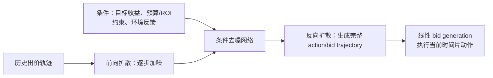

---
tags:
  - 自动出价
  - Diffusion
  - AIGB
  - 论文精读
created: 2026-07-28
---

# AIGB / DiffBid：怎样生成完整出价轨迹？

论文：[AIGB: Generative Auto-bidding via Conditional Diffusion Modeling](https://arxiv.org/abs/2405.16141)  
会议：KDD 2024

> **一句话总结：** AIGB 将自动出价从逐步 MDP 决策改写为条件轨迹生成；其 DiffBid 使用条件扩散模型，在给定收益目标、约束和环境反馈时，直接去噪生成整段 bid/action trajectory。

## 1. 带着什么问题读？

**问题：怎样生成完整出价轨迹？**

DT 虽然能读取整段历史，但输出仍是下一个动作。AIGB 认为长周期投放的难点恰恰是：预算和 ROI/CPA 是跨整个周期的；如果每一步都只局部决定，前面的偏差会影响后面。

它把目标从：

$$
\pi(a_t\mid s_t)
$$

换成：

$$
p(\tau\mid \text{target return},\text{constraints},\text{feedback}),
$$

其中 $\tau$ 是整个周期的动作/出价轨迹。

## 2. AIGB 做了什么？

论文提出 **AI-Generated Bidding（AIGB）** 范式，具体模型叫 **DiffBid**。它用扩散模型学习“在什么条件下，一段好的出价轨迹长什么样”。

训练阶段：将真实轨迹逐步加高斯噪声；模型学习在给定条件时，从带噪轨迹预测噪声或还原轨迹。

推理阶段：从随机噪声开始，多轮反向去噪，得到一整段满足条件的动作序列。



## 3. 先把扩散模型讲明白：它到底在“扩散”什么？

扩散模型最初常用于生成图片。把一张真实图片记为 $x_0$，训练时不断加入少量高斯噪声：

$$
x_0\rightarrow x_1\rightarrow\cdots\rightarrow x_K\approx\mathcal N(0,I).
$$

经过足够多步后，原图会接近纯随机噪声。模型学习反向过程：给定带噪样本 $x_k$、当前噪声步 $k$ 和条件 $c$，预测其中噪声或直接还原更干净的 $x_{k-1}$。生成时则从随机噪声开始，一步步去噪，最后得到新样本：

```text
训练：真实样本 -> 逐步加噪 -> 学习如何去噪
生成：随机噪声 -> 多轮去噪 -> 得到新样本
```

在 DiffBid 中，$x_0$ 不是一张图，而是整段动作轨迹：

$$
\tau_a=(a_1,a_2,\ldots,a_T).
$$

例如将一天切为 6 个时间片，$\tau_a=[0.8,0.9,1.1,1.3,1.2,0.9]$ 可以表示 6 段时间内采用的 bid multiplier。扩散模型学习的是如何把“被噪声破坏的一整条 multiplier 序列”逐步恢复成一条合理序列；它不在扩散模型参数，也不在生成单次曝光的价值预估模型。

### 什么叫条件扩散？

若只学习 $p(\tau_a)$，模型只能生成历史里最常见的出价形状。AIGB 让模型学习：

$$
p_\theta(\tau_a\mid c),
$$

其中 $c$ 包含论文中的 return conditions、constraints 与 feedback 等条件。直觉上：目标冲量且预算宽松时，模型应生成更积极的轨迹；ROI/CPA 严格或已经超支时，应生成更保守的后半段轨迹。条件使同一个生成器能面向不同广告主目标生成不同计划。

## 4. “逐步 MDP 决策改写为条件轨迹生成”是什么意思？

传统 MDP policy 的局部决策形式是：

$$
s_t\xrightarrow{\pi}a_t\xrightarrow{\text{environment}}s_{t+1}\xrightarrow{\pi}a_{t+1}.
$$

即每一个时间片只根据当前状态决定当前动作。上午一次过于激进的出价会改变预算状态，再影响下午所有决策；长周期中这种误差会沿着状态链逐步传播。

AIGB 改为直接学习：

$$
(\text{目标},\text{约束},\text{反馈})
\longrightarrow
(a_1,a_2,\ldots,a_T).
$$

它不是只问“现在应该加价还是降价”，而是问“在今天的预算、ROI/CPA 目标与环境下，全天各时间片的动作组合应该长什么样”。例如若晚高峰价值更高，合理轨迹可以是：

```text
早上：0.7, 0.7, 0.8     # 保留预算
下午：0.9, 1.0
晚上：1.3, 1.4, 1.3     # 高价值窗口更积极
```

这种跨时间片的取舍就是整轨迹建模想保留的东西。它不代表线上只生成一次后永不更新：环境变化后仍可基于新反馈重新条件化、生成或调整后续计划；差别在于模型的**规划对象**从单步动作提升为整段轨迹。

## 5. 为什么扩散比一步步生成更适合这里？

直觉上，全天 48 个时间片的出价计划不是“先决定第 1 格，再决定第 2 格”的独立问题。它们要共同满足：

- 上午少花一点，晚高峰可能能多花；
- 前面 CPA 偏高，后面必须留出修正空间；
- 总预算不能超；
- 不同时间片动作之间应平滑。

扩散模型将整条轨迹作为一个对象去建模，因此能直接表达远距离时间片之间的相关性。论文的表述是：直接建模 return 与整条 trajectory 的关系，以避免长 horizon 自回归中的误差传播。[论文摘要](https://arxiv.org/abs/2405.16141)

注意：这不代表系统一次生成后就永远不改。工业环境会变化，因此实际执行仍可在收到新反馈后重新条件化、再生成或修正后续轨迹；论文强调的是**生成目标是整段轨迹**，而非纯一步 policy。

## 6. 它是不是直接找“最优轨迹”？不是

严格说，DiffBid 不是穷举全部轨迹并求数学意义上的全局最优：

$$
\arg\max_{\tau_a}\ \text{true future return}(\tau_a).
$$

它从离线数据中学习的是条件轨迹分布 $p_{\text{data}}(\tau_a\mid c)$。推理时给定较高目标与约束，模型从噪声中生成一条：

> 与条件匹配、并且落在历史有效轨迹分布附近的候选出价计划。

因此更准确的说法不是“整段去找最好的模型”，而是“整段去生成高质量、目标条件匹配的**动作轨迹**”。它是否真的接近最优，取决于日志是否覆盖高质量策略、条件是否充分、以及推理是否外推到数据分布之外。后续 GAVE 正是在追问：怎样可靠地超越历史次优轨迹？

## 7. 条件到底承担什么作用？

没有条件的生成模型只会学“日志中常见的出价形状”。条件让同一模型可以回答不同问题：

```text
给定较高收益目标 + 宽松预算 -> 可以生成更积极的轨迹
给定严格 ROI 约束             -> 应生成更保守、效率更高的轨迹
给定当前环境反馈变化          -> 后半段轨迹应做相应调整
```

这也是 AIGB 相比单一 RL policy 的重要价值：目标和约束可作为生成条件，而非为每种广告主目标单独训练一个策略。

## 8. 与 DT 的关系和差异

| 维度 | DT | AIGB / DiffBid |
|---|---|---|
| 生成对象 | 下一步 action | 整段 action/bid trajectory |
| 生成方式 | 自回归 causal Transformer | 条件扩散去噪 |
| 长程一致性 | 通过历史上下文间接获得 | 直接在轨迹层建模 |
| 典型风险 | 自回归误差、次优行为模仿 | 多步采样成本、条件外推风险 |

不要把“扩散生成整段轨迹”误解成“线上不需要反馈控制”：广告环境是非平稳的，反馈仍然很重要。它解决的是生成建模层面如何避免只盯当前一步。

## 9. 论文证据与应当谨慎的地方

论文报告真实数据实验与阿里广告平台线上 A/B：GMV 提升 2.81%，ROI 提升 3.36%。这些是论文摘要公开声明的结果。[AIGB论文](https://arxiv.org/abs/2405.16141)

阅读实验时重点看：

- `w/o cond`：验证条件信息是否真的让轨迹可控；
- `w/o non-mkv`：验证非马尔可夫/整轨迹建模是否有效；
- 不同训练数据规模：生成模型是否真正从更多离线轨迹获益。

局限也很直接：扩散推理有多轮去噪，线上延迟是工程挑战；生成轨迹若远离日志分布，也可能不可靠。于是下一篇 GAVE 追问：**能否有方向地、安全地探索到比日志更好的动作？**

## 10. 面试话术

> AIGB 的核心变化是把自动出价从逐步 MDP policy learning 改写为条件轨迹生成。DiffBid 将整段出价动作看成一个样本，通过扩散模型学习在收益目标、约束和反馈条件下的轨迹分布。这样模型能够在生成时同时考虑远距离时间片间的预算和收益耦合，减少纯自回归动作预测的误差累积。它不是取消反馈控制，而是把“规划对象”提升为整段轨迹。
