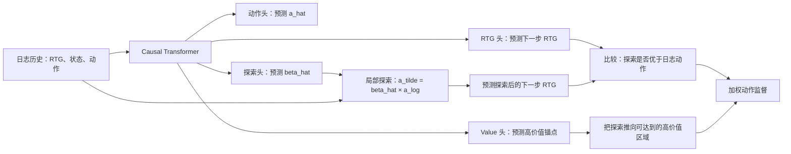

---
tags:
  - 自动出价
  - Offline-RL
  - GAVE
  - Decision-Transformer
  - 论文精读
created: 2026-07-28
---

# GAVE：怎样超过历史次优轨迹？

论文：[Generative Auto-Bidding with Value-Guided Explorations](https://arxiv.org/abs/2504.14587)  
PDF：[作者公开版本](https://personal.ntu.edu.sg/boan/papers/SIGIR25_autobidding.pdf)  
代码：[Applied-Machine-Learning-Lab/GAVE](https://github.com/Applied-Machine-Learning-Lab/GAVE)  
会议：SIGIR 2025

> **一句话总结：** GAVE 以 Decision Transformer 为序列 backbone，但不止模仿历史动作。它先把广告主目标写成 score-based RTG，再在日志动作附近构造受限探索，用预测的 RTG 判断探索是否值得学习，并用高 expectile 的 value 估计为探索提供“朝更高价值处走”的方向。

下面的第一部分先把论文 Figure 1 当作全景地图；之后再按上述因果链把问题、基线和模块逐层展开。

![[Pasted image 20260730151405.png]]

## 第一部分：先用 Figure 1 建立全景

这张图分为四块：上方 **(a)** 是一个时间步内的 GAVE 网络；左下 **(b)** 是训练时怎样从日志取样并计算损失；右下 **(c)** 是论文在竞价模拟器中的离线评估。图中 $\hat{\ }$ 表示模型预测， $\tilde{\ }$ 表示由日志动作局部扰动出来的“探索量”，没有符号的 $r_t,s_t,a_t$ 是日志或环境中真实观察到的量。

### 1. 最下方的输入 token：$r_t,s_t,a_t$

图中蓝、绿、黄三个圆分别是：

- $r_t$（蓝）：时刻 $t$ 的 RTG，即从现在到投放结束希望/能够取得的剩余业务回报；GAVE 由兼顾价值和 CPA 的 score 构造它；
- $s_t$（绿）：时刻 $t$ 的状态，例如剩余预算、当前 CPA、剩余时间、流量和成本速度、历史出价统计；
- $a_t$（黄）：日志策略在该窗口实际使用的动作，即 bid coefficient $\lambda_t$。

一段样本按时间交错排列为：

$$
(r_{t-M},s_{t-M},a_{t-M},\ldots,r_t,s_t,a_t).
$$

每个 token 先经各自的 embedding（图中彩色小矩形）并加位置编码，再送进 causal Transformer。因果掩码使当前位置只看得到左侧历史，不能偷看未来窗口。

#### 真实业务里很多状态字段，$s_t$ 怎样输入模型？

$s_t$ 不是把“预算、CPA、流量、城市、活动类型”等字段逐个当作一长串 Transformer token。更常见、也是 GAVE 公开实现采用的形式是：**先把同一决策窗口内已经可知的字段整理为一个状态向量，再将这个向量映射为一个 state token。**

例如以 30 分钟为一个投放窗口，可以构造：

$$
s_t=[
\text{剩余预算比例},\ \text{已花预算比例},\ \text{当前 CPA/目标 CPA},\ \text{剩余时间比例},\ \text{当前流量预测},\ \text{近期成本速度},\ \text{近期转化速度},\ \text{近期平均出价系数},\ldots]
\in\mathbb R^{d_s}.
$$

论文实验中的 state dimension 是 16，因此一个 batch 的状态张量可写成：

$$
\text{states}\in\mathbb R^{B\times L\times16},
$$

其中 $B$ 是 batch size，$L$ 是历史窗口长度。也就是说，**每个时间步是一个 16 维快照；Transformer 建模的是这些快照随时间的变化。**

公开参考实现先对数值状态做均值方差归一化，再用线性层将整个状态向量投影到 hidden size：

$$
e_t^s=W_s\,\mathrm{Norm}(s_t)+b_s.
$$

随后将时间 embedding 与 $e_t^s$ 拼接、再映射为最终 state token；最终才与 $r_t$、$a_t$ 的 token 交错为 $[r_1,s_1,a_1,\ldots,r_t,s_t,a_t]$。因此，图中的绿色 $s_t$ 圆圈并不只代表一个原始字段，而是“当前窗口所有状态信息融合后的向量”。

若落到更复杂的真实营销系统，字段通常按类型预处理：

| 字段类型 | 典型例子 | 进入 $s_t$ 前的处理 |
|---|---|---|
| 连续数值 | 预算、花费、曝光、转化、CPA、速度、比例 | 截断异常值、缺失填充、log / 标准化后拼接。 |
| 离散类别 | 城市、行业、广告主类型、活动类型 | 每个字段先查 embedding，再与连续特征拼接或经小 MLP 融合。 |
| 历史统计 | 近 1/3/6 个窗口的成本、转化、平均出价 | 可作为当前 $s_t$ 的摘要字段；原始窗口快照仍由 Transformer 在序列维度建模。 |

构造 $s_t$ 时最重要的是**无信息泄漏**：只能使用决策时刻 $t$ 已知的信息。例如当前预算、已发生成本和可提前获得的流量预测可以使用；$t+1$ 窗口结束后才知道的真实转化、实际成本不能提前放入 $s_t$。

### 2. 上半部分 (a)：同一个 Transformer 如何得到四类输出？

Transformer 产生每个 token 位置的隐藏表示，之后接不同线性 decoder（图中的灰/黄/蓝矩形）。图中采用 DT 常见的“错位预测”：

| 图中输出 | 从哪个时间点的历史表示读出 | 表示什么 | 后续用途 |
|---|---|---|---|
| $\hat a_t$ | 看到 $r_t,s_t$ 后 | 对当前出价系数的预测 | 正常动作头；线上最终使用的核心动作。 |
| $\hat V_{t+1}$ | 看到 $r_t,s_t$ 后 | 下一步可达到的高价值 RTG 锚点 | 用 expectile loss 学习，指导探索方向。 |
| $\hat\beta_t$ | 训练时看到日志动作 $a_t$ 后 | 对日志动作做局部缩放的倍率 | 与 $a_t$ 相乘，构造探索动作。 |
| $\hat r_{t+1}$ | 给定到 $a_t$ 为止的历史后 | 若采取日志动作时，对下一步 RTG 的预测 | 与探索动作的 RTG 预测比较。 |

这里有一个容易混淆的点：图中 $\hat\beta_t$ 不是直接替代线上 bid 的“另一个动作”。它服务于训练期的局部探索。因为训练日志里已知 $a_t$，模型可以围绕这个被数据支持的动作尝试小幅偏移；而线上真正转成出价系数的主要是动作头 $\hat a_t$。

### 3. 图右上 (a.1)：为什么有 $S_1,S_2,S_3$ 和 score-based RTG？

右上角先定义业务 score。例如：

$$
S_1=\sum_i x_iv_i,
\qquad
S_2=\min\left\{\left(\frac{C}{\mathrm{CPA}}\right)^2,1\right\}\sum_i x_iv_i,
$$

$$
S_3=\min\left\{\left(\frac{C}{\mathrm{CPA}}\right)^5,1\right\}\sum_i x_iv_i.
$$

$x_i$ 表示是否赢得曝光，$v_i$ 是该曝光的价值，$C$ 是目标 CPA。$S_1$ 只看价值；$S_2,S_3$ 在 CPA 超目标时施加不同强度的惩罚。论文用它们说明：RTG 应来自和业务评估一致的 score，而不是机械地只累计转化。选定某个 score 后，整段轨迹的未来 score 被转换为每个时刻的 $r_t$ token。

只把转化或累计价值当 reward 会有一个直接问题：模型可能通过激进抬价买到更多转化，却明显突破 CPA 目标。举例来说，若目标 CPA 为 100：

| 轨迹 | 累计价值 | CPA | $S_2$（$\gamma=2$） |
|---|---:|---:|---:|
| A：稳健 | 120 | 100 | 120 |
| B：猛冲 | 150 | 150 | $150\times(100/150)^2\approx66.7$ |

因此 B 虽有更多裸价值，却不是更好的业务轨迹。论文将每个时刻的 score 写为 $S_t$，并用：

$$
r_t=S_T-S_{t-1}
$$

构造 RTG。这样 $r_t$ 表示从当前时刻起，在 CPA 目标下还可能贡献多少有效业务价值；训练中“高 RTG”的含义便与评估时的高 score 对齐。这是目标对齐，不是保证每一时刻 CPA 都绝不越界的硬约束。

### 4. 图橙色虚线框 (a.2)：$a_t\rightarrow\hat\beta_t\rightarrow\tilde a_t$

GAVE 用：

$$
\hat\beta_t=\mathrm{Sigmoid}(\mathrm{FC}_\beta(\cdot))+0.5,
\qquad
\tilde a_t=\hat\beta_t a_t.
$$

因此 $\hat\beta_t\in(0.5,1.5)$。假设日志动作 $a_t=1.0$，模型输出 $\hat\beta_t=1.12$，探索动作就是 $\tilde a_t=1.12$：它只比旧策略积极一点，而不是跳到数据中几乎没见过的 2.5。图中上一时刻也画出 $a_{t-1}\rightarrow\hat\beta_{t-1}\rightarrow\tilde a_{t-1}$，说明每个时间步都可按同样方式构造局部候选动作。

### 5. 图左下 (b.1)：比较 $\tilde r_{t+1}$ 与 $\hat r_{t+1}$，生成权重 $w_t$

训练时拿同一段历史喂两次模型：一次接真实日志动作 $a_t$，得到 $\hat r_{t+1}$；一次把末尾动作换成探索动作 $\tilde a_t$，得到 $\tilde r_{t+1}$。二者的差经 sigmoid 变成：

$$
w_t=\mathrm{Sigmoid}\big(\alpha_r(\tilde r_{t+1}-\hat r_{t+1})\big).
$$

> **参数标注：** $\alpha_r$ 是人为设定的超参数，用于控制 sigmoid 对 RTG 差异的敏感程度，并非模型预测的量，也不同于总损失中的 $\alpha_1,\ldots,\alpha_4$。论文正文给出其作用但未单列具体数值；作者公开参考实现使用 $\alpha_r=100$（代码为 `sigmoid(100 * (curr_score_preds_1 - curr_score_preds))`）。因为实现里的 score / RTG 已缩放、两者差值通常较小，需用较大系数才能拉开权重；换到未缩放或量纲不同的业务数据时，不能机械沿用 100，应在验证集或模拟环境中调参。

若 $\tilde r_{t+1}>\hat r_{t+1}$，则 $w_t$ 偏大，说明模型认为这次局部上调更值得学习；反之，$w_t$ 偏小，动作头仍主要遵循日志动作。这个权重不是硬阈值，而是平滑地在“模仿原动作”和“向探索动作靠近”之间切换。

这个比较最终通过动作损失落实到动作头：

$$
L_a=\frac1N\sum_t\left[(1-w_t')(\hat a_t-a_t)^2+w_t'(\hat a_t-\tilde a_t')^2\right].
$$

上标 $'$ 表示 stop-gradient。也就是说，$L_a$ 只训练动作头在“靠近日志动作”和“靠近探索动作”之间做平滑选择，而不能让模型通过改动权重 $w_t$ 或探索标签 $\tilde a_t$ 来投机降低损失。这里的 exploration 也不是线上随机试价：训练期是在固定日志上构造局部动作扰动，线上部署仍需 A/B、限幅、预算和 CPA 护栏。

### 6. 图中 (a.3) 与左下 (b.2)：$\hat V_{t+1}$ 为什么要出现？

先把这一块和上一节的 $w_t$ 区分开：$w_t$ 只做**两两比较**，它回答“探索动作相对日志动作是否更好”；$\hat V_{t+1}$ 则提供一个**绝对的高价值参照**，它回答“当前这类状态下，日志里较好的未来 RTG 大致应在什么水平”。

### 6.1 只有 $w_t$ 时，问题在哪里？

假设当前状态是“预算还很充足、CPA 也未超标”。原动作 $a_t=1.00$，探索动作 $\tilde a_t=1.12$。模型预测：

$$
\hat r_{t+1}=0.300,\qquad \tilde r_{t+1}=0.304.
$$

因为 $0.304>0.300$，$w_t$ 会偏向探索动作，于是动作头会被鼓励从 1.00 向 1.12 靠近。这件事本身没有错，但它只说明：**在模型自己的预测里，1.12 比 1.00 好一点。**

离线学习的风险是，1.12 不是日志真实执行过的动作，$0.304$ 也不是观测到的真实反事实回报，而是模型预测。若模型在数据很少覆盖的区域产生偶然偏高的估计，比如把 1.35 错估成 0.315，单靠“谁更大”就可能不断把动作推向更远的 OOD 区域。这里的 OOD 可以简单理解为：**训练日志几乎没有相似动作和相似状态，模型没有足够事实依据却在外推。**

所以，$w_t$ 像“1.12 比 1.00 高不高”的局部裁判；它不能单独保证“这个改动是否朝一个可信的好区域走”。

### 6.2 $\hat V_{t+1}$ 是什么：不是实际标签，而是高分锚点

论文概念上希望学习：

$$
V_{t+1}\approx\max_{a_t\in\mathcal A}r_{t+1}.
$$

意思是：在当前历史/状态下，如果可选动作里存在较优动作，它未来 RTG 大致能达到什么高水平。离线数据只记录了少数历史动作，无法真的遍历全部动作空间找最大值，所以论文不把 $V$ 当成已知标签，而是从 $s_t$ 对应的 Transformer 隐表示预测 $\hat V_{t+1}$。

这个 $\hat V_{t+1}$ 也不是“保证可达到的真实最优值”，更准确的理解是：**从已有日志里学习出的、偏向高回报侧的价值参照点。** 它的作用像一个锚，而不是 oracle。

### 6.3 为什么用 expectile，而不用均方误差？

若用普通 MSE 回归 future RTG，模型会学到平均水平。假设相似状态下，日志里可观察到的下一步 RTG 是：

$$
0.20,\ 0.24,\ 0.27,\ 0.30.
$$

平均值是 0.2525。它适合回答“通常会怎样”，但不能回答“在这个状态下较好的表现处于哪里”。GAVE 希望探索超过旧策略，因此更需要后一个参照。

expectile loss 会对预测值下方和上方的误差赋不同权重。论文设 $\tau=0.99$：当高回报样本被低估时，惩罚更大，训练后的 $\hat V_{t+1}$ 会更靠近分布上侧，例如更接近 0.30 而不是 0.2525。它与分位数不完全相同，但可先把它直观理解为“由高分样本主导的平滑上界估计”。

$$
L_e=\frac1N\sum_t L^2_\tau(r_{t+1}-\hat V_{t+1}),\qquad \tau=0.99.
$$

### 6.4 $L_v$ 到底怎样影响探索？

有了 value 锚点后，论文定义：

$$
L_v=\frac1N\sum_t(\tilde r_{t+1}-\hat V'_{t+1})^2.
$$

上标 $'$ 表示在计算这个损失时，$\hat V_{t+1}$ 被 stop-gradient（冻结梯度）。因此优化 $L_v$ 时，模型不能简单把 value 头从 0.32 改小到 0.304 来“假装匹配”；梯度会推动产生 $\tilde r_{t+1}$ 的探索路径改变，也就是通过探索倍率、共享表示和 RTG 预测相关参数，让探索动作更接近高价值区域。

继续上面的数值例子：

| 量 | 数值 | 含义 |
|---|---:|---|
| 原动作预测 $\hat r_{t+1}$ | 0.300 | 采用日志动作后的预期未来分数。 |
| 探索动作预测 $\tilde r_{t+1}$ | 0.304 | 1.12 倍动作比原动作略好。 |
| 高 expectile value $\hat V_{t+1}$ | 0.320 | 同类历史状态下，较高且有日志支撑的分数锚点。 |

此时 $w_t$ 会说：“0.304 比 0.300 好，可以给探索动作一点学习权重。”而 $L_v$ 会说：“0.304 虽有进步，但距离 0.320 的高价值区域还有距离；继续在局部、受限的动作范围内寻找能靠近该区域的方向。”它们一起工作，而不是互相替代。

注意，$L_v$ **不等于** 强迫所有探索预测都达到一个虚构的最高分。它同时受到三层限制：$\hat V$ 来自日志中的高回报侧、$\tilde a_t$ 受 $0.5$–$1.5$ 倍率限制、原始 RTG 预测受 $L_r$ 的日志监督约束。因此更准确的说法是“受价值锚点引导的受控外推”，而非“模型自由把预测分数抬高”。

> **准确边界：** 这是降低 OOD 风险的设计，不是数学意义上的安全证明。value 和 RTG 都可能因离线分布偏差而估错，真实系统还需要动作限幅、预算控制和线上验证。

### 6.5 最后用一句话分清二者

> $w_t$ 是**相对比较器**：探索动作比原动作好不好；$\hat V_{t+1}$ 是**高分导航锚点**：这个探索方向是否仍朝向日志中相对可信的高价值区域。二者再配合 $\beta$ 的局部限幅和 stop-gradient，才构成 GAVE 的 value-guided exploration。

### 7. 图下方 (b)：四项训练信号如何汇合？

数据集提供长度 $M+1$ 的输入序列，真实的 $a_t,r_{t+1}$ 是主要标签。图中的四类损失对应：

- $L_r$：令 $\hat r_{t+1}$ 拟合日志的 $r_{t+1}$；
- $L_a$：用 $w_t$ 加权，使 $\hat a_t$ 在 $a_t$ 与 $\tilde a_t$ 之间选择更合适的学习目标；
- $L_e$：用 expectile loss 训练 $\hat V_{t+1}$；
- $L_v$：让探索后的 $\tilde r_{t+1}$ 靠近冻结的高价值锚点 $\hat V_{t+1}$。

它们加权为总损失 $L_o=\alpha_1L_r+\alpha_2L_a+\alpha_3L_e+\alpha_4L_v$。所以 GAVE 不是让生成式模型无监督地产生一条“看起来好”的轨迹，而是用日志标签、局部反事实比较和 value 锚点共同训练。

### 8. 图右下 (c)：评估与实际出价闭环

离线评估时，模型输入上一动作 $a_{t-1}$、当前 RTG $r_t$ 与状态 $s_t$，输出 $\hat a_t$。它被转换成该窗口的 bid coefficient，并与其他广告主的出价一起进入 auction / bidding simulation：赢得曝光后产生价值、成本和环境转移 $x_{t,n}$，环境返回新状态 $s_{t+1}$ 和新 RTG $r_{t+1}$，再进入下一个窗口。

真实部署的结构也类似，只是“竞价模拟器”替换成真实广告拍卖系统，并额外加动作平滑、预算和 CPA 等安全护栏。论文图中的 (c) 主要用于离线模拟评估，不能把模拟器的反事实反馈误认为训练日志天然拥有的真实标签。

## 第二部分：问题直觉——GAVE 到底要改什么？

把一次广告投放想成一天 48 个半小时窗口。每个窗口，系统看到剩余预算、累计 CPA、当前流量和预估转化价值，然后决定一个**出价系数** $\lambda_t$。对一条曝光，最终出价是：

$$
b_{t,n}=\lambda_t v_{t,n},
$$

其中 $v_{t,n}$ 是第 $n$ 个曝光的预估价值；$\lambda_t$ 越大，出价越激进、越容易拿到流量，也越可能花得更快、CPA 变差。

日志里已有旧策略的一天轨迹：它在类似状态下曾用过 $\lambda_t=1.0$，并得到了后续转化和成本。难点是：**旧策略并不一定好，但离线数据也没有告诉我们“把它直接改成 2.0 会怎样”。**

DT 的做法是：给定“我希望得到多高的未来回报”，从高回报轨迹中学习下一个动作。GAVE 追问：如果高回报轨迹本身仍是次优的，如何在不离开数据分布太远的前提下继续改进？它的答案如下：

**要注意：** 上图中的探索动作主要是训练时构造的辅助动作和训练信号，不是说系统离线凭空获得了真实环境对每个新动作的反馈。论文依靠模型的 RTG / value 预测来评估这类局部改动，因此它是在做受控的模型辅助外推，不能被理解成已经拥有了真实反事实标签。

---

## 第三部分：业务问题如何形式化？

### 1.1 论文中的竞价目标

对每个曝光机会 $i$，广告主给出出价 $b_i$；若高于其他广告主最高出价 $b_i^-$，则赢得曝光，记为 $x_i=1$。赢得后会付出成本 $c_i$，并获得私有价值 $v_i$（如预估转化价值）。论文将问题写为：

$$
\max \sum_i x_i v_i,
\quad \text{s.t.}\quad \sum_i x_i c_i \le B,
\quad \frac{\sum_i x_i c_i}{\sum_i x_i v_i}\le C.
$$

其中 $B$ 是预算，$C$ 是 CPA 目标。论文强调：预算通常由平台强制执行；但完整 CPA 要到整个投放周期结束才知道，因此在其建模里 CPA 更适合放进业务评价，而不是声称每一步都能硬约束满足。

#### 补充：CPA 到底是什么？

CPA 是 **Cost Per Action**，中文常叫“每次有效行为成本”或“转化成本”：

$$
\text{CPA}=\frac{\text{广告总花费}}{\text{有效行为次数}}.
$$

有效行为由业务定义，可以是下单、注册、留资、支付等。比如花了 1,000 元带来 10 个下单，则 CPA 是 $1000/10=100$ 元/单。对广告主而言，CPA 越低，意味着获得一个转化所需的成本越少。

但自动出价不是单纯把 CPA 压到最低：若策略过度保守、几乎不参与竞价，CPA 也许很低，却拿不到足够的转化。因此常见目标是：**在预算内尽量获得更多有效行为，同时让 CPA 不超过目标值。** 这也是 GAVE 后续把“累计价值”和“CPA 惩罚”合成一个 score，而不只最大化转化数的原因。

实际系统不会对每条曝光都独立学一个任意 bid。论文使用常见的参数化：

$$
b_i^*=\lambda^*v_i.
$$

所以强化学习或序列模型的动作 $a_t$ 就是窗口级 bid coefficient $\lambda_t$，而非每条曝光的绝对价格。

### 1.2 一个贯穿全文的小例子

假设某广告主日预算 10,000 元、目标 CPA 为 100 元。上午流量一般，旧策略在第 10 个窗口输出 $a_t=\lambda_t=1.0$。此时状态 $s_t$ 可能包括：

- 已花 3,500 元、剩余预算 6,500 元；
- 当前累计 CPA 为 92 元；
- 距离一天结束还有 38 个窗口；
- 未来流量预测较高；
- 最近一段时间的平均出价系数和转化速度。

如果午间将系数调到 1.5，可能拿到更多高价值曝光；也可能只是把低质量流量买贵，导致预算提前耗尽。日志没有真实执行过 1.5 时，离线算法不能把“模型认为好”当成事实。这就是 GAVE 要解决的离线策略改进问题。

---

## 第四部分：基线 DT 做对了什么，又卡在哪里？

DT 将一段决策轨迹排成交错 token：

$$
(r_1,s_1,a_1,r_2,s_2,a_2,\ldots,r_T,s_T,a_T),
$$

其中：

- $s_t$（state）：当前环境状态，例如剩余时间、预算消耗、CPA 限制、历史出价统计、流量/成本速度等；
- $a_t$（action）：当前窗口的出价系数 $\lambda_t$；
- $r_t$（return-to-go, RTG）：从当前时刻往后希望取得的“剩余目标回报”。

三个 token 分别嵌入后输入 causal Transformer。因果掩码保证位置 $t$ 只能看见过去，模型从历史 token 表示中解码出下一个动作。

### 2.1 RTG 是什么？

RTG 是 **Return-to-Go**，可以理解为“从当前时刻开始，到这一段决策结束，未来还能获得多少累计回报”。若每个时间步的 reward 为 $\text{reward}_k$，则：

$$
\text{RTG}_t=\sum_{k=t}^{T}\text{reward}_k.
$$

例如一天还有三个投放窗口，其未来 reward 分别为 10、20、30：

| 当前时刻 | 后续 reward | RTG |
|---|---|---:|
| 第 1 个窗口 | $10+20+30$ | 60 |
| 第 2 个窗口 | $20+30$ | 50 |
| 第 3 个窗口 | $30$ | 30 |

在普通强化学习里，return 常是评估一段策略最终好坏的结果；在 DT / GAVE 中，RTG 还被作为输入 token，即一个**目标条件**：给定当前历史状态，并告诉模型“希望未来还获得这么多回报”，模型学习应选择怎样的下一个动作。

GAVE 的特别之处是，它不直接把未来转化数当作 RTG，而是从同时考虑累计价值和 CPA 约束的业务 score 构造 RTG。因此这里的 RTG 更准确地表达为：**从现在开始，希望在效率目标下再创造多少有效业务价值。**

### 2.2 为什么要把 RL 写成 token 序列？

传统 offline RL 常写 Bellman 目标或 value / Q 函数。DT 改为条件序列建模：给它历史和一个目标 RTG，它学习在数据中“高回报轨迹通常怎样行动”。这很适合异质历史日志，也方便 Transformer 利用长时序信息。

但它本质上仍从日志分布学习。更直白地说，DT 在拟合：

$$
p_{\text{data}}(a_t\mid r_{\le t},s_{\le t},a_{<t}).
$$

当数据中最好的轨迹也只做到“还可以”，仅靠条件模仿很难凭空找到更优动作；若直接把预测动作推离日志，又会进入 OOD（out-of-distribution）区域，预测会失真。

### 2.3 GAVE 相比 DT 的最小改动是什么？

它保留 DT 的 causal Transformer，但额外学习四件事：

1. 用业务 score 而非裸转化值构造 RTG；
2. 预测一个局部探索倍率 $\hat\beta_t$；
3. 预测探索动作的下一步 RTG，以决定更信任原动作还是探索动作；
4. 用 expectile 训练一个高价值 value 锚点，约束探索别朝无边界的“虚高预测”跑。

## 第五部分：训练目标——四个损失怎样分工？

论文总体损失为：

$$
L_o=\alpha_1L_r+\alpha_2L_a+\alpha_3L_e+\alpha_4L_v.
$$

| 损失 | 监督对象 | 它的作用 |
|---|---|---|
| $L_r$ | $\hat r_{t+1}$ 与日志 $r_{t+1}$ | 让 RTG 预测器先能读懂日志中的下一步回报。 |
| $L_a$ | $\hat a_t$ 与原动作 / 探索动作 | 若局部探索预测更好，则软性地把动作头向探索目标移动；否则以行为克隆为主。 |
| $L_e$ | $\hat V_{t+1}$ 与日志 RTG | 用高 expectile 学习高价值参照点。 |
| $L_v$ | $\tilde r_{t+1}$ 与冻结的 $\hat V_{t+1}$ | 让探索向高价值锚点靠近，而非只追逐短期预测差。 |

### 5.1 按一次训练样本走一遍

1. 从日志抽取 $M+1$ 个连续窗口，得到 $r,s,a$ token；
2. Transformer 根据到 $s_t$ 为止的历史，输出 $\hat a_t,\hat\beta_t,\hat V_{t+1}$；
3. 由日志 $a_t$ 与 $\hat\beta_t$ 构造 $\tilde a_t$；
4. 将 $a_t$ 或 $\tilde a_t$ 接到历史后，预测各自的下一步 RTG；
5. RTG 差异变成权重 $w_t$，决定动作头更多模仿日志还是模仿局部探索；
6. 高 expectile value 通过 $L_v$ 给探索一个上行但受约束的目标；
7. 四个损失加权反传。论文对部分中间量 stop-gradient，以防辅助目标互相“作弊”。

### 5.2 它和“先训 critic、再训 actor”有什么不同？

传统 actor-critic 把 actor 和 critic 作为较明确的两类网络；GAVE 将动作、RTG、value 和探索倍率都接在同一个 Transformer 序列表示上，用多个线性 head 输出。它仍有 value 引导策略的思想，但训练形式更接近“多头生成式序列模型 + 辅助损失”，而非标准在线 TD actor-critic。

---

## 第六部分：推理与真实出价——最终模型怎么用？

在线时输入当前窗口历史与目标 RTG，模型输出动作头的 $\hat a_t$，作为出价系数。对每个候选曝光，用：

$$
b_{t,n}=\lambda_t v_{t,n}.
$$

论文还提到为稳定在线竞价，会对近期 GAVE 动作做时间窗口平均，避免半小时粒度的系数剧烈抖动。这里可以把它理解为执行层的低通滤波：策略网络可能输出高频变化，但实际出价系数采用近期平滑值。

因此要区分三层：

| 层级 | 做的事 | 例子 |
|---|---|---|
| 策略层 | 根据状态/RTG 产生 $\lambda_t$ | 从 1.00 调到约 1.08。 |
| 执行稳定层 | 平滑、限幅、预算护栏 | 不允许一个窗口从 0.6 突然跳到 2.0。 |
| 单曝光竞价层 | 用 $b=\lambda v$ 对每条流量出价 | 预估价值 80，则 bid 约为 $1.08\times80$。 |

论文的核心贡献在策略学习层；工程上线不能省略后两层。

---

## 第七部分：实验到底证明了什么？

实验部分要分开读：**离线模拟回答“在统一、可复现的拍卖环境中，方法是否优于比较算法”；线上 A/B 回答“在论文披露的生产场景中，是否观察到业务指标改善”。** 二者的证据强度和可外推范围不同，不能混为一谈。

先把论文的证据链拆成四个问题。这样读表时不会把“模型在模拟器中分数更高”误说成“已经普遍证明线上更优”。

| 论文要回答的问题 | 对应证据 | 可以支持的结论 | 不能直接推出的结论 |
|---|---|---|---|
| RQ1：整体效果是否更好？ | Table 2，AuctionNet / AuctionNet-Sparse 离线模拟 | 在该 benchmark、score 和预算设置下，GAVE 高于列出的 baseline。 | 所有广告场景、所有线上指标都会等比例提升。 |
| RQ2：RTG 与评估 score 对齐是否有用？ | Table 3，不同 $S_1,S_2,S_3$ 的交叉训练/评估 | 已确定业务 score 时，用同一 score 构造 RTG 更合适。 | 某一个固定 CPA 惩罚强度永远最优。 |
| RQ3 / RQ4：探索和值函数是否有贡献？ | Figure 2 的 $w_t$ 动态、Figure 3 的消融 | 完整设计的结果与“score 对齐 → 探索 → value 引导”逐层有效的解释一致。 | 每一个 loss 都已被完全独立、无交互地证明因果有效。 |
| 生产中是否观察到改善？ | Table 4，5 天线上 A/B | 在 Nobid 与 Costcap 两类论文披露场景中，GAVE 相对 IQL 有正向指标变化。 | 已证明长期显著性、跨业务泛化或绝对安全性。 |

### 7.1 离线模拟：比较的对象、环境和指标分别是什么？

论文在 AuctionNet 和 AuctionNet-Sparse 上评估。两个数据集各约有 479,376 条轨迹、9,987 个投放周期；每个周期被离散为 48 个时间步。评估遵循 AuctionNet benchmark 的多智能体竞价模拟：一个 24 小时周期内有 48 个 agent 竞争曝光，测试模型依次替换其中一个 agent，其余 agent 保持固定，最后对 48 轮替换的 score 取平均。

这里的 score 不是裸转化，而是论文的：

$$
S=\min\left\{\left(\frac{C}{\mathrm{CPA}}\right)^2,1\right\}\sum_i x_iv_i.
$$

即在价值基础上施加 CPA 惩罚，且实验固定 $\gamma=2$。这意味着表中的高分应解释为“在该模拟器和该 CPA-价值折中目标下更好”，而不是单独证明转化数、成本或任意业务指标都更好。

将离线评估的因果链写成一句话是：**模型输出窗口级出价系数 $\hat a_t$ → 与固定的其他 47 个 agent 在模拟拍卖中竞争 → 模拟环境根据拍卖结果更新成本、价值和下一状态 → 一个 24 小时周期结束后按 $S_2$ 打分。** 因此 Table 2 测的是“策略在仿真闭环中的累计 score”，不是从静态日志上直接算 AUC，也不是在真实流量上的即时收益。

比较方法包括规则/生成方法 DiffBid、USCB，offline RL 方法 CQL、IQL、BCQ，以及序列方法 DT、CDT、GAS。论文使用不同预算比例（50%、75%、100%、125%、150%）评估，并以 10 次独立运行的平均表现报告结果；表中 `*` 表示相对最佳 baseline 的双侧 t 检验达到 $p<0.05$。

### 7.2 总体结果：GAVE 在什么范围内胜出？

论文的 Table 2 显示：在两个数据集、五个预算比例的 10 个组合中，GAVE 的 score 都高于所列 baseline，并以 GAS 作为每个设置下最强 baseline 时，提升范围如下：

| 数据集 | 预算比例 | GAVE / 最强 baseline | 相对提升 |
|---|---|---:|---:|
| AuctionNet | 50% | 201 / 193 | 4.15% |
| AuctionNet | 100% | 376 / 359 | 4.74% |
| AuctionNet | 150% | 467 / 461 | 1.30% |
| AuctionNet-Sparse | 50% | 19.6 / 18.4 | 6.52% |
| AuctionNet-Sparse | 100% | 37.2 / 36.1 | 3.05% |
| AuctionNet-Sparse | 125% | 42.7 / 40.0 | 6.75% |

完整 10 个设置的提升范围为：AuctionNet 的 **1.30%–4.74%**，AuctionNet-Sparse 的 **1.94%–6.75%**。因此更严谨的结论是：**在论文采用的 AuctionNet 模拟协议、score 定义和预算覆盖范围内，GAVE 稳定优于其列出的比较方法。** 不能把“所有设置均高”直接说成“线上所有场景均会提升同等幅度”。

### 7.3 Score-based RTG 的证据：训练目标与评估目标对齐是否有用？

论文在 AuctionNet-Sparse、100% budget 上额外做了 alignment analysis。训练 RTG 与评估分别采用 $S_1$（仅价值）、$S_2$（CPA 惩罚指数 2）和 $S_3$（CPA 惩罚指数 5）：

| RTG 训练 score \ 评估 score | $S_1$ | $S_2$ | $S_3$ |
|---|---:|---:|---:|
| $S_1$ | **41.4** | 33.0 | 23.6 |
| $S_2$ | 39.9 | **37.2** | 33.3 |
| $S_3$ | 39.1 | 36.8 | **33.5** |

每一列最高值都出现在“训练 RTG 的 score = 评估 score”的对角线上。这支持论文的较窄结论：**若已明确业务评估函数，将同一函数用于构造 RTG 比用不匹配的 RTG 更合适。** 它不证明 $S_2$ 永远优于 $S_1$ 或 $S_3$；选哪一个仍取决于业务对 CPA 的约束强度。

### 7.4 消融：每个设计究竟提供了什么证据？

消融在 100% budget 下比较四种版本：

| 版本 | 保留内容 | 设计目的 |
|---|---|---|
| DT | 纯 DT，RTG 用裸累计价值 | 作为未做 score 对齐、探索、value 引导的基线。 |
| GAVE-VA | score-based RTG | 检验目标对齐本身的影响。 |
| GAVE-V | score-based RTG + action exploration | 检验局部探索及 RTG 比较的影响；移除 value 后用替代探索损失。 |
| GAVE | 上述全部 + learnable value | 检验 value 引导是否在探索上进一步有益。 |

Figure 3 的排序在两个数据集上均为：

$$
\mathrm{GAVE}>\mathrm{GAVE\text{-}V}>\mathrm{GAVE\text{-}VA}>\mathrm{DT}.
$$

这与论文的机制叙事一致：score 对齐带来第一层收益；局部探索带来额外收益；value 引导使探索不只追逐局部 RTG 虚高，从而进一步改善结果。更严谨地说，消融提供的是**与各模块有效性相一致的实证证据**；由于多个损失和共享参数同时改变，它不是对每个机制的独立因果证明。

尤其要注意 **GAVE-V 并不只是“把 value head 删除”**：论文同时以替代损失 $L_w=1-\operatorname{Sigmoid}(\alpha_r(\tilde r_{t+1}-\hat r'_{t+1}))$ 替换 $L_e,L_v$，让探索动作相对原动作的预测 RTG 更高。因此这项消融更准确地比较的是“有 value 锚定的探索”与“无 value 锚定、只提升相对 RTG 的探索”，而非一个完全只改动单变量的实验。

论文还报告训练中平均 $w_t$ 从约 0.5 上升并稳定在 0.5 以上。该现象说明在其模型预测下，探索动作逐渐被赋予更高权重；它是训练动态的佐证，不等同于真实线上探索动作一定更优。

### 7.5 线上 A/B：应怎样读这些业务数字？

论文在两个生产竞价场景与当时线上使用的 IQL 比较：

- **Nobid：** 在日预算内最大化转化；
- **Costcap：** 在 CPA / ROI 限制下最大化转化。

测试持续 5 天；论文称每个 campaign 的 25% 预算和流量被分配给 baseline 与 GAVE。结果为：

| 场景 | Cost | Conversions | Target cost | CPA valid ratio |
|---|---:|---:|---:|---:|
| Nobid | +0.8% | +8.0% | +3.2% | — |
| Costcap | +2.0% | +3.6% | +2.2% | +1.9% |

这里 cost 上升并不必然是坏结果：若额外成本带来更多有效转化，且 Costcap 的 CPA 合规比例也提升，说明模型在论文的价值/约束评价下有正向业务收益。论文中 `target cost` 是为不同 campaign 目标做的 value-weighted conversion 指标：Costcap 取 CPA limit 作为 conversion value，Nobid 使用总流量的平均真实 CPA；`CPA valid ratio` 仅针对 Costcap，表示 CPA 未超过限制的 campaign 比例。

线上口径还与离线模拟不同：由于真实转化稀疏，论文训练时使用赢得流量的预期总转化 $\sum_i\mathrm{pcvr}_i$ 构造 RTG；推理时将整段 RTG 设为该 campaign 前一天的预期总转化。这说明线上实验验证的是“以预估转化为 RTG 条件的策略”在生产拍卖中的表现，不能把它与离线 $S_2$ 分数当成同一个指标直接横比。

但这组线上结果披露的时间只有 5 天，正文未给出置信区间、显著性检验、分 campaign 异质性或长期效果。因此更准确的解读是：**论文报告的线上 A/B 与离线结论方向一致，但公开信息不足以判断统计显著性、长期稳定性和跨行业可迁移性。**

---

## 第八部分：与 DT、AIGB、GRM 的位置关系

| 方法       | 核心问题              | 核心回答                                            | 主要边界                 |
| -------- | ----------------- | ----------------------------------------------- | -------------------- |
| DT       | 怎样把离线 RL 改写成序列建模？ | 用 $(R,s,a)$ 交错 token 和 causal Transformer 预测动作。 | 高 RTG 条件化仍受历史行为分布限制。 |
| AIGB     | 怎样生成一整段出价轨迹？      | 用条件扩散建模完整策略轨迹。                                  | 生成能力不天然解决次优日志和约束可行性。 |
| **GAVE** | 怎样超过历史次优轨迹？       | score 对齐 + 局部探索 + RTG 评估 + value 引导。            | 仍主要是软引导，不能给硬约束保证。    |
| GRM      | 怎样更显式、可靠地满足约束？    | 把生成式响应与约束建模推得更明确。                               | 具体保证取决于其响应模型与部署机制。   |

一个常见但不严谨的说法是“MDP 不能表达长历史，所以要用 Transformer”。更准确的说法是：MDP 形式本身允许把历史摘要放入 state；但实际 RL 系统常用压缩状态，可能遗漏长依赖。DT/GAVE 的优势在于直接利用序列上下文，而 GAVE 的额外价值在于处理**离线日志次优与探索风险**。

---

## 第九部分：局限与落地风险

1. **反事实仍靠模型。** $\tilde a_t$ 是根据日志动作构造的探索动作，离线数据并没有记录“当时真的采用 $\tilde a_t$ 后会发生什么”。因此它的优劣依赖 $\tilde r_{t+1}$ 与 $\hat V_{t+1}$ 的预测质量；若 RTG/value 在稀疏区域发生系统性高估，探索会被引向错误方向。倍率限幅和 value 锚点只能缓解这个问题，不能消除反事实不可观测性。

2. **局部范围依赖数据覆盖。** $0.5$–$1.5$ 的倍率将探索限制在日志动作附近，降低了连续动作离线外推的风险；但这也隐含假设：较优策略离旧策略不太远。若市场、预算或目标发生突变，真正有效的动作可能需要超过该范围的大幅调整，此时局部探索可能过于保守、无法及时适应。

3. **soft score 不等于硬可行性。** CPA 惩罚被写入 score 后，模型会倾向于避开高 CPA 轨迹；但这是优化偏好，而非“每一步都满足约束”的数学保证。例如某个时间窗口仍可能因为流量突变而花费过快，整日 CPA 也要在周期末才能完整计算。实际系统仍需在执行层配置预算上限、动作限幅、频控、异常检测和必要的暂停规则。

4. **评估偏差。** AuctionNet 提供了可复现的多 agent 闭环模拟，却仍是对真实拍卖、竞争对手行为和用户反馈的近似；模型在模拟器中更高的 score 不必然等价于真实流量中同样的增益。线上 A/B 能补足一部分外部有效性，但论文只披露了 5 天、特定分流比例和有限场景，仍难据此判断长期效应、季节性影响或不同类型 campaign 的异质性。

5. **score 是产品选择。** $\gamma$、CPA 惩罚形式、价值 $v_i$ 的定义都会改变高 RTG 的含义：提高 $\gamma$ 会更严厉地惩罚 CPA 超标；将 $v_i$ 从“转化数”换成“预估 GMV”又会改变策略优先购买的流量类型。因此 score 不是纯技术细节，而是把业务目标翻译为学习信号的接口；需要与业务方明确目标、容忍区间和异常情况下的优先级后再设定。
