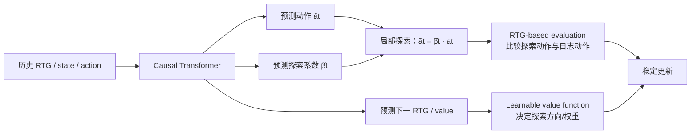

---
tags:
  - 自动出价
  - Offline-RL
  - GAVE
  - Decision-Transformer
  - 论文精读
created: 2026-07-28
---

# GAVE：怎样超过历史次优轨迹？

论文：[Generative Auto-Bidding with Value-Guided Explorations](https://arxiv.org/abs/2504.14587)  
PDF：[作者公开版本](https://personal.ntu.edu.sg/boan/papers/SIGIR25_autobidding.pdf)  
代码：[Applied-Machine-Learning-Lab/GAVE](https://github.com/Applied-Machine-Learning-Lab/GAVE)  
会议：SIGIR 2025

> **一句话总结：** GAVE 以 DT 为 backbone，但不满足于模仿日志动作：它先把广告主目标写进 score-based RTG，再在历史动作附近生成探索动作，用 RTG 评估控制更新幅度，并以可学习 value function 指导探索方向、缓解 OOD 风险。

## 1. 带着什么问题读？

**问题：怎样超过历史次优轨迹？**

离线数据来自旧策略。DT 即使给定高 RTG，也主要学习：

$$
p_{\text{data}}(a_t\mid \text{history},R_t).
$$

若旧策略从未尝试过更好的动作，单纯行为克隆没有可靠证据知道该往哪里走。盲目给预测动作加噪声则可能把策略推到 OOD 区，广告场景里意味着真实成本风险。

GAVE 的回答不是“无约束地探索”，而是：**在历史动作附近探索，并用目标 score 和 value 来决定是否接受探索。**

## 2. 三个关键模块

### 2.1 Score-based RTG：先统一“什么叫好”

广告主不是只要 conversions；还可能有 CPA、ROI 等效率限制。GAVE 用业务 score 构造 RTG，而不是机械地把“累计转化”当 reward。论文将未来可获得 score 写成 RTG，例如：

$$
r_t=S_T-S_{t-1},
$$

其中 $S_t$ 是到时刻 $t$ 的业务 score。

这一步的意义是把“最大化价值且不要突破 CPA”对齐到模型条件变量。**注意**：score 设计本身仍是建模选择；惩罚形式、权重和业务容忍区间要由场景决定，不是所有广告系统通用的固定公式。

### 2.2 Action Exploration：不是直接相信模型预测动作

GAVE 的 Transformer 不只预测 $\hat a_t$，还预测探索系数 $\hat\beta_t$。论文在其公式中构造探索动作：

$$
\tilde a_t=\hat\beta_t a_t.
$$

这里 $a_t$ 是日志动作。直觉是：以历史动作作锚点，再小范围扩大或缩小，而不是把一个可能不可靠的 $\hat a_t$ 直接推到线上。

### 2.3 RTG 评估 + 可学习 Value：决定探索是否值得

对 $\tilde a_t$ 与日志动作 $a_t$，GAVE 用 RTG-based evaluation 进行比较，形成平衡更新，避免探索梯度把 policy 拉得过猛。论文还学习下一时刻 value，用 expectile loss 训练 value function；它的角色是为探索提供方向性评价，并降低 OOD 动作被误判为高价值的风险。

可以这样理解分工：

| 组件 | 回答的问题 |
|---|---|
| score-based RTG | 这位广告主的“好结果”到底是什么？ |
| $\beta$ 探索 | 在旧动作附近往哪里、走多远？ |
| RTG evaluation | 这次偏离旧动作是否值得被训练信号接受？ |
| value function | 哪个探索方向更可能有长期价值？ |

## 3. 训练与推理不要混淆

训练是离线的：从日志取长度 $M+1$ 的序列，监督动作、RTG 和 value 相关输出；论文使用模拟竞价环境进行离线评估，也报告真实部署结果。

推理时模型根据当前历史输出动作和探索信息。这里最重要的思想是：**探索不是外层随手加一个随机扰动，而是模型化、可评估、受 value 引导的。**

## 4. 它相对 AIGB/DT 前进在哪里？

- 相比 DT：把“条件模仿”推进到“受价值引导的策略改进”。
- 相比只生成轨迹：明确处理固定离线数据中的次优行为模式与 OOD 探索风险。
- 相比仅靠 reward penalty：score-based RTG 将多目标业务评价放在条件化序列建模的中心。

但它仍把约束的大部分内容编码进 score/RTG，并通过 value 估计间接控制。若你需要“预算绝不超、CPA 不越界”的可解释保障，仍需要更显式的机制——这正是 GRM 的问题。

## 5. 论文证据、局限和面试话术

论文报告在两个离线数据集和真实部署中超过 baselines，并提供代码；摘要未将所有线上绝对指标公开，因此面试中应说“论文报告线上 A/B 优于对比方法”，不要自行补具体数值。[论文摘要与代码](https://arxiv.org/abs/2504.14587)

**局限：** value 估计仍可能有偏；$\beta$ 的有效探索范围依赖数据覆盖；将 CPA 等约束写进 score 并不等于每个时刻都有硬可行性保证。

> GAVE 的重点是解决 DT 的行为克隆上限。它以历史动作作锚点生成局部探索，通过 score-based RTG 统一不同广告目标，用 RTG 评估和 expectile-trained value function 筛选、引导探索。因而它不是盲目加噪声，而是尝试在稳定性、策略提升和 OOD 风险之间取得平衡。

