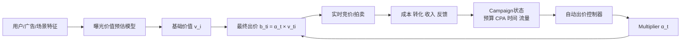

---
tags:
  - 自动出价
  - GRM
  - Constrained-Optimization
  - 论文调研
created: 2026-08-06
---

# GRM：怎样显式、可靠地满足预算与 CPA 约束？

论文：[Constrained Auto-Bidding via Generative Response Modeling](https://arxiv.org/abs/2605.27811)

作者：Eunseok Yang、Xingdong Zuo、Kyung-Min Kim（NAVER）  
版本：arXiv v1，2026-05-27  
会议：KDD 2026  
实验环境：AuctionNet 仿真环境

> **一句话总结：**GRM 不直接生成“下一步应该出多少价”，而是预测“不同 multiplier 会如何影响未来流量、成本和价值”，再通过预算根与 CPA 根求解当前最大的可行 multiplier。

![[Pasted image 20260730172707.png]]

## 1. 论文背景与工业应用

### 1.1 自动出价是什么

实时竞价广告中，广告主面对连续到来的曝光机会。每次机会都需要在很短时间内决定是否竞价、出价多少，但广告主真正关心的通常不是单次曝光，而是整个 campaign 周期内的目标：

- 在总预算内尽可能获得更多转化、GMV 或收入；
- 满足目标 CPA，例如平均每个转化成本不超过 100 元；
- 或满足目标 ROAS，例如广告收入与广告成本的比值不低于某个阈值。

抽象成优化问题：

$$
\max \sum_i u_i(b_i),
\quad
\text{s.t. }\sum_i c_i(b_i)\le B,
\quad
\frac{\sum_i c_i(b_i)}{\sum_i u_i(b_i)}\le \tau.
$$

其中：

- $b_i$：第 $i$ 次曝光的竞价；
- $u_i$：曝光带来的转化或收入价值；
- $c_i$：实际支付成本；
- $B$：campaign 总预算；
- $\tau$：CPA 目标。

这个问题难在三个地方：每天的曝光机会可能达到百万级；竞价竞争、流量和转化率不断变化；预算和 CPA 是全周期约束，不能只看当前一条曝光。

### 1.2 工业系统中的典型架构

生产广告系统通常拆成两层：



价值模型负责回答：**这次曝光值多少钱？**  
自动出价模块负责回答：**在当前预算和效率状态下，整体应该激进还是保守？**

论文采用生产中常见的 multiplier 形式：

$$
b_{t,i}=\alpha_t v_{t,i}.
$$

$v_{t,i}$ 保留不同曝光之间的相对价值排序，$\alpha_t$ 则在 campaign 层面统一调节竞价强度。也就是说，GRM 不替代 CVR、GMV 或转化价值预估模型，而是位于价值预估和竞价执行之间。

### 1.3 适用的业务场景

GRM 适合以下场景：

| 场景 | 需要满足的约束 | GRM 的作用 |
|---|---|---|
| 效果广告 | 预算 + 目标 CPA | 预测未来花费/转化响应，求 CPA 可行 multiplier |
| 电商广告 | 预算 + GMV 或 ROI 目标 | 预测收入响应，控制 ROI/ROAS |
| 应用下载 | 预算 + CPI/CPA | 在剩余预算和转化成本之间动态 pacing |
| 品牌/效果混合投放 | 时间进度 + 消耗目标 + 效率目标 | 统一处理多种 horizon-level 约束 |
| 竞争突变环境 | 竞争加剧、目标 CPA 收紧 | 每个 tick 重新预测并重新求根 |

它特别适合“约束不能只靠调 reward 权重表达”的生产场景。预算超支、CPA 超标通常不是可以接受的普通 loss，而是需要显式监控和解释的业务风险。

## 2. 现有方法为什么不够

### 2.1 反应式 pacing/control

PID、规则控制、FTRL 或 primal-dual 方法根据已经发生的消耗和 CPA 调整 multiplier。它们的优点是稳定、实时、容易部署；缺点是主要根据偏差做反应，无法充分预判未来流量和竞争变化。

### 2.2 Offline RL

CQL、IQL 等方法学习价值函数或策略，并通过 reward shaping、Lagrangian 或正则项把预算和 CPA 写进目标。问题是：

- reward 权重和预算、CPA 目标绑定较强；
- 违规程度被压缩成一个标量，难以定位是预算约束还是效率约束导致；
- 分布漂移时，策略可能输出训练数据覆盖之外的动作。

### 2.3 Decision Transformer 与生成式出价

DT、DiffBid、EBaReT 等方法将自动出价转成序列生成，通常通过 return-to-go、条件变量、搜索或专家轨迹影响约束。它们可以建模长历史，但约束仍主要是间接控制：模型生成了动作以后，系统再判断是否合规。

### 2.4 GRM 的核心区别

GRM 将学习目标从“动作”改成“环境响应”：

```text
历史状态/动作
        ↓
预测未来 traffic、cost curve、value curve
        ↓
预算根 + CPA 根
        ↓
α_t = min(α_B, α_C)
        ↓
执行 b_ti = α_t × v_ti
```

约束不再隐藏在 reward 或条件变量中，而是直接出现在 controller 的求根方程里。

## 3. GRM 的核心方法

### 3.1 Response Bundle：预测未来响应而不是直接预测动作

在决策时刻 $t$，模型输入历史状态和历史 multiplier：

$$
H_t=(s_{1:t},\alpha_{1:t-1},I_{1:t-1},\mathrm{Cost}_{<t},\mathrm{Val}_{<t}).
$$

Causal Transformer 将历史压缩为：

$$
h_t=f_\theta(s_{1:t},\alpha_{1:t-1}).
$$

GRM 输出未来 horizon 的 response bundle：

$$
\widehat{\mathcal R}_{t:T}
=\left(\widehat I_{t:T},
\widehat{\bar C}_{t:T}(\alpha),
\widehat{\bar V}_{t:T}(\alpha)\right).
$$

三个输出分别表示：

| 输出 | 含义 |
|---|---|
| $\widehat I_{t:T}$ | 从当前到周期结束预计会有多少曝光机会 |
| $\widehat{\bar C}_{t:T}(\alpha)$ | 使用 multiplier $\alpha$ 时，未来每次机会的平均成本 |
| $\widehat{\bar V}_{t:T}(\alpha)$ | 使用 multiplier $\alpha$ 时，未来每次机会的平均价值 |

将单位机会曲线转成 horizon 总量：

$$
\widehat{\mathcal C}_{t:T}(\alpha)
=\widehat I_{t:T}\widehat{\bar C}_{t:T}(\alpha),
\qquad
\widehat{\mathcal V}_{t:T}(\alpha)
=\widehat I_{t:T}\widehat{\bar V}_{t:T}(\alpha).
$$

### 3.2 为什么预测 horizon-aggregate curve

如果每个未来 tick 都单独预测一条曲线，输出空间和训练目标都会变得很大。GRM 假设从当前到周期结束使用一个临时 constant $\alpha$，直接预测剩余 horizon 的 traffic-weighted aggregate curve：

$$
\bar C_{t:T}(\alpha)
=\frac{\sum_{k=t}^{T}I_k C_k(\alpha)}{\sum_{k=t}^{T}I_k}.
$$

线上并不是一整天只执行一次 $\alpha$。GRM 每个 tick 都重新读取状态、重新预测、重新求根，因此最终仍会得到 $\alpha_1,\ldots,\alpha_T$ 的动态轨迹。这属于 receding-horizon control。

### 3.3 Log-sigmoid 曲线参数化

论文不用神经网络在大量离散 multiplier 上逐点预测，而是让网络输出少量曲线参数。成本曲线形式为：

$$
\widehat{\bar C}_{t:T}(\alpha)
=a^{(C)}\tilde\Phi(b^{(C)},c^{(C)},\alpha),
$$

其中：

$$
\tilde\Phi(b,c,\alpha)=
\frac{\Phi(b\log(\alpha+\varepsilon)+c)-
\Phi(b\log\varepsilon+c)}
{1-\Phi(b\log\varepsilon+c)}.
$$

价值曲线使用同样的参数化。$a$ 控制饱和上限，$b$ 控制敏感度，$c$ 控制横向位置；论文通过 softplus 保证 $a>0,b>0$，从而保证曲线单调。

这样做的工程意义是：曲线天然满足 $\alpha=0$ 时没有赢量、$\alpha$ 增大时响应不下降、极大 $\alpha$ 时逐渐饱和，更适合后续使用 bisection 求根。

### 3.4 Future-sampling supervision

日志只提供实际执行过的动作点：

$$
(\alpha_k,I_k,\mathrm{Cost}_k,\mathrm{Val}_k).
$$

训练时，对当前 anchor $t$ 从未来 $t{:}T$ 中采样 $M$ 个 tick $k_m$，在日志实际动作 $\alpha_{k_m}$ 处拟合：

$$
C_{k_m}\approx \frac{\mathrm{Cost}_{k_m}}{I_{k_m}},
\qquad
V_{k_m}\approx \frac{\mathrm{Val}_{k_m}}{I_{k_m}}.
$$

论文实现中每个 anchor 采样 $M=8$ 个未来 tick，并使用 traffic weighting；traffic 预测使用 log-scale loss，以减轻流量长尾分布影响。

需要注意：这不是严格的反事实因果估计。日志只观察到“当时用了 $\alpha_k$ 后发生了什么”，其他 multiplier 下的结果依赖曲线族、历史条件化和数据中的动作覆盖来泛化。

## 4. 显式约束控制：预算与 CPA 怎样可靠地落到动作上

### 4.1 剩余预算约束

当前已花费 $\mathrm{Cost}_{<t}$，剩余预算为：

$$
B_t=B-\mathrm{Cost}_{<t}.
$$

预算根 $\alpha_B$ 满足：

$$
\widehat{\mathcal C}_{t:T}(\alpha_B)=B_t.
$$

成本曲线单调时，可以使用二分法求解。若根不存在，则按边界处理：

- 最小 multiplier 仍然超预算：取动作下界；
- 最大 multiplier 仍花不完预算：预算不是当前 binding constraint，取动作上界。

### 4.2 CPA 约束

目标 CPA 为 $\tau$，历史累计价值为 $\mathrm{Val}_{<t}$。未来执行 multiplier $\alpha$ 时，整体 CPA 约束为：

$$
\frac{\mathrm{Cost}_{<t}+\widehat{\mathcal C}_{t:T}(\alpha)}
{\mathrm{Val}_{<t}+\widehat{\mathcal V}_{t:T}(\alpha)}
\le \tau.
$$

定义历史 CPA slack：

$$
\Delta_t=\tau\mathrm{Val}_{<t}-\mathrm{Cost}_{<t}.
$$

则 CPA 根 $\alpha_C$ 满足：

$$
\widehat{\mathcal C}_{t:T}(\alpha_C)
-\tau\widehat{\mathcal V}_{t:T}(\alpha_C)
=\Delta_t.
$$

### 4.3 Min-pacing 控制律

两个根分别代表预算和 CPA 允许的最大 multiplier，最终执行：

$$
\alpha_t=\min\{\alpha_B,\alpha_C\}.
$$

如果 $\alpha_B<\alpha_C$，预算更紧；如果 $\alpha_C<\alpha_B$，CPA 更紧。该 min 不是经验 gate，而是两个可行区间交集的右端点。

### 4.4 “可靠满足”到底是什么意思

论文的理论保证不是“真实线上永不违规”，而是分层的：

1. 在单 multiplier 问题中，曲线单调且根存在时，min-pacing 是精确解；
2. 单 multiplier 相比每个 tick 都单独控制的结构损失，由各 tick 边际 value-per-cost 的 dispersion 控制；
3. receding-horizon 下，真实预算/效率违规由 response curve、traffic prediction error 控制，并且每个 tick 重规划能减轻累计误差。

论文报告在 P14–P20 的 4,032 个 anchor-tick 预测中，CPA 方程 $\Psi(\alpha)=\widehat{\mathcal C}(\alpha)-\tau\widehat{\mathcal V}(\alpha)$ 约 98% 的案例在整个 operating range 内单调；非单调时取包含动作下界的第一个根，避免跳入内部不可行区。

因此更严谨的总结是：**GRM 显式保证预测模型下的可行性，真实约束稳定性仍取决于响应预测误差和分布漂移。**

## 5. 实验设置与明确结果

### 5.1 数据和实验环境

论文使用 AuctionNet 仿真环境，该环境来自 NeurIPS 2024 Auto-Bidding Challenge：

| 项目 | 论文设置 |
|---|---|
| 训练周期 | P7–P13 |
| 主测试周期 | P14–P20 |
| 每个周期 | 48 个 tick |
| 竞价机会 | 每个周期超过 0.5M |
| 竞争 agent | 每个 tick 有 48 个 bidding agents |
| 原始日志 | 超过 500M 条记录 |
| 主测试设置 | 其他 47 个 advertiser 的 bids 固定，只执行目标 advertiser 的策略 |
| 分布漂移设置 | 竞争 agent 动态生成 bids |

### 5.2 Baseline

主实验比较：BC、CQL、DT、IQL、DiffBid、EBaReT、GRM-short 和 GRM。所有方法都输出 tick-level multiplier $\alpha_t$，以保证策略空间一致。

分布漂移实验额外加入 FTRL，作为工业控制型 pacing baseline。

### 5.3 官方评估指标

AuctionNet 使用官方 score：

$$
\mathrm{score}=p(\mathrm{CPA};d)\cdot\sum_t \mathrm{Val}_t,
$$

其中：

$$
p(\mathrm{CPA};d)=
\min\left\{\left(\frac{d}{\mathrm{CPA}}\right)^\beta,1\right\},
\qquad \beta=2.
$$

当实际 CPA 超过目标 $d$ 时，score 会对累计 value 进行惩罚。因此该指标同时反映价值和约束稳定性，不是单纯比较转化量。

### 5.4 主结果：P14–P20

| Method | P14 | P15 | P16 | P17 | P18 | P19 | P20 | Avg ± Std |
|---|---:|---:|---:|---:|---:|---:|---:|---:|
| BC | 28.53 | 27.37 | 30.55 | 28.64 | 29.13 | 31.70 | 26.43 | 28.91 ± 1.79 |
| CQL | 31.09 | 29.99 | 29.88 | 29.73 | 27.97 | 33.45 | 27.99 | 30.01 ± 1.89 |
| DT | 30.01 | 29.79 | 30.31 | 31.92 | 29.52 | 34.42 | 29.70 | 30.81 ± 1.78 |
| IQL | 32.75 | 25.43 | 27.05 | 35.09 | 30.38 | 34.07 | 28.39 | 30.45 ± 3.67 |
| DiffBid | 31.95 | 28.62 | 30.65 | 35.59 | 27.72 | 34.36 | 29.79 | 31.24 ± 2.91 |
| EBaReT | 30.44 | 30.53 | 32.62 | 31.75 | 31.18 | 34.66 | 28.80 | 31.43 ± 1.86 |
| GRM-short | 31.23 | 29.88 | 30.95 | 32.47 | 29.73 | 33.58 | 30.12 | 31.14 ± 1.47 |
| **GRM** | **33.11** | **32.60** | **32.48** | **34.57** | **31.69** | **38.88** | **33.84** | **33.88 ± 2.40** |

论文报告的关键结论：

- GRM 平均 score 为 **33.88**；
- 最强 baseline EBaReT 为 **31.43**；
- 相对 EBaReT 提升 **7.8%**；
- P19 上 GRM 为 **38.88**，EBaReT 为 **34.66**；
- GRM-short 只有 **31.14**，比完整 GRM 低约 **8.1%**。

GRM-short 是只预测当前 tick response 的单 tick 版本。它明显低于完整 GRM，直接支持论文的核心判断：**长 horizon 的未来流量、竞争和预算/CPA 状态不能被 snapshot response 替代。**

### 5.5 分布漂移结果

论文测试两种 episode-level distribution shift：

#### 5.5.1 竞争加剧

将竞争 agent 的预算提高到原来的 $1.1\times$：

| Method | Normal score | Degradation |
|---|---:|---:|
| GRM | 33.51 | **7.2%** |
| FTRL | 29.83 | 9.0% |
| DT | 31.24 | 22.6% |

GRM 保留约 93% 的正常环境表现，降幅小于 FTRL 和 DT。

#### 5.5.2 CPA 目标收紧

将目标 CPA 调整为原目标的 $0.8\times$：

| Method | Degradation | Violation rate：normal → shifted |
|---|---:|---:|
| GRM | **5.0%** | 6.5% → **9.8%** |
| FTRL | 6.9% | 8.2% → 15.3% |
| DT | 13.9% | 10.8% → 28.7% |

这组实验说明 GRM 的优势不是只在静态测试集上取得更高 score，而是发生环境变化时，可以重新预测 response curve，并重新求解 $\alpha_B$、$\alpha_C$。

### 5.6 预测质量与最终性能的关系

论文用 validation loss 作为 response prediction quality 的代理，在 10 个不同训练 checkpoint 上分析：

- validation loss 与 test score 的相关系数为 **$r=-0.78$，$p<0.01$**；
- 最优 checkpoint 的 loss 为 **0.96**，score 为 **33.88**；
- loss 大于 **1.04** 的 checkpoint，平均 score 低于 **30.0**；
- 在 18 个架构和超参数配置上重复分析，相关系数仍为 **$r=-0.72$**。

这支持论文的理论直觉：response prediction 越准确，root-finding controller 得到的 multiplier 越可靠。

### 5.7 曲线族消融

| Curve family | Avg score | 相对 Log-sigmoid |
|---|---:|---:|
| Linear | 30.18 | -10.9% |
| Piecewise-linear | 31.57 | -6.8% |
| Sigmoid | 32.49 | -4.1% |
| Monotone MLP | 33.52 | -1.1% |
| **Log-sigmoid** | **33.88** | **—** |

消融说明：

- Linear 无法表达高 multiplier 下的饱和，容易导致预算 overspend；
- 普通 sigmoid 没有在 $\log\alpha$ 空间建模，中间 multiplier 区域的 diminishing return 表达不足；
- Monotone MLP 已经接近 Log-sigmoid，但更容易拟合噪声；
- 低参数量的 Log-sigmoid 在该 horizon-aggregate 目标上取得最佳结果。

## 6. 论文贡献、价值与局限

### 6.1 论文真正贡献

1. **学习目标重写**：从直接预测 action 改为预测 multiplier 到未来 cost/value 的 response。
2. **约束显式化**：预算和 CPA 变成两个一维求根问题，而不是 reward penalty。
3. **神经预测与解析控制解耦**：模型负责不确定环境预测，controller 负责业务可行性。
4. **可解释的误差链路**：最终违规可以追溯到 traffic、cost curve 或 value curve 的预测误差。
5. **长 horizon 的实验证据**：GRM 完整版本优于 GRM-short，说明 horizon-aggregate response 不是装饰设计。

### 6.2 局限与谨慎解读

- **这是仿真环境结果，不是线上广告平台 A/B 结果。**论文使用 AuctionNet P14–P20 评估，不能直接等价为线上 CPA 或 GMV 提升。
- **反事实识别依赖日志覆盖。**日志只观察真实执行过的 multiplier，曲线外推依赖函数族和历史分布。
- **single-multiplier 是结构限制。**未来 horizon 内如果不同 tick 的边际 value-per-cost 差异很大，单曲线方案会产生 structural gap。
- **CPA 方程不总是单调。**论文报告约 98% anchor-tick prediction 单调，剩余非单调情况需要取第一个根，说明 controller 仍需要边界与异常处理。
- **真实环境预测错仍会违规。**min-pacing 对预测曲线是精确的，但不能消除竞价环境突变、反馈延迟和预测偏差。
- **系统依赖 multiplier 分解。**如果业务需要人群、地域、商品或时段级异质出价，一个全局 $\alpha_t$ 可能表达力不足。

## 7. 面试/汇报时的完整讲法

这篇论文研究的是实时竞价广告中的自动出价问题。生产系统通常先由价值模型估计每次曝光的价值，再用 campaign-level multiplier 统一缩放成最终 bid；但预算和 CPA 是跨整个投放周期的约束，单纯依靠反应式 pacing、RL reward penalty 或生成动作很难显式保证。

GRM 的做法是把学习目标从“直接生成 multiplier”改成“预测 multiplier 对未来的响应”。模型输入状态和历史动作，用 causal Transformer 预测剩余 horizon 的 traffic，以及成本和价值关于 multiplier 的单调饱和曲线。线上根据剩余预算求一个预算根，再根据累计 CPA slack 求一个效率根，最终执行两个根的较小值。这样模型负责预测，解析 controller 负责约束。

实验在 AuctionNet 上进行，训练 P7–P13，测试 P14–P20。GRM 平均 score 为 33.88，优于 EBaReT 的 31.43，提升 7.8%；竞争预算提高 1.1 倍时 GRM 性能下降 7.2%，DT 下降 22.6%；目标 CPA 收紧到 0.8 倍时，GRM 下降 5.0%，且 violation rate 从 6.5% 增至 9.8%，明显优于 DT 的 28.7%。

我认为这篇论文最有价值的地方不是 Transformer，而是将硬约束从神经网络的 reward 中拿出来，转成可检查、可求根、可解释的控制逻辑。不过实验仍然是 AuctionNet 仿真结果，真实线上稳定性还依赖 response curve 的校准、动作覆盖和分布漂移处理。

## 8. 最终 Takeaway

> GRM 的核心范式是：**response modeling + analytic constrained control + receding-horizon replanning**。它通过预测未来响应曲线来面对不确定环境，通过预算根和 CPA 根显式满足约束，并用每个 tick 的重新规划修正预测误差。论文在 AuctionNet 上以 33.88 的平均 score 超过最强 baseline 31.43，提升 7.8%；但这是一项仿真 benchmark 结果，不应直接表述为线上广告收益提升。

## 9. 参考资料

- [论文原文：arXiv 2605.27811](https://arxiv.org/abs/2605.27811)
- [论文 HTML 全文](https://arxiv.org/html/2605.27811v1)
- [AuctionNet：A Novel Benchmark for Decision-Making in Large-Scale Games](https://arxiv.org/abs/2408.09575)

