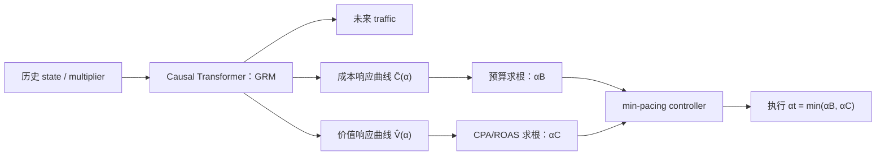

---
tags:
  - 自动出价
  - GRM
  - Constrained-Optimization
  - 论文精读
created: 2026-07-28
---

# GRM：怎样显式、可靠地满足预算与 CPA 约束？

论文：[Constrained Auto-Bidding via Generative Response Modeling](https://arxiv.org/abs/2605.27811)  
会议：KDD 2026

> **一句话总结：** GRM 将学习目标从“直接预测动作”换为“预测环境对 multiplier 的响应曲线”：预测未来流量、单位流量成本曲线 $\bar C(\alpha)$ 和单位流量价值曲线 $\bar V(\alpha)$，再用解析的一维求根控制器得到同时满足预算和 CPA/ROAS 约束的 $\alpha$。
![[Pasted image 20260730172707.png]]

## 按 Figure 1 的符号走完 GRM 全流程，逐一解释图中的模块、箭头与变量

这张图从左到右有两件不同的事：绿色框的 **GRM** 预测“如果后续 horizon 使用不同 multiplier $\alpha$，未来流量、成本和价值会怎样响应”；橙色框的 **Min-Pacing Controller** 再解出“在预算和 CPA 都不超标时，当前 tick 应选多大的 $\alpha_t$”。前者是数据驱动预测，后者是一维约束求解；GRM 本身不直接输出动作。

$$
\underbrace{(s_{1:t},\alpha_{1:t-1})}_{\text{已观察的历史}}
\xrightarrow{\text{causal Transformer}}
\underbrace{\bigl(\widehat I_{t:T},\widehat{\bar C}_{t:T}(\cdot),\widehat{\bar V}_{t:T}(\cdot)\bigr)}_{\text{未来响应 bundle}}
\xrightarrow[\text{CPA root}]{\text{budget root}}
\alpha_t
\xrightarrow{b_{t,i}=\alpha_t v_{t,i}}
\text{当前 tick 的曝光级 bid}.
$$

### 1. 先分清图中的时间与粒度

| 图中记号 | 准确含义 | 不要混淆成什么 |
|---|---|---|
| $t=1,\ldots,T$ | campaign 切分后的 tick，例如每 30 分钟一个 tick。 | 不是每条曝光；一个 tick 内会到来大量曝光机会。 |
| $i$ | tick 内的一次具体曝光机会。 | 这是最终提交 $b_{t,i}$ 的曝光级粒度，Figure 1 没有逐条画出。 |
| $k\sim\mathcal U\{t,\ldots,T\}$ | 训练时从 anchor tick $t$ 之后随机抽取的未来 tick。 | 只是 future-sampling 的监督索引，不是线上动作。 |
| $\alpha_t$ / 图中 $a_t$ | 当前 tick 的 campaign 级 multiplier；图中的 $a_t$ 是动作 token 的简写。 | 不是直接提交到拍卖的 bid。实际 bid 为 $b_{t,i}=\alpha_t v_{t,i}$。 |
| $v_{t,i}$ | 单曝光价值预估，例如 CVR 或预期 GMV。 | GRM 不重训价值模型；它只调节整体放大倍数 $\alpha_t$。 |

例如当前 tick 选择 $\alpha_t=1.2$，并不是所有曝光都出价 1.2 元。若两次曝光的价值预估分别为 $v_{t,1}=5$、$v_{t,2}=1$，对应 bid 是 6 和 1.2。这样保留了价值模型对曝光的相对排序，同时用一个标量控制整体花费速度。

### 2. 图底部的 $s_{t-2},a_{t-2},\ldots,s_t,a_t$：模型到底看到了什么？

每个 $s_j$ 是 tick $j$ 的上下文状态向量，而非一个数字。论文中的 pre-decision history 可写为：

$$
H_t=(s_{1:t},\alpha_{1:t-1},I_{1:t-1},\mathrm{Cost}_{<t},\mathrm{Val}_{<t}).
$$

它概括了时间/场景特征、campaign 状态、过去 multiplier、过去流量，以及累计成本和累计价值。图中 state、action 交错的 token 序列表示“状态怎样在过去动作影响下演化”。最右的 $a_t$ 应理解为**当前动作位置/最终输出位置**，并不表示线上在决定 $\alpha_t$ 之前就把它输入模型：决策时已知的是 $s_{1:t}$ 与 $\alpha_{1:t-1}$；右侧 controller 拿到预测响应后才会计算 $\alpha_t$。

蓝色 causal Transformer 使用因果 mask，因此生成时刻 $t$ 的历史表征只能读取当前和过去 token，不能偷看未来 $s_{t+1:T}$。它将上述历史压缩为 $h_t=f_\theta(s_{1:t},\alpha_{1:t-1})$，再送给上方三个预测头。

### 3. 三个黄色输出框：GRM 预测的 response bundle 是什么？

上方三个框共同构成：

$$
\widehat{\mathcal R}_{t:T}
=\Bigl(\widehat I_{t:T},\widehat{\bar C}_{t:T}(\cdot),\widehat{\bar V}_{t:T}(\cdot)\Bigr).
$$

| Figure 1 中的框 | 含义 | 为什么必须预测它 |
|---|---|---|
| Traffic $\widehat I_{t:T}$ | 从当前 $t$ 到结束 $T$ 的未来曝光数预测，$\widehat I_{t:T}\approx\sum_{j=t}^{T}I_j$。 | 成本/价值曲线是单次机会平均量；需要 traffic 才能得到剩余总成本和总价值。 |
| Cost curve $\widehat{\bar C}_{t:T}(\alpha)$ | 后续 horizon 统一用 $\alpha$ 时的**单次机会平均成本**。上横线表示它是 $t{:}T$ 间按 traffic 加权的 aggregate curve。 | 控制器可比较不同 $\alpha$ 下的未来花费。 |
| Value curve $\widehat{\bar V}_{t:T}(\alpha)$ | 同一假设下的**单次机会平均真实价值**；CPA 场景中可对应转化，ROAS 场景中可对应收入。 | 控制器可判断花费相对价值是否仍满足效率约束。 |

三者合成 controller 真正使用的剩余 horizon 总量：

$$
\widehat{\mathcal C}_{t:T}(\alpha)
=\widehat I_{t:T}\widehat{\bar C}_{t:T}(\alpha),\qquad
\widehat{\mathcal V}_{t:T}(\alpha)
=\widehat I_{t:T}\widehat{\bar V}_{t:T}(\alpha).
$$

“curve” 并不是预测很多个离散 $\alpha$ 的表。论文让网络输出成本曲线和价值曲线各自的 3 个参数 $(a,b,c)$，以 $\log\alpha$ 上的归一化 Normal CDF 构造单调饱和函数：$a$ 是饱和上限，$b$ 控制斜率/敏感度，$c$ 控制横向平移。softplus 保证关键参数为正，因而曲线随 $\alpha$ 增加而不下降。图中的一个曲线框实际是“函数参数”，不是一个标量预测。

### 4. 左上角 $D_k$ 与 future-sampled offline data：训练标签从哪里来？

数据库、$k\sim\mathcal U\{t,\ldots,T\}$、以及虚线 **Pointwise loss $\mathcal L$** 只属于离线训练。对 anchor tick $t$，日志能够提供任一未来 tick $k$ 实际执行的 $\alpha_k$、流量 $I_k$、总成本 $\mathrm{Cost}_k$ 与总价值 $\mathrm{Val}_k$，由此得到日志动作处的观测点：

$$
C_k(\alpha_k)\approx\frac{\mathrm{Cost}_k}{I_k},\qquad
V_k(\alpha_k)\approx\frac{\mathrm{Val}_k}{I_k}.
$$

训练会从未来抽样 $k$，让预测的 aggregate curve 在 $\alpha_k$ 处去拟合这一真实观测，并按 $I_k$ 加权；同时以整个剩余 horizon 的 $I_{t:T}$ 监督 traffic head。也就是图中从 $D_k$ 到三元监督信号、再由 pointwise loss 回传到模型的箭头。

这不等于日志给了完整反事实——同一时刻换成所有别的 $\alpha$ 会怎样，日志并没有直接记录。GRM 的曲线泛化依赖历史中不同 multiplier 的覆盖、历史条件化和单调饱和函数族；论文将其定位为对部署分布的预测建模，而不是严格识别全量 counterfactual causal effect。

### 5. 橙色框 Budget Pacing：第一张紫色纸如何得到 $\alpha_B$？

当前 tick 前已经花掉 $\mathrm{Cost}_{<t}$，所以剩余预算为：

$$
B_t=B-\mathrm{Cost}_{<t}.
$$

紫色纸上的预算求解是：

$$
\widehat{\mathcal C}_{t:T}(\alpha_B)=B_t.
$$

它在“预测的剩余**总成本**曲线”上找一个根：$\alpha$ 太小就花不完，太大就会超支。由于预测成本曲线被约束为严格递增，可使用 bisection 做稳定的一维求根。若即使用最大允许 multiplier 也花不完剩余预算，论文将 $\alpha_B$ 设为动作上界 $\bar\alpha$，即预算不再是当前限制。

### 6. 橙色框 CPA Pacing：第二张紫色纸如何得到 $\alpha_C$？

图中把 CPA 一侧简写为 cost/value ratio 的求根；完整控制式还要把已经发生的累计结果带上。定义 CPA slack：

$$
\Delta_t=\tau\,\mathrm{Val}_{<t}-\mathrm{Cost}_{<t},
$$

其中 $\tau$ 是目标 CPA。完整约束为

$$
\frac{\mathrm{Cost}_{<t}+\widehat{\mathcal C}_{t:T}(\alpha)}
{\mathrm{Val}_{<t}+\widehat{\mathcal V}_{t:T}(\alpha)}
\leq\tau,
$$

对应边界根为：

$$
\widehat{\mathcal C}_{t:T}(\alpha_C)
-\tau\widehat{\mathcal V}_{t:T}(\alpha_C)=\Delta_t.
$$

所以 Figure 1 中 $\widehat{\bar C}_{t:T}(\alpha)/\widehat{\bar V}_{t:T}(\alpha)=\mathrm{CPA}_t$ 是压缩示意；实际求根用的是流量换算后的总量，并带入历史累计 cost/value。若过去 CPA 已经偏差，$\Delta_t$ 会变小，$\alpha_C$ 就会更保守。

### 7. 图中的 MIN 与 $a_t$：为什么是 $\min\{\alpha_B,\alpha_C\}$？

两个根分别给出预算与 CPA 能允许的最大激进程度：

$$
\alpha_t=\min\{\alpha_B,\alpha_C\}.
$$

若 $\alpha_B<\alpha_C$，预算更紧；即使 CPA 仍有余量也不能再加价。若 $\alpha_C<\alpha_B$，效率更紧；即使预算尚有余量也需要收缩。MIN 菱形不是可学习 gate，而是显式地取两个可行区间的交集。在单一 $\alpha$、响应单调且根存在的论文假设下，它就是该 single-$\alpha$ 问题的精确最优解：在可行范围内取最大的 $\alpha$，以获得不下降的价值。

### 8. 将 Figure 1 串成训练与线上执行的完整闭环

**训练时**：从离线 episode 取 anchor $t$，输入历史 $(s_{1:t},\alpha_{1:t-1})$；抽一个未来 $k$，读取日志的 $(I_k,\mathrm{Cost}_k,\mathrm{Val}_k,\alpha_k)$；模型输出 $\widehat I_{t:T}$ 和两条曲线，并在 $\alpha_k$ 处以 traffic-weighted pointwise loss 拟合观测值。这个阶段只训练响应预测器，不训练 MIN 或求根过程。

**线上第 $t$ 个 tick**：读取新状态与累计花费/价值；GRM 预测未来 traffic 和两条 response curve；controller 先换算出总成本/价值曲线，再分别求 $\alpha_B,\alpha_C$，取 MIN 得到 $\alpha_t$；该 $\alpha_t$ 被应用于本 tick 所有到来的曝光 $b_{t,i}=\alpha_tv_{t,i}$。真实 cost/value 回流后，下一 tick 又重新预测和求根。

因此 GRM 图中虽然预测的是“从现在到结束都采用同一 $\alpha$”的剩余 horizon 响应，但线上只执行当前一步、每 tick 重新规划；这正是 receding-horizon control，而不是一次性生成并锁死全天动作。

## 1. 带着什么问题读？

**问题：怎样显式、可靠地满足约束？**

很多生成式/RL方法把约束塞进 reward：CPA 超标就扣分、预算超了就给大惩罚。问题是模型学到的是“尽量少违规”，而不是“先保证可行，再优化”。分布漂移时，reward 权重再漂亮也可能失效。

GRM 的关键转向是：**先学习世界怎样响应一个动作，再由可解释的控制器选择可行动作。**

## 2. 先理解工业动作空间为什么可以降维

论文采用常见的两层出价形式：预估模型为单次曝光给价值 $v_i$，campaign 级控制器只维护 multiplier：

$$
b_i=\alpha v_i.
$$

这保留了 $v_i$ 对曝光相对价值的排序，只用一个 $\alpha$ 控制整体激进程度。问题便从“每天给百万次曝光分别选 $b_i$”降为“当前时间片选一个 $\alpha$”。

## 3. GRM 真正预测的是什么？

输入是截至 $t$ 的状态—动作历史；论文使用 causal Transformer 编码。输出不是 $\hat\alpha$，而是未来到投放结束时、关于 $\alpha$ 的三个对象：

$$
\hat I_{t:T},\qquad \widehat{\bar C}_{t:T}(\alpha),\qquad \widehat{\bar V}_{t:T}(\alpha).
$$

- $\hat I$：未来可用流量；
- $\widehat{\bar C}(\alpha)$：使用不同 multiplier 时预计总成本；
- $\widehat{\bar V}(\alpha)$：对应预计总价值。

论文把 cost/value curve 设计成随 $\alpha$ 单调、饱和的函数族（在 $\log\alpha$ 上使用归一化 CDF 形状），用少量参数表示整条曲线。这不是只预测一个点，所以控制器能问：**若我把 $\alpha$ 从 0.8 改到 1.1，未来成本和值会怎样变化？**

## 4. 控制器如何显式保证约束？

先用预测流量把单位量曲线换成剩余 horizon 的总量：

$$
\widehat{\mathcal C}_{t:T}(\alpha)
=\widehat I_{t:T}\widehat{\bar C}_{t:T}(\alpha),\qquad
\widehat{\mathcal V}_{t:T}(\alpha)
=\widehat I_{t:T}\widehat{\bar V}_{t:T}(\alpha).
$$

预算允许的最大 multiplier 是使预计剩余总成本等于剩余预算的根：

$$
\widehat{\mathcal C}_{t:T}(\alpha_B)=B-\mathrm{Cost}_{<t}.
$$

效率约束（以 CPA 为例）需要合并历史累计结果：

$$
\frac{\mathrm{Cost}_{<t}+\widehat{\mathcal C}_{t:T}(\alpha_C)}
{\mathrm{Val}_{<t}+\widehat{\mathcal V}_{t:T}(\alpha_C)}=\tau.
$$

论文采用 min-pacing：

$$
\alpha_t=\min(\alpha_B,\alpha_C).
$$

也就是说，谁更紧就听谁的。它不是把 constraint 藏进一个黑盒 reward，而是在每次重规划时直接解约束方程。

## 5. 训练数据从哪里来？

论文采用 future-sampled supervision：以当前 tick 为锚点，从之后的 tick 中采样未来监督信号，拟合实际可观测结果，使 GRM 学会从历史推断未来 horizon 的响应。论文明确说明模型预测的是**整个 horizon 的聚合曲线**，而非为未来每个 tick 分别预测一条曲线。

这里要特别清醒：日志只记录历史实际执行过的 multiplier 的结果。要拟合“换成其他 $\alpha$ 会怎样”的曲线，本质上依赖函数参数化、历史覆盖和单调等假设；不是凭空获得完整反事实。

## 6. 它为什么有理论价值？

论文在温和单调性假设下证明：

- 对 single-multiplier 问题，解析控制器是精确的；
- 相对完全逐 tick 控制的最优性缺口，可由每个 tick 边际 value-per-cost 的离散程度界定；
- receding-horizon 重规划下的约束违反与预测误差相关。

这不是“整个广告世界都被证明最优”，而是说明：在论文明确的降维动作空间与假设下，预测响应再求根的做法有清晰的可行性解释。

## 7. 实验、局限与总结

论文在 AuctionNet 上报告比强 baseline 更好的 constraint stability 和 overall score；摘要没有报告线上 A/B，因此不能把它说成已获得线上生产收益。[论文摘要](https://arxiv.org/abs/2605.27811)

**最大局限：** 曲线预测错了，解析求根也会在错误模型上“精确地”求出错误动作；另外 single multiplier 是对复杂逐曝光控制的结构性约束。

> GRM 最有价值的地方在于它不把预算和 CPA 当 reward penalty，而是学习 multiplier 到未来成本/价值的响应函数。神经网络负责预测不确定环境，解析控制器负责解预算和效率约束。这使约束是否满足、为什么采取这个动作都更可解释；代价是模型质量高度依赖响应曲线的反事实泛化能力。
