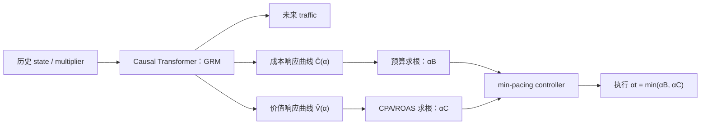

---
tags:
  - 自动出价
  - GRM
  - Constrained-Optimization
  - 论文精读
created: 2026-07-28
---

# GRM：怎样显式、可靠地满足预算与 CPA 约束？

论文：[Constrained Auto-Bidding via Generative Response Modeling](https://arxiv.org/abs/2605.27811)  
会议：KDD 2026

> **一句话总结：** GRM 将学习目标从“直接预测动作”换为“预测环境对 multiplier 的响应曲线”：预测未来流量、总成本 $\bar C(\alpha)$ 和总价值 $\bar V(\alpha)$，再用解析的一维求根控制器得到同时满足预算和 CPA/ROAS 约束的 $\alpha$。

## 1. 带着什么问题读？

**问题：怎样显式、可靠地满足约束？**

很多生成式/RL方法把约束塞进 reward：CPA 超标就扣分、预算超了就给大惩罚。问题是模型学到的是“尽量少违规”，而不是“先保证可行，再优化”。分布漂移时，reward 权重再漂亮也可能失效。

GRM 的关键转向是：**先学习世界怎样响应一个动作，再由可解释的控制器选择可行动作。**

## 2. 先理解工业动作空间为什么可以降维

论文采用常见的两层出价形式：预估模型为单次曝光给价值 $v_i$，campaign 级控制器只维护 multiplier：

$$
b_i=\alpha v_i.
$$

这保留了 $v_i$ 对曝光相对价值的排序，只用一个 $\alpha$ 控制整体激进程度。问题便从“每天给百万次曝光分别选 $b_i$”降为“当前时间片选一个 $\alpha$”。

## 3. GRM 真正预测的是什么？

输入是截至 $t$ 的状态—动作历史；论文使用 causal Transformer 编码。输出不是 $\hat\alpha$，而是未来到投放结束时、关于 $\alpha$ 的三个对象：

$$
\hat I_{t:T},\qquad \widehat{\bar C}_{t:T}(\alpha),\qquad \widehat{\bar V}_{t:T}(\alpha).
$$

- $\hat I$：未来可用流量；
- $\widehat{\bar C}(\alpha)$：使用不同 multiplier 时预计总成本；
- $\widehat{\bar V}(\alpha)$：对应预计总价值。

论文把 cost/value curve 设计成随 $\alpha$ 单调、饱和的函数族（在 $\log\alpha$ 上使用归一化 CDF 形状），用少量参数表示整条曲线。这不是只预测一个点，所以控制器能问：**若我把 $\alpha$ 从 0.8 改到 1.1，未来成本和值会怎样变化？**

## 4. 控制器如何显式保证约束？

给定预测曲线，预算允许的最大 multiplier 是使预计成本等于剩余预算的根：

$$
\widehat{\bar C}_{t:T}(\alpha_B)=B_{\mathrm{remain}}.
$$

效率约束（以 CPA 为例）对应：

$$
\frac{C_{\mathrm{spent}}+\widehat{\bar C}_{t:T}(\alpha_C)}
{V_{\mathrm{earned}}+\widehat{\bar V}_{t:T}(\alpha_C)}=\tau.
$$

论文采用 min-pacing：

$$
\alpha_t=\min(\alpha_B,\alpha_C).
$$

也就是说，谁更紧就听谁的。它不是把 constraint 藏进一个黑盒 reward，而是在每次重规划时直接解约束方程。

## 5. 训练数据从哪里来？

论文采用 future-sampled supervision：以当前 tick 为锚点，从之后的 tick 中采样未来监督信号，拟合实际可观测结果，使 GRM 学会从历史推断未来 horizon 的响应。论文明确说明模型预测的是**整个 horizon 的聚合曲线**，而非为未来每个 tick 分别预测一条曲线。

这里要特别清醒：日志只记录历史实际执行过的 multiplier 的结果。要拟合“换成其他 $\alpha$ 会怎样”的曲线，本质上依赖函数参数化、历史覆盖和单调等假设；不是凭空获得完整反事实。

## 6. 它为什么有理论价值？

论文在温和单调性假设下证明：

- 对 single-multiplier 问题，解析控制器是精确的；
- 相对完全逐 tick 控制的最优性缺口，可由每个 tick 边际 value-per-cost 的离散程度界定；
- receding-horizon 重规划下的约束违反与预测误差相关。

这不是“整个广告世界都被证明最优”，而是说明：在论文明确的降维动作空间与假设下，预测响应再求根的做法有清晰的可行性解释。

## 7. 实验、局限与面试话术

论文在 AuctionNet 上报告比强 baseline 更好的 constraint stability 和 overall score；摘要没有报告线上 A/B，因此不能把它说成已获得线上生产收益。[论文摘要](https://arxiv.org/abs/2605.27811)

**最大局限：** 曲线预测错了，解析求根也会在错误模型上“精确地”求出错误动作；另外 single multiplier 是对复杂逐曝光控制的结构性约束。

> GRM 最有价值的地方在于它不把预算和 CPA 当 reward penalty，而是学习 multiplier 到未来成本/价值的响应函数。神经网络负责预测不确定环境，解析控制器负责解预算和效率约束。这使约束是否满足、为什么采取这个动作都更可解释；代价是模型质量高度依赖响应曲线的反事实泛化能力。

