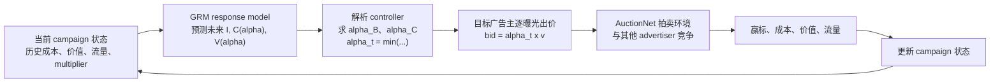

---
tags:
  - 自动出价
  - GRM
  - Constrained-Optimization
  - 论文调研
created: 2026-08-06
---

# GRM：怎样显式、可靠地满足预算与 CPA 约束？

论文：[Constrained Auto-Bidding via Generative Response Modeling](https://arxiv.org/abs/2605.27811)

作者：Eunseok Yang、Xingdong Zuo、Kyung-Min Kim（NAVER）  
版本：arXiv v1，2026-05-27  
会议：KDD 2026  
实验环境：AuctionNet 仿真环境

> **一句话总结：**GRM 不直接生成“下一步应该出多少价”，而是预测“不同 multiplier 会如何影响未来流量、成本和价值”，再通过预算根与 CPA 根求解当前最大的可行 multiplier。


![[GRM Figure 1 - Framework.png|1000]]
> **论文 Figure 1：**左侧的 GRM 用历史状态和动作预测未来 traffic、cost/value response curves；右侧的 min-pacing controller 分别求预算根与 CPA 根，再执行当前 multiplier。
## 1. 先用一轮决策讲清 GRM

GRM 不直接让网络输出“下一步该出多少价”。它先预测：在不同 multiplier 下，剩余周期会有多少流量、花多少钱、产生多少价值；再由解析 controller 把预算和 CPA 约束变成可求解的 multiplier 上界。

$$
H_t \xrightarrow{f_\theta}
\left(\widehat I_{t:T},\widehat{\bar C}_{t:T}(\alpha),\widehat{\bar V}_{t:T}(\alpha)\right)
\xrightarrow{\text{budget root + CPA root}}
\alpha_t \xrightarrow{b_{t,i}=\alpha_t v_{t,i}} \text{auction feedback}.
$$

| 层级 | 决策对象 | GRM 的职责 |
|---|---|---|
| campaign / horizon | 剩余预算、累计 CPA、未来流量 | 预测从当前到结束的响应曲线。 |
| tick | multiplier $\alpha_t$ | 求预算根、CPA 根，取更小的可行上界。 |
| 曝光 | bid $b_{t,i}$ | 用 $\alpha_t$ 缩放基础价值 $v_{t,i}$。 |

因此，GRM 不替代 CVR 或价值预估模型；它是价值预估与拍卖执行之间的**受约束 campaign controller**。

### 1.1 训练、控制、执行各负责什么

| 阶段 | 输入 | 输出 | 是否直接出价 |
|---|---|---|---|
| 离线训练 | 历史状态、历史 multiplier、未来日志反馈 | response model 参数 | 否 |
| 当前 tick 推理 | 当前历史与业务目标 | $\widehat I,\widehat{\bar C}(\alpha),\widehat{\bar V}(\alpha)$ | 否 |
| 约束控制 | 预测曲线、剩余预算、累计成本和价值 | $\alpha_t=\min(\alpha_B,\alpha_C)$ | 否 |
| 实时拍卖 | $\alpha_t$ 与 $v_{t,i}$ | $b_{t,i}=\alpha_t v_{t,i}$ | 是 |

### 1.2 用一个虚构例子理解 controller

假设当前 campaign 已消耗 80% 预算，晚高峰即将到来。GRM 预测如果将 multiplier 提到 1.30，未来成本会超过剩余预算，因此得到 $\alpha_B=1.12$；同时 CPA 方程表明 $\alpha>1.05$ 会突破目标，所以 $\alpha_C=1.05$。最终执行 $\alpha_t=1.05$，说明此刻 CPA 比预算更紧。新的流量、成本和价值反馈，再进入下一个 tick 的重规划。

网络回答的是“调到这里会发生什么”，controller 回答的是“约束下最多能调到哪里”。

### 1.3 公式中的每个量分别是什么意思

总览公式不是一个端到端黑盒，而是一条分工清晰的决策链：

$$
H_t
\xrightarrow{f_\theta}
\left(\widehat I_{t:T},\widehat{\bar C}_{t:T}(\alpha),\widehat{\bar V}_{t:T}(\alpha)\right)
\xrightarrow{\text{budget root + CPA root}}
\alpha_t
\xrightarrow{b_{t,i}=\alpha_t v_{t,i}}
\text{auction feedback}.
$$

1. $H_t$：**当前时刻的历史状态。**$t$ 是当前 tick，例如当天第 20 个半小时窗口。$H_t$ 汇总截至当前的 campaign 信息，例如历史流量、历史 multiplier、已花费用、累计转化/价值、剩余预算和当前 CPA 状态。
2. $f_\theta$：**GRM 的 Causal Transformer。**参数 $\theta$ 由离线日志训练得到。它读取历史状态，但不直接输出“现在用多少 $\alpha$”；它的任务是预测不同 $\alpha$ 会带来怎样的未来响应。
3. $I^{\mathrm{pred}}_{t:T}$：**剩余周期的流量预测。**它表示从当前 $t$ 到结束 $T$，预计还会出现多少可竞价机会；上标 $\mathrm{pred}$ 表示模型预测值。
4. $C^{\mathrm{pred,avg}}_{t:T}(\alpha)$：**未来平均成本曲线。**给定一个候选 multiplier $\alpha$，它预测剩余周期内每次机会的平均成本；上标 $\mathrm{avg}$ 表示平均到单次机会。与预测流量相乘后，得到未来总成本 $C^{\mathrm{pred,total}}_{t:T}(\alpha)$。
5. $V^{\mathrm{pred,avg}}_{t:T}(\alpha)$：**未来平均价值曲线。**它预测同一个 $\alpha$ 下每次机会平均能带来的转化、GMV 或业务 value；乘以预测流量后得到未来总价值 $V^{\mathrm{pred,total}}_{t:T}(\alpha)$。
6. budget root，$\alpha_B$：**预算允许的最高强度。**求解使“预测未来总成本 = 剩余预算”的 $\alpha$。如果 $\alpha$ 再增大，就会在预测下超预算。
7. CPA root，$\alpha_C$：**效率目标允许的最高强度。**求解使“历史累计成本加未来预测成本”与“历史累计价值加未来预测价值”之比恰好达到目标 CPA 的 $\alpha$。更大的 $\alpha$ 会让预测 CPA 超标。
8. $\alpha_t=\min(\alpha_B,\alpha_C)$：**当前最终 multiplier。**预算和 CPA 必须同时满足，因此只能取两个上界中更小的一个。若 $\alpha_C<\alpha_B$，说明当前是 CPA 更紧；反之则是预算更紧。
9. $b_{t,i}=\alpha_t v_{t,i}$：**第 $i$ 次曝光的实际 bid。**$v_{t,i}$ 是基础价值模型对该曝光的估值，$\alpha_t$ 是 campaign 层面的统一“油门”。GRM 因而不改变不同曝光的价值排序，只整体调高或调低出价强度。
10. auction feedback：**拍卖反馈。**赢标、实际成本、转化/GMV 与流量等结果会更新到下一时刻的 $H_{t+1}$，于是系统再次预测、求根和出价。

例如，若预算根为 $\alpha_B=1.12$，CPA 根为 $\alpha_C=1.05$，最终取 $\alpha_t=1.05$。这不是经验规则，而是两个约束可行区间的交集上界；此时 CPA 是真正限制出价的约束。

## 2. 为什么自动出价需要显式约束

### 2.1 自动出价是什么

实时竞价广告中，广告主面对连续到来的曝光机会。每次机会都需要在很短时间内决定是否竞价、出价多少，但广告主真正关心的通常不是单次曝光，而是整个 campaign 周期内的目标：

- 在总预算内尽可能获得更多转化、GMV 或收入；
- 满足目标 CPA，例如平均每个转化成本不超过 100 元；
- 或满足目标 ROAS，例如广告收入与广告成本的比值不低于某个阈值。

抽象成优化问题：

$$
\max \sum_i u_i(b_i),
\quad
\text{s.t. }\sum_i c_i(b_i)\le B,
\quad
\frac{\sum_i c_i(b_i)}{\sum_i u_i(b_i)}\le \tau.
$$

其中：

- $b_i$：第 $i$ 次曝光的竞价；
- $u_i$：曝光带来的转化或收入价值；
- $c_i$：实际支付成本；
- $B$：campaign 总预算；
- $\tau$：CPA 目标。

这个问题难在三个地方：每天的曝光机会可能达到百万级；竞价竞争、流量和转化率不断变化；预算和 CPA 是全周期约束，不能只看当前一条曝光。

### 2.2 典型架构

价值模型负责回答：**这次曝光值多少钱？**  
自动出价模块负责回答：**在当前预算和效率状态下，整体应该激进还是保守？**

论文采用生产中常见的 multiplier 形式：

$$
b_{t,i}=\alpha_t v_{t,i}.
$$

$v_{t,i}$ 保留不同曝光之间的相对价值排序，$\alpha_t$ 则在 campaign 层面统一调节竞价强度。也就是说，GRM 不替代 CVR、GMV 或转化价值预估模型，而是位于价值预估和竞价执行之间。

### 2.3 适用的业务场景

GRM 适合以下场景：

| 场景 | 需要满足的约束 | GRM 的作用 |
|---|---|---|
| 效果广告 | 预算 + 目标 CPA | 预测未来花费/转化响应，求 CPA 可行 multiplier |
| 电商广告 | 预算 + GMV 或 ROI 目标 | 预测收入响应，控制 ROI/ROAS |
| 应用下载 | 预算 + CPI/CPA | 在剩余预算和转化成本之间动态 pacing |
| 品牌/效果混合投放 | 时间进度 + 消耗目标 + 效率目标 | 统一处理多种 horizon-level 约束 |
| 竞争突变环境 | 竞争加剧、目标 CPA 收紧 | 每个 tick 重新预测并重新求根 |

适合“约束不能只靠调 reward 权重表达”的生产场景。预算超支、CPA 超标通常不是可以接受的普通 loss，而是需要显式监控和解释的业务风险。

## 3. GRM和现有方法的区别

### 3.1 反应式 pacing/control

PID、规则控制、FTRL 或 primal-dual 方法根据已经发生的消耗和 CPA 调整 multiplier。它们的优点是稳定、实时、容易部署；缺点是主要根据偏差做反应，无法充分预判未来流量和竞争变化。

### 3.2 Offline RL

CQL、IQL 等方法学习价值函数或策略，并通过 reward shaping、Lagrangian 或正则项把预算和 CPA 写进目标。问题是：

- reward 权重和预算、CPA 目标绑定较强；
- 违规程度被压缩成一个标量，难以定位是预算约束还是效率约束导致；
- 分布漂移时，策略可能输出训练数据覆盖之外的动作。

### 3.3 Decision Transformer 与生成式出价

DT、DiffBid、EBaReT 等方法将自动出价转成序列生成，通常通过 return-to-go、条件变量、搜索或专家轨迹影响约束。它们可以建模长历史，但约束仍主要是间接控制：模型生成了动作以后，系统再判断是否合规。

### 3.4 GRM 的核心区别

GRM 将学习目标从“动作”改成“环境响应”：

```text
历史状态/动作
        ↓
预测未来 traffic、cost curve、value curve
        ↓
预算根 + CPA 根
        ↓
α_t = min(α_B, α_C)
        ↓
执行 b_ti = α_t × v_ti
```

约束不再隐藏在 reward 或条件变量中，而是直接出现在 controller 的求根方程里。

## 4. 训练侧：GRM 怎样学习未来 response bundle

### 4.1 Response Bundle：预测未来响应而不是直接预测动作

在决策时刻 $t$，模型输入历史状态和历史 multiplier：

$$
H_t=(s_{1:t},\alpha_{1:t-1},I_{1:t-1},\mathrm{Cost}_{<t},\mathrm{Val}_{<t}).
$$

Causal Transformer 将历史压缩为：

$$
h_t=f_\theta(s_{1:t},\alpha_{1:t-1}).
$$

GRM 输出未来 horizon 的 response bundle：

$$
\widehat{\mathcal R}_{t:T}
=\left(\widehat I_{t:T},
\widehat{\bar C}_{t:T}(\alpha),
\widehat{\bar V}_{t:T}(\alpha)\right).
$$

三个输出分别表示：

| 输出 | 含义 |
|---|---|
| $\widehat I_{t:T}$ | 从当前到周期结束预计会有多少曝光机会 |
| $\widehat{\bar C}_{t:T}(\alpha)$ | 使用 multiplier $\alpha$ 时，未来每次机会的平均成本 |
| $\widehat{\bar V}_{t:T}(\alpha)$ | 使用 multiplier $\alpha$ 时，未来每次机会的平均价值 |

将单位机会曲线转成 horizon 总量：

$$
\widehat{\mathcal C}_{t:T}(\alpha)
=\widehat I_{t:T}\widehat{\bar C}_{t:T}(\alpha),
\qquad
\widehat{\mathcal V}_{t:T}(\alpha)
=\widehat I_{t:T}\widehat{\bar V}_{t:T}(\alpha).
$$

### 4.2 为什么预测 horizon-aggregate curve

如果每个未来 tick 都单独预测一条曲线，输出空间和训练目标都会变得很大。GRM 假设从当前到周期结束使用一个临时 constant $\alpha$，直接预测剩余 horizon 的 traffic-weighted aggregate curve：

$$
\bar C_{t:T}(\alpha)
=\frac{\sum_{k=t}^{T}I_k C_k(\alpha)}{\sum_{k=t}^{T}I_k}.
$$

线上并不是一整天只执行一次 $\alpha$。GRM 每个 tick 都重新读取状态、重新预测、重新求根，因此最终仍会得到 $\alpha_1,\ldots,\alpha_T$ 的动态轨迹。这属于 receding-horizon control。

### 4.3 Log-sigmoid 曲线参数化

论文不用神经网络在大量离散 multiplier 上逐点预测，而是让网络输出少量曲线参数。成本曲线形式为：

$$
\widehat{\bar C}_{t:T}(\alpha)
=a^{(C)}\tilde\Phi(b^{(C)},c^{(C)},\alpha),
$$

其中：

$$
\tilde\Phi(b,c,\alpha)=
\frac{\Phi(b\log(\alpha+\varepsilon)+c)-
\Phi(b\log\varepsilon+c)}
{1-\Phi(b\log\varepsilon+c)}.
$$

价值曲线使用同样的参数化。$a$ 控制饱和上限，$b$ 控制敏感度，$c$ 控制横向位置；论文通过 softplus 保证 $a>0,b>0$，从而保证曲线单调。

这样做的工程意义是：曲线天然满足 $\alpha=0$ 时没有赢量、$\alpha$ 增大时响应不下降、极大 $\alpha$ 时逐渐饱和，更适合后续使用 bisection 求根。

### 4.4 Future-sampling supervision

日志只提供实际执行过的动作点：

$$
(\alpha_k,I_k,\mathrm{Cost}_k,\mathrm{Val}_k).
$$

训练时，对当前 anchor $t$ 从未来 $t{:}T$ 中采样 $M$ 个 tick $k_m$，在日志实际动作 $\alpha_{k_m}$ 处拟合：

$$
C_{k_m}\approx \frac{\mathrm{Cost}_{k_m}}{I_{k_m}},
\qquad
V_{k_m}\approx \frac{\mathrm{Val}_{k_m}}{I_{k_m}}.
$$

论文实现中每个 anchor 采样 $M=8$ 个未来 tick，并使用 traffic weighting；traffic 预测使用 log-scale loss，以减轻流量长尾分布影响。

需要注意：这不是严格的反事实因果估计。日志只观察到“当时用了 $\alpha_k$ 后发生了什么”，其他 multiplier 下的结果依赖曲线族、历史条件化和数据中的动作覆盖来泛化。

## 5. 控制侧：预算与 CPA 怎样显式落到动作上

### 5.1 剩余预算约束

记 $C_{\mathrm{past}}$ 为当前已花费，$B_t$ 为剩余预算：

$$
B_t = B - C_{\mathrm{past}}
$$

再记 $C_{\mathrm{future}}(\alpha)$ 为给定 multiplier $\alpha$ 时预测的未来总成本。预算根 $\alpha_B$ 满足：

$$
C_{\mathrm{future}}(\alpha_B) = B_t
$$

成本曲线单调时，可以使用二分法求解。若根不存在，则按边界处理：

- 最小 multiplier 仍然超预算：取动作下界；
- 最大 multiplier 仍花不完预算：预算不是当前 binding constraint，取动作上界。

### 5.2 CPA 约束

记 $C_{\mathrm{past}}$、$V_{\mathrm{past}}$ 分别为历史累计成本和价值；$C_{\mathrm{future}}(\alpha)$、$V_{\mathrm{future}}(\alpha)$ 分别为给定 multiplier $\alpha$ 时预测的未来总成本和总价值。目标 CPA 为 $\tau$，整体约束为：

$$
\frac{C_{\mathrm{past}} + C_{\mathrm{future}}(\alpha)}
{V_{\mathrm{past}} + V_{\mathrm{future}}(\alpha)} \le \tau
$$

定义历史 CPA slack：

$$
\Delta_t = \tau V_{\mathrm{past}} - C_{\mathrm{past}}
$$

则 CPA 根 $\alpha_C$ 满足：

$$
C_{\mathrm{future}}(\alpha_C)
- \tau V_{\mathrm{future}}(\alpha_C)
= \Delta_t
$$

### 5.3 Min-pacing 控制律

两个根分别代表预算和 CPA 允许的最大 multiplier，最终执行：

$$
\alpha_t = \min(\alpha_B, \alpha_C)
$$

如果 $\alpha_B<\alpha_C$，预算更紧；如果 $\alpha_C<\alpha_B$，CPA 更紧。该 min 不是经验 gate，而是两个可行区间交集的右端点。

### 5.4 “可靠满足”到底是什么意思

论文的理论保证不是“真实线上永不违规”，而是分层的：

1. 在单 multiplier 问题中，曲线单调且根存在时，min-pacing 是精确解；
2. 单 multiplier 相比每个 tick 都单独控制的结构损失，由各 tick 边际 value-per-cost 的 dispersion 控制；
3. receding-horizon 下，真实预算/效率违规由 response curve、traffic prediction error 控制，并且每个 tick 重规划能减轻累计误差。

论文报告在 P14–P20 的 4,032 个 anchor-tick 预测中，CPA 方程 $\Psi(\alpha)=\widehat{\mathcal C}(\alpha)-\tau\widehat{\mathcal V}(\alpha)$ 约 98% 的案例在整个 operating range 内单调；非单调时取包含动作下界的第一个根，避免跳入内部不可行区。

因此更严谨的总结是：**GRM 显式保证预测模型下的可行性，真实约束稳定性仍取决于响应预测误差和分布漂移。**

## 6. 全流程

### 6.1 训练时：学习 response，不把日志动作当作最优答案

离线日志只记录历史 policy 在某个 multiplier 下得到的流量、成本和价值。GRM 用这些观测监督 response bundle：给定当前历史和候选 multiplier，预测剩余 horizon 的 traffic、cost 与 value。它学习的是“该条件下环境会如何响应”，不是照搬历史动作。

所以它也不是严格的反事实因果识别。对日志覆盖较少的 multiplier，可靠性来自单调 Log-sigmoid 曲线、历史条件化和动作覆盖的共同外推。

### 6.2 线上时：先预测曲线，再让 controller 决定动作

```text
读取当前状态
-> 预测剩余 horizon 的流量、成本曲线、价值曲线
-> 根据剩余预算求 alpha_B
-> 根据累计 CPA slack 求 alpha_C
-> 取 min(alpha_B, alpha_C)
-> 用 alpha_t 缩放每条曝光的基础价值并参与拍卖
-> 用新反馈进入下一个 tick
```

**GRM 显式保证的是预测模型下的可行性，不等于真实环境永不违规。**真实效果仍受曲线校准误差和分布漂移影响；receding-horizon 的价值在于每个 tick 用新反馈重新校正。

### 6.3 为什么 response model 和 controller 要拆开

| 模块 | 回答的问题 | 失败时怎样定位 |
|---|---|---|
| response model | 调到该 $\alpha$ 后，未来花费和价值会怎样？ | 流量、成本曲线或价值曲线预测失准。 |
| root-finding controller | 预算和 CPA 允许的最大 $\alpha$ 是多少？ | 根、单调性或边界处理错误。 |
| bid execution | 当前曝光最终提交多少钱？ | 基础价值模型或拍卖执行偏差。 |

## 7. AuctionNet 仿真环境：GRM 怎样完成一次完整投放

论文不是把 GRM 放到真实广告平台线上反复试错，而是在 AuctionNet 中评估。可以把 AuctionNet 理解成一个可重复运行的多广告主拍卖环境：它根据各广告主的 bid 决定曝光是否赢得、实际成本和价值，再把这些反馈写回下一时段状态。



### 7.1 在仿真中，GRM 的输入和输出是什么

每个 campaign 被划为 48 个 tick。目标广告主在当前 tick 读取自己的历史状态，GRM 预测剩余 horizon 的流量、成本曲线和价值曲线，controller 求出当前 multiplier $\alpha_t$；随后对每条曝光以 $b_{t,i}=\alpha_t v_{t,i}$ 出价。AuctionNet 根据所有广告主的 bid 运行拍卖，返回实际赢标、成本与 value，并进入下一 tick 的重规划。

主实验中，论文用 P7--P13 训练、P14--P20 测试；每个周期超过 0.5M 次竞价机会。为了主要评估目标策略本身，主测试将其他 47 个 advertiser 的 bid 固定；分布漂移实验则让竞争 advertiser 的 bid 动态变化。
这里的 **P** 是一个完整的投放周期（period / episode），可以理解为一次独立的 campaign 仿真回合；每个 P 被切成 48 个 tick。于是，P7--P13 是用于拟合模型参数的 7 个完整回合，P14--P20 是参数不再更新时用于评估泛化的 7 个完整回合。每个测试 P 内，GRM 都会从第 1 个 tick 跑到第 48 个 tick，反复执行“预测 response → 求 $\alpha_t$ → 出价 → 接收反馈”的闭环，最后再统计整段周期的累计 value、CPA、预算消耗和官方 score。


### 7.2 主结果

| 结果                 |        数值 | 支持的结论                            |
| ------------------ | --------: | -------------------------------- |
| GRM 平均 score       | **33.88** | 主实验最优。                           |
| 最强 baseline EBaReT |     31.43 | GRM 相对提升 **7.8%**。               |
| GRM-short          |     31.14 | 只预测当前 tick 会比完整 GRM 低约 **8.1%**。 |

这里最重要的并不只是 33.88 比 31.43 高，而是 **GRM-short 明显更差**：只看当前快照不足以控制预算与 CPA，预测“从当前到结束”的 aggregate response 才能让 controller 看到未来流量、竞争和约束余量。

### 7.3 分布变化时，闭环有什么价值

| 扰动                       | GRM 表现                                      | 对比方法                     | 含义                                                |
| ------------------------ | ------------------------------------------- | ------------------------ | ------------------------------------------------- |
| 竞争广告主预算提高到 $1.1\times$   | score 下降 **7.2%**                           | FTRL 下降 9.0%，DT 下降 22.6% | 新竞争环境出现后，GRM 能重新预测 response curve 并重算 multiplier。 |
| CPA 目标收紧到原来的 $0.8\times$ | score 下降 **5.0%**；violation rate 为 **9.8%** | FTRL 为 15.3%，DT 为 28.7%  | 显式 CPA 根更容易把效率约束落到当前动作。                           |

这些结果不表示 GRM 在真实环境中“永远不会违规”。它们说明在 AuctionNet 的环境变化下，**response prediction + 求根控制 + 每 tick 重规划**比直接生成动作的策略更稳定；真实线上效果仍取决于 response curve 的校准、日志覆盖和分布漂移程度。

## 8. 与 AIGB、GAVE 对比

三篇论文都在处理长期目标下的自动出价，但把学习与约束放在不同位置：

| 方法             | 先生成/预测什么                                               | 约束怎样进入                             | 最终动作怎样得到                            |
| -------------- | ------------------------------------------------------ | ---------------------------------- | ----------------------------------- |
| AIGB / DiffBid | 条件化的未来**状态轨迹**                                         | 作为生成条件的一部分                         | inverse dynamics 将计划状态转为动作。         |
| GAVE           | 基于 DT 的下一步 multiplier，并在日志邻域做 value-guided exploration | score-based RTG 与 value 引导，主要是间接偏好 | Transformer 动作 head 输出 coefficient。 |
| GRM            | 不同 multiplier 下未来的**流量、成本、价值响应曲线**                     | 直接变成预算根与 CPA 根                     | 解析 controller 求最大可行 multiplier。     |

AIGB 的主线是“生成未来计划”，GAVE 的主线是“价值引导的受限外推”，GRM 的主线则是“先把环境响应预测清楚，再显式解约束”。最关键的差异不在是否使用 Transformer，而在于 GRM 的网络停在 response curve，最终 multiplier 由求根控制器决定；预算紧还是 CPA 紧，可以从 $\alpha_B$ 与 $\alpha_C$ 的大小直接解释。
### 8.1 论文输出的是 multiplier 还是 bid

先区分两个层级：**时段级控制量**决定这一时段整体该激进还是保守；**曝光级 bid**才是每一条曝光真正提交给拍卖系统的价格。三篇论文最终都必须形成 bid，但它们直接由模型生成或由 controller 求出的对象不同。

| 论文 | 模型或控制器直接产出 | 实际 bid 怎样得到 |
|---|---|---|
| AIGB / DiffBid | 扩散模型先生成未来**状态轨迹**；inverse dynamics 再输出时段级参数动作 $\hat a_t$ | 将参数动作代入解析竞价公式，得到每条曝光的 $b_i^*$。 |
| GAVE | Transformer 的 action head 输出窗口级 bid coefficient，即 $a_t=\lambda_t$ | $b_{t,n}=\lambda_t v_{t,n}$。 |
| GRM | Transformer 输出 response curve；解析 controller 通过预算根与 CPA 根求出 $\alpha_t$ | $b_{t,i}=\alpha_t v_{t,i}$。 |

因此：

1. **GAVE** 可以说模型输出 multiplier 或 bid coefficient，但不是逐曝光直接输出 bid；它每个窗口输出一个 $\lambda_t$。
2. **GRM** 不能准确地说 Transformer 直接输出 multiplier。Transformer 输出的是“不同 $\alpha$ 下未来会花多少、获得多少价值”的曲线；预算/CPA controller 再据此求出 $\alpha_t$。
3. **AIGB** 更不能说扩散模型直接输出 bid 或 multiplier。扩散模型停在状态计划；inverse dynamics 输出时段级参数动作，解析竞价公式才形成曝光级 bid。参数动作中可以包含 multiplier，也可能包含多个 bidding parameters。

例如一个窗口最终得到 $\lambda_t=1.2$，两条曝光的基础价值为 $v_1=10$、$v_2=3$，则：

$$
b_1=1.2\times10=12,
\qquad
b_2=1.2\times3=3.6.
$$

同一个 multiplier 控制整体出价强度，但每条曝光仍会因为自己的价值不同而得到不同 bid。面试时可以概括为：**这些方法通常在时段级输出或求得 bid multiplier/参数；真正送入拍卖的是结合每条曝光价值计算出的曝光级 bid。**

## 9. 论文贡献、价值与局限

### 9.1 论文真正贡献

1. **学习目标重写**：从直接预测 action 改为预测 multiplier 到未来 cost/value 的 response。
2. **约束显式化**：预算和 CPA 变成两个一维求根问题，而不是 reward penalty。
3. **神经预测与解析控制解耦**：模型负责不确定环境预测，controller 负责业务可行性。
4. **可解释的误差链路**：最终违规可以追溯到 traffic、cost curve 或 value curve 的预测误差。
5. **长 horizon 的实验证据**：GRM 完整版本优于 GRM-short，说明 horizon-aggregate response 不是装饰设计。

### 9.2 局限与谨慎解读

- **这是仿真环境结果，不是线上广告平台 A/B 结果。**论文使用 AuctionNet P14–P20 评估，不能直接等价为线上 CPA 或 GMV 提升。
- **反事实识别依赖日志覆盖。**日志只观察真实执行过的 multiplier，曲线外推依赖函数族和历史分布。
- **single-multiplier 是结构限制。**未来 horizon 内如果不同 tick 的边际 value-per-cost 差异很大，单曲线方案会产生 structural gap。
- **CPA 方程不总是单调。**论文报告约 98% anchor-tick prediction 单调，剩余非单调情况需要取第一个根，说明 controller 仍需要边界与异常处理。
- **真实环境预测错仍会违规。**min-pacing 对预测曲线是精确的，但不能消除竞价环境突变、反馈延迟和预测偏差。
- **系统依赖 multiplier 分解。**如果业务需要人群、地域、商品或时段级异质出价，一个全局 $\alpha_t$ 可能表达力不足。


## 10. 总结

> GRM 的核心范式是：**response modeling + analytic constrained control + receding-horizon replanning**。它通过预测未来响应曲线来面对不确定环境，通过预算根和 CPA 根显式满足约束，并用每个 tick 的重新规划修正预测误差。论文在 AuctionNet 上以 33.88 的平均 score 超过最强 baseline 31.43，提升 7.8%；但这是一项仿真 benchmark 结果，不应直接表述为线上广告收益提升。


