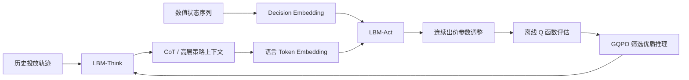
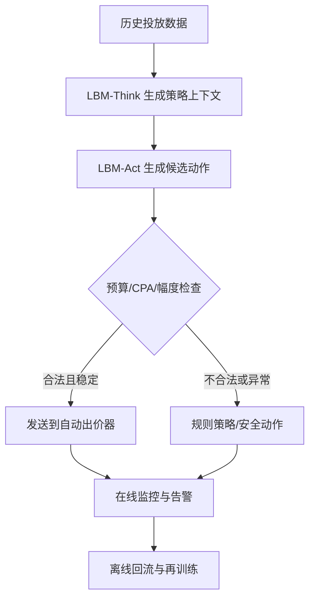

# LBM：怎样将 LLM 推理能力引入自动出价？

> 论文：LBM: Hierarchical Large Auto-Bidding Model via Reasoning and Acting  
> 论文链接：[arXiv](https://arxiv.org/abs/2603.05134)｜[HTML 全文](https://arxiv.org/html/2603.05134v1)｜[代码仓库](https://github.com/yewen99/LBM-WWW26)  
> 发表信息：WWW 2026 论文；arXiv 提交时间为 2026-03-05。  
> 调研重点：LBM 是什么、为什么要做、如何把 LLM 的推理引入自动出价、效果如何、适合什么业务、有什么边界。

---

## 1. 先给结论

LBM（Large Auto-Bidding Model）不是让 LLM 直接对每一次广告曝光输出一个连续竞价，而是把自动出价拆成两个层次：

1. **LBM-Think：**使用较大的语言模型根据近期投放表现生成高层策略解释，例如“预算消耗偏慢、CPA 低于目标，下一阶段可以适当提高出价”；
2. **LBM-Act：**使用较小的决策模型读取数值状态和 Think 产生的推理结果，输出具体的连续出价参数调整。

一句话概括：

> LBM 用 LLM 负责“看懂投放状态并形成策略意图”，用小型数值模型负责“把策略意图转化成精确动作”，再用离线强化学习筛选更有价值的推理轨迹。

这是一种**分层的 Reasoning-and-Acting 自动出价架构**，重点解决的是：传统自动出价模型擅长拟合历史动作，但不容易解释和迁移；LLM 有推理能力，却不适合直接输出连续竞价动作。

需要特别注意：LBM 的“推理”不是天然正确的因果推理，也不是对预算和 CPA 的硬约束证明。它是一种利用语言模型生成高层决策上下文、再由离线 Q 函数筛选的策略增强方法。

---

## 2. 什么是自动出价？

### 2.1 业务背景：广告主不应该手动调每一次竞价

在实时竞价（Real-Time Bidding，RTB）中，广告主会面对大量曝光机会。每次曝光的用户、广告、流量位置和竞争环境都不同，系统需要决定是否参与竞价以及出价多少。

如果由人工逐次决定，无法覆盖百万乃至数十亿级的曝光机会。因此广告平台通常让广告主设置目标，由自动出价系统持续调整出价策略，使投放尽量获得更多转化，同时满足预算、CPA、ROI 等约束。

典型目标包括：

- 在给定预算内最大化转化数；
- 在目标 CPA 下最大化转化量；
- 在 ROAS 约束下提升成交额；
- 在 CPI、CPC、ROI 等目标下平衡规模和效率。

### 2.2 一个抽象的数学形式

把一段投放周期内的曝光机会记为 (i)，决策变量 (o_i) 表示是否获得该机会，(v_i) 表示转化价值，(c_i) 表示成本，则自动出价可以抽象为：

$$
\max \sum_i o_i v_i
$$

同时满足预算约束：

$$
\sum_i o_i c_i \le B
$$

如果有多个 KPI 约束，也可以写成：

$$
\frac{\sum_i c_{ij}o_i}{\sum_i p_{ij}o_i} \le C_j
$$

其中：

- (B)：投放周期预算；
- (p_{ij})：机会 (i) 在 KPI (j) 上的预估结果，例如转化概率；
- (c_{ij})：对应的成本或消耗；
- (C_j)：CPA 等目标约束。

在许多实际系统中，广告平台不会让模型直接学习一套完全自由的出价函数，而是维护一组可解释的 bidding parameters，例如控制不同流量场景的出价强度、价值系数或约束权重。模型每隔一段时间调整这些参数，底层竞价器再根据用户和广告特征计算单次出价。

因此，LBM 论文里更准确的动作不是“每次曝光直接出价”，而是：

> 根据当前投放状态，调整自动出价器中的连续控制参数。

### 2.3 自动出价是一个序列决策问题

投放过程可以划分为 (T) 个时间片。每个时间片包含：

- 当前时间和剩余投放时长；
- 已消耗预算、预算利用率；
- 当前累计转化和转化率；
- 实际 CPA 与目标 CPA 的比值；
- 当前出价参数；
- 过去几个时间片的状态、动作和结果。

在时间 (t)，系统根据状态 (s_t) 选择动作 (a_t)，随后得到结果或奖励 (R_t)：

$$
s_t \rightarrow a_t \rightarrow R_t,s_{t+1}
$$

这与推荐、广告排序不同：推荐模型通常针对一个请求排序候选物品；自动出价还要考虑预算跨时间分配、早期和后期的策略差异，以及 KPI 约束在未来的影响。

---

## 3. 为什么要把 LLM 引入自动出价？

### 3.1 传统自动出价的优势与问题

现有自动出价方法大致可以分为规则/控制方法、监督学习、离线强化学习和序列生成模型。

它们通常有三个优点：

- 数值输入输出效率高；
- 连续动作预测比较自然；
- 适合大规模在线服务。

但也存在一些不足。

#### 3.1.1 问题一：模型会拟合动作，却不一定理解策略原因

监督学习通常学习：

$$
\hat a_t=f_\theta(s_t)
$$

如果历史策略在某个时间段降低了出价，模型可以学习到“类似状态下也降低出价”，但它未必知道原因是预算不足、流量质量下降、CPA 超标，还是历史动作本身受到某个临时规则影响。

这会导致模型在分布外状态、冷启动广告或投放目标变化时泛化不足。

#### 3.1.2 问题二：离线强化学习存在数据覆盖和分布外动作问题

离线强化学习只使用历史轨迹，不与真实环境交互。它需要估计某个动作的长期价值：

$$
Q(s_t,a_t)
$$

但是，历史数据中没有出现过的动作缺少可靠反馈。若 Q 函数对分布外动作过度乐观，策略可能选择看似高价值、实际上不稳定的动作。

#### 3.1.3 问题三：策略难以解释和诊断

自动出价通常受预算、CPA、流量竞争、转化预估和投放节奏共同影响。当线上指标异常时，只知道“模型输出了某个参数”，很难快速回答：

- 为什么提高出价？
- 为什么现在提高，而不是半小时后提高？
- 是因为 CPA 低，还是因为预算消耗太慢？
- 如果继续提高，会不会导致预算提前花完？

这类解释对于业务运营、策略审计和故障诊断很重要。

### 3.2 为什么 LLM 可能有帮助？

LLM 的优势不在于取代高性能数值模型，而在于它能够处理由多种指标组成的上下文，并生成结构化的高层判断：

- 识别预算消耗过快或过慢；
- 识别 CPA 相对目标的变化；
- 比较最近多个时间片的趋势；
- 结合历史动作判断动作是否有效；
- 将复杂状态归纳为“加价、降价、保持、等待更多反馈”等策略意图。

LBM 的核心假设是：

> LLM 生成的高层策略意图可以作为额外的决策上下文，帮助底层模型在相似数值状态下区分不同的策略阶段。

但这个假设必须通过离线数据和价值模型约束，不能直接把 LLM 的自然语言输出当作正确动作。

---

## 4. LBM 的总体架构



LBM 分成两个层次：

| 层次 | 组件 | 输入 | 输出 | 主要职责 |
|---|---|---|---|---|
| 高层 | LBM-Think | 历史 KPI、状态、动作、结果 | CoT 或策略解释 | 理解投放阶段，形成策略意图 |
| 低层 | LBM-Act | 数值状态序列 + CoT | 连续动作 | 将策略意图转化为可执行的参数调整 |
| 价值评估 | IQL / GQPO | 状态、候选动作 | $\Delta Q$ | 判断不同推理带来的动作是否更有价值 |

### 4.1 LBM-Think：高层推理

LBM-Think 使用较大的语言模型根据历史信息生成推理文本。抽象表示为：

$$
c_t=h_\theta(\{p_i,a_i\}_{i=t-H}^{t-1})
$$

其中：

- $p_i$：历史投放 KPI，例如转化、预算利用率、CPA 等；
- $a_i$：历史动作，即出价参数调整；
- (H)：观察窗口；
- $c_t$：第 $t$ 个时间片的推理结果或策略上下文。

它的输出可以包含如下信息：

1. 当前预算消耗速度；
2. 当前 CPA 与目标的关系；
3. 最近动作是否带来改善；
4. 当前应该偏向规模、效率还是节奏控制；
5. 下一步动作的大致方向。

这些信息的作用不是直接替代动作预测，而是为 LBM-Act 提供高层语境。

### 4.2 LBM-Act：低层数值决策

LBM-Act 根据当前数值状态和 Think 输出的 CoT 预测连续动作：

$$
\tilde a_t=f_\phi(s_t,c_t)
$$

在 Decision Transformer 风格的实现中，也可以把回报、状态和历史动作按序列组织：

$$
\{R_{\leq t},s_{\leq t},a_{<t}\}
$$

Act 模块输出的仍然是连续值，而不是自然语言 token。这样可以保留数值模型对精度、边界和服务效率的优势。

### 4.3 Think 可以异步生成

论文强调，Think 不一定必须在每个在线时间点同步运行。由于自动出价参数通常不是每毫秒更新，而是低频更新，Think 可以提前生成下一时间片的高层策略上下文，Act 在真正决策时使用最新状态完成快速推理。

这形成了一个工程上的折中：

- 复杂的 LLM 推理放在较低频或异步链路；
- 当前状态到具体动作的映射由小模型完成；
- 线上热路径不必每次等待大模型完整生成。

---

## 5. LBM 的关键技术点

### 5.1 Dual Embedding：同时编码语言和数值序列

LBM 不能把预算利用率、CPA 比值等数值直接当作普通文本处理，否则会面临数值精度和 token 效率问题。

论文采用双路 embedding：

#### 5.1.1 语言输入

Think 产生的 CoT 使用预训练语言模型原有的 Token Embedding：

$$
e_i^{text}=E_{LLM}(token_i)
$$

#### 5.1.2 数值输入

状态、动作和回报通过 MLP 映射为与语言 token embedding 相同维度的 Decision Embedding：

$$
e_i^{decision}=MLP([R_i,s_i,a_{i-1}])
$$

两种 embedding 在 Transformer 中拼接或交错输入。这样同一个 Transformer 可以同时关注：

- 语言层面的策略解释；
- 数值层面的预算、CPA、转化和动作变化。

### 5.2 两阶段训练

#### 5.2.1 Stage I：语言引导的决策训练

第一阶段的目标是让 Act 学会使用 Think 的推理上下文，同时保持对历史行为的拟合能力。

训练输入包括：

- Think 产生的 CoT；
- 数值序列 ${R_{t-L:t},s_{t-L:t},a_{t-L:t-1}}$；
- 数据集中的真实动作 $a_t$。

基本动作损失为：

$$
L_a=\|\tilde a_t-a_t\|_2
$$

论文还引入了 anchor direction，用历史动作相对前一动作的方向过滤明显冲突的样本。例如，历史动作是上调，而生成的策略解释明确要求下调时，可以将这类冲突样本过滤或降低影响，减少“语言解释与监督动作互相矛盾”的训练噪声。

Stage I 的本质是：

> 先把 LLM 生成的推理作为一种额外条件信息，训练小模型把它映射为连续动作。

#### 5.2.2 Stage II：GQPO 优化 Think

Stage I 训练完成后，LBM-Act 基本固定。Stage II 不再直接用人工检查每条 CoT，而是让多个候选 CoT 经过 Act 产生多个候选动作，然后用离线 Q 函数评价。

对于同一个状态 (s_t)，Think 采样 (N) 个推理：

$$
\{c_t^1,c_t^2,\ldots,c_t^N\}
$$

经过 Act 得到动作：

$$
\tilde a_t^i=f_\phi(s_t,c_t^i)
$$

用离线 Q 函数计算动作相对数据动作的价值差：

$$
\Delta Q_i=Q_\phi(s_t,\tilde a_t^i)-Q_\phi(s_t,a_t)
$$

选择满足正向价值提升的最佳候选：

$$
j=\arg\max_i \Delta Q_i,\quad \text{s.t. }\Delta Q_i>0
$$

再用选出的高价值 CoT 更新 Think。这里的关键不是让 Think 直接学习一个“正确答案”，而是让它逐渐提高生成能够诱导出高价值动作的推理概率。

### 5.3 为什么叫 GQPO？

可以把一段 CoT 看作高层动作，把 Act 产生的连续出价参数看作低层动作：

```text
高层动作：选择怎样理解当前投放状态、采取什么策略方向
低层动作：具体把出价参数调整多少
价值函数：判断该连续动作对长期投放目标是否更有利
```

GQPO 的作用是对同一状态下的多个高层推理进行分组比较，用 $\Delta Q$ 作为相对优势信号。

它的实际价值在于：

- 不需要人工给每条 CoT 标注好坏；
- 不需要进入仿真器或真实广告系统进行在线 rollout；
- 可以利用已有离线投放轨迹训练；
- 能降低直接生成推理时的幻觉和策略偏差。

但它并不意味着 Q 函数一定正确。GQPO 的可靠性取决于离线 Q 估计、候选动作覆盖和状态分布是否足够好。

---

## 6. LBM 相比直接使用 LLM 的优势

### 6.1 不让 LLM 直接输出连续竞价

直接让 LLM 输出一个精确连续动作，会面临：

- 数值格式容易出错；
- 输出需要解析和校验；
- token 级生成速度慢；
- 出价动作可能超出合法范围；
- 语言模型容易生成听起来合理但不符合历史数据的策略。

LBM 让 LLM 输出高层语义，让 Act 输出连续动作。这样语言模型负责它擅长的部分，数值模型负责它擅长的部分。

### 6.2 比纯数值模型多了一层可解释上下文

纯数值模型可以学习指标之间的非线性关系，但难以直接给出可读的策略解释。LBM-Think 可以把近期表现归纳成业务人员能理解的状态描述，从而帮助：

- 运营排查预算消耗异常；
- 分析 CPA 超标原因；
- 解释模型为何调整策略；
- 发现投放周期中“加速、稳态、收缩”等阶段。

需要强调的是，这种解释是模型生成的策略上下文，不等价于因果证明或可审计的真实原因。

### 6.3 比只做行为克隆更能利用长期价值

Stage I 主要学习历史动作，Stage II 使用 Q 函数筛选更高价值的推理，使训练目标从“复现历史动作”扩展为“寻找可能带来更好长期回报的动作”。

这与单纯 SFT 的区别是：

| 方法 | 主要学习目标 |
|---|---|
| Prompting | 依赖通用 LLM 的零样本或少样本推理 |
| SFT | 拟合数据中的历史动作或标签 |
| GRPO | 使用奖励信号优化生成，但不一定有稳定的低层连续动作模块 |
| LLM-DT | 将 LLM 与轨迹建模结合，但数值动作和推理分工可能不够清晰 |
| LBM | Think 生成高层上下文，Act 生成连续动作，再用离线 Q 选择优质推理 |

### 6.4 更适合工程化部署

LBM-Act 使用较小的模型，论文中为 Qwen2.5-0.5B-Instruct；Think 使用 Qwen2.5-3B-Instruct，并且可以异步运行。相比让 3B、7B 甚至更大的 LLM 直接参与所有竞价决策，这种架构更容易满足延迟和服务成本要求。

### 6.5 不需要真实环境 rollout

广告系统直接在线试错的成本很高，错误出价可能造成预算浪费或 CPA 失控。LBM 的 GQPO 只基于离线数据和 IQL 估计的 Q 值进行候选推理筛选，降低了上线前探索的风险。

不过，这同时把风险转移到了离线 Q 函数和数据覆盖上，不能理解为完全没有分布外风险。

---

## 7. LBM 与其他自动出价方法的关系

### 7.1 与规则和控制方法的关系

传统规则系统通常根据预算利用率、CPA 偏差等指标做增减价控制，优点是边界清楚、容易审计，缺点是规则数量多时维护成本高，跨场景迁移能力有限。

LBM 可以理解为学习一种更复杂的高层状态归纳和动作策略，但仍然需要保留规则层做安全兜底。

### 7.2 与监督学习的关系

监督学习依赖历史行为标签，容易把历史策略的缺陷一并学习。LBM 的 Stage I 仍然需要行为克隆式训练来获得稳定动作映射；GQPO 再利用 Q 值做离线策略改进。

因此 LBM 不是完全抛弃监督学习，而是：

> 先用监督信号获得可用策略，再用离线价值信号优化高层推理。

### 7.3 与离线强化学习的关系

IQL、CQL、BCQ 等方法直接在数值状态和动作空间中学习策略或价值。LBM 在其上增加了高层语言推理变量 $c_t$，形成：

$$
\text{历史轨迹}\rightarrow \text{高层推理}\rightarrow \text{连续动作}\rightarrow \text{价值评估}
$$

它的优势是表达层次更丰富，代价是系统更加复杂，并且价值函数要同时承受语言条件和数值动作带来的分布外问题。

### 7.4 与 GRM 的关系

GRM 的重点是显式、可靠地处理预算与 CPA 约束；LBM 的重点是让 LLM 参与高层投放状态理解和策略推理。

两者解决的问题不同：

| 方法 | 主要问题 | 强项 | 主要风险 |
|---|---|---|---|
| GRM | 如何在生成式推荐/决策中满足约束 | 约束显式、可检查、可解码 | 约束机制和模型结构复杂 |
| LBM | 如何利用 LLM 形成高层策略意图 | 推理上下文、策略表达、离线改进 | 不天然保证硬约束 |

一种合理的组合方式是：LBM-Think 产生高层策略建议，Act 输出候选动作，最终由显式预算/CPA 安全层裁剪、投影或拒绝不合法动作。这个组合属于工程扩展，不是 LBM 论文已经验证的结论。

---

## 8. 实验设置：论文到底测了什么？

### 8.1 数据集和任务

论文在 AuctionNet 及其稀疏版本 AuctionNet-sparse 上实验。AuctionNet 是基于真实在线广告平台构建的公开自动出价基准。

论文实验设置包括：

- 21 个 delivery periods；
- 每个 period 约 5,000,000 个 impression opportunities；
- 每个投放轨迹被划分为 48 个时间区间；
- 附录统计约 479,376 条轨迹、9,987 个 delivery periods；
- 状态维度为 16，动作维度为 1；
- Dense 动作范围为 ([0,493])，Sparse 动作范围为 ([0,8178])。

### 8.2 评价指标

#### 8.2.1 Conversions

投放周期内累计转化数，越高越好。

#### 8.2.2 Budget Utilization

$$
\text{Budget Utilization}=\frac{\text{实际消耗预算}}{\text{总预算}}
$$

越接近合理的目标水平越好。它不是越大越好：如果快速花完预算但带来较差 CPA，仍然可能是坏策略。

#### 8.2.3 CPA Ratio

$$
\text{CPA Ratio}=\frac{\text{实际 CPA}}{\text{目标 CPA}}
$$

越低通常越好。小于 1 表示实际 CPA 低于目标，超过 1 表示超出目标。

#### 8.2.4 Score

论文的 Score 同时考虑转化规模和 CPA 约束惩罚，可抽象为：

$$
\text{Score}=\text{Conversions}\times \text{value}\times
\min\left(\left(\frac{1}{\text{CPA Ratio}}\right)^2,1\right)
$$

因此 Score 更接近业务综合目标，不是单纯追求转化量。

### 8.3 模型配置

- LBM-Think：Qwen2.5-3B-Instruct；
- LBM-Act：Qwen2.5-0.5B-Instruct；
- Decision Embedding MLP：([896,896,896])；
- Action Head：([896,896,1])；
- Act 训练约 400k steps；
- AdamW，学习率 (1e-5)，batch size 64，8 张 GPU；
- GQPO 使用 2,000 个样本、每个状态采样 (N=3) 个 CoT；
- GQPO batch size 64，学习率 (1e-6)，训练 5 epochs；
- 实验结果平均 5 次随机运行。

---

## 9. 论文实验结果

### 9.1 与非 LLM 自动出价方法比较

下面是论文 Table 1 的结果。数值为论文报告值，不能理解为在线 A/B 结果。

| 数据集 | 指标 | USCB | CQL | IQL | BCQ | DT | DT-Q | DiffBid | DiffBid-Q | LBM(P) | LBM(GQPO) |
|---|---|---:|---:|---:|---:|---:|---:|---:|---:|---:|---:|
| Dense | Conversions | 267 | 336 | 322 | 321 | 364 | 371 | 316 | 319 | 376 ± 3.0 | **382 ± 3.3** |
| Dense | Score | 157 | 171 | 281 | 270 | 329 | 334 | 214 | 260 | 320 ± 2.2 | **348 ± 2.3** |
| Sparse | Conversions | 28.5 | 30.2 | 36.0 | 31.1 | 31.3 | 33.8 | 31.3 | 31.5 | 37.4 ± 0.3 | **38.5 ± 0.3** |
| Sparse | Score | 17.5 | 22.2 | 30.0 | 30.5 | 29.6 | 31.1 | 23.1 | 25.1 | 32.9 ± 0.2 | **33.4 ± 0.2** |

主要结论：

- LBM(P) 已经超过多数非 LLM 基线；
- GQPO 在 Dense 上将 Score 从 320 提升到 348，在 Sparse 上从 32.9 提升到 33.4；
- GQPO 相比 LBM(P)，Dense Conversions 从 376 提升到 382，Sparse Conversions 从 37.4 提升到 38.5；
- Dense Score 的提升更明显，说明高层推理筛选对综合目标和约束惩罚更有帮助。

### 9.2 与其他 LLM 方法比较

下面是论文 Table 2 的完整核心结果。CPA Ratio 越低越好；Budget Utilization 越接近合理投放节奏越好。

| 方法 | Budget Utilization Dense | Sparse | CPA Ratio Dense | Sparse | Conversions Dense | Sparse | Score Dense | Sparse |
|---|---:|---:|---:|---:|---:|---:|---:|---:|
| Prompting | 0.743 | 0.722 | 0.878 | 0.903 | 289 | 24.2 | 286 | 23.4 |
| SFT | 0.765 | 0.741 | 0.882 | 0.804 | 297 | 27.0 | 286 | 26.9 |
| GRPO | 0.860 | 0.773 | 0.945 | 0.816 | 327 | 29.9 | 292 | 29.7 |
| LLM-DT | 0.902 | 0.861 | 0.936 | 0.847 | 366 | 36.0 | 328 | 32.5 |
| Prompt-LLM-DT | 0.914 | 0.970 | 0.931 | 0.965 | 355 | 35.8 | 322 | 30.3 |
| LBM(P) | **0.981** | 0.956 | 1.02 | 0.901 | 376 | 37.4 | 320 | 32.9 |
| LBM(GQPO) | 0.938 | **0.974** | 0.96 | 0.901 | **382** | **38.5** | **348** | **33.4** |

正确解读：

1. LBM(GQPO) 在 Dense 和 Sparse 的 Conversions、Score 上都是表中最优；
2. LBM(P) 的 Dense Budget Utilization 为 0.981，高于 LBM(GQPO) 的 0.938，但这不代表整体策略更好，因为 Score 还受到 CPA 惩罚和转化价值影响；
3. LBM(P) 的 Dense CPA Ratio 为 1.02，意味着实际 CPA 高于目标，不能声称 LBM 无条件满足 CPA 约束；
4. LBM(GQPO) 的 Dense CPA Ratio 为 0.96，优于 LBM(P)，但仍然不能等同于“显式硬约束保证”；
5. 论文实验是 AuctionNet 离线评估，不是线上真实广告系统 A/B 实验。

### 9.3 延迟结果

论文使用 vLLM 和 H800 测试推理延迟：

| 模块 | 模型规模 | 延迟 |
|---|---:|---:|
| LBM-Think | 3B | 约 2.5s |
| LBM-Think | 7B | 约 3.6s |
| LBM-Think | 32B | 约 8.9s |
| LBM-Act | 0.5B | 约 63ms |

因此 LBM 更适合低频调整的自动出价系统，例如每几分钟、十几分钟或半小时更新一次策略参数，而不适合每次曝光都实时调用大模型。

---

## 10. LBM 的应用场景

### 10.1 CPA 目标投放

广告主设定目标 CPA，系统根据实际 CPA、预算消耗和转化趋势调整出价强度。Think 可以归纳当前处于“效率优先”“规模扩张”还是“预算收缩”阶段，Act 再生成连续调整量。

### 10.2 CPI、CPC、ROAS 等 KPI 优化

LBM 的状态和约束并不局限于 CPA。只要能够将业务目标转化为数值状态，就可以用于：

- App 安装的 CPI 优化；
- 点击目标的 CPC 优化；
- 电商成交额或 GMV 目标；
- ROAS 约束下的预算分配；
- 多目标投放中的规模和效率权衡。

### 10.3 低频策略参数调整

LBM 最自然的应用是 campaign、广告组或流量层级的低频控制：

- 根据最近 30 分钟投放表现调整下一阶段出价参数；
- 在预算消耗过快时降低策略强度；
- 在 CPA 较低且预算消耗不足时逐步放量；
- 在临近投放结束时重新平衡预算节奏。

### 10.4 复杂运营策略辅助

对于需要同时考虑预算、CPA、转化趋势、流量质量和投放阶段的策略，LLM 可以作为高层策略解释器或候选策略生成器，帮助运营人员理解模型状态并缩短策略迭代周期。

### 10.5 离线策略优化和策略审计

LBM 可以先在历史轨迹上运行，比较不同 CoT 诱导出的候选动作和 Q 值，再把高价值策略提交给规则层或仿真环境审查。它适合作为上线前的离线策略优化模块，而不是一开始就直接接管线上出价。

---

## 11. LBM 的限制和适用边界

### 11.1 不提供预算和 CPA 的硬约束保证

这是最重要的限制。

LBM 使用 Q 函数对候选推理和动作进行价值排序，但它不是一个显式约束优化器。即使训练目标中有 CPA、预算等状态，最终生成的动作仍可能导致：

- 预算消耗过快；
- CPA 超出目标；
- 某些阶段动作不稳定；
- Q 函数认为高价值，但真实环境表现不满足约束。

因此，LBM 不能替代安全层。上线时至少需要加入：

- 动作上下界裁剪；
- 预算 pacing 控制；
- CPA 超标降价或熔断；
- 单时间片最大变化幅度；
- 异常状态回退到规则或旧策略；
- 最终动作合法性检查。

### 11.2 离线 Q 函数可能产生错误评价

GQPO 选择的是离线 Q 函数预测的高价值 CoT，而不是实际环境验证过的高价值 CoT。如果候选动作落在历史数据覆盖不足的区域，Q 函数可能产生过估计：

$$
\text{高估的 }Q(s,a)\not\Rightarrow\text{真实环境中的高收益}
$$

这也是离线强化学习中的典型分布外动作问题。

### 11.3 依赖历史数据质量和动作覆盖

如果历史投放策略长期没有尝试某类动作，模型就很难从离线数据判断这些动作的真实效果。特别是以下场景风险更高：

- 新行业或新广告缺少历史轨迹；
- 新 KPI 目标与训练数据不同；
- 预算规模远超训练范围；
- 市场竞争环境发生明显变化；
- 历史策略本身已经严重偏置。

### 11.4 当前主要是离线训练，没有在线持续学习

论文出于广告系统安全考虑采用离线 fine-tuning，没有直接进行真实环境 rollout，也没有展示持续在线训练结果。这使得方法更安全，但也限制了其适应快速变化流量和竞价环境的能力。

### 11.5 LLM 推理不等于可靠因果分析

Think 生成的文本可能具有解释性，但不能直接证明“提高出价一定会提升转化”或“CPA 变化一定由某个因素造成”。自然语言解释可能是：

- 对相关性的总结；
- 对历史动作的复述；
- 基于语言模式生成的合理化描述；
- 没有被数据充分支持的推断。

因此，业务审计不能只看 CoT，还需要结合数值证据、反事实评估或实验结果。

### 11.6 数值精度和动作稳定性仍需额外处理

虽然 Act 负责连续动作，但系统仍需处理：

- 动作范围；
- 归一化和反归一化；
- 连续动作的抖动；
- 过大的单步变化；
- 多时间片动作之间的平滑性。

实际部署中应该增加 action smoothing、变化率限制和安全回退，而不能只依赖模型输出。

### 11.7 极高频场景可能不适用

论文中 Think-3B 约 2.5 秒，Act-0.5B 约 63 毫秒。对于每半小时或几分钟调整一次参数的场景，这个延迟可能可以接受；对于毫秒级、逐曝光决策，Think 的延迟和成本都不可接受。

适合把 LBM 放在：

```text
低频策略层：LBM-Think + LBM-Act
        ↓
高频竞价层：轻量预测模型 + 规则/控制器
```

而不是让 LLM 进入每次曝光的热路径。

### 11.8 论文结果不能直接外推到线上收益

AuctionNet 是公开离线基准，指标提升说明方法在该数据分布下有优势，但不能直接说明：

- 线上收入一定提升；
- CPA 一定稳定满足；
- 在其他广告平台同样有效；
- 大模型部署成本一定低于收益增量。

还需要进行 OPE、反事实评估、仿真、灰度实验和线上 A/B 测试。

---

## 12. 如果要真正落地，建议的安全架构

LBM 适合做“策略建议 + 连续参数生成”，最终动作需要经过显式约束层：



建议至少设置四道保护：

1. **硬边界：**限制动作的绝对范围和单次最大变化量；
2. **约束控制：**基于预算 pacing、CPA 偏差和剩余时间做动作裁剪；
3. **异常回退：**状态缺失、模型超时、CPA 连续超标时回退旧策略；
4. **离线验证：**用 OPE、历史回放、反事实估计和压力测试过滤候选策略。

这样可以把 LBM 的推理能力和传统自动出价系统的可控性结合起来。

---

## 13. 面试时怎么讲这篇论文？

### 13.1 一分钟版本

> LBM 解决的是 LLM 不适合直接做连续自动出价的问题。它把决策拆成 Think 和 Act 两层：Think 使用较大的 LLM 根据预算消耗、CPA、转化等历史投放信息生成高层策略上下文，Act 使用较小的数值模型融合 CoT 和状态序列，输出连续的出价参数调整。训练上先用历史动作做语言引导的行为训练，再用 IQL 估计 Q 值，对同一状态下的多个 CoT 进行分组比较，选出能诱导更高价值动作的推理，用 GQPO 更新 Think。AuctionNet 上 LBM(GQPO) 的 Dense Score 为 348、Sparse Score 为 33.4，优于 LBM(P) 的 320 和 32.9，也优于论文中的其他基线。但它不提供预算和 CPA 的硬约束保证，依赖离线 Q 函数和数据覆盖，线上仍需要安全控制层。

### 13.2 面试官问“为什么不用 LLM 直接输出 bid？”

可以回答：

> 自动出价的动作是连续数值，直接让 LLM 生成会遇到数值精度、格式解析、动作边界、延迟和成本问题。LBM 让 LLM 生成高层策略语义，让轻量 Act 模型输出连续动作，兼顾推理表达能力和数值决策效率。

### 13.3 面试官问“GQPO 解决了什么？”

可以回答：

> Stage I 主要让 Act 学会利用 Think 的 CoT 复现历史动作，但 CoT 可能有幻觉或与动作冲突。GQPO 对同一状态采样多个 CoT，经 Act 转成多个候选连续动作，再用离线 Q 函数计算相对价值 (Delta Q)，选择正向价值最高的推理更新 Think。它不需要在线 rollout，但可靠性依赖 Q 函数准确性和离线数据覆盖。

### 13.4 面试官问“它是不是能保证 CPA 不超标？”

正确回答：

> 不能把 LBM 说成硬约束优化方法。论文实验中的 CPA Ratio 只是评价指标，LBM(P) 在 Dense 上为 1.02，说明实际 CPA 高于目标；LBM(GQPO) 为 0.96，表现更好，但仍不是形式化保证。工程上应在 LBM 后面增加预算 pacing、CPA 约束检查、动作裁剪和策略回退。

### 13.5 面试官问“这篇论文真正的创新点是什么？”

建议概括为三点：

1. **结构创新：**将 LLM 高层推理与小模型低层连续动作解耦；
2. **输入创新：**通过 Dual Embedding 在同一 Transformer 中融合语言 CoT 和数值决策序列；
3. **训练创新：**用 GQPO 将离线 Q 价值反馈传递给 Think，筛选更有价值的推理，而不进行真实环境 rollout。

不要把“使用 Qwen”或“把数据转成 prompt”单独说成主要创新。

---

## 14. 一份更严谨的项目/简历表述

如果你确实复现了该思路，可以写成：

**LBM 风格的分层生成式自动出价系统｜AuctionNet**

- **分层决策架构：**针对 LLM 难以稳定输出连续竞价参数的问题，拆分 LBM-Think 与 LBM-Act：利用大模型根据预算消耗、CPA 偏差、转化趋势及历史动作生成高层策略上下文，由轻量数值模型融合 CoT 和状态序列输出连续出价调整。
- **数值-语言融合：**设计 Dual Embedding，将 CoT 映射为语言 Token 表征，将回报、状态和历史动作通过 MLP 映射为同维 Decision Embedding，统一输入 Transformer 建模策略语义与投放动态。
- **离线策略优化：**先通过行为克隆训练 Act 学习历史动作，再基于 IQL 估计候选动作的相对价值，以 GQPO 对同一状态下多条 CoT 进行筛选，降低推理幻觉与语言-动作冲突。
- **安全控制与评估：**在模型输出后增加动作范围、变化率、预算 pacing 和 CPA 超标回退机制，并从 Conversions、Budget Utilization、CPA Ratio、Score 等指标对比 DT、IQL、CQL 及 LLM-DT 基线。

如果没有真实实现 GQPO、Q 函数或线上安全控制，不要写成“实现了完整 LBM”。可以改为：

> 复现 LBM 的 Think-Act 分层框架，完成语言策略上下文与连续动作模型的离线联合建模，并设计基于离线 Q 价值的候选策略筛选实验。

---

## 15. 最终评价

LBM 的合理定位不是“用 LLM 替换自动出价器”，而是：

> 用 LLM 提供高层策略理解，用轻量模型保证连续动作输出，用离线价值函数筛选推理，用显式安全层保证线上约束。

它的主要价值是提高复杂投放状态下的策略表达、可解释性和离线策略改进能力；它的主要短板是不能天然保证预算和 CPA 约束，并且依赖离线数据、Q 函数质量和合理的部署频率。

如果把它用于实际系统，最稳妥的架构是 **LBM 做高层策略，传统控制器/约束优化做安全执行，高频模型做曝光级竞价**。如果把它用于论文或简历，应该明确写出 AuctionNet 离线实验，不要把离线 Score 提升包装成线上业务收益。

---

## 16. 参考资料

1. [LBM: Hierarchical Large Auto-Bidding Model via Reasoning and Acting — arXiv](https://arxiv.org/abs/2603.05134)
2. [LBM 论文 HTML 全文](https://arxiv.org/html/2603.05134v1)
3. [LBM-WWW26 官方代码仓库](https://github.com/yewen99/LBM-WWW26)
