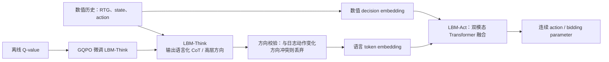

---
tags:
  - 自动出价
  - LLM
  - LBM
  - Offline-RL
  - 论文精读
created: 2026-07-28
---

# LBM：怎样将 LLM 推理能力引入自动出价？

论文：[LBM: Hierarchical Large Auto-Bidding Model via Reasoning and Acting](https://arxiv.org/abs/2603.05134)  
PDF：[作者公开版本](https://personal.ntu.edu.sg/boan/papers/WWW26_LBM.pdf)  
会议：WWW 2026

> **一句话总结：** LBM 不让一个 LLM 同时承担“解释复杂状态”和“输出精确连续出价”两件事，而是分为 LBM-Think 与 LBM-Act：前者把数值历史转化为高层推理/方向，后者用双嵌入融合语言与数值序列，生成连续动作；再用 GQPO 以离线 Q 值微调 Think，减少幻觉和错误推理。
![[Pasted image 20260730172728.png]]

## 按 Figure 1 的符号走完 LBM 全流程，逐一解释图中的模块、箭头与变量

Figure 1 展示的是两个训练阶段，不是单次线上推理。左边 Stage I 先训练低层 LBM-Act，使它能把语言 CoT 与数值轨迹融合为精确连续动作；右边 Stage II 固定 Act，用离线 Q 值筛选有决策价值的 CoT，再只更新高层 LBM-Think。雪花表示该阶段冻结，火焰表示该阶段训练。

$$
\underbrace{\{p_i,a_i\}_{i=t-H:t-1}}_{\text{压缩历史表现}}
\xrightarrow{\text{LBM-Think}}c_t\;(\text{CoT})
\quad+\quad
\underbrace{\{R_{t-L:t},s_{t-L:t},a_{t-L:t-1}\}}_{\text{DT 数值序列}}
\xrightarrow{\text{LBM-Act}}\tilde a_t.
$$

Think 提供语言化的高层方向；Act 才负责输出精确的连续 bidding-parameter action。前者不直接下单，后者也不只依靠语言做数值控制。

### 1. 先认清 Figure 1 的基础符号

| 符号 | 含义 | 图中的角色 |
|---|---|---|
| $p_i$ | 历史投放表现的压缩指标，如转化、预算利用率、CPA。 | Think 的输入，供其低频总结趋势与调参方向。 |
| $s_t$ | 当前细粒度数值状态，如曝光价值分布、拍卖状态、预算和 KPI 状态。 | Act 的数值输入，支撑精确控制。 |
| $a_t$ | 当前时间片对 bidding parameters $\lambda_j$ 的调整，通常是连续向量。 | 离线数据集的动作标签。 |
| $\tilde a_t$ | Act 预测的连续动作。 | Stage I 与 $a_t$ 做监督；Stage II 用它计算相对 Q。 |
| $R_t$ | Decision Transformer 风格的 return-to-go。 | 与 $s,a$ 共同组成数值决策序列；不要和单步 reward $r_t$ 混淆。 |
| $H,L$ | Think、Act 使用的历史窗口长度。 | $H$ 面向高层总结，$L$ 面向细粒度数值决策。 |
| $c_t$ / CoT | Think 生成的 chain of thought。 | 表达状态和高层增减方向，不是最终 bid。 |

例如 Think 可以总结“预算消耗慢、CPA 低于目标、剩余时间不多，因此可适度提高参数”。Act 还会读取 RTG、当前价值分布和过去动作，再决定精确的 $\tilde a_t$。

### 2. 左半 Stage I：双 embedding 怎样走到动作损失？

左上 History performance & actions 来自离线数据 $\{p_{<t},a_{<t}\}$，先输入带雪花的 Think 生成 CoT；此阶段 Think 冻结，因此连续动作 MSE 不会直接扰乱其语言推理能力。

CoT 经带雪花的 Token Embedding Layer，使用预训练 LLM 的语言 token embedding。另一条橙色路径是数值序列：

$$
(R_{t-L},s_{t-L},a_{t-L},\ldots,R_t,s_t).
$$

最末没有 $a_t$，因为它是当前要预测的标签。每个数值项经 Decision Embedding Layer 的 MLP 映射成与语言 token 同维的向量；这避免把大量浮点数硬写成文字 token。

两路 embedding 一起进入由 LLM 初始化的 Transformer Layers，attention 在 CoT 与数值 token 间融合信息。带火焰的 LBM-Act 与右下动作 MLP/head 会更新，输出紫色的 $\tilde a_t$，再和灰色 dataset action $a_t$ 计算：

$$
\mathcal L_a(\phi)=\|\tilde a_t-a_t\|_2.
$$

因此 Stage I 的目标是：固定 Think，训练 Act 在数值历史加上 CoT 指导下精确模仿连续日志动作。论文将 Think 与 Act 设为独立 backbone，可让 Think 更大、Act 更小。

### 3. 图上没单画的 anchor direction：CoT 如何不和动作标签打架？

论文比较日志动作 $a_t$ 相对 $a_{t-1}$ 的变化方向，将其作为 anchor direction。若 CoT 建议的方向与之冲突，就忽略冲突的 reasoning 部分；接受的 CoT 才进入语言 embedding。

例如日志标签本轮应下调，CoT 却说“提高出价”，强行融合会让 Act 同时接到相反的条件和标签。这个过滤不意味着日志永远最优，只是避免监督训练中的符号级冲突。

### 4. 右半 Stage II：一组 CoT 如何成为 GQPO 的训练样本？

此时右上 LBM-Think 带火焰、可以更新。针对同一段历史，它采样多个候选：

$$
\{c_t^1,c_t^2,\ldots,c_t^N\}.
$$

图中蓝色 $\Delta Q_1,\Delta Q_2,\ldots,\Delta Q_N$（字体小，容易看成 $\Omega_i$）是每条 CoT 的相对 Q 值，而不是 Think 自己给出的文本分数。Rules 框选择：

$$
j=\arg\max_i\Delta Q_i,\qquad \Delta Q_i>0.
$$

绿色 $\mathrm{CoT}_j$ 就是组内正向且最优、用于更新 Think 的 reasoning。

### 5. 右下虚线框：$\Delta Q_i$ 是怎样产生的？

每个候选 $\mathrm{CoT}_i$ 会和同一条数值序列一起送入**冻结的** LBM-Act，得到 $\tilde a_t^i$。再用 IQL 在离线日志上训练的 Q-function，与数据集动作 $a_t$ 比较：

$$
\Delta Q_i=Q_\varphi(s_t,\tilde a_t^i)-Q_\varphi(s_t,a_t).
$$

图中的 $Q$ 与 $\hat Q$ 分别对应对 dataset action 和 CoT 诱导 action 的价值评估。$\Delta Q_i>0$ 的意思是：在离线 Q 估计器看来，这条 CoT 让 Act 的连续动作优于数据集参照动作。奖励的不是 CoT 文笔，而是它经 Act 改变动作后带来的预计价值。

Stage II 中 Act 必须保持雪花冻结；不然 $\Delta Q_i$ 的变化可能来自 Act 自己漂移，而无法正确归因给 Think 的 reasoning。

### 6. GQPO 到底优化谁？

GQPO 把 CoT 看成 Think 这个高层 policy 的动作，把 $\Delta Q$ 看成相对 advantage。每组只保留 $\mathrm{CoT}_j$，提高 Think 在同样历史下生成它的概率：

$$
\mathcal J_{\mathrm{GQPO}}
\propto\mathbb E\big[\log h_\theta(c_t^j\mid\text{history})\big].
$$

完整数据流是：同一历史 → Think 采样 $N$ 条 CoT → 每条 CoT 经冻结 Act 变成连续动作 → 离线 Q 得到 $\Delta Q_i$ → 选正向最大的 $\mathrm{CoT}_j$ → 只更新 Think。

它不要求将新策略送入模拟器或线上 rollout；但可靠性仍取决于 IQL Q-function 和数据覆盖。若 CoT 诱导动作远离日志分布，$\Delta Q_i$ 也可能不可靠。

### 7. 把 Figure 1 串成训练与线上推理闭环

**Stage I**：冻结 Think 与语言 token embedding；生成并筛选 CoT；Act 融合 CoT embedding 和 DT 数值 embedding；以 $\mathcal L_a$ 训练 Act 拟合连续 dataset action。

**Stage II**：冻结 Act；Think 为同一历史采样多条 CoT；Act 将每条 CoT 转为动作；离线 Q 得到 $\Delta Q_i$；选 $\mathrm{CoT}_j$，用 GQPO 只更新 Think。

**线上**：Think 可根据较长、压缩的历史异步预先生成 CoT；当前 tick 到来时，较小的 Act 融合最新数值窗口与该 CoT，快速输出 $\tilde a_t$。这就是论文同时利用 LLM 高层推理、连续动作精度和工业低时延的方式。

## 1. 带着什么问题读？

**问题：怎样把 LLM 的推理能力引入自动出价？**

普通 DT/DiffBid 能处理数值轨迹，却很难显式说明“预算几乎没花、时间只剩三分之一、近期转化下降，所以应该保守还是激进”。直接让大语言模型输出连续 multiplier 又有三个风险：

- LLM 擅长离散文本，不天然擅长精确浮点动作；
- 数值状态和自然语言 token 的表示空间不同；
- LLM 可能产生看似合理、但脱离真实数据行为分布的推理（hallucination）。

LBM 的设计原则是：**把“想清楚”与“数值执行准确”拆开。**

## 2. 总体结构：Think 给方向，Act 给动作

### 2.1 LBM-Think：不是直接替你下单

Think 接收任务描述、历史投放表现、约束与状态，生成类似“当前预算消耗明显滞后，但后续剩余时间不多；可适度提高出价系数，同时关注 CPA”的高层 reasoning。

论文并不把这段文本直接当最终动作。这样做是为了保留 LLM 的任务理解和推理优势，却避免把整数/浮点精度交给语言生成。

### 2.2 方向锚定：先防止语言推理与数据行为冲突

论文将数据集中 $a_t$ 相对 $a_{t-1}$ 的变化方向作为 anchor。若 Think 的推理方向与该 anchor 冲突，就舍弃这部分 CoT；接受的 reasoning 才和数值序列一起输入 Act。

这一步很重要：它不声称 LLM 的语言理由天然正确，而是让历史数据对 LLM 的高层建议施加一道安全约束。

### 2.3 LBM-Act：双嵌入，而非把数字硬写成文本

Act 的数值输入仍是 DT 风格的：

$$
\{R_{t-L:t},s_{t-L:t},a_{t-L:t-1}\}.
$$

论文为数值项增加 decision embedding，为 CoT 使用预训练语言 token embedding；二者经 Transformer attention 融合后输出连续动作。这样 LLM 的预训练层得到的是“语言语义 + 结构化数值表示”，而不是把 `CPA=8.23` 生硬拆成字符后期待其自然理解。

## 3. GQPO：怎样微调 Think 而不需要线上试错？

论文提出 GQPO（基于离线 Q-value 的强化学习微调）来提升 Think 的决策能力，目标是缓解 LLM 幻觉，同时避免在线 rollout 的成本和风险。

应当抓住其角色，而不要把它泛化成“所有 LLM RL 都安全”：GQPO 用离线价值评价作为训练信号来改进 Think；其可靠性仍取决于 Q 值估计和数据覆盖。LBM 的工程取舍是把大模型的推理成本与高频精确动作生成分层，而不是让一个模型在每个时间片端到端地自由生成。

## 4. 它相对于前四篇的增量

| 之前的主线 | LBM 新增的能力 |
|---|---|
| DT：数值轨迹条件化生成 | 将任务状态组织成可推理的语言解释 |
| AIGB：整段条件轨迹 | 不只依赖数值目标，也利用高层语义方向 |
| GAVE：价值引导探索 | 用离线 Q 信号改进高层 reasoning |
| GRM：预测响应再控制 | LBM 关注“推理+行动”结构，本身不等同于 GRM 的显式约束求根 |

因此不能说 LBM 已经替代 GRM：两者重点不同。一个合理的系统设想是 LBM-Think 提供高层方向、GRM/MPC 作为最终约束执行器，但这属于延伸设计，不是本文已验证的架构。

## 5. 论文实验应怎么看？

论文在 AuctionNet 的 dense/sparse conversions 设置上，对比了 CQL、IQL、BCQ、DT、DiffBid 及其 Q 变体，也比较了 prompting、SFT、GRPO、LLM-DT、Prompt-LLM-DT。公开 PDF 的表中，LBM(P) 与 LBM(GQPO) 在多个 conversion/score 指标上优于这些对比方法；GQPO 版本进一步改善部分表现。论文使用 Qwen2.5-3B-Instruct 作为相关 LLM 方法的基础模型，以控制比较成本。[论文PDF](https://personal.ntu.edu.sg/boan/papers/WWW26_LBM.pdf)

这些证据支持“在该 benchmark 和设定下，分层推理/行动有收益”；它们不自动证明 LLM 已能在所有生产广告系统中替代控制器。论文公开内容侧重离线/仿真评估，阅读时应单独确认是否有线上部署证据。

## 6. 总结

> LBM 的关键不是让 LLM 直接输出 bid，而是分层：LBM-Think 负责把历史数值状态和任务约束解释为高层方向，LBM-Act 通过双 embedding 融合 CoT 与 DT 风格数值轨迹，并输出精确连续动作。为避免语言模型幻觉，论文以历史动作变化方向作为锚点过滤冲突 reasoning，并用基于离线 Q 值的 GQPO 微调 Think。它展示了 LLM 在自动出价中的合理位置是提供结构化推理和泛化先验，而不是取代低层数值控制与约束机制。
