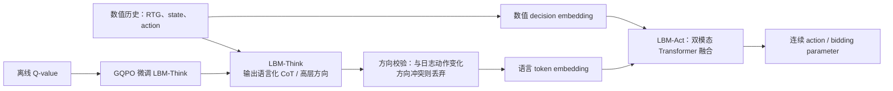

---
tags:
  - 自动出价
  - LLM
  - LBM
  - Offline-RL
  - 论文精读
created: 2026-07-28
---

# LBM：怎样将 LLM 推理能力引入自动出价？

论文：[LBM: Hierarchical Large Auto-Bidding Model via Reasoning and Acting](https://arxiv.org/abs/2603.05134)  
PDF：[作者公开版本](https://personal.ntu.edu.sg/boan/papers/WWW26_LBM.pdf)  
会议：WWW 2026

> **一句话总结：** LBM 不让一个 LLM 同时承担“解释复杂状态”和“输出精确连续出价”两件事，而是分为 LBM-Think 与 LBM-Act：前者把数值历史转化为高层推理/方向，后者用双嵌入融合语言与数值序列，生成连续动作；再用 GQPO 以离线 Q 值微调 Think，减少幻觉和错误推理。

## 1. 带着什么问题读？

**问题：怎样把 LLM 的推理能力引入自动出价？**

普通 DT/DiffBid 能处理数值轨迹，却很难显式说明“预算几乎没花、时间只剩三分之一、近期转化下降，所以应该保守还是激进”。直接让大语言模型输出连续 multiplier 又有三个风险：

- LLM 擅长离散文本，不天然擅长精确浮点动作；
- 数值状态和自然语言 token 的表示空间不同；
- LLM 可能产生看似合理、但脱离真实数据行为分布的推理（hallucination）。

LBM 的设计原则是：**把“想清楚”与“数值执行准确”拆开。**

## 2. 总体结构：Think 给方向，Act 给动作

### 2.1 LBM-Think：不是直接替你下单

Think 接收任务描述、历史投放表现、约束与状态，生成类似“当前预算消耗明显滞后，但后续剩余时间不多；可适度提高出价系数，同时关注 CPA”的高层 reasoning。

论文并不把这段文本直接当最终动作。这样做是为了保留 LLM 的任务理解和推理优势，却避免把整数/浮点精度交给语言生成。

### 2.2 方向锚定：先防止语言推理与数据行为冲突

论文将数据集中 $a_t$ 相对 $a_{t-1}$ 的变化方向作为 anchor。若 Think 的推理方向与该 anchor 冲突，就舍弃这部分 CoT；接受的 reasoning 才和数值序列一起输入 Act。

这一步很重要：它不声称 LLM 的语言理由天然正确，而是让历史数据对 LLM 的高层建议施加一道安全约束。

### 2.3 LBM-Act：双嵌入，而非把数字硬写成文本

Act 的数值输入仍是 DT 风格的：

$$
\{R_{t-L:t},s_{t-L:t},a_{t-L:t-1}\}.
$$

论文为数值项增加 decision embedding，为 CoT 使用预训练语言 token embedding；二者经 Transformer attention 融合后输出连续动作。这样 LLM 的预训练层得到的是“语言语义 + 结构化数值表示”，而不是把 `CPA=8.23` 生硬拆成字符后期待其自然理解。

## 3. GQPO：怎样微调 Think 而不需要线上试错？

论文提出 GQPO（基于离线 Q-value 的强化学习微调）来提升 Think 的决策能力，目标是缓解 LLM 幻觉，同时避免在线 rollout 的成本和风险。

应当抓住其角色，而不要把它泛化成“所有 LLM RL 都安全”：GQPO 用离线价值评价作为训练信号来改进 Think；其可靠性仍取决于 Q 值估计和数据覆盖。LBM 的工程取舍是把大模型的推理成本与高频精确动作生成分层，而不是让一个模型在每个时间片端到端地自由生成。

## 4. 它相对于前四篇的增量

| 之前的主线 | LBM 新增的能力 |
|---|---|
| DT：数值轨迹条件化生成 | 将任务状态组织成可推理的语言解释 |
| AIGB：整段条件轨迹 | 不只依赖数值目标，也利用高层语义方向 |
| GAVE：价值引导探索 | 用离线 Q 信号改进高层 reasoning |
| GRM：预测响应再控制 | LBM 关注“推理+行动”结构，本身不等同于 GRM 的显式约束求根 |

因此不能说 LBM 已经替代 GRM：两者重点不同。一个合理的系统设想是 LBM-Think 提供高层方向、GRM/MPC 作为最终约束执行器，但这属于延伸设计，不是本文已验证的架构。

## 5. 论文实验应怎么看？

论文在 AuctionNet 的 dense/sparse conversions 设置上，对比了 CQL、IQL、BCQ、DT、DiffBid 及其 Q 变体，也比较了 prompting、SFT、GRPO、LLM-DT、Prompt-LLM-DT。公开 PDF 的表中，LBM(P) 与 LBM(GQPO) 在多个 conversion/score 指标上优于这些对比方法；GQPO 版本进一步改善部分表现。论文使用 Qwen2.5-3B-Instruct 作为相关 LLM 方法的基础模型，以控制比较成本。[论文PDF](https://personal.ntu.edu.sg/boan/papers/WWW26_LBM.pdf)

这些证据支持“在该 benchmark 和设定下，分层推理/行动有收益”；它们不自动证明 LLM 已能在所有生产广告系统中替代控制器。论文公开内容侧重离线/仿真评估，阅读时应单独确认是否有线上部署证据。

## 6. 面试话术

> LBM 的关键不是让 LLM 直接输出 bid，而是分层：LBM-Think 负责把历史数值状态和任务约束解释为高层方向，LBM-Act 通过双 embedding 融合 CoT 与 DT 风格数值轨迹，并输出精确连续动作。为避免语言模型幻觉，论文以历史动作变化方向作为锚点过滤冲突 reasoning，并用基于离线 Q 值的 GQPO 微调 Think。它展示了 LLM 在自动出价中的合理位置是提供结构化推理和泛化先验，而不是取代低层数值控制与约束机制。

