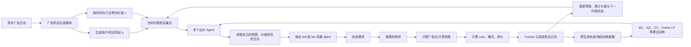
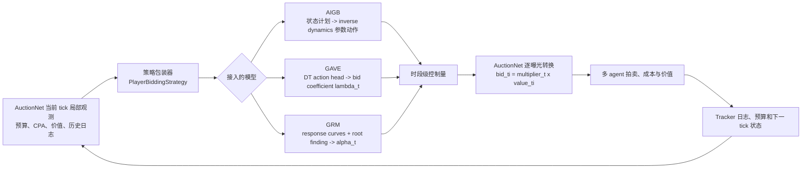

---
tags:
  - 自动出价
  - AuctionNet
  - 多智能体
  - Offline-RL
  - 仿真环境
created: 2026-08-10
---

# AuctionNet：自动出价仿真与大规模竞价基准

论文：[AuctionNet: A Novel Benchmark for Decision-Making in Large-Scale Games](https://arxiv.org/abs/2412.10798)  
代码：[alimama-tech/AuctionNet](https://github.com/alimama-tech/AuctionNet)  
会议：NeurIPS 2024，Datasets and Benchmarks Track  

> **一句话总结：** AuctionNet 不是一个单独的 bid policy，而是一套用于研究自动出价的“环境、数据和基线”组合。它把广告竞价拆成广告机会生成、多个出价 agent、拍卖分配和状态更新四个环节，再提供大规模预生成轨迹和 PID、Online LP、IQL、BC、Decision Transformer 等基线，让不同算法在同一竞争环境中比较。

## 1. 它到底解决什么问题？

自动出价不是“看到一个 PV 就输出一个 bid”。一个广告主要在连续到来的大量机会中，在预算、CPA/ROI 等约束下决策；同时其他广告主也在出价，竞争者动作会改变自己的获胜率、成本和后续预算。真实平台数据和在线交互通常不方便公开，因此研究者缺少同时具备**长时序、预算约束、多人竞争、可复现实验**的环境。

AuctionNet 的目标是提供一个接近真实广告平台结构、又能公开使用的 benchmark：

1. 用真实广告数据训练深度生成网络，生成不直接暴露原始用户数据的广告机会；
2. 让多个不同策略的 auto-bidding agent 同时参与竞价；
3. 用可替换的拍卖模块计算赢家、广告位、支付成本和曝光结果；
4. 将结果累积成可供 offline RL、序列模型、运筹优化和多智能体算法使用的轨迹。

论文把问题建模为大规模博弈中的决策问题，而不是单智能体、单步 contextual bandit：AuctionGym 主要忽略多轮预算变化，AdCraft 的竞争者策略来自参数化分布，AuctionNet 试图同时保留预算反馈与多 agent 动态。

## 2. 一张图看完整链路



这条链路有两个方向：

- **仿真方向：** 机会生成 → agent 出价 → 拍卖 → 结果 → 状态更新 → 下一时段；
- **离线训练方向：** 逐机会记录 → 聚合为时序轨迹 → 训练新 bidding policy → 放回环境闭环评估。

AuctionNet 的核心不是静态预测指标，而是让策略真正进入有预算消耗和竞争反馈的闭环。

## 3. 决策问题形式化

### 3.1 POSG：每个广告主只看到局部信息

论文用 Partially Observable Stochastic Game（POSG）表示自动出价：

$$
\mathcal{M}=\{S,A,P,\mathbf r,\gamma,Z,O,I,T\}.
$$

| 符号 | 含义 | AuctionNet 中的直觉 |
|---|---|---|
| $I$ | agent 集合 | 广告主/自动出价器集合 |
| $S$ | 全局状态 | 所有广告主预算、当前机会、广告主信息、价值矩阵 |
| $A$ | 联合动作 | 所有 agent 同时给出的出价 |
| $P$ | 状态转移 | 竞价结果如何改变预算和历史日志 |
| $\mathbf r$ | 联合奖励 | 每个广告主获得的价值/成本指标 |
| $Z$ | 观测空间 | 单个广告主能够看到的信息 |
| $O$ | 观测映射 | 将全局状态隐藏成每个 agent 的局部视图 |
| $T$ | horizon | 一个投放周期的决策时段数 |

全局状态为：

$$
s=(\mathbf\omega,\mathbf u,\mathbf q,\mathbf v),
$$

- $\mathbf\omega$：所有 agent 的预算；
- $\mathbf u$：当前广告机会特征；
- $\mathbf q$：广告主特征，论文中简化为行业类别；
- $\mathbf v=\{v_{ij}\}$：价值矩阵，$v_{ij}$ 是机会 $j$ 对 agent $i$ 的价值。

agent $i$ 的局部观测为：

$$
o_i=(\omega_i,\mathbf u_i,q_i,\mathbf v_i).
$$

它通常不知道竞争者的剩余预算和内部策略。若把全部 agent 的预算与动作直接暴露给模型，就不再是论文设定的部分可观测环境。

### 3.2 动作、bid 和结果

自动出价常用“出价与机会价值成比例”的形式。agent $i$ 的动作是系数 $\alpha_i$：

$$
\mathbf b_i=(b_{i1},\ldots,b_{im})=(\alpha_i v_{i1},\ldots,\alpha_i v_{im}),
$$

其中 $m$ 是当前时段的机会数量。动作可以是时段级 multiplier，不必为每个 PV 单独预测一个完全独立的 bid。

拍卖后：

$$
x_{ij}=\begin{cases}
1,&\text{agent }i\text{ 赢得机会 }j,\\
0,&\text{否则}.
\end{cases}
$$

agent $i$ 的奖励和预算更新为：

$$
r_i(s,\mathbf a)=\sum_{j=1}^{m}x_{ij}v_{ij},
\qquad
\omega_i'=\omega_i-\sum_{j=1}^{m}x_{ij}c_{ij}.
$$

这里 $c_{ij}$ 是赢得并展示机会 $j$ 时需要支付的成本。实际日志还会记录广告位、曝光、转化等字段，成本是否产生取决于拍卖和曝光规则。

### 3.3 默认预算约束目标 BCB

Budget Constrained Bidding（BCB）在预算不超过 $\omega_i$ 的条件下最大化获得价值：

$$
\max_{\{\alpha_i^t\}}
\sum_{t=1}^{T}\langle\mathbf x_i^t,\mathbf v_i^t\rangle
\quad\text{s.t.}\quad
\sum_{t=1}^{T}\langle\mathbf x_i^t,\mathbf c_i^t\rangle\leq\omega_i.
$$

论文说明，环境通过忽略超过 agent 当前预算的 bid 来保证预算约束，因此 BCB 是 AuctionNet 的默认任务。

## 4. 一个时间步怎样运行？

### 4.1 机会生成

环境先采样当前时段的机会数 $m$。这个数量来自基于真实广告统计得到的内部分布，而不是固定每个时段都有同样多的 PV。随后生成：

$$
\mathbf u=(u_1,\ldots,u_m),\qquad
\mathbf v=\{v_{ij}\}_{i=1,j=1}^{n,m}.
$$

每个机会有一份用户/机会特征 $u_j$，但它对不同广告主的价值 $v_{ij}$ 可以不同。

### 4.2 多 agent 同时出价

每个 agent 根据机会特征、行业类别、剩余预算和历史日志输出动作。若动作是 $\alpha_i$，则所有机会的出价为 $b_{ij}=\alpha_i v_{ij}$。研究者可以只控制一部分 agent，其他 agent 作为竞争者保留固定或预训练策略。

### 4.3 拍卖与状态推进

拍卖模块收集所有 bid，按 auction rule 排序，分配广告位并计算支付成本；Tracker 记录逐机会结果。每个 agent 得到价值、成本、赢标/曝光/转化结果及新 auction logs，预算被更新，下一时段重复整个流程。episode 结束后，Tracker/PlayerAnalysis 汇总价值、成本、CPA、ROI/ROAS 等指标。

## 5. 广告机会生成模块

### 5.1 输入与输出

论文把真实投放数据拆成四类：广告机会特征、广告主特征、机会时间、该机会对特定广告主的价值。模型重点生成机会特征 $u$，再结合行业类别 $q$ 和时间 $u^{\text{time}}$ 预测价值 $v$。

它不是“给某个广告主直接生成最终 bid”，而是先生成可供多个 agent 竞争的机会，再给每个 agent 计算该机会的价值。

### 5.2 第一阶段：latent diffusion 生成机会特征

直接在原始特征空间去噪可能得到不合理值，例如负的消费金额。因此 AuctionNet 借鉴 LDM：先编码到低维 latent，再在 latent 空间扩散/去噪，最后解码回原始特征。

编码器输出：

$$
g_\phi(u_k)=(\mu_k,\sigma_k),\qquad
y_k\sim\mathcal N(\mu_k,\sigma_k^2).
$$

decoder 重构：

$$
h_\psi(y_k)=\tilde u_k.
$$

训练约束：

$$
\mathcal L_{\text{recons}}
=\frac1K\sum_{k=1}^{K}\left\|u_k-h_\psi(y_k)\right\|_2^2,
$$

$$
\mathcal L_{\text{reg}}
=\frac1K\sum_{k=1}^{K}
D_{\mathrm{KL}}\left(\mathcal N(\mu_k,\sigma_k^2)\middle\|\mathcal N(0,1)\right).
$$

扩散网络学习噪声预测：

$$
\mathcal L_{\text{LDM}}
=\frac1K\sum_{k=1}^{K}
\left\|\epsilon_k-\epsilon_\theta(y_{k,p_k},p_k)\right\|_2^2,
\qquad \epsilon_k\sim\mathcal N(0,1).
$$

生成时，从标准高斯噪声 $\bar y$ 开始，经过 $p_{\max}$ 次反向去噪得到 $\tilde y$，再解码：

$$
\tilde u=h_\psi(\tilde y).
$$

**不要混淆训练和生成：**前向加噪是固定的训练过程；生成新机会时执行的是从噪声到 latent 的反向去噪，再经 decoder 得到 $u$。这和 AIGB 生成出价轨迹的 diffusion 不同：AuctionNet 的 diffusion 生成广告机会特征，AIGB 的 diffusion 生成策略轨迹。

### 5.3 第二阶段：按行业和时间预测价值

价值预测器输入机会特征 $u_k$、广告主行业 $q_k$ 和机会时间 $u_k^{\text{time}}$，用 cross-attention 与 self-attention 融合：

```text
time -> query，opportunity -> key/value -> z(1)
z(1) -> self-attention -> z(2)
category -> query，z(2) -> key/value -> z(3)
z(3) -> self-attention -> z(k)
z(k) + time position embedding -> value head -> v-hat
```

论文给出的四步为：

$$
Q^{(1)}=\tau_Q^{(1)}(u_k^{\text{time}}),\quad
K^{(1)}=\tau_K^{(1)}(u_k),\quad
V^{(1)}=\tau_V^{(1)}(u_k),
$$

$$
z_k^{(1)}=\operatorname{MultiHead}(Q^{(1)},K^{(1)},V^{(1)}),
$$

$$
z_k^{(2)}=\operatorname{MultiHead}
\left(\tau_Q^{(2)}(z_k^{(1)}),\tau_K^{(2)}(z_k^{(1)}),\tau_V^{(2)}(z_k^{(1)})\right),
$$

$$
z_k^{(3)}=\operatorname{MultiHead}
\left(\tau_Q^{(3)}(q_k),\tau_K^{(3)}(z_k^{(2)}),\tau_V^{(3)}(z_k^{(2)})\right),
$$

$$
z_k=\operatorname{MultiHead}
\left(\tau_Q^{(4)}(z_k^{(3)}),\tau_K^{(4)}(z_k^{(3)}),\tau_V^{(4)}(z_k^{(3)})\right).
$$

时间使用 Transformer 风格正弦编码：

$$
\operatorname{PE}_{2s}(t)=\sin\left(\frac{t}{10000^{2s/d}}\right),
\qquad
\operatorname{PE}_{2s+1}(t)=\cos\left(\frac{t}{10000^{2s/d}}\right).
$$

令 $e_k=\operatorname{PE}(u_k^{\text{time}})$，最终：

$$
\hat v_k=U_\xi(z_k,e_k),
\qquad
\mathcal L_{\text{pred}}=\frac1N\sum_{k=1}^{N}\left\|v_k-\hat v_k\right\|_2^2.
$$

论文为简单起见，令：

$$
\text{value}=\text{pCTR}\times\text{pCVR}.
$$

所以 $v$ 是环境给 agent 的机会价值，不是 agent 竞价后已经获得的 reward。

### 5.4 生成质量验证

论文用 100K 真实样本和 100K 生成样本进行 PCA、字段分布、字段相关性以及 pCTR/pCVR/value 的时间和行业趋势比较。生成数据整体相似并保留长尾，但稀有类别的细节存在偏差；论文明确承认生成模型还有改进空间。

## 6. 拍卖模块

### 6.1 GSP 和可自定义规则

拍卖模块根据同一机会上的所有 bids 决定赢家、广告位和支付成本。默认包含 Generalized Second-Price（GSP）：赢家通常支付略高于第二高 bid 的价格，而不是支付自己的最高 bid。仓库提供接口替换或自定义 auction rule，因此不能把 AuctionNet 固定理解成只能做 GSP。

### 6.2 Multiple slots

论文当前环境设置 $l=3$ 个广告位，bid 排名前三的 agent 分别获得三个 slot。令 $e_{ij}\in[0,1]$ 为 agent $i$ 在机会 $j$ 上的曝光率：

$$
\max_{\{\alpha_i^t\}}
\sum_{t=1}^{T}\sum_{j=1}^{m}e_{ij}^{t}x_{ij}^{t}v_{ij}^{t}
$$

$$
\text{s.t.}\quad
\sum_{t=1}^{T}\sum_{j=1}^{m}e_{ij}^{t}x_{ij}^{t}c_{ij}^{t}\leq\omega_i.
$$

曝光率同时折扣价值和成本，因此“永远追最高位”不一定最优。

### 6.3 用论文 Table 2 走一遍真实机会

机会 `pvIndex=101000` 的部分记录如下：

| advertiser | bid | xi | adSlot | cost | isExposed | conversionAction |
|---:|---:|---:|---:|---:|---:|---:|
| 31 | 0.2845 | 1 | 1 | 0.2702 | 0 | 0 |
| 22 | 0.2702 | 1 | 2 | 0.2154 | 1 | 1 |
| 15 | 0.2154 | 1 | 3 | 0.0000 | 0 | 0 |
| 39 | 0.1832 | 0 | 0 | 0.0000 | 0 | 0 |
| 43 | 0.1099 | 0 | 0 | 0.0000 | 0 | 0 |

31、22、15 的 bid 最高，获得三个 slot；39、43 没赢。31 和 22 实际展示并支付成本，15 获得 slot 但这次没有曝光。22 最终发生转化。`leastWinningCost=0.1832` 是赢得机会所需的最低成本参考。这个例子说明：模型输出的 bid 只是拍卖输入，最终结果由竞争者、slot 曝光率、拍卖规则和用户转化共同决定。

## 7. Bidding module 和多 agent

### 7.1 统一策略接口

仓库将策略和环境解耦。研究者实现 `PlayerBiddingStrategy`，每一步读取观测并返回动作，环境负责拍卖与状态转移。主要目录：

```text
simul_bidding_env/
  Controller/          # 仿真控制
  Environment/         # 拍卖模块
  PvGenerator/         # 机会生成
  Tracker/             # BiddingTracker、PlayerAnalysis
  strategy/            # 竞争者策略

strategy_train_env/
  bidding_train_env/
    baseline/          # 基线算法
    common/            # 公共工具
    train_data_generator/
    offline_eval/
    strategy/          # 统一策略接口
  main/                # 训练入口
  run/                 # 执行逻辑
```

### 7.2 AIGB、GAVE、GRM 嵌入 AuctionNet 的位置

三者都不改动 AuctionNet 的**机会生成器**和**拍卖规则**，而是替换 Bidding module 中“目标广告主的策略”。工程上，它们都应封装在 `PlayerBiddingStrategy` 内：每个 tick 读取该广告主可见的状态和历史，给出一个时段级动作；环境再将动作变成逐曝光 bid，和其他 agent 一起进入拍卖。



| 方法 | 在策略包装器内做什么 | 交给 AuctionNet 的动作 | AuctionNet 后续负责什么 |
|---|---|---|---|
| **AIGB / DiffBid** | 用当前历史和业务条件生成未来**状态计划**，再由 inverse dynamics 产出当前参数动作 $\hat a_t$。 | 时段级 bidding parameter；若环境接口只接收 multiplier，需要由适配层将 $\hat a_t$ 映射为 $\alpha_t$。 | 按 $b_{t,i}=\alpha_t v_{t,i}$ 逐曝光出价、拍卖和状态更新。 |
| **GAVE** | 输入历史 RTG、state、action token；action head 输出当前窗口的 bid coefficient $\lambda_t$。训练期的 $\beta$ 仅用于日志邻域探索，不是线上额外动作。 | 直接给出窗口级 multiplier：$\alpha_t=\lambda_t$。 | 对每条机会计算 $b_{t,i}=\lambda_t v_{t,i}$，并回传成本、value 和下一状态。 |
| **GRM** | 从历史预测未来 traffic、cost curve、value curve；controller 求预算根和 CPA 根，得到 $\alpha_t=\min(\alpha_B,\alpha_C)$。 | controller 求出的窗口级 multiplier $\alpha_t$。 | 用 $\alpha_t$ 缩放每条机会的价值，执行竞争拍卖，并把反馈供下一 tick 重规划。 |

可以把三者理解成替换同一个位置、但内部决策方式不同：

```text
AuctionNet 观测 o_t
-> 策略模型决定时段级控制量 alpha_t / a_t
-> 环境把它展开成所有曝光的 bid_ti
-> 拍卖和竞争决定真实 cost、value、win/loss
-> Tracker 回传 o_{t+1}
```

这里要分清**训练接入**和**评估接入**：离线训练时，三种方法读 AuctionNet 产生或提供的轨迹；评估时，把训练好的模型放进目标 agent 的策略包装器，按 episode 真实推进。AIGB、GAVE、GRM 的论文/公开代码并不等于 AuctionNet 仓库现成实现；尤其 README 将 DiffBid 列为待实现。因此本节描述的是可行的统一接入位置，而不是声称它们已经全部由官方集成。

### 7.3 官方基线

| 类别 | 方法 | 核心思路 |
|---|---|---|
| Heuristic | Abid | 对所有机会使用固定 bid rate |
| 控制 | PID | 用比例、积分、微分项控制 cost/bid |
| 运筹优化 | Online LP | 每时段将预算问题转成动态 knapsack，用贪心求解 |
| Offline RL | IQL | 只在离线数据支持的动作附近评估 Q，减少 OOD 过估计 |
| 模仿学习 | BC | 监督预测专家轨迹中的 action |
| 序列生成 | Decision Transformer | 将轨迹写成序列，依据历史 transition 预测 action |

仓库 README 当前把 DiffBid 列为“待实现”，论文也表示更复杂生成模型会后续整合；不能说 AIGB 已经是仓库的现成官方 baseline。

### 7.4 多 agent 为什么重要？

可以只控制部分 agent，让其他 agent 作为固定或预训练竞争者；也可以同时控制多个 agent 研究竞争/合作。这样评价的是策略改变后，在竞争反馈下拿到的价值、成本和约束表现，而不是静态数据上的预测误差。

## 8. 数据集和字段

### 8.1 规模

论文给出的预生成数据包含 10 million 个广告机会、21 个 episode；每个 episode 超过 500,000 个机会并切成 48 个 decision steps；每个机会保留出价最高的 48 个 agent 的记录，总计超过 500 million records、约 80GB。数据由 baseline agents 在环境中的交互产生，论文 datasheet 说明没有做额外数据清洗，也没有给出作者推荐的 train/validation/test split。

### 8.2 18 个逐机会字段

| 字段 | 含义 |
|---|---|
| `deliveryPeriodIndex` | 投放周期编号 |
| `advertiserIndex` | 广告主 ID |
| `advertiserCategoryIndex` | 行业类别 |
| `budget` | 周期初始预算 |
| `CPAConstraint` | CPA 约束 |
| `timeStepIndex` | 当前时段 |
| `remainingBudget` | 当前时段前剩余预算 |
| `pvIndex` | 广告机会 ID |
| `pValue` | 曝光后的转化概率/价值字段 |
| `pValueSigma` | 预测概率方差 |
| `bid` | 对该机会的出价 |
| `xi` | 是否赢得 |
| `adSlot` | 获得广告位 |
| `cost` | 曝光时支付成本 |
| `isExposed` | 是否展示 |
| `conversionAction` | 是否转化 |
| `leastWinningCost` | 最低赢标成本参考 |
| `isEnd` | 周期是否结束 |

机会特征 $u$ 由 one-hot、integer 和 float 组成，包含年龄/性别/城市/VIP 等身份字段以及不同时间窗口的消费金额、订单数、下单天数等行为统计。离散身份字段和连续行为统计的处理方式不同，目的是生成具有真实字段分布和相关性的机会。

## 9. 两个任务和奖励

### 9.1 Basic Task：BCB

目标是最大化累计价值并不超过预算。环境会忽略超过当前预算的 bid，所以预算约束不会被真正突破。

### 9.2 Target CPA Task

CPA 定义为：

$$
\operatorname{CPA}_i=
\frac{\sum_{t=1}^{T}\langle\mathbf x_i^t,\mathbf c_i^t\rangle}
{\sum_{t=1}^{T}\langle\mathbf x_i^t,\mathbf v_i^t\rangle}
\leq d_i.
$$

由于 CPA 只能在 episode 结束时计算，环境使用稀疏回报：

$$
r_i^{\operatorname{CSB}}
=p(\operatorname{CPA}_i;d_i)
\sum_{t=1}^{T}\langle\mathbf x_i^t,\mathbf v_i^t\rangle,
$$

$$
p(\operatorname{CPA}_i;d_i)
=\min\left\{\left(\frac{d_i}{\operatorname{CPA}_i}\right)^\beta,1\right\},
\qquad \beta>0.
$$

论文通常将 $\beta$ 设为 3。CPA 不超过目标时惩罚为 1；超过目标时，CPA 越差，价值被压得越低。论文允许违反 CPA，但通过最终回报惩罚；这和预算约束的逐步截断不同。

## 10. 代码运行链路

官方 README 给出的最小流程：

```bash
conda create -n AuctionNet python=3.9.12 pip=23.0.1
conda activate AuctionNet
pip install -r requirements.txt

cd strategy_train_env
python bidding_train_env/train_data_generator/train_data_generator.py
python main/main_iql.py
python main/main_test.py
```

训练前，`train_data_generator.py` 将广告机会粒度的原始记录转成 trajectory；`main_iql.py` 训练示例策略；在 `bidding_train_env/strategy/__init__.py` 中把自己的策略类设置成 `PlayerBiddingStrategy`，再运行测试入口。根目录 `python main_test.py` 用于仿真评估，`config/test.gin` 管理超参数；`GENERATE_LOG=True` 时可将新日志写入 `data`。

README 中的 **Online Evaluation** 指策略在 AuctionNet 仿真环境中在线推进 episode：观察 → 出价 → 拍卖 → 新状态。它不是生产线上 A/B，也不是边运行边训练的 online RL。

## 11. 结果与实验结论

生成数据实验用 PCA、字段分布、字段相关性以及 pCTR/pCVR/value 的行业和时间趋势验证真实性。总体相似并保留长尾，但稀有类别和部分字段仍有偏差。

基线实验将结果按 Abid 的平均 episode reward 归一化，Abid 在 Basic Task 中为 1.0。Online LP 表现最好，可能因为它对 auto-bidding 不需要专门适配且较鲁棒；IQL、BC 不一定超过 Online LP，但作者认为针对自动出价优化的 RL/生成方法仍有潜力。Target CPA 中所有算法 reward 下降，主要来自 CPA 违反后的惩罚。实验有 48 个 agent、7 种策略类型，进行 7 轮打乱 agent 顺序并取平均，减少 agent 身份和预算分配带来的偏差。

## 12. 与 DT、AIGB、GAVE 的关系

| 对象 | 类型 | 解决的问题 |
|---|---|---|
| AuctionNet | 环境 + 数据集 + 基线 | 提供统一竞价世界和评估接口 |
| Decision Transformer | 出价策略模型 | 从离线轨迹预测下一步 action |
| AIGB | 生成式出价模型 | 生成条件出价/策略轨迹 |
| GAVE | 生成式出价与探索方法 | 利用价值引导探索，超越历史次优轨迹 |

在 AuctionNet 中，DT/PID/IQL/BC 是可插拔 agent；环境负责机会、拍卖、竞争、预算和指标。README 当前把 DiffBid 列为待实现，因此不能把 AIGB 当作仓库已经提供的官方实现。

## 13. 迁移到打车营销/发券的可借鉴部分

以下是工程映射，不是 AuctionNet 论文已经验证的结论：

| AuctionNet | 打车营销的可能映射 |
|---|---|
| ad opportunity $u$ | 乘客/订单请求上下文、城市、时段、供需、历史行为 |
| advertiser category $q$ | 业务场景、渠道、乘客分层或券策略类型 |
| value $v$ | 增量完单、GMV、长期价值或目标转化收益 |
| cost $c$ | 发券成本、补贴成本、让利成本 |
| budget $\omega$ | 城市/时段/活动预算 |
| action $\alpha$ | 券额 multiplier、补贴档位概率或出价参数 |
| auction result | 选中哪种策略/券档、是否触达、是否转化 |
| episode | 一天、活动周期或城市-时段投放周期 |

如果业务不是竞价而是多个策略争抢同一用户，不能直接照搬 GSP，要将拍卖模块替换为策略选择、约束分配或优先级决策。可迁移的核心是“机会—动作—竞争/分配—结果—预算更新—下一时段”的闭环，而不是 GSP 规则本身。

对于乘客券额，还需要先用 CFR/DR/Bi-DFCL 等估计各券档的反事实增量收益与成本，再把增量 value/cost 放入环境；AuctionNet 本身不会自动解决反事实标签和因果响应模拟。

## 14. 汇报时的一段完整讲法

> AuctionNet 是阿里开源的自动出价 benchmark，而不是一个单独的出价模型。它用深度生成网络根据真实广告日志生成脱敏的广告机会特征和价值；环境把投放周期切成多个时段，多个广告主 agent 基于自己的预算、机会价值和历史日志输出出价；拍卖模块按 GSP 或可自定义规则分配多个广告位，计算赢家、成本、曝光和转化；结果再更新预算进入下一时段。仿真产生的逐机会记录可以聚合成离线轨迹，用于训练 PID、Online LP、IQL、BC、Decision Transformer 等策略，最后重新放回环境做闭环评估。它的价值是把预算约束、多时段决策、多 agent 竞争和可复现数据放进同一个实验框架；但生成数据仍有细节偏差，且广告拍卖机制不能直接等同于打车发券。

## 15. 局限和使用边界

1. README 的 online evaluation 是仿真 rollout，不是生产 A/B；
2. 生成数据总体接近真实数据，但论文承认部分字段存在偏差；
3. 轨迹标签来自 baseline agents 的行为，不是人工标注的全局最优动作；
4. 论文没有给出作者推荐的 train/validation/test split，使用者需自行按 episode、时间或 agent 切分，避免轨迹泄漏；
5. Target CPA 是 episode 末稀疏惩罚，不能当作每个 PV 都有即时 CPA 标签；
6. 默认 auction 是简化模型，真实平台可能还包含质量分、预估校正和流量混排；
7. 代码仓库标注 Apache-2.0，论文 datasheet 对数据写的是 MIT，复用时应分别检查两者许可。

## 16. 官方入口

- [AuctionNet GitHub](https://github.com/alimama-tech/AuctionNet)
- [AuctionNet 论文（arXiv）](https://arxiv.org/abs/2412.10798)
- [NeurIPS 2024 Auto-Bidding Competition](https://tianchi.aliyun.com/specials/promotion/neurips2024_alimama#/?lang=en_us)
- [README：安装、训练、离线评估和仿真评估](https://github.com/alimama-tech/AuctionNet/blob/main/README.md)
- [`simul_bidding_env`](https://github.com/alimama-tech/AuctionNet/tree/main/simul_bidding_env)
- [`strategy_train_env`](https://github.com/alimama-tech/AuctionNet/tree/main/strategy_train_env)

## 17. 最终 takeaway

AuctionNet 最重要的贡献不是提出一个新的 alpha，而是建立了一个可以反复比较策略的决策实验场：机会由生成器提供，动作由 agent 产生，结果由拍卖决定，状态由预算和历史反馈推进。对自动出价研究，它把离线轨迹学习和多智能体闭环评估接起来；对打车营销，最值得借鉴的是这条闭环建模方式，但 value、cost、action 和分配机制都必须按因果增量和发券业务重新定义。
