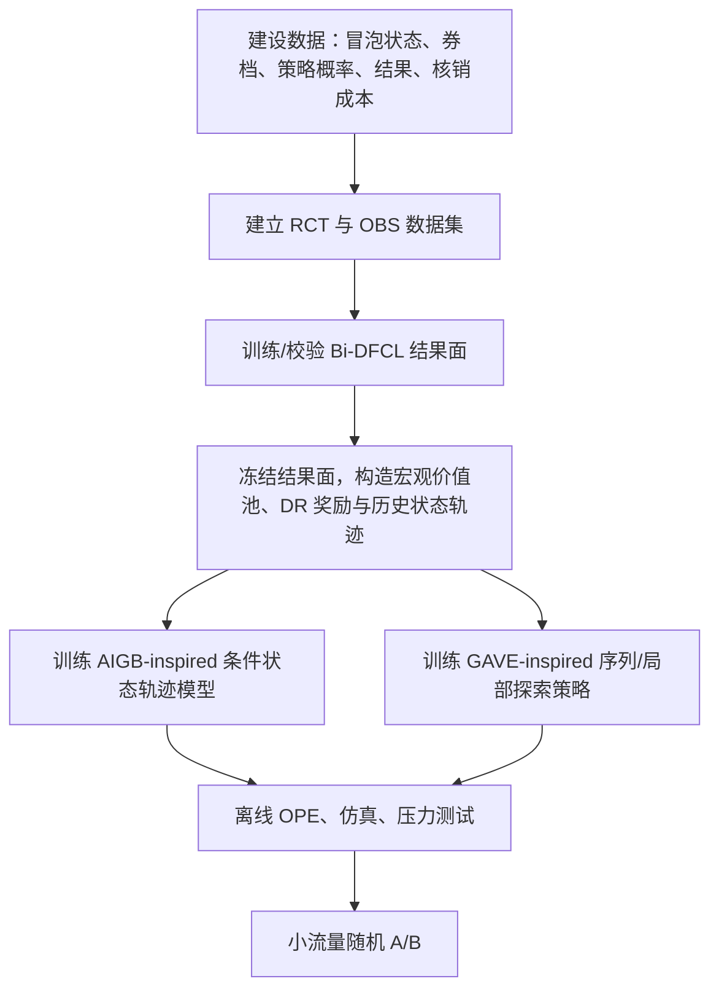

关联阅读：[[02_AIGB：怎样生成完整出价轨迹|AIGB / DiffBid]]、[[03_GAVE：怎样超过历史次优轨迹|GAVE]]、[[02_Bi-DFCL：怎样用RCT与OBS共同优化营销决策|Bi-DFCL]]。

> **这不是把三篇论文原封不动拼起来。**三篇论文分别来自广告自动出价或营销决策，论文并没有在网约车乘客券额上做实验。本文做的是一个明确标注边界的迁移设计：只优化乘客券额，动作离散为“不发券 / 2 元 / 4 元 / 6 元”；用 Bi-DFCL 建立可信的增量价值面，用 AIGB 协调跨时段的资源节奏，用 GAVE 在单次冒泡时做受限的局部策略改进。

## 1. 先用一句话讲清这个首版

在每个乘客冒泡时，我们不直接问“给多大券最容易发单”，而是问：

> **在当前城市、时段、供需和用户状态下，哪一档券能带来真正的增量完单；在今天剩余预算和接下来高峰的需求下，此刻是否值得把预算花在这个人身上；若要尝试不同于旧策略的券档，怎样只在可信邻域内试探？**

对应三层分工：


这里的“首版”不是三套大模型串行地各跑一遍，而是三个职责不同的模块：

| 模块 | 在首版中回答的问题 | 线上产物 |
|---|---|---|
| Bi-DFCL | 券对该乘客是否有**因果增量**，以及增量值多少钱 | 各券档的收益/成本结果面与不确定性 |
| AIGB-inspired 规划器 | 未来几个时段，预算应该怎样留存和消耗 | 本时段预算配额、消费节奏、价值门槛 |
| GAVE-inspired 在线策略 | 具体这次冒泡，在已有计划内要选哪一档券 | 一个受限的离散券额动作 |

## 2. 先界定业务：样本、动作、结果和约束

### 2.1 决策时点：一次“冒泡报价”

只做乘客券额时，最自然的决策点是乘客完成行程输入、系统已有预估价但尚未发单的冒泡阶段。这个时点既能观察到用户“看价未发单”的价格敏感性，也还来得及改变用户看到的实付价。

第 $i$ 次冒泡的状态记为 $x_i$：

$$
x_i=(u_i, q_i, m_i, b_i).
$$

其中：

- $u_i$：乘客侧历史，如近期冒泡次数、看价未发单率、历史完单、券使用习惯、不同价格锚点下的行为；
- $q_i$：本次行程与报价，如起终点、距离、预估时长、原始预估价、价格锚点、品类；
- $m_i$：实时市场，如城市/区域、时段、供需、在线司机、ETA、天气、活动；
- $b_i$：策略上下文，如当前时段剩余券预算、已花预算、目标 ICP、当前可用券档。

动作是离散券档：

$$
a_i\in\mathcal A=\{0,2,4,6\},
$$

其中 $0$ 表示不发券，单位为元。首版刻意不同时加入司机激励、动态原价和多品类勾选；否则无法分清“乘客券额”本身的增量效果。

### 2.2 结果不应只看发单率

对每一个潜在券档 $a$，我们至少关心两类潜在结果：

$$
Y_i(a)=\text{在归因窗口内是否完单，或该完单的业务价值},
$$

$$
C_i(a)=\text{该动作导致的实际补贴成本}.
$$

成本必须先在业务上定义清楚。若券只有被核销才发生支出，$C_i(a)$ 应是**预期核销成本**，而不是机械地等于券面额；若平台一发券便有确定成本，则按实际会计口径定义。不要混用二者。

真正用于策略比较的是相对不发券的增量：

$$
\Delta Y_i(a)=Y_i(a)-Y_i(0),\qquad
\Delta C_i(a)=C_i(a)-C_i(0).
$$

一个简化的个体净价值可写为：

$$
v_i(a;\lambda)=\mathbb E[\Delta Y_i(a)\mid x_i]
-\lambda\,\mathbb E[\Delta C_i(a)\mid x_i].
$$

$\lambda$ 是“单位补贴成本有多稀缺”的影子价格：预算越紧，$\lambda$ 越大。它不是一个固定业务常数，而会随城市、时段和剩余预算变化。

### 2.3 首版的总体目标与护栏

一个时段 $t$ 内，策略不是让每个人都拿最高 $v_i$ 的券，而是在预算内最大化总增量价值：

$$
\max_{a_i\in\mathcal A}\ \sum_{i\in\mathcal I_t}
\mathbb E[\Delta Y_i(a_i)\mid x_i]
\quad
\text{s.t.}\quad
\sum_{i\in\mathcal I_t}\mathbb E[\Delta C_i(a_i)\mid x_i]\le B_t.
$$

此外要有独立于模型的硬护栏：

- 城市/时段总预算和券档数量上限；
- 单用户频控、近期期限与最低实付价边界；
- 供给风险护栏：ETA、司机应答率、取消率异常时自动收紧发券；
- 线上随机对照流量与可追溯日志；
- 人群公平性和投诉风险监控。

这些护栏不是论文模型“自然学出来”的，必须由策略平台强制执行。

## 3. 三篇论文原来做什么，与这里怎样对应

这一节最重要：下面的“应用版”是借鉴，不把改造后的模块说成论文原方法。

| 模块 | 论文实际做什么 | 迁移到乘客券额时可以怎么用 | 不能直接照搬的部分 |
|---|---|---|---|
| [[02_Bi-DFCL：怎样用RCT与OBS共同优化营销决策]] | 在营销多 treatment、预算约束下，用 RCT + OBS 的双层决策聚焦学习预测收益/成本结果面。 | 将 treatment 替换为 $\{0,2,4,6\}$ 元券，预测不同券档的完单价值与补贴成本。 | RCT 的随机化、归因窗口、干预稳定性必须重新设计；不能把历史“领券后完单率”直接当增量。 |
| [[02_AIGB：怎样生成完整出价轨迹]] | 条件扩散模型生成未来**状态轨迹**；再用 inverse dynamics 把“历史状态 + 预期下一状态”变成 bidding-parameter action，最后通过解析竞价公式得到单次 bid。 | 将状态轨迹理解为“未来各时段剩余预算、花费速度、价值人群到达量、券档使用结构”的期望路径；生成的路径用来安排本时段资源节奏。 | 论文不是直接输出预算计划或券档配额，更不是直接生成每次曝光的 bid。若缺少历史宏观控制参数日志，不能忠实训练其 $f_\phi$。 |
| [[03_GAVE：怎样超过历史次优轨迹]] | 以 DT 为 backbone，在连续 bid coefficient 的日志动作附近做乘法扰动，用 score-based RTG、相对比较和 expectile value 引导局部探索。 | 在一次冒泡的券额选择中，围绕基准券档只比较相邻档位，并利用序列状态和价值锚点决定是否偏离旧策略。 | 原论文动作是连续系数，且探索写作 $\tilde a=\beta a$；离散券档尤其含 $0$ 时不能直接使用该式，必须改为邻域候选或连续 latent action。 |

因此，“AIGB 输出计划”这句话只能作为**应用层的通俗说法**。更准确的说法是：

> **AIGB 原论文条件生成的是未来状态轨迹；在券额场景中，我们把这条状态轨迹作为未来资源状态的参考计划，再通过一个控制/分配层将其翻译为当前的预算配额与价值门槛。这个翻译层是落地改造，不是论文中的原始输出。**

## 4. 第一层：Bi-DFCL 先回答“券是否真的有增量”

### 4.1 为什么 CVR 模型不够

假设高频通勤用户 A 平时本来就会下单，旧运营策略也恰好常给他 6 元券。日志中会看到：

$$
P(Y=1\mid A,\text{6 元券})\ \text{很高}.
$$

但这不等于：

$$
P(Y(6)=1\mid A)-P(Y(0)=1\mid A)\ \text{很高}.
$$

前者是相关性，后者才是补贴的因果增量。若直接按 CVR 给券，系统会继续把券发给本来就会发单的人，表面转化率很好，实际补贴浪费很大。

### 4.2 输入、输出与训练数据

对每个 $x_i$，Target Network 需要输出四个动作的结果面：

$$
\{\hat\mu_Y(x_i,a),\hat\mu_C(x_i,a)\}_{a\in\{0,2,4,6\}}.
$$

这里：

- $\hat\mu_Y(x,a)$：若给 $a$ 元券，预期完单价值；
- $\hat\mu_C(x,a)$：若给 $a$ 元券，预期实际补贴成本；
- 两两相减后得到 $\widehat{\Delta Y}(x,a)$、$\widehat{\Delta C}(x,a)$。

数据必须分为两类：

| 数据 | 在首版中的作用 | 必须记录的关键信息 |
|---|---|---|
| RCT | 为不同券档提供无偏的因果锚点，也用于最终策略评估 | 随机券档、入组/排除规则、曝光、完单、核销成本、时间戳 |
| OBS | 扩大人群与场景覆盖，帮助模型学习复杂特征模式 | 旧策略动作、动作概率/策略版本、状态快照、结果、成本 |

若没有随机对照或可靠的 action propensity，不能声称已经获得无偏券额增量；这时最多是一个带强假设的 uplift 估计。

### 4.2.1 Bi-DFCL 最终给后续模块的到底是什么？

训练时的 Teacher $\mathcal F_\psi$ 与 Bridge $\mathcal G_\phi$ 都是为了让 Target 学得更可靠；**训练结束后它们不进入线上链路**。最终保留的 Target 对一个当前冒泡样本 $x_i$ 给出两张 $4$ 档券额的结果表：

$$
\bigl\{\hat\mu_Y(x_i,0),\hat\mu_Y(x_i,2),\hat\mu_Y(x_i,4),\hat\mu_Y(x_i,6)\bigr\},
$$

$$
\bigl\{\hat\mu_C(x_i,0),\hat\mu_C(x_i,2),\hat\mu_C(x_i,4),\hat\mu_C(x_i,6)\bigr\}.
$$

从中计算相对 0 元券的增量表：

$$
\{\widehat{\Delta Y}(x_i,a),\widehat{\Delta C}(x_i,a)\}_{a\in\{2,4,6\}}.
$$

因此，它向后传递的核心不是“这个人属于高价值人群”一个标签，而是：**这个人在此时此地，对每一档券分别能产生多少增量价值、需要多少预期成本。**

后续有两种不同粒度的使用方式：

| 去向 | 接收什么 | 怎样使用 |
|---|---|---|
| AIGB-inspired 宏观规划 | 将未来预估到达的乘客结果面按城市 × 时段聚合。例如 $V_t(a)=\sum_{i\in\widehat{\mathcal I}_t}\widehat{\Delta Y}(x_i,a)$，并同步聚合成本。 | 形成“未来高价值券额机会池”：18:30 是否会有更多值得给 4 元券的乘客，从而决定当前是否留预算。 |
| GAVE-inspired 微观决策 | 当前这一个乘客的完整 $\Delta Y/\Delta C$ 券档表。 | 在基准券档的局部候选中，计算每一档的净因果价值 $q_i(a)$，作为是否偏离基准的主要证据。 |

预算影子价格 $\lambda_t$、券档配额、以及“不确定性”要特别分清：它们**不是 Bi-DFCL 原论文保证会直接输出的第三张表**。$\lambda_t$ 来自预算控制器；配额来自宏观规划/平台；不确定性则需要通过 ensemble、bootstrap、日志支持度或 RCT 覆盖度等额外机制估计。

### 4.3 Bi-DFCL 如何同时利用 RCT 与 OBS

原论文中有三个训练期对象：

1. **Teacher $\mathcal F_\psi$**：先在 RCT 上训练，作为相对可信但样本少的锚点；
2. **Target $\mathcal F_\theta$**：在大量 OBS 上训练，最终上线；
3. **Bridge $\mathcal G_\phi$**：对“某个样本—某个券档”学习更应相信 Teacher 还是 Target。

对 OBS 中没有真实观察到的券档 $a$，Bridge 构造伪标签：

$$
\tilde\mu_Y(x,a)
=w_Y(x,a)\hat\mu_Y^{\text{Teacher}}(x,a)
+[1-w_Y(x,a)]\hat\mu_Y^{\text{Target}}(x,a),
$$

成本结果面也有独立的 $w_C(x,a)$。随后用 OBS 的事实标签和这些伪标签训练 Target。

关键不在“伪标签更像谁”，而在上层如何更新 Bridge：将 Target 预测的 $\hat r,\hat c$ 丢进预算分配器，在 RCT 上检验“把券这样分出去，真实增量业务价值是否更高”。这条决策级损失通过双层优化反向指导 Bridge。

### 4.4 在乘客券额场景中如何定义 $r$ 和 $c$

首版可用一个清晰、易实验验证的定义：

$$
r_i(a)=\text{归因窗口内的完单指示} \in\{0,1\},
$$

$$
c_i(a)=\text{该次完单实际核销的券成本}.
$$

若业务希望权衡 GMV、司机收入或长期留存，不要在第一版把所有目标生硬相加。应先将它们作为单独 outcome head 或监控指标；在“增量完单/补贴”口径稳定后，再以明确权重写入收益定义。

对给定预算 $B_t$，Bi-DFCL 的下游分配可写为：

$$
\max_z\ \sum_i\sum_{a\in\mathcal A}z_{ia}\widehat{\Delta Y}(x_i,a)
\quad
\text{s.t.}\quad
\sum_i\sum_a z_{ia}\widehat{\Delta C}(x_i,a)\le B_t,
\quad\sum_a z_{ia}=1.
$$

它与论文的多 treatment 背包问题同构。实际在线不必为每个请求全局重算整数背包，常见实现是维护动态 $\lambda_t$，选择：

$$
a_i^*=\arg\max_{a\in\mathcal A}
\left[\widehat{\Delta Y}(x_i,a)-\lambda_t\widehat{\Delta C}(x_i,a)\right].
$$

若选择的 $a_i^*$ 不发券，代表该样本的最高净增量仍不值得消耗券预算。

### 4.5 一个具体例子

两位同时冒泡的乘客，当前时段预算较紧，$\lambda_t=0.18$。模型输出的是相对 0 元券的增量：

| 乘客 | 动作 | $\widehat{\Delta Y}$ | $\widehat{\Delta C}$ | 净价值 $\Delta Y-0.18\Delta C$ |
|---|---|---:|---:|---:|
| A：高频通勤 | 2 元 | 0.015 | 0.80 | -0.129 |
| A：高频通勤 | 4 元 | 0.018 | 1.85 | -0.315 |
| B：多次看价未发单 | 2 元 | 0.090 | 0.72 | -0.040 |
| B：多次看价未发单 | 4 元 | 0.220 | 1.60 | -0.068 |

数值只为解释。此处即使 B 的券效相对更强，在 $\lambda=0.18$ 下仍未覆盖成本，两个用户都可能不发券；预算放松时，$\lambda$ 降低，B 的 4 元券可能先变得值得，而 A 仍不值得。**这正是“因果价值 + 预算影子价格”比“谁的 CVR 高就给谁券”更合理的地方。**

## 5. 第二层：AIGB 在论文中生成什么，乘客券额版怎样用

### 5.1 先严格区分：原论文不是“输出券额计划”

AIGB / DiffBid 原论文的基本链路是：

$$
\text{目标/约束/反馈 + 已观测历史状态}
\xrightarrow{\text{conditional diffusion}}
\text{未来状态轨迹}
\xrightarrow{f_\phi}
\text{当前 bidding-parameter action}
\xrightarrow{\text{解析公式}}
\text{每次曝光 bid}.
$$

它的扩散模型生成的是：

$$
x'_0=(s'_{t+1},s'_{t+2},\ldots,s'_T),
$$

即未来一段时间的**状态轨迹**。在广告论文里，状态包括剩余时间、剩余预算、预算消耗速度、实时 CPC 等；随后 inverse dynamics $f_\phi$ 根据历史状态和预期下一状态，生成 bidding parameters。论文最后再用竞价公式把参数变成单次 bid。

所以更准确的答案是：

> **AIGB 原论文确实是“轨迹级规划”，但它规划的是状态轨迹，不是直接吐出一张预算分配表，也不是一次性锁死全天动作。它会在每个决策窗口滚动地根据新状态重新生成未来。**

### 5.1.1 决策粒度要分清：AIGB 不是天然“城市模型”，GAVE 也不是天然“单人模型”

这是把两篇论文迁移到乘客券额时最容易说错的地方。**原论文中，AIGB 的一条轨迹对应一个广告自动出价主体在多个时间步上的状态演化；GAVE 的一个动作对应该主体在时刻 $t$ 的连续 bid coefficient。**论文没有把“城市”规定为 AIGB 的唯一单位，也没有把“单个用户”规定为 GAVE 的唯一单位。

因此，下表右侧是本方案为了适配“乘客券额”而做的**工程粒度改造**，不是论文的原始设定：

| 模块 | 论文中的原始粒度与产物 | 券额场景中的建议粒度与产物 |
|---|---|---|
| AIGB / DiffBid | 广告主体在未来多个时段的**状态轨迹**；后续由 inverse dynamics 根据状态转移得到当前 bid parameter。 | 城市（必要时细到区域）$\times$ 未来时间窗口的资源状态参考轨迹，例如剩余预算、花费速度、未来高价值机会池、ETA 风险。控制器再转为当前桶的 $B_t^{\text{bucket}}$、$\lambda_t$、券档配额。 |
| GAVE | 一个自动出价主体在当前状态下的连续出价动作，以及日志动作附近的局部探索。 | 一次乘客冒泡的离散券档选择：输入当前乘客/行程/供需状态和宏观计划摘要，在受限候选 $\{0,2,4,6\}$ 中选择或探索。 |

所以，在这个迁移设计里可以把职责概括为：

```text
AIGB-inspired：先回答“未来几小时的钱应该在哪些时段保留、在哪些时段更积极地花”。
GAVE-inspired：再回答“当前这位乘客到来时，在该时段资源边界内，具体给不给、给哪档券”。
```

例如，18:00 时 AIGB-inspired 规划器看到“18:30 后高价值乘客机会预计上升”，生成的状态参考路径会要求当前花费速度放缓。控制器据此提高当前 $\lambda_t$、收紧 6 元券配额。18:10 某乘客冒泡时，GAVE-inspired 模块并不重新规划整晚预算；它只在当前允许的券档邻域内，结合该乘客的券效、供需和历史序列决定 0、2 还是 4 元券。

### 5.1.2 为什么不只使用其中一个？

二者都可以单独使用，但各自会遗漏另一种时间尺度的信息。

**只用 AIGB-inspired 宏观轨迹规划**：理论上可把它的轨迹单位细化为“每个乘客的券额轨迹”，但线上未来会有哪些乘客、他们冒泡时的实时供需和价格锚点都不确定。若一次生成大量乘客的动作，轨迹维度会很高，还难保证频控、券档配额、总预算和后续高价值乘客的预算留存。因此它更适合负责跨时段的资源节奏，而不适合替代每次冒泡的实时个体判断。

**只用 GAVE-inspired 逐次决策**：它可以把剩余预算、RTG 等输入当前状态，但仍偏向于评估“此刻改哪个动作更好”。如果缺少一条面向未来窗口的资源主线，当前看起来都很高价值的乘客可能使预算过早耗尽，错过之后才会出现的晚高峰机会。RTG 可以缓解，却不等于显式生成、筛选和滚动修正未来状态轨迹。

组合后形成两层闭环：

```text
宏观循环（每 30 分钟 / 每小时）
当前聚合状态 + 未来预测 + 总预算
→ AIGB-inspired 生成未来状态参考轨迹
→ 控制器给出当前 B_t、λ_t、配额和券档边界

微观循环（每次冒泡）
当前乘客状态 + 当前宏观边界
→ Bi-DFCL 给各券档的因果收益/成本
→ GAVE-inspired 在受限邻域内选具体券档
→ 原子扣减预算并把实际反馈带入下一轮重规划
```

这种分层的价值不是“模型越多越强”，而是让**长时域的预算耦合**与**短时域的个体异质性、实时变化和安全探索**各由擅长的模块处理。首版若尚未证明两层都有额外价值，完全可以先只上线 Bi-DFCL + 动态 $\lambda$；AIGB-inspired 与 GAVE-inspired 应分别通过消融验证后再加入。

### 5.2 对应到乘客券额，什么可以成为“状态轨迹”

把一天拆成 30 分钟时间桶，设当前为 $t$、规划到 $T$。券额版可以定义一个**聚合状态**：

$$
s_t^{\text{macro}}=(B_t^{\text{remain}},\; \text{spend}_t,\; \text{ICPA}_t,\; d_t,\; q_t,\; h_t,\;\ldots).
$$

其中可以包含：

| 状态组 | 示例字段 | 为什么需要它 |
|---|---|---|
| 资源 | 剩余券预算、当前桶已花、累计花费速度 | 不能只优化当前桶，把钱提前花光 |
| 需求 | 冒泡量、看价未发单量、预估未来需求 | 决定未来是否有值得补贴的人 |
| 供需 | 在线司机、ETA、应答率、取消率 | 供给严重紧张时，乘客券可能只放大履约风险 |
| 因果价值池 | 各券档下高价值人群的预计到达量、价值分位数 | 不是只看“来多少人”，还要看“未来来的人值不值得补” |
| 效率 | 累计 ICP、实际核销率、发券率 | 让计划与成本/效率目标联动 |

其中“因果价值池”来自冻结的 Bi-DFCL。比如未来 18:00–18:30 预计有较多“4 元券增量高”的乘客，则保存预算给这个时间段可能更有价值。

注意：未来需求、未来供需、未来价值池在真实线上都不是已知事实。它们应来自单独的预测模块或条件情景，不能在训练/推理中偷用未来真实标签。

### 5.3 条件 $y$ 如何改写

AIGB 论文用 Return、Constraints、Feedbacks 作为条件 $y$。乘客券额版可对应为：

$$
y=(R^{\text{target}},\;B^{\text{day}},\;\text{ICPA}^{\text{target}},\;\text{pacing preference}).
$$

| 原论文条件类别 | 乘客券额版的可选含义 | 例子 |
|---|---|---|
| Return | 目标增量完单或目标增量业务价值 | 晚高峰希望获得更多增量完单 |
| Constraints | 日预算、目标 ICP、频控/价格边界 | 当天预算 20 万，增量完单成本不高于某阈值 |
| Feedbacks | 花费节奏、峰值保留比例、平滑性 | 不在 17 点前花掉晚高峰大部分预算 |

论文的条件控制是**软条件生成**：它帮助生成更像“高收益、约束合规、节奏匹配”的历史轨迹，却不是数学上的硬约束保证。因此迁移时，预算和频控仍要在扩散模型外加硬 gate。

### 5.4 两种迁移方式：忠实复现与更适合首版的改造

#### 方式 A：忠实保留 AIGB 的 state planning + inverse dynamics

如果历史策略日志中真实记录过宏观控制动作 $u_t$，可以学习：

$$
u_t=f_\phi(s_{t-L:t}^{\text{macro}},s_{t+1}^{\prime\,\text{macro}}).
$$

这里 $u_t$ 不能是事后凭空定义的结果，而应是当时系统真正执行的控制量，例如：

$$
u_t=(\lambda_t,\;\text{各券档配额},\;\text{高价值阈值},\;\text{城市/区域预算比例}).
$$

扩散模型生成“下一桶应有怎样的剩余预算、花费速度、价值池消耗节奏”，$f_\phi$ 再学习“为了实现该状态转移，当前应把 $\lambda$、配额和阈值调成什么”。这与 AIGB 论文的“未来状态 $\rightarrow$ 当前 bidding parameter”最接近。

**前提很苛刻：**必须存在足够覆盖的历史宏观动作日志。若旧系统只留下“给了哪张券”的明细、没有记录当时的预算阈值/配额/策略参数，就无法把 $f_\phi$ 当作有监督 inverse dynamics 忠实训练。

#### 方式 B：首版采用 AIGB-inspired 状态计划 + 外部控制器

更实际的首版不强行训练 $f_\phi$。它让扩散模型仅生成未来宏观状态路径：

$$
(s_{t+1}^{\prime},\ldots,s_T^{\prime}),
$$

然后用一个确定性的控制器把**下一状态的目标**翻译为当前可执行边界，例如：

$$
\bigl(B_t^{\text{bucket}},\lambda_t,\mathcal A_t^{\text{allowed}}\bigr)
=\operatorname{Controller}(s_t,s_{t+1}^{\prime}).
$$

例如，若生成路径表示“下一桶应只消耗 1.5 万预算、因为后续高价值人群会变多”，控制器就提高当前 $\lambda_t$，收紧 6 元券配额；若路径表示“当前桶需求高且后续价值池不强”，控制器降低 $\lambda_t$，允许更多 2/4 元券进入候选集。

这一步是**模型落地的控制适配层**，不是 AIGB 论文原始的解析 bid 公式，也不是对论文效果的复现。它的好处是可解释、可加硬约束、对历史宏观动作日志要求更低。

### 5.5 一次滚动规划的全流程

以 18:00 为例，规划未来 3 小时、共 6 个桶：

1. 汇总当前宏观状态 $s_{18:00}$：剩余预算、已花速度、ETA、冒泡量、Bi-DFCL 价值池等；
2. 给定条件 $y$：当日预算、ICP 上限、晚高峰的保留策略；
3. 条件扩散模型从噪声出发，多次去噪，生成多个候选未来状态轨迹；
4. 用外部硬规则剔除明显超过预算、ETA 风险高或节奏异常的候选路径；
5. 选出目标匹配度高的路径，读取下一桶的期望花费与剩余预算；
6. 控制器转成 $B_t^{\text{bucket}}$、$\lambda_t$、允许券档范围；
7. 未来 30 分钟内，单次冒泡由 GAVE-inspired 模块在这些边界内决策；
8. 到 18:30 更新真实状态，再重新规划，而不是沿用 18:00 的整条计划。

这就是“计划”在应用中的正确含义：**它是滚动参考轨迹，不是不可修改的全天日程表。**

### 5.6 扩散模型在这里实际怎样训练、怎样在 18:00 使用？

这一部分把“扩散模型生成状态轨迹”拆成训练和推理两次看。以下先写论文事实，再写券额场景的改造。

#### 训练时：它学习“什么样的未来状态路径是合理的”

在 AIGB 原论文中，一条历史 episode 的干净输入是整段状态轨迹：

$$
x_0=(s_1,s_2,\ldots,s_T).
$$

券额版中，一天内某个城市的 $30$ 分钟聚合状态可以组成同样的矩阵。每个 $s_t^{\text{macro}}$ 包含剩余预算、花费速度、ETA、冒泡量、各券档的高价值机会池、核销率等字段。模型训练时随机抽一个扩散步 $k$，给**整段**轨迹加高斯噪声：

$$
x_k=\sqrt{\bar\alpha_k}x_0+
\sqrt{1-\bar\alpha_k}\epsilon,
\qquad\epsilon\sim\mathcal N(0,I).
$$

去噪网络输入 $(x_k,k,y)$，预测噪声 $\epsilon$，训练目标是：

$$
\mathcal L_{\text{diff}}=
\mathbb E\left\|\epsilon-\epsilon_\theta(x_k,k,y)\right\|^2.
$$

直觉上，网络不是在背诵“18:30 会发生什么”，而是在大量历史日/城市轨迹中学会：给定“预算、目标 ICP、希望晚高峰保留资源”等条件时，预算、需求、价值池和效率指标通常怎样共同演化。

#### 在线 18:00：从未知未来的噪声中逐步形成一条参考路线

设当前已真实观察到 $s_{18:00}^{\text{macro}}$，而 18:30 之后还未知。在线过程是：

1. 将当前历史状态、预算和业务条件 $y$ 输入模型；历史部分是已知上下文，未来部分从随机噪声开始；
2. 从 $x_K\sim\mathcal N(0,I)$ 出发，连续执行 $K$ 次条件去噪，得到一条候选未来状态路径 $x'_0$；
3. 通常采样多条候选路径，而不是迷信单次生成结果；
4. 用预算、频控、ETA 风险等外部硬规则先过滤；再选择与目标最匹配、且节奏合理的一条；
5. 读取它的下一桶目标，例如“18:00–18:30 只花 1.5 万，18:30 后预留更多预算”；
6. 外部控制器把该目标转为当前 $B_t^{\text{bucket}}$、$\lambda_t$ 与券档配额；每次冒泡才据此决定单张券。

因此扩散模型在这里的产物可以写成：

$$
\underbrace{(\text{未来剩余预算},\text{花费速度},\text{价值池},\text{ETA 风险},\ldots)}_{\text{未来状态参考轨迹}}
\quad\Longrightarrow\quad
\underbrace{(B_t^{\text{bucket}},\lambda_t,\text{券档配额})}_{\text{控制器的当前执行边界}}.
$$

左侧是 AIGB-inspired 扩散模型真正生成的内容；右侧是我们新增的控制适配层。**不要把右侧误说成扩散模型直接输出的券额。**

例如 18:00 时，模型在“日预算还剩 10 万、目标 ICP 不超 25 元、18:30 后高价值乘客预计上升”的条件下，生成的路径显示后续 1 小时的 4 元券高价值机会更多。控制器于是把当前桶预算压低、提高 $\lambda_t$、限制 6 元券配额；18:30 的真实状态到来后，整条路径被重新生成，而不是机械执行此前计划。

## 6. 第三层：GAVE 原论文怎样探索，离散券档应该怎样改

### 6.1 GAVE 原论文的关键机制

GAVE 原论文的输入是交错的：

$$
(r_{t-M},s_{t-M},a_{t-M},\ldots,r_t,s_t,a_t),
$$

其中 $r_t$ 是 score-based RTG、$s_t$ 是环境状态、$a_t$ 是连续 bid coefficient。它在日志动作附近构造：

$$
\tilde a_t=\beta_t a_t,
$$

再比较原动作与探索动作的预测 RTG，并通过高 expectile 的 value head 避免模型朝 OOD 区域盲目外推。原论文的本意是“超越次优日志，但不要离历史动作太远”。

### 6.2 为什么不能直接写成“券额乘一个 $\beta$”

若动作是 $\{0,2,4,6\}$，简单乘法会产生三个问题：

1. $0\times\beta=0$，不发券永远探索不到其他券档；
2. $4\times1.2=4.8$，不在可投放券档中；
3. 券档间距、边际成本和领取概率不一定线性，乘法距离没有稳定业务含义。

所以首版不应声称“直接使用了 GAVE 的 $\beta a$”。正确的迁移是：保留它的**局部、价值引导、远离 OOD 要受限**的思想，但更换离散动作机制。

### 6.3 乘客券额版的状态、基准动作与候选邻域

在一次冒泡 $i$，构造请求级状态：

$$
s_i^{\text{micro}}=(u_i,q_i,m_i,b_i,\lambda_t,B_t^{\text{bucket}},\text{AIGB plan summary}).
$$

其中 `AIGB plan summary` 不需要把整条未来轨迹塞给每个请求，可取下一桶目标花费、剩余预算率、当前价值阈值等少量摘要。

先由稳定的基准策略给出 $a_i^{\text{base}}$。它可以是规则、当前线上模型，或 Bi-DFCL 净价值的贪心解。再定义离散邻域：

$$
\mathcal N(a_i^{\text{base}})=
\{a\in\mathcal A:\ |a-a_i^{\text{base}}|\le2\}.
$$

例如基准是 2 元券，候选为 $\{0,2,4\}$；基准为 0 元，候选为 $\{0,2\}$；不在首版中从 0 元直接跳到 6 元。这个“邻域”就是离散版的限幅。

### 6.4 GAVE-inspired 的价值与探索信号

对于每个候选券档，首先使用 Bi-DFCL 的冻结结果面计算净因果价值：

$$
q_i(a)=\widehat{\Delta Y}(x_i,a)-\lambda_t\widehat{\Delta C}(x_i,a).
$$

但不能只选择 $q_i(a)$ 最大的候选。原因是：结果面也会在稀有状态/稀有券档上外推错误。因此还需要：

- **日志支持度/不确定性**：该城市、时段、相似状态下，这个券档是否有足够曝光；
- **序列价值锚点**：相似历史上下文的高分侧 RTG 是否支持这个方向；
- **与基准动作的偏离惩罚**：越远离基准、越缺日志支持，惩罚越大；
- **预算与频控 gate**：即使价值高，也不能突破配额。

一个可实施的候选打分形式是：

$$
S_i(a)=q_i(a)
-\rho\,\operatorname{Uncertainty}(x_i,a)
-\gamma\,|a-a_i^{\text{base}}|
-\eta\,\operatorname{Risk}(s_i^{\text{micro}},a).
$$

最终只在邻域中选择：

$$
a_i^*=\arg\max_{a\in\mathcal N(a_i^{\text{base}})}S_i(a),
$$

并且只有当 $S_i(a_i^*)$ 比基准分数高出一个最小安全阈值时才偏离基准；否则回退到 $a_i^{\text{base}}$。这比“模型预测 4 元略高于 2 元，就直接发 4 元”更稳妥。

### 6.4.1 到底哪些样本可以做新尝试？

先澄清：GAVE 原论文中的 $w_t$ 是训练期对“原日志动作与局部扰动动作”进行相对比较的权重，**不是**一个论文定义的线上 `explore = true/false` 开关。下面的资格 gate 是将其迁移到离散券额后的工程设计。

在线并不是每个乘客都探索。先让基准策略给出 $a_i^{\text{base}}$，再只对满足下式的样本开放相邻券档候选：

$$
\operatorname{Eligible}_i=
\operatorname{BudgetOK}_i
\land\operatorname{RiskOK}_i
\land\operatorname{SupportOK}_i
\land\operatorname{AdvantageOK}_i.
$$

四项分别表示：

| 条件 | 实际判断 | 为什么必要 |
|---|---|---|
| BudgetOK | 当前桶仍有预算、该券档未超配额，且 AIGB-inspired 计划允许当前继续消耗资源。 | 避免局部最优把后续高价值时段的预算提前花掉。 |
| RiskOK | 用户频控、最低实付价、ETA/取消率、城市活动保护等硬规则全部通过。 | 高预测价值不应覆盖业务安全边界。 |
| SupportOK | 相似的城市/时段/供需/价格锚点下，候选券档在日志或 RCT 中有足够支持；同时不确定性不高。 | 防止在 OOD 区域把模型外推当事实。 |
| AdvantageOK | 相邻候选相对基准具有足够大的安全优势，例如 $S_i(a)-S_i(a_i^{\text{base}})>\delta$。 | 不为微小、可能只是噪声的预测差异改变动作。 |

例如基准为 2 元券、候选为 $\{0,2,4\}$。若 4 元券的因果净价值更高，但该状态下 4 元券样本极少，SupportOK 不成立，仍留在 2 元；若 4 元有充分支持且优势明显、当前配额充足，才允许偏向 4 元。由此，“尝试”不是随机挑一些人给大券，而是**在值得尝试且能承受尝试风险的局部区域中改动作**。

不过这种“模型挑出来的尝试”本身仍会产生新的选择偏差：以后日志里看到的 4 元券样本，会越来越集中在模型挑出的高分人群。因此还应保留一小部分独立、分层随机的实验流量：在已通过硬风控的人群内，按已记录概率随机分配安全券档。它的作用不是追求当下最大收益，而是持续补充无偏数据，供 Bi-DFCL 校正和最终策略评估使用。GAVE-inspired 的受限探索不能替代 RCT。

### 6.5 RTG 在券额版中是什么，如何避免标签泄漏

若真正使用 GAVE 风格的序列 backbone，可以把一个短窗口内的奖励定义为：

$$
g_i=\widetilde{\Delta Y}_i-\lambda_t\widetilde{\Delta C}_i
-\eta\cdot\text{violation}_i,
$$

并从后往前累加为 RTG：

$$
r_i=\sum_{k\ge i}g_k.
$$

其中 $\widetilde{\Delta Y},\widetilde{\Delta C}$ 不应直接拿“同一个模型刚预测出的反事实值”当训练真值，否则会形成自我强化。更严谨的做法是：

1. 用独立的、交叉拟合（cross-fitting）的 outcome / propensity 模型构造 DR 伪结果；
2. 或在随机实验流量内使用已知随机概率构造 IPW/DR 估计；
3. 用这些**不参与当前 batch 训练的**奖励估计构造 RTG；
4. 在线仍以实时 $\lambda_t$、预算状态和已发生序列更新条件。

对某一已实际执行的券档 $A_i$，多 treatment 的 DR 形式可直观写为：

$$
\tilde Y_i(a)
=\hat\mu_Y(x_i,a)
+\frac{\mathbb 1(A_i=a)}{\hat e(a\mid x_i)}
\left[Y_i-\hat\mu_Y(x_i,a)\right].
$$

这不是 GAVE 原论文给出的券额公式，而是迁移到因果券额时，为避免“只用模型预测当 reward”所需的估计设计。$\hat e(a\mid x)$ 是历史策略发放 $a$ 的概率；在 RCT 中它由随机化设计给出。

### 6.6 一个单次冒泡的例子

18:10，乘客 B 在雨天、供需偏紧区域冒泡：原价 38 元，过去一周有 5 次看价未发单；当前桶仍有预算，但 AIGB-inspired 计划要求为 18:30 后保留一部分资源。基准策略给 2 元券。

因此候选邻域是：

$$
\mathcal N(2)=\{0,2,4\}.
$$

Bi-DFCL 的因果结果面显示：4 元相对 0 元有较高增量完单，2 元效果一般；但 4 元券在“雨天 + 该区域 + 当前 ETA”下日志支持不多。不确定性惩罚后，若 4 元的 $S_i(4)$ 仍显著高于 2 元，且当前 4 元券配额未用尽，系统发 4 元；若优势很弱或该状态 OOD，则保留 2 元；若预算影子价格在本桶突然升高，可能直接回退到 0 元。

这里的探索不是把 B 随机暴露给任意大券，而是**在基准附近、在配额内、在不确定性扣分后，才允许有条件地偏离历史策略。**

## 7. 把三层串成一次完整的离线训练与线上推理

### 7.1 离线训练：先后顺序不能颠倒



建议顺序是：

1. **先把因果结果面做好。**没有可信的 $\widehat{\Delta Y},\widehat{\Delta C}$，后面的“高价值人群”“高收益 RTG”都没有可靠含义；
2. 用冻结或版本固定的结果面聚合出宏观价值池，防止 AIGB 和 GAVE 在训练时追着一个不断变化的 teacher；
3. 再训练状态计划与局部策略；
4. 最后评估组合策略，而不是一开始端到端联合训练所有模块。

### 7.2 在线：两个不同频率的决策循环

| 决策循环 | 建议频率 | 输入 | 输出 |
|---|---|---|---|
| 宏观规划循环 | 每 30 分钟或每小时 | 当前聚合状态、未来需求预测、预算、业务目标 | 下一桶配额 $B_t^{\text{bucket}}$、影子价格 $\lambda_t$、允许券档 |
| 微观冒泡循环 | 每次冒泡 | 乘客/行程/供需状态、宏观摘要、基准动作 | 0 / 2 / 4 / 6 元券 |

一次在线流程可以写成：

1. 到达时间桶边界，AIGB-inspired 规划器滚动生成后续状态路径；
2. 控制器据此设置当前桶预算、各档券配额、初始 $\lambda_t$；
3. 每个冒泡到来，Bi-DFCL 预测四档券的收益/成本结果面；
4. 基准策略给出 $a^{\text{base}}$，GAVE-inspired 模块仅在其邻域内产生候选；
5. 将候选经过净因果价值、不确定性、供需风险、频控、预算 gate；
6. 执行最终券额，并原子扣减当前桶预算/配额；
7. 若花费速度偏离计划，在线调高或调低 $\lambda_t$；
8. 到下一桶，吸收真实结果后重新规划。

### 7.3 为什么三层不会“重复做同一件事”

| 问题 | 应由谁回答 | 不应由谁单独回答 |
|---|---|---|
| 4 元券对用户 B 是否真的有增量 | Bi-DFCL 的结果面 | AIGB；它只看到宏观轨迹，不能可靠识别个体因果效果 |
| 18:00 的预算是否该留给 19:00 | AIGB-inspired 状态规划 + 控制器 | 单次贪心券额模型；它会倾向于立即花在当前高分人群 |
| 基准为 2 元时，是否可安全尝试 4 元 | GAVE-inspired 局部策略 | 纯 Bi-DFCL argmax；它可能在日志覆盖不足处过度外推 |
| 不得超预算、频控、价格边界 | 策略平台硬 gate | 三个论文模型都不提供完整生产级安全保证 |

## 8. 首版真正应如何裁剪：不要一次做成“三模型大工程”

“Bi-DFCL + AIGB + GAVE”是目标架构，不是第一天就必须全部上线的形式。更稳的分阶段路径如下。

### 阶段 0：数据与实验底座

- 明确冒泡样本、行动时间、归因窗口、核销成本口径；
- 在部分流量随机分配 $\{0,2,4,6\}$ 元券，记录随机概率与策略版本；
- 建立用户频控、预算、ETA、取消率等不可突破护栏；
- 先验证不同券档确实存在可测的异质性增量。

### 阶段 1：只上线 Bi-DFCL + 动态 $\lambda$ 分配

先不引入生成模型。每次冒泡直接计算：

$$
a_i^*=\arg\max_a\left[\widehat{\Delta Y}(x_i,a)-\lambda_t\widehat{\Delta C}(x_i,a)\right],
$$

并用预算消耗速度更新 $\lambda_t$。这一阶段验证“因果结果面是否真实改善增量完单 / ICP”，也是后续所有模块的对照基线。

### 阶段 2：引入 AIGB-inspired 宏观节奏，但先不做 GAVE 探索

让状态轨迹模型只影响每桶 $B_t^{\text{bucket}}$ 与 $\lambda_t$，微观层仍然用阶段 1 的确定性因果贪心策略。这样可单独回答：**有了前瞻性的预算节奏，是否比均匀花费或规则 pacing 更好？**

### 阶段 3：在小流量引入 GAVE-inspired 邻域探索

只允许：

- 相邻券档跳转；
- 满足最小优势、日志支持度与频控；
- 配置探索比例上限；
- 保留随机对照，监控增量完单、ICP、ETA、取消率。

这阶段回答：**在既有因果价值面与宏观预算边界下，局部序列策略是否能超越历史/贪心基准，而不是只是过拟合估计误差？**

## 9. 评估：不能只看“发券后的完单率”

### 9.1 因果效果与预算效率

在随机对照或可信 OPE 下，至少报告：

$$
\text{Incremental Orders}
=\sum_i\left[Y_i(\pi)-Y_i(\pi_0)\right],
$$

$$
\text{Incremental Cost}
=\sum_i\left[C_i(\pi)-C_i(\pi_0)\right],
$$

$$
\text{ICPA}
=\frac{\text{Incremental Cost}}{\text{Incremental Orders}}.
$$

其中 $\pi$ 是新策略，$\pi_0$ 是基准策略。若分母很小，ICPA 会极不稳定，因此要同时报告置信区间和分层结果。

对模型结果面本身，可用 uplift 排序指标、校准曲线、按券档/城市/时段的 DR 估计误差检查；但这些不能替代最终策略 A/B。

### 9.2 规划与探索各自的验证问题

| 模块 | 要验证的假设 | 关键对照 |
|---|---|---|
| Bi-DFCL | 能找到真实更有增量的用户—券档组合 | CVR 模型、只用 OBS 的 uplift、只用 RCT 的模型 |
| AIGB-inspired | 前瞻节奏能在整段时间内更合理地花预算 | 均匀 pacing、规则型剩余预算控制、阶段 1 策略 |
| GAVE-inspired | 受限局部探索能优于纯基准/纯贪心 | 不探索的基准、只按结果面 argmax 的策略 |

### 9.3 必须单独监控的副作用

- 看价未发单率下降，是否只是把低质量需求也拉入，导致取消率上升；
- 乘客券导致需求增加时，ETA、司机应答率和司机侧收益是否恶化；
- 不同城市、人群、品类是否出现异常倾斜；
- 预算是否在短时间被少数高不确定性样本耗尽；
- 券成本是否因核销延迟造成在线剩余预算估计失真。

## 10. 这套首版的边界与关键风险

1. **跨论文组合不等于理论保证。**Bi-DFCL、AIGB、GAVE 分别在不同问题和数据条件下提出；把它们组合为一个系统是工程假设，需要每层独立消融验证。
2. **RCT 覆盖决定因果外推边界。**若实验没覆盖雨天高峰、某个城市或 6 元券，Bi-DFCL 对这些区域的判断仍可能偏差很大。
3. **AIGB 的未来状态条件依赖预测质量。**需求、ETA、价值池预测错了，状态计划可能把预算留错时间；因此要滚动重规划，并设置规则兜底。
4. **GAVE 的探索不是安全证明。**局部邻域、value 锚点和不确定性惩罚只能降低 OOD 风险，不能替代随机实验、动作限幅和业务护栏。
5. **乘客券只是一侧干预。**供给紧张时，单纯加券可能提高发单却恶化履约；首版应把 ETA/应答/取消作为硬风险指标，不能只看乘客转化。

## 11. 最后总结

这个首版的核心不是“用扩散模型给用户发券”，而是把三个不同层次的问题拆开：

> **Bi-DFCL 先把“看起来会下单”纠正为“券真正带来的增量”；AIGB-inspired 让预算不只服务当前请求，而在未来时段间有计划地保留和消耗；GAVE-inspired 则只在历史策略附近、在因果价值和不确定性共同约束下尝试更好的离散券档。**

最务实的上线顺序仍是：先验证 Bi-DFCL + 动态预算影子价格，再验证 AIGB-inspired 的节奏价值，最后才在小流量引入 GAVE-inspired 局部探索。这样每个收益都能被归因，也更容易在出现风险时回退。
