# LBM：怎样将 LLM 推理能力引入自动出价？

> **论文**：*LBM: Hierarchical Large Auto-Bidding Model via Reasoning and Acting*  
> **作者**：Yewen Li, Zhiyi Lyu, Peng Jiang, Qingpeng Cai, Fei Pan, Bo An, Peng Jiang  
> **会议**：The Web Conference（WWW）2026  
> **链接**：[arXiv](https://arxiv.org/abs/2603.05134)｜[HTML](https://arxiv.org/html/2603.05134v1)｜[代码](https://github.com/yewen99/LBM-WWW26)  
> **关键词**：Auto-bidding, Large Language Model, Generative Model, Offline Reinforcement Learning

## 0. 一句话结论

LBM 不让一个大语言模型直接完成“读长数值序列—推理—输出精确连续动作”的全部工作，而是把任务拆成两层：**LBM-Think 用语言总结历史投放并产生高层调价方向，LBM-Act 融合语言 CoT 与数值序列并输出精确连续动作；再用离线 IQL critic 构造 relative-Q，筛选能真正改善动作价值的 CoT，反向微调 LBM-Think。**

这篇论文的核心不是“LLM 替代自动出价模型”，而是以下三件事的组合：

1. 用层级结构把慢速语言推理和快速连续控制解耦；
2. 用 dual embedding 避免把长数值序列低效地文本化；
3. 用 GQPO 在不进行真实环境 rollout 的条件下，把离线 Q 函数转化为 CoT 的训练信号。

---

## 摘要整理

在线广告拍卖规模持续增长，人工调价已难以应对。现有自动出价方法多采用离线强化学习或生成式模型，但由于训练过程黑盒、离线数据模式覆盖有限，策略有时会产生违背常识的动作，并且在动态环境中的泛化能力有限。

LLM 具有人类先验知识、指令理解和推理能力，但直接用于自动出价又面临两个障碍：一是激烈竞争要求动作足够精确，语言模型不擅长直接生成稳定的连续数值；二是公开 LLM 缺乏自动出价领域训练，可能产生幻觉和次优判断。

论文提出分层 Large auto-Bidding Model（LBM）：高层 **LBM-Think** 在语言空间中推理，低层 **LBM-Act** 负责连续动作生成。LBM-Act 通过双嵌入机制融合语言与数值输入；LBM-Think 则通过无需模拟器或真实环境 rollout 的离线强化微调方法 GQPO 进行训练。实验表明，LBM 作为一种基于 LLM 的生成式自动出价骨干，在训练效率与泛化方面具有优势。

---

# 1. Introduction

## 1.1 自动出价为何是序列决策问题

在线广告平台每天面对大量连续到来的曝光机会。广告主希望在预算和 CPA 等经济约束下尽可能获得更多转化，因此系统不能只判断一次竞价是否值得，还需要在整个投放周期中持续调整出价参数：早期花得过快可能错过后续流量，出价过低又可能无法获得足够曝光。

现有方法主要有两类：

- **离线强化学习**：使用价值函数进行动态规划和轨迹拼接，例如 IQL；
- **生成式决策模型**：通过条件生成直接学习轨迹，例如 Decision Transformer 和 Diffuser。

DT 的典型输入包含 return-to-go、状态和历史动作，模型以自回归方式生成下一步动作。

## 1.2 现有方法的问题

论文认为，传统离线 RL 与生成式方法可能在某些场景中产生反直觉行为，例如 CPA 已明显超过约束时仍提高出价参数。原因包括：

- 策略主要依靠奖励设计获得行为偏好，不一定真正理解任务状态；
- 离线数据不可能覆盖全部 corner case，模型受限于数据的模式覆盖；
- 在动态广告环境或未见状态中，黑盒策略的泛化与可信度不足。

LLM 的价值在于它带有预训练获得的人类知识，能够阅读投放状态、遵循语言指令，并对“预算偏快、CPA 超标、应当降价”等关系进行高层推理。

## 1.3 为什么不能让 LLM 直接出价

直接把数值序列全部转换为文本，再让 LLM 输出连续动作，会遇到三类困难：

1. **表示低效**：如 `12.34` 可能占用多个 token，高维长序列会产生数千 token；
2. **精度不足**：广告竞争中相近的竞价可能产生不同结果，次优连续动作会造成预算浪费或曝光不足；
3. **领域知识不足**：现有 LLM 没有在文本形式的自动出价数据上充分预训练，仍可能出现幻觉或次优时序决策。

LLM-DT 虽然通过额外数值嵌入层改善了长数值序列表示，但本质上仍更接近“用 LLM Transformer 权重初始化的 DT”，没有充分使用语言推理能力。

## 1.4 论文贡献

论文列出四项贡献：

1. 提出分层 LBM：高层 LBM-Think 负责推理，低层 LBM-Act 负责精确动作；
2. 提出 dual embedding，将语言输入与数值输入分别编码后融合；
3. 提出 GQPO，在完全离线条件下减轻 LBM-Think 的幻觉并提升决策表现；
4. 实验显示，以 LLM 为基础的生成式骨干在训练效率与泛化方面有优势。

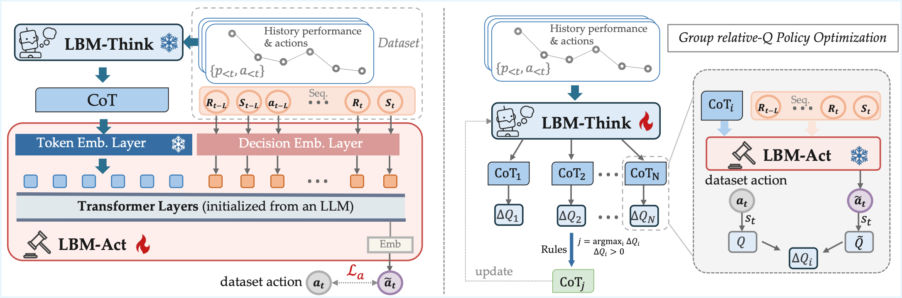

**图 1 解读。** 左侧是 Stage I：用经过方向过滤的 CoT 与离线数值轨迹训练 LBM-Act，使其学会把语言指导转成连续动作。右侧是 Stage II：LBM-Think 对同一状态采样多条 CoT，固定的 LBM-Act 将每条 CoT 转成动作，离线 Q 函数用 relative-Q 评价动作增益，最佳正增益 CoT 再用于微调 LBM-Think。

---

# 2. Preliminary

## 2.1 Problem Statement

曝光机会按索引 $i$ 连续到达。若广告主的出价 $b_i$ 胜过其他广告主，就获得该曝光并支付成本 $c_i$。令：

- $v_i$：曝光 $i$ 的价值；
- $o_i\in\{0,1\}$：是否赢得曝光；
- $B$：整个投放周期预算；
- $C_j$：广告主给出的第 $j$ 个经济约束上限；
- $p_{ij}$：第 $j$ 个约束中的表现指标，例如转化概率、回报或常数；
- $c_{ij}$：第 $j$ 个约束对应的成本。

成本类约束统一写为：

$$
\frac{\sum_i c_{ij}o_i}{\sum_i p_{ij}o_i}\le C_j.
$$

自动出价目标为：

$$
\begin{aligned}
\underset{\{o_i\}}{\operatorname{maximize}}\quad
&\sum_i o_i v_i\\
\text{s.t.}\quad
&\sum_i o_i c_i\le B,\\
&\frac{\sum_i c_{ij}o_i}{\sum_i p_{ij}o_i}\le C_j,\quad \forall j,\\
&o_i\in\{0,1\},\quad \forall i.
\end{aligned}
\qquad \text{(1)}
$$

论文引用已有研究给出的最优竞价形式：

$$
b_i^*=\lambda_0v_i+\sum_{j=1}^{J}\lambda_jp_{ij}C_j.
\qquad \text{(2)}
$$

其中 $\lambda_j$ 是待调整的 bidding parameters。论文强调，工业自动出价通常不是对毫秒级的每一次曝光都运行复杂策略，而是以较低频率调整这些参数，例如每 30 分钟调整一次。因此高层 LLM 推理在时间上是可行的。

## 2.2 Decision-making Process for Auto-bidding

一个投放周期被划分为离散时间步 $t$：

- **状态 $s_t$**：时间、剩余预算、预算消耗速度、KPI 约束满足情况等；
- **动作 $a_t$**：对 $\lambda_0,\ldots,\lambda_J$ 的调整，可写为 $(a_t^{\lambda_0},\ldots,a_t^{\lambda_J})$；
- **奖励 $r_t$**：从 $t$ 到 $t+1$ 时间段内贡献的转化价值。

广告环境具有未知状态转移规律 $\mathcal T$。论文没有强制采用严格 Markov 假设，而是明确指出下一状态可能同时由历史信息与当前观测决定。整个过程一直持续到一个投放周期结束。

> [!note] 动作的准确含义
> 这里的 $a_t$ 不是 LLM 对单次曝光直接报出的竞价，而是低频调整自动出价器中的连续参数。单次曝光的最终出价仍由式（2）所代表的底层竞价结构产生。

---

# 3. LBM：Hierarchical Large Auto-Bidding Model

## 3.1 Model Structure and Inference

### 3.1.1 为什么拆成 Think 与 Act

一个大模型同时进行长链推理和连续动作生成，会带来推理慢、训练困难、连续控制精度不足等问题；论文还观察到，用 GRPO 强行让单个 LLM 同时输出 CoT 与动作时，CoT 会在训练中缩短甚至消失。

因此 LBM 采用两层结构：

| 模块 | 输入 | 输出 | 角色 |
|---|---|---|---|
| LBM-Think $h_\theta$ | 历史 KPI 与历史动作 | 语言 CoT $c_t$ | 总结历史状态，推理未来调价方向 |
| LBM-Act $f_\phi$ | 当前/近期数值序列与 CoT | 连续动作 $\tilde a_t$ | 将高层语言意图落成精确动作 |

设历史窗口长度为 $H$，$p_i$ 表示转化、预算利用率、CPA 等关键表现指标，$a_i$ 表示历史动作，则：

$$
\textbf{LBM-Think:}\qquad
c_t=h_\theta\!\left(\{p_i,a_i\}_{i=t-H}^{t-1}\right).
\qquad \text{(3)}
$$

LBM-Think 只读取经过简化的历史表现信息，可以在时间步 $t$ 到来前异步生成 CoT。

$$
\textbf{LBM-Act:}\qquad
\tilde a_t=f_\phi(s_t,c_t).
\qquad \text{(4)}
$$

实际实现中，$s_t$ 可以按 DT 方式扩展为更长的决策序列，包括 return-to-go $R_{\le t}$、状态 $s_{\le t}$ 与动作 $a_{<t}$。

### 3.1.2 推理时序

1. 在 $t-1$ 时刻，LBM-Think 读取最近历史 KPI 与动作，提前生成 $c_t$；
2. 时间步 $t$ 到来后，LBM-Act 读取更完整的数值序列和已经生成的 $c_t$；
3. LBM-Act 输出连续参数调整 $\tilde a_t$；
4. 低层系统执行参数调整，环境进入下一时间步。

这使得高层 Think 的秒级延迟不必全部落到实时动作链路上。

## 3.2 Language-guided Decision Training for LBM-Act via Dual Embedding

### 3.2.1 Dual embedding

LBM-Act 同时接收两种模态：

- **语言 CoT**：使用预训练 LLM 的 token embedding；
- **数值决策序列**：每个数值状态通过额外 MLP 投影成一个与 token embedding 同维度的 decision embedding。

两类 embedding 连接后送入由小型预训练 LLM 初始化的 Transformer 层；最终隐藏表示再经过 MLP 投影为连续动作。

对融合表示 $\mathbf z=\{\mathbf z_{\mathrm{cot}},\mathbf z_s\}$，Transformer 使用标准注意力：

$$
\operatorname{Attention}(\mathbf Q,\mathbf K,\mathbf V)
=\operatorname{softmax}\!\left(\frac{\mathbf Q\mathbf K^\top}{\sqrt{d_k}}\right)\mathbf V,
$$

其中：

$$
\mathbf Q=\mathbf z\mathbf W^Q,\qquad
\mathbf K=\mathbf z\mathbf W^K,\qquad
\mathbf V=\mathbf z\mathbf W^V.
$$

这种设计的关键并不是把数字“翻译成自然语言”，而是让语言 token 和紧凑的数值 embedding 在同一 Transformer 中通过注意力交互。

### 3.2.2 Stage I 的训练样本如何构造

对时间步 $t$，从离线轨迹中取得长度为 $L$ 的数值序列：

$$
\{R_{t-L:t},s_{t-L:t},a_{t-L:t-1}\}.
$$

同时让 LBM-Think 根据历史表现产生 CoT。DT 式监督并不能保证数据集动作 $a_t$ 是该状态下的最优动作：一个较好 return-to-go 也可能由当前较差动作和后续较好动作共同实现。为了避免语言指令与监督动作直接冲突，论文采用**方向过滤**：

- 用 $a_t$ 相对 $a_{t-1}$ 的增减方向作为 anchor direction；
- 若 CoT 给出的高层增减方向与该 anchor 相冲突，就丢弃该 CoT；
- 只把方向一致的 CoT 与数值序列拼接后用于训练。

### 3.2.3 LBM-Act 到底训练哪些参数

LBM-Act 的预测动作 $\tilde a_t$ 直接拟合离线数据动作 $a_t$：

$$
\mathcal L_a(\phi)=\left\|\tilde a_t-a_t\right\|_2.
\qquad \text{(5)}
$$

反向传播更新的是 LBM-Act 的参数 $\phi$，包括数值 decision embedding、用于融合的 Transformer，以及最终动作 MLP。**这个 Stage I 的动作监督损失不使用 Q 函数。** Q/V critic 在 Stage II 中用于评价 CoT 诱导出来的动作，并为 LBM-Think 提供离线偏好信号。

模型收敛后，论文在推理起始时间步通常把 return-to-go 初始化为最大值，以引导高回报轨迹生成。

## 3.3 Offline Reinforcement Fine-Tuning for LBM-Think via GQPO

### 3.3.1 为什么普通 GRPO 不适合这里

GRPO 对同一问题 $q$ 采样一组输出 $\{o_i\}_{i=1}^{G}$，用可验证结果奖励计算组内相对优势，再更新策略：

$$
\begin{aligned}
\mathcal J_{\mathrm{GRPO}}(\theta)
&=\mathbb E_{\substack{q\sim P(Q)\\
\{o_i\}_{i=1}^{G}\sim\pi_{\theta_{\mathrm{old}}}(O\mid q)}}\Bigg[
\frac1G\sum_{i=1}^{G}\frac1{|o_i|}\sum_{t=1}^{|o_i|}\Bigg\{\\
&\qquad\min\!\left[\rho_{i,t}\hat A_{i,t},
\operatorname{clip}(\rho_{i,t},1-\varepsilon,1+\varepsilon)\hat A_{i,t}\right]\\
&\qquad-\beta\mathcal D_{\mathrm{KL}}\!\left(\pi_\theta\|\pi_{\mathrm{ref}}\right)
\Bigg\}\Bigg].
\end{aligned}
\qquad \text{(6)}
$$

其中：

$$
\rho_{i,t}=
\frac{\pi_\theta(o_{i,t}\mid q,o_{i,<t})}
{\pi_{\theta_{\mathrm{old}}}(o_{i,t}\mid q,o_{i,<t})}.
$$

自动出价不能安全地在真实环境中为每条候选 CoT rollout 到投放周期结束，也不一定有可靠模拟器提供结果奖励，因此论文转向完全离线的 Q 评价。

### 3.3.2 从 AWR 到 IQL critic

优势加权回归（AWR）按优势大小给数据动作的行为克隆加权：

$$
\begin{aligned}
\mathcal J_{\mathrm{AWR}}(\theta)
&=\mathbb E_{s,a\sim\mathcal D}\Big[\\
&\quad\exp\!\left(\beta\big(Q_\varphi(s,a)-V_\psi(s)\big)\right)
\log\pi_\theta(a\mid s)\Big].
\end{aligned}
\qquad \text{(7)}
$$

论文使用 IQL 在离线数据集 $\mathcal D$ 上训练 $V$ 与 $Q$。价值网络通过 expectile regression 拟合冻结目标 Q：

$$
\mathcal L_V(\psi)=
\mathbb E_{(s,a)\sim\mathcal D}
\left[
L_2^\tau\!\left(Q_{\bar\varphi}(s,a)-V_\psi(s)\right)
\right],
\qquad \text{(8)}
$$

其中：

$$
L_2^\tau(u)=\left|\tau-\mathbb 1(u<0)\right|u^2.
$$

Q 网络使用 $V$ 给出的下一状态价值构造 Bellman 回归目标：

$$
\begin{aligned}
\mathcal L_Q(\varphi)
&=\mathbb E_{(s_t,a_t,s_{t+1})\sim\mathcal D}\Big[\\
&\quad r(s_t,a_t)+\gamma V_\psi(s_{t+1})
-Q_\varphi(s_t,a_t)\Big]^2.
\end{aligned}
\qquad \text{(9)}
$$

这里的 critic 是 $Q_\varphi$ 与 $V_\psi$。论文附录说明，Q-value 模型不是简单的单步 MLP，而是一个接收状态—动作序列的 Transformer，序列长度为 10。

### 3.3.3 relative-Q 如何评价一条 CoT

层级策略对 CoT 的边缘化形式为：

$$
\pi(a\mid s)=
\mathbb E_{c_t\sim\pi(c_t\mid s)}\pi(a\mid s,c_t).
\qquad \text{(10)}
$$

论文希望找到使动作价值相对数据动作提高的 CoT：

$$
\pi(a\mid s,c_t^j),\qquad
c_t^j=\underset{c_t}{\arg\max}
\left[Q(s_t,\tilde a_t)-Q(s_t,a_t)\right].
\qquad \text{(11)}
$$

具体地，LBM-Think 先生成 $c_t$，冻结的 LBM-Act 再输出 $\tilde a_t$。将它与离线数据动作 $a_t$ 比较：

$$
\Delta Q
=Q_\varphi(s_t,\tilde a_t)-Q_\varphi(s_t,a_t).
\qquad \text{(12)}
$$

- $\Delta Q>0$：critic 认为 CoT 诱导的动作优于数据集动作；
- $\Delta Q\le0$：该 CoT 没有带来正向增益。

> [!important] relative-Q 的基准
> GQPO 并不是直接判断“这条语言推理在语义上是否正确”，也不是用环境真实回报评价 CoT。它判断的是：**在同一状态下，经固定 LBM-Act 落地后，这条 CoT 是否让预测动作的离线 Q 高于数据集动作的 Q。** 因此评价质量受 LBM-Act 和离线 critic 的准确性共同限制。

### 3.3.4 GQPO 的采样、筛选与训练

对同一状态采样 $N$ 条 CoT，分别计算 $\Delta Q_i$，只保留正增益候选并选取最大者：

$$
j=\underset{i}{\arg\max}\ \Delta Q_i,
\qquad \text{s.t.}\quad \Delta Q_i>0.
\qquad \text{(13)}
$$

把 CoT 视为 LBM-Think 的“语言动作”，把 $\Delta Q$ 视为优势，论文写出：

$$
\begin{aligned}
\mathcal J_{\mathrm{GQPO}}(\theta)
&=\mathbb E_{s,a\sim\mathcal D,\,c_t^i\sim h_\theta}
\left[\exp(\beta\Delta Q_i)\log h_\theta(c_t\mid s)\right]\\
&\propto
\mathbb E_{s,a\sim\mathcal D,\,c_t^j\sim\{c_t^i\}_{i=1}^{N}}
\log h_\theta(c_t^j\mid s).
\end{aligned}
\qquad \text{(14)}
$$

也就是：先离线搜索出每个状态下 relative-Q 最高的正增益 CoT，再把这些 CoT 当作监督样本对 LBM-Think 做 SFT。正文把它解释为 AWR 从数值动作空间向语言 CoT 空间的适配。

```text
离线轨迹 (s_t, a_t, r_t, s_{t+1})
        │
        ├── IQL 训练 Qφ / Vψ
        │
        └── LBM-Think 对同一 s_t 采样 N 条 CoT
                         │
                         ▼
                 固定 LBM-Act 生成 N 个动作
                         │
                         ▼
              ΔQ_i = Q(s_t, ã_t^i) - Q(s_t, a_t)
                         │
                         ▼
              过滤 ΔQ_i ≤ 0，选择最大正增益 CoT
                         │
                         ▼
                  SFT 微调 LBM-Think
```

论文没有给出独立的 Algorithm 伪代码框；上面只是对式（11）—（14）所描述流程的等价展开。

---

# 4. Experiment

## 4.1 Setup

### 4.1.1 数据集

论文使用阿里巴巴公开的大规模广告拍卖基准 AuctionNet 及其稀疏版本 AuctionNet-Sparse。每个数据集包含 21 个广告投放 period，每个 period 约 500 万次曝光机会，并划分为 48 个时间间隔。更完整参数见附录 Table 7。

### 4.1.2 评价指标

1. **Conversions**：最大化转化任务中获得的总曝光价值 $\sum_i o_iv_i$；
2. **Budget Utilization**：投放周期结束时已花预算占总预算比例；
3. **CPA Ratio**：

$$
\operatorname{ratio}=\frac{C_{\mathrm{real}}}{C};
$$

4. **Score**：同时考虑转化与 CPA 约束：

$$
\operatorname{penalty}
=\min\left\{\left(\frac1{\operatorname{ratio}}\right)^2,1\right\},
$$

$$
\operatorname{score}
=\left(\sum_i o_iv_i\right)\operatorname{penalty}.
$$

Conversions、Budget Utilization、Score 越高越好；CPA Ratio 越低越好。

### 4.1.3 基线

- 非 LLM：USCB、CQL、IQL、BCQ、DT、DT-Q、DiffBid、DiffBid-Q；
- 语言空间 LLM：Prompting、SFT、GRPO；
- 数值决策 LLM：LLM-DT、Prompt-LLM-DT；
- 本文：LBM(P) 与 LBM(GQPO)。

其中 DT-Q 使用 GAS 以 Q-value 微调 DT；DiffBid-Q 使用 CBD 与轨迹级 reward model 对齐 Diffuser。

### 4.1.4 主要实现设置

- LBM-Think：Qwen2.5-3B-Instruct；
- GQPO：每个状态采样 $N=3$ 条 CoT，得到 2,000 个训练样本；
- LBM-Think 微调：full-parameter，batch size 64，学习率 $10^{-6}$，5 epochs，Llama-Factory；
- LBM-Act：Qwen2.5-0.5B-Instruct；
- 数值 embedding MLP：$[896,896,896]$；
- 动作输出 MLP：$[896,896,1]$；
- LBM-Act：400,000 steps，AdamW，学习率 $10^{-5}$，batch size 64；
- 训练使用 8 张 GPU；结果为 5 次随机运行平均值。

## 4.2 Comparison to Auto-Bidding Baselines

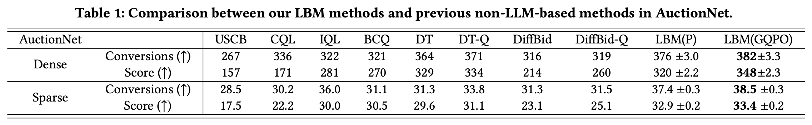

**Table 1 结果。** 在 Dense 数据上，LBM(GQPO) 达到 382 conversions / 348 score；在 Sparse 数据上达到 38.5 conversions / 33.4 score，均为表中最高。LBM(P) 表示使用预训练但未做 GQPO 微调的 LBM-Think，加上已训练的 LBM-Act；它已能超过 DT。GQPO 在其基础上进一步改善结果。

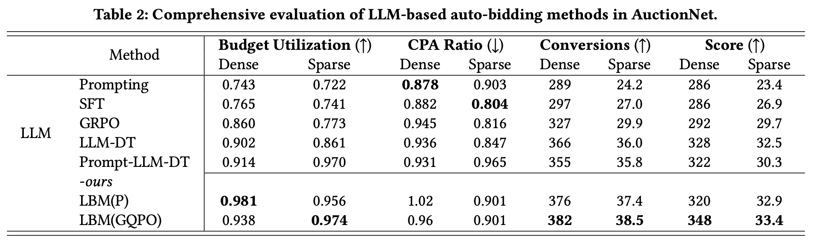

**Table 2 结果。** 纯语言 Prompting、SFT、GRPO 的预算利用率较低；把长数值序列转换成专门 embedding 的 LLM-DT 明显更强。LBM 同时保留数值表示效率与语言推理，LBM(GQPO) 在 conversions 与 score 上领先。

### 4.2.1 奖励设计实验

论文认为 LLM 先验可以减少对繁琐 reward shaping 的依赖。为了让 DT 同时兼顾转化与 CPA，作者尝试：

$$
\operatorname{rtg}_w
=\sum_{i=t}^{T}r_i+w\times\operatorname{penalty}_{t:T},
$$

其中训练时 $\operatorname{penalty}_{t:T}$ 根据未来时间步计算，推理时设为 1；$w$ 控制转化与 CPA 的平衡。

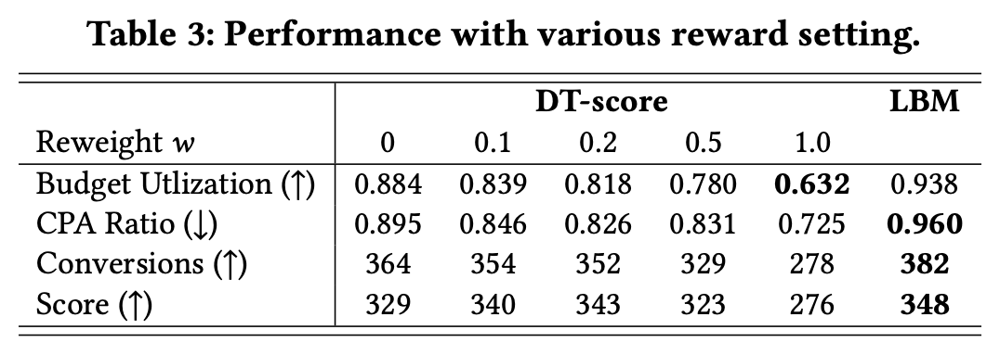

作者报告 DT 在 $w=0.2$ 时获得最高 score（343），但仍低于 LBM 的 348。论文据此强调：Score 的 penalty 是周期级指标，难以准确分配成单步信号，而 LLM 可以利用语言先验理解转化与 CPA 的权衡。

> [!warning] 原表加粗问题
> Table 3 中部分粗体与指标方向并不一致：例如 Budget Utilization 标注“越高越好”，但 $w=1.0$ 的 0.632 被加粗；CPA Ratio 标注“越低越好”，但 LBM 的 0.960 被加粗。这里保留论文原表，不按粗体重新解释，比较时以数值与箭头为准。

### 4.2.2 CPA 状态与动作方向

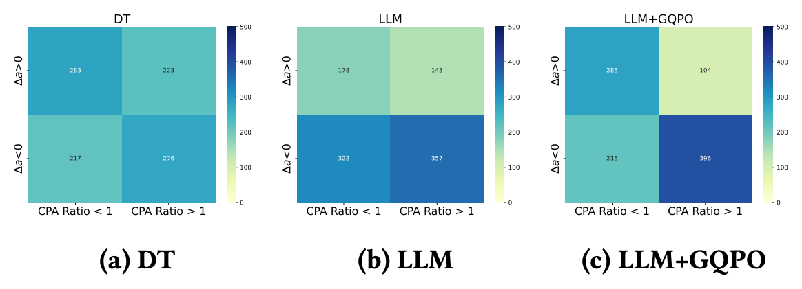

图 2 从 1,000 个随机样本统计 CPA ratio 与调价方向：当 CPA ratio 大于 1 时，合理策略更可能降低参数；小于 1 时，更可能提高参数。论文观察到 DT 与未微调 LLM 的这种关系不够明显，而 GQPO 微调后的 LLM 更符合该先验。

### 4.2.3 预算泛化

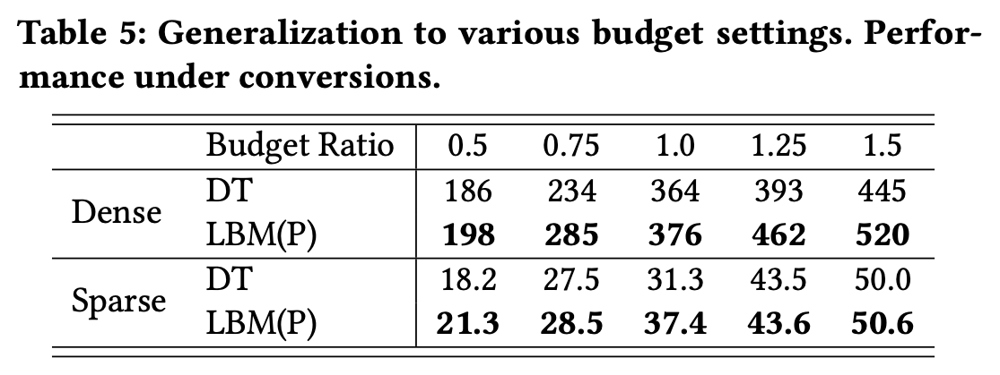

Table 5 在预算比例 $0.5,0.75,1.0,1.25,1.5$ 下比较 DT 与 LBM(P)。LBM(P) 在 Dense 和 Sparse 的所有预算设置中 conversions 都更高，论文将其作为泛化能力证据。

## 4.3 Performance of LLM-based Methods

### 4.3.1 为什么单语言模态效果差

- **Prompting**：不微调，直接让 LLM 在语言空间生成 CoT 和动作；
- **SFT**：用离线动作标签监督 LLM 在语言空间生成动作；
- **GRPO**：以生成动作和数据集动作的 L1 距离作为奖励，让单个 LLM 同时生成 CoT 与动作。

三者都把长数值序列与动作转换为语言 token。Table 2 显示它们不能充分利用预算；论文将其归因于长数值序列的低效语言表示。

### 4.3.2 Dual embedding 的训练效率与模态融合

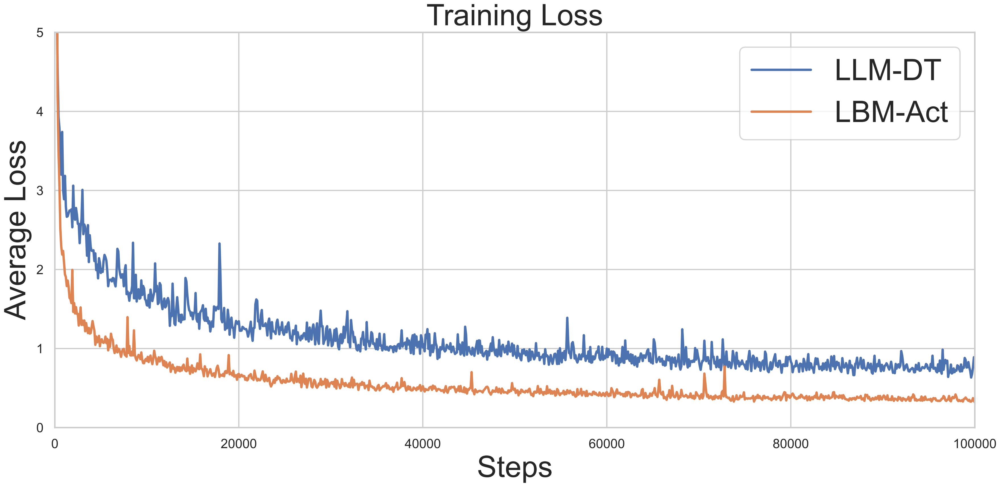

Figure 3 中，LBM-Act 的训练损失下降更快且整体低于 LLM-DT。作者据此认为语言指导与双嵌入有助于决策学习。

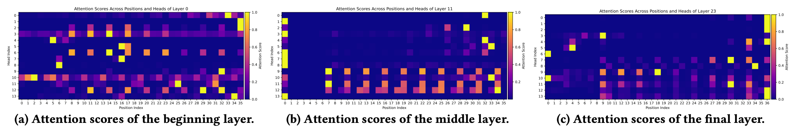

Figure 5 将位置 0—6 视为语言部分，其余位置视为数值部分。不同 attention head 分别关注语言或数值位置；中间层对两类位置出现明显分隔，最终层又有部分 head 更关注语言。作者将其作为两种模态确实发生融合的可视化证据。

### 4.3.3 指令跟随

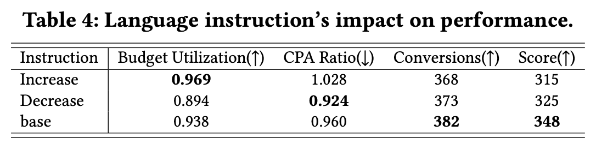

当高层被指示 increase 时，预算利用率升至 0.969；指示 decrease 时，预算利用率降至 0.894、CPA ratio 降至 0.924；base 获得最高 conversions 382 和 score 348。该实验说明语言指导确实能改变低层动作分布，但手工强制单一方向并不等于总体最优策略。

### 4.3.4 GRPO 的 CoT 坍缩

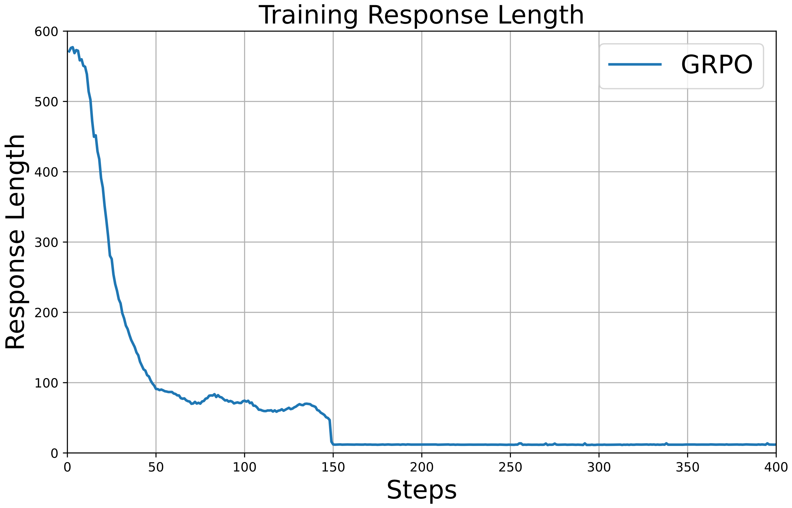

Figure 6 显示，用 GRPO 让一个 LLM 同时逐步推理并输出动作时，响应长度持续下降；约 150 个训练 step 后，模型基本只输出动作，不再给出额外推理。这一现象是论文采用 Think/Act 解耦结构的重要动机。

### 4.3.5 LBM-Think 模型大小消融

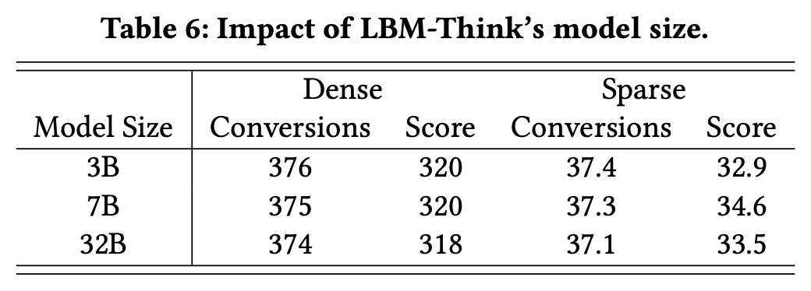

3B、7B、32B 的结果非常接近。作者认为 LBM 对 Think 骨干选择较稳健，3B 模型已经足以处理该自动出价任务；更大的模型没有在当前实验中带来稳定收益。

---

# 5. Related Works

## 5.1 Auto-Bidding Methods

论文回顾了以下路线：

- PID、OnlineLP 等控制与在线优化方法；
- USCB、SORL、MAAB 等强化学习方法；
- BCQ、CQL、IQL 等离线强化学习方法；
- DT、DiffBid 等生成式决策模型；
- GAS、GAVE 等离线数据增强方法；
- RTB-agent 等基于 LLM prompting 的自动出价方法。

作者认为离线 RL 依赖价值函数与 MDP 建模，生成式方法具有更强的序列建模潜力，但已有 DT/Diffuser 路线仍缺少可解释的语言推理；直接 prompting 又难以在大规模拍卖中产生精确动作。

## 5.2 LLM for Decision-Making

LLM agent 已被用于网页操作、移动设备控制与机器人，并通过 ReAct、Reflexion、记忆、检索和工具调用增强决策。进一步的 RL 微调方法包括 PPO、GRPO 与 GiGPO，但 on-policy 方法依赖真实环境或模拟器交互，成本和风险较高。

离线路线如 Digi-Q 使用 Q 函数过滤离线动作，LLM-DT 则以 DT 方式微调 LLM。论文对自己的定位是：**重点提升 LLM 的推理能力，并将这种推理通过连续动作模型落地，而不是只把 LLM 当数值序列 Transformer。**

---

# 6. Limitations and Conclusion

## 6.1 论文明确承认的限制

1. **只做离线微调**：由于安全风险，没有在真实广告环境持续 rollout，性能增益仍受离线数据与 critic 质量限制；
2. **推理时延**：当前只使用 vLLM 加速，在要求极高频参数调整的服务中仍可能受限；
3. **未来方向**：在安全控制下进行真实广告环境微调，并引入更先进的推理加速方法。

论文同时指出，工业中的参数调整周期可能长达 30 分钟，因此当前 LBM-Think 的秒级延迟在这类低频设定中可接受。

## 6.2 结论

LBM 用层级结构把“理解投放状态并形成语言策略”与“根据详细数值产生精确连续动作”拆开；dual embedding 负责跨模态融合，GQPO 则借助离线 Q 函数为 CoT 提供训练信号。实验表明，LBM 相比传统离线 RL、DT/DiffBid 及直接 LLM 方法取得更好结果，并展示了预算泛化、指令跟随与较快收敛。

> [!summary] 最重要的边界
> 论文证明的是：在 AuctionNet 离线基准中，这种层级架构与离线筛选机制有效。它没有证明 LLM 的 CoT 一定具有真实因果正确性，也没有通过线上实验验证部署收益；relative-Q 本质上仍是由离线 critic 提供的代理评价。

---

# Appendix

## A.1 Dataset Details

AuctionNet-Sparse 是转化更稀疏的 AuctionNet 版本。两个数据集各有 479,376 条轨迹、9,987 个 delivery periods，每条轨迹 48 个时间步，状态维度 16、动作维度 1。论文还从每个数据集中随机抽取 5,000 条轨迹，专门用于生成结果的可视化评价。

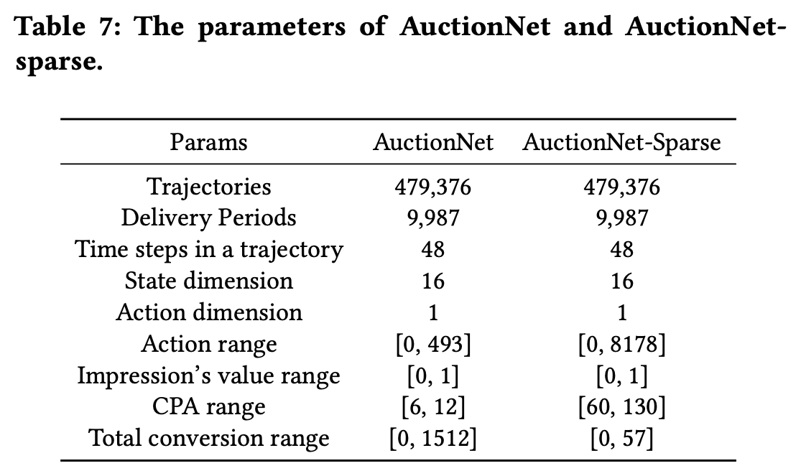

关键差异是动作范围、CPA 范围与总转化范围：Sparse 的动作范围和 CPA 范围更大，而总转化显著更少。

## A.2 Computational Efficiency

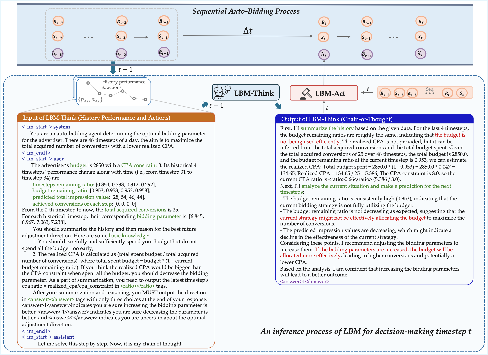

Figure 4 给出一个时间步的详细案例：

- LBM-Think 在 $t-1$ 读取最近 4 个时间步的转化、剩余预算和预测曝光价值；
- Prompt 要求模型计算 CPA ratio，这既帮助理解任务，也可用于检查幻觉；
- Think 最终推理未来 bidding parameter 的调整方向；
- 在 $t$ 到来时，LBM-Act 读取该 CoT 与前 10 个时间步的数值序列并输出动作。

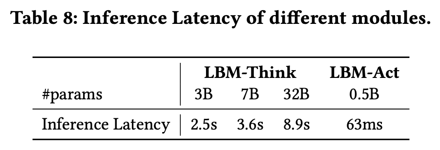

在 H800 GPU 上使用 vLLM：3B、7B、32B LBM-Think 的延迟分别为 2.5s、3.6s、8.9s，0.5B LBM-Act 为 63ms。由于 Think 可以在间隔 $\Delta t$ 内提前异步执行，真正进入时间步 $t$ 的动作链路主要由较小的 Act 承担。

## A.3 Details of Baselines and Implementation

### A.3.1 LLM 基线

- Prompting 与 SFT 都接收任务描述、状态、历史动作和 return-to-go；前者只做 prompt engineering，后者用语言动作标签监督微调；
- GRPO 让单模型同时生成 CoT 和动作，但实验中预算利用不足且 CoT 缩短；
- 三种纯语言方法都基于 Qwen2.5-3B-Instruct；
- LLM-DT 的输入输出与 DT 相同，数值序列中的每个 item 通过三层 MLP 变成一个 embedding；
- Prompt-LLM-DT 在此基础上加入语言任务描述，但仍不生成推理 CoT。

### A.3.2 Q-value critic

论文使用接收状态—动作序列的 Transformer 构建 Q-value，训练方式遵循 IQL。

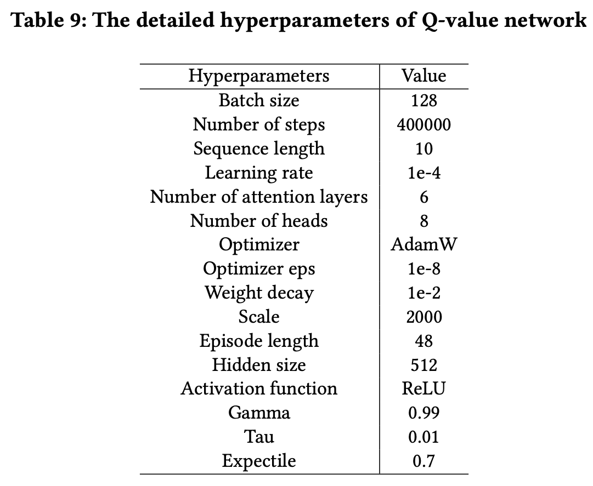

主要参数为：batch size 128、400,000 steps、序列长度 10、学习率 $10^{-4}$、6 层 attention、8 个 head、hidden size 512、$\gamma=0.99$、expectile 0.7。表中的 `Tau=0.01` 与 `Expectile=0.7` 是两个独立配置项；正文 expectile loss 中的 $\tau$ 对应 expectile 参数，而表格没有进一步解释 0.01 的具体更新用途。

## A.4 Discussion on Online Learning and RL

论文将 Online Learning（OL）与 RL 区分为：

| 维度 | Online Learning | Reinforcement Learning |
|---|---|---|
| 主要目标 | 最小化 regret | 最大化累计奖励 |
| 动作空间 | 通常从离散可行集合选择 | 可用神经网络处理连续动作 |
| 约束 | 常在每个时间步满足预算/ROI 约束 | 可在周期结束时统一满足约束 |
| 假设 | 常依赖稳定、可预测的成本/转化分布 | 通过调节 bidding parameters，较少依赖这些最优性假设 |
| 数据交互 | 通常需要在线探索与策略更新 | 离线 RL 可直接使用静态历史数据 |

论文最后给出 GQPO 与离线 RL 的关系：AWR 原本在数值动作空间中用优势加权策略回归；GQPO 把 **CoT 当作 LBM-Think 的动作**，把 **relative-Q 当作优势**，从而把这一思想迁移到语言空间。

---

# 复盘：这篇论文真正解决了什么

## 1. 它解决的不是单一“长尾”问题

论文所说的 mode coverage 指离线轨迹无法覆盖所有动态投放状态。LBM 的应对方式是引入 LLM 预训练先验与语言规则，使高层策略不完全依赖数值数据中出现过的局部模式；但论文没有专门设计长尾重采样、罕见状态建模或长尾理论保证。因此更准确地说，LBM **试图改善有限离线覆盖下的泛化**，而不是完整解决统计意义上的长尾分布。

## 2. 它处理的“多模态”是语言与数值

这里的多模态不是图像、文本、音频，而是：

- LBM-Think 产生的自然语言 CoT；
- DT 式的连续数值决策序列。

Dual embedding 让两者分别编码，再由同一 Transformer 注意力融合。Figure 5 是论文用于支持该融合确实发生的证据。

## 3. GQPO 的核心价值

GQPO 避免了真实环境 rollout：它不直接优化线上结果，而是利用离线 IQL critic，把每条 CoT 经 LBM-Act 转换后的动作与数据集动作比较。其优势是安全、稳定、可离线执行；其弱点是可能继承 critic 的估值误差，也只能评价 LBM-Act 能够表达和执行的语言指导。

## 4. 三个模型各自学什么

| 模型 | 训练信号 | 学到的内容 |
|---|---|---|
| LBM-Act $f_\phi$ | 数据动作的 L2 监督损失 | 语言指导 + 数值序列到连续动作的映射 |
| IQL critic $Q_\varphi,V_\psi$ | expectile 回归与 Bellman 回归 | 离线数据覆盖范围内的状态/动作长期价值 |
| LBM-Think $h_\theta$ | GQPO 筛出的最佳正增益 CoT 的 SFT | 更可能诱导高 relative-Q 动作的语言推理 |

最终推理时只需要 LBM-Think 生成 CoT、LBM-Act 生成动作；Q/V critic 主要服务于离线 GQPO 数据构造与训练，不是论文所述在线动作链路的必需模块。
