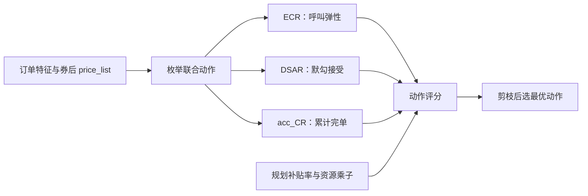
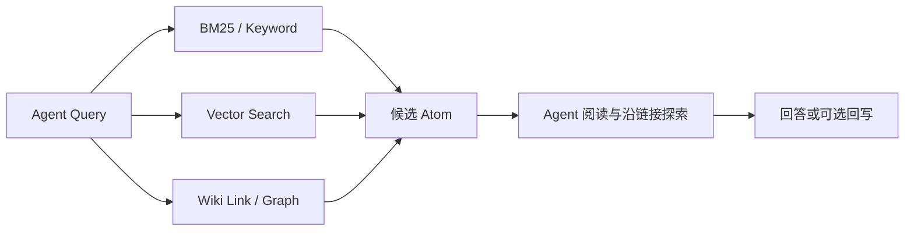

# 新人串讲：乘客侧链路与平台联合决策 V3/V4

> [!abstract] 核心内容
> 本文先梳理乘客从进端、冒泡、发单到完单支付的链路，再解释平台联合决策如何在呼叫前统一选择幸运盒子定价、特价盒子折扣和默勾位置。V3 以 `ECR × DSAR × acc_CR` 近似动作的预估完单，在补贴率约束下在线选优；V4 计划升级为动作级端到端 BCR、多目标权重和双资源约束。

关联笔记：[[花小猪乘客与增长方向业务介绍（整理版）]]

## 1. 阅读地图


需要牢记三个边界：

- **联合决策发生在呼叫前**，输入是前置优惠后的候选价格；
- **dups 输出联合动作和原始价格锚点**，不直接生成最终车型集合；
- **Athena 基于真实表单和规则生成最终结果**，节点图表示功能落点，不应直接当作严格的服务调用时序。

## 2. 乘客侧链路

### 2.1 产品形态

乘客端表单同时包含：

- 平台聚合盒子：幸运盒子、特价盒子等；
- 自营品类；
- 商家品类。

平台通过盒子价格、折扣和默勾锚点，影响乘客看到的价格、排序、折叠与默认勾选结果。各品类价格下方的“已减”角标表示该品类独立的优惠项；盒子、自营与商家品类的优惠互相独立。

### 2.2 乘客视角的完整流程


| 环节 | 端上形态 | 关键说明 |
|---|---|---|
| 进端 | 首页定位页、福利活动区、活动弹窗 | 限时券倒计时或弹窗发券；尚未进入交易链路，所得券会在冒泡时参与前置优惠计算 |
| 冒泡 | 预估表单页 | 展示预估价格、品类、默勾与呼叫牵引信息 |
| 发单与等待应答 | 等待应答页 | 点击“同意协议并叫车”后正式进入交易链路；期间可能发生补勾、预分单、升舱 |
| 应答后 | 接驾页、送驾页、行程结束页、取消页 | 承接履约、支付以及再次发单回流 |

冒泡页通常包括地图、品类 Tab、确定性牵引文案、必有车沟通、表单、呼叫牵引位和底部操作栏。

### 2.3 发单后的平台交易主时序


### 2.4 等待应答期间的三类变化

预分单和升舱共用一类触发逻辑：原勾选运力迟迟未应答，达到模型判断的触发时机后，平台在乘客无感知的情况下召回未勾选品类。若原勾选运力先应答，仍优先使用原勾选结果。

| 机制 | 触发条件 | 乘客动作 | 后续流向 |
|---|---|---|---|
| 补勾 | 当前勾选品类未形成可用候选 | 乘客确认是否增加品类 | 确认后扩大召回范围并重新召回；不确认则原呼叫继续等待 |
| 预分单 | 水下召回找到候选，但不满足升舱钱效或预算条件 | 限时确认 | 接受后进入候选举手、平台 PK 和派单；拒绝或超时则继续等待原呼叫 |
| 升舱 | 水下召回找到候选，且满足钱效和预算条件 | 平台或商家补差价，默认接受 | 进入候选举手、平台 PK 和派单流程 |

### 2.5 应答后的回流设计

- 等待接驾页：展示接驾状态、价格沟通位和司机卡片；
- 送驾页：展示送驾状态与完单预估；
- 行程结束页：承接完单和支付，并可能通过完单任务券牵引“再来一单”；
- 取消页：通过“重新叫车”回流冒泡页。

## 3. 出价与补贴机制

### 3.1 四种价格口径

| 口径 | 定义 | 使用注意 |
|---|---|---|
| 基础价 `basic_total_fee` | 基础费用加可抵扣附加费，不含不可抵扣费项 | 前置优惠的计算基数；前置优惠后金额 = 基础价 − 前置最大优惠金额 |
| 实付价 `estimate_fee` | 基础价减前置最大优惠和呼返优惠，再加回不可抵扣费项 | 用于真实排序和补贴成本计算时要区分具体费项 |
| 应付价 `need_fee` | 基础价加回不可抵扣费项后的乘客应付口径 | 不是乘客最终支付金额 |
| 展示价 `show_fee` | 对实付价取整后展示给乘客 | 一口价向上取整到角，实时计价向下取整到元；不可由展示价反推补贴成本 |

附加费边界：

- 供需系数、全城动态调价、时空动态调价可以被优惠抵扣，并参与平台抽成（TR）；
- 节假日服务费、跨城费、加价快走属于不可抵扣费项，全额给司机，不参与平台抽成，也不进入折扣基数。

### 3.2 一般优惠核销顺序

```text
API 商家优惠
  → 乘客应付（GMV）
  → 平台券
  → 会员券
  → 商家呼返
  → 品牌优惠
  → 平台呼返
  → 乘客实付
```

收银链路还可能增加花花币、随单立减金等环节。

| 优惠层 | 计算特点 |
|---|---|
| 前置券 | 通常在上一层结果上继续计算 |
| 商家呼返 | 按乘客应付口径重算，可能抹平部分前置券效果 |
| 品牌优惠、平台呼返 | 在相应前置结果上继续计算 |
| 随单立减金 | 在上述优惠后继续核销 |

> [!important] 易错点
> 展示价不等于真实实付价；优惠也并非都在同一计算基数上连乘。分析排序、补贴成本或钱效时必须使用对应价格口径。

## 4. 表单策略工程链路

### 4.1 三个核心服务

| 服务 | 主要职责 | 不负责什么 |
|---|---|---|
| dups | 接收前置价格结果；为候选折扣组合生成仿真 `price_list`；给“折扣组合 × 默勾组合”评分；输出价格结果和原始价格锚点 | 拿不到最终真实表单价格和折叠结果，不直接输出最终车型集合 |
| Euler | Athena 前执行展示价格取整；Athena 后执行同价车型合并 | 不选择联合动作，也不执行默勾后处理 |
| Athena | 动态展现、折叠、盒子扩展、默勾；随后执行锚点取整、校验、兜底、防跳勾、价差处理，生成最终车型集合 | 不承担联合决策的动作求解 |

Athena 默勾后还存在并列分支，例如置顶推荐位、聚便宜/贵必赔、无车赔等，最终汇入预估应答率与网顺同呼。它们是并列策略，不是简单的依次执行关系。原材料注明价格轴已经下线。

### 4.2 折叠顺序与应付折叠策略

线上 Athena 和 V4 的 dups 折叠模拟均遵循：**非价格折叠先于价格折叠**。

| 维度 | 策略 A | 策略 B |
|---|---|---|
| 触发 | 某商家任一品类应付价低于特价盒子 | 某商家应付价低于特价盒子 |
| 范围 | 折叠该商家的全部品类 | 仅折叠应付价倒挂的可控运力；三方商家不受此约束 |
| 力度 | 更激进，出现倒挂即整商家折叠 | 更保守，仅约束可控运力 |
| 生效 | 按城市配置，一个城市只命中一套 | 同左 |

## 5. 两种平台聚合盒子

| 维度 | 幸运盒子 | 特价盒子 |
|---|---|---|
| 表单位置 | 展现时必须是表单最低价 | 低价品类，但可被幸运盒子再压低一档 |
| 决策变量 | 定价；候选价取自特价盒子不同折扣下的实付价，展现时至少再低 3pp | 折扣；V3 在前置优惠后的价格上追加平台 C 补，即折上折 |
| 100 折含义 | 不展现 | 本次不追加平台 C 补，但盒子仍可展现 |
| 展现条件 | 有条件展现；熔断、全城/时空动调、围栏定价等场景不展现，并受 B 侧价格与 acc_CR 约束 | 常规展现，受通用表单规则影响 |
| 交易能力 | 部分司机关闭愿接，不支持连环派与扩播，运力池较小 | 愿接面更大，交易能力更强 |
| 品类优先级 | 最低 | 高于幸运盒子、低于普通品类 |
| 完单结构 | V3 立项时约占 4%，其中超过 90% 来自单勾幸运盒子发单 | 平台一口价完单的主要构成 |

品类交易优先级：**特快盒子 > 普通品类 > 特价盒子 > 幸运盒子**。

## 6. 平台联合决策 V3

### 6.1 目标与约束

V3 的全年主目标是：在拉齐花业务补贴率的前提下，实现大盘人均完单提升 1%。

| 约束指标 | 方向 | 程度 |
|---|---|---|
| 花业务补贴率 | 不抬升 | 与对照组拉齐，允许在 ±0.1pp 内波动 |
| 幸运盒子份额 | 不负 | 不负向变化 |

### 6.2 业务抽象

| 要素 | V3 定义 |
|---|---|
| 决策空间 | 幸运盒子定价 × 特价盒子折扣 × 默勾位置 |
| 目标 | 最大化预估完单：`ECR × DSAR × acc_CR` |
| 资源约束 | 全局补贴消耗不超过规划补贴率 β 对应额度；V3 的新增平台 C 补只给特价盒子 |
| 因果模型 | ECR：估计折扣对冒泡发单率的增量影响 |
| 响应模型 | DSAR：估计默勾接受度；acc_CR：估计累计完单概率 |

V3 的两个重要近似假设：

1. **最低价驱动 ECR**：只将幸运盒子或特价盒子中的最低价映射到特价盒子对应折扣档的 ECR，不单独建模其他品类价格影响；
2. **默勾不接受近似为不完单**：用三项连乘近似动作完单，忽略反勾或加勾后仍然完单的路径。

> [!warning] 公式缺失
> 原始纯文本导出未保留 V3 优化目标、资源约束和聚合公式的数学排版。因此本文只保留已确认的结构，不补造精确符号公式。

### 6.3 策略框架

V3 读取订单信息和券后 `price_list`，枚举特价盒子折扣、幸运盒子定价及默勾组合。ECR、DSAR 和 acc_CR 分别预估呼叫、默勾接受与累计完单，在线求解再结合规划补贴率和离线拉格朗日乘子选出动作。



## 7. V3 三个模型

### 7.1 ECR：冒泡发单率因果模型

| 要素 | 内容 |
|---|---|
| 样本 | 冒泡粒度，每个冒泡一条；来自联合决策折扣随机实验流量 |
| Treatment | 特价盒子折扣档：100/97/94/91/88/85/82/79/76/73 |
| 对照组 | 100 折 |
| Label | 该冒泡是否发单 |
| 特征 | 用户、订单、供需、价格，以及新增的竞争相关特征 |
| 结构 | DRCFR 因果模型 |

在线映射：

- 幸运盒子展现时，它一定是最低价，使用与幸运盒子折扣相同档位的特价盒子 ECR；
- 幸运盒子不展现时，使用特价盒子的实际折扣档 ECR。

例如，幸运盒子 73 折、特价盒子 82 折，则动作的 ECR 使用 73 折档预估值。

### 7.2 DSAR：默勾接受度模型

| 要素 | 内容 |
|---|---|
| 样本 | 呼叫冒泡构造，每个呼叫订单一条 |
| Label | 用户是否发生反勾行为 |
| 纠偏 | 加入随机默勾实验数据，缓解默勾样本偏差 |
| 特征 | 用户历史呼叫行为、订单信息、商家价格序列 |
| 损失 | BCE |
| 离线效果 | 上线版本 AUC 0.886 |

### 7.3 acc_CR：累计完单率模型

#### 为什么从 acc_AR 升级

V2 的 XGBoost acc_AR 存在两类问题：

- 将单呼商家应答率按独立事件累乘，容易高估总应答率，也难以感知供需变化；
- 只建模到应答，未考虑应答后的司乘取消，因此会高估成交；商家完单概率由单呼应答率归一化也不够准确。

此外，同一商家可能同时存在多个品类，默勾数量变化会改变该商家的真实发单品类与实际成交能力，必须显式考虑品类优先级和运力池差异。

#### 建模设计

| 设计点 | 方案 | 理由 |
|---|---|---|
| 样本维度 | 商家维度，单商家过模型后在冒泡维度聚合 | 避免冒泡级 5000+ 维商家特征、动作空间和大量 padding 导致维度灾难；代价是一次呼叫需多次推理并聚合 |
| 模型类型 | Response Model | 真实供需对 CR 影响远大于折扣；折扣影响由特价盒子实付价特征学习 |
| 特征 | 订单基础、各品类价格、实时交易漏斗、在线/空车/举手司机数、商家历史、乘客历史 | 同时刻画价格、供需、商家和用户 |
| 主干 | 稀疏特征 Embedding + 稠密特征 → Shared MLP → 三个任务塔 | 多任务共享表示 |

三个输出任务：

1. 分品类的单商家呼叫完单贡献，用于聚合累计完单率；
2. 分品类的单商家完单贡献，用于聚合商家完单概率和计算加权 GMV、Cost；
3. 单呼商家应答概率，作为辅助任务并供下游交易使用。

前两个任务按特价盒子、盒外普通品类和特快盒子分别输出。聚合时先按交易优先级确定每个商家的真实发单品类，再取对应输出：累计完单贡献经求和、Sigmoid 后归一到 0～1；商家完单贡献做 Softmax，使候选商家完单概率之和为 1，并表达商家间竞争。

#### 离线效果与特殊处理

| 任务 | AUC |
|---|---:|
| 呼叫完单 | 0.784 |
| 商家完单 | 0.901 |
| 应答 | 0.889 |

相比 acc_AR，acc_CR 能体现高峰预测 CR 较低、平峰预测 CR 较高的供需变化。幸运盒子的 acc_CR 在特价盒子预估结果上乘以小于 1 的城市/商家惩罚系数，并再乘“幸运盒子折扣 / 100”以保证折扣方向上的单调性。

## 8. V3 在线决策逻辑

对每次冒泡依次执行：

1. 枚举候选折扣组合，生成各组合的 `price_list`；
2. 计算各候选折扣对应的 ECR；
3. 根据时段、定价与围栏等条件判断幸运盒子是否可以展现；
4. 按 B-CPM、B 总价、滴滴快车 Y 折、最低价和幸运盒子 acc_CR 等约束剪枝；
5. 按价格升序计算默勾到第 `k` 个车型时的 DSAR 与 acc_CR；
6. 按城市 acc_CR 阈值过滤完单率过低的默勾组合；
7. 将预估完单、GMV、Cost、规划补贴率和离线资源乘子纳入评分，选择最优折扣组合与默勾位置。

| 护栏 | 作用 |
|---|---|
| B-CPM | 约束司机侧每公里收入，决定幸运盒子定价下限之一；此解释是原材料中的口径推断 |
| B 总价 | 约束司机侧整单总价，与 B-CPM 共同决定定价下限 |
| 滴滴快车 Y 折 | 作为幸运盒子定价上限 |
| 最低价约束 | 幸运盒子展现时必须为表单最低价 |
| 幸运盒子 acc_CR 阈值 | 过滤交易能力不足的幸运盒子动作 |
| 默勾 acc_CR 阈值 | 过滤累计完单率不足的默勾深度 |

注意：两种盒子的 100 折语义不同。“没有盒子”既可能是幸运盒子展现门槛没通过，也可能只是特价盒子动作退化为 100 折、没有追加本次补贴。

## 9. V3 实验结论与上线状态

收益路径是：**扩大联合动作空间 + 提升预估准确性 → 在拉齐补贴率约束下提高人均完单。**

### 9.1 机制拆解

| 收益链路 | 机制 | TOP 城市结果 |
|---|---|---|
| 最低价弹性 | 平峰等场景用幸运盒子创造更低表单最低价，避免 ECR 对最低价变化失真 | ECR +0.38pp；人均冒泡 +1.74%；人均呼叫 +2.28% |
| 默勾决策 | 使用完整 `price_list`，支持单勾幸运盒子；按供需动态调整默勾车型数 | 默勾接受度 +2.58pp；默勾单勾占比 +5.9pp；单勾幸运盒子 +7.9pp；CR 基本持平 |
| 补贴效率 | 平峰利用幸运盒子低价成交节约 C 补，高峰加深特价盒子折扣促成交 | 花业务补贴率 −0.12pp；Adjust-FROI +121% |

### 9.2 两轮实验

| 实验 | 周期 | 人均完单 | ECR | CR | 默勾接受度 | 花业务补贴率 |
|---|---|---:|---:|---:|---:|---:|
| TOP 城市 | 2025-10-15 ～ 2025-10-28 | +2.42% | +0.38pp | 基本持平 | +2.58pp | −0.12pp |
| 剩余城市 | 2025-11-18 ～ 2025-12-01 | +2.58% | +0.29pp | +0.16pp | +2.80pp | −0.25pp |

上线状态：V3 于 2025-12-12 全国全量。原材料截至 2026-08-31 的口径为：线上使用 V3 框架，但阈值和超参数已被 V3.3 CR 阈值优化覆盖。

## 10. V3 与 V4 对比

### 10.1 总体状态

| 维度 | V3 | V4 设计 |
|---|---|---|
| 线上状态 | 全国全量，为线上主框架 | 建设和验证中，尚非主版本 |
| 建设状态 | 已完成全量 | BRD、方案评审和联合 RCT 已完成；离线特征与样本链路已落地；BCR 训练推进中；离线仿真、规划求解、离在线一致性和小流量 AB 尚未完成 |

V4 相关实验时间：联合随机实验为 2026-07-04～2026-07-21，幸运盒子长期 RCT 为 2026-07-04～2026-08-02。

### 10.2 目标与资源约束

| 维度 | V3 | V4 设计 |
|---|---|---|
| 主目标 | 补贴资源约束下最大化短期完单 | 以短期完单为核心，并支持长期代理目标与多业务目标 |
| 全局资源 | 花业务补贴率 | 特价盒子补贴率 + 幸运盒子水位 |
| 业务调节 | 阈值、固定折扣和实验 | 目标权重、水位约束和离线回放 |

### 10.3 决策与求解

| 维度 | V3 | V4 设计 |
|---|---|---|
| 动作 | 幸运盒子定价、特价盒子折扣、默勾位置 | 三维基本不变，第三维明确为默勾数量 |
| 工程边界 | dups 内，位于前置优惠之后、Euler/Athena 之前 | 工程位置不变，属于 dups 内部机制升级 |
| 单冒泡规则 | 多种价格、展现和 CR 阈值剪枝 | 删除默勾 CR 阈值；部分硬规则改由目标权重和离线仿真承接，保留风控、价格、围栏、动调、非展现时段和输入缺失等护栏 |
| 离线 | 根据规划补贴率产出单资源乘子 | 训练动作级模型、扫描 Pareto，产出权重和双资源乘子 |
| 在线 | 枚举、重算价格、剪枝，按 V3 Score 选优 | 延续枚举与剪枝，按 Adjusted Score 选优，并引入 Pacing 校准 |

V4 删除默勾 CR 阈值被列为收益来源之一，原材料中的预估为人均完单约 +0.35%；这属于方案预估，不是已完成线上实验的确定收益。

### 10.4 模型与评价

| 维度 | V3 | V4 设计 |
|---|---|---|
| 完单估计 | `ECR × DSAR × acc_CR` 的组合近似 | 动作级端到端 BCR |
| 主评价 | 分别评价 ECR、DSAR、acc_CR | 围绕动作级 BCR 的联合评价 |
| 关键指标 | 呼叫 MTAUCC、AUC、值准性 | MTAUCC、MTAUPC、BR-DC；并单独评价 ECR、CR、BCR、DSAR 与品类完单分布 |

三个 V4 核心排序指标在原材料中的用途：

- MTAUCC：衡量特价盒子补贴约束下的增量完单排序；
- MTAUPC：衡量固定特价盒子折扣下，幸运盒子水位变化的排序；
- BR-DC：比较零成本场景下模型最优决策与随机决策。

## 11. 新人易混淆点

1. **冒泡不等于发单**：冒泡是预估表单请求，点击确认叫车才进入交易链路。
2. **展示价不等于实付价**：展示价经过取整，不适合直接算补贴成本。
3. **幸运盒子 100 折不展现；特价盒子 100 折仍可展现**。
4. **价格锚点是工程输出，不是 V3 的原始求解变量**：求解变量是默勾位置或数量。
5. **dups 的 `price_list` 是仿真结果**：最终车型集合还要经过 Athena 的真实表单规则。
6. **三个模型角色不同**：ECR 是折扣 Treatment 的因果模型；DSAR 和 acc_CR 是响应模型。
7. **单抓手最优不等于联合最优**：定价、补贴和默勾共同改变最低价、接受度、交易能力与成本。
8. **V4 是设计与建设状态**：不能把预估收益或离线进度写成线上结论。

## 12. AI 提效附录

原串讲还介绍了模型接入、实验管理和远程知识库三类 AI 工程工具。它们与联合决策业务主线相对独立，故收录为附录。

### 12.1 模型接入与合规边界

原文介绍了通过第三方反向代理降低模型 Token 成本的方式，同时明确指出该方式不符合官方使用条款，存在较高封号和历史记录丢失风险。因此：

- 本笔记不保留第三方代理的账号接入、授权回填、密钥生成等操作步骤；
- 个人与团队使用均应优先采用官方登录或官方 API；
- 不应将账号授权码、Cookie、Token 或 API Key 写入知识库。

### 12.2 Calday：实验管理

目标是让人和 Agent 都能查询历史实验、观察实时进度和归档结果，减少直接翻训练日志的低效操作。

核心对象：

- Event：实验或训练事件，记录标题、时间、类型和状态；
- Training Run：某个训练事件下的运行实例；
- Log：事件或 Run 的增量日志，支持批量追加与游标读取。

典型状态机：

```text
Event: planned → in_progress → completed / failed / cancelled
Run:   queued  → running     → succeeded / failed / stopped
```

工程要点：日志上传走后台队列，避免阻塞训练；批量请求需使用幂等键；更新操作带版本号以处理并发；鉴权信息只从环境变量读取，不落入文档或代码库。

### 12.3 Atomic：远程知识库与团队复用

本地文件型 LLM Wiki 的优势是结构简单、支持沿双向链接多跳探索；缺点是规模扩大后上下文容易膨胀，且不利于跨项目和团队复用。

改进后的检索结构：



推荐分层：

- Atomic 负责检索、摘要、关系图和索引；
- 原始 Cooper 页面作为事实源；
- 当 Atom 信息不足时，Agent 应沿原文链接继续读取，而不是根据摘要补全公式或实验口径；
- 可选回写应注明来源、日期和证据边界。

## 13. 资料状态与证据边界

- 本文基于 2026-08-31 更新的纯文本导出整理，串讲日期为 2026-08-18。
- 原页面的产品截图、架构图和多数数学公式未随文本完整导出；本文使用文字与 Mermaid 重建关系，但不冒充原图。
- 实验指标、上线状态、阈值和负责人会变化，正式决策前应回查对应 LR/BRD、实验报告和线上配置。
- B-CPM 被解释为 B 侧每公里收入保护，是原材料明确标注的口径推断，并非公式原文。
- V4 相关内容均按“设计中/验证中”表述；预估收益不能当作线上已实现收益。
- 文中内部产品名和技术缩写沿用原材料，避免在不具备权限的外部渠道传播。

