# HSTU：生成式推荐与层次序列转导单元

> [!abstract] 一句话结论
> 这篇论文的核心不是“给推荐换一个 Transformer”，而是把 DLRM 的异质特征、排序和召回统一成用户行为序列上的生成式转导，再用 HSTU、Stochastic Length、ragged GPU kernel 与 M-FALCON 共同解决质量、训练成本和多候选在线推理问题。

## 论文信息与阅读边界

- 原文：[arXiv:2402.17152v3](https://arxiv.org/abs/2402.17152)
- 会议：ICML 2024
- 关键词：Generative Recommenders（GR）、HSTU、pointwise attention、Stochastic Length、M-FALCON
- 版本说明：本文覆盖 v3 正文和技术附录 A–H。
- 概念边界：论文的 token 是内容 $\Phi$、动作 $a$ 及其他顺序化类别特征；它**没有**提出 RQ-VAE/SID 语义 ID 管线，不能把二者混为一谈。

## 摘要与贡献地图

论文认为传统 DLRM 的问题不只在模型模块多，而在整个问题表述：大量手工类别/数值特征、召回与排序各自建模、每次曝光单独训练。GR 将用户—内容交互变成统一时间序列，在一次 causal forward 中为多个位置产生监督。

四层贡献相互依赖：

1. **任务层**：将 retrieval 和 ranking 重写为 sequential transduction。
2. **模型层**：HSTU 用 pointwise SiLU attention 与门控融合 attention/FFN。
3. **训练层**：generative training 摊销 encoder；Stochastic Length 人工增加稀疏度；fully ragged kernel 利用真实长度分布。
4. **推理层**：M-FALCON 让目标感知的多个候选并行、微批并缓存历史 K/V。

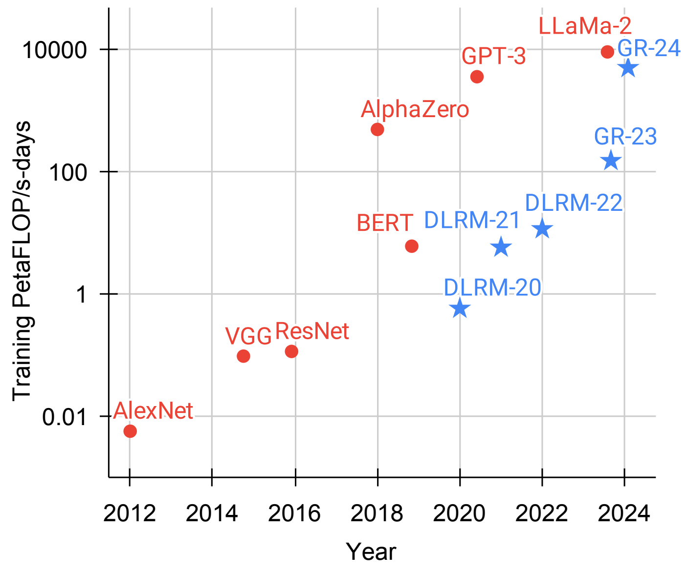

**图 1。** 推荐模型训练算力随时间增长。论文报告其 GR 已扩展到万亿参数量级；这张图是工业系统趋势证据，不等同于公开可复现 benchmark。

## 1 引言

语言模型可以用统一 token 序列和 next-token objective 吸收多任务，而工业推荐仍依赖上千至上万异质特征与手工模块。论文提出“actions speak louder than words”：用户真实行为序列比人为统计特征更接近推荐所需的监督。

关键挑战有三类：非平稳且超大词表；序列长且 batch 大；排序阶段需同时打分数百到数万候选。仅把 Transformer 搬过来会在质量、显存和吞吐上失败，因此论文同时重构了数据、目标、block 与 kernel。

## 2 从 DLRM 到生成式推荐

### 2.1 统一异质特征空间

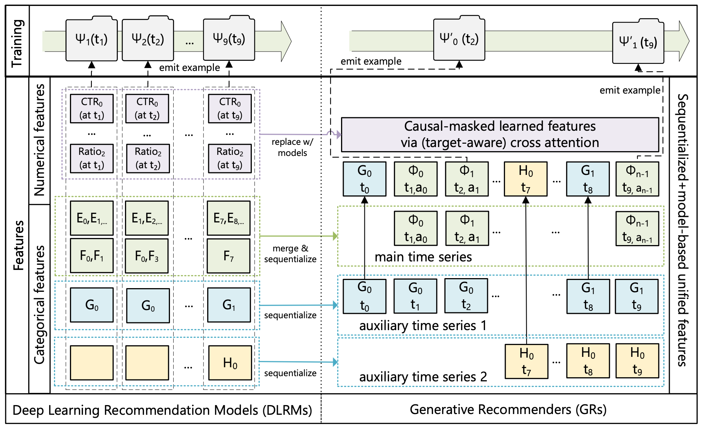

**图 2。** 上部对比 DLRM 的特征与 GR 的统一时间序列；下部对比 impression-level training 与 generative training。

**类别/稀疏特征。** 先把用户内容交互合并成主时间序列。变化慢的序列（人口属性、关注创作者等）只保留连续片段的最早变化点，再并入主序列，因此不会大幅增加长度。

**数值/稠密特征。** 衰减计数、比例、历史 CTR 等更新频繁，完全顺序化代价太大。论文的主张是：这些统计所依赖的类别事件已经进入序列；当转导器足够强、序列足够长且使用 target-aware formulation 时，可让模型从原始事件重建其作用，从而移除手工数值特征。这是随容量成立的工程假设，不是无条件数学等价。

> [!note] 直观理解
> 与其给模型“用户过去 30 天看科技视频的加权次数”，不如给它带时间和动作的原始观看序列，并让候选科技视频在 causal attention 中直接读取这些行为。

### 2.2 排序与召回作为序列转导

给定按时间排序的 $x_0,\ldots,x_{n-1}$，转导任务产生 $y_0,\ldots,y_{n-1}$，允许 $y_i=\varnothing$。内容 token 为 $\Phi_i\in\mathbb X_c$，动作 token 为 $a_i\in\mathbb X$，词表随新内容产生而非平稳。

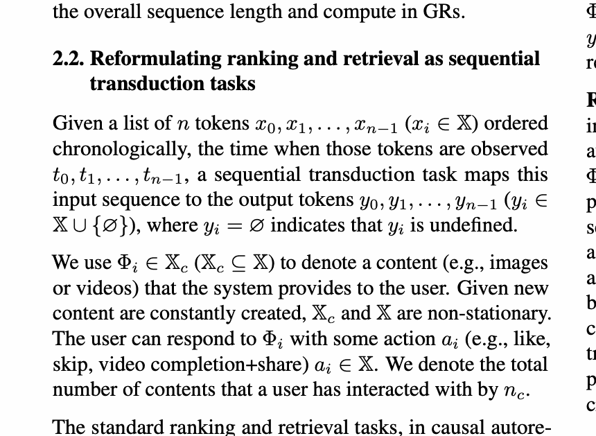

**表 1。** 排序输入交替为 $\Phi_0,a_0,\Phi_1,a_1,\ldots$，在内容位置预测动作；召回把 $(\Phi_i,a_i)$ 作为输入位置，仅当下一内容获得正反馈时把它作为目标。

**Retrieval：** 学习

$$
p(\Phi_{i+1}\mid u_i),\qquad
\arg\max_{\Phi\in\mathbb X_c}p(\Phi\mid u_i).
$$

监督不一定是时间上的下一个曝光内容，因为负反馈内容不应成为正目标；其他类别特征之后也可能没有 retrieval target。

**Ranking：** 把候选内容和动作交错，在 $\Phi_{i+1}$ 位置直接预测：

$$
p(a_{i+1}\mid \Phi_0,a_0,\Phi_1,a_1,\ldots,\Phi_{i+1}).
$$

这样候选 token 在进入 encoder 时就参与注意力，属于 early target-aware interaction；一个小多任务头把候选位置输出变成点击、观看等预测。

### 2.3 Generative Training

若每个 impression 都重算用户长度 $n_i$ 的历史，成本为：

$$
\sum_i n_i(n_i^2d+n_id_{ff}d),
$$

取 $d_{ff}=O(d)$、$N=\max_i n_i$，上界为 $O(N^3d+N^2d^2)$。generative training 在一个序列 forward 中监督多个位置，并按 $s_u(n_i)$ 采样用户：

$$
\sum_i s_u(n_i)n_i(n_i^2d+n_id^2).
$$

令 $s_u(n_i)=1/n_i$，降为 $O(N^2d+Nd^2)$。工业实现可在 request/session 结束时发样本，使经验采样率近似 $1/n_i$。

## 3 HSTU：面向生成式推荐的高性能编码器

### 3.1 单层结构

HSTU 每层只有三个子步骤，并以 residual 连接堆叠。

**Pointwise Projection：**

$$
U(X),V(X),Q(X),K(X)=\mathrm{Split}(\mathrm{SiLU}(f_1(X))).
$$

**Spatial Aggregation：**

$$
A(X)V(X)=\mathrm{SiLU}(Q(X)K(X)^\top+\mathrm{rab}^{p,t})V(X).
$$

**Pointwise Transformation：**

$$
Y(X)=f_2(\mathrm{Norm}(A(X)V(X))\odot U(X)).
$$

$f_1,f_2$ 各为单个线性层；U/V/Q/K 合并投影；$\mathrm{rab}^{p,t}$ 同时编码相对位置和时间；聚合后必须 LayerNorm 稳定训练。$\odot U$ 既像 SwiGLU 门控，也可模拟 DLRM 中的显式特征交互/条件路由。

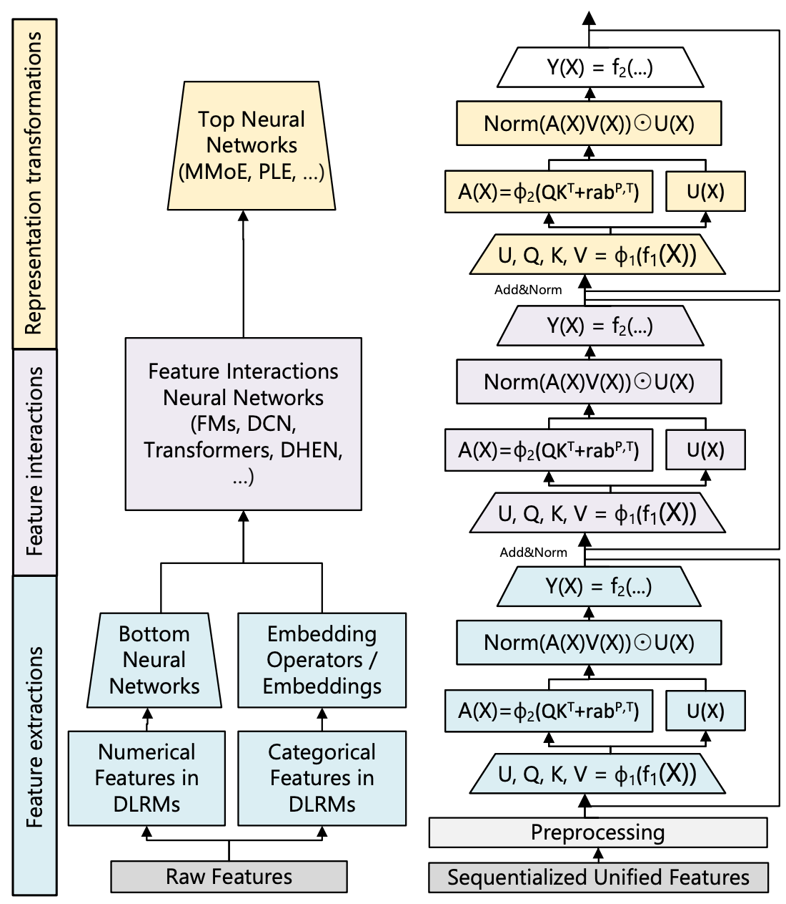

**图 3。** 左边是 embedding、pooling、cross、MoE/MLP 拼装的 DLRM；右边 HSTU 用统一 block 覆盖特征抽取、交互和表示变换。

### 3.2 Pointwise Aggregated Attention

标准 softmax 在序列维归一化，使总注意力质量固定为 1，容易抹掉“与目标相关事件出现了多少次”这一强度信号。HSTU 直接对每个 $QK^\top+rab$ 元素做 SiLU，再线性聚合；LayerNorm 放在聚合后。

论文给出两点动机：推荐既预测相对排序，也预测 engagement intensity；内容词表持续变化，softmax 的竞争式归一化未必适合 one-pass streaming。

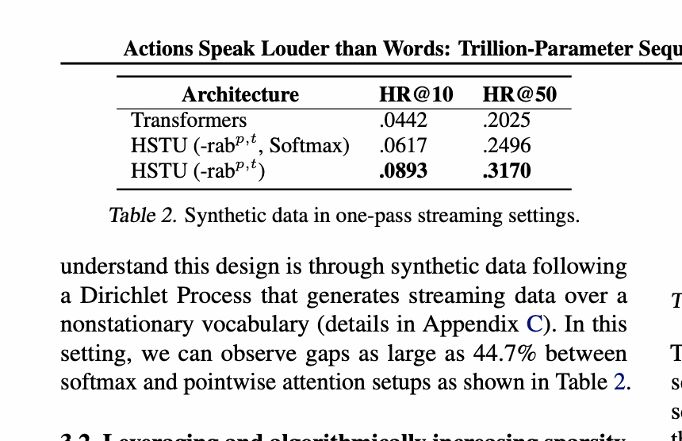

**表 2。** Dirichlet-process 合成流式数据中，Transformer HR@10/50 为 .0442/.2025；HSTU 使用 softmax、去掉 RAB 为 .0617/.2496；pointwise HSTU、去掉 RAB 为 .0893/.3170。这里验证的是构造数据机制，不应直接外推到全部线上场景。

### 3.3 利用并增加稀疏性

真实用户长度高度偏斜。fully raggified attention 不 padding 到统一 $N$，把不同形状的 back-to-back GEMM 组织成 grouped GEMM。内存访问约为：

$$
\Theta\!\left(\sum_i n_i^2d_{qk}^2/R\right),
$$

其中 $R$ 是寄存器容量；论文报告该项本身带来 2–5 倍吞吐提升。

**Stochastic Length（SL）。** 对用户 $j$，最大内容长度 $N_c=\max_j n_{c,j}$；设 $\alpha\in(1,2]$。短序列全保留，长序列在短子序列与完整序列之间随机切换：

$$
\begin{cases}
(x_i)_{i=0}^{n_{c,j}}, & n_{c,j}\le N_c^{\alpha/2},\\
(x_{i_k})_{k=0}^{N_c^{\alpha/2}}, & n_{c,j}>N_c^{\alpha/2},\ \text{概率 }1-N_c^\alpha/n_{c,j}^2,\\
(x_i)_{i=0}^{n_{c,j}}, & n_{c,j}>N_c^{\alpha/2},\ \text{概率 }N_c^\alpha/n_{c,j}^2.
\end{cases}
$$

期望注意力成本降到 $O(N_c^\alpha d)$；$\alpha=2$ 相当于不额外施加 SL，$\alpha$ 越小越稀疏。

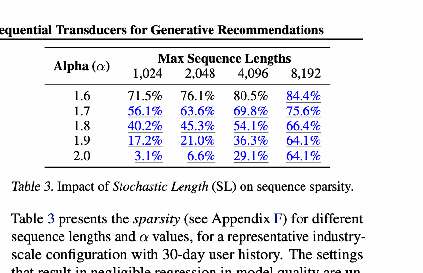

**表 3。** 30 天历史中，最大长度 8192 时，$\alpha=1.6/1.7/1.8$ 的 sparsity 为 84.4%/75.6%/66.4%；蓝色下划线表示质量回归可忽略的设置。

### 3.4 激活显存

推荐依赖大 batch，激活常比参数/optimizer 更先成为瓶颈。HSTU 把 attention 外的线性层从 6 个减到 2 个，并融合投影、norm、dropout、输出 MLP。bfloat16 下每层激活核算为：

$$
2d+2d+4hd_{qk}+4hd_v+2hd_v=14d,
$$

而假设 $hd_v\ge d,d_{ff}=4d$ 的标准 Transformer 为 $33d$，因此同显存可堆叠超过 2 倍深度。

十亿级词表也是独立瓶颈：100 亿词表、512 维、fp32 Adam 需要约 60 TB。论文用 row-wise AdamW 并把 optimizer state 放到 DRAM，使 HBM 每个 float 的占用从 12 bytes 降到 2 bytes。

### 3.5 M-FALCON：多候选推理摊销

朴素 target-aware 推理对 $m$ 个候选分别跑长度 $n$ 的 encoder，成本 $O(mn^2d)$。M-FALCON 把 $b_m$ 个候选追加到同一历史后面，并修改 mask，使候选之间不能互相看见：

$$
O(b_mn^2d)\rightarrow O((n+b_m)^2d)\approx O(n^2d).
$$

总候选划成 $\lceil m/b_m\rceil$ 个微批。历史 K/V 在微批间、甚至请求间缓存；缓存后的单次成本为：

$$
O(b_md^2+b_mnd),
$$

相对未缓存的

$$
O((n+b_m)d^2+(n+b_m)^2d)
$$

即便 $b_m=n$ 也有约 2–4 倍理论改进。

## 4 实验结果

### 4.1 合成数据

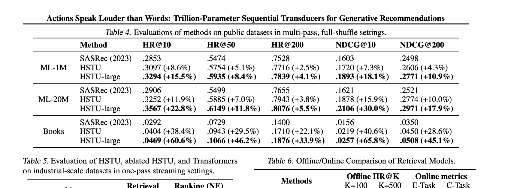

**表 4。** 合成实验在非平稳 Dirichlet process 数据上系统比较 attention 结构、RAB 和 normalization。核心证据是 pointwise aggregation 能保留频次/强度，最大相对差距达 44.7%。

### 4.2 公开数据与工业数据效果

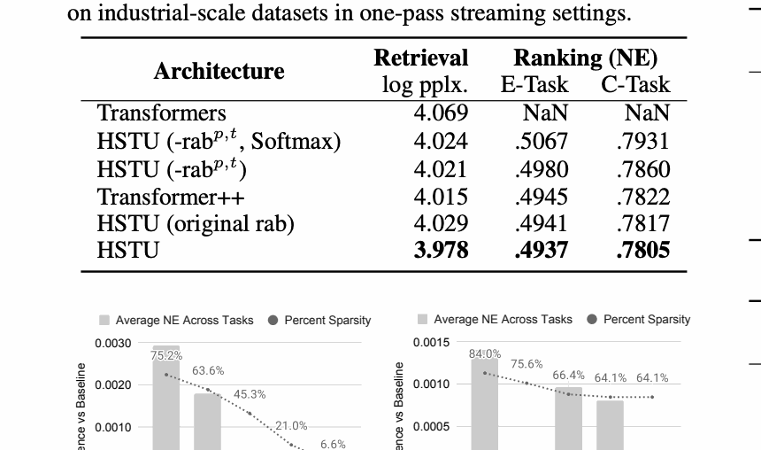

**表 5。** 工业 one-pass streaming 数据上比较 HSTU、softmax/RAB 等消融和 Transformer，验证 pointwise attention 与完整 HSTU 的质量。

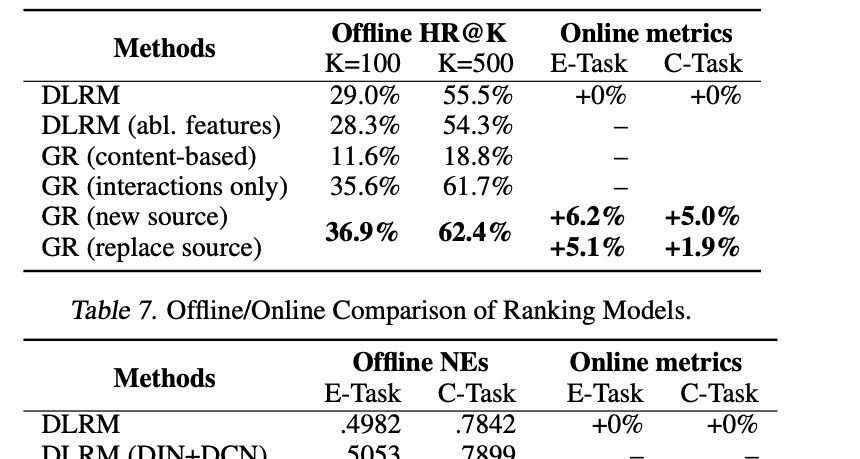

**表 6。** 工业 retrieval 的离线 HR@K 与线上 E-Task/C-Task 指标，比较 DLRM 与不同 GR 配置。

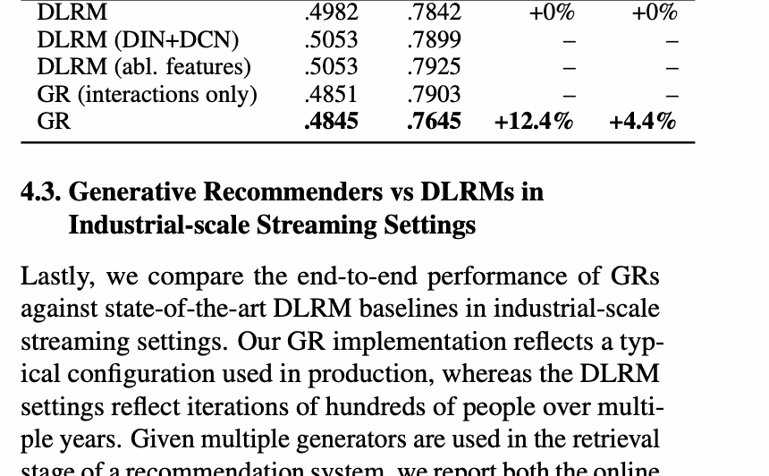

**表 7。** 工业 ranking 的离线 NE 与线上 E-Task/C-Task 指标，比较 DLRM、GR 及替换 source 等变体。读表时应区分模型质量与 kernel 速度，两类增益来源不同。

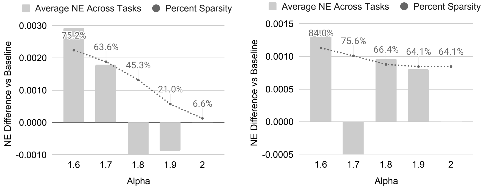

**图 4。** 正文展示最大长度 4096/8192 时 Stochastic Length 对 NE 与稀疏度的影响；完整长度组见附录 Figure 10。

### 4.3 工业流式实验

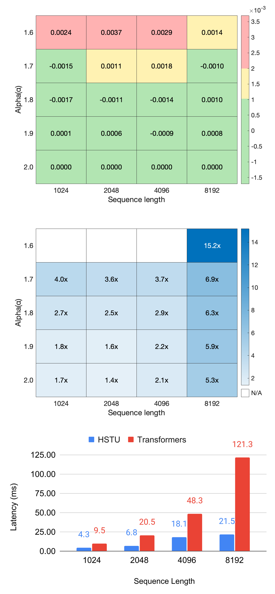

**图 5。** HSTU 与 FlashAttention-2 Transformer 的 encoder-level 比较：(a) 训练 NE，(b) 训练加速，(c) 推理加速。它同时检查质量与 wall-clock，避免只报 kernel 峰值。

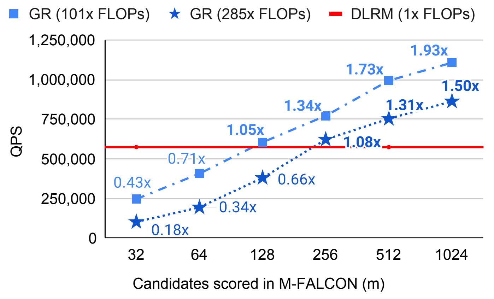

**图 6。** 最困难 ranking 配置中的端到端推理吞吐：M-FALCON 让高 FLOPs GR 通过候选摊销与缓存追平并超过 DLRM。

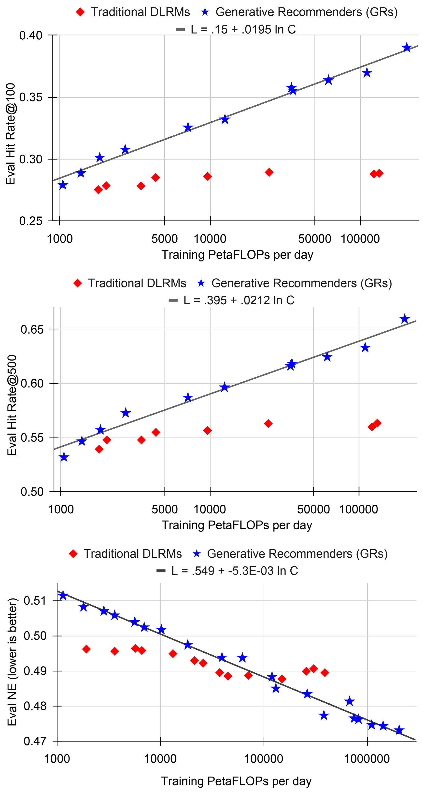

**图 7。** 工业 retrieval（上、中）与 ranking（下）的质量—FLOPs scaling。DLRM 更早进入平台期，GR 继续获益；论文以 HR +0.005、NE -0.001 作为显著改善参考。结合图 5，论文报告 8192 长度下 encoder 总体加速 5.3–15.2 倍，来源并非单一 kernel。

### 4.4 GR 与 DLRM 端到端比较

正文报告：在相同推理预算下，配合 M-FALCON 的 GR 可服务 FLOPs 高 285 倍的模型，同时吞吐为传统 DLRM 的 1.50–2.99 倍。这个看似反直觉的结果来自候选维度摊销和历史缓存，而不是单候选 forward 更便宜。

## 5 相关工作、结论与影响

相关工作覆盖传统 DLRM、序列推荐、Transformer/高效 attention、生成式 retrieval 与硬件感知 kernel。HSTU 的门控受 FLASH 启发，但把相同思想放进非平稳大词表、ragged 长序列和 target-aware ranking。

论文结论是：统一任务表述带来的 scaling 只有与专用模型、训练采样和推理算法一起设计才成立。Impact Statement 同时指出更强推荐可能放大过滤泡、沉迷或不公平曝光，需要部署侧治理；算力/能耗也不应被“效率提升”遮蔽。

# 技术附录逐节精读

## A 符号表

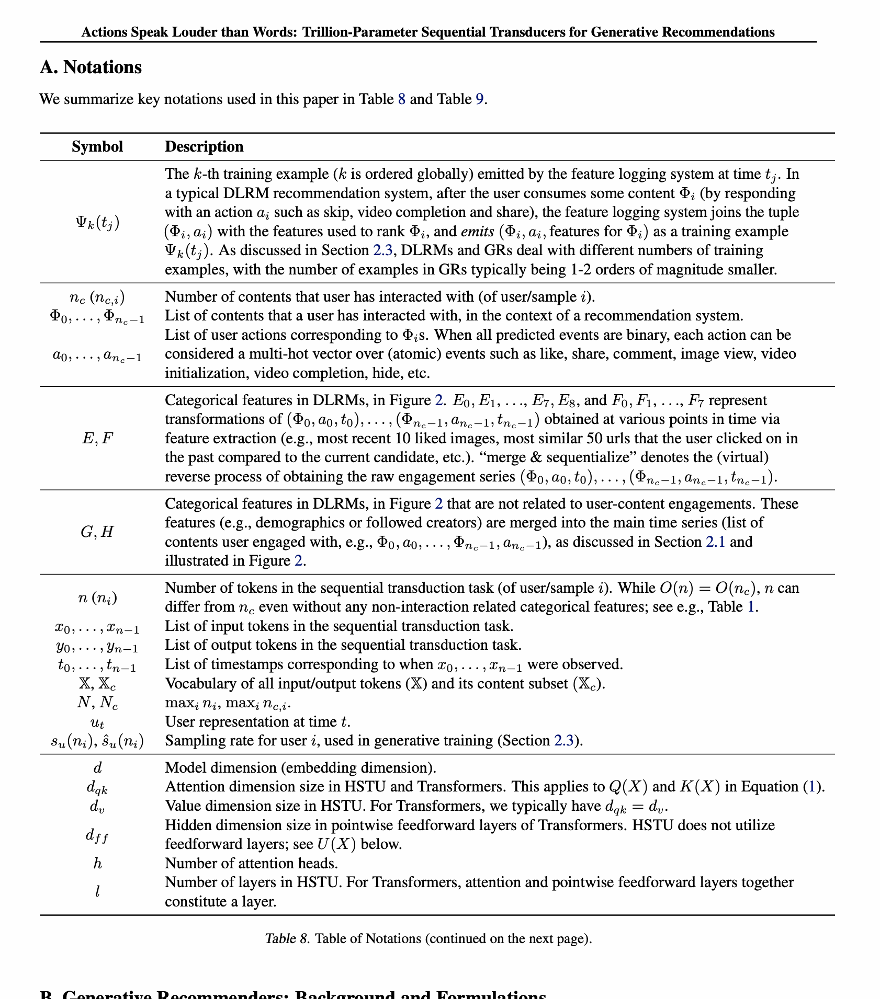

**表 8。** 符号表上半部分；统一列出词表、内容/动作 token、序列与模型维度等。

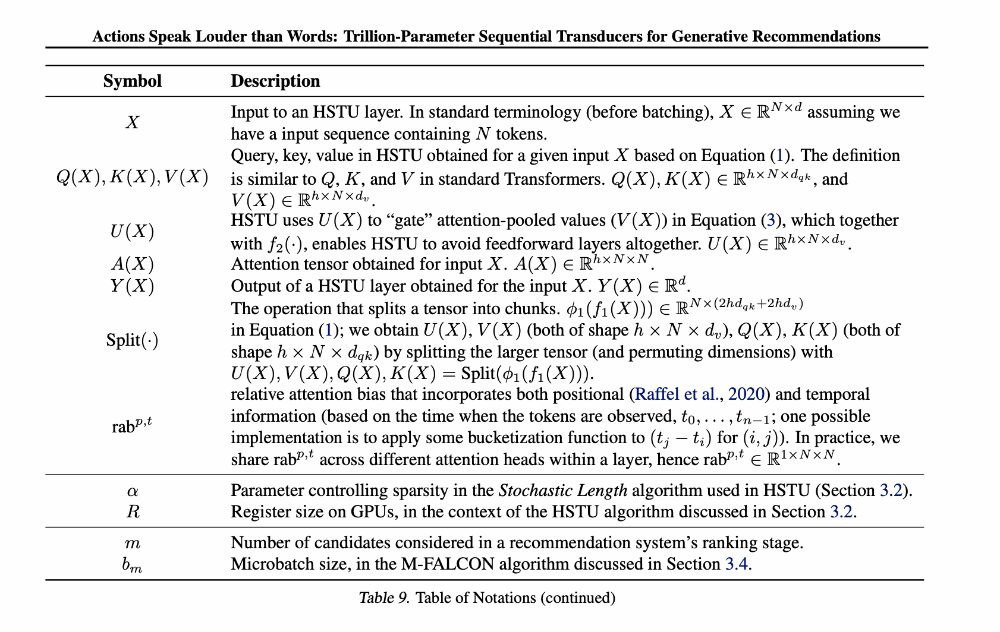

**表 9。** 符号表续页，包含 $\alpha,m,b_m$ 等系统变量。最易混淆的是：$n_c$ 是内容交互数，ranking 交错后常有 $n=2n_c$；$m$ 是本次排序候选总数，$b_m$ 是 M-FALCON 微批候选数。

## B GR 背景与形式化

传统学术 sequential recommender 多在固定数据集上 full-shuffle、多轮训练，常只建模 item ID；工业 DLRM 是 one-pass streaming、目标感知、多任务、超大动态词表。论文强调不能直接用学术设置代替工业结论。

GR ranking 的联合建模可写成内容与动作交错序列的分解：

$$
p(\Phi_0,a_0,\ldots,\Phi_{n_c-1},a_{n_c-1})
=\prod_i p(\Phi_i\mid h_i)\,p(a_i\mid h_i,\Phi_i),
$$

其中 ranking 主要使用第二项，retrieval 主要使用第一项或正反馈过滤后的内容目标。

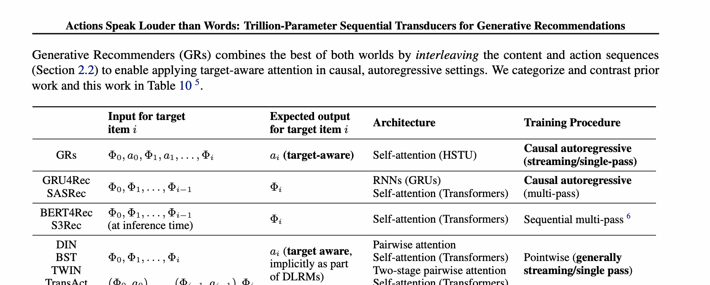

**表 10。** 对比 GR、GRU4Rec/SASRec/BERT4Rec/S3Rec 与 DIN/BST/TWIN/TransAct 在目标输入、期望输出、架构与训练协议上的差异。GR 同时保留 action token，并在 streaming causal setting 中直接预测目标动作。

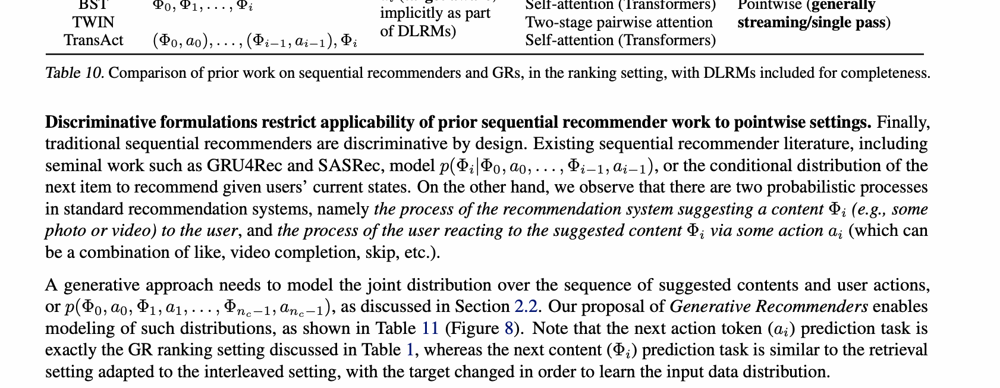

**表 11。** 对联合分布 $p(\Phi_0,a_0,\ldots)$ 的两类监督：在内容位置预测 next action，在动作位置预测 next content。前者对应 ranking，后者对应交错形式的 generative retrieval。

## C 合成数据

合成流使用 Dirichlet Process 模拟“rich get richer”：每条记录先从 100 个类别中选至多 5 个，再按先验与历史计数顺序采样；这使热门类别概率随流演化，并不断出现动态词汇。该构造解释了 softmax attention 为什么可能丢失绝对频次信号。

## D 传统序列推荐设置

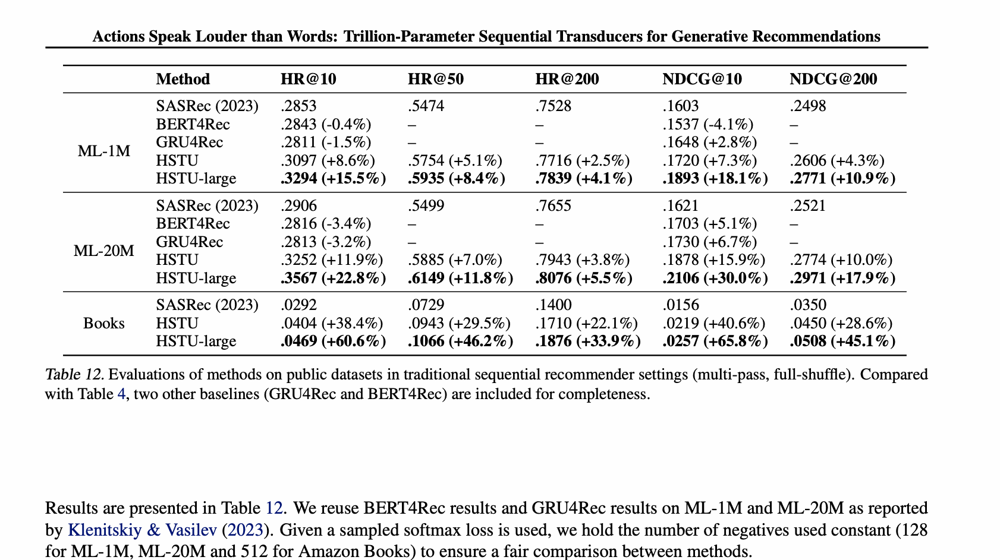

**表 12。** MovieLens-1M、MovieLens-20M 与 Amazon Books 的传统 multi-pass/full-shuffle 结果；加入 GRU4Rec、BERT4Rec、SASRec。HSTU/HSTU-large 在多数 HR/NDCG 上领先，说明 block 并非只对内部数据有效，但公开数据无法验证万亿参数与工业吞吐结论。

## E 传统 DLRM 基线

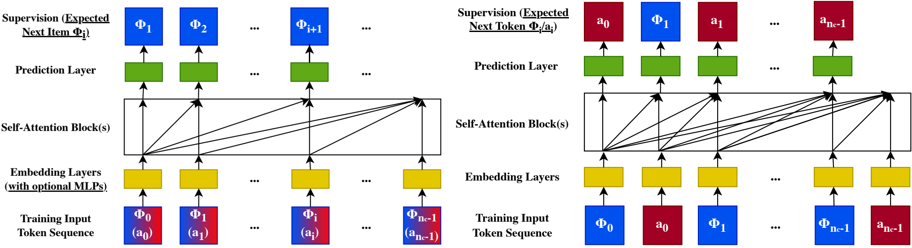

**图 8。** 左侧传统 sequential recommender 通常忽略 action 或将其与 item 先经 MLP 合并；右侧 GR 显式交错 $\Phi_i,a_i$ 并为每类位置提供生成监督。

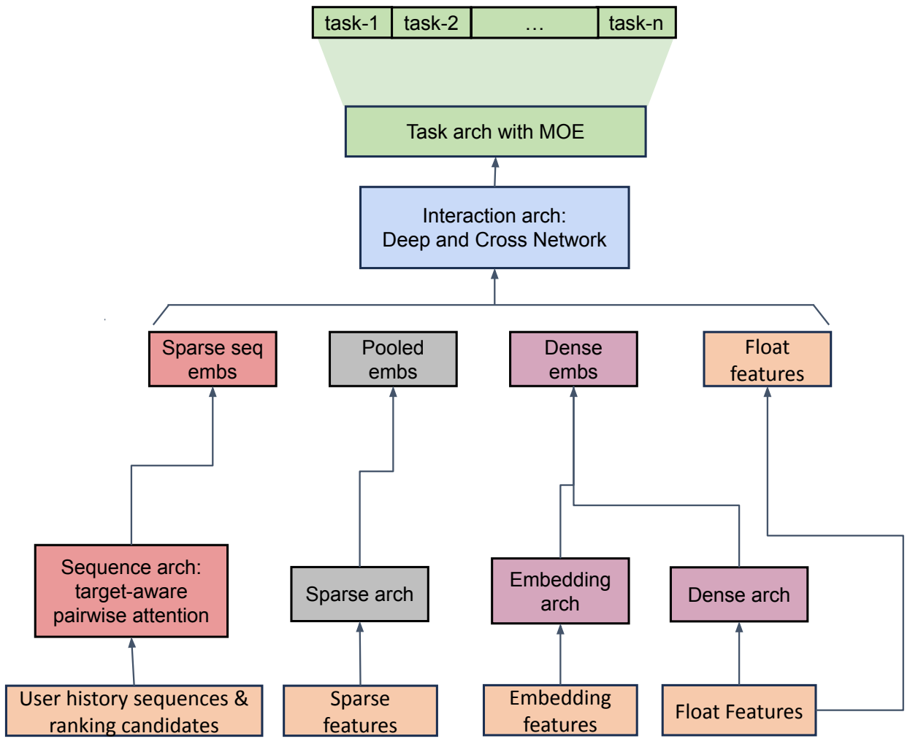

**图 9。** 工业 DLRM ranking baseline 的高层结构：DIN 式目标注意力、sparse/dense embedding、DCN 交互和 MMoE 多任务。它说明对照是整合多类成熟组件的强生产基线。

## F Stochastic Length 细节

### F.1 子序列选择

定义距当前时刻的时间差 $f_i=t_n-t_i$。比较三种选法：保留最近的 greedy、均匀 random、按时间特征权重采样。feature-weighted 的 NE 最好，说明 SL 不只是“随机截断”，采样分布本身影响质量。

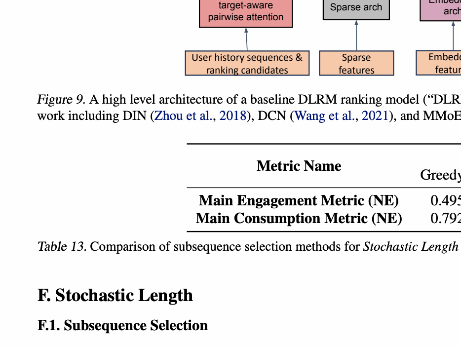

**表 13。** Greedy/Feature-Weighted/Random 的主 engagement NE 为 0.495/0.494/0.495，主 consumption NE 为 0.792/0.789/0.791；NE 越低越好，feature-weighted 最佳。

### F.2 60/90 天稀疏度与质量

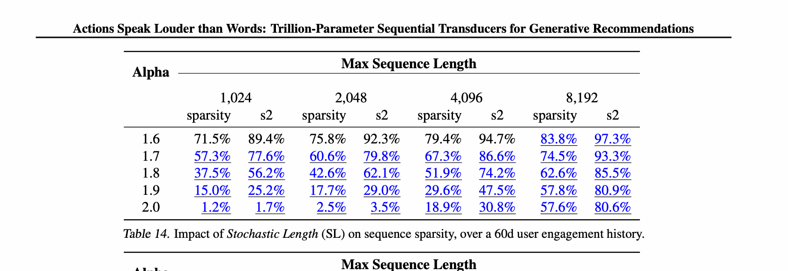

**表 14。** 60 天历史同时报告 token sparsity 与注意力矩阵的 $s2$。后者更接近 $n_i^2$ 计算节省；长度越长，SL 带来的二次项稀疏越明显。

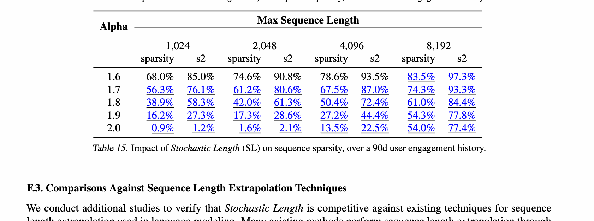

**表 15。** 90 天历史的对应结果，进一步表明长期窗口并不要求每个训练样本都完整展开。

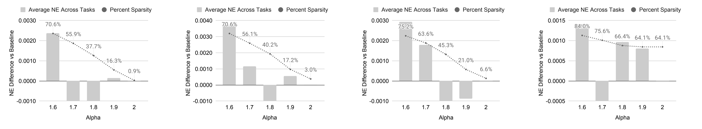

**图 10。** 不同最大长度与 $\alpha$ 下的 ranking metric 曲线，用来选择“计算显著下降、质量回归可忽略”的 operating point。

### F.3 与长度外推比较

训练长度 1024、评估 2048/4096 时，zero-shot HSTU 的平均 NE 差为 6.46%/10.35%，HSTU-RoPE 为 7.51%/11.27%；微调后约 1.92%/2.21% 与 1.61%/2.19%；匹配稀疏度的 SL 仅 0.098%/0.64%。论文认为高基数 ID 的旧内容表示在 zero-shot/短微调中学不好，而 SL 在训练中仍偶尔看到完整长序列。

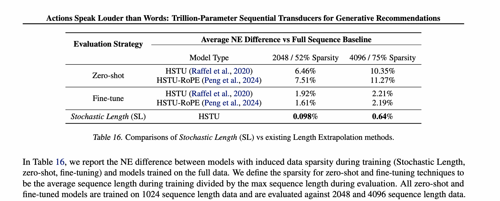

**表 16。** 上述 zero-shot、fine-tune 与 SL 的完整数值；2048/4096 评估分别匹配 52%/75% 稀疏度。

## G Sparse Grouped GEMM 与融合 RAB

kernel 将 ragged 样本拆成不同形状的 GEMM 组，不物化 $h\times N\times N$ 注意力张量；相对位置/时间 bias 的构造也融合进同一 GPU kernel，反向在 shared memory 累加梯度。代价是反向重算 attention 和 RAB，但整体更快、更省显存。

> [!note] 直观理解
> SL 让数据“更稀”，ragged kernel 才能把这种稀疏真正变成 wall-clock 收益；若仍 padding 到统一最大长度，算法层稀疏不会自动变成系统收益。

## H M-FALCON 细节

复杂度对照为：朴素逐候选 $O(mn^2d)$；一次批候选 $O((n+m)^2d)$；把候选切成 $\lceil m/b_m\rceil$ 个微批后控制每次矩阵规模；再加历史 KV cache，单个微批降到 $O(b_md^2+b_mnd)$。最关键的变量不是模型 FLOPs 本身，而是同一历史计算能在多少候选与请求之间复用。

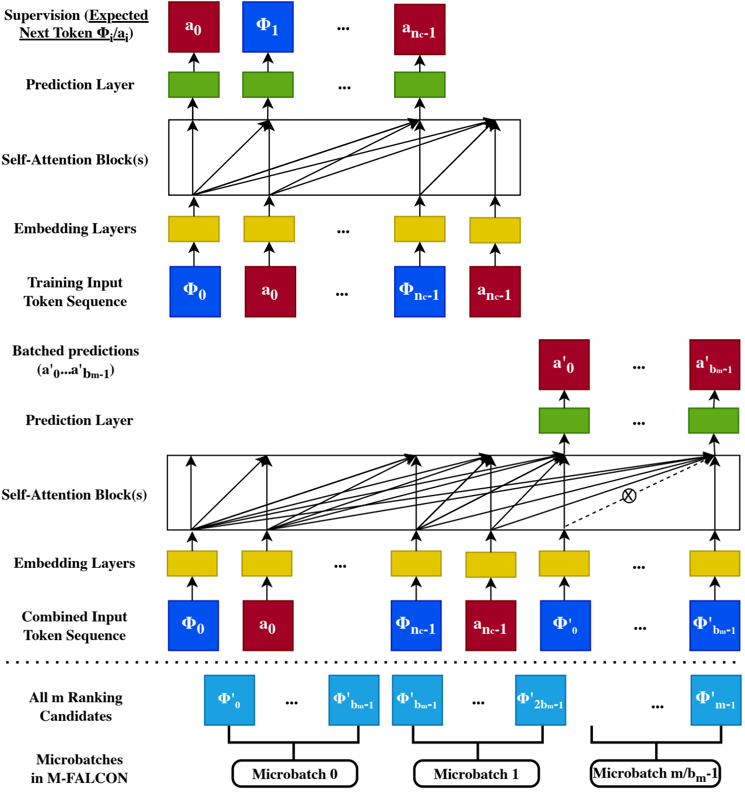

**图 11。** 训练用标准下三角 mask；推理把 $b_m$ 个候选追加到历史后，并把候选—候选的非对角 attention 设为 $-\infty$。于是每个候选能看完整历史但看不到其他候选，输出与分别跑 $b_m$ 次完全一致。

### Algorithm 1 逐步解释

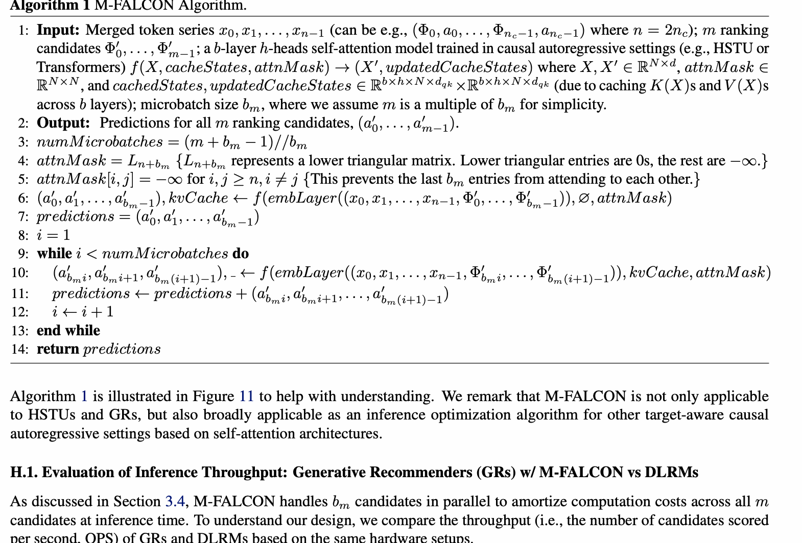

1. 输入历史 $x_0,\ldots,x_{n-1}$、$m$ 个候选、带 KV cache 接口的 $b$ 层 $h$ 头 causal 模型和微批大小 $b_m$。
2. 令 `numMicrobatches = ceil(m / b_m)`。
3. 构造 $L_{n+b_m}$ 下三角 mask；对候选区 $i,j\ge n$ 且 $i\ne j$ 的元素置 $-\infty$。
4. 第一微批把完整历史和前 $b_m$ 个候选一起送入，得到预测并建立历史 KV cache。
5. 后续微批复用 cache，仅替换末尾候选；将预测依次追加。
6. 返回全部 $m$ 个候选预测。

算法不依赖 HSTU 的特定 pointwise attention；任何 target-aware causal self-attention 模型只要能正确缓存都可使用。

### H.1 吞吐

论文报告 batched inference 在候选数增至约 2048 前呈次线性成本；多微批与缓存相对 $m=b_m=1024$ 单微批基线再带来最高 1.99 倍加速。

**Figure 12 去重说明：** v3 附录 Figure 12 明确写明是正文 Figure 6 的原样复现，因此本笔记不重复嵌图，请回看上文“图 6”。

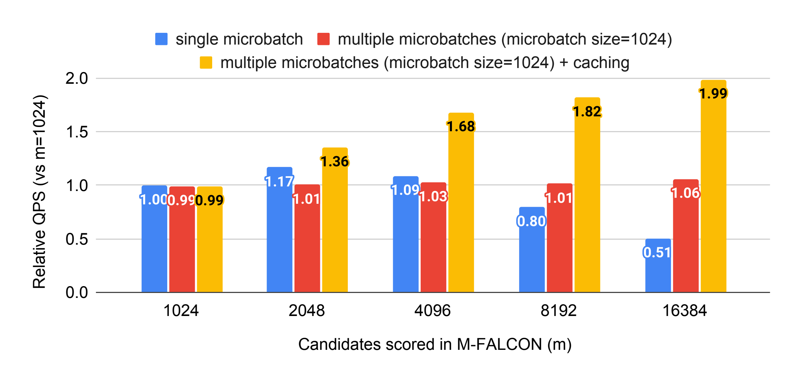

**图 13。** 在 285 倍 FLOPs 的 GR 上，固定 $b_m=1024$、总候选从 1024 增到 16384，展示 M-FALCON microbatch/cache 的端到端 QPS scaling。它解释了“模型更复杂但吞吐更高”的摊销机制。

## 总结：论文真正成立的条件

HSTU/GR 的收益链条是条件式的：原始事件必须足够覆盖手工特征；causal interleaving 必须提供 target awareness；one-pass generative supervision 必须摊销 encoder；长度分布必须能被 SL 与 ragged kernel 利用；在线候选必须共享历史以使用 M-FALCON/cache。少一环，都可能只剩一个昂贵的序列模型。

## 公式与对象覆盖说明

- 已覆盖正文 Eq. (1)–(4)、ranking/retrieval 条件分布、generative training、激活显存、kernel 与 M-FALCON 复杂度。
- 已覆盖 Figure 1–11、13；Figure 12 因与 Figure 6 完全重复而明确去重。
- 已覆盖 Table 1–16 与 Algorithm 1。
- 已覆盖附录 A–H；参考文献与致谢不逐条翻译。
