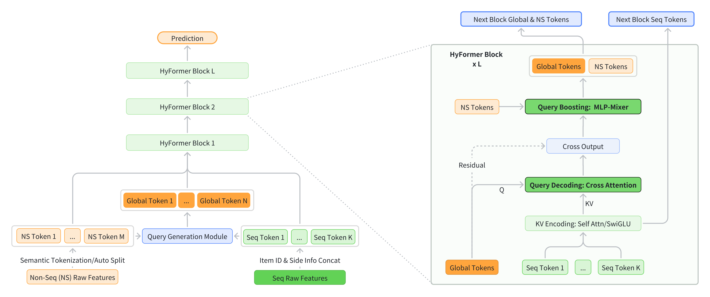
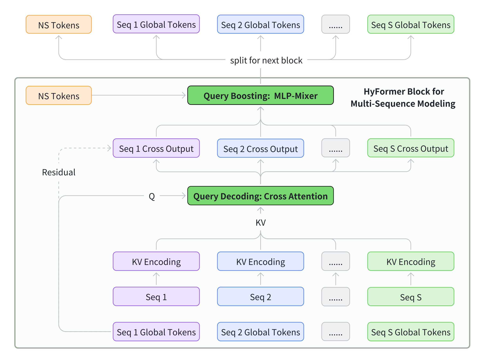
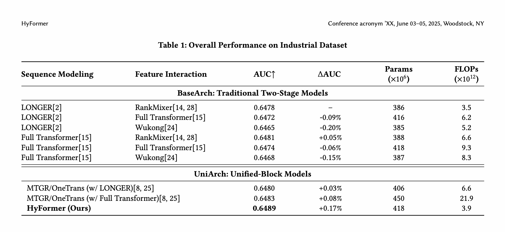
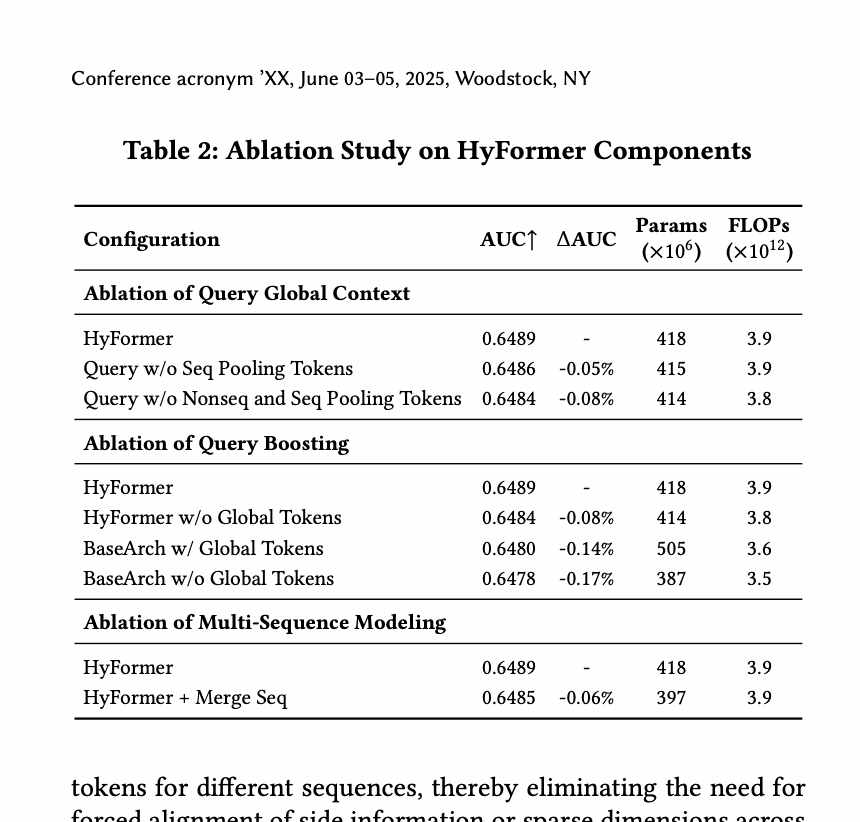
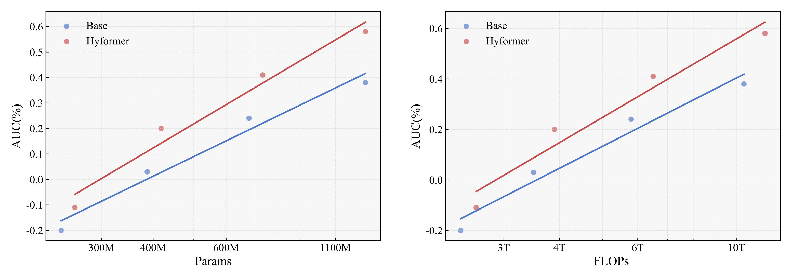
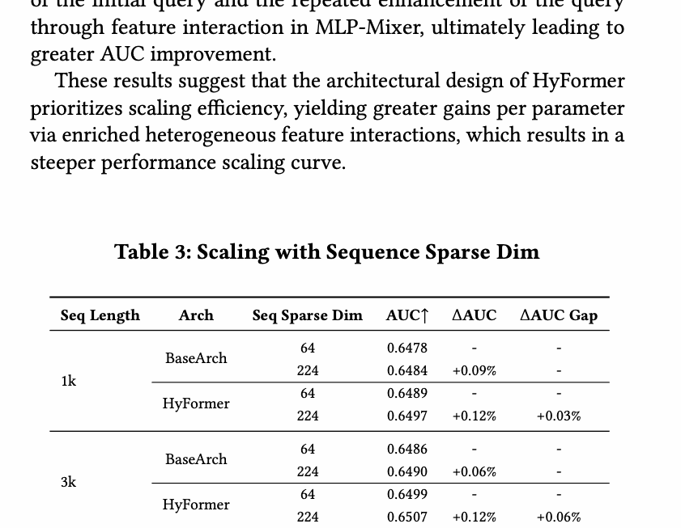
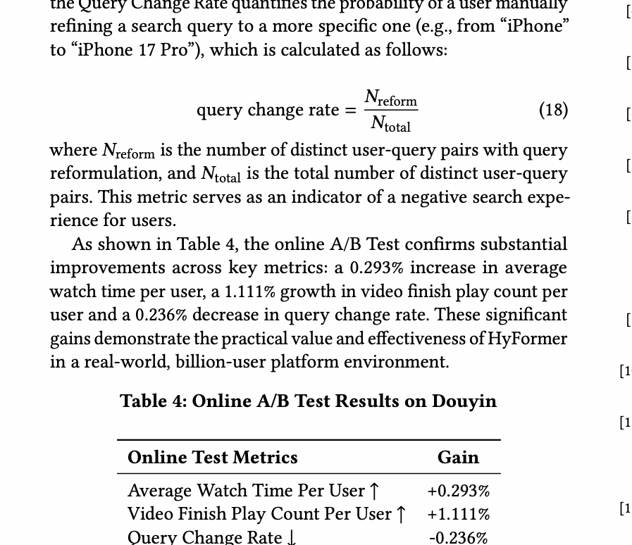

# HyFormer：重新理解 CTR 中的序列建模与特征交互

> [!abstract] 一句话结论
> HyFormer 把“序列压缩后再做特征交互”的单次流水线，改造成 Query Decoding 与 Query Boosting 的逐层交替：全局 query 反复读取各条长序列，再与非序列 token 做 MLP-Mixer 式交互，从而让下一层 query 带着更丰富的语义继续读序列。

## 论文信息

- 原文：[arXiv:2601.12681v2](https://arxiv.org/abs/2601.12681)
- 版本：v2
- 场景：工业大规模 CTR/engagement 预测与抖音搜索线上实验
- 对照：传统 BaseArch（LONGER + RankMixer 等）与统一 UniArch（MTGR/OneTrans 等）
- 证据边界：架构与结果按 v2；“直观理解”和注意事项是本文解释。

## 摘要与核心贡献

HyFormer 认为传统两阶段架构存在两个接口瓶颈：长序列先被少量 target/query token 一次性压缩；后续 feature interaction 再强，也只能处理已经压缩的表示。它引入 **Global Tokens** 作为共享语义接口，并循环执行：

1. **Query Decoding**：global query 对某条长序列的逐层 K/V 做 cross-attention；
2. **Query Boosting**：把解码后的 query 与非序列 token 拼接，用 MLP-Mixer 风格跨 token 混合；
3. 下一层用增强后的 query 再次读取序列。

**图 1 解读。** 左侧是整体堆栈；右侧每层先 Decoding、再 Boosting。这里“统一”不是把所有 token 塞进同一个 self-attention，而是把两种计算反复交替，并用 global query 做窄而可扩展的接口。

## 1 引言

工业 LRM 同时面对超长行为序列、大量异质非序列特征和严格吞吐/延迟预算。LONGER 等方法擅长把长序列压成短 query；RankMixer 擅长高效异质交互。但顺序串联会让非序列上下文无法在更深层次改变“下一次如何读取序列”。

HyFormer 的研究问题是：能否保留 cross-attention 的线性序列复杂度，又让序列读取与特征交互共同迭代？其答案是把 query 看成可被交互模块持续增强的“工作记忆”。

> [!note] 直观理解
> Query Decoding 像“带着问题读历史”；Query Boosting 像“读完后把答案与用户、场景、候选特征开会”。下一层不是重复原问题，而是带着会议后的新问题重新读历史。

## 2 相关工作

### 2.1 传统推荐范式

传统 DLRM/CTR 模型把 embedding、序列模块、特征交互模块和预测头串联。长序列方向从 DIN/Transformer 发展到 LONGER 式 query-to-history cross-attention；高阶交互方向则有 DCN、Wukong、RankMixer。问题是两个模块的信息流通常只走一次。

### 2.2 统一架构

MTGR、OneTrans 等尝试统一序列与非序列 token。HyFormer 的区别是显式分开“具体序列内容吸收”和“抽象 global token 交互”，并逐层交替；多序列也不强制合并，而是各自保留 query。

## 3 方法

### 3.1 问题定义

用户 $u$ 的历史为 $S=[i_1^{(u)},\ldots,i_K^{(u)}]$，$u$ 也表示画像、上下文和交叉特征，候选物品为 $v$。目标是：

$$
P(y=1\mid S,u,v)\in[0,1].
$$

训练集 $\mathcal D=\{(S,u,v,y)\}$，用二元交叉熵：

$$
\mathcal L=-\frac1{|\mathcal D|}\sum_{(S,u,v,y)\in\mathcal D}
[y\log\hat y+(1-y)\log(1-\hat y)],
$$

其中 $\hat y=f_\theta(S,u,v)$。

### 3.2 总体框架

每个 HyFormer layer 由 Query Decoding 和 Query Boosting 组成。前者让 global query 读取序列 K/V，后者让序列感知 query 与静态 NS-token 交互。顶层输出进入 MLP 预测头。

需要注意，论文正文把这称为“交替优化”和“bidirectional/co-evolutionary information flow”。严格按公式，individual sequence token 并不会对 global token 做反向注意力；所谓“反向”主要体现为增强后的 query 在下一层改变读取序列的方式。

### 3.3 Query Generation

#### 3.3.1 输入 token 化

输入可按语义分组，也可将全部特征 flatten 后自动切分。HyFormer 选择语义分组，因为用户、上下文、行为等角色清晰，便于保留 inductive bias 与解释性。

#### 3.3.2 query 生成

将 $M$ 个非序列特征与序列 mean pooling 拼成全局信息：

$$
\mathrm{GlobalInfo}=\mathrm{Concat}(F_1,\ldots,F_M,\mathrm{MeanPool}(Seq)).
$$

用 $N$ 个轻量 FFN 产生多语义 query：

$$
Q=[\mathrm{FFN}_1(\mathrm{GlobalInfo}),\ldots,
\mathrm{FFN}_N(\mathrm{GlobalInfo})]\in\mathbb R^{N\times D}.
$$

深层不重新用 MLP 生成 query，而是直接复用上一层增强后的 query；系统也支持 feature selection 和 query compression，让 query 数保持稳定。

### 3.4 Query Decoding

#### 3.4.1 三种序列表示编码器

HyFormer 把序列 K/V 侧做成可替换部件。

**Full Transformer：**

$$
H_l=\mathrm{TransformerEnc}_l(S),
$$

容量最高，但 self-attention 为 $O(L_S^2)$。

**LONGER 式高效编码：**

$$
H_l=\mathrm{CrossAttn}(S_{short},S,S),
$$

$L_H\ll L_S$，复杂度从 $O(L_S^2)$ 降到 $O(L_HL_S)$。

**Decoder-style 轻量编码：**

$$
H_l=\mathrm{SwiGLU}_l(S),
$$

不做 attention，以较低上下文建模能力换取最低延迟。三种变体都逐层投影：

$$
K_l=H_lW_l^K,\qquad V_l=H_lW_l^V.
$$

#### 3.4.2 cross-attention 解码

$$
\widetilde Q_{(l)}=\mathrm{CrossAttn}(Q_{(l)},K_{(l)},V_{(l)}).
$$

得到的 $\widetilde Q_{(l)}$ 是序列感知的语义接口。cross-attention 的 query 数远小于历史长度，因此长序列成本可控。

> [!warning] 论文表述与公式的边界
> “global context directly shapes sequence representations”容易被读成序列 token 被 query 更新。给出的公式更直接支持的是：global query 选择并聚合序列 K/V，输出是 query representation；K/V 会按层重新编码，但没有展示 query 写回每个序列 token 的反向 attention。

### 3.5 Query Boosting

先把解码 query 与 $M$ 个非序列 token 拼接：

$$
Q=[\widetilde Q_{(l)},F_1,\ldots,F_M]\in\mathbb R^{T\times D},
\qquad T=N+M.
$$

每个 token $q_t$ 按通道切成 $T$ 份：

$$
q_t=[q_t^{(1)}\|q_t^{(2)}\|\cdots\|q_t^{(T)}],
\qquad q_t^{(h)}\in\mathbb R^{D/T}.
$$

对同一个通道分片索引 $h$，跨所有 token 拼接：

$$
\widetilde q_h=\mathrm{Concat}(q_1^{(h)},q_2^{(h)},\ldots,q_T^{(h)})\in\mathbb R^D.
$$

收集成 token-mixed 表示：

$$
\widehat Q=[\widetilde q_1,\widetilde q_2,\ldots,\widetilde q_T]\in\mathbb R^{T\times D}.
$$

随后逐 token 变换并残差相加：

$$
\widetilde Q=\mathrm{PerToken\text{-}FFN}(\widehat Q),
$$

$$
Q_{boost}=Q+\widetilde Q.
$$

这种 channel rearrangement + per-token FFN 以线性复杂度实现跨 token 信息混合，避免在异质特征侧使用昂贵 self-attention。

### 3.6 HyFormer Module

第 $l$ 层：

$$
\widehat Q^{(l)}=\mathrm{CrossAttn}(Q^{(l-1)},K^{(l)},V^{(l)}),
$$

$$
\widetilde Q^{(l)}=
\mathrm{QueryBoost}(\mathrm{Concat}(\widehat Q^{(l)},\mathrm{NS\ Tokens})).
$$

堆叠后，query 的语义逐层增强；sequence encoder 的类型、层数与宽度，和 boosting 侧的层数、宽度可以分别缩放。

### 3.7 多序列建模

**图 2。** 视频观看、商品购买等序列具有不同特征空间。HyFormer 不先对齐维度再强制拼接，而是为每条序列构造专属 query，分别 Decoding；跨序列信息在后续 query-level mixing 中汇合。这保留序列语义，也允许重要序列分配更多 global token。

### 3.8 训练与部署优化

**GPU Pooling。** 长序列 token 中真正唯一的 feature ID 通常约占 25%。系统把特征放入压缩 embedding table，GPU 前向算子重建原序列，反向算子把梯度聚合回表，减少 H2D 传输与 host 内存。

**异步 AllReduce。** step $k$ 的梯度通信与 $k+1$ 的前后向重叠。dense 参数因此使用一步陈旧梯度：

$$
W_k=W_{k-1}+g_{k-1},
$$

sparse 参数本地梯度可立即更新：

$$
W_k=W_{k-1}+g_k.
$$

论文报告这种 dense/sparse 时序不一致未损伤实践中的收敛和效果。

## 4 实验

### 4.1 设置

工业数据为十亿级样本，离线主指标是 query-level AUC；同时报告 dense 参数量与 batch size 2048 下训练 FLOPs。多序列实现含 13 个 NS-token 和 3 个 global token（每条序列 1 个），总 token 数 16；在 64 GPU 集群训练。离线模型 cold start，线上实验从 checkpoint warm start。

### 4.2 整体效果

**表 1。** HyFormer 达到最高 AUC 0.6489，相对生产 BaseArch（LONGER + RankMixer，0.6478）提升 0.17%，使用 418M dense 参数与 3.9T FLOPs。Full Transformer + RankMixer 为 0.6481；MTGR/OneTrans 的 LONGER/Full Transformer 变体分别约为 0.6480/0.6483，而后者 FLOPs 达 21.9T。论文据此强调分步吸收序列、再混合 global token 的效率。

### 4.3 消融

**表 2。** 去掉 sequence pooling token，AUC 从 0.6489 降到 0.6486；再去掉非序列全局信息，降到 0.6484。去 global token 的 HyFormer 为 0.6484；BaseArch 即使加 global token 也只有 0.6480，说明“更丰富初始 query”必须与逐层交替结合。合并多序列降到 0.6485（$-0.06\%$）。

### 4.4 参数与 FLOPs scaling

**图 3。** 从 200M 扩到 1B+ 参数时，HyFormer 的 AUC—参数和 AUC—FLOPs 曲线斜率都高于 LONGER + RankMixer。论文将其归因于 query 扩展以及反复 boosting 后继续读序列。

### 4.5 序列 sparse dimension

**表 3。** sparse dim 从 64 扩到 224：长度 1k 时 BaseArch/HyFormer 分别增益 0.09%/0.12%；长度 3k 时为 0.06%/0.12%，额外优势从 0.03% 扩到 0.06%。224 维加入 query ID、author ID、event ID、playtime 等更丰富 side information。

### 4.6 线上 A/B

Query Change Rate 定义为：

$$
\mathrm{query\ change\ rate}=\frac{N_{reform}}{N_{total}},
$$

其中 $N_{reform}$ 是发生 query 改写的 distinct user-query 对数量，$N_{total}$ 是全部 distinct user-query 对数量；它被视为负向搜索体验指标。

**表 4。** 抖音搜索线上实验中，人均观看时长 $+0.293\%$，人均完播次数 $+1.111\%$，query change rate $-0.236\%$。

## 5 结论、局限与与 OneTrans 的差异

HyFormer 的核心不是“又一个 Transformer block”，而是把 query 从一次性 target attention 的输入提升为跨层状态。它避免在长历史上做全 self-attention，也避免只在流水线末尾做一次异质交互。

与 OneTrans 相比：OneTrans 统一 token 流并依靠 causal attention、mixed parameters、pyramid/cache；HyFormer 将具体序列 K/V 与 global/NS token 显式分开，用 alternating cross-attention + Mixer 连接，并偏好多序列独立建模。两者都挑战 encode-then-interaction，但“统一”的实现不同。

局限包括：工业私有数据限制复现；论文对 bidirectional 的措辞强于公式直接表达；sequence K/V 如何跨层“evolve”取决于所选 encoder，轻量 SwiGLU 版本并无序列内 attention；线上只报告一个业务平台的一组相对指标。

## 公式与对象覆盖说明

- 已覆盖公式 (1)–(18) 及 dense/sparse 异步更新规则。
- 已覆盖 Figure 1–3、Table 1–4。
- v2 无算法环境、无技术附录；参考文献未逐条翻译。

