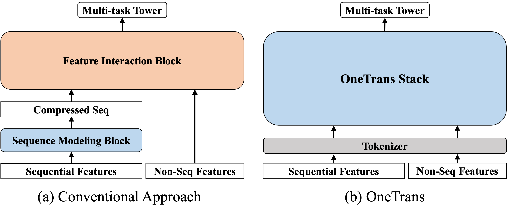
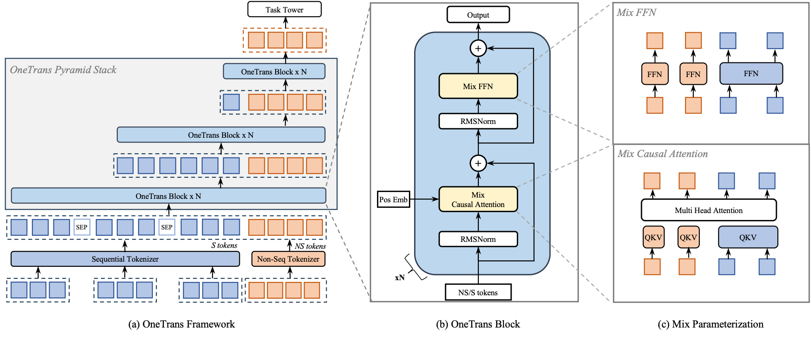
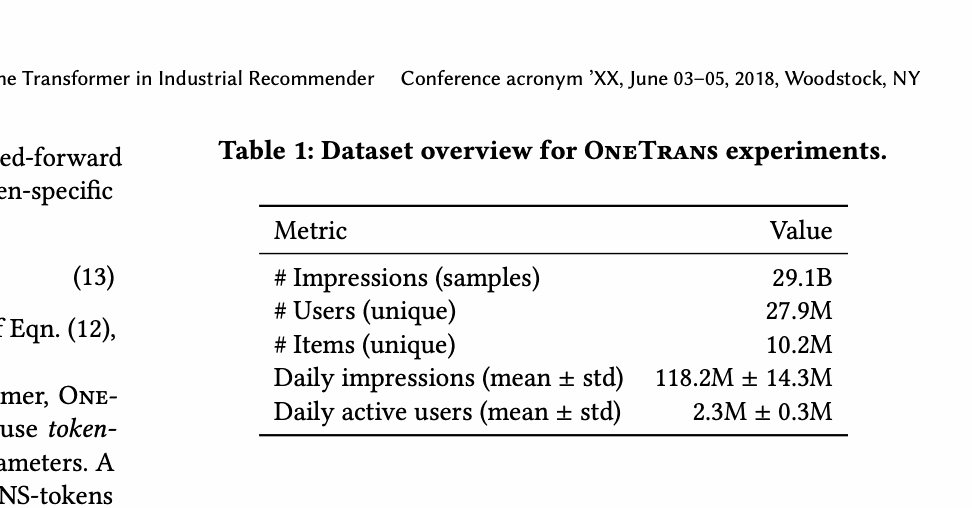
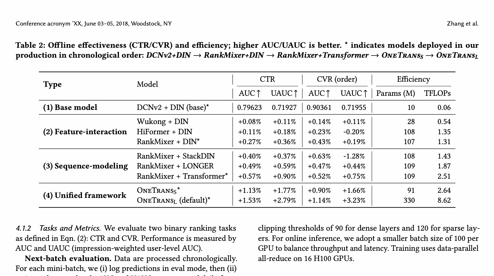
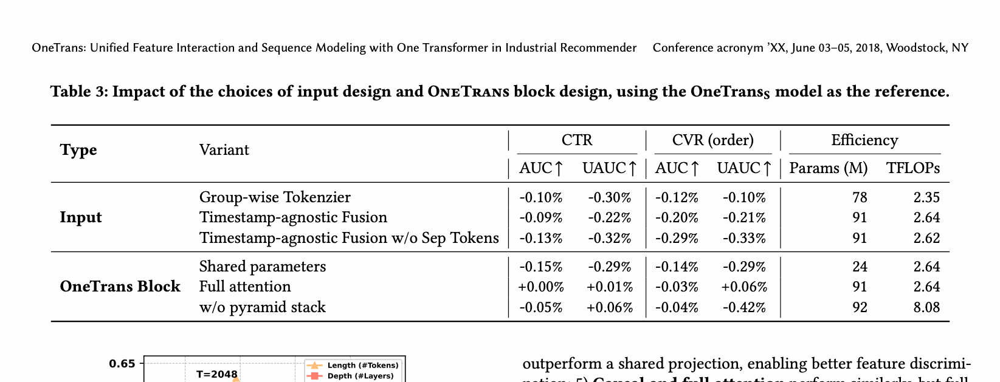
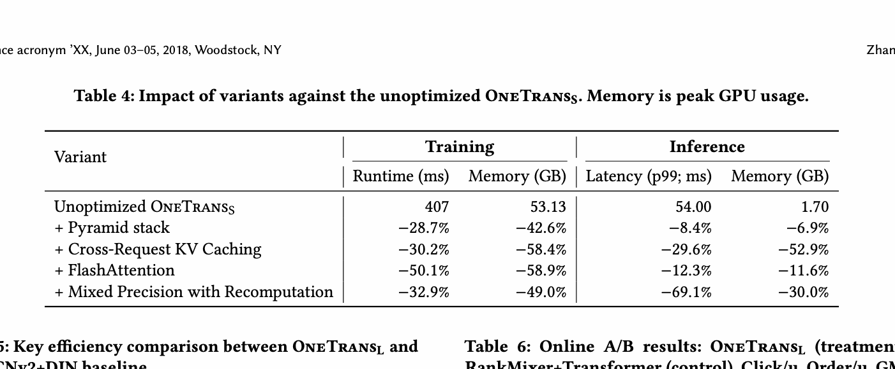
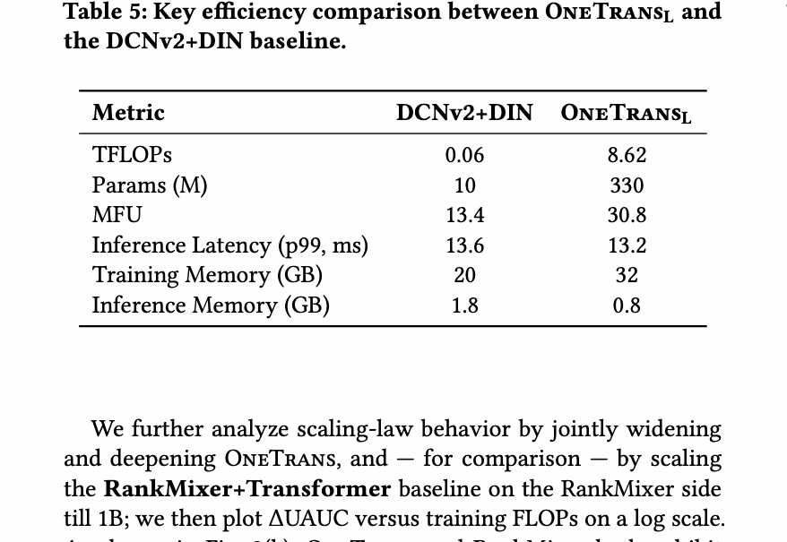
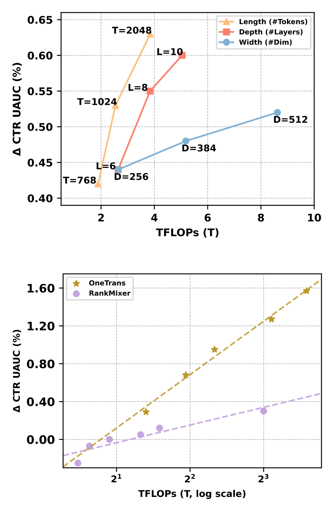
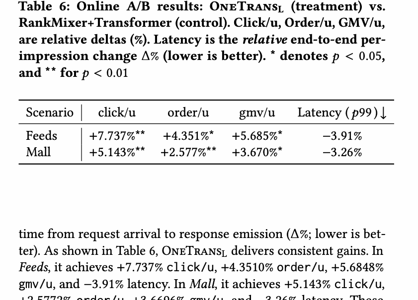

# OneTrans：用一个 Transformer 统一特征交互与序列建模

> [!abstract] 一句话结论
> OneTrans 不再把“行为序列编码”和“非序列特征交互”拆成两个网络，而是把 S-token 与 NS-token 放进同一条因果 Transformer 流；再用混合参数、金字塔查询裁剪和跨请求 KV Cache，把统一架构做成可上线的工业排序模型。

## 论文信息

- 原文：[arXiv:2510.26104v3](https://arxiv.org/abs/2510.26104)
- 版本：v3，2026-02-02；论文标注 WWW 2026
- 任务：工业推荐排序中的 CTR 与点击后 CVR 预测
- 证据边界：下文的结构、数字和结论来自论文 v3；“直观理解”和“我的判断”是解释，不冒充论文原话。

## 摘要与核心贡献

传统工业排序通常是“先编码、再交互”：DIN/Transformer 先压缩行为序列，DCN、RankMixer 等模块再与用户、候选物品、上下文特征交互。这样做的代价是两个模块分离、交互发生得晚，而且各自扩容未必形成统一的 scaling path。

OneTrans 提出三件事：

1. **统一 token 流**：把多行为序列变成 S-token，把用户、候选物品和上下文等非序列特征变成 NS-token，拼接后交给一个 Transformer。
2. **混合参数化**：语义同质的 S-token 共享 Q/K/V 与 FFN；语义异质的每个 NS-token 使用自己的参数。
3. **系统—模型协同**：金字塔堆叠逐层减少 query，跨候选与跨请求复用序列侧 KV，再叠加 FlashAttention、混合精度和激活重计算。

**图 1 解读。** 左侧传统范式在序列编码完成后才做特征交互；右侧 OneTrans 把两类建模放进同一个堆栈。统一并不等于所有 token 完全同构：后文的 mixed parameterization 正是为异质 NS-token 保留表达自由度。

## 1 引言

论文把工业推荐扩展的瓶颈概括为：序列模型与特征交互模块各自发展、彼此割裂。加深 DIN/Transformer 只能增强历史压缩；加宽 DCN/MoE 只能增强压缩后的交互，两者之间仍只有一个窄接口。

OneTrans 的主张是把推荐问题重新表述成统一 token 建模，从而获得两类收益：一是序列内、序列间、非序列特征间以及序列—特征间的交互都在同一计算图中发生；二是直接继承成熟的 Transformer 系统优化。

> [!note] 直观理解
> 过去像是“先让一个人读完用户历史并写摘要，再让另一个人拿摘要做判断”；OneTrans 更像让所有证据按顺序进入同一场讨论，候选相关 token 在后面读取完整历史。

## 2 相关工作

论文把相关工作分为三条线：

- **序列推荐**：DIN、DIEN、Transformer 与长序列建模不断增强用户历史编码，但通常仍输出一个或少量压缩向量。
- **特征交互**：DCN、Wukong、HiFormer、RankMixer 等重点学习高阶交叉，通常把序列编码结果当作输入特征之一。
- **统一推荐 Transformer**：生成式推荐和 token 化方向说明统一骨干具有扩展潜力，但工业精排同时包含大量异质 dense/sparse 特征、多行为序列和严格延迟约束。

OneTrans 的位置不是生成 item token，而是给工业精排提供一个统一 Transformer 骨干。

## 3 方法

### 3.1 任务定义与整体框架

召回阶段为用户 $u$ 返回候选集合，排序模型对候选 $i$ 预测：

$$
\hat y_{u,i}=f\left(i\mid\mathcal{NS},\mathcal S;\Theta\right)
$$

其中 $\mathcal{NS}$ 是用户、候选物品和上下文产生的非序列特征集合，$\mathcal S$ 是用户历史行为序列，$\Theta$ 是参数。典型目标为：

$$
\begin{aligned}
\mathrm{CTR}_{u,i}&=P(\mathrm{click}=1\mid\mathcal{NS},\mathcal S;\Theta),\\
\mathrm{CVR}_{u,i}&=P(\mathrm{conv}=1\mid\mathrm{click}=1,\mathcal{NS},\mathcal S;\Theta).
\end{aligned}
$$

统一 tokenizer 得到初始序列：

$$
\mathbf X^{(0)}=[\mathrm{S\text{-}tokens};\mathrm{NS\text{-}tokens}]
\in\mathbb R^{(L_S+L_{NS})\times d}.
$$

不同用户行为序列之间插入可学习的 `[SEP]`。第 $n$ 个 pre-norm block 为：

$$
\mathbf Z^{(n)}=\mathrm{MixedMHA}\!\left(\mathrm{Norm}(\mathbf X^{(n-1)})\right)+\mathbf X^{(n-1)},
$$

$$
\mathbf X^{(n)}=\mathrm{MixedFFN}\!\left(\mathrm{Norm}(\mathbf Z^{(n)})\right)+\mathbf Z^{(n)}.
$$

**图 2 解读。** (a) 展示统一 tokenizer、`[SEP]` 和逐层缩短的金字塔堆栈；(b) 是单个 OneTrans block；(c) 对比 S-token 共享参数和 NS-token 专属参数。

### 3.2 特征与 token 化

#### 3.2.1 非序列特征

数值与类别特征先 bucketize/one-hot 并 embedding。论文比较两种把数百个特征压成 $L_{NS}$ 个 token 的方式。

**Group-wise Tokenizer** 依靠人工语义分组：

$$
\mathrm{NS\text{-}tokens}=
[\mathrm{MLP}_1(\mathrm{concat}(\mathbf g_1)),\ldots,
\mathrm{MLP}_{L_{NS}}(\mathrm{concat}(\mathbf g_{L_{NS}}))].
$$

**Auto-Split Tokenizer** 先做一次大投影再切分：

$$
\mathrm{NS\text{-}tokens}=
\mathrm{split}(\mathrm{MLP}(\mathrm{concat}(\mathcal{NS})),L_{NS}).
$$

后者只有一次 dense projection，kernel launch 更少；实验也优于人工分组。

#### 3.2.2 多行为序列

$$
\mathcal S=\{\mathbf S_1,\ldots,\mathbf S_n\},\qquad
\mathbf S_i=[\mathbf e_{i1},\ldots,\mathbf e_{iL_i}].
$$

事件 $\mathbf e_{ij}$ 拼接 item ID、品类、价格等 side information。每种序列用共享的 $\mathrm{MLP}_i$ 对齐到宽度 $d$：

$$
\widetilde{\mathbf S}_i=[\mathrm{MLP}_i(\mathbf e_{i1}),\ldots,
\mathrm{MLP}_i(\mathbf e_{iL_i})]\in\mathbb R^{L_i\times d}.
$$

合并有两种规则：有可靠时间戳时按时间交织并加序列类型；否则按购买 $\rightarrow$ 加购 $\rightarrow$ 点击等意图强度拼接，并以 `[SEP]` 分隔。最终：

$$
\mathrm{S\text{-}tokens}=\mathrm{Merge}(\widetilde{\mathbf S}_1,\ldots,\widetilde{\mathbf S}_n),
\qquad L_S=\sum_{i=1}^n L_i+L_{SEP}.
$$

### 3.3 OneTrans Block

模型用 RMSNorm pre-norm 缓和 S/NS token 数值统计差异。真正区别于标准 causal Transformer 的地方是参数分配。

#### 3.3.1 Mixed Causal Attention

$$
(\mathbf q_i,\mathbf k_i,\mathbf v_i)=
(\mathbf W_i^Q\mathbf x_i,\mathbf W_i^K\mathbf x_i,\mathbf W_i^V\mathbf x_i),
$$

对 $\Psi\in\{Q,K,V\}$：

$$
\mathbf W_i^{\Psi}=
\begin{cases}
\mathbf W_S^{\Psi},&i\le L_S,\\
\mathbf W_{NS,i}^{\Psi},&i>L_S.
\end{cases}
$$

因果顺序为 S 在前、NS 在后：S-token 只能看更早的 S；每个 NS-token 能看全部 S 历史和更早的 NS。这样既保留 KV Cache 条件，也让异质 NS-token 拥有专属变换。

> [!warning] 容易误读的方向性
> 论文摘要使用“bidirectional information exchange”的概括，但公式与 causal mask 显示信息流并非逐层对称：S-token 不能读取后置 NS-token，主要是 NS-token 读取 S-token。更准确的说法是“同一堆栈中的联合建模与跨类型聚合”，而不是 S/NS 双向全连接注意力。

#### 3.3.2 Mixed FFN

$$
\mathrm{MixedFFN}(\mathbf x_i)=\mathbf W_i^2\,\phi(\mathbf W_i^1\mathbf x_i),
$$

$i\le L_S$ 时共享 FFN，$i>L_S$ 时每个 NS-token 使用自己的 FFN。它把“序列位置同质、字段语义异质”直接编码进参数共享结构。

### 3.4 Pyramid Stack

第 $l$ 层只保留尾部 $L'$ 个 token 发出 query，但 K/V 仍覆盖本层完整输入。若

$$
\mathcal Q=\{L-L'+1,\ldots,L\},
$$

则只计算并保留：

$$
\mathbf q_i=\mathbf W_i^Q\mathbf x_i,\qquad i\in\mathcal Q.
$$

注意力成本从 $O(L^2d)$ 变成 $O(LL'd)$，FFN 成本随 $L'$ 线性下降。由于后部 token 已经聚合前文，逐层剪去前部 query 相当于把长历史蒸馏进越来越小的尾部状态，最后长度收敛到 NS-token 数量。

### 3.5 训练与部署优化

**请求内 KV Cache。** 同一请求的多个候选共享 S-token，候选差异集中在 NS-token。Stage I 每个请求只算一次序列侧并缓存 K/V；Stage II 为每个候选计算 NS-token，并读取缓存。候选专属序列无法共享，先池化后放进 NS-token。

**跨请求 KV Cache。** 用户行为是 append-only 时，新请求复用旧 cache，只为新增行为计算 K/V，使序列侧增量成本由 $O(L)$ 降到 $O(\Delta L)$。

**通用优化。** FlashAttention-2 用 tiling/fusion 降低 I/O 和注意力激活；BF16/FP16 配合 activation recomputation，以额外重算换显存。

## 4 实验

### 4.1 设置

**表 1。** 工业日志包含 291 亿曝光、2790 万用户、1020 万物品；日均 1.182 亿曝光、230 万 DAU。数据按时间切分，特征在曝光时快照，避免未来泄漏。任务为 CTR/CVR，指标为 AUC 与按曝光加权的用户级 UAUC；训练用 16 张 H100。

### 4.2 RQ1：统一架构是否更有效

**表 2 结论。** 相对 DCNv2+DIN，OneTrans-S 的 CTR AUC/UAUC 提升 $1.13\%/1.77\%$，CVR AUC/UAUC 提升 $0.90\%/1.66\%$；OneTrans-L 分别提升 $1.53\%/2.79\%$ 与 $1.14\%/3.23\%$。OneTrans-S 与 RankMixer+Transformer FLOPs 接近（2.64T vs 2.51T），但指标更强。论文提醒 CVR UAUC 样本更稀疏、波动更大。

### 4.3 RQ2：哪些设计有效

**表 3 结论。** Auto-Split 胜过人工分组；有时间戳时 timestamp-aware 胜过按意图拼接；`[SEP]` 有助于区分序列；NS-token 专属参数明显好于全共享。full attention 与 causal attention 的离线质量几乎相同，但前者破坏 KV Cache。去掉 pyramid 后 FLOPs 从 2.64T 升到 8.08T，却没有稳定收益。

### 4.4 RQ3：系统效率

**表 4。** 以未优化 OneTrans-S（训练 407 ms、53.13 GB；推理 p99 54 ms、1.70 GB）为基准：pyramid、跨请求 KV Cache、FlashAttention、混合精度+重计算分别在不同维度显著节省成本。表中各行是相对未优化基线的独立变体，不应误读为逐行累加。

**表 5。** OneTrans-L 虽有 330M 参数、8.62 TFLOPs，但 p99 延迟 13.2 ms，略低于 10M 参数 DCNv2+DIN 的 13.6 ms；推理显存 0.8 GB vs 1.8 GB，说明高算力不必然等于高在线延迟，关键在可复用的计算结构与硬件利用率。

### 4.5 RQ4：Scaling Law

**图 3。** 加长序列带来的收益最大；深度通常比宽度更有效，但更串行。联合加深加宽时，OneTrans 的 $\Delta$UAUC 与训练 FLOPs 在对数尺度上近似线性，斜率比以 RankMixer 为中心扩容的基线更陡。论文也承认继续扩大仍受在线效率约束。

### 4.6 RQ5：线上 A/B

**表 6。** 相对 RankMixer+Transformer，Feeds 场景 click/u、order/u、gmv/u 分别 $+7.737\%$、$+4.351\%$、$+5.685\%$，p99 延迟 $-3.91\%$；Mall 分别 $+5.143\%$、$+2.577\%$、$+3.670\%$，延迟 $-3.26\%$。流量按用户/账号哈希随机化，并报告 95% 置信信息与显著性标记。正文还报告 Active Days $+0.7478\%$、冷启动商品 order/u $+13.59\%$。

## 5 结论、局限与可迁移启示

OneTrans 的真正贡献不只是“把两类 token 拼起来”，而是把表示、参数共享和系统复用同时设计：统一骨干提供交互路径；mixed parameterization 避免异质字段被过度共享；causal/pyramid/cache 保证工业效率。

局限也很清楚：实验来自单一大型工业平台，外部可复现性有限；因果掩码的信息流方向不对称；更大规模仍受 p99 延迟限制；缓存依赖同一请求候选共享序列侧特征。

> [!tip] 对工程实践的启示
> 值得优先验证的不是“把现有两塔简单换成 Transformer”，而是候选无关计算能否被清晰隔离并缓存、NS 字段是否需要专属参数、以及 query 裁剪是否保持质量。这三点决定统一架构是否真的比模块拼接更省。

## 公式与对象覆盖说明

- 已覆盖正文公式 (1)–(14)、未编号复杂度与跨请求增量缓存关系。
- 已覆盖 Figure 1–3、Table 1–6。
- v3 无算法环境、无技术附录；参考文献未逐条翻译。

